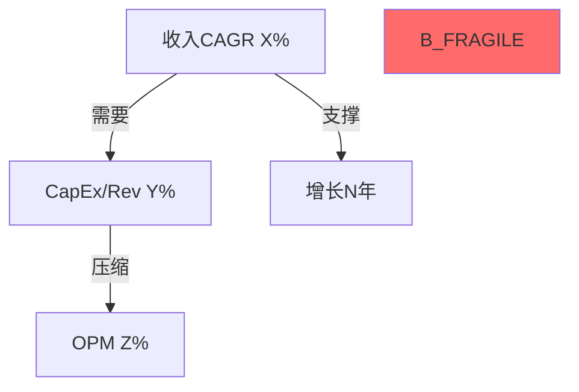

# 假设审计框架 v2.0

> **整合自**: belief-inversion v1.0 + consensus-deconstruction v1.0 + constraint-classifier v1.0
> **核心职责**: 拆解投资论文中的隐含假设——市场在赌什么(信念反演)、管理层在说什么(共识解构)、问题本质是什么(约束分类)。

## 触发条件与子模式选择

| 子模式 | 触发时机 | 触发信号 |
|--------|---------|---------|
| **M1 信念反演** | Phase 2 Reverse DCF完成后 | 隐含假设表已产出 / "市场在赌什么" |
| **M2 共识解构** | Phase 1或Phase 3 | 分析中出现"管理层表示"/"consensus预测"/"行业预计" |
| **M3 约束分类** | Phase 0.5 CQ定稿时 | CQ注册表确立 |

多个子模式可在同一份报告中同时使用。M3在最早阶段执行，M2在Phase 1/3执行，M1在Phase 2执行。

---

## Mode M1: 信念反演 (原 belief-inversion)

> **核心价值**: 把"公司值多少钱"转化为"市场必须相信什么"——后者更诚实、更可操作、更容易证伪。
> **来源验证**: GOOGL Ch14 (5/5) + APP Ch11 (4.5/5) | AMAT Ch10 (4/5, 缺后续步骤)

### M1.1 提取隐含信念集

从Reverse DCF结果中提取市场**必须同时相信**的假设:

```markdown
## 隐含信念集 — {TICKER} @ ${PRICE}

| # | 信念 | 隐含值 | 历史/行业锚 | 缺口 |
|---|------|:-----:|:---------:|:---:|
| B1 | [收入增长] | X% CAGR | 历史Y% | +Z% |
| B2 | [利润率趋势] | X% | 历史Y% | +Z% |
| B3 | [资本效率] | ROIC X% | 行业Y% | +Z% |
| B4 | [增长持续年限] | N年 | 典型M年 | +K年 |
| B5 | [终值假设] | X% | GDP+通胀Y% | +Z% |
| B6 | [行业特异] | ... | ... | ... |
```

**要求**: ≥5个信念，每个有外部锚点。

### M1.2 独立可验证性测试

对每个信念: **什么数据能在12个月内证实或证伪？**

标注哪些是**近期可验证**(6月内)，哪些是**远期才能验证**(24月+)。远期信念=更高不确定性溢价。

### M1.3 脆弱度排序

三维度评分(1-5): 历史支撑(5=远超历史) × 外部可控性(5=完全外部驱动) × 验证延迟(5=24月+)

排序总分 → 输出**Top 3最脆弱信念**。

### M1.4 信念一致性矩阵

测试信念**两两之间**逻辑关系(协同/矛盾/独立):
- **矛盾对**: 高增长需要高CapEx但压缩利润率 → 三者不可能同时成立
- **协同对**: B1失败则B4也倒
- **独立对**: 同时失败是低概率

**输出Mermaid**:


### M1.5 翻转分析

**核心问题**: 最少需要几个信念失败，评级就翻转？

- **单信念翻转测试**: 逐个测试每个信念失败的估值影响
- **双信念翻转测试**: 高概率失败组合的联合影响
- **结论**: 最脆弱路径 + 安全边际(能承受N个信念失败)

### M1.6 概率反演 (可选, 期望回报±5%时)

```markdown
| 场景 | 分析师概率 | 价格隐含概率 | 偏差 |
|------|:--------:|:----------:|:---:|

**解读**: 要justify当前价格，市场需要给[S3/S4] [X]%概率 — 这合理吗?
```

### M1 输出

写入Reverse DCF章节末尾: `## X.Y 信念反演: 市场必须相信什么?`
≥3K字符 | ≥5信念 | ≥6对一致性测试 | ≥1 Mermaid | 翻转分析必须含单+双信念测试

---

## Mode M2: 共识解构 (原 consensus-deconstruction)

> **核心价值**: 共识最危险的不是方向错，而是标题数字掩盖了底层结构。拆到组成单元后重建，偏差>20%就是非共识发现。
> **来源验证**: APP Ch15 客户漏斗 (5/5) + GOOGL Ch13 AIO回退 (4.5/5)

### M2.1 识别"支柱叙事"

从管理层/卖方中识别投资论文**最依赖**的1-2个叙事数字(论文依赖度"高")。

### M2.2 第一性原理拆分

三种拆分模式:

**模式A: 客户/用户漏斗** — 从注册/签约逐层到战略级，计算膨胀倍数
**模式B: 收入/TAM拆分** — 可寻址市场 × 渗透率 × ARPU × 净留存率 × 时间线，逐参数审计
**模式C: 行为vs言辞** — 管理层言辞 vs 实际行为(资源分配/产品决策)，标注一致性

### M2.3 偏差分析

| 偏差幅度 | 等级 | 行动 |
|:-------:|:---:|------|
| >50% | A级(重大) | 执行摘要提及 + 独立估值影响 |
| 20-50% | B级(显著) | 对应CQ闭环讨论 |
| <20% | C级(可忽略) | 记录不专项分析 |

每个A/B级发现需: 标题vs现实 + 结构性/周期性判定 + 估值影响 + 证伪条件

### M2.4 卖方参数审计 (当使用卖方预测时)

取卖方最强预测**逐参数**审计 → 修正后预测 → 判定系统性乐观还是特定偏差

### 经典非共识发现模式

1. **漏斗膨胀**: 标题客户数远超真实付费客户(APP 6400→60)
2. **时间线前移**: 卖方将FY2028目标放在FY2026(BofA APP)
3. **行为-言辞矛盾**: 说"all-in X"但CapEx流向Y(GOOGL AIO)
4. **集中度掩饰**: "多元化客户"实际top-10贡献65-80%
5. **口径差异**: 同一指标不同来源用不同定义(RBLX SBC含/不含DevEx)

### M2 输出

写入对应Phase staging: `## X.Y 共识解构: [叙事标题]`
≥2K per叙事 | ≥3层拆分 | 偏差>20%有估值影响 | DM锚点per重建值

---

## Mode M3: 约束分类 (原 constraint-classifier)

> **核心价值**: "结构性还是周期性"决定完全不同的分析路径。结构性=估值天花板，周期性=时机信号，制度性=情景概率。
> **来源验证**: APP D30归因偏差=结构性(5/5) | AMAT广度vs深度=未分类(3.5/5)

### M3.1 CQ分类

对每个CQ回答三个判断问题:

```
Q1: 公司自身努力能改变吗?
├── 是 → Q2: 改变需要多久?
│   ├── <2年 → 周期性 (C)
│   └── >5年/不确定 → 可能是结构性 (S)
└── 否 → Q3: 政策/法规变动能改变吗?
    ├── 是 → 制度性 (I)
    └── 否 → 结构性 (S)
```

```markdown
| CQ | 核心矛盾 | Q1 | Q2 | Q3 | 分类 |
|----|---------|:-:|:-:|:-:|:---:|
```

### M3.2 分类含义映射

| 类型 | 估值处理 | CQ闭环标准 | KS设计 |
|------|---------|-----------|-------|
| **结构性(S)** | 纳入终值(永久折价/天花板) | 量化天花板数值 | 监测突破信号 |
| **周期性(C)** | 情景概率加权 | 定位周期+预测拐点 | 监测拐点指标 |
| **制度性(I)** | 三情景模型 | 量化每情景EV+催化剂 | 监测政策催化剂 |

### M3.3 混合约束处理

标注**主约束**和**次约束**: `制度性(出口管制) + 结构性(国产替代长期化)`

### M3.4 分类回溯 (Phase 4)

Phase 4红队中检验分类是否正确，可升级/降级。

### M3 输出

写入CQ注册表新增"约束类型"列。每个CQ有S/C/I标注+判断依据。

---

## 行业适配 (三模式通用)

| 行业 | M1典型信念集 | M2典型支柱叙事 | M3常见约束 |
|------|------------|--------------|----------|
| 半导体 | WFE周期+份额+中国收入+CapEx回报 | "AI CapEx超级周期"/"份额扩张" | S:制程极限 C:WFE周期 I:出口管制 |
| 科技平台 | 用户增长+ARPU+CapEx→AI+监管 | "用户增长"/"AI变现" | S:网络效应衰减 C:广告周期 I:反垄断 |
| 消费品 | 定价权+渠道份额+成本+品牌 | "定价权"/"渠道扩张" | S:品类天花板 C:消费周期 I:关税 |
| 金融 | NIM+信用+AUM+监管成本 | "NIM扩张"/"AUM增长" | S:利率敏感度 C:信用周期 I:资本要求 |

## 质量门控 (合并)

| 检查项 | 要求 | 严重度 | 来源 |
|--------|------|:------:|:----:|
| ≥5个信念且有外部锚点 | 全部有锚 | BLOCK | M1 |
| 脆弱度排序Top 3 | 已标注 | BLOCK | M1 |
| 翻转分析(单+双信念) | 存在 | BLOCK | M1 |
| ≥1个支柱叙事被解构 | 高依赖度 | BLOCK | M2 |
| 拆分到可验证单元 | 独立数据源 | BLOCK | M2 |
| 全部CQ有约束分类 | S/C/I完整 | BLOCK | M3 |
| 一致性矩阵≥6对 | 协同/矛盾/独立 | WARN | M1 |
| 概率反演(±5%时) | 必做 | WARN | M1 |
| 偏差>20%有估值影响 | A/B级量化 | WARN | M2 |
| P4有分类回溯 | 审计表 | WARN | M3 |

## 与其他Skill的集成

| 上游 | 本Skill | 下游 |
|------|--------|------|
| Reverse DCF (Phase 2) | M1信念反演 | red-team-suite RT-1(承重墙=信念) |
| fmp_data + baggers_summary | M1外部锚点 | cq-lifecycle-tracker(信念→CQ) |
| 管理层/卖方叙事 (Phase 1/3) | M2共识解构 | Phase 5评级(非共识发现) |
| CQ定稿 (Phase 0.5) | M3约束分类 | 全Phase分析路径 |

---

*假设审计框架 v2.0 — 三种角度拆解隐含假设: 市场信什么、管理层说什么、问题是什么*
