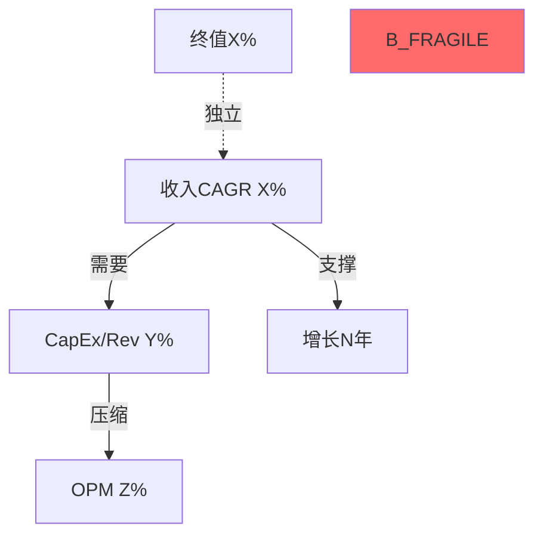

# 信念反演引擎 v1.0

> **核心价值**: 把"公司值多少钱"转化为"市场必须相信什么"——后者更诚实、更可操作、更容易证伪。
> **来源验证**: GOOGL Ch14 (5/5) + APP Ch11 (4.5/5) | AMAT Ch10 (4/5, 缺少后续步骤)

## 触发条件

Phase 2 Reverse DCF章节完成后**强制执行**。不可跳过。

检测信号:
- Reverse DCF隐含假设表已产出
- Agent A/C完成Ch10或等效Reverse DCF章节
- 用户指令包含"信念反演"/"belief"/"市场在赌什么"

## 为什么需要这个Skill

| 问题 | AMAT的教训 | 本Skill的解决方案 |
|------|-----------|-----------------|
| Reverse DCF停在"隐含假设表" | 发现18.8% FCF CAGR但没推到决策层 | 强制执行Step 2-5 |
| 假设被当作独立变量列举 | 7个假设并列，无优先级 | 按脆弱度排序 |
| 缺少信念组合测试 | "任意两个不利"是一句话，非分析 | 构建信念失败矩阵 |
| 结论模糊 | -2.1%="市场大致正确" | 输出"N个信念失败即翻转评级" |

## 执行流程

### Step 1: 提取隐含信念集

从Reverse DCF结果中提取市场**必须同时相信**的假设：

```markdown
## 隐含信念集 — {TICKER} @ ${PRICE}

| # | 信念 | 隐含值 | 历史/行业锚 | 缺口 |
|---|------|:-----:|:---------:|:---:|
| B1 | [收入增长] | X% CAGR | 历史Y% | +Z% |
| B2 | [利润率趋势] | X% | 历史Y% | +Z% |
| B3 | [资本效率] | ROIC X% | 行业Y% | +Z% |
| B4 | [增长持续年限] | N年 | 典型M年 | +K年 |
| B5 | [终值假设] | X% | GDP+通胀Y% | +Z% |
| B6 | [行业特异] | ... | ... | ... |
```

**要求**: ≥5个信念。每个信念必须有**外部锚点**(历史值/行业中位数/物理极限)。

### Step 2: 独立可验证性测试

对每个信念评估：**什么数据能在12个月内证实或证伪？**

```markdown
| 信念 | 验证方式 | 验证时间窗口 | 验证数据源 | 当前可得? |
|------|---------|:----------:|----------|:-------:|
| B1 | 下2个季度收入 | 6月 | 财报 | 否,待Q2 |
| B2 | 利润率趋势 | 6月 | 财报 | 否,待Q2 |
| B3 | CapEx回报 | 24月+ | 需多季度确认 | 否 |
```

**关键输出**: 标注哪些信念是**近期可验证**的(6月内)，哪些是**远期才能验证**的(24月+)。远期信念=更高的不确定性溢价。

### Step 3: 脆弱度排序

对每个信念按三维度评分(1-5分)：

```markdown
| 信念 | 历史支撑(1-5) | 外部可控性(1-5) | 验证延迟(1-5) | 脆弱度总分 |
|------|:----------:|:----------:|:----------:|:--------:|
| B1 | [历史CAGR支撑?] | [公司能控制?] | [多久能验证?] | Σ |
| B2 | ... | ... | ... | ... |
```

- **历史支撑**: 5=远超历史(极脆弱) / 1=在历史范围内(稳固)
- **外部可控性**: 5=完全外部驱动(政策/宏观) / 1=公司可控(产品/定价)
- **验证延迟**: 5=24月+才能验证 / 1=下个季度即可验证

**排序**: 总分最高=最脆弱的信念。输出**Top 3最脆弱信念**。

### Step 4: 信念一致性矩阵

测试信念**两两之间**的逻辑关系：

```markdown
| 信念对 | 关系 | 说明 |
|--------|:---:|------|
| B1×B2 | 协同/矛盾/独立 | [收入高增长是否需要利润率让步?] |
| B1×B3 | 协同/矛盾/独立 | [收入增长是否需要更多CapEx?] |
| B2×B5 | 协同/矛盾/独立 | [当前利润率是否可持续到终值期?] |
```

**关键发现模式**:
- **矛盾对**: B1(高增长)需要B3(高CapEx)但B3压缩B2(利润率) → 三者不可能同时成立
- **协同对**: B1(收入增长)支撑B4(增长持续) → 如果B1失败，B4也倒
- **独立对**: 真正独立的信念组合 → 同时失败是低概率

**输出Mermaid**:


### Step 5: 翻转分析

**核心问题**: 最少需要几个信念失败，评级就从当前档翻转到下一档？

```markdown
## 评级翻转条件

**当前评级**: [X关注] (期望回报 Y%)

### 单信念翻转测试
| 信念 | 若失败 | 新期望回报 | 是否翻转评级? |
|------|-------|:--------:|:----------:|
| B1失败(收入CAGR降至Z%) | EV变为$XB | Y'% | 是/否 |
| B2失败(OPM降至Z%) | EV变为$XB | Y'% | 是/否 |

### 双信念翻转测试
| 信念组合 | 联合概率 | 新期望回报 | 翻转? |
|---------|:------:|:--------:|:----:|
| B1+B3同时失败 | X% | Y'% | 是/否 |
| B2+B5同时失败 | X% | Y'% | 是/否 |

### 结论
- **最脆弱路径**: [哪个单信念失败即翻转?] 或 [哪个信念对失败即翻转?]
- **安全边际**: 当前价格能承受[N]个信念失败 / 不能承受任何信念失败
```

**GOOGL示例**: "$311精确定价在三面墙都不倒的场景，零安全边际" — 这是Step 5应该产出的结论。

### Step 6: 概率反演 (可选, 高价值)

当期望回报接近0%时(如AMAT -2.1%)，追加概率反演：

```markdown
## 概率反演: 当前价格隐含什么概率分配?

| 场景 | 分析师概率 | 价格隐含概率 | 偏差 |
|------|:--------:|:----------:|:---:|
| S1(熊市) | X% | Y% | -Z% |
| S2(基准) | X% | Y% | +Z% |
| S3(牛市) | X% | Y% | +Z% |
| S4(超级牛) | X% | Y% | +Z% |

**解读**: 要justify当前价格，市场需要给[S3/S4] [X]%概率 — 这合理吗?
```

**APP示例**: "要justify $133B EV，需给Moonshot场景48.5%概率" — 逼读者面对自己的信念位置。

## 输出规范

写入 Reverse DCF章节的**末尾独立小节**(不单独成章)，标题: `## X.Y 信念反演: 市场必须相信什么?`

| 指标 | 要求 |
|------|------|
| 信念数 | ≥5 |
| 脆弱度排序 | Top 3标注 |
| 一致性矩阵 | ≥6对测试 |
| 翻转分析 | 单信念+双信念 |
| Mermaid | ≥1 (信念关系图) |
| 字符 | ≥3K |
| DM锚点 | 每个信念≥1个 |

## 质量门控

| 检查项 | 要求 | 严重度 |
|--------|------|:------:|
| ≥5个信念且有外部锚点 | 全部有锚 | BLOCK |
| 脆弱度排序完成 | Top 3已标注 | BLOCK |
| 翻转分析存在 | 单信念+双信念 | BLOCK |
| 一致性矩阵≥6对 | 标注协同/矛盾/独立 | WARN |
| 概率反演(期望回报±5%内) | 接近0%时必做 | WARN |

## 与其他Skill的集成

| 上游 | 本Skill | 下游 |
|------|--------|------|
| Reverse DCF (Phase 2 Agent A/C) | 信念反演 | red-team-executor RT-1 (承重墙=信念) |
| fmp_data + baggers_summary | 外部锚点 | cq-lifecycle-tracker (信念→CQ映射) |
| constraint-classifier | 约束类型标注 | Phase 5评级 (翻转条件→评级决策) |

## 行业适配

| 行业 | 典型信念集重点 |
|------|-------------|
| 半导体 | WFE周期持续 + 份额维持/扩张 + 中国收入稳定 + CapEx回报 |
| 科技平台 | 用户增长 + ARPU扩张 + CapEx→AI回报 + 监管环境 |
| 消费品 | 定价权持续 + 渠道份额 + 成本输入稳定 + 品牌韧性 |
| 金融 | NIM维持 + 信用质量 + AUM增长 + 监管成本 |

---

*信念反演引擎 v1.0 — 从"值多少"到"必须信什么"*
