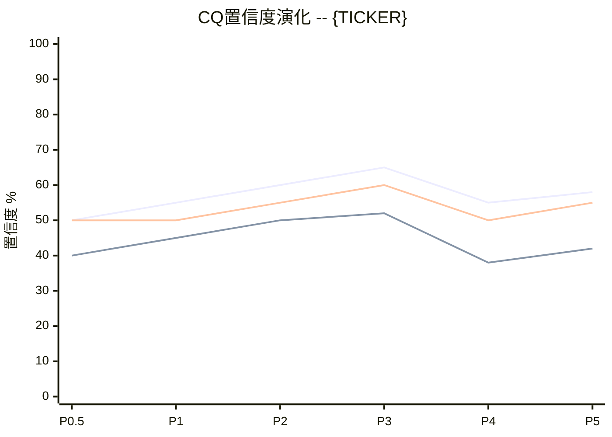

# CQ置信度演化追踪器 v1.0

> **核心职责**: 在每个Phase完成后追踪CQ置信度变化，生成演化表和加权平均，检测异常信号，确保研究过程中的置信度校准透明可追溯。

## 触发条件

每个Phase完成后自动调用(Phase 0.5 / 1 / 2 / 3 / 4 / 5):
- Phase完成且通过对应质量门控后
- orchestrator发出Phase完成信号时
- 用户手动请求"更新CQ"时

## 存储位置

`reports/{TICKER}/data/cq_evolution.md`

## 执行流程

### 初始化 (Phase 0.5完成时)

当Phase 0.5(争议发现)完成后，创建CQ演化追踪文件:

```markdown
# CQ置信度演化追踪 -- {TICKER}

> 创建日期: {DATE} | 股票: {TICKER} | CQ数量: {N}
> 最后更新: {DATE} | 当前Phase: P0.5

## CQ注册表

| CQ# | 问题 | 初始假设 | P0.5初始置信度 | 注意力权重 |
|-----|------|---------|:------------:|:--------:|
| CQ1 | [核心问题] | [初始假设] | X% | W1 |
| CQ2 | [核心问题] | [初始假设] | X% | W2 |
| CQ3 | [核心问题] | [初始假设] | X% | W3 |
| ... | ... | ... | ... | ... |

> 注意力权重说明: 权重反映该CQ对投资论文的重要性(0-1)，所有权重之和=1

## 演化记录

| CQ | P0.5 | P1 | P2 | P3 | P4 | P5 | 总变化 | 驱动因素 |
|:--:|:----:|:--:|:--:|:--:|:--:|:--:|:-----:|---------|
| CQ1 | 50% | -- | -- | -- | -- | -- | -- | 初始化 |
| CQ2 | 50% | -- | -- | -- | -- | -- | -- | 初始化 |
| CQ3 | 50% | -- | -- | -- | -- | -- | -- | 初始化 |

## Phase更新日志

### P0.5 初始化 ({DATE})
- CQ注册表创建，{N}个CQ，初始置信度均为50%
- 注意力权重分配依据: [简述分配逻辑]
```

### Phase更新 (每Phase完成后)

**执行步骤**:

1. **读取当前文件**: 读取 `reports/{TICKER}/data/cq_evolution.md`
2. **评估证据贡献**: 分析本Phase产出对每个CQ的证据影响
3. **计算新置信度**: 基于新证据调整置信度
4. **记录驱动因素**: 说明变化原因
5. **写回文件**: 更新演化记录表和日志

**置信度调整规则**:

| 证据类型 | 典型调整幅度 | 说明 |
|---------|:----------:|------|
| 强支持性硬数据(SEC Filing) | +10~+20pp | 如财报确认增长假设 |
| 中等支持性数据 | +5~+10pp | 如行业报告佐证趋势 |
| 中性/无新信息 | 0pp | 维持不变 |
| 中等挑战性数据 | -5~-10pp | 如竞争对手发布更好产品 |
| 强挑战性数据(红队发现) | -10~-20pp | 如RT发现承重墙脆弱 |
| 颠覆性发现 | -20~-40pp | 如发现数据造假/行业结构性变化 |

**Phase更新日志格式**:
```markdown
### P{N} 更新 ({DATE})

**本Phase关键发现**:
- [发现1]: 对CQ{X}影响 +/-Ypp
- [发现2]: 对CQ{X}影响 +/-Ypp

**CQ调整明细**:
| CQ# | 前值 | 后值 | 变化 | 驱动因素 |
|:---:|:----:|:---:|:----:|---------|
| CQ1 | X% | Y% | +/-Zpp | [具体原因] |

**本Phase CQ加权置信度**: XX.X%
```

### Phase 4特殊处理 (红队对抗后)

Phase 4更新从red-team-executor获取CQ调整建议:

1. 读取 `reports/{TICKER}/staging/S{N}_red_team_rt1_rt7.md` 中的CQ调整建议表
2. 对比red-team建议与当前置信度
3. 应用调整(P4通常是下调，下调是健康信号)
4. 标注"P4红队校准"

**P4健康信号检查**:
- P4后≥30%的CQ应有下调 → 红队有效
- P4后0个CQ下调 → 红队可能太弱，需要重审
- P4单个CQ下调≥25pp → 该CQ需要Phase 5重点关注

### Phase 5最终输出

#### 1. CQ加权置信度计算

```
CQ-Weighted Confidence = Sum(CQi最终置信度 x CQi注意力权重) / Sum(CQi注意力权重)
```

**输出格式**:
```markdown
## CQ加权置信度

| CQ# | 最终置信度 | 注意力权重 | 加权贡献 |
|:---:|:--------:|:--------:|:-------:|
| CQ1 | X% | W1 | X%*W1 |
| CQ2 | Y% | W2 | Y%*W2 |
| ... | ... | ... | ... |
| **加权平均** | | | **XX.X%** |
```

**解读指导**:
- ≥60%: 论文较强，多数核心问题有支撑
- 40-60%: 论文有争议，存在关键不确定性
- ≤40%: 论文脆弱，需谨慎对待分析结论

#### 2. 异常信号检测

执行以下3项异常检测:

**异常A: P4大幅下调 (≥15pp)**
```
检测: 任何CQ在P4的下调幅度≥15pp
含义: 红队挑战有效，该CQ的原始论证存在重大漏洞
行动: Phase 5必须对该CQ做专项闭环讨论
```

**异常B: P1到P5单调上升**
```
检测: 任何CQ从P0.5到P5每个Phase都上升(无下调)
含义: 可能存在确认偏误，研究过程缺乏自我挑战
行动: 在Phase 5报告中标注"确认偏误风险"警告
```

**异常C: CQ间置信度离散>30pp**
```
检测: 最高CQ置信度 - 最低CQ置信度 > 30pp
含义: 论文内部一致性差，部分核心问题未解决
行动: Phase 5必须讨论内部矛盾并给出解释
```

**异常信号输出格式**:
```markdown
## 异常信号检测

| 异常类型 | 检测结果 | 触发CQ | 严重度 | 建议行动 |
|---------|:-------:|--------|:-----:|---------|
| A: P4大幅下调 | 是/否 | CQ{X} | 高/中/低 | [行动] |
| B: 单调上升 | 是/否 | CQ{X} | 高/中/低 | [行动] |
| C: 离散度过高 | 是/否 | 最高CQ{X}/最低CQ{Y} | 高/中/低 | [行动] |
```

#### 3. Mermaid演化图



**图表要求**:
- 每个CQ一条线
- 所有6个Phase节点
- P4拐点应可视化体现(健康的分析应在P4有下调)

#### 4. CQ闭环总结

Phase 5最终闭环时，为每个CQ生成闭环摘要:

```markdown
### CQ{N} 闭环: [问题]

- **初始假设**: [P0.5假设]
- **最终结论**: [P5结论]
- **置信度轨迹**: P0.5({X}%) -> P1({X}%) -> P2({X}%) -> P3({X}%) -> P4({X}%) -> P5({X}%)
- **关键转折点**: P{N}，因为[原因]
- **剩余不确定性**: [什么仍不确定]
- **追踪信号**: [什么未来数据能提高/降低置信度]
```

## 与其他skill的集成

| Phase | 输入来源 | 输出目标 |
|-------|---------|---------|
| P0.5 | orchestrator(CQ列表+权重) | cq_evolution.md初始化 |
| P1 | Phase 1 staging产出 | cq_evolution.md P1列更新 |
| P2 | Phase 2 staging产出 | cq_evolution.md P2列更新 |
| P3 | Phase 3 staging产出 | cq_evolution.md P3列更新 |
| P4 | red-team-executor(CQ调整建议) | cq_evolution.md P4列更新 |
| P5 | 最终汇总 | Complete报告CQ闭环章节 |

## 执行规则

1. **每Phase必更新** -- Phase完成后必须调用，不可跳过
2. **变化必有因** -- 每次置信度调整必须记录具体驱动因素
3. **禁止无理由上调** -- 没有新证据支持时置信度不得上升
4. **P4必须有下调** -- 如果P4后零CQ下调，需要在日志中解释为什么红队未产生影响
5. **数据一致性** -- 演化表中的数字必须与Phase更新日志一致
6. **文件版本控制** -- 每次更新后通过git commit保存

## 质量门控

| 检查项 | 要求 | 严重度 |
|--------|------|:------:|
| cq_evolution.md文件存在 | P0.5后必须存在 | BLOCK |
| 所有CQ有完整演化记录 | 每个Phase列已填写 | BLOCK |
| CQ加权置信度已计算(P5) | 数值存在且公式正确 | BLOCK |
| 异常信号检测已执行(P5) | 3项检测均有结果 | WARN |
| Mermaid演化图存在(P5) | xychart-beta格式 | WARN |
| CQ闭环总结完整(P5) | 每个CQ有闭环摘要 | WARN |
| P4有≥1个CQ下调 | 红队有效性验证 | WARN |

---

*CQ置信度演化追踪器 v1.0 -- 让研究过程中的判断校准透明可追溯*
