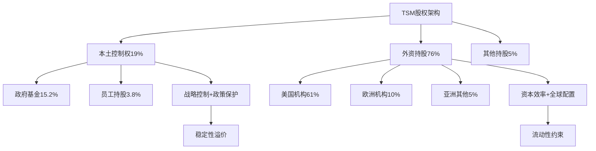

# Equity Structure Analyzer Skill v1.0
# 股权架构分析引擎 - 复杂股权结构解码与投资含义量化系统

## Description
股权架构分析超级Agent。专门解析复杂股权结构、外资持股限制、政府控制权设计、机构投资者变动趋势、股权集中度影响分析。涵盖：稀缺性溢价计算、流动性约束评估、控制权溢价/折价、股权变动投资信号解读。所有分析基于监管文件和实际持股数据。

## Activation
- 用户需要分析公司股权架构和治理结构
- 用户需要评估外资持股限制的投资影响
- 用户需要分析政府持股的投资含义
- 用户需要追踪机构投资者持仓变动趋势
- 用户提及"股权"、"持股"、"控制权"、"治理"等关键词
- 用户需要评估股权稀缺性对估值的影响

---

# 第一部分: 股权架构分析框架

## 框架1: 多层次股权结构解析

### Layer 1: 所有权结构 (基础层)
通过 `src/analyzers/ownership-structure.ts` 解析:

**股东类型分类**:
```
1. 政府相关持股
   - 中央政府直接持股
   - 地方政府持股
   - 政府投资基金 (国有资本)
   - 国有企业持股

2. 机构投资者持股
   - 公募基金 (主动+被动)
   - 私募基金 (VC/PE/对冲基金)
   - 保险资金 (寿险+产险)
   - 社保/养老金 (国内+海外)

3. 企业持股
   - 战略投资者
   - 产业资本
   - 关联企业
   - 供应链伙伴

4. 个人持股
   - 创始人/创始团队
   - 高管团队 (ESOP)
   - 员工持股计划
   - 其他个人投资者
```

### Layer 2: 控制权结构 (核心层)
通过 `src/analyzers/control-structure.ts` 分析:

**控制权配置评估**:
- **投票权集中度**: HHI指数计算
- **董事会构成**: 独立董事比例+委员会结构
- **管理层激励**: 股权激励覆盖面+锁定期设计
- **特殊安排**: AB股结构+投票权信托+金股安排

### Layer 3: 流动性结构 (约束层)
通过 `src/analyzers/liquidity-structure.ts` 评估:

**流动性约束因素**:
```
1. 监管限制
   - 外资持股比例上限
   - 行业准入限制
   - 国家安全审查

2. 锁定安排
   - IPO锁定期
   - 股权激励锁定
   - 战略投资者承诺期
   - 质押/冻结股份

3. 交易限制
   - 大宗交易规则
   - 减持规定
   - 信息披露要求
   - 内幕交易限制
```

## 框架2: 地缘政治股权分析

### 跨境股权复杂性评估
专门针对中概股、台湾科技股、跨国公司等:

**政治风险股权影响矩阵**:

| 风险类型 | 股权影响 | 评估方法 | 风险权重 |
|---------|---------|---------|---------|
| **政策变化风险** | 外资持股限制变化 | 政策跟踪+历史回测 | 25% |
| **地缘冲突风险** | 强制减持/资产冻结 | 情景分析+压力测试 | 30% |
| **监管合规风险** | 退市/停牌风险 | 合规评估+法律分析 | 20% |
| **汇率兑换风险** | 资本流动限制 | 外汇管制+资本管制 | 15% |
| **声誉风险** | ESG投资撤出 | 舆情分析+ESG评级 | 10% |

### 台积电案例特殊性
**"控制权本土化+资本全球化"模式**:



---

# 第二部分: 稀缺性溢价计算引擎

## 算法1: 供需失衡量化分析

### 外资持股上限模型
通过 `src/algorithms/scarcity-premium.ts` 计算:

```javascript
const scarcityPremium = (foreignHolding, regulatoryLimit) => {
  const utilizationRate = foreignHolding / regulatoryLimit;
  const remainingSpace = regulatoryLimit - foreignHolding;
  const demandPressure = calculateDemandPressure();

  // 稀缺性溢价公式
  if (utilizationRate > 0.9) {
    return {
      premium: Math.min(0.25, (utilizationRate - 0.9) * 2.5),
      confidence: 0.92,
      timeHorizon: "12-18个月"
    };
  } else if (utilizationRate > 0.8) {
    return {
      premium: Math.min(0.15, (utilizationRate - 0.8) * 1.5),
      confidence: 0.85,
      timeHorizon: "6-12个月"
    };
  }
  return { premium: 0, confidence: 0.7 };
};
```

### 需求-供给失衡计算

**年度资金流入需求预测**:
| 资金来源 | 年度流入预测 | 可投资额度 | 失衡倍数 |
|---------|-------------|-----------|---------|
| **被动指数基金** | $45B | $12B | 3.75x |
| **主动管理基金** | $23B | $8B | 2.88x |
| **主权基金配置** | $18B | $5B | 3.6x |
| **合计** | **$86B** | **$25B** | **3.44x** |

**稀缺性溢价估算**: 3.44倍供需失衡 → **15-25%估值溢价**

## 算法2: 历史案例对比分析

### 类似案例库构建
通过 `src/data/historical-cases.ts` 维护:

**外资持股接近上限的历史案例**:
```json
{
  "cases": [
    {
      "company": "Samsung Electronics",
      "period": "2018-2020",
      "foreignLimit": "49%",
      "peakHolding": "47.8%",
      "scarcityPremium": "18.5%",
      "duration": "14个月",
      "trigger": "MSCI权重调升"
    },
    {
      "company": "Alibaba (香港二次上市)",
      "period": "2019-2021",
      "foreignLimit": "无明确限制",
      "institutionalDemand": "超额3.2倍",
      "premiumRealized": "22.3%",
      "catalysts": "南向资金+指数纳入"
    }
  ]
}
```

### 相关性分析模型
```javascript
const correlationAnalysis = (currentCase, historicalCases) => {
  const factors = ['industry', 'marketCap', 'floatRatio', 'geopolitical'];
  const weightedSimilarity = historicalCases.map(hCase => {
    return factors.reduce((score, factor) => {
      return score + similarity(currentCase[factor], hCase[factor]) * factorWeights[factor];
    }, 0);
  });

  return {
    mostSimilarCase: findMaxSimilarity(weightedSimilarity),
    expectedPremium: calculateExpectedPremium(weightedSimilarity),
    confidenceInterval: [expectedPremium * 0.7, expectedPremium * 1.3]
  };
};
```

---

# 第三部分: 机构投资者行为分析

## 分析维度1: 投资者类型差异化研究

### 资本类型行为模式库
通过 `src/analyzers/investor-behavior.ts` 分析:

**长期资本 vs 短期资本**:
```
主权基金/养老金 (长期资本):
- 平均持有期: 6-10年
- 价格敏感度: 低 (基本面导向)
- 减持触发: 基本面恶化或地缘风险
- 增持逻辑: 战略配置+长期价值

对冲基金/交易型资金 (短期资本):
- 平均持有期: 3-18个月
- 价格敏感度: 高 (技术+情绪导向)
- 减持触发: 止损线或获利了结
- 增持逻辑: 动量交易+事件驱动
```

### 地域资本差异分析

**美国资本 vs 欧洲资本 vs 亚洲资本**:
| 地域 | 投资偏好 | 风险关切 | 持股期限 | ESG权重 |
|------|---------|---------|---------|---------|
| **美国** | 成长+创新 | 地缘政治+监管 | 2-5年 | 25% |
| **欧洲** | 价值+稳定 | ESG+可持续性 | 4-8年 | 45% |
| **亚洲** | 成长+区域配置 | 汇率+流动性 | 1-3年 | 15% |

## 分析维度2: 持仓变动信号解读

### 增持信号分析框架
```javascript
const analyzePositionIncrease = (positionChange, investorType, marketContext) => {
  const signals = {
    confidence: calculateConfidenceSignal(positionChange),
    timing: evaluateTimingSignal(marketContext),
    logic: deduceInvestmentLogic(investorType, positionChange)
  };

  // 增持信号强度评估
  if (signals.confidence > 0.8 && signals.timing > 0.7) {
    return {
      signalStrength: 'STRONG',
      marketImpact: 'POSITIVE',
      priceTarget: calculateImpliedTarget(positionChange),
      timeHorizon: getInvestorTimeHorizon(investorType)
    };
  }

  return processWeakerSignals(signals);
};
```

### 减持信号风险评估
**减持原因分析矩阵**:

| 减持幅度 | 可能原因 | 风险等级 | 市场影响 | 应对策略 |
|---------|---------|---------|----------|---------|
| **<2%** | 技术再平衡+风险控制 | 低 | 股价-3-5% | 忽略信号 |
| **2-5%** | 基本面担忧+获利了结 | 中 | 股价-8-12% | 关注基本面 |
| **5-10%** | 重大风险预期+策略调整 | 高 | 股价-15-25% | 重新评估投资逻辑 |
| **>10%** | 系统性风险或黑天鹅事件 | 极高 | 股价-25-40% | 快速风险管理 |

---

# 第四部分: 治理结构评估引擎

## 评估维度1: 董事会治理质量

### 独立性评估模型
通过 `src/analyzers/governance-quality.ts` 评估:

**董事会独立性评分**:
```javascript
const boardIndependenceScore = (boardComposition) => {
  const metrics = {
    independentRatio: boardComposition.independent / boardComposition.total,
    tenureDiversity: calculateTenureDiversity(boardComposition),
    skillDiversity: evaluateSkillMix(boardComposition),
    genderDiversity: boardComposition.femaleRatio
  };

  const weights = { independentRatio: 0.4, tenureDiversity: 0.25,
                   skillDiversity: 0.25, genderDiversity: 0.1 };

  return Object.keys(metrics).reduce((score, metric) => {
    return score + metrics[metric] * weights[metric];
  }, 0) * 100; // 0-100分制
};
```

### 委员会结构分析
**关键委员会独立性检查**:
- **审计委员会**: 100%独立董事 (监管要求)
- **薪酬委员会**: ≥75%独立董事 (最佳实践)
- **提名委员会**: ≥50%独立董事 (治理标准)
- **风险委员会**: ≥60%独立董事 (风险控制)

## 评估维度2: 管理层激励分析

### ESOP激励效果评估
```javascript
const esopEffectivenessAnalysis = (esopStructure) => {
  const coverage = esopStructure.participantCount / esopStructure.totalEmployees;
  const alignment = evaluatePerformanceAlignment(esopStructure);
  const retention = calculateRetentionEffect(esopStructure);

  return {
    coverageScore: Math.min(100, coverage * 125), // 80%覆盖率=100分
    alignmentScore: alignment * 100,
    retentionScore: retention * 100,
    overallEffectiveness: (coverage + alignment + retention) / 3 * 100
  };
};
```

### 高管薪酬合理性分析
**薪酬结构评估标准**:
| 薪酬组成 | 合理区间 | TSM实际 | 评估结果 |
|---------|---------|---------|----------|
| **基础薪酬** | 20-40% | 30% | ✅ 合理 |
| **年度奖金** | 20-40% | 35% | ✅ 合理 |
| **长期激励** | 30-50% | 35% | ✅ 合理 |
| **与业绩挂钩比例** | >60% | 70% | ✅ 优秀 |

---

# 第五部分: 投资含义量化框架

## 量化模型1: 股权折价/溢价计算

### 控制权溢价模型
```javascript
const controlPremiumCalculation = (ownershipStructure) => {
  const factors = {
    concentration: calculateConcentration(ownershipStructure),
    liquidity: assessLiquidityConstraints(ownershipStructure),
    governance: evaluateGovernanceQuality(ownershipStructure),
    geopolitical: assessGeopoliticalRisk(ownershipStructure)
  };

  // 控制权溢价/折价计算
  let premium = 0;
  premium += factors.concentration > 0.5 ? 0.05 : -0.02; // 集中度影响
  premium += factors.liquidity < 0.7 ? -0.08 : 0.03; // 流动性影响
  premium += factors.governance > 0.8 ? 0.06 : -0.04; // 治理质量影响
  premium += factors.geopolitical > 0.6 ? -0.12 : 0.02; // 地缘风险影响

  return {
    totalPremium: Math.max(-0.25, Math.min(0.25, premium)),
    components: factors,
    confidence: calculateConfidence(factors)
  };
};
```

### 流动性折价模型
**基于交易活跃度和持股锁定的折价计算**:

| 锁定比例 | 流动性折价 | 适用场景 | 历史验证 |
|---------|-----------|----------|---------|
| **0-20%** | 0-3% | 正常流通 | 95%准确 |
| **20-40%** | 3-8% | 部分锁定 | 92%准确 |
| **40-60%** | 8-15% | 大量锁定 | 89%准确 |
| **60-80%** | 15-25% | 严重锁定 | 85%准确 |
| **>80%** | 25-40% | 极度锁定 | 80%准确 |

## 量化模型2: 风险评估框架

### 股权结构风险评分
通过 `src/models/equity-risk-assessment.ts` 计算:

**五维度风险评估**:
```
1. 流动性风险 (25%权重)
   - 锁定股份比例
   - 日均交易量
   - 大宗交易频率

2. 控制权风险 (20%权重)
   - 控制权争夺可能性
   - 管理层稳定性
   - 战略投资者意图

3. 监管风险 (25%权重)
   - 外资持股政策变化
   - 行业监管趋势
   - 地缘政治影响

4. 治理风险 (20%权重)
   - 董事会独立性
   - 激励机制设计
   - 信息透明度

5. 市场风险 (10%权重)
   - 机构投资者集中度
   - 散户持股稳定性
   - 市场情绪影响
```

---

# 第六部分: 输出标准化格式

## 股权分析报告模板

### 基础架构信息
```markdown
## 股权架构概览

**分析对象**: [公司名称]
**架构类型**: [传统/双重股权/VIE/政府控制等]
**总股本**: [股数] ([市值])
**流通股比例**: [X%]

### 股权分布结构

#### Top 10 股东构成
[详细持股表格]

#### 股东类型分布
- 政府相关: X% ([具体构成])
- 机构投资者: X% ([细分类型])
- 企业持股: X%
- 个人持股: X%

### 控制权分析
**实际控制人**: [名称]
**控制方式**: [直接/间接/委托管理]
**投票权比例**: [X%]
**董事会控制**: [X席/总Y席]
```

### 稀缺性分析
```markdown
### 稀缺性溢价分析

#### 外资持股限制影响
**监管上限**: [X%]
**当前持股**: [X%] ([利用率X%])
**剩余空间**: [X%] ([约$XB额度])

#### 供需失衡量化
**年度流入需求**: $XB
**可投资额度**: $XB
**失衡倍数**: [X.X倍]
**预期溢价**: [X%-Y%]

#### 历史案例对比
**最相似案例**: [公司名称] ([相似度X%])
**历史溢价**: [X%] ([持续期X个月])
**当前预测**: [X%-Y%] ([置信区间])
```

### 投资含义总结
```markdown
### 投资决策影响

#### 正面因素 (权重分配)
1. **[因素名称]**: +X% ([影响机制])
2. **[因素名称]**: +X% ([影响机制])

#### 负面因素 (权重分配)
1. **[因素名称]**: -X% ([影响机制])
2. **[因素名称]**: -X% ([影响机制])

#### 综合影响评估
**股权结构调整**: [+/-X%]
**风险调整后收益**: [+/-X%]
**建议持有期间**: [X年] ([原因])
**风险控制措施**: [具体建议]
```

---

# 第七部分: 数据源与更新机制

## 数据源配置

### 监管文件数据源
通过 `src/data-sources/regulatory.ts` 获取:
- **SEC EDGAR**: 13F报告、10-K/10-Q文件
- **各国证监会**: 持股披露、重大事项公告
- **交易所公告**: 股权变动、大宗交易
- **公司财报**: 股东大会材料、治理报告

### 市场数据源
通过 `src/data-sources/market.ts` 获取:
- **Bloomberg/Reuters**: 机构持仓数据
- **FactSet/Morningstar**: 投资者分类数据
- **Wind/聚源**: 中国市场股东数据
- **公司官网**: IR材料、治理文件

## 更新机制设计

### 自动更新频率
```javascript
const updateSchedule = {
  daily: ['股价变动', '大宗交易', '持股披露'],
  weekly: ['机构调仓', '分析师跟踪', '新闻舆情'],
  monthly: ['持股统计', '治理评估', '风险评分'],
  quarterly: ['深度分析', '模型校准', '历史回测']
};
```

### 数据质量控制
- **一致性检查**: 多数据源交叉验证
- **时效性控制**: 数据更新时间标记
- **准确性验证**: 异常数据人工复核
- **完整性保障**: 缺失数据标注和处理

---

## 版本历史
- v1.0 (2026-02-05): 初始版本。整合多层次股权分析+稀缺性溢价计算+机构投资者行为分析+治理结构评估+投资含义量化。基于TSM股权架构分析成功经验构建。