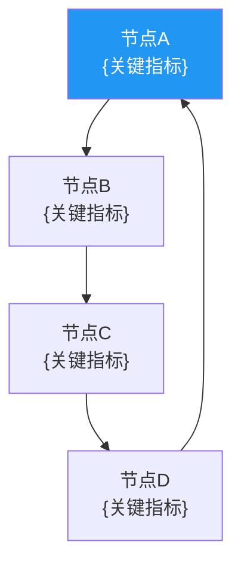

# 飞轮诊断技能 v1.0

> 来源: COST v21 会员飞轮分析 + PG 品牌飞轮分析
> 解决: "飞轮分析每次手动构建，每次重写"(Lessons Learned)

## 触发条件

- Phase 1 公司画像时（识别飞轮类型）
- Phase 3 护城河分析时（量化飞轮强度）
- 任何需要分析增长引擎可持续性时

## 支持的飞轮类型

| 类型 | 适用公司 | 核心循环 |
|------|---------|---------|
| **会员飞轮** | COST, AMZN(Prime) | 更多会员→更大采购量→更低成本→更低价格→更高续费 |
| **品牌飞轮** | PG, KO, NKE | 品牌投入→品牌认知→溢价能力→利润→更多品牌投入 |
| **平台飞轮** | META, GOOG, AMZN | 更多用户→更多数据→更好产品→更多用户 |
| **规模飞轮** | WMT, HD | 更多门店→更大采购量→更低成本→更低价格→更多客流 |
| **内容飞轮** | NFLX, SPOT | 更多用户→更多收入→更多内容→更多用户 |
| **自有品牌飞轮** | COST(Kirkland) | 更多会员→更大Kirkland销量→更好品质→更高忠诚度 |

## 执行流程

### Step 1: 飞轮识别

从公司商业模式中识别 1-3 个核心飞轮:

```markdown
## {TICKER} 飞轮识别

### 主飞轮: {类型}
{描述核心循环的每个节点}

### 辅助飞轮: {类型} (如有)
{描述}

### 飞轮间连接
{主飞轮和辅助飞轮如何互相强化}
```

### Step 2: 飞轮可视化

用 Mermaid 图展示飞轮结构:



### Step 3: 节点级量化

对飞轮的每个节点，提取量化指标并判断趋势:

```markdown
| 节点 | 关键指标 | T-2 | T-1 | 当前 | 趋势 | 诊断 |
|------|---------|-----|-----|------|:----:|------|
| 会员数 | 付费会员 | 71M | 76M | 81M | ↗ | 健康增长 |
| 采购量 | 每SKU采购量 | — | — | WMT 10x | → | 结构性优势 |
| 成本 | 毛利率 | 12.6% | 12.7% | 12.84% | → | 稳定 |
| 价格 | 价格竞争力 | — | — | 低于超市40%+ | → | 极强 |
| 满意度 | NPS | — | — | 52 | → | 行业领先 |
| 续费率 | 续费率(美加) | 92.5% | 92.9% | 92.3% | ↘ | ⚠️警示 |
```

### Step 4: 飞轮状态诊断

基于节点级数据，判断飞轮整体状态:

| 状态 | 判断标准 | 投资含义 |
|------|---------|---------|
| **加速** | ≥4/6节点指标改善 + 关键节点(续费率/增长)上升 | 看多信号，可能低估 |
| **稳态** | 节点指标稳定，无明显恶化 | 中性，关注估值合理性 |
| **减速** | 2-3个节点指标恶化 + 关键节点增速放缓 | 谨慎，需深入分析原因 |
| **破裂** | 关键节点崩塌(续费率<88%/客流连续负增长) | Hard Kill Switch，考虑退出 |

### Step 5: 飞轮强度评分

综合评分 1-5:

| 评分 | 含义 | 标准 |
|:----:|------|------|
| **5** | 强劲加速 | 所有节点正向 + 互相强化加速 |
| **4** | 健康运转 | 大多数节点正向 + 个别节点稳定 |
| **3** | 稳态/轻微减速 | 节点指标走平 + 个别恶化 |
| **2** | 明显减速 | 多个节点恶化 + 关键节点放缓 |
| **1** | 接近破裂 | 关键节点崩塌 + 飞轮反转风险 |

### Step 6: 飞轮风险与加速器

```markdown
## 飞轮风险 (可能减速/破裂的因素)
| 风险 | 影响节点 | 概率 | 影响度 | Kill Switch |
|------|---------|:----:|:-----:|------------|
| {风险1} | {节点} |  | 高/中/低 | {时间} |
```

## 输出模板

```markdown
# {TICKER} 飞轮诊断报告

## 飞轮识别
- 主飞轮: {类型}
- 辅助飞轮: {类型}

## 飞轮结构图 (Mermaid)
{图}

## 节点级量化
{表格}

## 飞轮状态: {加速/稳态/减速/破裂}
- 评分: {N}/5
- 关键发现: {1-2句}

## 风险与加速器
{表格}

## 投资含义
{基于飞轮状态的投资判断}
```

## 行业模板快速参考

### 会员飞轮 (COST/AMZN Prime)
核心节点: 会员数 → 采购规模 → 成本 → 价格 → 满意度 → 续费率
关键指标: 续费率, 每会员消费, 高级会员占比, 会员费增速

### 品牌飞轮 (PG/KO/NKE)
核心节点: 品牌投入 → 品牌认知 → 溢价 → 利润 → 再投入
关键指标: 品牌支出/收入比, 品牌溢价率, PVM增长质量, NPS

### 平台飞轮 (META/GOOG)
核心节点: 用户 → 数据 → 产品优化 → 用户体验 → 更多用户
关键指标: DAU/MAU, 数据飞轮效率, ARPU, 用户留存率

### 规模飞轮 (WMT/HD)
核心节点: 门店密度 → 物流效率 → 成本优势 → 价格竞争力 → 客流
关键指标: 同店增速, 坪效, SG&A率, 客流量趋势

## COST v21 实战参考

| 指标 | COST 实际值 |
|------|-----------|
| 主飞轮 | 会员飞轮(6节点) |
| 辅助飞轮 | Kirkland自有品牌飞轮 |
| 飞轮评分 | 4.0/5.0(健康运转，续费率微降为唯一警示) |
| 关键发现 | Executive升级+涨价弹性验证飞轮韧性，续费率92.3%微降需监控 |
