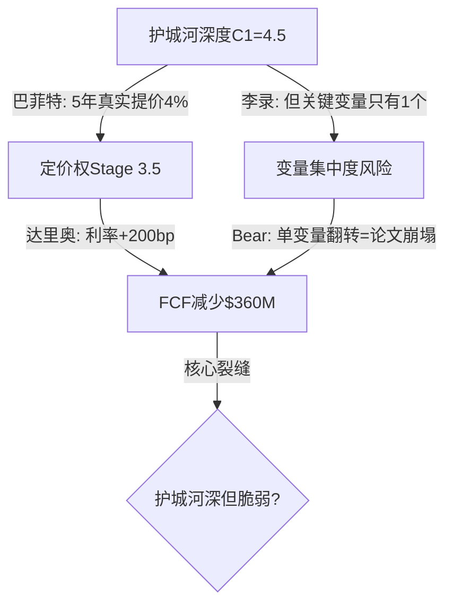

# 投资大师圆桌 v2.0 (Investment Masters Roundtable)

> **设计哲学**: 大师不是评审团，是**分析深化引擎**。每位大师带着自己的方法论工具箱参与分析，通过圆桌对话的碰撞把分析推入单一视角无法到达的深度。产出不是"大师认为X"，而是**经过方法论碰撞后的更深洞见**。
>
> **核心机制**: 螺旋深化 — Round 1独立方法论应用 → Round 2大师互相追问 → Round 3碰撞产出独特洞见。每一轮都比上一轮更深，因为新的问题是前一轮的答案催生的。

---

## 触发条件

| 场景 | 触发 |
|------|------|
| **手动** | `/roundtable {TICKER}` 或 "启动圆桌" |
| **自动(Tier 3)** | Phase 3完成后、Phase 4前，controversy_score ≥ 4 |
| **自动(Tier 2)** | 用户要求"深入分析"时，lite模式 |
| **独立使用** | 对任何已完成报告执行回顾性圆桌 |

---

## 7位大师 — 方法论工具箱（不是观点，是工具）

每位大师带来**不可替代的分析方法**。AI以大师名字做内部prompt steering，产出以"大师框架"标签呈现。

```yaml
masters:
  buffett:
    title: "沃伦·巴菲特 — 生意质量与护城河"
    unique_tools:
      - "护城河真伪检验: 定价权(5年累计提价vs通胀) + 转换成本(美元化) + 规模经济(份额差距)"
      - "Owner Earnings计算: 净利润+折旧-维护性CapEx-SBC，vs报告利润的差异"
      - "管理层资本配置记录: 每$1留存利润创造了多少市值增量?"
      - "能力圈边界: 能否一段话解释赚钱模式? 不能=直说超出能力圈"
    deepening_question: "10年后这道护城河还在不在？什么力量在侵蚀它？侵蚀速度可量化吗？"
    禁区: "短期股价、技术面、宏观预测"

  li_lu:
    title: "李录 — 关键变量提纯与认知折价"
    unique_tools:
      - "变量提纯: 列10个候选变量→敏感性测试(±20%)→保留影响>15%的→剔除<5%的→剩1-3个"
      - "认知折价分解: 总折价 = 基本面折价 + 制度折价 + 认知折价(市场误解)"
      - "第二层思维: 共识是什么→共识为什么可能错→如果共识对了但价格已反映呢?"
      - "新兴市场制度风险量化: 法治指数×产权保护×外汇管制→制度折价系数"
    deepening_question: "去掉所有噪音，决定80%价值的到底是哪1-2个变量？市场在这些变量上犯了什么错？"
    禁区: "面面俱到分析30个指标"

  ackman:
    title: "比尔·阿克曼 — 运营改善与催化剂"
    unique_tools:
      - "运营改善空间量化: SGA/Revenue vs 同业最佳 → 可释放利润率 → 美元值"
      - "催化剂清单: 6-18月内什么事件能释放隐藏价值? 每个催化剂的概率×影响"
      - "激进价值重建: 如果我是激进投资者，我会要求什么改变? 改变后估值提升多少?"
      - "治理评分: 董事会独立性 + 薪酬vs业绩对齐 + 反收购条款 + Skin-in-game"
    deepening_question: "管理层能不能让这个生意变得更好？具体怎么变？谁来推动？时间表是什么？"
    禁区: "只看当前状态不看改善潜力"

  druckenmiller:
    title: "斯坦·德鲁肯米勒 — 赔率、时点与预期差"
    unique_tools:
      - "预期差量化: 一致预期 vs 你的估计 → 偏差方向和幅度 → 偏差的持续时间"
      - "催化剂日历: 未来12月催化剂清单(财报/产品/监管/宏观) × 市场影响 × 概率"
      - "凸性评估: 上行/下行不对称性。对了赚Nx vs 错了亏Mx → N/M比"
      - "仓位拥挤度: 机构持仓集中度 + 期权隐含波动率 + 做空比例 → 拥挤方向"
    deepening_question: "即便方向对了，市场什么时候会认识到？现在是最优时点吗？赔率够不够？"
    禁区: "只看基本面不看预期差和时点"

  dalio:
    title: "瑞·达里奥 — 宏观机器与债务周期"
    unique_tools:
      - "债务周期定位: 短期周期(5-8年)位置 + 长期周期(75-100年)位置"
      - "利率敏感性矩阵: 利率每±100bp → 对Debt Service/FCF/估值的量化影响"
      - "宏观regime分类: 当前属于哪种regime(高增长低通胀/滞胀/衰退/通缩)→对公司影响"
      - "系统性联动: 这个公司失灵会连带什么? 什么系统性风险会传导到这个公司?"
    deepening_question: "什么宏观regime会让这个好公司失灵？债务结构是否在微观优势之上埋了地雷？"
    禁区: "只看公司层面不看宏观系统"

  cathie:
    title: "Cathie Wood — 非线性上行与技术颠覆"
    unique_tools:
      - "S曲线定位: 核心技术在渗透率曲线什么位置? 1-10%=爆发期"
      - "Wright定律: 累计产量每翻倍→成本下降X% → 当前学习曲线斜率"
      - "跨行业融合节点: AI×机器人×基因×能源×区块链的交叉点，公司是否处于节点?"
      - "5年逆向: 5年后这个公司可能变成什么? 从终局倒推当前定价是否合理"
    deepening_question: "市场是否用旧框架定价，忽视了技术/平台带来的非线性上行？5年后回看今天是便宜还是贵？"
    禁区: "主导成熟业务估值、对无技术杠杆的公司过度乐观"

  bear:
    title: "Bear检察官 — 拆楼与叙事解构"
    unique_tools:
      - "最脆弱假设检测: 投资论文中哪条假设最像幻觉? 用数据戳穿"
      - "会计质量三件套: Beneish M-Score + Altman Z-Score + SBC占比"
      - "叙事vs数字偏差表: 管理层最动人的叙事 vs 实际数字支撑度"
      - "历史类比失败: 找一个看起来像但最终失败的公司，分析相似度"
    deepening_question: "哪里最可能着火？哪条承重墙是空心的？什么信号出现必须撤？"
    硬约束: "权重永远>=12%，不可被多头氛围稀释"
```

---

## 动态权重 — 按公司类型智能适配

### 基础权重

```
buffett:18 | li_lu:18 | ackman:14 | druckenmiller:14 | dalio:12 | cathie:8 | bear:16
```

### 8种公司类型修正

| 类型 | 判定条件 | 高权重 | 低权重 |
|------|---------|--------|--------|
| **成熟价值** | A-Score≥7, PW≤3 | buffett+12, bear+4 | cathie-3, druck-9 |
| **高增长科技** | Revenue CAGR>25%, PW≥6 | cathie+22, bear+4 | buffett-8, li_lu-13 |
| **转型期** | 近期CEO变更/重组 | ackman+16, bear+4 | buffett-8, cathie-8 |
| **周期股** | 强周期行业标记 | dalio+18, druck+11 | buffett-8, li_lu-13 |
| **新兴市场** | 主要收入来自EM | li_lu+12, dalio+8 | buffett-8, bear-6 |
| **疑似欺诈** | 会计异常/做空报告 | bear+49 | 全部多头-8~-13 |
| **大型平台** | 市值>$300B+网络效应 | cathie+7, dalio+3 | bear-6, li_lu-8 |
| **行业横向** | 对比分析 | dalio+8, cathie+2 | buffett-3, li_lu-8 |

### 硬约束
- Bear floor: 永远 ≥ 12%
- Cathie ceiling: 除高增长/平台外 ≤ 15%
- 所有权重归一化到100

---

## 3种执行模式

### Lite — 快速圆桌 (~8分钟, 1 Agent)

```
适用: Tier 1-2 / 快速校验 / controversy_score < 4
引擎: 权重Top 2 + Bear(强制) = 3位大师
轮次: 仅Round 1(独立方法论应用)
产出: ~3K字符
```

### Standard — 深度圆桌 (~20分钟, 2-3 Agent并行)

```
适用: Tier 3 / controversy_score 4-6
引擎: 权重Top 4 + Bear(强制) = 5位大师
轮次: Round 1 + Round 2(互相追问) + Round 3(碰撞洞见)
产出: ~8-12K字符
```

### Full — 完整法庭 (~30分钟, 3 Agent并行)

```
适用: 高争议公司 / controversy_score ≥ 7 / 用户指定
引擎: 全部7位大师
轮次: Round 1 + Round 2 + Round 3 + Round 4(最终裁决)
产出: ~15-20K字符
```

---

## 核心机制: 螺旋深化协议 (v3.0升级: +主持人+行动标签+简言之+结构图)

### 主持人角色 (v3.0新增, 源自ljg-roundtable)

圆桌由一位**主持人**引导——不是某位大师，而是理性的裁判：
- **挖深不铺广**: 每轮只追一条最深的裂缝，不面面俱到
- **求真>和谐**: 鼓励尖锐但有建设性的交锋，拒绝表面共识
- **元认知**: 在综述中暴露讨论的**结构**(假设/前提/推理链)，不只复述内容
- **找最深裂缝**: 每轮结束时，从所有发言中提炼出最值得深挖的一个矛盾点

### Round 1: 独立方法论应用 (并行)

每位大师**独立**用自己的方法论工具箱分析公司。不是给观点，是**用工具产出具体数字和结论**。

```markdown
每位大师产出格式:

【巴菲特】【陈述】：[方法论应用结果, ≥200字, 必须含≥3个具体数字]
例: "定价权检验: 5年累计提价18% vs 通胀14% = 真实提价4%。
     Owner Earnings: GAAP NI $2.1B + D&A $0.8B - 维护CapEx $0.3B - SBC $0.5B = $2.1B。
     每$1留存利润创造$1.8市值(10年均值)——资本配置纪律良好。"

**简言之**: 护城河真实(4%真实提价)但资本回报效率在边际递减。
```

**行动标签** (v3.0新增): 每段发言必须标注类型——`陈述`|`质疑`|`补充`|`反驳`|`修正`|`综合`。强制分类防止自说自话。

**简言之** (v3.0新增): 每段发言末尾**一句话压缩到极致**。这不是可选的——它是每段发言的必要组件，强制大师提炼核心观点。

**关键规则**: 没有数字的判断=无效判断。没有行动标签的发言=无效发言。没有简言之的发言=不完整。

### Round 1综述: 主持人提炼+结构图

Round 1全部发言后，主持人做三件事：

1. **核心争议提炼**: 从所有发言中找到**最深的一条裂缝**——不是列清单，是找那个"如果这个问题的答案不同，整个投资论文就翻转"的争议点

2. **Mermaid结构图** (v3.0新增，替代ASCII图以匹配报告风格):


3. **下一层引导问题**: 从核心裂缝中生长出Round 2的追问方向

### Round 2: 大师互相追问 (动态发言轮)

**v3.0改进**: 不再固定每人说一次。主持人根据Round 1综述的**核心裂缝**决定谁该发言、发言顺序。

```
碰撞规则:
- 每个追问必须引用Round 1中的具体数据点
- 被追问的大师必须用自己的方法论工具回应(不是泛泛回答)
- 如果两个大师的方法论对同一问题给出矛盾结论 → 标记为"方法论冲突"
- 每段发言必须有行动标签+简言之

碰撞示例 (MAR):
  【李录】【质疑】→ 巴菲特: "你算出转换成本$847/人，但NPS只有15。
    高转换成本+低满意度=被锁定的不满客户。历史上有没有高锁定低满意
    最终崩溃的案例？"
  **简言之**: 锁定≠满意，不满的锁定是定时炸弹。

  【巴菲特】【反驳】: "有线电视2010-2020: 高转换成本+低NPS→
    流媒体出现后3年流失40%。MAR差异在积分沉没成本($2,400)——
    但李录的警告有效，积分贬值是Kill Switch。"
  **简言之**: 先例支持李录的警告——积分贬值是触发点。

  【达里奥】【补充】: "你们都在讨论微观护城河，但MAR 3.73x杠杆在
    利率+200bp时FCF减少$360M。护城河再强，债务吃掉现金流=安全边际是幻觉。"
  **简言之**: 宏观利率可以让微观护城河失效。
```

### Round 2综述: 主持人提炼+结构图

同Round 1综述格式——提炼更深的裂缝+更精准的结构图。

### Round 3: 碰撞产出独特洞见

汇总Round 1-2，提炼**只有通过碰撞才能产出的洞见**。

```markdown
产出格式 (直接可融入报告章节):

### [洞见标题——用报告正文的语气，非"大师认为"]

[≥150字分析，以第三人称、报告口吻写作。引用数据但不标注"巴菲特算出"——
 而是"定价权检验显示5年真实提价4%"。读者看到的应该是分析结论，
 不是圆桌讨论记录。]

**简言之**: [一句话]

来源: [碰撞标注，用报告DM格式] [DM-RT-001: 圆桌护城河×宏观碰撞]
估值影响: ±$X/share 或 ±N%
验证方法: [KS信号]
```

**v3.0关键改进——融入报告无痕迹**:
- 洞见用**报告正文口吻**写，不用"巴菲特认为"
- 来源标注用DM格式`[DM-RT-xxx]`，和报告其他DM一致
- 产出直接可插入护城河/估值/风险章节——读者不会知道这来自圆桌
- 方法论冲突记录放在**报告附录**或**staging**，不进正文

### Round 3综述: 全局知识网络 (v3.0新增)

主持人生成**全局Mermaid图**: 标出所有关键概念、立场、争议点及其关系。这个图可直接作为报告的分析框架图使用。

### Round 4: 最终裁决 (仅Full模式)

```markdown
## 圆桌裁决 (staging级，不进报告正文)
- 共识判断 (所有大师同意): [2-3条]
- 核心分歧 (不可调和): [2-3条, 保留张力]
- 催化剂日历 (德鲁肯米勒主导): [未来12月关键时点]
- Kill Switch清单 (Bear主导): [3-5个触发条件]
- 深化建议: [圆桌认为报告最需要补充深度的1-2个方向]
```

---

## 与现有框架的关系

### 定位: 分析深化工具，不是审查工具

```
现有工具:
  assumption-audit    → 审计信念 (检查)
  red-team-suite      → 攻击论文 (破坏)
  risk-topology       → 映射风险 (防御)
  valuation-quality   → 估值质量 (验证)

圆桌的独特价值:
  investment-committee → 方法论碰撞产出更深洞见 (深化)
```

**不替代任何现有工具。** RT-1~RT-7全部保留。圆桌是独立的深化层。

### Phase嵌入位置

```
Tier 3 流程:
  Phase 0.75 thesis_crystallization
      ↓
  Phase 1-3 (基本面+竞争+估值前置)
      ↓
  ★ 圆桌 (Phase 3后, Phase 4前) — 用Phase 1-3产出做深化
      ↓
  Phase 4 红队 (RT-1~RT-7, 圆桌洞见作为补充输入)
      ↓
  Phase 5 估值+评级
```

圆桌产出的洞见和方法论冲突 → 输入Phase 4红队 → 红队可以进一步攻击圆桌的结论。

### 圆桌产出进入报告的方式 (v3.0: 无痕融入)

**不是独立章节。** 圆桌的洞见**无缝融入**现有章节，读者完全不知道这来自圆桌讨论：

| 圆桌产出 | 融入位置 | 融入方式 |
|---------|---------|---------|
| 护城河深化洞见 | 护城河/竞争章节 | 以报告正文口吻写入，标注`[DM-RT-xxx]` |
| 催化剂日历 | 催化剂/情景章节 | 直接作为催化剂表格行 |
| 方法论冲突 | 估值敏感性分析 | 作为情景分歧的数据来源 |
| Kill Switch | 风险/KS追踪章节 | 直接作为KS条目 |
| 结构图(Mermaid) | 分析框架章节 | 直接作为章节内Mermaid图 |

**无痕规则** (v3.0核心改进):
1. **禁止**: "巴菲特认为"、"圆桌讨论发现"、"大师们一致认为"——这些痕迹让报告看起来像学生作业
2. **正确**: "定价权检验显示5年真实提价4%"、"利率+200bp情景下FCF减少$360M"——用分析结论，不用分析过程
3. **来源标注**: 用DM锚点`[DM-RT-001]`，和报告其他DM格式一致。附录中DM注册表标明来源是"圆桌方法论碰撞"
4. **简言之融入**: 圆桌中的"简言之"可以直接成为报告段落的总结句——因为它已经被压缩到一句话的精度

### 无痕改写模板 (v3.1新增)

**改写前(圆桌原文)**:
```
【巴菲特】【陈述】: Owner Earnings检验显示DDOG的SBC $766M使GAAP NI $108M
失真——真实Owner Earnings仅$235M。每$1留存利润只创造$0.3市值(10年)。
**简言之**: SBC掏空了GAAP利润，真实回报极低。
```

**改写后(无痕融入报告)**:
```
Owner Earnings视角揭示了GAAP利润的失真程度: FY2025 GAAP净利润$108M仅反映了
表面盈利, 扣除SBC经济成本后的真实股东可提取利润约$235M [DM-RT-001]。
更关键的是, 过去10年每$1留存利润仅创造$0.3市值增量——远低于SaaS行业中位的
$1.2。这意味着DDOG的资本再投资效率存在结构性问题, 而非简单的"高增速公司
利润低"的成长期特征。
```

**改写规则**:
1. 删除所有大师名字和行动标签
2. 将"简言之"展开为完整段落(加因果链)
3. 数据点保留但加DM-RT锚点
4. 加入因果推理("这意味着"/"因为→所以")
5. 检查: 如果读者不知道圆桌存在, 这段话读起来是否自然?

### 潜入检查清单 (v3.1新增, Phase 5组装时执行)

```bash
# 组装Complete报告前，检查圆桌痕迹是否已完全清除
grep -in '巴菲特\|芒格\|格雷厄姆\|李录\|段永平\|阿克曼\|德鲁肯米勒\|达里奥\|Cathie\|Bear检察官' {REPORT}
grep -in '圆桌\|roundtable\|大师认为\|大师们\|投资委员会' {REPORT}
grep -in '【陈述】\|【质疑】\|【补充】\|【反驳】\|【修正】\|【综合】' {REPORT}
# 以上3个grep结果应全部为0。任何匹配=无痕失败→必须改写。
# DM-RT锚点保留(这是正常的数据来源标注, 不是痕迹)。
```

### 44因子集成 (v3.1新增)

大师的方法论工具箱与CQI 44因子的映射——每位大师的分析自然对应到评分维度:

| 大师 | 方法论工具 | CQI因子映射 | 产出直接更新 |
|------|-----------|-----------|------------|
| 巴菲特 | 护城河真伪检验 | C1-C7全维度 | C总分调整 |
| 巴菲特 | Owner Earnings | B5利润弹性+B6资本配置 | B5/B6评分 |
| 巴菲特 | 定价权检验 | B4定价权证据 | B4评分+类型标注 |
| 李录 | 变量提纯 | CQ权重校准 | CQ权重重排 |
| 李录 | 认知折价分解 | D3被忽视度 | D3评分 |
| 阿克曼 | 运营改善量化 | B5利润弹性 | OPM天花板更新 |
| 阿克曼 | 治理评分 | B8管理层+B6资本配置 | B8评分 |
| 德鲁肯米勒 | 预期差量化 | CQ6估值(市场vs内在) | 评级置信度 |
| 德鲁肯米勒 | 凸性评估 | D1周期性×估值 | 风险收益比 |
| 达里奥 | 利率敏感性 | D1周期性 | D1评分调整 |
| 达里奥 | 系统性联动 | 风险拓扑协同矩阵 | 风险协同更新 |
| Cathie | S曲线定位 | B7 TAM跑道 | B7评分 |
| Cathie | 5年逆向 | CQ6估值+Reverse DCF | 估值交叉验证 |
| Bear | 最脆弱假设 | CQ脆弱度排序 | 红队输入 |
| Bear | 会计三件套 | QG-2/QG-5/B6(SBC) | 品质门控复检 |
| Bear | 历史类比失败 | competitive-benchmarking M2 | 竞品死亡参照 |

**执行规则**: 圆桌完成后, 检查哪些CQI因子被大师的分析覆盖→更新quality_scorecard.md中对应因子的评分和依据。

---

## 行业适配

| 行业 | 默认类型 | 核心3人圆桌 | 典型深化方向 |
|------|---------|------------|------------|
| 半导体 | cyclical | dalio+druck+bear | 周期位置×估值时点×下行风险 |
| 消费品 | mature_value | buffett+li_lu+ackman | 护城河持久性×关键变量×运营改善 |
| 科技平台 | large_platform | li_lu+cathie+bear | 关键变量×非线性上行×叙事解构 |
| 金融 | cyclical+leverage | dalio+buffett+bear | 债务周期×生意质量×会计质量 |
| 转型公司 | turnaround | ackman+druck+bear | 运营改善×催化剂时点×失败概率 |
| AI/颠覆 | high_growth | cathie+druck+bear | S曲线×赔率×泡沫检测 |

---

## 执行细节

### Agent分配 (Standard模式, 5大师)

```yaml
agent_1:  # 多头深化
  masters: [buffett, li_lu]
  role: "生意质量+关键变量深化"

agent_2:  # 催化剂+宏观
  masters: [ackman/druckenmiller, dalio]
  role: "运营改善+时点+宏观压力"

agent_3:  # 反方
  masters: [bear, (cathie if activated)]
  role: "拆楼+非线性扫描"
```

Round 1: 3个Agent并行(~8min wall-clock)
Round 2: 单Agent串行合成碰撞(~8min)
Round 3: 单Agent提炼洞见(~4min)

### 产出文件

```
reports/{TICKER}/data/
  roundtable_config.yaml      # 公司类型+权重+大师选配
  roundtable_transcript.md    # 完整圆桌记录(staging级)
  roundtable_insights.md      # 精炼洞见(进入报告)
```

### 质量门控

| 检查 | 要求 | 严重度 |
|------|------|:------:|
| 每位大师Round 1产出含具体数字 | ≥3个数据点/大师 | BLOCK |
| Round 2追问引用Round 1数据 | 每个追问引用≥1个数据点 | BLOCK |
| Round 3洞见标注碰撞来源 | 每个洞见标注A×B | BLOCK |
| 方法论冲突≥1个 | 至少1对大师有实质性分歧 | WARN |
| 洞见含估值影响量化 | ±$/share或±% | WARN |
| Bear权重≥12% | 硬约束 | BLOCK |

---

## 快捷命令

| 命令 | 含义 |
|------|------|
| `/roundtable {TICKER}` | 自动判断模式执行 |
| `/roundtable lite {TICKER}` | 3大师快速圆桌 |
| `/roundtable full {TICKER}` | 7大师完整法庭 |
| `/roundtable replay {TICKER}` | 对已完成报告重新圆桌 |

---

## 与deep-reflection集成

R2增加"圆桌深度评分":
```
D7: 方法论碰撞深度
  0分 = 无圆桌或圆桌产出纯观点无数字
  1分 = 有方法论应用但无碰撞(各说各的)
  2分 = 有碰撞+方法论冲突+量化洞见+融入报告
```

---

## 版本历史

| 版本 | 日期 | 变化 |
|------|------|------|
| v1.0 | 2026-03-06 | 初版: 审查式委员会 |
| v2.0 | 2026-03-06 | 重设计: 从审查→深化引擎。螺旋深化协议。大师方法论工具箱。不替代RT |
| **v3.0** | **2026-03-25** | **融入ljg-roundtable 4个机制**: (1)主持人角色(挖深不铺广+求真>和谐+每轮找最深裂缝) (2)行动标签(陈述/质疑/补充/反驳/修正/综合——强制分类发言) (3)简言之(每段一句话压缩) (4)Mermaid结构图(替代ASCII,匹配报告风格)。**无痕融入规则**: 产出以报告正文口吻写,DM-RT锚点标注,禁止"大师认为"痕迹 |
| **v3.1** | **2026-03-25** | **3项升级**: (1)无痕改写模板(前后对比+5条改写规则) (2)潜入检查清单(3条grep全零=通过) (3)44因子集成(7位大师×CQI因子映射表→圆桌产出直接更新评分卡) |

---

*投资大师圆桌 v3.1 — 方法论碰撞驱动的分析深化引擎 × 无痕潜入研报 × CQI集成*
