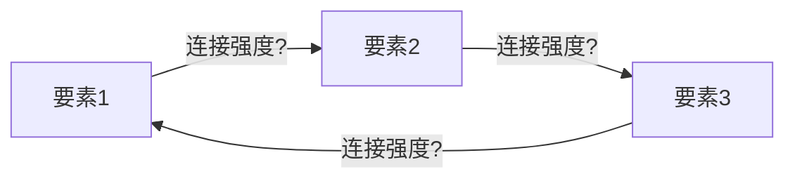

# 护城河评估器 v1.0 (Moat Evaluator)

> **定位**: 44因子CQI评分+飞轮分析的一键执行skill。确保每份Tier 3报告都有完整、标准化的护城河评估。
> **权威标准**: `docs/company_quality_scoring.md` v1.4 (44因子定义) + `knowledge/stock_picking/cqi_scoring_formula.md` v2.0 (公式)
> **产出**: `reports/{T}/data/quality_scorecard.md` + `reports/{T}/data/moat_datacard.yaml`

---

## 触发条件

| 场景 | 触发 |
|------|------|
| **手动** | `/moat-evaluate {TICKER}` |
| **自动(Tier 3)** | Phase 1完成后、Phase 2前 |
| **回顾** | `/moat-evaluate replay {TICKER}` 对已完成报告重评 |

---

## 执行流程 (4步)

### Step 1: 读取输入

```
必需输入:
- Phase 1产出(或phase1_summary.md)
- FMP财务数据(income/balance/cashflow/ratios)
- 行业worktree CLAUDE.md(行业修正系数)
```

### Step 2: 44因子逐项评分

#### A. 品质门控 (7项 Pass/Fail)

逐项检验QG-1~QG-7，标注Pass/Fail/豁免(含理由)。

#### B. 商业模型 (B1-B8, 各0-5分)

每项必须包含: **分数 + 一句话依据 + DM锚点**

```markdown
| # | 维度 | 分 | 依据 | DM |
|---|------|:--:|------|-----|
| B1 | 收入引擎 | ? | [引用报告数据] | [DM-xx] |
| B2 | 客户锁定 | ? | | |
| B3 | 收入经常性 | ? | | |
| B4 | 定价权 | ? | **标注类型: 市场/合同/制度** | |
| B5 | 利润弹性 | ? | | |
| B6 | 资本配置 | ? | **含η计算** | |
| B7 | TAM跑道 | ? | | |
| B8 | 管理层 | ? | | |
```

**行业加权**: 根据行业路由自动应用(半导体B5×1.5, 消费品B4×1.5等)

#### C. 护城河 (C1-C8, 各0-5分) — v1.6含MRVL升级

每项必须包含: **分数 + 依据 + 标注(C1嵌入性质+方向/C3载体+IP可许可检查)**

```markdown
| # | 维度 | 分 | 依据 | 标注 |
|---|------|:--:|------|------|
| C1 | 制度嵌入 | ? | | 性质+★方向(↑↑/↑/→/↓/↓↓) |
| C2 | 网络效应 | ? | | |
| C3 | 生态锁定 | ? | | 载体+★IP可许可检查 |
| C4 | 数据飞轮 | ? | | |
| C5 | 规模经济 | ? | | |
| C6 | 物理壁垒 | ? | | ★IP可许可检查 |
| C7 | 自维持性 | ? | **停止投入后多快消失** | |
| C8 | **价值传递** | ? | **Owner Yield+η+ROIC>WACC** | 梯队 |
```

**★ v1.6新增步骤 (EVO-MRVL, 多业务线公司必须)**:

Step 2a **MDI检查**(业务线≥2条且收入>15%时): MDI=max-min, >3.5→CQI失效→分部评分+SOTP
Step 2b **C1方向标签**: ↑↑强递增/↑弱递增/→稳定/↓弱衰减/↓↓强衰减。方向分裂→触发MDI
Step 2c **IP可许可降级**: 核心IP可许可→C3/C6 cap 3.0; 部分→cap 4.0; 独占→不限
Step 2d **增长侵蚀预警**: 增速最快业务护城河<加权均值→标注"增长侵蚀护城河"

**C8评分速查**(v1.5 EVO-CRWD-001):
- Owner FCF Yield = (FCF-SBC)/市值; η = 回购/SBC
- 5分: Yield>5%+η>3.0 | 4分: Yield>2%+η>1.0 | 3分: Yield>1%+η>0.5
- 2分: Yield>0.5%+η>0.1 | 1分: Yield<0.5%+η<0.1 | 0分: Yield<0.25%+η=0+ROIC<WACC
- **成长安全阀**: 增速>25%时C8最低=1.0

#### C-Extra: 护城河类型标注 (v1.1, AMD/NVDA对比验证)

C1-C7评分后，标注整体护城河类型:

| 类型 | 定义 | 估值含义 | C7自维持性 |
|------|------|---------|-----------|
| **防御型** | 存量锁定,不需持续投入 | PE溢价 | ≥4 |
| **进攻型** | 执行依赖,每代需重新证明 | PE折价10-15% | <2 |
| **混合型** | 核心防御+增量进攻 | 分引擎估值 | 2-4 |

#### ★ C-AI: AI抗性评级 (v1.2新增, 7家SaaS预期差分析验证)

> **来源**: INTU/PTC的护城河(监管/物理约束)对AI免疫,但市场按"AI杀SaaS"一刀切定价给了同样折扣(-35%~-47%)。三种护城河类型对AI的抗性完全不同,但C1-C7评分不区分这一点。
> **核心**: 同一个C1-C7高分的护城河,如果AI抗性低,未来可能快速贬值;如果AI抗性高,当前折扣可能是错杀。

**C1-C7评分完成后,对每个维度额外标注AI_resistance:**

```markdown
| # | 维度 | 分 | AI_resistance | AI影响路径 |
|---|------|:--:|:------------:|-----------|
| C1 | 制度嵌入 | ? | high/medium/low | AI是否能绕过制度要求? |
| C2 | 网络效应 | ? | high/medium/low | AI是否能替代网络? |
| C3 | 生态锁定 | ? | high/medium/low | AI是否降低迁移成本? |
| C4 | 数据飞轮 | ? | high/medium/low | AI是否让数据优势贬值? |
| C5 | 规模经济 | ? | high/medium/low | AI是否改变最低有效规模? |
| C6 | 物理壁垒 | ? | high/medium/low | AI无法改变物理现实 |
| C7 | 自维持性 | ? | high/medium/low | AI加速还是减缓护城河衰减? |
```

**三种护城河原型的AI抗性基准:**

```
Type A: 监管/物理约束型 — 整体AI_resistance = HIGH
  典型: 税法复杂度(INTU) / CAD物理约束(PTC) / 交易所监管(CME/ICE)
  逻辑: AI不能改变法规, 不能违反物理定律, 不能绕过监管牌照
  AI影响: AI增强(更高ASP)而非替代 → 护城河评分不因AI调低
  C-AI总分: 4-5

Type B: 数据/切换成本型 — 整体AI_resistance = MEDIUM
  典型: HR/Finance数据锁定(WDAY) / CRM客户数据(CRM) / ERP系统(SAP)
  逻辑: AI需要数据(利好数据拥有者), 但AI可能降低切换成本(利空锁定)
  AI影响: 双刃剑 — 数据价值上升但锁定可能松动 → 护城河评分±0.5
  C-AI总分: 3

Type C: 创意/工作流型 — 整体AI_resistance = LOW-MEDIUM
  典型: 创意工具(ADBE) / 工作流平台(NOW) / 知识管理(SNOW)
  逻辑: AI直接替代部分创意/工作流功能(Canva/AI agents)
  AI影响: 部分功能被替代 → 护城河评分可能下调0.5-1.5分
  C-AI总分: 1-2

Type D: AI基础设施型 — 整体AI_resistance = N/A(AI是利好)
  典型: 可观测性(DDOG) / GPU(NVDA) / 云平台(AMZN/MSFT/GOOG)
  逻辑: AI创造更多需求(更多基础设施=更多监控/计算)
  AI影响: 纯利好 → 护城河评分不调,但需检查"AI利好是否已定价"
  C-AI总分: 5(但不是因为"抗性"而是因为"顺风")
```

**输出**: moat_datacard.yaml新增字段:

```yaml
ai_resistance:
  overall: "high/medium/low"
  moat_type: "regulatory_physical / data_switching / creative_workflow / ai_infrastructure"
  c_ai_score: 0  # 1-5
  adjustment: 0  # 对C1-C7总分的调整值(-1.5 ~ +0.5)
  reasoning: ""
```

**与CQI的集成**: C-AI总分可作为CQI的调整因子——高AI抗性(4-5分)不调整,低AI抗性(1-2分)对CQI打折5-10%。具体公式待更多数据验证后确定。

标注格式: `护城河类型: 防御型(C7=4.5) | 代表: CME/FICO/TSM`

#### ★ Step 2.5: 存量vs增量护城河分离 (v1.5新增, EVO-NET-001, NET+KLAC双验证)

> **来源**: NET v2.0发现CQI=6.1但存量8.1/增量4.1差距4分; KLAC首次发明此分离
> **核心**: "留住老客户"和"赢得新客户"是完全不同的能力——单一CQI分数掩盖了这个差距

**C1+C2+C3+C5各自拆分为存量分和增量分**:

```markdown
| # | 维度 | 存量分(留客) | 增量分(获客) | 差距 |
|---|------|:----------:|:----------:|:---:|
| C1 | 嵌入性 | ?/5 | ?/5 | ? |
| C2 | 网络效应 | ?/5 | ?/5 | ? |
| C3 | 生态锁定 | ?/5 | ?/5 | ? |
| C5 | 规模经济 | ?/5 | ?/5 | ? |
| **加权** | | **?/10** | **?/10** | **?** |
```

**计算**:
```
加权存量分 = Σ(各维度存量分 × 收入权重by客户层)
加权增量分 = Σ(各维度增量分 × 增长贡献权重by战场)
差距 = |存量 - 增量|
```

**诊断**:
```
差距 < 1.0 → 均衡型(健康) — 标杆: KLAC(9/8)
差距 1.0-2.0 → 轻度分离(标注)
差距 2.0-3.0 → 守成型或增长型(警告) — 估值给折价/溢价
差距 > 3.0 → 严重分离(护城河结构性风险) — 标杆: NET(8.1/4.1)

存量 > 增量+2 → 守成型(类Akamai/Oracle) — 长期增速受限
增量 > 存量+2 → 增长型(类早期AWS) — 客户锁定待建
```

**输出**: moat_datacard.yaml新增字段:
```yaml
stock_flow_moat:
  stock_moat: 8.1  # 存量护城河(0-10)
  flow_moat: 4.1   # 增量护城河(0-10)
  gap: 4.0          # 差距
  type: "defensive"  # balanced/defensive/offensive/severely_split
  implication: "长期增速受限于新客获取效率"
```

**触发**: 所有Tier 3报告强制; Tier 2可选
**验证案例**: NET(8.1/4.1守成型), KLAC(9/8均衡型), ORCL(推测8.5/3.5守成型), CRWD(推测7/7均衡型)

#### ★ 护城河代际转换追踪 (v1.5新增, EVO-NET-004)

> **来源**: NET三层迁移(CDN→安全→平台), C7不捕捉"迁移中"状态

**C7评分后新增注释**(当公司有业务模式转型时):

```yaml
moat_migration:
  status: "migrating"  # stable/migrating/eroding/building
  from: "Layer描述"
  to: "Layer描述"
  progress: 35  # 0-100%
  crossover_year: 2028
  vacuum_risk: "medium"  # low/medium/high
```

**估值含义**: migrating+vacuum_risk=high → SOTP分别估值旧/新护城河

#### ★ C-AI Type E: 混合型/边缘型 (v1.5新增, EVO-NET-005)

新增第5种AI抗性原型:

```
Type E: 混合型/边缘型 — AI_resistance = CONTEXT-DEPENDENT
  典型: NET(边缘云+安全) / TWLO(通信+AI) / SNOW(数据+AI)
  逻辑: AI同时创造需求(利好)和改变模式(威胁)
  评分: 场景概率加权 → C-AI = Σ(P(场景) × C-AI(场景))
  例: NET = 45%×4 + 25%×1 + 30%×3 = 2.95
```

#### D. 回报修正

| 因子 | 评估 | 值 | 依据 |
|------|------|:--:|------|
| D1 | 周期性 | ×? | 反脆弱/反周期/非周期/弱周期/混合/监管压缩/强周期 |
| D2 | 收入纯度 | ?% | 低纯度必须还原真实OPM |
| D3 | 被忽视度 | +? | 市值+覆盖度 |
| D4/T | 趋势 | ×? | ↑/↗/→/↘/↓/⇊ |

#### 综合计算

```
加权分 = (B + C + D3) × D1 × T
品质溢价: OPM≥55%+FCF/NI≥100% → +3; OPM≥65% → +5
CQI = round((加权分 - 10) / 60 × 100)
```

#### 估值/护城河比率 (v1.1新增)

```
比率 = 当前PE ÷ (A-Score/10)
含义: 市场为每单位护城河支付多少PE倍数

  < 1.5x → 市场低估护城河(潜在机会)
  1.5-2.5x → 公平定价
  2.5-4.0x → 需要增速验证(市场在为护城河扩展付费)
  > 4.0x → 品质陷阱风险
```

标杆: ARM 19.8x(极端) | NVDA ~5x | CME ~3x | IHG ~2.1x

### Step 3: 飞轮分析 (新增模块)

> 不是每家公司都有飞轮。只有当公司宣称有"平台效应""网络效应""数据飞轮"或有多产品交叉销售时才执行。

#### 3a. 飞轮映射

识别公司宣称或实际存在的飞轮循环：



**每个连接评估**:
- **强连接(实线)**: 有直接因果关系+财务数据验证(如: 用户增长→数据增多→AI准确率提升→用户留存)
- **弱连接(虚线)**: 逻辑存在但缺乏数据验证(如: 品牌认知→溢价定价，但NPS在下降)
- **断裂连接(×)**: 逻辑不成立或数据否定(如: MCO评级垄断→数据优势，但数据实际不排他)

#### 3b. 飞轮悖论检测

> **源自CRM v2.0教训**: Agent成功→seat减少=加速器同时是刹车器

**必须检查**: 新产品/AI/自动化的成功是否蚕食核心产品？

```
检测公式:
  蚕食率 = 新产品带来的核心产品收入流失 / 新产品贡献的增量收入

  蚕食率 < 0.3 → 正常(新产品净增量)
  蚕食率 0.3-0.7 → 警告(新产品部分蚕食)
  蚕食率 > 0.7 → 悖论确认(新产品主要是替代而非增量)
```

**典型案例**:
- CRM: Agent成功→减少seat→蚕食率~0.5(警告)
- ADBE: AI生成→减少Creative Cloud需求→蚕食率待评估
- INTU: GenOS自动报税→减少TT Live需求→蚕食率待评估

#### 3c. 飞轮摩擦力分析 (新增)

每个飞轮都有摩擦力——阻止飞轮加速的反向力量：

| 摩擦力类型 | 识别方法 | 量化 |
|-----------|---------|------|
| **竞争摩擦** | 竞争对手是否在飞轮的某个环节截流？ | 份额变化趋势 |
| **规模反噬** | 飞轮越大是否越难管理(官僚/协调成本)？ | SGA/Rev趋势 |
| **监管摩擦** | 监管是否限制飞轮的某个环节(反垄断/数据隐私)？ | 诉讼/调查数量 |
| **技术摩擦** | 新技术是否绕过飞轮(AI直接替代某环节)？ | 替代品渗透率 |
| **认知摩擦** | 客户是否感知到飞轮的价值(vs只是被锁定)？ | NPS/满意度 |

#### 3d. 飞轮净效应判定

```
飞轮净效应 = 飞轮强度(连接数×平均强度) - 飞轮摩擦(摩擦力加权)  - 悖论蚕食

净效应 > 0.5 → 正飞轮(护城河在自动加深)
净效应 0~0.5 → 弱飞轮(存在但效果有限)
净效应 < 0 → 负飞轮(飞轮在反噬自身)
```

**飞轮净效应→C7自维持性的校准**: 正飞轮公司C7应≥4(自增强)。负飞轮公司C7应≤2(需要持续投入对抗摩擦)。

### Step 4: 输出产出文件

#### 产出1: quality_scorecard.md

```markdown
# {TICKER} 品质量化评分卡

## A. 品质门控: X/7
[表格]

## B. 商业模型: XX/40
[表格]

## C. 护城河: XX/35
[表格]

## D. 回报修正
D1=×X.XX D2=X% D3=+X T=×X.XX

## 飞轮分析
[Mermaid图 + 悖论检测 + 摩擦力 + 净效应]

## CQI计算
加权分 = XX.X → CQI = XX
排行榜位置: #XX (介于YY和ZZ之间)

## 校准检查
[与±3分邻居对比确认合理性]
```

#### 产出2: moat_datacard.yaml

```yaml
ticker: {TICKER}
date: {DATE}
cqi: XX
b_total: XX
c_total: XX
d1: X.XX
t_trend: X.XX
c1_nature: "偏好/标准/封锁/定义/独占"
c3_carrier: "系统/数据/流程/人力"
c7_self_sustain: X
flywheel_net: X.X
flywheel_paradox: false/true
pricing_power_type: "市场/合同/制度"
pricing_power_stage: X.X
moat_trend: "↑/↗/→/↘/↓/⇊"
leaderboard_rank: XX
  # v1.1新增: 多引擎半衰期 (27份报告验证)
  half_life_by_engine:
    - engine: ""        # 收入引擎名称
      revenue_pct: ""   # 占总收入比例
      half_life: ""     # 该引擎的护城河半衰期
    # 触发条件: ≥2个引擎且半衰期差>2x
    # 例: CME清算>30年/数据>15年/利息<5年
  half_life_warning: "" # 短半衰期引擎的估值含义
```

---

## 与报告的融入方式

**护城河评估产出→无痕融入报告正文**:

| 产出 | 融入位置 | 融入方式 |
|------|---------|---------|
| B1-B8评分 | 业务分析章节 | 作为论点的数据支撑 |
| C1-C7评分 | 护城河章节 | 分项展开为独立段落 |
| 飞轮分析 | 竞争/护城河章节 | Mermaid图+飞轮净效应判定 |
| 飞轮悖论 | 风险章节 | 作为核心风险条目 |
| CQI排名 | 执行摘要 | 一行"CQI XX, 排名#XX" |
| moat_datacard | 报告附录 | YAML数据卡 |

**无痕规则**: 报告正文不出现"B4=3.5"这样的评分——而是"定价权检验显示5年提价18% vs 通胀14%=真实提价4%"。评分卡在staging/data中，不进正文。

---

## 版本

| 版本 | 日期 | 变更 |
|------|------|------|
| v1.0 | 2026-03-25 | 初版: 44因子一键评分+飞轮分析(映射+悖论+摩擦力+净效应)+双产出(scorecard+datacard) |
