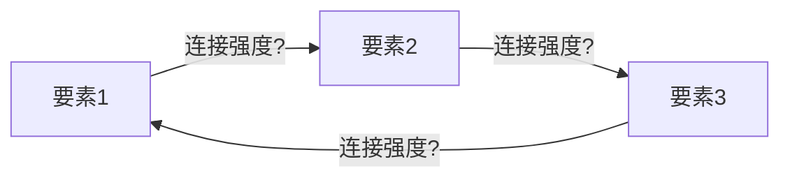

# 护城河评估器 v2.5 (Moat Evaluator)

> **定位**: 44因子CQI评分+飞轮分析+长牛 OS 4 个正交维度 的一键执行skill。确保每份Tier 3报告都有完整、标准化的护城河评估。
> **权威标准**: `docs/company_quality_scoring.md` v1.4 (44因子定义) + `knowledge/stock_picking/cqi_scoring_formula.md` v2.0 (公式) + `memory/long_compounder_unique_upgrades.md` (v2.5 新增维度方法论)
> **产出**: `reports/{T}/data/quality_scorecard.md` + `reports/{T}/data/moat_datacard.yaml`
>
> **v2.0核心升级** (源自NET/MRVL分析洞察):
> - EVO-01: 多业务线异质性处理(MDI检查+分部评分)
> - EVO-02: 护城河方向性标签(↑↑/↑/→/↓/↓↓动态评估)
> - EVO-03: IP可许可性降级机制(核心/部分/独占分层)
> - EVO-04: 增长侵蚀护城河预警(高增速业务低护城河检测)
> - EVO-05: 护城河衰减函数建模(动力学评估+半衰期计算)
>
> **v2.5核心升级** (源自 reports/美股大牛股复盘/ 73 文件吸收, FICO/MSCI/ORLY/NVR/ISRG 案例验证):
> - EVO-06: 语言/标准层控制点(C1 嵌入性的最高一级——成为行业默认语言)
> - EVO-07: EPD 错误传播深度 L0-L5(8 维度,WCC 的传播路径升级)
> - EVO-08: Second-Best Gap 第二选择差距(可观察护城河——竞品 feature/cost/adoption 三维对标)
> - EVO-09: Migration Asymmetry 迁移不对称 8 维(C3 生态锁定的展开,客户试新快但关旧慢)

---

## 触发条件

| 场景 | 触发 |
|------|------|
| **手动** | `/moat-evaluate {TICKER}` |
| **自动(Tier 3)** | Phase 1完成后、Phase 2前 |
| **回顾** | `/moat-evaluate replay {TICKER}` 对已完成报告重评 |

---

## 执行流程 (4步)

### Step 1: 读取输入

```
必需输入:
- Phase 1产出(或phase1_summary.md)
- FMP财务数据(income/balance/cashflow/ratios)
- 行业worktree CLAUDE.md(行业修正系数)
```

### Step 2: 44因子逐项评分

#### A. 品质门控 (7项 Pass/Fail)

逐项检验QG-1~QG-7，标注Pass/Fail/豁免(含理由)。

#### B. 商业模型 (B1-B8, 各0-5分)

每项必须包含: **分数 + 一句话依据 + DM锚点**

```markdown
| # | 维度 | 分 | 依据 | DM |
|---|------|:--:|------|-----|
| B1 | 收入引擎 | ? | [引用报告数据] | [DM-xx] |
| B2 | 客户锁定 | ? | | |
| B3 | 收入经常性 | ? | | |
| B4 | 定价权 | ? | **标注类型: 市场/合同/制度** | |
| B5 | 利润弹性 | ? | | |
| B6 | 资本配置 | ? | **含η计算** | |
| B7 | TAM跑道 | ? | | |
| B8 | 管理层 | ? | | |
```

**行业加权**: 根据行业路由自动应用(半导体B5×1.5, 消费品B4×1.5等)

#### ★ v2.0 Pre-Step: 多业务线预检
在进行44因子评分前，执行**业务线异质性预检**:
```
1. 业务线识别: 收入占比>15%的独立业务单元
2. 异质性快速检测: 不同业务线的护城河特征差异
3. 评分模式选择:
   - 单一业务主导(>80%收入) → 标准44因子流程
   - 多业务均衡但同质 → 标准流程 + MDI验证
   - 多业务异质(预期MDI>3.5) → 分业务线评分 + SOTP整合
```

#### C. 护城河 (C1-C8, 各0-5分) — v2.0含5个EVO升级

每项必须包含: **分数 + 依据 + 标注(C1嵌入性质+方向/C3载体+IP可许可检查)**

```markdown
| # | 维度 | 分 | 依据 | 标注 |
|---|------|:--:|------|------|
| C1 | 制度嵌入 | ? | | 性质+★方向(↑↑/↑/→/↓/↓↓) |
| C2 | 网络效应 | ? | | |
| C3 | 生态锁定 | ? | | 载体+★IP可许可检查 |
| C4 | 数据飞轮 | ? | | |
| C5 | 规模经济 | ? | | |
| C6 | 物理壁垒 | ? | | ★IP可许可检查 |
| C7 | 自维持性 | ? | **停止投入后多快消失** | 衰减函数 |
| C8 | **价值传递** | ? | **Owner Yield+η+ROIC>WACC** | 梯队 |
```

#### ★ v2.0 EVO升级执行流程

**Step 2a: EVO-01多业务线异质性检测(MDI)**
```
触发条件: 业务线≥2条且任一收入占比>15%
检测公式: MDI = max(C1-C8) - min(C1-C8)
阈值判定: MDI >3.5 → CQI失效 → 必须分业务线评分+SOTP
异质性标注: 标识导致异质性的维度(例: "C3异质:数据业务4.5 vs 硬件1.5")
```

**Step 2b: EVO-02护城河方向性标签(全部C1-C8维度)**
```
↑↑ 强递增: 护城河快速加深(年化提升>0.5分)
↑  弱递增: 护城河缓慢加深(年化提升0.2-0.5分)
→  稳定: 护城河维持现状(±0.2分)
↓  弱衰减: 护城河缓慢削弱(年化衰减0.2-0.5分)
↓↓ 强衰减: 护城河快速削弱(年化衰减>0.5分)

方向分裂触发: 如C1↑↑但C3↓↓ → 重新评估MDI
异常模式: 全维度↓但CQI仍高 → "后视镜护城河"警告
```

**Step 2c: EVO-03 IP可许可性降级机制**
```
IP可许可性检查(C3生态锁定 + C6物理壁垒):
1. 核心IP可许可: 关键专利/技术对外授权 → C3/C6 cap at 3.0
2. 部分IP可许可: 非核心专利授权/标准FRAND → C3/C6 cap at 4.0
3. 独占IP: 专利/know-how严格保护 → C3/C6 无上限

触发案例:
- ARM: CPU架构大量授权 → C6 cap 3.0
- Qualcomm: 5G/WiFi标准FRAND → C6 cap 4.0
- ASML: EUV技术独占 → C6 无上限
```

**Step 2d: EVO-04增长侵蚀护城河预警**
```
检测逻辑: 增速最快业务的护城河分数 < 整体加权平均护城河分数
警告触发: 差距>1.0分且高增速业务收入贡献>20%

例: NET边缘云增速50%(护城河3.2) vs 安全增速15%(护城河4.8)
→ 高增速业务拖累整体护城河 → 标注"增长侵蚀护城河"
含义: 增长来自低护城河业务 → 未来定价权/留存可能恶化
```

**Step 2e: EVO-05护城河衰减函数建模**
```
为每个C1-C7维度建模衰减函数:

衰减类型:
- 指数衰减: C4数据飞轮(算法更新快) → 半衰期1-2年
- 线性衰减: C2网络效应(替代网络出现) → 固定年化衰减
- 阶跃衰减: C1制度嵌入(监管突变) → 突然归零
- 无衰减: C6物理壁垒(地理位置) → 理论永续

衰减函数: C(t) = C(0) × decay_function(t, half_life, decay_type)
综合评估: 加权平均各维度的期望护城河价值(3年/5年/10年)
```

**C8评分速查**(v1.5 EVO-CRWD-001):
- Owner FCF Yield = (FCF-SBC)/市值; η = 回购/SBC
- 5分: Yield>5%+η>3.0 | 4分: Yield>2%+η>1.0 | 3分: Yield>1%+η>0.5
- 2分: Yield>0.5%+η>0.1 | 1分: Yield<0.5%+η<0.1 | 0分: Yield<0.25%+η=0+ROIC<WACC
- **成长安全阀**: 增速>25%时C8最低=1.0

#### C-Extra: 护城河类型标注 (v1.1, AMD/NVDA对比验证)

C1-C7评分后，标注整体护城河类型:

| 类型 | 定义 | 估值含义 | C7自维持性 |
|------|------|---------|-----------|
| **防御型** | 存量锁定,不需持续投入 | PE溢价 | ≥4 |
| **进攻型** | 执行依赖,每代需重新证明 | PE折价10-15% | <2 |
| **混合型** | 核心防御+增量进攻 | 分引擎估值 | 2-4 |

#### ★ C-AI: AI抗性评级 (v1.2新增, 7家SaaS预期差分析验证)

> **来源**: INTU/PTC的护城河(监管/物理约束)对AI免疫,但市场按"AI杀SaaS"一刀切定价给了同样折扣(-35%~-47%)。三种护城河类型对AI的抗性完全不同,但C1-C7评分不区分这一点。
> **核心**: 同一个C1-C7高分的护城河,如果AI抗性低,未来可能快速贬值;如果AI抗性高,当前折扣可能是错杀。

**C1-C7评分完成后,对每个维度额外标注AI_resistance:**

```markdown
| # | 维度 | 分 | AI_resistance | AI影响路径 |
|---|------|:--:|:------------:|-----------|
| C1 | 制度嵌入 | ? | high/medium/low | AI是否能绕过制度要求? |
| C2 | 网络效应 | ? | high/medium/low | AI是否能替代网络? |
| C3 | 生态锁定 | ? | high/medium/low | AI是否降低迁移成本? |
| C4 | 数据飞轮 | ? | high/medium/low | AI是否让数据优势贬值? |
| C5 | 规模经济 | ? | high/medium/low | AI是否改变最低有效规模? |
| C6 | 物理壁垒 | ? | high/medium/low | AI无法改变物理现实 |
| C7 | 自维持性 | ? | high/medium/low | AI加速还是减缓护城河衰减? |
```

**三种护城河原型的AI抗性基准:**

```
Type A: 监管/物理约束型 — 整体AI_resistance = HIGH
  典型: 税法复杂度(INTU) / CAD物理约束(PTC) / 交易所监管(CME/ICE)
  逻辑: AI不能改变法规, 不能违反物理定律, 不能绕过监管牌照
  AI影响: AI增强(更高ASP)而非替代 → 护城河评分不因AI调低
  C-AI总分: 4-5

Type B: 数据/切换成本型 — 整体AI_resistance = MEDIUM
  典型: HR/Finance数据锁定(WDAY) / CRM客户数据(CRM) / ERP系统(SAP)
  逻辑: AI需要数据(利好数据拥有者), 但AI可能降低切换成本(利空锁定)
  AI影响: 双刃剑 — 数据价值上升但锁定可能松动 → 护城河评分±0.5
  C-AI总分: 3

Type C: 创意/工作流型 — 整体AI_resistance = LOW-MEDIUM
  典型: 创意工具(ADBE) / 工作流平台(NOW) / 知识管理(SNOW)
  逻辑: AI直接替代部分创意/工作流功能(Canva/AI agents)
  AI影响: 部分功能被替代 → 护城河评分可能下调0.5-1.5分
  C-AI总分: 1-2

Type D: AI基础设施型 — 整体AI_resistance = N/A(AI是利好)
  典型: 可观测性(DDOG) / GPU(NVDA) / 云平台(AMZN/MSFT/GOOG)
  逻辑: AI创造更多需求(更多基础设施=更多监控/计算)
  AI影响: 纯利好 → 护城河评分不调,但需检查"AI利好是否已定价"
  C-AI总分: 5(但不是因为"抗性"而是因为"顺风")
```

**输出**: moat_datacard.yaml新增字段:

```yaml
ai_resistance:
  overall: "high/medium/low"
  moat_type: "regulatory_physical / data_switching / creative_workflow / ai_infrastructure"
  c_ai_score: 0  # 1-5
  adjustment: 0  # 对C1-C7总分的调整值(-1.5 ~ +0.5)
  reasoning: ""
```

**与CQI的集成**: C-AI总分可作为CQI的调整因子——高AI抗性(4-5分)不调整,低AI抗性(1-2分)对CQI打折5-10%。具体公式待更多数据验证后确定。

标注格式: `护城河类型: 防御型(C7=4.5) | 代表: CME/FICO/TSM`

#### ★ Step 2.5: 存量vs增量护城河分离 (v1.5新增, EVO-NET-001, NET+KLAC双验证)

> **来源**: NET v2.0发现CQI=6.1但存量8.1/增量4.1差距4分; KLAC首次发明此分离
> **核心**: "留住老客户"和"赢得新客户"是完全不同的能力——单一CQI分数掩盖了这个差距

**C1+C2+C3+C5各自拆分为存量分和增量分**:

```markdown
| # | 维度 | 存量分(留客) | 增量分(获客) | 差距 |
|---|------|:----------:|:----------:|:---:|
| C1 | 嵌入性 | ?/5 | ?/5 | ? |
| C2 | 网络效应 | ?/5 | ?/5 | ? |
| C3 | 生态锁定 | ?/5 | ?/5 | ? |
| C5 | 规模经济 | ?/5 | ?/5 | ? |
| **加权** | | **?/10** | **?/10** | **?** |
```

**计算**:
```
加权存量分 = Σ(各维度存量分 × 收入权重by客户层)
加权增量分 = Σ(各维度增量分 × 增长贡献权重by战场)
差距 = |存量 - 增量|
```

**诊断**:
```
差距 < 1.0 → 均衡型(健康) — 标杆: KLAC(9/8)
差距 1.0-2.0 → 轻度分离(标注)
差距 2.0-3.0 → 守成型或增长型(警告) — 估值给折价/溢价
差距 > 3.0 → 严重分离(护城河结构性风险) — 标杆: NET(8.1/4.1)

存量 > 增量+2 → 守成型(类Akamai/Oracle) — 长期增速受限
增量 > 存量+2 → 增长型(类早期AWS) — 客户锁定待建
```

**输出**: moat_datacard.yaml新增字段:
```yaml
stock_flow_moat:
  stock_moat: 8.1  # 存量护城河(0-10)
  flow_moat: 4.1   # 增量护城河(0-10)
  gap: 4.0          # 差距
  type: "defensive"  # balanced/defensive/offensive/severely_split
  implication: "长期增速受限于新客获取效率"
```

**触发**: 所有Tier 3报告强制; Tier 2可选
**验证案例**: NET(8.1/4.1守成型), KLAC(9/8均衡型), ORCL(推测8.5/3.5守成型), CRWD(推测7/7均衡型)

#### ★ 护城河代际转换追踪 (v1.5新增, EVO-NET-004)

> **来源**: NET三层迁移(CDN→安全→平台), C7不捕捉"迁移中"状态

**C7评分后新增注释**(当公司有业务模式转型时):

```yaml
moat_migration:
  status: "migrating"  # stable/migrating/eroding/building
  from: "Layer描述"
  to: "Layer描述"
  progress: 35  # 0-100%
  crossover_year: 2028
  vacuum_risk: "medium"  # low/medium/high
```

**估值含义**: migrating+vacuum_risk=high → SOTP分别估值旧/新护城河

#### ★ EVO-06 语言/标准层控制点 — C1 嵌入性的最高一级 (v2.5新增)

> **来源**: FICO/MSCI/MCO 案例 — "制度嵌入"还有更深一层: 成为行业**共同语言/默认词汇**。
> **核心**: 客户切换不只是改供应商,而是要**重写资管合同/ETF 文件/投资委员会语言/RFP 模板/培训材料**——这是协调成本,不是采购成本。

**C1 评分细化**(原 0-5 分基础上加层级标注):

| C1 分值 | 嵌入层级 | 性质 | 典型代表 | 切换成本来源 |
|--------|---------|------|---------|------------|
| 5 | **语言层** | 行业默认词汇/分类/分类标签 | FICO Score / EAFE / EM 分类 | 协调成本(改合同/培训/审计) |
| 4 | 标准层 | 嵌入合同/制度/SOP | GSE 流程默认 / ETF 挂钩 | 监管+合同变更 |
| 3 | 流程层 | 进入日常工作流(SOP/RFP) | ORLY 修理厂供应链 | 流程重构+员工再培训 |
| 2 | 系统层 | 集成数据/API/格式 | SaaS 集成 | 数据迁移+集成重做 |
| 1 | 偏好层 | 客户偏好但可换 | 普通供应商 | 仅采购决策 |

**检测方法**(无痕融入 C1 论证):
- ✓ 客户合同/法律文件/监管文件中是否**直接引用公司名/产品名**(FICO Score, MSCI EM)
- ✓ 客户内部培训材料中是否把"用 X"作为默认动词(用 FICO 评、用 Bloomberg 报价)
- ✓ 行业报告/学术文献是否把这个名字作为类目名(不是供应商名)
- ✗ 反例: 仅是高市占率但客户用"我们的 ERP"指代,不是"我们的 Oracle/SAP" — 是流程层不是语言层

**输出字段**(moat_datacard 新增):
```yaml
c1_embedding_layer: "language/standard/process/system/preference"
c1_layer_evidence: "客户合同直接引用 FICO Score 作为评分名"
```

#### ★ EVO-07 EPD 错误传播深度 — L0-L5 (v2.5新增, 独立正交维度)

> **来源**: 长牛 OS framework-error-propagation-depth — WCC 说"错代价大",EPD 说"错穿透到哪一层"。
> **核心**: 同样的"高 WCC",传播到 L5 生命安全(ISRG)和 L3 制度责任(VEEV)的护城河持久性完全不同。
> **位置**: 与 C-AI/Stock-Flow 平级的正交标签,**不调整 CQI 分数**,但作为护城河持久性的修正因子。

**6 层穿透深度**:

| 等级 | 含义 | 典型 | 护城河含义 |
|------|------|------|----------|
| **L0** | 无真实风险(可撤销) | 内容平台/普通工具 | 客户随时可换,护城河弱 |
| **L1** | 用户体验受损(可补救) | 普通 SaaS | 单点失败不影响业务 |
| **L2** | 财务损失(可量化) | 收银/支付 | 中等粘性 |
| **L3** | 制度/合规责任 | VEEV/会计软件 | 高粘性,审计责任绑定 |
| **L4** | 法律/监管/审计责任 | FICO/CDNS/SNPS | 替换需监管+合同+流程同步变更 |
| **L5** | 生命安全/物理世界不可逆 | ISRG/AXON/PTC | 最高粘性,信任周期超长 |

**8 维度评分**(每维 0-5, 总分 = 平均):

| # | 维度 | 含义 |
|---|------|------|
| E1 | 下游耦合 | 多少下游系统依赖输出 |
| E2 | 多方耦合 | 多少利益相关方参与 |
| E3 | 写入深度 | 是否产生不可逆的状态变更 |
| E4 | 发现滞后 | 错误多久才被发现 |
| E5 | 回滚成本 | 撤销错误的代价 |
| E6 | 外部责任 | 是否有外部审计/监管/法律责任 |
| E7 | 放大机制 | 错误是否在系统中被放大(传播/反馈) |
| E8 | 证据依赖 | 出错后是否需要长期证据保留 |

**评分**: (E1+E2+E3+E4+E5+E6+E7+E8) / 8 → 4.5-5 = 极高 / 3.0-4.5 = 高 / 1.5-3.0 = 中 / <1.5 = 低

**与 CQI 的关系**:
- EPD ≥ L4 → C1/C3/C7 的下行风险显著降低(护城河更持久) → CQI 不调整,但**Kill Switch 数字阈值可放宽**(例: 收入下滑 10% 才触发,而非 5%)
- EPD ≤ L1 → C1/C3 的下行风险更高(护城河更脆弱) → 标注"低 EPD 警告"

**输出字段**:
```yaml
epd_assessment:
  level: "L0/L1/L2/L3/L4/L5"
  e1_downstream: 0  # 0-5
  e2_multiparty: 0
  e3_write_depth: 0
  e4_detection_lag: 0
  e5_rollback_cost: 0
  e6_external_liability: 0
  e7_amplification: 0
  e8_evidence_dependency: 0
  weighted_score: 0.0
  moat_durability_implication: ""
```

#### ★ EVO-08 Second-Best Gap 第二选择差距 (v2.5新增, 独立正交维度)

> **来源**: 长牛 OS 案例 — ISRG 不是问"我多好",而是问"如果切到 Hugo/Versius 客户得到什么坏体验"。
> **核心**: 这是**最可观察的护城河指标**,不需要看公司 self-claim,只需逐维度对标竞品。
> **关键**: 即使 C1-C7 评分高,如果 Second-Best Gap 小,意味着竞品逼近,护城河 5 年内可能崩塌。

**逐维度对标(每维 0-5,5=差距极大,0=与竞品相同)**:

| # | 维度 | 检测方法 | ISRG 例 |
|---|------|---------|---------|
| SBG-1 | 装机基础/客户基础 | 公司 vs 第二名的存量倍数 | 11000+ vs Hugo 数百台 = 5 |
| SBG-2 | 历史/累计使用 | 累计交易/手术/使用记录 | 20M+ vs Hugo 启动期 = 5 |
| SBG-3 | 培训/知识资产 | 已培训人员数/课程数 | 55000+ surgeons trained = 5 |
| SBG-4 | 第三方证据/文献 | 同行评议文献/案例研究数 | 48000+ peer-reviewed = 5 |
| SBG-5 | 生态/耗材/服务 | 生态伙伴/耗材种类/服务网点 | I&A 全套+全球 service = 5 |
| SBG-6 | 集成/API/工作流嵌入 | 已集成系统数 | 医院 EHR/PACS 集成 = 4 |
| SBG-7 | 价格优势/成本结构 | 客户经济账上的位置 | Per-procedure 成本接近 = 2 |
| SBG-8 | 功能/技术对等性 | feature parity gap (年) | Hugo 接近核心术式 = 3 |

**汇总判定**:
- 平均 ≥ 4.0 → 极大差距(护城河难破,5+ 年安全期)
- 平均 3.0-4.0 → 大差距(3-5 年安全期)
- 平均 2.0-3.0 → 中等差距(2-3 年警惕期)
- 平均 < 2.0 → 小差距(竞品已经接近,护城河 1-2 年内可能被侵蚀)

**与 CQI 的关系**: 这是**护城河可持续性的可观察代理**,与 EVO-05 衰减函数互补——衰减函数是模型推断,SBG 是当前可观察。

**关键纪律**: 不要写"竞品弱,我们强"——要写"竞品在 SBG-1 装机差 100x,但在 SBG-8 功能差距正在缩小到 12 个月内"。

**输出字段**:
```yaml
second_best_gap:
  sbg_1_installed_base: 0  # 0-5
  sbg_2_history: 0
  sbg_3_training: 0
  sbg_4_evidence: 0
  sbg_5_ecosystem: 0
  sbg_6_integration: 0
  sbg_7_price: 0
  sbg_8_feature: 0
  weighted_average: 0.0
  safety_window_years: 0  # 估计的安全期年数
  weakest_dimension: ""    # 差距最小的维度(竞品最先突破点)
```

#### ★ EVO-09 Migration Asymmetry 迁移不对称 8 维 (v2.5新增, C3 生态锁定的展开)

> **来源**: 长牛 OS framework-migration-asymmetry-dual-run-cost — 客户试新系统快,关掉旧系统能有多快?
> **核心**: AI 替代时代,demo 和试点的信号弱; 真正粘性的关键是**写回权、记录权、旧系统关停证据**。
> **位置**: 当 C3 生态锁定 ≥ 3 时,**强制展开**做这 8 维分析。

**8 维度评分(总 100 分,80-100 = 极高不对称)**:

| # | 维度 | 权重 | 检测方法 |
|---|------|:----:|---------|
| MA-1 | 历史数据深度 | 15 | 客户在你系统里积累了多少年的不可重建数据 |
| MA-2 | 记录权 | 20 | 你是否是真相之源(System of Record), 还是只是工作流工具 |
| MA-3 | 写入深度 | 15 | 你产生的状态变更影响多少下游系统(write-back到几个系统) |
| MA-4 | 审计/合规责任 | 15 | 关停旧系统是否会破坏审计/监管证据链 |
| MA-5 | 下游依赖 | 10 | 多少下游业务依赖你的输出格式/接口 |
| MA-6 | 用户训练 | 10 | 已经培训了多少员工(隐性资产) |
| MA-7 | 失败不可逆 | 10 | 切换失败的后果(数据丢失/合规违规/客户流失) |
| MA-8 | 供应商生态 | 5 | 集成方/伙伴是否会与你绑定(切换需要整个生态同步) |

**判定**:
- 80-100: 极高不对称 → 客户即使试新方案,关旧系统需要 3-5+ 年(VEEV/CDNS/FICO 模式)
- 60-80: 高不对称 → 切换需要 1-3 年
- 40-60: 中等不对称 → 切换需要 6-12 个月
- < 40: 低不对称 → AI sidecar 6-12 个月即可替代主功能

**关键警告**: AI 替代评估时,**单看 demo/试点信号不够**,必须看是否有"旧系统关停"证据(NRR 上升 + 旧系统座席减少 + 历史数据迁移完成)。Sidecar 长期不等于替代。

**输出字段**:
```yaml
migration_asymmetry:
  ma_1_historical_data: 0   # 0-15
  ma_2_record_authority: 0  # 0-20
  ma_3_write_depth: 0       # 0-15
  ma_4_audit_compliance: 0  # 0-15
  ma_5_downstream: 0        # 0-10
  ma_6_user_training: 0     # 0-10
  ma_7_failure_irreversible: 0  # 0-10
  ma_8_supplier_ecosystem: 0    # 0-5
  total_score: 0            # 0-100
  estimated_switch_years: 0
  ai_displacement_risk: "high/medium/low"
```

#### ★ C-AI Type E: 混合型/边缘型 (v1.5新增, EVO-NET-005)

新增第5种AI抗性原型:

```
Type E: 混合型/边缘型 — AI_resistance = CONTEXT-DEPENDENT
  典型: NET(边缘云+安全) / TWLO(通信+AI) / SNOW(数据+AI)
  逻辑: AI同时创造需求(利好)和改变模式(威胁)
  评分: 场景概率加权 → C-AI = Σ(P(场景) × C-AI(场景))
  例: NET = 45%×4 + 25%×1 + 30%×3 = 2.95
```

#### D. 回报修正

| 因子 | 评估 | 值 | 依据 |
|------|------|:--:|------|
| D1 | 周期性 | ×? | 反脆弱/反周期/非周期/弱周期/混合/监管压缩/强周期 |
| D2 | 收入纯度 | ?% | 低纯度必须还原真实OPM |
| D3 | 被忽视度 | +? | 市值+覆盖度 |
| D4/T | 趋势 | ×? | ↑/↗/→/↘/↓/⇊ |

#### 综合计算

```
加权分 = (B + C + D3) × D1 × T
品质溢价: OPM≥55%+FCF/NI≥100% → +3; OPM≥65% → +5
CQI = round((加权分 - 10) / 60 × 100)
```

#### 估值/护城河比率 (v1.1新增)

```
比率 = 当前PE ÷ (A-Score/10)
含义: 市场为每单位护城河支付多少PE倍数

  < 1.5x → 市场低估护城河(潜在机会)
  1.5-2.5x → 公平定价
  2.5-4.0x → 需要增速验证(市场在为护城河扩展付费)
  > 4.0x → 品质陷阱风险
```

标杆: ARM 19.8x(极端) | NVDA ~5x | CME ~3x | IHG ~2.1x

#### ★ v2.0 EVO估值含义整合

**EVO-01 MDI异质性→估值方法选择**:
- MDI ≤3.5: 统一CQI × PE倍数定价
- MDI >3.5: **必须SOTP分业务线估值**, 整体CQI仅作参考
- 异质性溢价/折价: 管理难度增加的estimated impact

**EVO-02 方向性→动态估值调整**:
- 全维度↑↑/↑: 护城河加深 → PE溢价合理 (+10-15%)
- 全维度↓/↓↓: 护城河衰减 → PE折价必要 (-15-25%)
- 方向分裂: 混合信号 → 概率加权估值
- 后视镜护城河: 历史PE不适用当前护城河

**EVO-03 IP可许可性→估值上限调整**:
- 核心IP可许可: 预期PE乘数 cap降低20-30%
- 部分IP可许可: 预期PE乘数 cap降低10-15%
- 许可收入依赖度评估: 授权业务vs自营业务估值差异

**EVO-04 增长侵蚀→质量调整**:
- 增长侵蚀确认: 增长的"质量折价" (Lower Quality Growth Multiple)
- 侵蚀幅度>1.5分: 估值方法从"增长×质量"转向"分阶段估值"
- 高增速低护城河业务: 单独建模，不享受整体护城河估值溢价

**EVO-05 衰减函数→时间价值调整**:
- 加权半衰期<5年: DCF中护城河溢价递减 (时间加权)
- 加权半衰期>15年: 永续价值中护城河溢价稳定
- 衰减不确定性: 护城河价值的期权特征评估
- 场景分析: 快衰减vs慢衰减的估值敏感性

### Step 3: 飞轮分析 (新增模块)

> 不是每家公司都有飞轮。只有当公司宣称有"平台效应""网络效应""数据飞轮"或有多产品交叉销售时才执行。

#### 3a. 飞轮映射

识别公司宣称或实际存在的飞轮循环：



**每个连接评估**:
- **强连接(实线)**: 有直接因果关系+财务数据验证(如: 用户增长→数据增多→AI准确率提升→用户留存)
- **弱连接(虚线)**: 逻辑存在但缺乏数据验证(如: 品牌认知→溢价定价，但NPS在下降)
- **断裂连接(×)**: 逻辑不成立或数据否定(如: MCO评级垄断→数据优势，但数据实际不排他)

#### 3b. 飞轮悖论检测

> **源自CRM v2.0教训**: Agent成功→seat减少=加速器同时是刹车器

**必须检查**: 新产品/AI/自动化的成功是否蚕食核心产品？

```
检测公式:
  蚕食率 = 新产品带来的核心产品收入流失 / 新产品贡献的增量收入

  蚕食率 < 0.3 → 正常(新产品净增量)
  蚕食率 0.3-0.7 → 警告(新产品部分蚕食)
  蚕食率 > 0.7 → 悖论确认(新产品主要是替代而非增量)
```

**典型案例**:
- CRM: Agent成功→减少seat→蚕食率~0.5(警告)
- ADBE: AI生成→减少Creative Cloud需求→蚕食率待评估
- INTU: GenOS自动报税→减少TT Live需求→蚕食率待评估

#### 3c. 飞轮摩擦力分析 (新增)

每个飞轮都有摩擦力——阻止飞轮加速的反向力量：

| 摩擦力类型 | 识别方法 | 量化 |
|-----------|---------|------|
| **竞争摩擦** | 竞争对手是否在飞轮的某个环节截流？ | 份额变化趋势 |
| **规模反噬** | 飞轮越大是否越难管理(官僚/协调成本)？ | SGA/Rev趋势 |
| **监管摩擦** | 监管是否限制飞轮的某个环节(反垄断/数据隐私)？ | 诉讼/调查数量 |
| **技术摩擦** | 新技术是否绕过飞轮(AI直接替代某环节)？ | 替代品渗透率 |
| **认知摩擦** | 客户是否感知到飞轮的价值(vs只是被锁定)？ | NPS/满意度 |

#### 3d. 飞轮净效应判定

```
飞轮净效应 = 飞轮强度(连接数×平均强度) - 飞轮摩擦(摩擦力加权)  - 悖论蚕食

净效应 > 0.5 → 正飞轮(护城河在自动加深)
净效应 0~0.5 → 弱飞轮(存在但效果有限)
净效应 < 0 → 负飞轮(飞轮在反噬自身)
```

**飞轮净效应→C7自维持性的校准**: 正飞轮公司C7应≥4(自增强)。负飞轮公司C7应≤2(需要持续投入对抗摩擦)。

### Step 4: 输出产出文件

#### 产出1: quality_scorecard.md

```markdown
# {TICKER} 品质量化评分卡

## A. 品质门控: X/7
[表格]

## B. 商业模型: XX/40
[表格]

## C. 护城河: XX/35
[表格]

## D. 回报修正
D1=×X.XX D2=X% D3=+X T=×X.XX

## 飞轮分析
[Mermaid图 + 悖论检测 + 摩擦力 + 净效应]

## CQI计算
加权分 = XX.X → CQI = XX
排行榜位置: #XX (介于YY和ZZ之间)

## 校准检查
[与±3分邻居对比确认合理性]
```

#### 产出2: moat_datacard.yaml

```yaml
ticker: {TICKER}
date: {DATE}
cqi: XX
b_total: XX
c_total: XX
d1: X.XX
t_trend: X.XX
c1_nature: "偏好/标准/封锁/定义/独占"
c3_carrier: "系统/数据/流程/人力"
c7_self_sustain: X
flywheel_net: X.X
flywheel_paradox: false/true
pricing_power_type: "市场/合同/制度"
pricing_power_stage: X.X
moat_trend: "↑/↗/→/↘/↓/⇊"
leaderboard_rank: XX

  # v2.0 EVO新增字段
  mdi_heterogeneity:
    mdi_score: X.X          # 护城河异质性指数(0-5)
    is_heterogeneous: false # >3.5为true
    dominant_dimension: ""  # 导致异质性的主要维度
    requires_sotp: false    # 是否需要分业务线估值

  moat_directionality:
    c1_direction: "→"       # ↑↑/↑/→/↓/↓↓
    c2_direction: "→"
    c3_direction: "→"
    c4_direction: "→"
    c5_direction: "→"
    c6_direction: "→"
    c7_direction: "→"
    c8_direction: "→"
    direction_consensus: "stable"  # strengthening/stable/weakening/fragmented

  ip_licensability:
    c3_ip_status: "exclusive"      # core_licensed/partial_licensed/exclusive
    c6_ip_status: "exclusive"
    c3_cap_applied: false          # 是否应用了上限
    c6_cap_applied: false
    licensing_risk: "low"          # low/medium/high

  growth_moat_erosion:
    has_erosion: false             # 是否存在增长侵蚀护城河
    fastest_growth_segment: ""     # 最快增长业务
    fastest_growth_moat: X.X       # 该业务护城河分数
    avg_moat_score: X.X            # 整体加权平均
    erosion_magnitude: X.X         # 侵蚀幅度
    erosion_warning: ""           # 风险说明

  moat_decay_function:
    c1_decay:
      type: "none/linear/exponential/step"
      half_life: XX                # 年数，"infinite"或数字
      decay_rate: X.XX             # 年化衰减率
    c2_decay:
      type: ""
      half_life: XX
      decay_rate: X.XX
    c3_decay:
      type: ""
      half_life: XX
      decay_rate: X.XX
    c4_decay:
      type: ""
      half_life: XX
      decay_rate: X.XX
    c5_decay:
      type: ""
      half_life: XX
      decay_rate: X.XX
    c6_decay:
      type: ""
      half_life: XX
      decay_rate: X.XX
    c7_decay:
      type: ""
      half_life: XX
      decay_rate: X.XX
    weighted_half_life: XX         # 整体护城河加权半衰期

  # v1.1保留: 多引擎半衰期
  half_life_by_engine:
    - engine: ""        # 收入引擎名称
      revenue_pct: ""   # 占总收入比例
      half_life: ""     # 该引擎的护城河半衰期
    # 触发条件: ≥2个引擎且半衰期差>2x
    # 例: CME清算>30年/数据>15年/利息<5年
  half_life_warning: "" # 短半衰期引擎的估值含义
```

---

## 与报告的融入方式

**护城河评估产出→无痕融入报告正文**:

| 产出 | 融入位置 | 融入方式 |
|------|---------|---------|
| B1-B8评分 | 业务分析章节 | 作为论点的数据支撑 |
| C1-C7评分 | 护城河章节 | 分项展开为独立段落 |
| 飞轮分析 | 竞争/护城河章节 | Mermaid图+飞轮净效应判定 |
| 飞轮悖论 | 风险章节 | 作为核心风险条目 |
| CQI排名 | 执行摘要 | 一行"CQI XX, 排名#XX" |
| moat_datacard | 报告附录 | YAML数据卡 |

**无痕规则**: 报告正文不出现"B4=3.5"这样的评分——而是"定价权检验显示5年提价18% vs 通胀14%=真实提价4%"。评分卡在staging/data中，不进正文。

---

### ★ v2.0 EVO集成要点

#### EVO-01实施检查清单
- [ ] **MDI触发检查**: 业务线数量≥2且任一收入占比>15%
- [ ] **异质性计算**: MDI = max(C1-C8) - min(C1-C8)
- [ ] **失效判断**: MDI >3.5 → 标注"CQI失效，需分业务线评估"
- [ ] **异质维度识别**: 记录导致MDI过高的具体维度

#### EVO-02方向性评估清单
- [ ] **8维度方向标签**: C1-C8各自标注↑↑/↑/→/↓/↓↓
- [ ] **时间锚点**: 基于3年历史+2年前瞻评估
- [ ] **方向一致性**: 检查是否存在方向分裂(如C1↑但C3↓)
- [ ] **后视镜预警**: 全维度↓但CQI仍高 → "护城河惯性"警告

#### EVO-03 IP降级执行清单
- [ ] **IP分类**: 核心/部分/独占三档判断
- [ ] **降级应用**: 核心可许可→cap 3.0, 部分→cap 4.0
- [ ] **影响评估**: 计算降级对整体CQI的影响
- [ ] **案例标注**: 参考ARM/QCOM/ASML等标杆案例

#### EVO-04增长侵蚀检测清单
- [ ] **业务分解**: 识别各业务线增速+护城河分数
- [ ] **侵蚀检测**: 最高增速业务护城河 < 整体平均
- [ ] **阈值判断**: 差距>1.0分且高增速业务贡献>20%
- [ ] **影响预测**: 标注对未来定价权/留存的潜在影响

#### EVO-05衰减建模清单
- [ ] **衰减类型识别**: 为C1-C7各选择衰减模型
- [ ] **半衰期估算**: 基于行业经验+公司特性
- [ ] **动态因子**: 考虑竞争/技术/监管变化
- [ ] **期望价值**: 计算3/5/10年护城河期望值

---

## 版本历史

| 版本 | 日期 | 变更 |
|------|------|------|
| v1.0 | 2026-03-25 | 初版: 44因子一键评分+飞轮分析(映射+悖论+摩擦力+净效应)+双产出(scorecard+datacard) |
| v2.0 | 2026-03-30 | 5个EVO升级: (1)MDI异质性检测+分部评分触发 (2)8维护城河方向性标签 (3)IP可许可性降级机制 (4)增长侵蚀护城河预警 (5)护城河衰减函数建模。源自NET/MRVL深度分析洞察。新增6个moat_datacard字段组，保持44因子结构不变。 |
| **v2.5** | **2026-04-28** | **4个EVO升级 (源自长牛 OS 73 文件吸收)**: (6) C1 嵌入性细化为 5 层 (语言层/标准层/流程层/系统层/偏好层),最高一级是"行业默认词汇" (FICO/MSCI 模式) (7) EPD 错误传播深度 L0-L5 + 8 维度,作为护城河持久性正交标签 (8) Second-Best Gap 第二选择差距 8 维度,**最可观察的护城河指标**——逐维度对标竞品 (9) Migration Asymmetry 迁移不对称 8 维 100 分制,C3 ≥ 3 时强制展开,识别 AI 替代风险时不再仅看 demo 而看"旧系统关停"证据。验证案例: FICO/MSCI/ORLY/NVR/ISRG/CPRT/NVDA。 |
