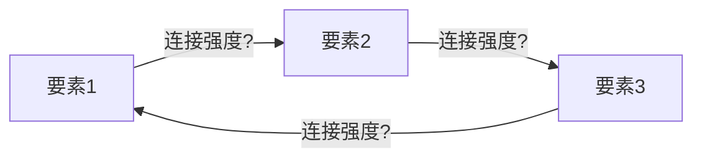

# 护城河评估器 v1.0 (Moat Evaluator)

> **定位**: 44因子CQI评分+飞轮分析的一键执行skill。确保每份Tier 3报告都有完整、标准化的护城河评估。
> **权威标准**: `docs/company_quality_scoring.md` v1.4 (44因子定义) + `knowledge/stock_picking/cqi_scoring_formula.md` v2.0 (公式)
> **产出**: `reports/{T}/data/quality_scorecard.md` + `reports/{T}/data/moat_datacard.yaml`

---

## 触发条件

| 场景 | 触发 |
|------|------|
| **手动** | `/moat-evaluate {TICKER}` |
| **自动(Tier 3)** | Phase 1完成后、Phase 2前 |
| **回顾** | `/moat-evaluate replay {TICKER}` 对已完成报告重评 |

---

## 执行流程 (4步)

### Step 1: 读取输入

```
必需输入:
- Phase 1产出(或phase1_summary.md)
- FMP财务数据(income/balance/cashflow/ratios)
- 行业worktree CLAUDE.md(行业修正系数)
```

### Step 2: 44因子逐项评分

#### A. 品质门控 (7项 Pass/Fail)

逐项检验QG-1~QG-7，标注Pass/Fail/豁免(含理由)。

#### B. 商业模型 (B1-B8, 各0-5分)

每项必须包含: **分数 + 一句话依据 + DM锚点**

```markdown
| # | 维度 | 分 | 依据 | DM |
|---|------|:--:|------|-----|
| B1 | 收入引擎 | ? | [引用报告数据] | [DM-xx] |
| B2 | 客户锁定 | ? | | |
| B3 | 收入经常性 | ? | | |
| B4 | 定价权 | ? | **标注类型: 市场/合同/制度** | |
| B5 | 利润弹性 | ? | | |
| B6 | 资本配置 | ? | **含η计算** | |
| B7 | TAM跑道 | ? | | |
| B8 | 管理层 | ? | | |
```

**行业加权**: 根据行业路由自动应用(半导体B5×1.5, 消费品B4×1.5等)

#### C. 护城河 (C1-C7, 各0-5分)

每项必须包含: **分数 + 依据 + 标注(C1嵌入性质/C3锁定载体)**

```markdown
| # | 维度 | 分 | 依据 | 标注 |
|---|------|:--:|------|------|
| C1 | 制度嵌入 | ? | | 性质: 偏好/标准/封锁/定义/独占 |
| C2 | 网络效应 | ? | | |
| C3 | 生态锁定 | ? | | 载体: 系统/数据/流程/人力 |
| C4 | 数据飞轮 | ? | | |
| C5 | 规模经济 | ? | | |
| C6 | 物理壁垒 | ? | | |
| C7 | 自维持性 | ? | **停止投入后护城河多快消失** | |
```

#### D. 回报修正

| 因子 | 评估 | 值 | 依据 |
|------|------|:--:|------|
| D1 | 周期性 | ×? | 反脆弱/反周期/非周期/弱周期/混合/监管压缩/强周期 |
| D2 | 收入纯度 | ?% | 低纯度必须还原真实OPM |
| D3 | 被忽视度 | +? | 市值+覆盖度 |
| D4/T | 趋势 | ×? | ↑/↗/→/↘/↓/⇊ |

#### 综合计算

```
加权分 = (B + C + D3) × D1 × T
品质溢价: OPM≥55%+FCF/NI≥100% → +3; OPM≥65% → +5
CQI = round((加权分 - 10) / 60 × 100)
```

### Step 3: 飞轮分析 (新增模块)

> 不是每家公司都有飞轮。只有当公司宣称有"平台效应""网络效应""数据飞轮"或有多产品交叉销售时才执行。

#### 3a. 飞轮映射

识别公司宣称或实际存在的飞轮循环：



**每个连接评估**:
- **强连接(实线)**: 有直接因果关系+财务数据验证(如: 用户增长→数据增多→AI准确率提升→用户留存)
- **弱连接(虚线)**: 逻辑存在但缺乏数据验证(如: 品牌认知→溢价定价，但NPS在下降)
- **断裂连接(×)**: 逻辑不成立或数据否定(如: MCO评级垄断→数据优势，但数据实际不排他)

#### 3b. 飞轮悖论检测

> **源自CRM v2.0教训**: Agent成功→seat减少=加速器同时是刹车器

**必须检查**: 新产品/AI/自动化的成功是否蚕食核心产品？

```
检测公式:
  蚕食率 = 新产品带来的核心产品收入流失 / 新产品贡献的增量收入

  蚕食率 < 0.3 → 正常(新产品净增量)
  蚕食率 0.3-0.7 → 警告(新产品部分蚕食)
  蚕食率 > 0.7 → 悖论确认(新产品主要是替代而非增量)
```

**典型案例**:
- CRM: Agent成功→减少seat→蚕食率~0.5(警告)
- ADBE: AI生成→减少Creative Cloud需求→蚕食率待评估
- INTU: GenOS自动报税→减少TT Live需求→蚕食率待评估

#### 3c. 飞轮摩擦力分析 (新增)

每个飞轮都有摩擦力——阻止飞轮加速的反向力量：

| 摩擦力类型 | 识别方法 | 量化 |
|-----------|---------|------|
| **竞争摩擦** | 竞争对手是否在飞轮的某个环节截流？ | 份额变化趋势 |
| **规模反噬** | 飞轮越大是否越难管理(官僚/协调成本)？ | SGA/Rev趋势 |
| **监管摩擦** | 监管是否限制飞轮的某个环节(反垄断/数据隐私)？ | 诉讼/调查数量 |
| **技术摩擦** | 新技术是否绕过飞轮(AI直接替代某环节)？ | 替代品渗透率 |
| **认知摩擦** | 客户是否感知到飞轮的价值(vs只是被锁定)？ | NPS/满意度 |

#### 3d. 飞轮净效应判定

```
飞轮净效应 = 飞轮强度(连接数×平均强度) - 飞轮摩擦(摩擦力加权)  - 悖论蚕食

净效应 > 0.5 → 正飞轮(护城河在自动加深)
净效应 0~0.5 → 弱飞轮(存在但效果有限)
净效应 < 0 → 负飞轮(飞轮在反噬自身)
```

**飞轮净效应→C7自维持性的校准**: 正飞轮公司C7应≥4(自增强)。负飞轮公司C7应≤2(需要持续投入对抗摩擦)。

### Step 4: 输出产出文件

#### 产出1: quality_scorecard.md

```markdown
# {TICKER} 品质量化评分卡

## A. 品质门控: X/7
[表格]

## B. 商业模型: XX/40
[表格]

## C. 护城河: XX/35
[表格]

## D. 回报修正
D1=×X.XX D2=X% D3=+X T=×X.XX

## 飞轮分析
[Mermaid图 + 悖论检测 + 摩擦力 + 净效应]

## CQI计算
加权分 = XX.X → CQI = XX
排行榜位置: #XX (介于YY和ZZ之间)

## 校准检查
[与±3分邻居对比确认合理性]
```

#### 产出2: moat_datacard.yaml

```yaml
ticker: {TICKER}
date: {DATE}
cqi: XX
b_total: XX
c_total: XX
d1: X.XX
t_trend: X.XX
c1_nature: "偏好/标准/封锁/定义/独占"
c3_carrier: "系统/数据/流程/人力"
c7_self_sustain: X
flywheel_net: X.X
flywheel_paradox: false/true
pricing_power_type: "市场/合同/制度"
pricing_power_stage: X.X
moat_trend: "↑/↗/→/↘/↓/⇊"
leaderboard_rank: XX
```

---

## 与报告的融入方式

**护城河评估产出→无痕融入报告正文**:

| 产出 | 融入位置 | 融入方式 |
|------|---------|---------|
| B1-B8评分 | 业务分析章节 | 作为论点的数据支撑 |
| C1-C7评分 | 护城河章节 | 分项展开为独立段落 |
| 飞轮分析 | 竞争/护城河章节 | Mermaid图+飞轮净效应判定 |
| 飞轮悖论 | 风险章节 | 作为核心风险条目 |
| CQI排名 | 执行摘要 | 一行"CQI XX, 排名#XX" |
| moat_datacard | 报告附录 | YAML数据卡 |

**无痕规则**: 报告正文不出现"B4=3.5"这样的评分——而是"定价权检验显示5年提价18% vs 通胀14%=真实提价4%"。评分卡在staging/data中，不进正文。

---

## 版本

| 版本 | 日期 | 变更 |
|------|------|------|
| v1.0 | 2026-03-25 | 初版: 44因子一键评分+飞轮分析(映射+悖论+摩擦力+净效应)+双产出(scorecard+datacard) |
