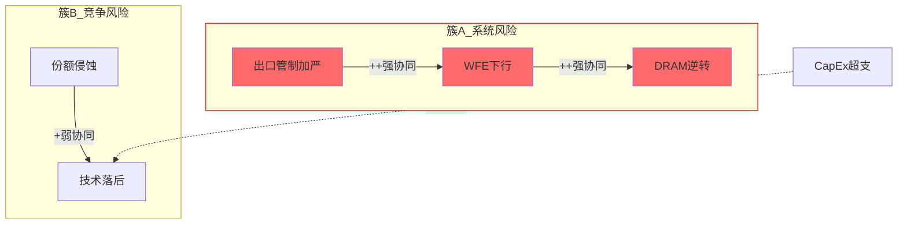

# 风险拓扑映射器 v2.0

> **核心价值**: 孤立的风险清单高估戏剧性崩溃、低估渐进衰退。映射风险间关系后，"最可能的糟糕结果"往往不是最恐怖的那个。
> **来源验证**: GOOGL Ch19 死亡螺旋+负协同识别 (5/5) | AMAT P4 (4/5, 缺少风险间关系分析) | SEMI_EQUIPMENT_COMPARATIVE 17-KS完整拓扑+协同矩阵 (7.5/10)
> **v2.0变更**: MVP模式(8+3+1) | KS注册表10必填字段 | 4通用KS预置 | 协同矩阵防爆炸策略

## 触发条件

Phase 4红队审计中，在RT-5黑天鹅表完成后**强制执行**。

与`red-team-executor`配合使用——RT-5产出风险清单，本Skill产出风险**关系图**。

## 分层执行模式 (v2.0新增)

| 模式 | 适用 | 内容 | 字符量 | 工作量 |
|------|------|------|--------|--------|
| **MVP (8+3+1)** | Tier 3单公司 | 8核心KS + 3危险组合 + 1温水场景 | ~4K | 2-3小时 |
| **Full** | Tier 3横向对比 | 10-18 KS + 完整协同矩阵 + 仪表盘 | ≥8K | 5-8小时 |

**默认使用MVP模式**。仅在横向对比分析(≥2家公司)时使用Full模式。

**模式选择决策树**:
- 单公司Tier 3 → **MVP**
- 多公司对比Tier 3 → **Full**
- 用户明确要求完整版 → **Full**
- Tier 1/2 → 不触发本Skill(风险清单已足够)

## 为什么需要这个Skill

| 问题 | AMAT的教训 | GOOGL的最佳实践 |
|------|-----------|---------------|
| 风险被独立列举 | R1-R6概率加权但未分析关联 | 死亡螺旋映射反馈环 |
| 恐怖场景≠最可能场景 | 黑天鹅表关注极端事件 | "温水煮青蛙"才是最需防范的 |
| 矛盾风险被叠加 | 三重共振概率未调整互斥 | Bear#1和Bear#3逻辑互斥 |
| 结论是"风险很多" | PDRM净影响是数字堆叠 | 输出"最危险的2-3条路径" |

## 执行流程

### Step 1: 风险节点提取

从Phase 1-4已识别的所有风险中提取**风险节点**(合并重复):

```markdown
## 风险节点清单

| ID | 风险 | 来源Phase | 独立概率 | 影响幅度 | 类型 |
|----|------|:-------:|:------:|:------:|:---:|
| R1 | [风险描述] | P1/P2/P3 | X% | -Y% EV | 周期/结构/制度 |
| R2 | [风险描述] | P1/P2/P3 | X% | -Y% EV | 周期/结构/制度 |
| R3 | ... | ... | ... | ... | ... |
```

**要求**: ≥6个风险节点(Full模式) 或 ≥8个风险节点(MVP模式，含≥2个通用KS)。每个节点标注`constraint-classifier`的分类结果。

### KS注册表标准字段 (v2.0新增)

每个Kill Switch必须包含以下10个必填字段:

| 字段组 | 字段 | 定义 | 示例 |
|--------|------|------|------|
| 身份 | KS-ID | 唯一编号 | KS-01 |
| 身份 | 风险描述 | 一句话定义，用数字说话 | WFE同比下降>15% |
| 身份 | 风险类型 | 六类之一: 周期/地缘/竞争/范式/财务/监管 | 周期 |
| 评估 | 严重度 | 1-5级 | 5/5 |
| 评估 | 当前概率 | 12个月触发概率(%) | 15-20% |
| 评估 | 时间窗 | 从信号到影响兑现 | 6-18个月 |
| 触发 | 触发条件 | 可量化指标列表(≥3个) | B2B<0.85x连续2月... |
| 影响 | 影响矩阵 | 公司排序+量化影响 | LRCX收入-26~-30% |
| 关系 | 协同关系 | 协同/反协同/独立KS列表 | KS-11协同放大1.3x |
| 行动 | 三阶段行动 | 预警/触发/确认的具体操作 | 预警:审视仓位→触发:减仓至≤3% |

**铁律**: 不是"中国国产替代是风险"，而是"当NAURA刻蚀在28nm以上fab获得第三个Tier-1客户的production tool订单时"。KS必须数字化+操作化。

**MVP模式简化卡片** (每个KS约80字):
```
KS-XX: [名称] | 严重度: X/5 | 概率: XX%
触发: [一行描述] | 影响: [一行排序]
操作: [一行行动指引]
协同: [列出协同KS编号]
```

### 通用KS预置 (v2.0新增)

以下4个KS适用于任何行业，分析时可直接复用并填入行业具体参数:

**KS-U1: 宏观衰退**
- 类型: 周期
- 触发: GDP负增长2Q + 信用利差>500bp + ISM<45
- 行业适配: [填入行业Beta和收入敏感度]

**KS-U2: 估值均值回归**
- 类型: 财务
- 触发: P/E偏离5年均值>2σ + 无基本面改善支撑
- 行业适配: [填入行业P/E中位数和历史波动范围]

**KS-U3: 杠杆恶化**
- 类型: 财务
- 触发: Net Debt/EBITDA突破行业阈值(如>3x) + 利率上升>150bp
- 行业适配: [填入行业杠杆阈值]

**KS-U4: 反垄断/监管升级**
- 类型: 监管
- 触发: 正式调查启动 + 罚金>年利润10% + 业务模式被限制
- 行业适配: [填入行业监管格局]

**使用方式**: MVP模式中≥8个KS必须包含≥2个通用KS(从U1-U4中选取最相关的)。Full模式建议包含≥3个。

### Step 2: 关系矩阵

对所有风险**两两**评估关系:

```markdown
## 风险关系矩阵

|     | R1 | R2 | R3 | R4 | R5 | R6 |
|-----|:--:|:--:|:--:|:--:|:--:|:--:|
| R1  | —  | ++ | 0  | -  | +  | 0  |
| R2  | ++ | —  | +  | 0  | ++ | 0  |
| R3  | 0  | +  | —  | 0  | 0  | -  |
| R4  | -  | 0  | 0  | —  | 0  | +  |
| R5  | +  | ++ | 0  | 0  | —  | 0  |
| R6  | 0  | 0  | -  | +  | 0  | —  |

**符号**: ++ 强协同 | + 弱协同 | 0 独立 | - 弱反协同 | -- 强反协同
```

**关系定义**:
| 符号 | 含义 | 判断标准 |
|:---:|------|---------|
| ++ | 强协同 | R1发生→R2概率显著上升(>2x) |
| + | 弱协同 | R1发生→R2概率略升(1.2-2x) |
| 0 | 独立 | R1发生对R2无影响 |
| - | 弱反协同 | R1发生→R2概率略降 |
| -- | 强反协同 | R1发生→R2逻辑上不成立 |

**防爆炸策略 (v2.0新增)**:

**MVP模式(8个KS)**: 完整8×8矩阵(28对关系)，可在30分钟内完成。

**Full模式(>10个KS)**: 三阶段聚焦评估
1. **预筛选(5分钟)**: 按风险类型分组——同类型大概率协同，跨类型大概率独立
2. **重点评估(30分钟)**: 只评严重度4+5级的两两关系 + 影响同一公司/收入线的KS对
3. **填充矩阵(15分钟)**: 使用决策树:
   - 共享传导通道? → 同时发生放大影响? → S(协同)
   - 一个KS改变另一个概率? → 增加→S, 降低→A
   - 其他→独立

**经验法则**: 非独立关系应占10-20%。超过30%说明过度关联偏差。(SEMI_EQUIPMENT报告17个KS中约20对非独立÷136对=15%，处于合理范围。)

### Step 3: 风险簇识别

从关系矩阵中识别**风险簇**(强协同节点组):

```markdown
## 风险簇

### 簇A: [名称] (R1+R2+R5)
- **内部逻辑**: [为什么这些风险会一起发生]
- **联合概率**: [调整后概率，考虑协同性]
- **联合影响**: [三者同时发生的EV影响]
- **触发信号**: [什么早期信号预示这个簇正在激活]

### 簇B: [名称] (R3+R6)
- ...
```

**AMAT示例**: R1(出口管制)+R2(WFE下行)+R5(DRAM逆转) 应该被识别为一个簇——地缘紧张→中国CapEx减少→WFE下行→Memory需求减弱，它们是同一系统风险的三个表现。

### Step 4: 矛盾组合识别

找出看似恐怖但**逻辑矛盾**的风险组合:

```markdown
## 矛盾组合

| 组合 | 表面叙事 | 逻辑矛盾 | 含义 |
|------|---------|----------|------|
| R_X + R_Y | "如果X和Y同时..." | [为什么它们不能同时发生] | 极端崩溃场景概率被高估 |
```

**GOOGL示例**: Agent颠覆搜索(Bear#1) + Cloud利润率崩溃(Bear#3) — Agent大规模普及需要大量云计算，反而支撑Cloud收入。"完全的死亡螺旋在逻辑上有内在矛盾。"

**输出**: 这些矛盾组合从黑天鹅表中降权或标注"逻辑矛盾，联合概率需大幅下调"。

### Step 5: "温水煮青蛙"场景

**这是本Skill最有决策价值的产出。**

不是最戏剧性的崩溃，而是**最可能发生的渐进恶化路径**:

```markdown
## 温水煮青蛙: 最可能的不利路径

### 路径描述
[具体的、可视化的渐进恶化过程——不是突然崩溃，而是慢慢变差]

### 量化路径
| 时间 | 指标变化 | 累积影响 |
|------|---------|---------|
| 6个月后 | [具体变化] | 股价-X% |
| 12个月后 | [进一步变化] | 股价-Y% |
| 24个月后 | [趋势确认] | 股价-Z% |

### 为什么这比黑天鹅更需要关注
- **概率**: 显著高于任何单一黑天鹅(XX% vs 单事件5-15%)
- **不可对冲**: 渐进变化没有明确的"事件触发"来执行止损
- **叙事延续**: 每一步都有合理化解释("只是暂时的"/"环比改善")

### 检测信号 (TS候选)
- [信号1]: [具体可追踪指标 + 阈值]
- [信号2]: [具体可追踪指标 + 阈值]
```

**GOOGL示例**: "搜索增速从+17%逐步放缓至+5%，同时CapEx回报始终未达预期，P/E从29x缓慢压缩至20x，股价从$311滑落至$200-250。"

**AMAT应有的温水煮青蛙**: "WFE见顶→份额持平→中国收入缓降→AGS增速放缓→P/E从30x压缩至22-25x→股价从$355缓慢滑至$260-290" — 概率远高于"全面禁运+DRAM崩盘"的戏剧性场景。

### Step 6: Mermaid风险拓扑图



## 输出规范

写入Phase 4 staging文件，作为RT-5之后的独立小节: `## 风险拓扑: 从清单到系统`

### MVP模式输出规范 (v2.0新增)

| 指标 | 要求 |
|------|------|
| Kill Switch | 8个(含≥2个通用KS) |
| 危险组合 | 3个(从协同矩阵提取) |
| 温水煮青蛙 | 1个完整路径+量化+检测信号 |
| 关系矩阵 | 至少严重度4+5级两两评估(可不做完整N×N) |
| 字符 | ≥4K |

### Full模式输出规范 (原v1.0标准)

| 指标 | 要求 |
|------|------|
| 风险节点 | ≥10 (推荐10-18) |
| 关系矩阵 | 完整N×N |
| 风险簇 | ≥2个 |
| 矛盾组合 | ≥1个 |
| 温水煮青蛙 | 1个完整路径+量化+检测信号 |
| Mermaid | ≥1 (拓扑图) |
| 字符 | ≥8K |

## 质量门控

### MVP模式质量门控 (v2.0新增)

| 检查项 | 要求 | 严重度 |
|--------|------|:------:|
| ≥8个KS(含≥2个通用) | 全部10字段完整 | BLOCK |
| ≥3个危险组合 | 含联合概率估计 | BLOCK |
| 1个温水煮青蛙场景 | 有量化路径+检测信号 | BLOCK |
| 关系矩阵(≥重点子集) | 至少严重度4+5级两两评估 | WARN |

### Full模式质量门控 (原v1.0标准)

| 检查项 | 要求 | 严重度 |
|--------|------|:------:|
| 关系矩阵完整(N×N) | 所有两两关系标注 | BLOCK |
| ≥2个风险簇识别 | 含联合概率调整 | BLOCK |
| 温水煮青蛙场景存在 | 有量化路径+检测信号 | BLOCK |
| ≥1个矛盾组合 | 标注逻辑矛盾原因 | WARN |
| Mermaid拓扑图 | 显示协同/反协同关系 | WARN |
| KS注册表字段完整 | 全部10必填字段 | BLOCK |

## 与其他Skill的集成

| 上游 | 本Skill | 下游 |
|------|--------|------|
| red-team-executor RT-5 (风险清单) | 风险拓扑 | Phase 5 KS注册表 (风险簇→KS) |
| constraint-classifier (约束类型) | 节点属性 | Phase 5 TS注册表 (温水煮青蛙→TS) |
| PDRM (概率加权影响) | 独立概率输入 | 评级决策 (联合概率修正) |

---

*风险拓扑映射器 v2.0 — 投资者最应警惕的不是黑天鹅，而是温水煮青蛙。MVP模式(8+3+1)保留80%价值/20%工作量。*
