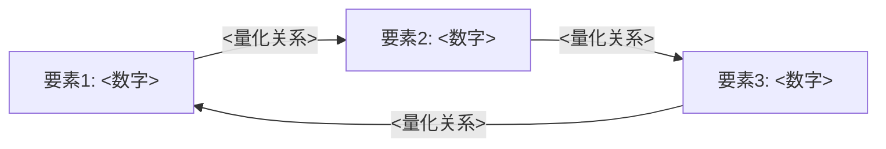

# /standard-analysis - Tier 2 标准分析技能

## 触发命令
`/standard-analysis [公司代码]`

## 功能描述
单次会话完成的完整投资分析，产出独立 MD 报告：
- 2-3小时完成
- 单次会话，不跨Phase
- 输出独立 MD 报告到 `reports/{TICKER}/{TICKER}_standard_v{版本}_{YYYY-MM-DD}.md`
- 适合完整投资判断

## 层级定位

| 维度 | Tier 1 /quick-scan | **Tier 2 /standard-analysis** | Tier 3 /deep-dive |
|------|--------------------|-----------------------------|-------------------|
| **时长** | 10-15分钟 | **2-3小时** | 多会话(12h+) |
| **深度** | L2-L3 | **L3-L4** | L4.5+ |
| **字数** | ~5,000 | **~40,000** | ≥80,000×系数 |
| **模块** | 6个速查 | **8-10个完整模块** | 29+个模块 |
| **数据源** | WebSearch 快查 | **10-15项真实数据** | 全面数据+五引擎 |
| **产出** | 对话内展示 | **独立MD报告** | 机构级MD报告 |
| **用途** | 初筛 | **投资判断** | 重仓决策 |

## 执行流程

### Step 1: 数据收集 (30分钟)

```yaml
必须获取:
  1. 当前股价 + 52周高低 (WebSearch/MCP)
  2. 最近2个季度财报关键指标 (WebSearch)
  3. 分析师共识目标价 + 评级分布 (WebSearch)
  4. PE/PB/EV-EBITDA 当前值 vs 5年均值 (WebSearch)
  5. 营收/利润增长趋势 (WebSearch)
可选获取:
  6. 预测市场相关事件 (WebSearch: site:polymarket.com)
  7. 近期重大新闻/事件 (WebSearch)
  8. 同行对比数据 (MCP compare_stocks)
```

### Step 2: 分析模块 (1.5-2小时)

按顺序执行以下 8-10 个模块：

| # | 模块 | 内容 | 目标字数 |
|---|------|------|---------|
| S1 | 公司概况 | 业务模型、核心产品、竞争地位 + **B1收入引擎+B2客户锁定+B3经常性** | 4,000 |
| S2 | 财务健康度 | 营收/利润/现金流/资产负债 + **A品质门控(QG-1~7)+B5利润弹性+B6资本配置** | 5,000 |
| S3 | 增长驱动力 | 3-5个增长引擎 + **B7 TAM跑道+B4定价权证据** | 4,000 |
| S4 | 竞争格局 | 护城河评估 + **C1-C6六维度护城河评分** + 主要对手 | 5,000 |
| S5 | 估值分析 | PE/DCF/可比公司 + **D1周期性乘数+D2收入纯度+复利路径** | 5,000 |
| S6 | 风险清单 | ≥5个风险 + Kill Switch 触发条件 | 4,000 |
| S7 | 分析师观点 | ≥5位分析师，多空分歧 | 3,000 |
| S8 | 核心投资命题 | ≥3个命题，每个含证据+反证 | 4,000 |
| S9 | 可验证预测 | ≥8个预测，含概率+时间+触发条件 | 3,000 |
| S10 | 品质评分卡+投资总结 | **A+B+C+D完整评分卡+加权分+复利路径** + 关键假设 + 追踪信号 | 3,000 |

### Step 3: 质量检查 (15分钟)

```yaml
必须通过:
  - [ ] 所有财务数据标注来源和日期
  - [ ] 无编造数字（铁律1）
  - [ ] 预测市场数据已搜索验证（铁律2）
  - [ ] 数据类型已标注（铁律3）
  - [ ] 风险和反证未省略
  - [ ] 末尾含免责声明
  - [ ] 总字数 ≥30,000
```

## 输出模板

```markdown
# [公司名称] ([代码]) 标准投资分析

> 分析日期: [日期] | 分析师: AI Research Agent
> 数据截止: [日期] | 分析层级: Tier 2 标准分析

---

## 1. 公司概况
[S1 内容]

## 2. 财务健康度
[S2 内容，含数据表格]

## 3. 增长驱动力
[S3 内容]

## 4. 竞争格局
[S4 内容]

## 5. 估值分析
[S5 内容，含三场景表格]

## 6. 风险清单
[S6 内容，含 Kill Switch 表格]

## 7. 分析师观点
[S7 内容]

## 8. 核心投资命题
[S8 内容]

## 9. 可验证预测
[S9 内容，含预测表格]

## 10. 投资总结
[核心论点 + 关键假设 + 什么情况下需重新评估 + 追踪信号]

---

## 数据来源
[所有引用来源列表]

## 免责声明
本报告由AI生成，仅供参考，不构成投资建议。投资有风险，决策需谨慎。
所有数据来自公开来源，准确性不做保证。
```

## 数据来源优先级

```yaml
A级 (必须):
  1. 公司财报/SEC Filing
  2. Yahoo Finance / Google Finance
  3. 分析师报告摘要

B级 (推荐):
  4. 预测市场 (Polymarket/Kalshi)
  5. 行业报告

C级 (补充):
  6. 新闻报道
  7. 社交媒体情绪
```

---

## ★ v1.1 长牛 OS 模板扩展 (2026-04-28)

> **来源**: `reports/美股大牛股复盘/` 73 个文件 + 8 个深度复盘案例(NVDA/FICO/ORLY/NVR/CPRT/MSCI/ISRG)
> **核心**: 现有 10 模块覆盖估值/财务/护城河,但缺**结构性长牛验证**——什么样的事前信号能识别未来大牛股,什么是事后倒推。详见 `memory/long_compounder_cross_case_patterns.md`。

### 扩展 1: S1 公司概况增加"业务本质 vs 表面标签对比表"

```markdown
### 1.1 业务本质 vs 表面标签

| 表面标签(市场怎么看) | 业务本质(实际机器) | 核心变量错位 |
|------------------|-----------------|-----------|
| [例: NVDA 是 GPU 公司] | [实际: 控制点迁移平台 - GPU→CUDA→AI runtime] | 市场看 GPU 出货,实际驱动是 SDK/runtime owner 地位 |

类型路由(选 1):
- [ ] 控制点迁移/runtime-platform (NVDA/NOW)
- [ ] 密度网络/可得性网络 (ORLY/WSO/CPRT)
- [ ] 制度标准/默认语言 (FICO/MSCI/MCO)
- [ ] 垂直责任操作系统 (INTU/VEEV/ISRG)
- [ ] 资本链压缩 (NVR)
- [ ] 工程控制点 (CDNS/SNPS)
- [ ] 不确定性交易/清算 (CME/CBOE)
- [ ] 物理 chokepoint (ASML/KLAC)
- [ ] 其他: ___
```

### 扩展 2: S4 竞争格局增加"制度/流程嵌入深度"

```markdown
### 4.X 制度/流程嵌入深度(嵌入层级评估)

| 层级 | 是否成立 | 证据 |
|------|---------|------|
| L5 语言层(行业默认词汇) | □ | [客户合同直接引用公司名/产品名] |
| L4 标准层(嵌入合同/SOP) | □ | [GSE/ETF/RFP 模板默认使用] |
| L3 流程层(进入日常工作流) | □ | [部门 SOP/培训材料中默认使用] |
| L2 系统层(集成 API/格式) | □ | [API/数据格式被集成] |
| L1 偏好层 | □ | [仅是市场份额高,无嵌入] |

**最高成立层级**: L? — 含义: [替代成本来自协调成本(高 L)还是采购成本(低 L)]
```

### 扩展 3: S4 增加"飞轮拆解(具体数字验证)"

```markdown
### 4.Y 飞轮机制拆解

> 不是定性描述,是具体数字验证



**飞轮四要素验证**:
- [ ] Installed base 持续增长? — 3 年 CAGR ___%
- [ ] 同客户持续货币化? — NRR ___ 或 per-customer ARR ___
- [ ] 客户易复购? — GRR ___ 或 churn ___
- [ ] 定价权可释放? — 提价后 NRR/留存变化 ___

判定: 真飞轮 / 强飞轮 / 部分飞轮 / 假飞轮 / 无飞轮
```

### 扩展 4: NEW S4-bis "反事实失败者对照" (强烈建议)

> **核心纪律**: **不允许只做赢家总结**。每个赢家必须配反事实失败者,否则是事后归因。

```markdown
## 4-bis. 反事实失败者对照

### 同期看似相似但失败的公司

| 失败者 | 看似相同的表面信号 | 实际分叉的关键变量 | 失败结局 |
|-------|----------------|------------------|---------|
| [例: 3dfx] | [都做高端 GPU,品牌强] | [3dfx 渠道破坏 STB,没建 OEM 生态] | [破产,被 NVDA 收购] |
| [例: ATI] | [技术不弱,有 GPU 业务] | [集成显卡威胁下没升级到 CUDA 平台层] | [被 AMD 收购,沦为商品] |

### 5 种共同失败模式扫描(对当前公司)

- [ ] 渠道破坏(并购/重组破坏渠道)? 当前公司情况: ___
- [ ] 模式复杂化(业务线 ≥5 或近 3 年新增 ≥3)? 情况: ___
- [ ] 制度嵌入缺失(高市占但客户不嵌入)? 情况: ___
- [ ] 流通渠道丧失(单一大客户 >30%)? 情况: ___
- [ ] 价格权流失(GM 连续 3 年下降)? 情况: ___

**结论**: [无失败模式 / N 个警告 / 多模式重叠]
```

### 扩展 5: S8 核心投资命题增加"事前信号 vs 事后倒推分界"

```markdown
### 8.X Point-in-Time 纪律 (站在当年能看见什么?)

> 防止把今天的成功当成当年就能识别的信号

| 信号类别 | 事前可见(当时投资者能看到) | 事后倒推(今天才知道) |
|---------|------------------------|------------------|
| A 类: 公开可观察 | [例: 同店增速 5+ 年正] | — |
| B 类: 需要研究判断 | [例: DIFM 客户结构升级] | — |
| C 类: 太晚才能确认 | — | [例: 财报已确认 AI 收入] |
| D 类: 纯事后叙事 | — | [例: "革命性产品"] |

**当前研究目标在哪个阶段**: [A/B/C 阶段] — 含义: [仍在赔率窗口 / 已被市场定价 / 已晚]
```

### 扩展 6: S3 增长驱动力增加"供给复制瓶颈"

```markdown
### 3.X 供给复制能力(为什么不能简单复制)

> 增长能跑多久 = 供给能否不牺牲质量地复制

| 复制维度 | 能力评分 | 瓶颈来源 |
|---------|:------:|---------|
| 制造/产能 | ?/5 | [实物 chokepoint / 认证 / 资本] |
| 人才培训 | ?/5 | [稀缺技能 / 长培训周期] |
| 许可/认证 | ?/5 | [监管 / 牌照 / 合规] |
| 网络/分发 | ?/5 | [本地密度 / OEM 关系] |
| 服务能力 | ?/5 | [maintenance / I&A / 后服务] |

**复制类型**(选 1):
- [ ] 越多越强(ORLY 密度网络模式)
- [ ] 越多越散(CNM 多业务并购模式)
- [ ] 难复制就护城河(KLAC 工艺壁垒模式)
```

### 扩展 7: S6 风险清单增加"错误传播深度 EPD"

```markdown
### 6.X 错误传播深度评估

> 客户用错 / 服务出错 — 影响穿透到哪一层?

| 等级 | 是否成立 | 含义 |
|------|:------:|------|
| L5 生命安全/物理不可逆 | □ | 最高粘性(ISRG/AXON) |
| L4 法律/监管/审计责任 | □ | 替换需监管+合同+流程同步 |
| L3 制度/合规责任 | □ | 高粘性,审计绑定 |
| L2 财务损失可量化 | □ | 中等粘性 |
| L1 用户体验受损 | □ | 单点失败不影响业务 |
| L0 无真实风险 | □ | 客户随时可换 |

**最高成立级别**: L? — 含义: [Kill Switch 阈值是否可放宽 / 替代风险是否更低]
```

### 扩展 8: S10 投资总结增加"阶段分类 + 三个跟踪钉子"

```markdown
### 10.X 阶段分类确认

**当前阶段**(从六阶段中选):
- [ ] 1 结构成形(产品/PMF)
- [ ] 2 验证扩张(早期商业化)
- [ ] 3 高速释放(单位经济跑通+大规模复制)
- [ ] 4 成熟复利(稳定份额+可持续 FCF)
- [ ] 5 滞涨拥挤(增速回归+利润压力)
- [ ] 6 再平台化(新曲线启动)

**信任形成周期 T0-T5**(高责任公司专用):
- 当前在 T? 阶段
- 距离 T3(企业标准)/T4(默认规格)还有 ? 阶段

### 10.Y 三个跟踪钉子(读者带走的判断)

1. **它是什么**(新定义): [一句话, ≤20 字]
2. **第一变量**(以后该盯什么): [指标 + 阈值]
3. **新估值语言**: [应该用什么方法定价 - PE/PEG/SOTP/期权]
```

### 应用建议

- **Tier 2 标准分析**: 选 3-4 个最相关扩展加入(根据公司类型路由)
- **Tier 3 深度报告**: 全部 8 个扩展都加,作为强制章节
- **必加扩展**(任何公司类型):
  - 扩展 1 业务本质对比(防止表面标签误导)
  - 扩展 4 反事实失败者对照(防止事后归因)
  - 扩展 5 事前 vs 事后分界(Point-in-Time 纪律)

---

## ★ v1.2 Skeleton 执行纪律 (2026-04-29)

> **来源**: `reports/美股大牛股复盘/2026-04-29-long-compounder-research-os-skeleton-v1-zh.md`
> **核心更正**(对 v1.1 的修正): 路由不替代通用核心 / 不输出总分 / UNKNOWN 字段级强制

### 执行纪律 1: 通用核心 11 模块(任何公司强制全做,不允许跳过)

无论何种公司类型,必须先过这 11 个模块,再根据类型追加专项:

```
1. 研究对象过滤
2. Point-in-Time 证据锁定
3. 源头需求与强迫性
4. 控制点与第二选择差距
5. 生产级 / 责任级验证
6. 增长因果栈(收入/利润/每股价值三层)
7. 周期与外部变量双拆
8. 每股价值机制
9. 反事实失败者
10. Kill Switch 与 UNKNOWN
11. 季度跟踪卡
```

**关键纪律**: 路由(密度网络/制度标准/工程工具/硬件 chokepoint 等 15 类)只决定**追加**哪些专项模块,**不允许跳过**通用核心 11 模块。

### 执行纪律 2: 5 状态字段输出模式(替代/补充评分)

> "不输出公司总分,不做跨公司排名,除非用户单独要求。"

每个评估变量必须用以下 5 状态之一:
```
成立 / 部分成立 / 不成立 / 不适用 / UNKNOWN
```

数值评分(CQI/IFLS/Owner Yield 等)作为**辅助刻度**,不替代状态字段。

### 执行纪律 3: 四张诊断表绝对不合并

```markdown
### 11.X 四张诊断表(独立呈现,禁止合并成单一评级)

| 诊断表 | 状态字段 | 证据 |
|--------|---------|------|
| 战略控制点 | 成立 / 部分成立 / 不成立 / UNKNOWN | __ |
| 周期位置 | 顺风 / 中性 / 逆风 / UNKNOWN | __ |
| 资本效率 | 成立 / 部分成立 / 不成立 / UNKNOWN | __ |
| 外部约束 | 低 / 中 / 高 / UNKNOWN | __ |
```

**为什么不能合并**: 战略控制点强 + 资本效率弱(GWRE 模式)合并后看不出问题; 周期顺风 + 控制点弱(半导体)合并掩盖 alpha 是 beta。

### 执行纪律 4: UNKNOWN 字段级强制

> "数据不足时输出 UNKNOWN,不要补叙事。"

任何变量评估时,如果数据缺失,**禁止打分/写"约""推测""可能"**,必须填:

```yaml
unknowns:
  - item: ""
    why_it_matters: ""
    how_to_resolve: ""
    latest_check_date: ""
```

### 执行纪律 5: 最小充分解释填空模板

每份报告必须输出可填充的因果链:

```text
强迫需求正在从 [旧流程/旧预算/旧技术] 流向 [新流程/新预算/新技术]。
[公司] 控制 [关键节点], 第二选择在 [生产级/责任级/供给/服务/标准] 上仍有差距。
如果公司能把该控制点复制成 [交付能力/留存/价格权/FCF/每股价值],
且 [周期变量] 只改变增长斜率而不破坏控制点,
则 thesis 成立。
若 [kill switch] 触发, thesis 降级或失效。
当前最大 UNKNOWN 是 [未知变量]。
```

### ★ Phase 1 交付前 19 项防遗漏 checklist

```
[ ] 是否先做研究对象过滤?
[ ] 是否锁定 point-in-time 证据?
[ ] 路由是否只是加做模块,而不是替代通用核心?
[ ] 是否拆了源头需求和强迫性?
[ ] 是否明确第二选择和第二选择差距?
[ ] 是否区分 pilot / demo / production?
[ ] 是否拆了收入、利润、每股价值三层增长?
[ ] 是否检查业务时钟、信任周期、供给复制、价格权、留存、竞争捕获?
[ ] 是否检查利润释放和单位经济?
[ ] 是否检查迁移不对称?
[ ] 是否拆了周期斜率和控制点周期?
[ ] 是否检查 installed base 是否真的货币化?
[ ] 如果是网络, 是否检查网络均衡质量?
[ ] 如果是硬件, 是否加做 HC-5?
[ ] 是否区分机会侦测和机会捕获?
[ ] 是否输出四张诊断表, 而不是一个总分?
[ ] 是否找了反事实失败者?
[ ] 是否写了 kill switch 和 UNKNOWN?
[ ] 是否形成季度跟踪卡?
```

任何一项未通过 → Phase 1 不算交付完成。

## 版本
- v1.0 - 2026-02-06: 初版 10 模块标准分析模板
- v1.1 - 2026-04-28: 长牛 OS 模板扩展(8 个补充章节). 来源: `reports/美股大牛股复盘/` 73 文件吸收。配合 moat-evaluator v2.5 + chokepoint-locator v2.0 + stock-screener v2.5 升级。
- **v1.2 - 2026-04-29**: Skeleton v1 执行纪律 — 路由不替代通用核心(11 模块强制) + 5 状态字段(成立/部分成立/不成立/不适用/UNKNOWN) + 4 表绝对不合并 + UNKNOWN 字段级强制 + 最小充分解释模板 + 19 项 Phase 1 防遗漏 checklist。来源: `2026-04-29-long-compounder-research-os-skeleton-v1-zh.md`。这是真正可 Phase 1 直接套用的执行骨架。
