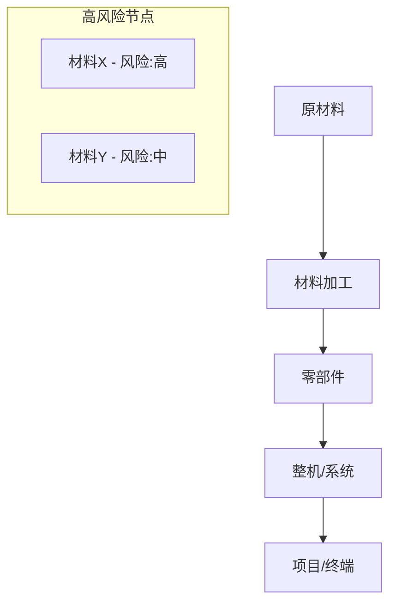

# 供应链风险地图 v1.0

## 核心理念

> 生态科技的投资风险，一半藏在供应链里。

## 触发条件

- eco-tech-orchestrator Phase 1（基础数据层）时自动触发
- 用户说"供应链" / "原材料" / "瓶颈" / "断供风险"
- 检测到原材料价格异常波动时自动预警

## 供应链图谱（按子行业）

### 光伏供应链

```yaml
供应链层级:
  L0_原材料:
    硅料(多晶硅):
      全球产能: ~180万吨(2025)
      中国占比: 88%
      关键企业: 通威(25%), 协鑫(18%), 大全(12%), 新特(10%)
      价格范围: $6-12/kg (历史波动: $6-40)
      地缘风险: 新疆产能争议→美国UFLPA制裁
      替代性: 低（提纯技术壁垒高）
      瓶颈评级: 中

    银浆(导电银):
      需求: ~4000吨/年(光伏用)
      供应: 全球银矿产量~26000吨
      光伏占银需求: ~15%
      价格: $25-30/盎司
      风险: 银价上涨→组件成本上升
      替代: 铜替代技术研发中(异质结HJT)
      瓶颈评级: 低-中

    玻璃/EVA/背板:
      供应充足度: 高
      中国占比: >80%
      瓶颈评级: 低

  L1_制造:
    硅片→电池→组件:
      中国占比: 硅片97%, 电池90%, 组件82%
      关键风险: 极度集中于中国
      贸易壁垒: 美国301关税+AD/CVD, 欧盟碳关税
      东南亚转口: 越南/泰国/马来中转产能快速增长

  L2_设备:
    关键设备:
      PECVD/丝网印刷: 中国自产率>90%
      异质结设备: 部分依赖进口(梅耶博格等)
      钙钛矿设备: 极早期，尚无标准化
```

### 风电供应链

```yaml
供应链层级:
  L0_原材料:
    稀土(永磁体):
      用途: 直驱风机永磁发电机
      中国占比: 稀土开采60%, 加工90%
      关键材料: 钕/镝/铽
      价格波动: 2010-2011暴涨10x先例
      替代: 感应式发电机(不用稀土，但效率低)
      瓶颈评级: 高

    碳纤维(叶片):
      用途: 大型风机叶片(>60m)
      供应: 日本东丽/美国Hexcel/中国光威
      价格: $15-25/kg
      需求增速: 15%/年（叶片大型化趋势）
      瓶颈评级: 中

    铜(电缆/变压器):
      全球消费: ~2600万吨/年
      可再生能源占铜需求: ~12%
      铜矿投资不足: 预计2025-2030供需缺口扩大
      瓶颈评级: 中-高

  L1_制造:
    风机整机: Vestas/金风/Siemens Gamesa/远景
    叶片: LM Wind/TPI/中材科技
    齿轮箱: ZF/南高齿
    塔筒: 天顺风能/大金重工

  L2_安装:
    海上风电安装船:
      全球可用: ~30艘大型安装船
      严重短缺: 预计2025-2028缺口
      新船造价: $3-5亿/艘，交付周期3-4年
      瓶颈评级: 高（海上风电特有）
```

### 储能/电池供应链

```yaml
供应链层级:
  L0_原材料:
    锂:
      全球储量: ~9800万吨(锂当量)
      开采集中度: 澳大利亚(47%)+智利(25%)+中国(15%)
      加工集中度: 中国(65%)
      价格历史: 2021: $15K→2022: $80K→2024: $12K/吨
      长期供需: 2025-2030可能再次紧缺
      瓶颈评级: 中-高

    钴:
      全球产量: ~19万吨/年
      刚果(金)占比: 73%
      人权/ESG风险: 极高（童工问题）
      替代: LFP无钴路线快速增长
      瓶颈评级: 中（LFP路线规避）

    镍:
      供应: 印尼(50%)+菲律宾(10%)+俄罗斯(6%)
      高纯镍: 供应紧张
      印尼HPAL技术: 产能扩张中但环保争议大
      瓶颈评级: 中

    石墨(负极):
      天然石墨: 中国占65%
      人造石墨: 能耗高，中国占90%+
      替代: 硅碳负极(下一代)
      瓶颈评级: 低-中

  L1_材料加工:
    正极材料: 中国占70%+ (湖南裕能/容百/当升)
    电解液: 中国占80%+ (天赐/新宙邦)
    隔膜: 中国占60%+ (恩捷/星源)
    中国全产业链集中度: 极高

  L2_电芯制造:
    TOP5: 宁德时代(37%)/BYD(16%)/LG(13%)/SK(5%)/松下(6%)
    中国占比: ~65%全球电芯产量
```

### 氢能供应链

```yaml
供应链层级:
  L0_关键材料:
    铂族金属(PEM电解):
      用途: PEM电解槽催化剂
      南非占比: 70%+
      价格: $900-1100/盎司
      用量: 未来大规模氢能可能导致铂需求增50%
      替代: 非贵金属催化剂(研发中)
      瓶颈评级: 高

    质子交换膜:
      供应商: Nafion(杜邦)/Gore/东岳集团
      技术壁垒: 极高
      中国自产: 东岳突破，但良率待提升
      瓶颈评级: 高

  L1_设备:
    电解槽:
      碱性电解: 中国具有成本优势
      PEM电解: 欧美领先(ITM/Siemens)
      SOEC: 极早期(Bloom Energy)
```

## 供应链风险评分模型

### 韧性评分公式

```yaml
supply_chain_resilience_score:
  公式: 综合评分(0-100) = Σ(维度得分 × 权重)

  维度:
    材料可用性(25%):
      储量寿命>50年: 10分
      储量寿命20-50年: 7分
      储量寿命<20年: 3分
      即时短缺: 0分

    地缘集中度(25%):
      HHI<1500(分散): 10分
      HHI 1500-2500: 7分
      HHI 2500-4000: 4分
      HHI>4000(极度集中): 1分
      计算: HHI = Σ(国家市场份额²)

    替代可用性(20%):
      成熟替代方案存在: 10分
      替代方案研发中(3年内): 6分
      替代方案早期(5年+): 3分
      无替代方案: 0分

    价格稳定性(15%):
      5年波动率<20%: 10分
      波动率20-50%: 6分
      波动率50-100%: 3分
      波动率>100%: 0分

    ESG合规(15%):
      全链条合规: 10分
      主要环节合规: 7分
      存在争议环节: 3分
      严重ESG风险: 0分

评级:
  80-100: A级(韧性强) → 供应链不构成投资风险
  60-79: B级(一般) → 需关注但不影响投资判断
  40-59: C级(脆弱) → 供应链风险需纳入估值折扣
  <40: D级(极脆弱) → 供应链可能成为致命风险
```

### 风险传导分析

```yaml
价格传导链:
  原材料涨价 → 制造成本 → LCOE → 项目经济性 → 装机需求 → 公司营收

传导弹性评估:
  高弹性(可传导): 公司有定价权，成本上涨可转嫁
  中弹性: 部分可转嫁，利润率承压
  低弹性(无法传导): 成本上涨直接吃利润
  反向: 原材料降价→利润率扩张

公司级评估:
  指标:
    - 原材料成本占营收比
    - 长单锁价比例
    - 垂直整合度
    - 库存周转天数
    - 供应商多元化程度
```

## 输出格式

```markdown
# 供应链风险地图: {公司名}

## 供应链韧性评分: X/100 [A/B/C/D级]

## 1. 供应链图谱


## 2. 关键材料风险矩阵
| 材料 | 用途 | 主要来源 | 集中度(HHI) | 替代性 | 价格波动 | 风险评级 |
|------|------|---------|-----------|--------|---------|---------|

## 3. 瓶颈预警
| 瓶颈 | 当前状态 | 恶化概率 | 影响程度 | 监控指标 |
|------|---------|---------|---------|---------|

## 4. 价格传导分析
- 原材料涨价10%→LCOE影响: +X%
- 原材料涨价50%→利润率影响: -Xpp
- 公司传导能力: [强/中/弱]

## 5. 地缘集中度热力图
| 环节 | 中国 | 美国 | 欧洲 | 其他亚洲 | 风险 |
|------|------|------|------|---------|------|

## 6. Kill Switch触发条件
- [材料X]价格>$Y → 利润率归零 → 减仓信号
- [国家X]出口管制 → 供应中断 → 清仓信号
- HHI>Z → 集中度过高 → 风险溢价调整
```

## 与其他skills联动

```yaml
数据输入:
  ← data-collector: 原材料价格+供应数据
  ← lcoe-analyzer: 成本结构分解→材料成本占比
  ← policy-impact: 贸易政策→关税/制裁影响

数据输出:
  → lcoe-analyzer: 材料成本预测→LCOE调整
  → stress-tester: 供应中断情景→压力测试
  → carbon-footprint: 供应链碳排放数据
  → report-assembler: 供应链韧性评分+风险图
```
