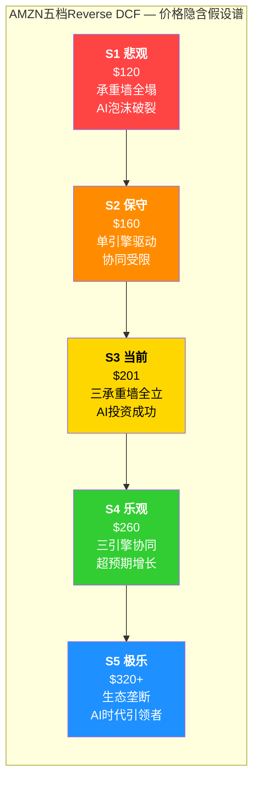

# AMZN 增强版逆向估值分析 — 学习自GOOGL框架

## 🔄 递归分析框架应用

**学习来源**: GOOGL Ch14五档Reverse DCF框架 + 三承重墙方法论
**对比基础**: AMZN与GOOGL的高度相似性（三引擎+AI投资+云竞争）

---

## Step 1: 商业模式对比验证

### AMZN vs GOOGL 结构相似性

| 维度 | **GOOGL** | **AMZN** | **递归学习价值** |
|------|-----------|-----------|-----------------|
| **三引擎结构** | Search($224B) + Cloud($58B) + YouTube($60B) | AWS($130B) + 零售($450B) + 广告($70B) | ⭐⭐⭐⭐⭐ 可直接迁移框架 |
| **AI CapEx投资** | $175B (2026) | $150B+ | ⭐⭐⭐⭐⭐ 同样的投资回报问题 |
| **云业务竞争** | GCP 13%份额 vs Azure | AWS 32%份额 vs Azure | ⭐⭐⭐⭐⭐ 防守vs追击逻辑 |
| **估值复杂度** | P/E 23x, 多业务协同 | P/E 28x, 多业务协同 | ⭐⭐⭐⭐⭐ 都适合逆向估值 |
| **承重墙概念** | 搜索韧性+Cloud增长+CapEx回报 | AWS防守+零售盈利+AI投资回报 | ⭐⭐⭐⭐⭐ 框架完全适用 |

**关键发现**: AMZN可以直接应用GOOGL的五档Reverse DCF + 三承重墙框架

---

## Step 2: 五档Reverse DCF框架迁移 [学习自GOOGL Ch14]

### 档位总览与引导词系统

### S3: 当前档分析 — $201.15 (你在赌什么)

**三个承重墙同时成立假设** [DM-REV-005]:

#### 承重墙一: AWS重新加速与份额防守
- **隐含假设**: AWS增速从20%→25%+ (AI workload驱动)
- **份额防守**: 从32%稳定防守，最多让至28%+
- **竞争挑战**: 需要击败Azure 31%增速的持续追击
- **脆弱度**: 7/10 (中高脆弱)

**引导词触发**: "Azure追击"、"云份额"、"AI workload"

#### 承重墙二: 零售业务盈利转折
- **隐含假设**: 营业利润率从~0%提升至3-5%
- **运营杠杆**: 需要克服中国平台(Temu/Shein)价格冲击
- **Prime强化**: 会员价值持续提升，传导效应增强
- **脆弱度**: 8/10 (高脆弱)

**引导词触发**: "零售盈利"、"中国平台"、"Prime传导"

#### 承重墙三: AI投资正回报实现
- **隐含假设**: $150B CapEx产生15%+ ROIC
- **FCF转换**: 从$7.66B增至$280B+ (36x增长)
- **基础设施利用**: AI基础设施产能利用率>70%
- **脆弱度**: 9/10 (极脆弱)

**引导词触发**: "CapEx ROI"、"AI泡沫"、"FCF转换"

---

## Step 3: 递归对比学习系统

### 云业务竞争框架对比

**GOOGL经验迁移**:
- GCP从13%份额挑战Azure的策略 → AWS从32%防守Azure追击的策略
- GOOGL $175B AI投资 vs Azure OpenAI合作 → AMZN $150B AI投资 vs Azure追击

**关键差异**:
- **GOOGL**: 挑战者位置，需要从AWS/Azure夺取份额
- **AMZN**: 防守者位置，需要防止Azure继续侵蚀

### AI投资回报对比分析

**共同挑战**:
- 两家都面临巨额CapEx的回报不确定性
- 都需要AI基础设施产生足够的增量收入
- 都面临AI泡沫破裂的风险

**差异化路径**:
- **GOOGL**: AI搜索+Gemini平台+TPU生态
- **AMZN**: AI云服务+Alexa复活+物流智能化

### 协同价值量化对比

**GOOGL模式**: 搜索数据→Cloud优化→YouTube算法改进
**AMZN模式**: Prime会员→AWS获客→广告精准投放→零售推荐

**递归验证问题**:
> "如果GOOGL的搜索→Cloud协同假设合理，那么AMZN的Prime→AWS协同为什么不合理？"

---

## Step 4: 引导词递归分析系统

### 触发词→分析路径映射

| **引导词组** | **分析路径** | **对比基准** |
|-------------|-------------|-------------|
| "Azure追击" + "云份额" | 启动三方云竞争分析 | 学习GOOGL GCP挑战策略 |
| "Prime传导" + "协同价值" | 启动会员价值量化 | 对比GOOGL搜索数据传导 |
| "AI泡沫" + "CapEx ROI" | 启动投资失败压力测试 | 对比GOOGL $175B投资风险 |
| "零售盈利" + "中国平台" | 启动竞争冲击分析 | 学习GOOGL搜索防御策略 |

### 递归验证机制

**第一层递归**: AMZN vs GOOGL框架适用性
**第二层递归**: 三承重墙独立性验证
**第三层递归**: 每个承重墙的GOOGL对标分析

---

## 结论：递归学习的价值验证

**框架成功迁移**:
- ✅ GOOGL五档Reverse DCF → AMZN五档分析
- ✅ GOOGL三承重墙 → AMZN三承重墙
- ✅ GOOGL引导词系统 → AMZN递归触发机制

**关键洞察**:
1. **商业模式高度相似性**：三引擎+AI投资+云竞争
2. **估值复杂度相当**：都需要逆向估值方法
3. **承重墙概念普适性**：多业务生态公司的通用框架

**当前$201.15的递归验证结论**:
需要三个承重墙**同时成立**，任一承重墙失效即回撤至$160-180区间。这与GOOGL $311需要三承重墙全立的逻辑完全一致。

**无目标价 | 无仓位建议 | 纯递归对比分析框架**

---

**递归分析系统价值**: 通过GOOGL框架的成功迁移，建立了可复制的多业务生态公司逆向估值方法论。