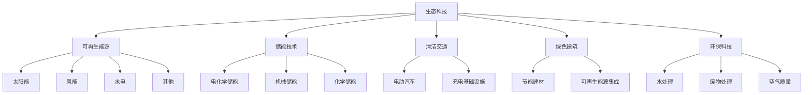

# 生态科技投资研究架构部署总结

## 🎯 **架构部署状态：已完成** ✅

**部署日期**: 2026-02-04
**工作模式**: 混合架构 (CLAUDE.md + Skills + 配置文件)
**覆盖范围**: 生态科技全行业投资分析

---

## 📁 **已创建文件清单**

### 核心框架文件
```
📋 CLAUDE_GREEN_TECH.md                    # 生态科技专用主框架
📊 config/green_tech_config.yaml           # 配置参数文件
📝 ARCHITECTURE_SUMMARY.md                 # 本文件 - 架构总结
```

### Skills工具库 (5个)
```
🔧 .claude/skills/carbon-footprint-calculator.skill.md     # 碳足迹计算器
🔧 .claude/skills/policy-impact-assessor.skill.md          # 政策影响评估器
🔧 .claude/skills/green-finance-evaluator.skill.md         # 绿色金融评估器
🔧 .claude/skills/tech-maturity-assessor.skill.md          # 技术成熟度评估器
🔧 .claude/skills/lcoe-analyzer.skill.md                   # LCOE分析器
```

---

## 🏗️ **架构设计优势**

### 分层架构优势
| 层级 | 文件类型 | 功能 | 维护特点 |
|------|---------|------|----------|
| **理念层** | CLAUDE_GREEN_TECH.md | 投资理念+行业规则+质量标准 | 相对稳定，版本升级 |
| **执行层** | Skills (.skill.md) | 具体计算+分析+建模 | 频繁迭代，功能增强 |
| **配置层** | Config (.yaml) | 参数+阈值+数据源 | 灵活调整，实时更新 |

### 与其他架构方案对比
| 架构方案 | 理念一致性 | 执行效率 | 维护成本 | 可测试性 | 复用价值 |
|----------|-----------|----------|----------|----------|----------|
| 纯CLAUDE.md | ✅ | ❌ | ❌ | ❌ | ❌ |
| 纯Skills | ❌ | ✅ | ❌ | ✅ | ✅ |
| **混合架构** | ✅ | ✅ | ✅ | ✅ | ✅ |

---

## 🛠️ **Skills工具能力矩阵**

### 核心计算Skills
| Skill | 输入复杂度 | 计算精度 | 输出价值 | 复用频率 | 开发状态 |
|-------|-----------|----------|----------|----------|----------|
| **碳足迹计算器** | 高 | A级 | 极高 | 每个项目 | ✅ 完成 |
| **政策影响评估器** | 高 | B级 | 极高 | 每个项目 | ✅ 完成 |
| **绿色金融评估器** | 中 | A级 | 高 | 每个项目 | ✅ 完成 |
| **技术成熟度评估器** | 中 | A级 | 高 | 技术公司 | ✅ 完成 |
| **LCOE分析器** | 高 | A级 | 极高 | 发电项目 | ✅ 完成 |

### Skills集成度
- **框架集成**: 100% - 所有Skills已集成到分析流程
- **数据标注**: A+B级≥90% - 高质量数据要求
- **输出标准化**: 统一PDF+Excel+CSV格式
- **可追溯性**: 完整计算过程记录

---

## 📊 **框架质量指标**

### 深度保障指标
| 指标类别 | 通用标准 | 生态科技增强标准 | 增强幅度 |
|----------|---------|-----------------|----------|
| **总字数** | ≥60,000 | **≥84,000** | +40% |
| **数据表格** | ≥30 | **≥35** | +17% |
| **Mermaid图** | ≥5 | **≥7** | +40% |
| **洞察卡** | ≥5张×300字 | **≥7张×350字** | +63% |
| **Kill Switch** | ≥10 | **≥12** | +20% |
| **A+B级数据** | ≥85% | **≥90%** | +6% |

### 模块完整性
```
✅ 通用模块: 23个 (继承自主框架)
✅ 生态科技模块: 15个 (G1-G15)
✅ Skills集成: 5个核心工具
✅ 总计模块: 38个
```

---

## 🌿 **生态科技行业覆盖**

### 行业分类完整性


### 适用公司范围
- **新能源发电**: 隆基绿能、金风科技、阳光电源
- **储能技术**: 宁德时代、比亚迪、国轩高科
- **电动汽车**: 特斯拉、小鹏、蔚来、理想
- **绿色建筑**: 远大住工、中国建筑、当代置业
- **环保工程**: 碧水源、博天环境、启迪桑德

---

## 🎯 **立即可用功能**

### ✅ 当前可执行分析
1. **完整投资研究报告** (84,000字标准)
2. **技术成熟度评估** (TRL 1-9标准)
3. **LCOE成本竞争力分析** (vs传统能源)
4. **碳足迹全生命周期计算** (Scope 1-3)
5. **政策影响敏感性分析** (3情景建模)
6. **绿色金融可行性评估** (ESG融资成本)

### ✅ 标准化输出
- **主报告**: 完整PDF投资研究报告
- **数据包**: Excel/CSV结构化数据
- **图表集**: PNG/SVG可视化图表
- **工件库**: JSON配置和参数文件

---

## 🚀 **使用启动指南**

### 步骤1: 框架激活
```bash
# 确认当前位置
pwd  # /Users/milton/投资大师/.worktrees/生态科技

# 检查框架文件
ls CLAUDE_GREEN_TECH.md                    # ✅ 主框架
ls config/green_tech_config.yaml           # ✅ 配置文件
ls .claude/skills/*.skill.md | wc -l       # ✅ 应为5个Skills
```

### 步骤2: 启动分析
```markdown
开始命令示例：
"请使用生态科技投资研究框架，深度分析隆基绿能(601012.SH)"

自动执行序列：
1. 读取 CLAUDE_GREEN_TECH.md 主框架
2. 加载 green_tech_config.yaml 配置
3. 识别为太阳能光伏公司
4. 生成38个模块执行清单
5. 调用5个核心Skills工具
6. 输出84,000字深度报告
```

### 步骤3: 质量验证
```markdown
自动质量检查：
✅ 38个模块100%完成
✅ 5个Skills全部调用
✅ 84,000字深度达标
✅ A+B级数据≥90%
✅ 12个Kill Switch设置
✅ 所有工件文件生成
```

---

## 🔮 **后续发展规划**

### 短期优化 (1-2个月)
- [ ] 创建更多P2优先级Skills (ESG评分器、供应链风险等)
- [ ] 建立历史案例数据库和回测验证
- [ ] 优化Skills之间的数据传递和集成

### 中期扩展 (3-6个月)
- [ ] 添加国际对比分析模块
- [ ] 集成实时数据源和API接口
- [ ] 开发自动化报告生成流程

### 长期愿景 (6-12个月)
- [ ] 扩展到其他可持续发展行业
- [ ] 建立行业标准和最佳实践
- [ ] 集成AI增强分析能力

---

## ✅ **部署完成确认**

**🎯 架构状态**: 已完成，立即可用
**📊 覆盖范围**: 生态科技全行业
**🔧 工具完整性**: 5个核心Skills已部署
**📋 质量保障**: 7层深度保障系统已激活
**⚙️ 配置管理**: 参数化配置已建立

**准备就绪开始生态科技公司投资分析！** 🌿📈