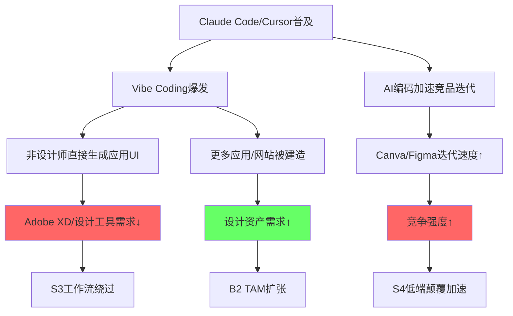

# AI对软件公司冲击评估体系 (AIAS v1.0)

> **AI Software Impact Assessment System**
> 创建: 2026-03-17 | 源自: ADBE深度调研准备
> 目标: 可复用框架，适用于所有SaaS/软件公司的AI冲击评估
> 后续: ADBE调研后升级为v2.0，纳入CQI品质评估体系

---

## 一、框架定位

### 为什么需要AIAS？

现有投资分析框架对AI影响的处理存在三个系统性缺陷:

1. **M13矩阵(INTC/ANET)是为硬件/基础设施设计的** — 评估"AI对半导体需求的影响"，而非"AI对软件公司商业模式的存亡威胁"
2. **护城河框架(CQI v3.1)的C1-D1维度未覆盖"AI侵蚀路径"** — 一家公司可能C1嵌入=5(极深)，但AI可以从C1之外的维度绕开护城河
3. **估值框架假设商业模式稳定** — Forward PE 9.6x可能反映"市场在定价商业模式转型"，而非简单的"低估"

### AIAS的核心命题

> 对软件公司，AI不是单维度的"利好/利空"判断。
> AI同时作为**5种冲击力**和**4种利好力**作用于公司的不同业务线。
> 净影响取决于各业务线的收入权重和冲击/利好的交互效应。
> **分裂体现象**: 同一家公司的不同业务可能同时是AI受益者和AI受害者。

---

## 二、冲击分类体系 (S1-S5)

### S1: 功能替代 (Feature Substitution)

**定义**: AI直接完成用户原本需要该软件完成的核心任务。

**传导机制**:
```
AI工具生成最终产物 → 用户不再需要打开传统软件 → 功能价值归零
```

**量化指标**:
- 替代覆盖率: AI能完成该软件多少%的核心用例？
- 质量对等度: AI产出在多少%的用例中达到"够用"水平？
- 时间压缩比: AI完成同一任务的时间是传统工具的几分之一？

**评分标准 (0-5)**:
| 分数 | 描述 | 示例 |
|------|------|------|
| 0 | AI无法完成该软件的任何核心任务 | ERP系统(SAP) |
| 1 | AI可完成<10%边缘用例 | CAD软件(Autodesk) |
| 2 | AI可完成10-30%简单用例，质量勉强够用 | Photoshop简单编辑 |
| 3 | AI可完成30-60%用例，专业用户仍需原工具 | 营销文案生成(替代部分CRM) |
| 4 | AI可完成60-80%用例，仅复杂场景需原工具 | 基础网页设计(替代部分XD) |
| 5 | AI可完成>80%用例，原工具变为可选 | 简单图像生成(替代Stock) |

**Adobe各业务线S1评估**:
- Creative Cloud (专业): 2 — AI可做简单编辑/生成，但专业级精修、多层合成、色彩管理仍需PS/AI/Pr
- Creative Cloud (消费/SMB): 4 — Canva AI + GPT-4o图像生成可满足大部分非专业需求
- Firefly: 0 — Firefly本身就是AI工具，不存在被AI替代
- Document Cloud: 1 — PDF编辑/签名的结构化特性难以被通用AI替代
- Experience Cloud: 1 — 营销编排/CDP/个性化引擎的系统复杂度超出当前AI能力
- Express: 2 — AI模板生成可以部分替代，但品牌模板锁定+审批流仍有差异化

### S2: 座位压缩 (Seat Compression)

**定义**: AI提升单人生产力 → 完成相同工作量需要更少人 → 企业采购更少license。

**传导机制**:
```
AI嵌入工具提升效率3-5x → 企业需要的设计师/编辑人数减少 → 每企业seat数下降
→ 即使ARPU不变, 总ARR因seat减少而下降
```

**量化指标**:
- 效率提升倍数: AI让单个用户生产力提升多少倍？
- seat弹性: 效率提升1x → seat减少多少%？(非线性关系)
- 替代滞后期: 从效率提升到实际裁减seat需要多少个季度？

**评分标准 (0-5)**:
| 分数 | 描述 |
|------|------|
| 0 | AI不影响该软件的人均产出 |
| 1 | AI提升效率<30%, 企业不会因此减seat |
| 2 | AI提升效率30-100%, 部分企业开始优化seat数 |
| 3 | AI提升效率2-3x, 企业普遍开始评估seat优化 |
| 4 | AI提升效率3-5x, seat压缩成为CFO优先议题 |
| 5 | AI提升效率>5x, 行业level的seat大规模缩减 |

**关键洞察**: 座位压缩是**SaaSpocalypse的核心机制**。Jefferies分析: "如果10个AI agent做100个销售的活，你不需要100个Salesforce seat。" 对Adobe: "如果1个设计师+Firefly做3个人的活, 企业砍2个Creative Cloud seat。"

**Adobe各业务线S2评估**:
- Creative Cloud (专业): 2 — Firefly提升效率明显，但创意岗位裁减滞后(12-24个月)
- Creative Cloud (消费/SMB): 3 — 小企业已在用AI替代兼职设计师
- Document Cloud: 1 — 文档处理效率提升不直接导致seat减少(每人都需要PDF)
- Experience Cloud: 2 — 营销自动化AI可能减少营销团队规模

### S3: 工作流绕过 (Workflow Bypass)

**定义**: AI编码工具/agent直接生成最终产物，完全跳过中间软件工具链。

**传导机制**:
```
Claude Code/Cursor生成完整UI代码 → 不经过设计稿(Figma/XD)
→ 设计→开发的handoff环节被消除 → 设计工具失去工作流中的必要位置
```

**这是2026年最新的威胁维度**，由vibe coding现象驱动:
- 92%美国开发者每日使用AI编码工具
- Collins Dictionary 2025年度词: "vibe coding"
- 非设计师用自然语言描述→AI直接生成可用应用

**量化指标**:
- 工作流嵌入深度: 该软件在多少%的工作流中是"必经节点"？
- 绕过可行性: 用AI工具绕过该节点，产出质量损失多少？
- 绕过采用率: 目前多少%的新项目已经绕过该工具？

**评分标准 (0-5)**:
| 分数 | 描述 |
|------|------|
| 0 | 该软件是工作流的终端输出(无法绕过) |
| 1 | AI可绕过<5%的工作流场景 |
| 2 | AI可绕过5-20%场景, 主要是简单/标准化项目 |
| 3 | AI可绕过20-50%场景, 中等复杂度项目也开始绕过 |
| 4 | AI可绕过>50%场景, 仅高度定制化项目仍需该工具 |
| 5 | AI完全替代该工作流节点 |

**Adobe各业务线S3评估**:
- Creative Cloud (专业): 1 — 专业创意流程仍需精修/合成/多层编辑
- Creative Cloud (消费/SMB): 2 — vibe coding + AI模板可绕过简单设计需求
- Document Cloud: 0 — PDF是终端输出格式，无法被绕过
- Experience Cloud: 1 — 营销编排涉及数据集成/审批/合规，AI agent尚无法完全替代
- Express: 2 — 轻量设计需求被AI直接生成的概率较高

### S4: 低端颠覆 (Low-End Disruption)

**定义**: AI赋能的轻量工具满足80%用户80%需求，以更低成本/更简单体验切入。

**传导机制**:
```
Canva AI + 免费Affinity提供"够用"的创意功能 → 价格=$0-12.99/月 vs Adobe $54.99/月
→ 非专业用户/小企业/学生流向低价替代品 → Adobe在低端市场份额流失
→ 低端流失可能逐渐向上渗透(Figma已证明这一路径)
```

**量化指标**:
- 功能覆盖率: 低端替代品覆盖多少%的核心功能？
- 价格差: 替代品价格是原产品的几分之一？
- 向上渗透速度: 低端替代品进入中高端市场的速度

**Adobe特别关注**:
- Canva: 免费基础版 + $12.99/月Pro vs Adobe $54.99/月全套
- Canva收购Affinity并免费化 → 直接攻击Adobe的价格壁垒
- Canva Magic Layers (2026) → 将平面图像转为可编辑多层设计 → 直接挑战PS核心价值主张

### S5: 平台脱媒 (Platform Disintermediation)

**定义**: AI成为新的用户入口/交互层，绕过传统软件的分发渠道。

**传导机制**:
```
用户对ChatGPT说"帮我做一张海报" → ChatGPT调用内置图像生成 → 不打开Photoshop
→ AI平台成为创意内容的主入口 → 传统软件失去"被打开"的机会
→ 用户心智从"打开PS做图"转变为"告诉AI做图"
```

**量化指标**:
- AI平台创意任务承接率: 多少%的简单创意任务已在AI平台内完成？
- 用户入口迁移率: 新用户中多少%首先接触的是AI平台而非传统软件？
- 平台API回流率: AI平台完成任务时多少%会调用传统软件的API？

---

## 三、利好分类体系 (B1-B4)

### B1: 功能增强 (Feature Enhancement)

**定义**: AI作为现有软件的内嵌能力，提升产品价值和用户粘性。

**Adobe实例**: Firefly嵌入Photoshop → 生成式填充/扩展 → 专业用户效率翻倍 → 留存和ARPU同时提升

**量化指标**:
- AI功能使用率: 多少%的付费用户每月使用AI功能？
- 留存差异: 使用AI功能的用户vs不使用的用户，留存率差多少pp？
- ARPU差异: AI功能是否驱动了升级到更高价位tier？

### B2: TAM扩张 (TAM Expansion)

**定义**: AI降低使用门槛，让原本不是目标用户的人群进入市场。

**Adobe实例**: Express + Firefly让8000万非专业用户(freemium MAU)开始创作 → 其中一部分转化为付费

**量化指标**:
- 新用户获取率: AI功能驱动的新注册用户占总新增的多少%？
- 新用户转化率: AI渠道获取的新用户→付费的转化率
- 新用户ARPU: 新用户群体的ARPU vs 传统用户群体

**关键辩论: Jevons悖论是否成立？**
- AI降低创作成本80% → 创作量爆发5-10x → 总市场需求↑ → TAM扩张
- 还是: AI降低创作成本 → 用户用免费工具完成 → 付费意愿↓ → TAM名义扩张但可货币化部分缩小

### B3: 基础设施化 (Infrastructure Transformation)

**定义**: 软件从直接面向用户的工具，转型为AI agent的后端基础设施/API。

**Adobe实例**: Firefly Services API + Adobe Experience Platform Agent Orchestrator → AI agent调用Adobe做内容生成

**传导机制**:
```
企业部署AI agent做营销内容 → agent需要调用创意生成API → Firefly Services API
→ Adobe从"卖seat给人"变为"卖API调用给AI系统"
→ 商业模式从订阅制向计量制迁移
```

**量化指标**:
- API收入占比: API/计量收入占总收入的%
- API增速: API收入YoY增长率 vs 订阅收入增长率
- 客户类型迁移: 多少%的收入来自"人用"vs"机器调用"？

**这是Adobe最关键的战略赌注**: 如果基础设施化成功，Adobe从"被AI冲击的软件公司"变为"AI基础设施提供商"。

### B4: 信任溢价 (Trust Premium)

**定义**: AI时代企业更需要可信/合规/品牌安全的AI内容平台。

**Adobe实例**: Firefly训练数据100%合法(Adobe Stock + 公共领域) + IP赔偿承诺 + Content Credentials内容溯源

**量化指标**:
- 企业客户占比: 多少%的AI功能收入来自企业(vs个人)?
- 品牌安全溢价: 企业为"可商用AI"额外支付多少%溢价?
- 竞品合规差距: 竞品(Midjourney/Stable Diffusion)在版权方面的风险有多大?

---

## 四、净影响评估方法

### 4.1 业务线级评估矩阵

对目标公司的每个业务线，分别评估S1-S5和B1-B4:

```
净影响(业务线i) = Σ(Bj × 权重j) - Σ(Sk × 权重k)
```

其中:
- S权重默认=1.0，可根据时间窗口调整(近期威胁×1.5, 远期威胁×0.7)
- B权重默认=1.0，可根据实现概率调整(已验证×1.3, 假说级×0.5)

### 4.2 公司级净影响

```
公司净影响 = Σ(净影响i × 收入权重i)
```

### 4.3 分裂体检测

**分裂体定义**: 当公司存在至少一条业务线净影响≤-5且至少一条≥+5时，该公司为"AI分裂体"。

**分裂体的估值含义**:
- 市场倾向于用"最差业务线"的倍数给整个公司定价
- 如果受益业务增长可以抵消受害业务萎缩，当前估值就是被低估
- 如果受害业务萎缩速度>受益业务增长速度，市场定价可能是对的
- **关键指标: 交叉点** — 何时受益业务收入超过受害业务的收入损失？

### 4.4 三类结论

| 净影响 | 分类 | 估值含义 |
|--------|------|---------|
| ≥+5 | AI受益者 | 当前估值可能低估AI贡献 |
| -5~+5 | AI重组者 | AI重构价值分配但净效应中性 |
| ≤-5 | AI受害者 | 当前估值可能仍高估 |
| 分裂体 | 需拆分估值 | 单一倍数估值必然错误 |

---

## 五、AI冲击动态追踪 (Kill Switch体系)

### 5.1 通用Kill Switch (适用所有软件公司)

| KS-ID | 监控指标 | 频率 | 阈值 | 触发后动作 |
|-------|---------|------|------|-----------|
| KS-AIAS-01 | 净seat增长率 | 季度 | 连续2Q负增长 | 重评S2座位压缩分 |
| KS-AIAS-02 | ARPU变化(剔除提价) | 季度 | YoY<-3% | 重评S1功能替代分 |
| KS-AIAS-03 | AI功能驱动的新增ARR | 季度 | YoY<50%(高增长期) | 重评B1/B2分 |
| KS-AIAS-04 | API/计量收入占比 | 年度 | 2年后仍<2% | 重评B3基础设施化分 |
| KS-AIAS-05 | 免费/开源替代品质量 | 半年 | 达到专业可商用级 | 重评S4低端颠覆+B4信任溢价 |
| KS-AIAS-06 | AI推理成本/COGS | 季度 | 毛利率压缩>3pp | 重评AI业务经济性 |
| KS-AIAS-07 | 企业客户流失到AI-native工具 | 季度 | 净流失率>2% | 重评全局 |

### 5.2 传导速度估算

不同S类型的传导时间窗口:

| 冲击类型 | 传导速度 | 理由 |
|----------|---------|------|
| S1功能替代 | 6-18月 | 一旦AI质量达标，用户迁移迅速 |
| S2座位压缩 | 12-36月 | 企业预算周期+组织惯性延迟 |
| S3工作流绕过 | 18-48月 | 需要新工作流模式被广泛采纳 |
| S4低端颠覆 | 12-24月 | 价格敏感用户迁移快，但向上渗透慢 |
| S5平台脱媒 | 24-60月 | 用户习惯迁移是最慢的 |

---

## 六、与CQI框架的集成方案

### 6.1 新增维度: AI韧性分 (AI-Resilience Score)

在CQI品质评估的D维度(前瞻)中新增:

**D2-AI: AI韧性评分 (0-10)**

计算方法:
```
AI韧性分 = 10 + 公司级净影响
(上限10, 下限0)
```

| AI韧性分 | 含义 |
|---------|------|
| 8-10 | AI净受益者, 护城河因AI加深 |
| 5-7 | AI中性或轻度受益, 护城河基本不变 |
| 3-4 | AI重组者, 护城河在迁移但净效应不确定 |
| 0-2 | AI净受害者, 护城河正在被侵蚀 |

### 6.2 C1嵌入性质扩展

在现有C1嵌入性质四分类(制度型/契约型/标准型/偏好型)中新增评估:

**AI绕过难度**: 该嵌入类型是否能被AI绕过？
- 制度型(FICO): AI极难绕过(监管要求FICO评分) → AI韧性加分
- 契约型(SPGI): AI难绕过(合同规定使用S&P评级) → AI韧性加分
- 标准型(Adobe PDF): AI可能绕过(新格式可能出现但转换成本高) → AI韧性中性
- 偏好型(Adobe Photoshop): AI较易绕过(用户偏好可变) → AI韧性扣分

### 6.3 筛选系统集成

在低估股筛选框架L4品质层中:
- 新增**AI冲击净影响快速评估** (S1-S5 vs B1-B4简化版)
- 对所有SaaS/软件公司标记**分裂体风险标志**
- Forward PE vs TTM PE离散度>30%时触发**商业模式转型风险警告**

---

## 七、ADBE实战应用 (v1.0首次实施)

### 7.1 ADBE业务线定义

| 业务线 | FY2025收入 | 占比 | 描述 |
|--------|-----------|------|------|
| Creative Cloud (专业) | ~$9.5B | 40% | PS/AI/Pr/AE等专业工具订阅 |
| Creative Cloud (消费/SMB) | ~$4.5B | 19% | 入门级订阅+Express |
| Firefly独立 | ~$0.25B+ | 1% | Firefly订阅+credits+API |
| Document Cloud | ~$3.5B | 15% | Acrobat/PDF/Sign |
| Experience Cloud | ~$5.5B | 23% | AEP/GenStudio/Analytics |
| 其他 | ~$0.5B | 2% | 出版/广告 |

### 7.2 ADBE完整评估矩阵

(详细评分见报告Phase 1-3, 此处为框架模板)

| 业务线 | S1 | S2 | S3 | S4 | S5 | B1 | B2 | B3 | B4 | **净** | **分类** |
|--------|----|----|----|----|----|----|----|----|----|----|---------|
| CC专业 | -2 | -2 | -1 | -1 | -1 | +4 | +1 | +1 | +2 | **+1** | 中性偏好 |
| CC消费/SMB | -4 | -3 | -2 | -4 | -2 | +2 | +3 | +1 | +1 | **-8** | 受害者 |
| Firefly | 0 | 0 | 0 | 0 | 0 | +3 | +4 | +3 | +3 | **+13** | 受益者 |
| Document | -1 | -1 | 0 | -2 | -1 | +4 | +2 | +2 | +3 | **+6** | 受益者 |
| Experience | -1 | -2 | -1 | -1 | 0 | +3 | +2 | +2 | +3 | **+5** | 受益者 |
| Express | -2 | -1 | -2 | -3 | -2 | +3 | +4 | +1 | +1 | **-1** | 中性 |

**公司级净影响** = (+1×40%) + (-8×19%) + (+13×1%) + (+6×15%) + (+5×23%) + (-1×2%)
= 0.4 - 1.52 + 0.13 + 0.9 + 1.15 - 0.02 = **+1.04**

**结论**: Adobe是**AI重组者(偏受益)**，不是纯受益者也不是受害者。
**分裂体检测**: CC消费/SMB(-8) + Firefly(+13) → **确认分裂体**。

### 7.3 关键不确定性

净影响+1.04的敏感性:
- 如果CC消费/SMB的S4(低端颠覆)从-4升至-5: 净影响→+0.85
- 如果Firefly的B3(基础设施化)从+3降至+1: 净影响→+0.91
- 如果CC专业的S2(座位压缩)从-2降至-4: 净影响→+0.24 (接近中性)
- **最危险情景**: CC专业S2=-4 且 CC消费S4=-5 → 净影响→+0.05 (几乎中性)

---

## 八、Claude Code/Vibe Coding专项冲击分析

### 8.1 传导路径映射



### 8.2 定量估算框架

**问题**: Claude Code等AI编码工具每年新增多少应用/网站？

```
AI编码工具用户数 × 人均项目数/年 × 需要设计资产的比例 × 平均资产需求量
= 新增设计资产需求
```

保守估算:
- AI编码工具活跃用户: ~10M (2026年)
- 人均项目数: 5/年
- 需要设计资产比例: 60%
- 平均资产需求: 20个/项目
- 新增需求: 600M个设计资产/年

**问题**: 这600M个资产需求中，多少会流向Adobe？

- 流向Adobe (Firefly API/Stock): 估计15-25%
- 流向免费AI工具 (Midjourney/DALL-E/Stable Diffusion): 估计50-60%
- 流向Canva/其他: 估计15-30%

**净效应**: vibe coding为Adobe创造的新需求 ≈ 90M-150M个资产/年
但通过AI直接绕过设计工具的损失 ≈ 更难量化(需要ADBE调研中验证)

### 8.3 AI Agent作为"新型客户"

```
传统模式: 人 → 打开Adobe软件 → 创建内容 → 输出
AI模式: 企业 → 部署AI Agent → Agent调用API → 内容自动生成 → 输出
```

Adobe正在两手押注:
1. **Firefly Services API**: 让AI agent调用Adobe的生成能力
2. **Experience Platform Agent Orchestrator**: 让Adobe自己成为AI agent的编排平台

**关键判断**: 如果AI agent成为主要"用户"，Adobe的定价模式必须从seat-based转为usage-based。这个转型的速度和执行质量将决定Adobe的未来。

---

## 九、框架升级路线图

| 版本 | 时间 | 内容 |
|------|------|------|
| v1.0 | 2026-03-17 | 基础框架: S1-S5 + B1-B4 + 净影响矩阵 + KS体系 |
| v1.1 | ADBE调研后 | ADBE实战验证 + 评分校准 + 新增ADBE特有发现 |
| v2.0 | CQI升级时 | 集成CQI D2-AI维度 + 筛选系统L4集成 + 回测全部软件公司 |
| v2.1 | 下一份软件公司报告 | 跨公司对比验证 + 权重优化 |

---

## 十、附录: 参考案例

### SaaSpocalypse关键数据 (2026年2月)
- 触发: Anthropic发布Claude Cowork
- 规模: ~$2万亿软件市值30天内蒸发
- Adobe跌幅: 26%, P/E从26x压缩至16x
- Gartner预测: 2030年35%的点状SaaS产品被AI agent替代

### 竞品AI进展速查
- **Canva**: 自有设计模型(可编辑多层输出) + Magic Layers(挑战PS核心价值) + 免费Affinity + 收购Cavalry(动画)和MangoAI(视频)
- **Figma**: 持续主导UI/UX设计(41-80%份额)，Adobe XD未能复制其多人协作体验
- **Midjourney**: v6.1被认为艺术质量最强，但无企业工作流/品牌安全
- **OpenAI**: GPT-4o图像生成引爆吉卜力风暴，展示大众市场吸引力
- **Runway**: Gen-4视频生成，Adobe已集成为Firefly合作模型

### Claude Code/AI编码工具数据 (2026年)
- GitHub Copilot: 4.7M付费用户 (+75% YoY)
- Cursor: 母公司估值$29.3B
- Claude Code: 8个月内从零到"最受欢迎"(46% vs Cursor 19% vs Copilot 9%)
- 95%开发者每周使用AI工具; 75%开发者超过一半编码工作由AI辅助
