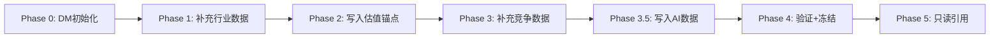

# 数据版本控制系统 (Data Master v2.0)

> **解决问题 S1**: shared_context无版本号 → SOTP段值在不同Agent间偏差249%（Waymo $86B→$300B）
> **核心思想**: 每个数据锚点带版本号，Agent引用必须带版本号，版本变更有追溯

---

## 设计哲学

**v1.0 (shared_context.md)**: 纯文本罗列数据，无版本控制，Agent自由引用，无法追踪谁改了什么
**v2.0 (Data Master)**: 每个数据点有唯一ID+版本号，Agent引用必须锁定版本，变更留审计痕迹

---

## Data Master 文件结构

每个公司的 `reports/{TICKER}/data/shared_context.md` 升级为 Data Master 格式：

```markdown
# {TICKER} Data Master v{语义版本}

> 最后更新: {YYYY-MM-DD HH:MM}
> 当前版本: v{MAJOR}.{MINOR}
> 版本规则: MAJOR=数据源变更, MINOR=数值更新

## 版本变更日志

| 版本 | 日期 | 变更项 | 变更原因 | 变更者 |
|------|------|--------|---------|--------|
| v1.1 | 2026-02-08 | DM-FIN-003 | Q4财报发布，更新EPS | Phase 2 Agent |
| v1.0 | 2026-02-07 | 初始化 | Phase 0数据预取 | Phase 0 Auto |

## 1. 财务数据锚点

### DM-FIN-001: 年度营收 [v1.0]
- **值**: $XXX.XB
- **来源**: {TICKER} 10-K FY{YEAR}
- **获取日期**: {YYYY-MM-DD}
- **状态**: 🟢 已验证

### DM-FIN-002: 季度营收 [v1.0]
- **值**: $XX.XB (最新季度)
- **来源**: {TICKER} 10-Q Q{N} FY{YEAR}
- **获取日期**: {YYYY-MM-DD}
- **状态**: 🟢 已验证

### DM-FIN-003: 每股收益 [v1.0]
- **值**: $X.XX (TTM)
- **来源**: Yahoo Finance
- **获取日期**: {YYYY-MM-DD}
- **状态**: 🟢 已验证

## 2. 估值数据锚点

### DM-VAL-001: SOTP分部估值 [v1.0]
- **分部表**:
  | 分部 | 营收($B) | 估值方法 | 每股贡献 | 来源 |
  |------|---------|---------|---------|------|
  | [A]  | X.X     | [方法]  | $XX.XX  | [来源] |
  | [B]  | X.X     | [方法]  | $XX.XX  | [来源] |
- **SOTP总计**: $XXX.XX/股
- **状态**: 🟡 Phase 2初始值

### DM-VAL-002: DCF估值 [v1.0]
- **值**: $XXX.XX/股
- **WACC**: X.X%
- **终端增长率**: X.X%
- **来源**: Phase 2 计算
- **状态**: 🟡 Phase 2初始值

## 3. 市场数据锚点

### DM-MKT-001: 当前股价 [v1.0]
- **值**: $XXX.XX
- **来源**: Yahoo Finance
- **获取日期**: {YYYY-MM-DD}
- **状态**: 🟢 已验证

### DM-MKT-002: 市值 [v1.0]
- **值**: $X.XXXT
- **来源**: Yahoo Finance
- **获取日期**: {YYYY-MM-DD}
- **状态**: 🟢 已验证

## 4. 行业/竞争数据锚点

### DM-IND-001: 市场份额 [v1.0]
- **值**: XX.X%
- **来源**: [行业报告/调研]
- **获取日期**: {YYYY-MM-DD}
- **状态**: 🟢 已验证
```

---

## 数据锚点命名规范

| 前缀 | 领域 | 示例 |
|------|------|------|
| `DM-FIN-` | 财务数据 | DM-FIN-001 年度营收 |
| `DM-VAL-` | 估值数据 | DM-VAL-001 SOTP估值 |
| `DM-MKT-` | 市场数据 | DM-MKT-001 当前股价 |
| `DM-IND-` | 行业数据 | DM-IND-001 市场份额 |
| `DM-AI-`  | AI评估数据 | DM-AI-001 AI净分 |
| `DM-PM-`  | 预测市场 | DM-PM-001 事件概率 |

**编号规则**: 每个前缀独立编号，从001开始递增

---

## 版本号语义

```
v{MAJOR}.{MINOR}

MAJOR变更 (v1.x → v2.0):
  - 数据源发生根本变化（如从TTM切换到最新季度）
  - 估值方法论变更（如SOTP可比公司更换）
  - 分部定义重新划分

MINOR变更 (v1.0 → v1.1):
  - 数值更新（新财报发布）
  - 修正笔误
  - 补充遗漏数据点
```

---

## Agent引用规范

### 引用格式

Agent在报告中引用数据时，**必须**附带DM版本号：

```markdown
✅ 正确: "年度营收$350.0B [DM-FIN-001 v1.0]"
✅ 正确: "SOTP估值$342/股 [DM-VAL-001 v1.2]"
❌ 错误: "年度营收$350.0B"  ← 无DM引用
❌ 错误: "SOTP估值约$340" ← 无精确值+无引用
```

### 引用不一致检测

Phase 结束时，Reviewer 或 Quality Gate 必须检查：

1. **报告中所有DM引用**是否指向Data Master中存在的锚点
2. **引用版本号**是否与Data Master当前版本一致
3. **引用的数值**是否与Data Master记录的值完全匹配

```
检查流程:
  1. 提取报告中所有 [DM-xxx vN.N] 标注
  2. 逐一比对 Data Master 对应锚点的值
  3. 不一致项 → 标记为 🔴 ERROR，必须修复后才能提交
```

---

## 数据状态标记

| 状态 | 含义 | 可引用 |
|------|------|--------|
| 🟢 已验证 | 已通过来源验证 | ✅ 可直接引用 |
| 🟡 初始值 | Phase生成但未经Phase 4验证 | ✅ 可引用，但需标注[初始值] |
| 🔴 已过时 | 有更新版本存在 | ❌ 禁止引用 |
| ⚪ 待获取 | 计划获取但数据未到位 | ❌ 禁止引用 |

---

## Data Master 生命周期



| Phase | DM操作 | 说明 |
|-------|--------|------|
| Phase 0 | 初始化 | 创建DM文件，写入财务/市场基础数据，版本v1.0 |
| Phase 0.5 | 只读 | CQ提取不修改DM |
| Phase 1 | 补充 | 添加行业/竞争数据锚点 |
| Phase 2 | 重点写入 | SOTP/DCF/估值数据写入DM |
| Phase 3 | 补充 | 五引擎/护城河量化数据写入 |
| Phase 3.5 | 写入 | AI冲击评分/L×S定位写入 |
| Phase 4 | 验证+冻结 | 核查所有锚点 → 标记为🟢已验证 → **冻结DM** |
| Phase 5 | 只读 | 仅引用，禁止修改 |

**Phase 4冻结规则**: Phase 4完成数据验证后，Data Master进入冻结状态。Phase 5不得修改任何锚点。如Phase 5发现数据问题，记录到报告附录而非修改DM。

---

## 版本变更协议

当Agent需要更新Data Master中的数据时：

```markdown
### 变更记录格式

#### DM-VAL-001: SOTP分部估值 [v1.0 → v1.1]
- **旧值**: $342/股
- **新值**: $326/股
- **变更原因**: Phase 4事实核查发现Waymo分部使用了过高的TAM假设
- **变更者**: Phase 4 Reviewer
- **影响范围**: Phase 2 SOTP章节需同步更新引用
```

**变更审计规则**:
1. 每次变更必须记录在DM顶部的版本变更日志中
2. 变更原因不得为空
3. 涉及估值数据的变更（DM-VAL-*），必须在变更记录中说明影响范围
4. MAJOR版本变更需要在报告中标注 `[CHANGED from vX.X: 原因]`

---

## 与现有系统的集成

### 与 shared_context.md 的关系

Data Master **替代**原 shared_context.md 的数据部分。shared_context.md 仍保留以下内容：
- Phase执行计划和进度
- CQ清单和模块分配
- Agent任务分配表

数据部分完全由Data Master管理。

### 与 confidence_system.md 的关系

Data Master的 `[DM-xxx vN.N]` 标注与三层置信度标注**共存**：

```markdown
"年度营收$350.0B [硬数据: 10-K FY2025] [DM-FIN-001 v1.0]"
```

DM标注标识**数据来源和版本**，置信度标注标识**数据可靠性层级**。两者互补，不替代。

### 与 Quality Gate v2.0 的关系

Quality Gate R-G（结果门控）新增DM一致性检查，详见 `docs/quality_gate_v2.md`。

---

## 快速参考

| 场景 | 操作 |
|------|------|
| Phase 0创建新DM | 使用上方模板，版本v1.0 |
| Agent需要引用数据 | 从DM获取 + 附带`[DM-xxx vN.N]` |
| 发现数据需更新 | 在DM中更新 + 递增版本号 + 记录变更日志 |
| Phase 4验证 | 逐条核查 → 标记🟢 → 冻结DM |
| Phase 5引用 | 只读，禁止修改 |
| 跨Phase数据不一致 | 以DM最新版本为准，旧引用必须更新 |

---

## GOOGL案例回顾

| 问题 | v1.0行为 | v2.0解决方案 |
|------|---------|-------------|
| SOTP Waymo段值从$86B变到$300B | 无版本追踪，Agent自由推算 | DM-VAL-001锚定+版本号，Agent不可自行推算 |
| GCP利润率跨Phase不一致 | 假设散落各处 | DM-FIN-010锚定GCP利润率，带版本号 |
| 最终估值来回跳 | 无审计日志 | 版本变更日志完整记录每次修改 |

---

## 版本历史

| 版本 | 日期 | 变更 |
|:---:|:---:|------|
| v1.0 | 2026-02-07 | 初版。DM模板+版本规范+Agent引用规范+生命周期+变更协议 |
