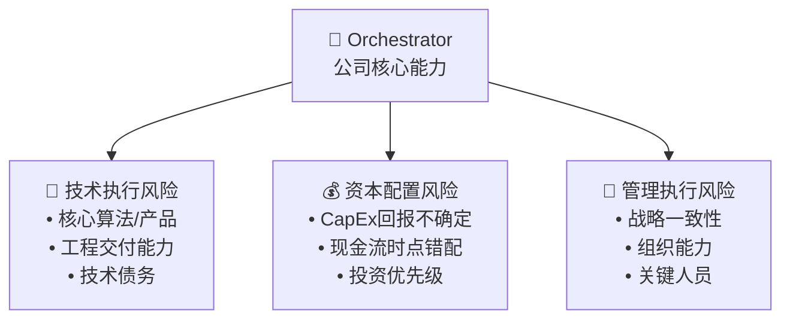
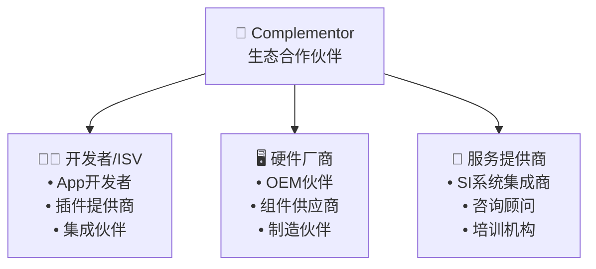
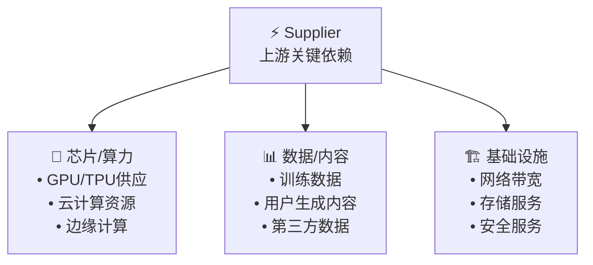
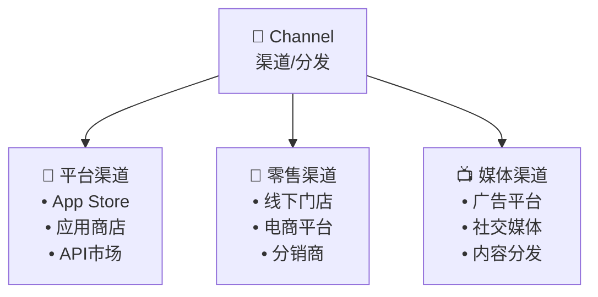
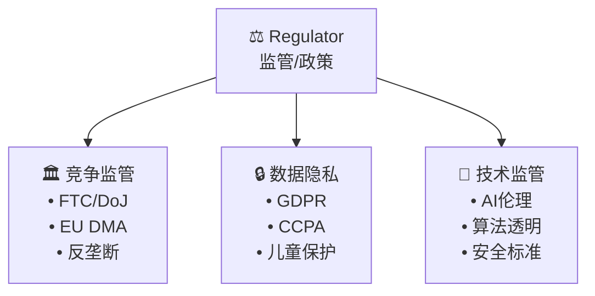
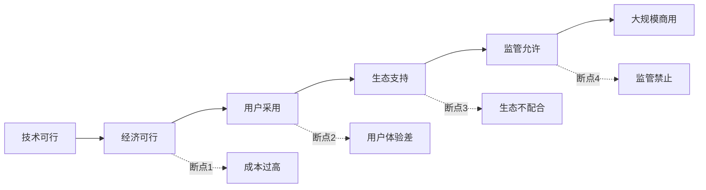

# 生态风险映射框架 (Ecosystem Risk Map) v1.0

## 框架概述

Ecosystem Risk Map (ERM) 是专为生态科技公司设计的系统性风险分析框架。与传统的单一公司风险分析不同，ERM识别并量化整个价值网络中的风险传播路径和采用链断点。

## 适用触发条件

### 强制触发 (满足任一条件)
1. **生态依赖度**: 收入>20%依赖合作伙伴生态
2. **平台模式**: 双边或多边市场商业模式
3. **AI基础设施**: 为其他公司提供AI/ML服务
4. **监管密集**: 创新业务面临重大监管不确定性
5. **网络效应**: 价值随网络规模指数增长

### 典型适用公司
- **生态科技**: META(广告生态), GOOGL(开发者生态), MSFT(云生态)
- **平台型**: AMZN(电商平台), AAPL(App Store), UBER(出行平台)
- **AI基础设施**: NVDA(AI芯片), PLTR(AI平台), OPENAI(模型API)

## 5层风险映射结构

### Layer 1: Orchestrator (编排者) - 公司自身


**风险识别清单**:
- 技术执行: 核心算法失效、工程质量、scalability
- 资本配置: AI CapEx回报、研发投入效率、现金管理
- 管理执行: CEO换代、组织变革、文化冲突

**KS/TS绑定示例**:
- KS-TECH-01: 核心技术被突破性替代
- TS-PROFIT-02: AI CapEx ROI趋势
- KS-MGMT-01: 关键高管离职>2人/季

### Layer 2: Complementor (互补者) - 生态伙伴


**关键风险**:
- 生态伙伴叛逃 (如iOS开发者转向Android)
- 互补产品质量问题连带影响
- 合作伙伴议价能力增强

**量化指标**:
- 开发者活跃度: GitHub commits, App Store提交数
- 硬件适配速度: 新品支持时间, 兼容性问题数
- 集成伙伴黏性: 多平台支持比例, 专属投入

**KS/TS绑定示例**:
- KS-ECO-01: 核心开发者同比-20%连续2季
- TS-ECO-01: 新增开发者数量季度趋势
- KS-ECO-02: 头部ISV叛逃至竞品平台

### Layer 3: Supplier (供应者) - 上游依赖


**单点失效风险**:
- GPU短缺影响AI训练进度 (如NVDA供应紧张)
- 关键数据源断供或涨价 (如API费用暴涨)
- 云服务中断影响产品可用性

**供应链韧性指标**:
- 供应商集中度: HHI指数, 前5大供应商占比
- 库存缓冲: 关键组件库存天数
- 替代方案: 备用供应商数量和切换成本

**KS/TS绑定示例**:
- KS-SUPPLY-01: 关键供应商断供>4周
- TS-SUPPLY-01: 供应链成本趋势 (YoY涨幅)
- KS-SUPPLY-02: 单一供应商依赖度>60%

### Layer 4: Channel (渠道) - 分发/触达


**渠道控制风险**:
- 平台政策变更 (如Apple 30%分成, Google Play规则)
- 渠道去中介化 (绕过传统分销商)
- 新兴渠道替代 (如TikTok电商冲击传统渠道)

**渠道健康度指标**:
- 渠道集中度: 单一渠道收入占比
- 渠道议价能力: 分成比例变化趋势
- 多元化程度: 渠道数量和收入分布

**KS/TS绑定示例**:
- KS-CHAN-01: 主要渠道政策变更影响>15%收入
- TS-CHAN-01: 渠道成本趋势 (分成/佣金比例)
- KS-CHAN-02: 新兴渠道快速替代传统渠道

### Layer 5: Regulator (监管者) - 政策/监管


**监管风险类别**:
- 反垄断执法: 拆分威胁, 收购限制, 行为约束
- 隐私合规: 数据处理限制, 罚款风险, 用户权利
- 技术伦理: AI偏见治理, 内容审核责任, 安全标准

**监管预警指标**:
- 政策信号: 国会听证频次, 监管机构表态
- 执法强度: 罚款金额, 调查案例数
- 全球协调: 跨区域监管政策趋同度

**KS/TS绑定示例**:
- KS-REG-01: 反垄断诉讼进入实质审理
- TS-REG-01: 监管环境趋势 (友好/中性/敌对)
- KS-REG-03: 数据隐私罚款>$10B

## 采用链断点分析

### 断点识别框架


### 关键问题清单
1. **技术采用顺序**: 谁必须先采用？依赖关系如何？
2. **审批硬门槛**: 哪些环节需要监管/政府审批？
3. **经济激励对齐**: 各方利益是否一致？冲突如何解决？
4. **网络临界质量**: 达到自增强需要多少用户/伙伴？

### 断点风险评估
| 断点类型 | 影响程度 | 概率评估 | 缓解措施 | 监控指标 |
|----------|----------|----------|----------|----------|
| 技术瓶颈 | 高/中/低 | % | 技术路线图 | 里程碑进度 |
| 用户采用 | 高/中/低 | % | 产品优化 | 采用率曲线 |
| 生态配合 | 高/中/低 | % | 激励机制 | 伙伴参与度 |
| 监管阻碍 | 高/中/低 | % | 政策沟通 | 监管态度 |

## 风险传播路径建模

### 级联失效模型
```python
class EcosystemRisk:
    def __init__(self, layers):
        self.layers = layers
        self.connections = self.build_connection_matrix()

    def simulate_failure_cascade(self, initial_failure_layer, failure_probability):
        """
        模拟从某一层开始的失效级联传播
        """
        cascade_impact = {}
        for layer in self.layers:
            impact_prob = self.calculate_propagation_probability(
                initial_failure_layer, layer, failure_probability
            )
            cascade_impact[layer] = impact_prob
        return cascade_impact

    def calculate_system_resilience(self):
        """
        计算整个生态系统的韧性分数
        """
        resilience_factors = {
            'redundancy': self.calculate_redundancy(),
            'adaptability': self.calculate_adaptability(),
            'diversity': self.calculate_diversity()
        }
        return weighted_average(resilience_factors)
```

### 传播路径示例
**场景**: AI监管政策突然收紧
1. **L5 (Regulator)**: 新法规禁止某类AI应用
2. **L1 (Orchestrator)**: 公司核心产品受限，收入下降
3. **L2 (Complementor)**: 开发者停止相关应用开发
4. **L4 (Channel)**: 应用商店下架相关产品
5. **L3 (Supplier)**: AI训练需求下降，供应商调整产能

## ERM实施清单

### Phase 0: ERM触发评估
- [ ] 检查ERM适用条件 (生态依赖>20%等)
- [ ] 确定公司在价值网络中的角色定位
- [ ] 识别关键利益相关方

### Phase 1: 5层风险映射
- [ ] L1 Orchestrator: 技术/资本/管理执行风险
- [ ] L2 Complementor: 生态伙伴依赖度和风险
- [ ] L3 Supplier: 上游供应链单点失效
- [ ] L4 Channel: 渠道控制和替代风险
- [ ] L5 Regulator: 监管环境和政策风险

### Phase 2: 采用链断点分析
- [ ] 绘制关键采用路径
- [ ] 识别硬门槛和审批节点
- [ ] 评估断点概率和影响

### Phase 3: KS/TS绑定
- [ ] 每层风险映射到具体KS/TS
- [ ] 设定量化阈值和数据源
- [ ] 建立联动触发规则

### Phase 4: 传播路径建模
- [ ] 建立层间连接矩阵
- [ ] 模拟关键失效场景
- [ ] 计算系统韧性分数

## 与其他框架集成

### 与传统风险分析对比
| 维度 | 传统风险分析 | ERM生态风险分析 |
|------|-------------|----------------|
| 视角 | 单一公司 | 整个价值网络 |
| 风险类型 | 财务/运营/市场 | 系统性/传播性/采用链 |
| 分析方法 | 静态清单 | 动态传播建模 |
| 适用场景 | 传统业务 | 平台/生态/网络效应 |

### 与Quality Gate集成
```bash
# 新增ERM检查项
if [[ $COMPANY_TYPE == "ecosystem_tech" ]]; then
    echo "检查ERM模块完整性..."
    grep -q "## Layer 1: Orchestrator" $REPORT || echo "ERROR: 缺少L1分析"
    grep -q "## Layer 5: Regulator" $REPORT || echo "ERROR: 缺少L5分析"
    # 检查每层是否绑定了KS/TS
    python scripts/validate_erm_ks_binding.py $REPORT
fi
```

---

**适用公司示例**:
- META: 广告主-创作者-用户三边生态，监管密集
- GOOGL: 开发者-广告主-用户多边平台，AI监管风险
- PLTR: 政府-企业客户，数据隐私敏感，技术门槛高
- TSLA: 车主-充电网络-软件生态，监管和技术双重不确定

**更新记录**:
- v1.0 (2026-02-13): 基于4报告复利学习建立，专为生态科技公司设计