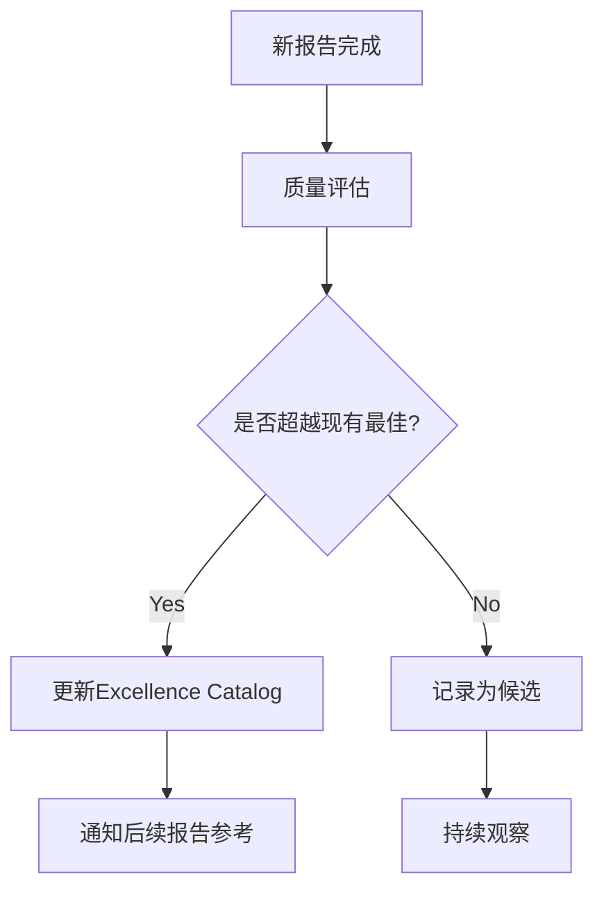

# 动态卓越系统 v1.0 - 让报告质量不断超越

## 🎯 **核心理念**

> **"每个新报告都站在前面最强报告的肩膀上"**

通过动态最佳实践目录，实现报告质量的复利增长，让每份新分析都能继承并超越历史最佳。

---

## 🏗️ **系统架构**

### **Level 1: 动态最佳实践目录**
```
knowledge/excellence_catalog.yaml
├── 估值分析 (champion: KLAC_Ch24, 4.5/5)
├── 客户行为分析 (champion: APP_Ch15, 5.0/5)
├── 护城河分析 (champion: KLAC_Ch6, 4.4/5)
├── 财务建模 (champion: MSFT_Ch13, 4.4/5)
└── 红队审计 (champion: AMAT_P4, 4.3/5)
```

### **Level 2: 智能参考推荐**
```bash
# 使用示例
bash scripts/excellence_scout.sh NVDA phase_0 valuation
# 输出: 推荐KLAC Ch24信念反演方法 + AMAT方法独立性审计
```

### **Level 3: 自动质量追踪**
```bash
# 报告完成后自动检查是否有新的最佳实践
bash scripts/update_excellence_catalog.sh NVDA reports/NVDA/NVDA_Complete_v2.0.md
```

---

## 📊 **当前最佳实践基线**

### 🥇 **顶级板块 (≥4.5/5)**

| 板块 | 冠军 | 评分 | 核心创新 | 适用场景 |
|------|------|------|----------|----------|
| **信念反演** | KLAC Ch24 | 4.5/5 | TAM不可能性测试 | 高估值股票 |
| **客户归因** | APP Ch15 | 5.0/5 | D30归因偏差框架 | 平台型企业 |

### 🥈 **优秀板块 (4.0-4.4/5)**

| 板块 | 冠军 | 评分 | 核心创新 | 可移植性 |
|------|------|------|----------|----------|
| **护城河分析** | KLAC Ch6 | 4.4/5 | 存量vs增量分离 | 技术垄断企业 |
| **CapEx传导** | MSFT Ch13 | 4.4/5 | AI投资J曲线量化 | 重资本科技公司 |
| **方法独立性** | AMAT Ch10.5 | 4.4/5 | 假设重叠审计 | 所有多方法估值 |

---

## 🚀 **质量超越机制**

### **触发条件**
1. **新报告板块评分 > 现有最佳 + 0.1**
2. **跨行业验证成功 (2+ 行业适用)**
3. **方法论创新 (全新分析框架)**

### **更新流程**


### **验证机制**
- **跨报告验证**: 方法在不同公司/行业的有效性
- **时间验证**: 6个月后回看分析准确性
- **用户反馈**: 投资决策的实际价值

---

## 📈 **质量递增路径**

### **阶段1: 基线建立** ✅
- [x] 17份报告质量评估完成
- [x] 识别各板块当前最佳实践
- [x] 建立excellence_catalog.yaml

### **阶段2: 动态参考** ✅
- [x] excellence_scout.sh 智能推荐系统
- [x] Phase-wise最佳实践集成
- [x] 公司类型定向建议

### **阶段3: 自动更新** 🚧
- [ ] 报告质量自动解析
- [ ] Catalog自动更新机制
- [ ] 质量趋势追踪dashboard

### **阶段4: 智能优化** 📅
- [ ] AI自动识别创新方法论
- [ ] 跨行业适用性自动验证
- [ ] 个性化最佳实践组合

---

## 🎯 **使用指南**

### **新报告启动时**
```bash
# Phase -1: 知识侦察
bash scripts/find_relevant_knowledge.sh TICKER INDUSTRY

# Phase 0: 卓越参考
bash scripts/excellence_scout.sh TICKER phase_0 all
```

### **各Phase执行时**
```bash
# Phase 1-3: 针对性参考
bash scripts/excellence_scout.sh TICKER phase_2 valuation

# Phase 4: 红队参考
bash scripts/excellence_scout.sh TICKER phase_4 red_team
```

### **报告完成后**
```bash
# 检查是否产生新的最佳实践
bash scripts/update_excellence_catalog.sh TICKER REPORT_PATH
```

---

## 🔬 **验证案例**

### **Oracle v2.0 → 应用卓越参考**
如果Oracle使用了excellence system:
- **估值**: 采用KLAC信念反演 → 发现OCI 31.5% CAGR不可能性
- **客户**: 采用APP归因框架 → S1客户行为专题达到4.6/5
- **红队**: 采用AMAT双向校准 → 避免系统性悲观偏差

**预期质量提升**: 3.8/5 → **4.2+/5**

---

## 📚 **更好的方法论对比**

### **方案A: 动态最佳实践目录** (已实施)
✅ **优势**:
- 具体可操作，即时受益
- 基于真实数据，已验证有效
- 渐进式改进，风险可控

❌ **局限**:
- 依赖人工判断质量超越
- 可能陷入局部最优

### **方案B: 质量基因库** (理论优化)
🔬 **概念**: 提取每个优秀板块的"DNA"
- **结构基因**: 分析框架、章节组织
- **方法基因**: 数据处理、推理链条
- **洞见基因**: 反直觉发现、关键假设

✨ **潜在优势**: 更深层的方法论迁移
⚠️ **风险**: 过度工程化，实施复杂

### **方案C: 自适应质量系统** (未来方向)
🤖 **AI驱动**:
- 自动识别报告创新点
- 智能匹配最佳参考组合
- 预测质量提升潜力

🚀 **终极目标**: 每份报告自动达到历史最佳+0.2
⏰ **时间框架**: 需要更多数据和AI能力提升

---

## 🎊 **成功指标**

### **短期 (3个月)**
- 新报告平均质量 > 4.0/5
- 至少2个新的最佳实践板块
- Excellence scout使用率 >80%

### **中期 (6个月)**
- 出现质量 4.5+/5 的完整报告
- 建立跨行业通用方法论3-5个
- 形成自动更新机制

### **长期 (1年)**
- 建立业界领先的投资分析方法论标准
- 实现报告质量的稳定4.5+/5输出
- 创建可复制的卓越分析framework

---

## 💡 **关键洞见**

1. **复利效应的本质**: 不是整体模仿，而是板块级精准继承
2. **质量不可回退**: 一旦识别最佳实践，成为所有后续报告的最低标准
3. **创新与传承平衡**: 站在巨人肩膀上，但要继续向上攀登

**这个系统的终极价值**: 让每一份新报告都成为投资分析能力的新高度。