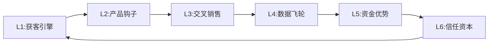

# 金融科技(Fintech)行业分析增强标准

> 仅在分析Fintech/数字银行公司时加载。与 `modules/fintech.md` 配合使用。

---

## 行业系数

- Deep-Dive系数: ×1.8 | 目标字数: ≥144,000
- Standard系数: ×1.4 | 目标字数: ~56,000
- 行业复杂度系数: 1.8（三重属性叠加）

## 公司映射

SOFI, SQ, PYPL, HOOD, LC, AFRM, COIN, UPST, NU, DAVE → 金融worktree

### 子行业分类

| 子类 | 代表公司 | 核心差异 |
|------|---------|---------|
| 数字银行/Neo-bank | SOFI, NU, DAVE, Chime | 全栈金融服务 + 银行牌照 |
| 支付生态 | SQ, PYPL, TOST | 双边网络 + 商户生态 |
| 交易平台 | HOOD, COIN, IBKR | 佣金模式 + 资产驱动 |
| 另类借贷 | UPST, LC, AFRM | AI风控 + 信贷周期敏感 |
| BaaS基础设施 | SOFI(Galileo), MQ, FI | B2B平台 + 启用账户驱动 |

---

## 三重属性分析框架

> **核心洞察**: Fintech公司同时具备银行、科技平台、消费品牌三种属性，必须同时评估三个维度。

```
┌─────────────────────────────────────────────────────────────────┐
│  Fintech = 银行 × 科技平台 × 消费品牌                          │
├─────────────────────────────────────────────────────────────────┤
│                                                                 │
│  银行维度（利差驱动）                                           │
│  ├─ NIM/ROE/资本充足率                                         │
│  ├─ 信贷质量（NCO/逾期/拨备）                                  │
│  └─ 可比: USB, PNC, ALLY                                       │
│                                                                 │
│  科技平台维度（规模驱动）                                       │
│  ├─ 用户增长/DAU/MAU/留存率                                    │
│  ├─ 交叉销售/产品渗透/飞轮效应                                 │
│  └─ 可比: HOOD, SQ, PYPL                                       │
│                                                                 │
│  消费品牌维度（信任驱动）                                       │
│  ├─ NPS/App评分/品牌搜索量                                     │
│  ├─ CAC/有机获客比/口碑传播                                    │
│  └─ 可比: Apple(金融产品), Chime                               │
│                                                                 │
└─────────────────────────────────────────────────────────────────┘
```

**金融-科技双坐标定位**:

每家Fintech在双坐标图中的位置决定了应侧重的估值方法：

```
科技属性(0-10)
    10 │                    COIN
     9 │               HOOD
     8 │          SQ
     7 │     PYPL
     6 │                         SOFI(目标)
     5 │                    SOFI(当前)
     4 │               AFRM  LC
     3 │          UPST
     2 │     ALLY
     1 │ WFC  BAC
     0 └───────────────────────────── 金融属性(0-10)
       0  1  2  3  4  5  6  7  8  9  10
```

- 科技>7, 金融<4: 科技估值为主 (P/S, EV/Revenue)
- 金融>7, 科技<4: 银行估值为主 (PB-ROE)
- 两维均衡(4-7): 三维SOTP估值（分部拆解）

---

## 关键分析维度

### 1. 单元经济学全链路

> 对应模块 FT3，数据来自 `fintech_user_metrics.json`

```
获客成本(CAC) → 首产品激活 → 交叉销售 → 全生命周期收入(LTV)
  │                │              │              │
  ▼                ▼              ▼              ▼
按渠道拆解      首月留存       人均产品数     LTV/CAC比
(有机/付费/     30/60/90日     cross-buy率    回收期
 推荐/SEM)     留存曲线                      (目标<12月)
```

**健康基准**:

| 指标 | 优秀 | 健康 | 预警 | 危险 |
|------|------|------|------|------|
| LTV/CAC | >5:1 | 3-5:1 | 1.5-3:1 | <1.5:1 |
| CAC回收期 | <6月 | 6-12月 | 12-18月 | >18月 |
| 90天留存 | >70% | 55-70% | 40-55% | <40% |
| 人均产品数 | >3.5 | 2.5-3.5 | 1.5-2.5 | <1.5 |
| 有机获客占比 | >50% | 35-50% | 20-35% | <20% |

**SoFi参考值 (Q4 2025)**:
- 总会员: 1,365万 (+35% YoY)
- 总产品数: 2,017万 (+37% YoY)
- 人均产品数: ~1.48 (但快速改善中)
- 季度新增会员: 100万 (首次七位数)
- 行业平均CAC: ~$1,450 (远高于其他科技行业)

### 2. 信贷质量深度分析

> 对应模块 FT4，数据来自 `fintech_credit_quality.json`

**Vintage分析方法论**:

```
Vintage 2022Q1 ─────→ 6月NCO → 12月NCO → 18月NCO → 24月NCO
Vintage 2022Q2 ─────→ 6月NCO → 12月NCO → 18月NCO → ...
Vintage 2022Q3 ─────→ 6月NCO → 12月NCO → ...
Vintage 2022Q4 ─────→ 6月NCO → ...

如果新Vintage的同龄NCO持续低于旧Vintage → 信用模型在改善
如果新Vintage的同龄NCO高于旧Vintage → 信用风险在积累
```

**信贷质量仪表盘核心指标**:

| 指标 | 数据来源 | 行业基准 | 预警线 |
|------|---------|---------|--------|
| 个人贷款NCO率 | 10-K/10-Q | 3.0-4.5% | >5.5% |
| 30+天逾期率 | 财报补充 | 2.0-3.5% | >4.5% |
| 加权平均FICO | 财报/投资者日 | >720 | <700 |
| 拨备覆盖率 | 资产负债表 | 4-6% | <3% |
| Vintage恶化趋势 | 管理层commentary | 改善中 | 连续恶化 |

### 3. 存款与资金成本

> 对应模块 FT5，数据来自 `fintech_bank_charter.json`

**牌照价值量化框架**:

```
牌照前:                          牌照后:
├─ 资金来源: 仓库贷款/ABS        ├─ 资金来源: 存款为主
├─ 资金成本: 4-7%               ├─ 资金成本: 1-3%
├─ 业务范围: 受限               ├─ 业务范围: 全栈银行
├─ 监管: 州级拼凑               ├─ 监管: OCC统一
└─ 估值: 科技倍数               └─ 估值: 混合(银行+科技)

牌照价值 = (资金成本节省 × 贷款余额) + (新业务收入 × 科技倍数)
```

**SoFi银行进展 (参考)**:
- 2022年1月获得国家银行牌照
- 存款: $37.5B (Q4 2025), 快速增长
- 直接存款转换: 推动核心存款黏性
- NIM: 持续改善中（存款替代仓库贷款）

### 4. 交叉销售效率

> 对应模块 FT7

```
金融产品1 ──→ 金融产品2 ──→ 金融产品3 ──→ 投资/保险
(存款账户)    (信用卡)      (个人贷款)    (高ARPU)
     │             │              │              │
     ▼             ▼              ▼              ▼
  钩子产品      第二产品       核心盈利        增值层
  (低/零成本)  (建立习惯)     (利差收入)     (fee收入)
```

**交叉销售健康度评估**:

| 指标 | 优秀 | 健康 | 需改善 |
|------|------|------|--------|
| 多产品用户占比 | >45% | 30-45% | <30% |
| 多产品用户LTV倍数 | >3x | 2-3x | <2x |
| 产品间转化率 | >15% | 8-15% | <8% |
| 新产品采纳速度(首90天) | >20% | 10-20% | <10% |

### 5. 监管环境与压力测试

> 对应模块 FT8

**Fintech监管矩阵**:

| 监管机构 | 管辖范围 | 当前态度 | 影响评估 |
|---------|---------|---------|---------|
| OCC | 国家银行 | 中性偏积极 | 牌照价值+合规成本 |
| CFPB | 消费者保护 | 随政治波动 | 费用结构/透明度 |
| FDIC | 存款保险 | 稳定 | 资本要求 |
| SEC | 证券/加密 | 趋严 | 投资/交易业务 |
| 州监管 | 各州不同 | 差异大 | 业务扩展限制 |

**四情景压力测试**:

| 情景 | 利率 | 监管 | 信贷 | 对收入影响 |
|------|------|------|------|-----------|
| 友好 | 降息100bp+ | CFPB放松 | NCO改善 | +15~25% |
| 中性 | 降息25-50bp | 维持现状 | NCO稳定 | +5~10% |
| 收紧 | 维持/加息 | 新规约束 | NCO恶化 | -5~15% |
| 危机 | 加息+流动性紧缩 | 紧急监管 | NCO飙升 | -20~40% |

### 6. 嵌入式金融(BaaS)生态

> 对应模块 FT9

**BaaS业务评估维度**:

| 维度 | 指标 | SoFi(Galileo)参考 |
|------|------|-------------------|
| 规模 | 启用账户数 | 1.6亿+ |
| 增长 | 账户增速 YoY | 需财报跟踪 |
| 黏性 | 客户留存率 | 高(切换成本大) |
| 定价 | 每账户ARPU | 需推算 |
| 集中度 | Top-3客户占比 | 高→风险 |
| 竞争 | vs MQ/FI/JKHY | 现代API优势 |

---

## 独创分析框架

### 框架1: 6层飞轮动力学

> 详细定义见 `modules/fintech.md` — FT6模块

**核心概念**: Fintech护城河不是静态的，而是一个不断加速的飞轮。每一层的强化会传导到下一层。



**各层传导机制**:

| 传导路径 | 机制 | 量化方式 |
|---------|------|---------|
| L1→L2 | 低成本获客→更多测试产品钩子 | CAC↓ → A/B测试数↑ |
| L2→L3 | 高留存→更多交叉销售机会 | 留存率↑10pp → cross-sell率↑3pp |
| L3→L4 | 更多产品使用→更丰富行为数据 | 产品数↑1 → 数据维度↑30% |
| L4→L5 | 更精准风控→更低信用损失 | AUC↑0.05 → NCO↓50bp |
| L5→L6 | 更低资金成本→更好利率→更高满意度 | CoF↓100bp → NPS↑5 |
| L6→L1 | 更高信任→更多口碑推荐→更低CAC | NPS↑10 → 有机获客↑5pp |

**飞轮诊断输出模板**:

```
飞轮健康报告 — [公司名] [日期]
═══════════════════════════════════
Layer 1 获客引擎:    [■■■■■■■□□□] 7/10  健康
Layer 2 产品钩子:    [■■■■■■□□□□] 6/10  健康
Layer 3 交叉销售:    [■■■■□□□□□□] 4/10  ⚠️需改善
Layer 4 数据飞轮:    [■■■■■■■■□□] 8/10  优秀
Layer 5 资金优势:    [■■■■■■■□□□] 7/10  健康
Layer 6 信任资本:    [■■■■■□□□□□] 5/10  健康
───────────────────────────────────
飞轮速度指数:  6.17 / 10
断裂风险:      0.50 (L3/L4) — 中等
加速度:        1.05 — 轻微加速
最弱环节:      L3 交叉销售
优先行动:      提升人均产品数
```

### 框架2: 5层信贷周期风暴矩阵

> 详细定义见 `modules/fintech.md` + `data/research/sofi_credit_cycle_storm_matrix.md`

**核心概念**: 类似半导体6层周期雷达，为Fintech提供12-18个月信贷风险预警。

**各层详细指标与数据源**:

| 层级 | 核心指标 | 数据源 | 采集频率 | 阈值(绿/黄/红) |
|------|---------|--------|---------|----------------|
| L1 宏观金融条件 | 10Y-2Y利差, NFCI, HY OAS | FRED | 周 | >50bp / 0-50bp / <0(倒挂) |
| L2 就业与收入 | 初领失业金, JOLTS, 薪资增速 | BLS | 月 | <220K / 220-280K / >280K |
| L3 消费者健康 | 储蓄率, DTI, 信用卡利用率 | FRED/NY Fed | 月/季 | >5% / 4-5% / <4% |
| L4 借款人行为 | 30天逾期, 展期率, 还款异常 | 公司财报 | 季 | 改善 / 稳定 / 恶化 |
| L5 资产质量 | NCO率, 90+DPD, 拨备率 | 公司财报 | 季 | <3% / 3-5% / >5% |

### 框架3: 12信号双轨哨兵 (L5)

> 详细定义见 `modules/fintech.md` — FT10模块

**监控执行协议**:

1. **周度扫描**: 每周一对12个信号进行状态检查
2. **触发评估**: 任何信号触发预警 → 72小时内完成详细评估
3. **交叉验证**: 单轨触发 → 检查另一轨是否有关联信号
4. **升级判断**: 按双轨交叉预警矩阵判断行动级别

---

## 估值方法论

### 三维SOTP估值

> 详细框架见 `modules/fintech.md`

**分部估值流程**:

```
Step 1: 分部收入拆分
├─ 借贷业务: NII + 贷款销售收入 + 服务费
├─ 金融服务: 交易佣金 + 管理费 + 会员费 + 推荐收入
└─ 技术平台: Galileo收入 + Technisys收入

Step 2: 各分部独立估值
├─ 借贷: PB-ROE → 合理PB = (ROE - g) / (CoE - g)
├─ 金融服务: EV/Revenue (可比HOOD 8-12x, PYPL 3-5x)
└─ 技术平台: EV/Revenue (可比MQ 12-18x, FI 6-10x)

Step 3: 协同效应调整
├─ 交叉销售协同: +5~15% (飞轮L3评分驱动)
├─ 数据共享协同: +3~8% (飞轮L4评分驱动)
└─ 品牌溢价/折价: ±5~15% (飞轮L6评分驱动)

Step 4: 加总 = Σ(分部价值) × (1 + 协同系数)
```

**可比公司估值参照**:

| 公司 | 类型 | Forward P/E | P/S | P/B | 估值驱动因素 |
|------|------|------------|-----|-----|-------------|
| SOFI | 数字银行 | 47-59x | 9.3x | 3.2x | 会员增长+银行转型 |
| NU | 数字银行 | 17-22x | ~5.8x | 7.3x | 拉美主导+极低成本 |
| HOOD | 交易平台 | 18-22x | ~8x | ~4x | 加密+散户交易 |
| SQ | 支付生态 | 25-30x | ~3x | ~5x | Cash App+商户 |
| PYPL | 支付巨头 | 15-18x | ~3x | ~4x | 成熟期+利润 |

### 辅助估值方法

**每用户估值法**:
- 公式: 市值 / 活跃用户数 = 每用户隐含价值
- SoFi: ~$15B / 13.65M = ~$1,100/会员
- Nu: ~$50B / 127M = ~$394/客户
- 差异反映: 地域(美国vs拉美)、ARPU、货币化阶段

**超额回报模型 (Simply Wall St方法)**:
- 核心: 判断ROE是否持续超过投资者要求回报率(CoE)
- 正面Spread = ROE > CoE → 创造价值 → PB > 1x
- 负面Spread = ROE < CoE → 毁灭价值 → PB < 1x

---

## 预测市场关键事件

```yaml
搜索模板:
  通用:
    - "site:polymarket.com recession 2026"
    - "site:polymarket.com federal reserve rate"
    - "site:polymarket.com inflation"
    - "site:kalshi.com interest rate"
  Fintech特有:
    - "site:polymarket.com bank regulation"
    - "site:polymarket.com financial crisis"
    - "site:polymarket.com CFPB"
    - "site:kalshi.com consumer spending"
    - "site:polymarket.com crypto regulation"
```

---

## Kill Switch系统

> 完整12重Kill Switch见 `modules/fintech.md`
> 详细分析见 `data/research/sofi_kill_switch_system.md`

**快速参考 — 最关键的4个Kill Switch**:

| # | 名称 | 危险信号 | 行动 |
|---|------|---------|------|
| KS-001 | 个人贷款NCO飙升 | NCO>5.5% | 减仓50% |
| KS-004 | 会员增长停滞 | 连续2Q新增<15万 | 重新评估论文 |
| KS-008 | 监管重锤 | 同意令/重大罚款 | 减仓50% |
| KS-011 | 宏观信贷紧缩 | 风暴矩阵1红 | 停止加仓 |

---

## 必须工件清单

执行Final Memo之前，以下工件必须存在：

| # | 工件 | 文件格式 | 验证标准 |
|---|------|---------|---------|
| 1 | 金融-科技双坐标定位 | positioning.md | 散点图+估值体系选择 |
| 2 | 牌照与监管护照图 | regulatory_passport.md | 牌照清单+业务边界 |
| 3 | 单元经济学全链路 | unit_economics.csv | CAC/LTV/回收期 |
| 4 | 信贷质量仪表盘 | credit_dashboard.md | NCO/逾期/FICO/Vintage |
| 5 | 存款与资金成本 | funding_cost.md | 存款趋势+NIM+CoF |
| 6 | 飞轮动力学诊断 | flywheel_report.md | 6层评分+速度+断裂风险 |
| 7 | 交叉销售效率 | cross_sell.md | 产品数/LTV倍数/漏斗 |
| 8 | 监管压力测试 | regulatory_stress.md | 4情景×收入矩阵 |
| 9 | 三维SOTP估值 | sotp_valuation.xlsx | 3分部+协同+敏感性 |
| 10 | 信贷风暴矩阵 | credit_storm.md | 5层×颜色+综合评估 |
| 11 | 双轨哨兵设置 | sentinel_setup.md | 12信号+阈值+交叉预警 |
| 12 | Kill Switch清单 | kill_switches.yaml | 12个+三级阈值 |
| 13 | 可验证预测 | predictions.yaml | ≥15个+验证日期 |

---

## 数据预取要求

分析Fintech公司时，除通用7个Agent(A-G)预取的14个文件外，还需追加3个Fintech专属Agent:

| Agent | 输出文件 | 核心WebSearch查询 | 刷新周期 |
|-------|---------|------------------|---------|
| H | `fintech_user_metrics.json` | "{COMPANY} members funded accounts DAU MAU", "{TICKER} user growth cross-sell products per member" | 7d |
| I | `fintech_credit_quality.json` | "{TICKER} net charge-off rate delinquency", "{TICKER} FICO distribution personal loan credit quality" | 3d |
| J | `fintech_bank_charter.json` | "{COMPANY} deposit growth funding cost", "{COMPANY} bank charter NIM interest rate sensitivity" | 14d |

> 完整查询模板见 `data/research/fintech_prefetch_queries.md`
