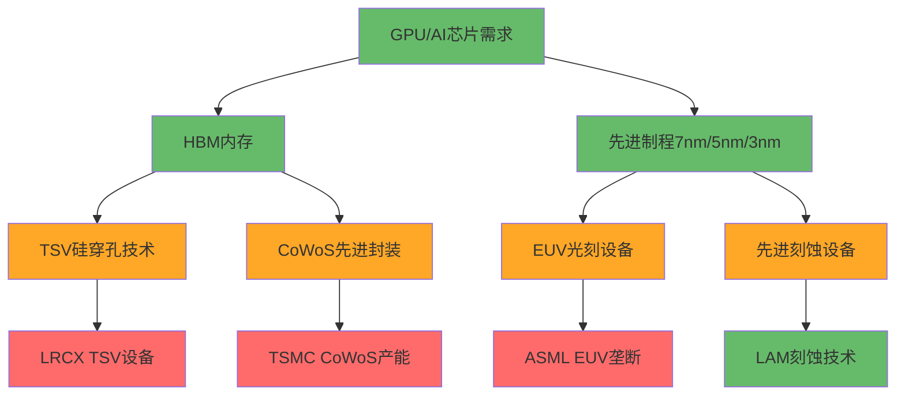

# 半导体行业分析框架 v2.0 - 基座升级版

> **基于基座分析升级**: 从分散的信号追踪升级为系统化的"三张表+两张图"框架
> **核心改进**: 瓶颈抽水模型 + 可验证预测 + 跨公司标准化比较

---

## 🎯 框架核心：三张表+两张图

### 表1: Chokepoint指数 (0-10分制)

**每家公司必须填入的8维度标准化评分**:

```yaml
维度1_不可替代性: [0-10]
  # 是否有明确替代路线？技术壁垒高度？
  # 10分: 无替代路线(EUV) | 5分: 有替代但成本高 | 0分: 容易替代

维度2_供给稀缺性: [0-10]
  # 产能扩张周期？设备/材料瓶颈？
  # 10分: 3年+扩张周期 | 5分: 1-2年 | 0分: <1年可扩张

维度3_分配权: [0-10]
  # 能否"挑客户/挑价格"？
  # 10分: 完全定价权 | 5分: 部分定价权 | 0分: 价格接受者

维度4_资格认证摩擦: [0-10]
  # 切换成本？验证周期？
  # 10分: 2年+认证周期 | 5分: 6-24月 | 0分: <6月

维度5_学习曲线优势: [0-10]
  # 良率/缺陷密度/工艺诀窍累积壁垒？
  # 10分: 不可复制经验 | 5分: 技术可学习但需时间 | 0分: 标准工艺

维度6_利润抽水能力: [0-10]
  # 长期毛利/ROIC结构性高位？
  # 10分: 毛利>60%且稳定 | 5分: 40-60% | 0分: <40%

维度7_生态锁定: [0-10]
  # 软件、工艺、平台、IP绑定程度？
  # 10分: 全栈锁定(CUDA) | 5分: 部分锁定 | 0分: 开放标准

维度8_政策护城河: [0-10]
  # 出口管制、许可、补贴依赖？
  # 10分: 监管垄断保护 | 5分: 政策倾向 | 0分: 无政策优势
```

**Chokepoint总分**: 8维度总分/8 = 整体瓶颈强度
**BPC瓶颈抽水率** = (维度6×维度4×维度2×维度1×维度3)/100000

### 表2: 周期暴露矩阵 (六层雷达标准化)

**每家公司统一的周期敏感度评估**:

```yaml
L1_存储价格敏感度: [0-5]
  # DRAM/NAND现货价变化10%，对公司影响？
  # 5: 直接传导 | 3: 间接影响 | 0: 基本无关

L2_客户CapEx敏感度: [0-5]
  # 晶圆厂CapEx变化20%，对订单/收入影响？

L3_设备周期敏感度: [0-5]
  # WFE行业增速变化，BB ratio影响？

L4_库存周期敏感度: [0-5]
  # 渠道库存天数变化，对出货影响？

L5_产能利用率敏感度: [0-5]
  # 晶圆厂/封测厂产能利用率变化影响？

L6_终端需求敏感度: [0-5]
  # AI/DC/Mobile终端需求变化传导速度？
```

**周期暴露总分** = L1×0.2 + L2×0.2 + L3×0.15 + L4×0.15 + L5×0.15 + L6×0.15
**风险窗口预测**: 基于历史周期+当前位置，预测下轮风险概率

### 表3: 结构性变量清单 (AI改变周期的地方)

```yaml
AI结构性驱动:
  HBM需求刚性: [布尔值] # 是否受益于AI对HBM的结构性需求？
  先进封装依赖: [布尔值] # 是否受益于CoWoS/先进封装瓶颈？
  算力基建属性: [布尔值] # 是否属于AI算力基础设施？

传统周期属性:
  存储周期相关: [布尔值] # 是否仍受传统DRAM/NAND周期影响？
  消费电子暴露: [布尔值] # 是否受手机/PC等消费电子周期影响？
  工业周期相关: [布尔值] # 是否受汽车/工业等传统周期影响？

挤出效应风险:
  资本挤出风险: [0-10] # HBM等新需求是否挤出传统投资？
  产能挤出风险: [0-10] # 先进制程是否挤出成熟制程？
  人才挤出风险: [0-10] # AI相关是否挤出传统研发？
```

### 图1: 价值链利润池Sankey图

```mermaid
sankey-beta
    %% 半导体价值链利润流向图
    设计/IP/EDA,250,利润池1
    晶圆制造,180,利润池2
    设备,120,利润池3
    材料,80,利润池4
    封装测试,60,利润池5
    模组整机,100,利润池6
    云服务,200,利润池7

    %% 利润池大小代表各环节价值捕获能力
    %% 设计/EDA和云服务捕获最大价值
    %% 制造和设备次之
    %% 材料和封测相对较小
```

### 图2: 瓶颈依赖图



---

## 🧮 BPC瓶颈抽水率模型

**核心公式**:
```
BPC = (利润抽水能力 × 资格认证摩擦 × 供给扩张周期 × 替代难度 × 分配权) / 100000

解释力验证:
- 高BPC (>0.5): 长期超额收益，定价权强
- 中BPC (0.2-0.5): 周期性超额收益
- 低BPC (<0.2): 接近大宗商品化
```

**应用示例**:
- **ASML EUV**: BPC~0.8 (10×9×10×10×9/100000)
- **TSMC先进制程**: BPC~0.6 (9×8×8×9×8/100000)
- **LRCX TSV**: BPC~0.4 (7×8×7×7×7/100000)
- **通用存储**: BPC~0.1 (4×3×4×3×3/100000)

---

## 📊 标准化数据收集Protocol

### 必备数据字段 (每份报告强制输出)

```yaml
公司基础:
  ticker: [ASML/LRCX/TSM等]
  细分领域: [设备/代工/存储/设计]
  主要产品: [具体产品线]

Chokepoint评分: [8维度×0-10分]

周期暴露: [6层雷达×0-5分]

结构变量: [AI/传统/挤出效应]

利润池定位:
  价值链环节: [设计/制造/设备/材料/封装/整机/云]
  利润池大小: [相对规模1-10]
  抽水能力: [毛利率%+ROIC%]

产能分配权:
  关键产能控制: [是否控制稀缺产能]
  客户锁定状态: [长期协议/优先级/价格权]
  分配权得分: [0-10分]

复杂度红利:
  受益于架构复杂化: [是/否]
  步骤数增加倍数: [相对简单工艺的倍数]
  复杂度红利得分: [0-10分]

资格认证摩擦:
  验证周期: [月数]
  再认证成本: [$数额]
  良率爬坡时间: [月数]
  停线风险: [高/中/低]
  软件工艺绑定: [强/中/弱]

区域合规约束:
  中国收入占比: [%]
  出口管制影响: [高/中/低]
  本土化替代风险: [高/中/低]
  政策依赖度: [0-10分]
```

### 缺失字段强制标注

**每份报告必须输出"Missing Fields List"**:
```yaml
缺失字段清单:
  高优先级缺失: [影响核心判断的关键数据]
  中优先级缺失: [完善分析的补充数据]
  数据源建议: [earnings call/10-K/SEMI/第三方在哪找]

证据等级评估:
  A级证据: [一手官方数据，高可信度]
  B级证据: [第三方权威数据，中等可信度]
  C级证据: [推算估计数据，低可信度]
```

---

## 🎯 可验证预测(VP)+Kill Switch升级

### 标准化VP表格式

```yaml
VP编号: VP-{公司}-{序号}
预测内容: [具体可验证的预测]
验证时间: [具体时间节点]
验证标准: [精确的判断标准]
当前概率: [基于证据的概率判断]
数据源: [验证数据的获取渠道]
影响级别: [对投资逻辑的影响权重]

示例:
VP-LRCX-01:
  内容: WFE市场2026年达到$145B
  时间: 2026年Q4
  标准: SEMI官方数据±5%
  概率: 75%
  数据源: SEMI年度报告
  影响: 20% (核心需求预测)
```

### 行业通用Kill Switch

```yaml
Tier1_致命级触发器:
  - WFE增速转负连续2季度
  - DRAM合约价连续2季度下降>20%
  - 台海冲突概率>25% (Polymarket)
  - 全面技术禁运概率>45%

Tier2_严重级触发器:
  - HPC占比(如TSMC)连续2季下降
  - HBM供给锁定协议大幅松动
  - AI CapEx增速降至<20%连续2季
  - 关键客户(如NVDA)指引大幅下调

Tier3_警告级触发器:
  - 产能利用率降至<75%持续3月
  - 库存天数超过历史75%分位数
  - 毛利率压缩>500bp在2季度内
  - 估值超过历史90%分位数持续6月
```

---

## 🔄 AI能力边界声明

### AI深度加成区域 (高置信度)
- **技术架构拆解**: 工艺流程+设备配置+材料需求
- **供应链交叉验证**: 多源数据验证+上下游印证
- **历史周期类比**: 模式识别+周期特征提取
- **跨公司财务模式**: 标准化指标对比+异常识别
- **瓶颈识别**: Chokepoint评分+依赖关系映射

### AI诚实退出区域 (中等置信度)
- **周期拐点精确预测**: 提供概率范围，不给精确时点
- **技术路线选择**: 列出可能性，不预测终极胜者
- **地缘政治影响**: 情景分析，不预测政策走向
- **管理层决策**: 基于历史模式，不预测具体决策

### 人类决策保留区域 (AI不介入)
- **投资决策和仓位分配**: AI只提供分析框架
- **风险偏好设定**: 个人/机构风险承受能力判断
- **时机选择**: 买卖时点的具体执行决策
- **资产配置**: 半导体在整体组合中的权重决策

---

## 📈 实施路径

### Phase 0: 基座数据收集
1. **三张表初版**: 选择3-5家代表公司填充表格
2. **数据源映射**: 确定每个字段的获取渠道
3. **缺失字段识别**: 构建行业数据缺口清单

### Phase 1-2: 标准化实施
1. **新报告强制使用**: 所有新的半导体报告使用新框架
2. **历史报告回填**: 逐步将LRCX/AMD/TSM/MU报告转换为新格式
3. **工具集成**: 将框架集成到MCP工具和skill中

### Phase 3: 横向建模
1. **因子模型构建**: 慢变量+中变量+快变量三层模型
2. **BPC验证**: 回测BPC与股票表现的相关性
3. **VP跟踪系统**: 建立可验证预测的自动跟踪机制

### Phase 4: 迭代优化
1. **框架校准**: 基于实际使用效果调整评分标准
2. **工具增强**: 开发自动填表+缺失字段检测工具
3. **质量提升**: 设定新的质量门控标准

---

## 🎯 预期效果

**量化改进**:
- **可比性**: 不同公司/不同报告间真正可比
- **可验证性**: VP+Kill Switch让分析可回测
- **效率提升**: 标准化框架减少重复工作50%+
- **洞察深度**: Chokepoint+BPC模型发现被忽视的垄断

**定性提升**:
- **从叙事对比→数据对比**: 同口径标准化比较
- **从定性垄断→定量瓶颈**: BPC模型量化竞争优势
- **从单点分析→系统框架**: 三张表+两张图全景视角
- **从观点漂移→模型锚定**: Kill Switch防止叙事过拟合

这套框架将使半导体分析从"手工作坊"升级为"工业化生产"，在保持洞察深度的同时大幅提升分析的系统性和可复现性。