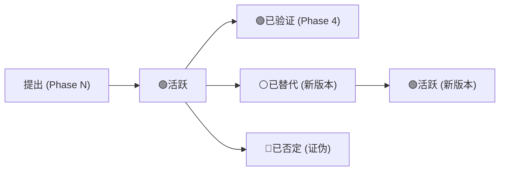

# 关键假设主表 (KAL - Key Assumptions List)

> **解决问题 S3**: 假设散落各Phase → GCP利润率假设跨Phase不一致
> **核心思想**: 集中管理所有关键假设，每个假设有唯一编号、生命周期状态、跨Phase追溯链

---

## 设计哲学

**旧模式**: 假设隐含在各Phase叙述中，跨Phase无法对照，不一致只能靠人工发现
**新模式**: 关键假设集中注册，每个有编号+状态+敏感度分级，跨Phase修改有审计记录

---

## KAL 文件位置与格式

每个公司的 `reports/{TICKER}/data/key_assumptions.md`:

```markdown
# {TICKER} 关键假设主表 (KAL)

> 最后更新: {YYYY-MM-DD}
> 假设总数: {N}个
> 状态分布: 🟢活跃 {N} | 🟡待验证 {N} | 🔴已否定 {N} | ⚪已替代 {N}

## 假设注册表

### 增长假设

| ID | 假设描述 | 假设值 | 敏感度 | 状态 | 首次提出 | 最后验证 |
|----|---------|--------|--------|------|---------|---------|
| KA-GR-001 | 云业务年增长率 | 25-30% | A级 | 🟢活跃 | P1 | P4 |
| KA-GR-002 | 广告ARPU增速 | 8-12% | B级 | 🟢活跃 | P2 | P4 |
| KA-GR-003 | 新市场渗透率 | 5%/年 | C级 | 🟡待验证 | P3 | — |

### 利润率假设

| ID | 假设描述 | 假设值 | 敏感度 | 状态 | 首次提出 | 最后验证 |
|----|---------|--------|--------|------|---------|---------|
| KA-MG-001 | 云业务营业利润率 | 28-32% | A级 | 🟢活跃 | P2 | P4 |
| KA-MG-002 | 总体毛利率 | 55-58% | B级 | 🟢活跃 | P2 | P4 |

### 估值假设

| ID | 假设描述 | 假设值 | 敏感度 | 状态 | 首次提出 | 最后验证 |
|----|---------|--------|--------|------|---------|---------|
| KA-VL-001 | 云业务EV/Revenue倍数 | 8-10x | A级 | 🟢活跃 | P2 | P4 |
| KA-VL-002 | WACC | 9.5% | B级 | 🟢活跃 | P2 | P4 |

### 风险假设

| ID | 假设描述 | 假设值 | 敏感度 | 状态 | 首次提出 | 最后验证 |
|----|---------|--------|--------|------|---------|---------|
| KA-RK-001 | 反垄断罚款概率 | 15-25% | A级 | 🟢活跃 | P1 | P4 |
| KA-RK-002 | AI投入失败概率 | <10% | B级 | 🟡待验证 | P3 | — |
```

---

## 假设分类体系

### ID命名规范

| 前缀 | 领域 | 示例 |
|------|------|------|
| `KA-GR-` | 增长假设 | 收入增速、用户增长、市场渗透 |
| `KA-MG-` | 利润率假设 | 毛利率、营业利润率、净利率 |
| `KA-VL-` | 估值假设 | 估值倍数、折现率、终端增长率 |
| `KA-RK-` | 风险假设 | 事件概率、损失估算 |
| `KA-CP-` | 竞争假设 | 市场份额、竞争格局 |
| `KA-AI-` | AI相关假设 | AI收入贡献、成本节省 |

### 敏感度分级

| 级别 | 含义 | 标准 | 行动要求 |
|------|------|------|---------|
| **A级** (关键) | 假设变动±20%会改变投资结论 | 对最终估值影响>$10/股 | 必须做敏感度分析表 |
| **B级** (重要) | 假设变动±20%影响估值但不改变结论 | 对最终估值影响$3-10/股 | 建议做敏感度分析 |
| **C级** (辅助) | 假设变动对估值影响有限 | 对最终估值影响<$3/股 | 记录即可 |

**强制规则**: 每个公司至少注册 **3个A级** + **5个B级** 假设

---

## 假设生命周期



| 状态 | 含义 | 触发条件 |
|------|------|---------|
| 🟢活跃 | 当前有效的假设 | 初次提出或经Phase 4验证通过 |
| 🟡待验证 | 已提出但未经Phase 4交叉验证 | Phase 1-3中提出 |
| 🔴已否定 | 被证据否定的假设 | Phase 4发现反证 |
| ⚪已替代 | 被更新版本取代 | 假设修正时旧版本标记 |

---

## 跨Phase传递协议

### 写入规则

| Phase | KAL操作 | 说明 |
|-------|---------|------|
| Phase 0 | 初始化KAL文件 | 创建空表格结构 |
| Phase 1 | 注册增长+竞争假设 | 从定位分析中提炼 |
| Phase 2 | 注册利润率+估值假设 | 从财务分析中提炼，**最重要的写入Phase** |
| Phase 3 | 注册AI+风险假设 | 从战略分析中提炼 |
| Phase 3.5 | 补充/修正AI假设 | AI评估可能修正Phase 3假设 |
| Phase 4 | **验证全部假设** | 逐条检验，标记状态，记录验证结果 |
| Phase 5 | 只读引用 | 报告引用KAL编号 |

### 引用规则

Agent在报告中引用假设时，**必须**附带KAL编号：

```markdown
✅ 正确: "假设云业务增速25-30% [KA-GR-001]"
✅ 正确: "基于WACC 9.5%的DCF估值 [KA-VL-002]"
❌ 错误: "假设云业务快速增长" ← 无具体值，无KAL引用
❌ 错误: "折现率设为10%" ← KAL中记录的是9.5%，数值不一致
```

### 修正规则

当假设需要修正时：

```markdown
### KA-GR-001: 云业务年增长率 [v1 → v2]
- **旧值**: 25-30%
- **新值**: 20-25%
- **修正原因**: Phase 4发现Q4增速放缓至22%，管理层下调指引
- **修正Phase**: Phase 4
- **估值影响**: SOTP中云分部每股贡献从$95降至$82 (-$13/股)
- **关联DM**: DM-VAL-001需同步更新
```

**修正约束**:
1. 旧假设标记为⚪已替代，保留在KAL中（不删除）
2. 新假设获得新版本号，旧版本+1
3. 估值影响必须量化
4. 关联的DM锚点必须同步更新

---

## Phase 4 验证清单

Phase 4对KAL中所有🟢/🟡假设执行验证：

```markdown
## KAL验证报告

| KA编号 | 假设 | 验证方法 | 验证结果 | 新状态 |
|--------|------|---------|---------|--------|
| KA-GR-001 | 云增速25-30% | Q4实际22%+指引对比 | 偏乐观，修正为20-25% | ⚪已替代→v2 |
| KA-MG-001 | 云利润率28-32% | 最新季度30.2%确认 | 符合 | 🟢已验证 |
| KA-VL-001 | 云EV/Rev 8-10x | 可比公司中位数8.5x | 符合 | 🟢已验证 |
| KA-RK-001 | 反垄断概率15-25% | 最新法律进展+预测市场 | 上调至20-30% | ⚪已替代→v2 |
```

**Phase 4 KAL验证标准**:
- 所有A级假设**必须**逐条验证
- B级假设≥80%验证
- C级假设抽查≥30%
- 验证后无🟡待验证状态的A/B级假设

---

## 敏感度分析联动

每个A级假设必须有敏感度分析表：

```markdown
### KA-GR-001 敏感度分析: 云业务增长率

| 增长率 | 云分部估值 | SOTP影响 | 最终估值 | vs Base |
|--------|----------|---------|---------|---------|
| 15% | $XXB | $XX/股 | $XXX | -X% |
| 20% | $XXB | $XX/股 | $XXX | -X% |
| **25% (Base)** | **$XXB** | **$XX/股** | **$XXX** | **—** |
| 30% | $XXB | $XX/股 | $XXX | +X% |
| 35% | $XXB | $XX/股 | $XXX | +X% |

→ 增长率每变动5ppt，估值变动约$XX/股 (X%)
```

---

## 与其他机制的集成

| 机制 | 关系 |
|------|------|
| Data Master (M1) | KAL假设中的数值来自DM锚点，修正KAL时同步更新DM |
| 反幻觉协议 (M2) | KAL中每个假设必须有来源，禁止凭空假设 |
| Kill Switch (M4) | KAL中A级假设被否定 → 触发对应Kill Switch |
| 估值修正层级 (M5) | 假设修正导致的估值变动，走修正管道 |
| 质量门控 (M6) | R-G检查KAL完整性和跨Phase一致性 |

---

## 快速参考

| 场景 | 操作 |
|------|------|
| Phase 0开始 | 创建KAL文件（空模板） |
| Phase 1-3分析中 | 提炼假设 → 注册到KAL → 附带敏感度分级 |
| Agent引用假设 | 附带`[KA-xxx]`编号 |
| 假设需修正 | 旧版本标⚪ + 新版本注册 + 记录修正原因 + 量化估值影响 |
| Phase 4验证 | 逐条验证 → 标记状态 → 输出验证报告 |
| Phase 5决策 | 只读引用KAL编号 |

---

## GOOGL案例回顾

| 问题 | 旧行为 | KAL解决方案 |
|------|--------|------------|
| GCP利润率Phase 2说28%，Phase 3用32% | 假设散落，无人对照 | KA-MG-001统一注册，跨Phase引用同一编号 |
| Waymo TAM假设无来源 | 随意假设 | KA-GR-005必须标来源+敏感度分级 |
| 估值假设修正无记录 | 直接覆盖旧值 | 修正规则要求保留旧版本+量化影响 |

---

## 版本历史

| 版本 | 日期 | 变更 |
|:---:|:---:|------|
| v1.0 | 2026-02-07 | 初版。KAL模板+分类体系+生命周期+传递协议+敏感度联动 |
