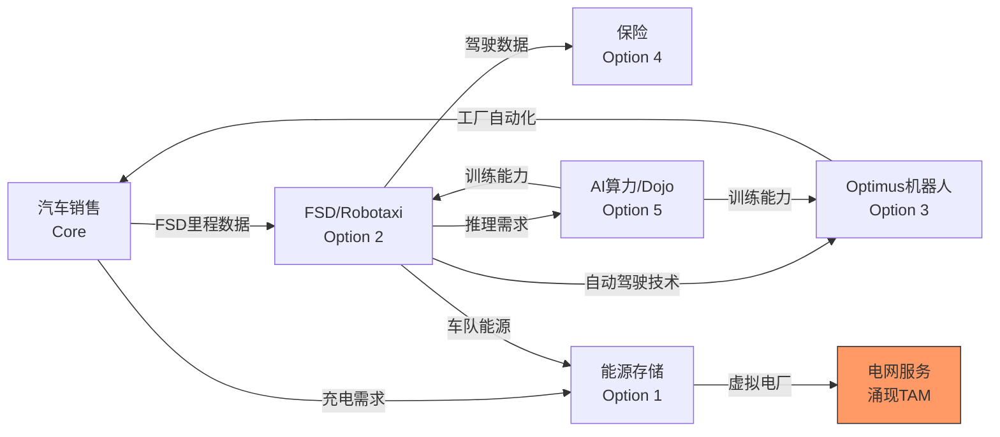

# 期权估值模块 (OVM) v1.0

> **解决问题**: 传统SOTP/DCF对高期权公司(TSLA/PLTR/GOOGL等)产出公允价值远低于市价，
> 框架缺少对"未来业务线期权价值"的定价工具。
> **定位**: 叠加在SOTP之上的第6步，不替代传统估值。
> **详见**: `docs/sotp_methodology.md` Step 6

---

## 触发条件

| 条件 | 阈值 | 动作 |
|------|------|------|
| **强制OVM** | 传统SOTP/DCF公允价值 < 当前市价的50% | 必须完成OVM全部6组件 |
| **强制OVM** | 公司有≥2条pre-revenue或early-revenue业务线 | 必须完成OVM全部6组件 |
| **建议OVM** | P/E > 50x 或 P/S > 15x | 至少完成OVM-1+OVM-2+OVM-3 |
| **不适用** | 传统SOTP与市价偏离<30% | 传统估值已充分解释 |

---

## OVM-1: Core vs Option 分离

将公司业务分为两层：

```
Full Value = Core Business Value + Σ(Option Values)

Core: 现有业务，有营收/利润，可用传统SOTP/DCF定价
Option: 未来业务，无营收或早期营收，需用概率加权定价
```

**分离模板**:

| 业务线 | 类型 | 当前营收 | 估值方法 | 估值 |
|--------|------|---------|---------|------|
| [核心业务A] | Core | $X.XB | SOTP Step 1-5 | $XX/股 |
| [核心业务B] | Core | $X.XB | SOTP Step 1-5 | $XX/股 |
| [期权路径1] | Option | $0 或早期 | OVM-3 | $XX/股 |
| [期权路径2] | Option | $0 或早期 | OVM-3 | $XX/股 |
| **Core小计** | — | — | — | **$XXX** |
| **Option小计** | — | — | — | **$XXX** |
| **Full Value** | — | — | — | **$XXX** |

**分类规则**:
- Core: 营收占比≥10% 且 增速可预测(±20%置信区间)
- Option: 营收占比<10% 或 业务尚未商业化 或 增速不可预测(>50%年波动)
- 灰色地带: 营收5-15%、高增长但未盈利 → 标注为"Emerging"，两种方法各算一次取均值

---

## OVM-2: Reverse DCF (市场隐含预期)

**核心问题**: 当前股价在定价什么？

**方法**: 以当前股价反推市场隐含的增长率/利润率/持续时间，再判断是否现实。

**计算步骤**:

```
输入:
  当前股价: $P
  当前营收: $R
  当前净利润率: M%
  WACC: W%
  终端增长率: g%

反推:
  市场隐含营收CAGR = solve for(g_rev) where DCF(g_rev, M_terminal, W, g) = P
  市场隐含终端利润率 = solve for(M_t) where DCF(g_rev_consensus, M_t, W, g) = P
```

**输出模板**:

```
Reverse DCF 隐含预期分析:
| 指标 | 市场隐含 | 分析师共识 | 历史最佳 | 判断 |
|------|---------|-----------|---------|------|
| 营收CAGR(5Y) | XX% | XX% | XX% | 合理/激进/极端 |
| 终端利润率 | XX% | XX% | XX% | 合理/激进/极端 |
| 高增长持续年数 | X年 | X年 | X年 | 合理/激进/极端 |
| 隐含终端市值 | $XXXB | — | — | vs TAM合理性 |

结论: 市场隐含预期 [合理/偏乐观/显著激进/不现实]
理由: [具体论据]
```

**判断标准**:
- **合理**: 隐含增速 ≤ 分析师共识×1.2 且 终端利润率 ≤ 行业最佳×1.1
- **偏乐观**: 隐含增速 ≤ 分析师共识×1.5 且 有历史先例支撑
- **显著激进**: 隐含增速 > 共识×1.5 或 终端利润率 > 行业最佳×1.3
- **不现实**: 隐含终端市值 > 可达TAM×30%市占率 或 高增长需持续>15年

---

## OVM-3: 期权树定价

每条期权路径独立定价，公式：

```
Option Value = TAM × Market_Share × Net_Margin × Multiple × Probability × Discount_Factor

其中:
  TAM: 目标市场规模(5-10年预测)
  Market_Share: 公司可达市占率(需论证)
  Net_Margin: 稳态净利润率
  Multiple: 该业务成熟后的PE倍数
  Probability: 成功概率(综合技术/监管/竞争/执行)
  Discount_Factor: 1/(1+WACC)^T, T=预计实现年数
```

**期权卡模板** (每条路径一张):

```
期权路径: [名称]
━━━━━━━━━━━━━━━━━━━━━━━━━━━━━
TAM (2030E): $XXX B [硬数据: 来源]
  - 当前市场: $XX B
  - CAGR: XX%
  - 来源: [行业报告/分析师]

市占率假设: XX%
  - Bull: XX% (理由)
  - Base: XX% (理由)
  - Bear: XX% (理由)

稳态利润率: XX%
  - 参考: [可比公司/行业]

成熟期PE: XXx
  - 参考: [可比业务类型]

成功概率: XX%
  - 技术可行性: [高/中/低] (XX%)
  - 监管环境: [利好/中性/阻碍] (XX%)
  - 竞争格局: [领先/平手/落后] (XX%)
  - 执行能力: [强/中/弱] (XX%)
  - 综合: XX% = Π(各维度)^(1/4) × 校正因子

实现时间: YYYY年 (T=X年)
折现因子: 1/(1+W%)^T = 0.XX

期权价值/股:
  = TAM × Share × Margin × PE × Prob × DF / 稀释后股数
  = $XXX B × XX% × XX% × XXx × XX% × 0.XX / X.XB股
  = $XX.X/股

三情景:
  Bull: $XX/股 (概率XX%)
  Base: $XX/股 (概率XX%)
  Bear: $0/股 (概率XX%)
  概率加权: $XX.X/股
━━━━━━━━━━━━━━━━━━━━━━━━━━━━━
```

**概率校准规则**:
- 已有产品+已有客户，缺规模 → 基础概率40-60%
- 有技术原型，尚未商业化 → 基础概率15-30%
- 纯概念/愿景阶段 → 基础概率5-15%
- 需要监管突破(如robotaxi全面批准) → 再×0.5-0.8
- 有强竞争者已领先 → 再×0.6-0.8

---

## OVM-4: TAM天花板分析

**核心问题**: 如果所有期权全部成功(Bull case)，理论最大值是多少？当前股价是否已透支？

```
TAM Ceiling = Core Value(Bull) + Σ(Option Bull Values, 概率=100%)

Optionality Utilization Rate = 当前市值 / TAM Ceiling × 100%
```

**判断矩阵**:

| 利用率 | 含义 | 投资信号 |
|--------|------|---------|
| <20% | 市场几乎未定价期权 | 如果期权可信→严重低估 |
| 20-40% | 市场部分定价，留有空间 | 合理区间(取决于概率评估) |
| 40-60% | 市场定价中等期权成功率 | 需确认期权概率是否支撑 |
| 60-80% | 市场定价多数期权成功 | 除非强证据，否则偏贵 |
| >80% | 市场几乎定价所有期权成功 | 极度乐观，下行风险大 |

**输出**: 单行结论 — "当前$XXX定价了TAM天花板的XX%，隐含市场认为[Y]条期权中[Z]条会成功"

---

## OVM-5: 叙事追踪矩阵

**核心问题**: 市场在交易哪个叙事？叙事有多少硬证据支撑？

**矩阵模板**:

| 叙事 | 驱动的期权 | 证据得分 | 反证得分 | 净得分 | 叙事强度 |
|------|-----------|---------|---------|--------|---------|
| [叙事A] | Option 1,2 | X/10 | X/10 | +X | 强/中/弱 |
| [叙事B] | Option 3 | X/10 | X/10 | +X | 强/中/弱 |
| [叙事C] | Option 4 | X/10 | X/10 | +X | 强/中/弱 |

**评分规则**:
- 证据: 每条硬数据证据+1，合理推断+0.5，媒体叙述+0.2
- 反证: 同规则，但方向相反
- 净得分 = 证据 - 反证
- 叙事强度: ≥+3=强, +1~+3=中, <+1=弱

**叙事风险指标**:
- **叙事集中度**: 如果>60%的期权价值依赖同一叙事 → 高集中风险
- **叙事轮换频率**: 过去12个月主导叙事变化次数 — ≥3次=不稳定
- **叙事与基本面脱钩度**: 叙事强度评分 vs 财务数据增速的相关性

---

## OVM-6: 期权衰减日历

**核心问题**: 每条期权何时必须证明自己？错过里程碑的后果是什么？

**日历模板**:

| 期权 | 里程碑 | 预期日期 | 验证标准 | 未达标后果 |
|------|--------|---------|---------|-----------|
| [Option 1] | [里程碑1a] | YYYY-QX | [具体指标] | 概率下调XX% |
| [Option 1] | [里程碑1b] | YYYY-QX | [具体指标] | 概率下调XX% |
| [Option 2] | [里程碑2a] | YYYY-QX | [具体指标] | 概率下调XX% |
| ... | | | | |

**衰减规则**:
- 里程碑延迟1个季度: 概率×0.9
- 里程碑延迟2个季度: 概率×0.75
- 里程碑未达预期(完成但低于标准): 概率×0.8
- 里程碑完全失败: 概率→0(期权归零)
- 里程碑超预期达成: 概率×1.2(上限为OVM-3中的Bull概率)

**与Kill Switch集成**:
- 如果某条期权占Full Value的>30%且该期权关键里程碑失败 → 触发KS重新评估
- 写入Kill Switch Registry: `KS-OVM-[N]: [期权名]里程碑失败`

---

## OVM-7: 产品矩阵协同 (PMX) — v1.1新增

> **解决问题**: OVM-3将期权当独立路径定价(1+1=2)，但生态科技/科技平台公司的期权之间存在交叉增强效应(1+1=3或5)。
> 市场bull方定价的不是单个产品成功，而是**生态系统飞轮**。这是传统估值与市场价格差异的核心原因之一。

### 7a. 协同矩阵 (Synergy Matrix)

量化每对期权之间的交叉增强效应。N条期权 → N×N矩阵。

**模板** (以TSLA为例):

```
协同矩阵 — 协同系数: 0=无关, 0.1-0.3=弱, 0.3-0.6=中, 0.6-1.0=强

         | 能源存储 | Robotaxi | Optimus | 保险  | AI算力 |
---------|---------|----------|---------|-------|--------|
能源存储  |   —     |   0.4    |   0.2   |  0.1  |  0.3   |
Robotaxi |   0.4   |    —     |   0.5   |  0.7  |  0.6   |
Optimus  |   0.2   |   0.5    |    —    |  0.1  |  0.7   |
保险     |   0.1   |   0.7    |   0.1   |   —   |  0.2   |
AI算力   |   0.3   |   0.6    |   0.7   |  0.2  |   —    |
```

**协同系数含义**:
- 0.7 Robotaxi→保险: Robotaxi成功=海量驾驶数据→保险精算精度飞跃→保险概率大幅提升
- 0.7 AI算力→Optimus: Dojo算力成熟→机器人训练成本下降→Optimus可行性大幅提升
- 0.6 AI算力→Robotaxi: 算力提升→FSD推理能力提升→Robotaxi安全性/监管批准概率提升
- 0.5 Robotaxi→Optimus: FSD感知/决策技术直接迁移到人形机器人

**计算规则**:
- 协同系数 = f(共享基础设施, 数据复用度, 客户重叠度, 技术迁移度)
- 每个系数必须有1句话解释因果链
- 对称但不一定相等: A→B的增强效应可能≠B→A

### 7b. 飞轮拓扑图 (Flywheel Topology)

画出期权之间的因果链和正反馈回路(Mermaid强制)。



**规则**:
- 必须标注每条边的**传导机制**(不是"有关系"，而是具体怎么传导)
- 必须识别**正反馈回路**(闭环箭头) — 这是飞轮的核心
- 用不同颜色标注**涌现TAM**(组合产生的新市场)

### 7c. 条件概率升级

**核心思想**: OVM-3的独立概率 → 条件概率。A成功后，B的概率不再是P(B)而是P(B|A)。

```
独立定价 (OVM-3):
  Option 1 = TAM₁ × P(1) × ...
  Option 2 = TAM₂ × P(2) × ...
  总和 = Σ(独立期权值)

条件概率升级 (PMX):
  Option 2_升级 = TAM₂ × P(2|1成功) × ... × P(1)    ← 1成功的场景
                + TAM₂ × P(2|1失败) × ... × (1-P(1)) ← 1失败的场景

简化公式:
  P_adjusted(B) = P(B) + Synergy(A→B) × P(A) × (1 - P(B))

  解读: B的调整概率 = 原始概率 + A成功带来的概率提升
  约束: P_adjusted ≤ 0.85 (不允许接近确定性)
```

**模板**:

| 期权 | 独立概率P | 最大协同来源 | Synergy系数 | 调整后概率 | 提升幅度 |
|------|----------|------------|-----------|----------|---------|
| 能源存储 | 45% | Robotaxi(车队需求) | 0.4 | 49% | +4pp |
| Robotaxi | 18% | AI算力(推理提升) | 0.6 | 26% | +8pp |
| Optimus | 8% | AI算力+Robotaxi | 0.7+0.5 | 17% | +9pp |
| 保险 | 30% | Robotaxi(数据) | 0.7 | 39% | +9pp |
| AI算力 | 15% | — (基础设施层) | — | 15% | 0 |

**规则**:
- 每条期权取**最大单一协同来源**做主调整(避免过度叠加)
- 如果有2个强协同(≥0.5)，可叠加但第二个打50%折扣
- 必须记录调整前/后对比 — 审计可追溯

### 7d. 涌现TAM (Emergent TAM)

**核心问题**: 当多条期权组合时，是否产生任何单条路径都不包含的新市场？

**识别方法**:
1. 遍历飞轮拓扑图中的所有闭环
2. 对每个闭环问: "如果环上所有节点都成功，是否产生一个新的产品/服务/市场？"
3. 如果是 → 定义涌现TAM，独立估值

**模板**:

| 涌现TAM | 来源组合 | 新市场描述 | TAM估计 | 条件概率 |
|---------|---------|-----------|--------|---------|
| 自动化能源网络 | Robotaxi+能源+AI | 自动调度的分布式能源网络 | $200B | P(所有前提成功)=5% |
| AI即服务(外部) | Dojo+FSD+Optimus训练 | 向第三方出售AI训练能力 | $100B | P=8% |

**规则**:
- 涌现TAM的条件概率 = Π(所有前提期权的调整后概率)
- 通常概率很低(因为需要多个前提同时成功)，但TAM可以很大
- 涌现TAM的实现时间通常比单条期权更远 → 折现更重

### 7e. 平台杠杆因子 (Platform Leverage)

**核心问题**: 公司是否有一个核心能力同时放大所有期权？

```
平台杠杆分析:
  核心能力: [例: TSLA的AI/自动驾驶技术栈]
  杠杆路径:
    → Option 1 (能源): 智能调度算法 [杠杆度: 中]
    → Option 2 (Robotaxi): 直接核心技术 [杠杆度: 极高]
    → Option 3 (Optimus): 感知+决策迁移 [杠杆度: 高]
    → Option 4 (保险): 风险建模数据 [杠杆度: 中]
    → Option 5 (AI算力): Dojo基础设施 [杠杆度: 高]

  杠杆覆盖率: 5/5 期权 = 100%
  平均杠杆度: 高

  平台杠杆评级: ★★★★☆ (4/5)
```

**杠杆评级标准**:
| 评级 | 条件 | PMX溢价乘数 |
|------|------|-----------|
| ★★★★★ | 覆盖100% + 平均杠杆"极高" | ×1.15-1.25 |
| ★★★★☆ | 覆盖≥80% + 平均杠杆"高" | ×1.10-1.15 |
| ★★★☆☆ | 覆盖≥60% + 平均杠杆"中" | ×1.05-1.10 |
| ★★☆☆☆ | 覆盖<60% 或 杠杆"低" | ×1.00-1.05 |
| ★☆☆☆☆ | 无明显平台杠杆 | ×1.00 (无溢价) |

### PMX汇总计算

```
PMX调整后估值:

1. 独立期权合计 (OVM-3):          $XX.X/股
2. 条件概率升级后合计 (7c):        $XX.X/股  (vs独立: +XX%)
3. 涌现TAM (7d):                  $X.X/股
4. 平台杠杆乘数 (7e):             ×1.XX
━━━━━━━━━━━━━━━━━━━━━━━━━━━━━━━━━━
PMX调整后Option Value:
  = (条件概率升级合计 + 涌现TAM) × 平台杠杆乘数
  = ($XX.X + $X.X) × 1.XX
  = $XX.X/股

PMX协同溢价:
  = PMX调整后 - 独立期权合计
  = $XX.X - $XX.X = $X.X/股 (+XX%)
```

### PMX风险与约束

**防止过度乐观**:
- **PMX溢价上限**: PMX协同溢价 ≤ 独立期权合计的50%。超过→强制下调并标注
- **飞轮脆弱性**: 识别飞轮中的**单点故障** — 哪个节点失败会让整个飞轮崩溃？
- **协同实现风险**: 协同效应通常比独立期权更晚实现(需要多个前提先成功)
- **管理层执行**: 多线作战需要极强的执行力，多数公司做不到(历史基准: 成功率<30%)

**飞轮脆弱性分析模板**:

| 节点 | 移除后影响 | 受影响期权 | 脆弱度 |
|------|-----------|-----------|--------|
| [FSD/AI] | 飞轮全部崩溃 | 全部5条 | 极高(单点故障) |
| [能源存储] | 部分链断裂 | 能源+涌现TAM | 中 |
| [Dojo算力] | 训练效率下降 | Robotaxi+Optimus | 高 |

---

## OVM 汇总输出

完成7个组件后，输出汇总表：

```
期权估值汇总 (OVM Summary v1.1)
━━━━━━━━━━━━━━━━━━━━━━━━━━━━━━━━━━━━━━━━━━━━━━━━━━
Core Business Value:              $XXX/股  (SOTP Step 1-5)
━━━━━━━━━━━━━━━━━━━━━━━━━━━━━━━━━━━━━━━━━━━━━━━━━━
独立期权 (OVM-3):
  Option 1: [名称]               $XX.X/股  (独立概率XX%)
  Option 2: [名称]               $XX.X/股  (独立概率XX%)
  Option N: [名称]               $XX.X/股  (独立概率XX%)
  独立合计:                       $XX.X/股
━━━━━━━━━━━━━━━━━━━━━━━━━━━━━━━━━━━━━━━━━━━━━━━━━━
产品矩阵协同 (PMX, OVM-7):
  条件概率升级:                   +$X.X/股  (协同提升XX%)
  涌现TAM:                       +$X.X/股  (X条涌现路径)
  平台杠杆:                       ×1.XX     (★★★★☆)
  PMX调整后Option合计:            $XX.X/股
  PMX协同溢价:                    +$X.X/股  (+XX% vs独立)
━━━━━━━━━━━━━━━━━━━━━━━━━━━━━━━━━━━━━━━━━━━━━━━━━━
Full Value (Core + PMX Options):  $XXX/股
当前股价:                          $XXX
Full Value vs 当前价:              ±XX%
━━━━━━━━━━━━━━━━━━━━━━━━━━━━━━━━━━━━━━━━━━━━━━━━━━
TAM Ceiling (所有Bull):           $XXX/股
Optionality利用率:                 XX%
Reverse DCF隐含预期:              [合理/偏乐观/激进/不现实]
叙事集中风险:                      [低/中/高]
飞轮单点故障:                      [最脆弱节点]
近期衰减催化剂:                    [最近的里程碑及日期]
━━━━━━━━━━━━━━━━━━━━━━━━━━━━━━━━━━━━━━━━━━━━━━━━━━
```

---

## 行业期权路径速查

### 生态科技

| 公司 | Core业务 | 期权路径 |
|------|---------|---------|
| TSLA | 汽车制造+销售 | 能源存储 / Robotaxi(FSD) / 人形机器人(Optimus) / 保险 / AI算力 |
| ENPH | 微型逆变器 | 储能系统 / 虚拟电厂(VPP) / EV充电集成 / 能源管理SaaS |
| FSLR | 光伏组件制造 | 储能集成 / 薄膜技术授权 / 公用事业级电站运营 |
| NEE | 受监管公用事业 | 清洁能源开发 / 大规模储能 / 氢能 / 碳信用交易 |
| PLTR(ESG) | 政府数据分析 | 商业AI平台 / AIP大规模采用 / 国防AI垄断 |

### 科技平台

| 公司 | Core业务 | 期权路径 |
|------|---------|---------|
| GOOGL | 搜索广告+YouTube+Cloud | Waymo自动驾驶 / Gemini AI平台 / 量子计算 / 健康科技(Verily) |
| META | 社交广告(FB+IG) | Reality Labs元宇宙 / AI助手变现 / WhatsApp商业化 / Threads |
| MSFT | Office+Azure+LinkedIn | Copilot AI生产力 / Gaming / 企业AI Agent |
| AAPL | iPhone+Services | AR/VR(Vision Pro) / 健康平台 / AI设备端 / 金融服务 |
| AMZN | 电商+AWS | 物流网络即服务 / 医疗(One Medical) / 卫星(Kuiper) / AI Agent |

### 半导体 (参考)

| 公司 | Core业务 | 期权路径 |
|------|---------|---------|
| NVDA | 数据中心GPU | AI推理市场 / 自动驾驶平台 / 机器人平台 / Omniverse数字孪生 |
| TSM | 先进制程代工 | 海外扩产溢价 / 先进封装(CoWoS)独立业务化 / AI芯片设计服务 |

---

## 与现有框架的集成

| 现有机制 | OVM如何集成 |
|---------|-----------|
| SOTP (Step 1-5) | OVM作为Step 6叠加，Core用SOTP，Option用OVM-3 |
| DCF | OVM-2 Reverse DCF是DCF的逆向应用，共享WACC/g参数 |
| 估值修正层级 | OVM期权概率调整走L2(±10%)或L3(±15%)管道 |
| Kill Switch | OVM-6衰减触发KS重新评估 |
| 三层标注 | 期权TAM/概率标注为`[合理推断: 推理链]`，TAM数据标注为`[硬数据: 来源]` |
| Data Master | OVM汇总写入`DM-VAL-OVM`锚点 |
| Phase执行 | Phase 2做OVM初版(含PMX初评)，Phase 4做OVM校准(概率+PMX+叙事更新) |
| 飞轮诊断 | PMX飞轮拓扑可复用`/flywheel-diagnosis` skill的分析框架 |

---

## 版本历史

| 版本 | 日期 | 变更 |
|:---:|:---:|------|
| v1.1 | 2026-02-10 | 新增OVM-7 PMX(产品矩阵协同): 协同矩阵+飞轮拓扑+条件概率+涌现TAM+平台杠杆 |
| v1.0 | 2026-02-10 | 初版。6组件(Core分离+Reverse DCF+期权树+TAM天花板+叙事矩阵+衰减日历) |
