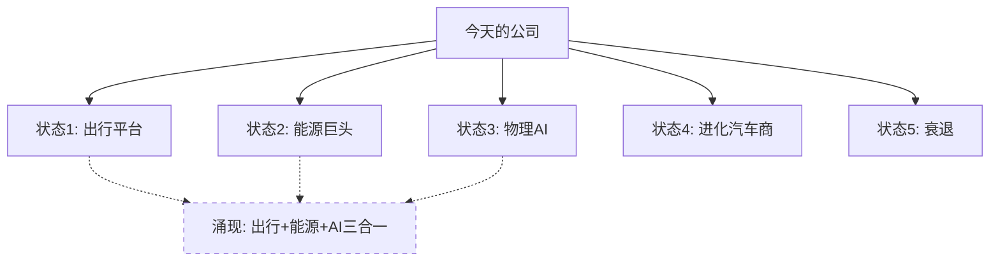

# 范式公司研究框架 v1.1 — 发现系统

> **核心原则**: 模糊的正确 > 精确的错误
> **适用对象**: 可能性空间极宽的公司 — 传统估值框架会产出"精确的错误"
> **输出哲学**: 报告的价值 = 帮投资者看到别人没看到的可能性 + 比市场更早发现转折点

---

## 1. 何时使用：可能性宽度分类器

公司不是非黑即白的"传统/范式"，而是在一条连续光谱上。

### 可能性宽度评估（5项打分，每项0-2分）

| 维度 | 0分（窄） | 1分（中） | 2分（宽） |
|------|----------|----------|----------|
| **收入结构** | 90%+来自成熟产品线 | 70-90%成熟+探索性业务 | <70%成熟，多条pre-revenue线 |
| **商业模式流动性** | 10年未变的模式 | 偶尔拓展邻近领域 | 持续进入全新领域 |
| **CEO期权思维** | 守成型管理层 | 偶有新赌注 | 系统性下注多条赛道 |
| **市场定价偏离** | 传统估值±30%以内 | 偏离30-100% | 偏离>100% |
| **TAM不确定性** | TAM可算，增速可预测 | TAM可估，方向确定 | TAM无法定义，可能创造新市场 |

**路由规则**:

| 总分 | 可能性宽度 | 研究方法 | 估值方式 |
|------|----------|---------|---------|
| 0-3 | **窄** | 传统框架（SOTP/DCF） | 给目标价 + 评级 |
| 4-6 | **中** | 混合：传统估值 + 可能性附录 | 给目标价 + 可能性空间 |
| 7-10 | **宽** | **发现系统**（本框架） | 不给目标价，映射可能性空间 |

### 典型分类

| 宽（发现系统） | 中（混合） | 窄（传统） |
|--------------|----------|----------|
| TSLA (9), PLTR (8) | GOOGL (6), META (5) | COST (2), PG (1), TSM (3) |

> **动态性**: 同一家公司在不同时期可能从"窄"移动到"宽"（如NVDA 2022→2024从4分变7分）。每次研究开始时重新评估。

### 不确定性类型分类（v1.1新增）

可能性宽度≥7分的公司进入发现系统后，还需识别**不确定性类型**，因为不同类型需要不同的Part 2方法论：

| 类型 | 核心问题 | 典型公司 | Part 2方法 |
|------|---------|---------|-----------|
| **A型：类别不确定性** | "这家公司会变成什么？" | TSLA (9) | 能力基元 → 未来状态推演 |
| **B型：量级不确定性** | "这个产品能做多大？" | PLTR (8) | 产品边界 → 采纳曲线 → 天花板分析 |
| **C型：转型不确定性** | "核心业务能否熬过范式转换？" | GOOGL (6, 混合模式) | 自我蚕食分析 → 转型路径矩阵 |

**识别方法**:
- **A型**: 公司有≥3条独立业务线，可能组合成质的不同的企业形态
- **B型**: 公司有一个明确的核心产品/技术，但可触达的市场边界高度不确定
- **C型**: 公司在当前市场占据统治地位，但面临技术范式转换威胁

> **注意**: 类型不互斥。TSLA同时有A型（多业务线）和B型（FSD市场大小）特征，取主导类型。混合模式（4-6分）通常使用C型方法作为附录。

---

## 2. 报告结构（7部分）

发现系统的报告不是"得出结论"，而是"打开视野"。

### Part 1: 今天的公司（所有公司通用）
- 财务现状（硬数据为主）
- 当前业务结构和竞争位置
- 管理层正在做什么、说什么
- **不包含**: 目标价、评级

### Part 2: 公司可能成为什么（核心差异化部分 — 按不确定性类型分支）

**A型（类别不确定性）** — "会变成什么公司？"
- 能力基元识别 → 未来状态推演（3-7个质的不同状态）
- 组合可能性推演（多条线同时成功的涌现效果）
- 纳入衰退状态和物理约束检验
- 详见 §3.1

**B型（量级不确定性）** — "产品能做多大？"
- 产品边界分析（强适用/弱适用/不适用场景）
- S曲线定位（哪个采纳阶段？）
- 三层天花板分析（地理/客户类型/竞争替代）
- 护城河评估（规模优势 vs 技术可替代性）
- 详见 §3.4

**C型（转型不确定性）** — "核心业务能否存活？"
- 自我蚕食分析（新技术对核心收入的侵蚀速度 vs 补偿速度）
- 双螺旋动态（衰减曲线 + 增长曲线的交叉点）
- 第二增长曲线评估
- 转型路径矩阵（2×2: 核心存活/衰退 × 新业务成功/失败）
- 详见 §3.5

**共通**: 不包含概率权重、加权估值、目标价

### Part 3: 开放问题（报告最有价值的输出）
- 5-10个关键开放问题
- 每个问题的可观测性、重要性、时间窗口
- 问题之间的关联和演化方向
- **不包含**: 答案（问题本身就是价值）

### Part 4: 证据方向（连续追踪部分）
- 当前各可能性的证据积累方向（↗️/→/↘️）
- 近期关键事件和信号解读
- 累积证据图谱（多季度趋势）
- **不包含**: 单点触发、二元判断

### Part 5: 转折点指南
- 关键转折点的识别框架
- 二阶变化信号（变化的加速/减速）
- 跨维度共振信号（多个独立信号同向）
- 反事实信号（什么"没有发生"但应该发生）
- **不包含**: "若X则买入"的操作指令

### Part 6: 价格在赌什么（Reverse DCF精华）
- 当前价格隐含的可能性分布
- 市场共识 vs 非共识要素
- 投资者选择这个价格时，等于在赌什么
- **不包含**: "高估/低估"判断

### Part 7: 我们不知道什么
- 关键未知清单
- 哪些未知最可能改变全局
- 下一步应该追踪什么
- **不包含**: 虚假确定性

---

## 3. 可能性空间映射方法论

### 3.1 未来状态推演（非场景分析）

传统场景分析的错误：同一商业模式 × 不同参数 = 看似丰富实则贫乏。

正确方式：每个未来状态是一种**质的不同**的公司形态。

**推演步骤**:
1. **识别能力基元**: 公司拥有哪些可复用的底层能力？（技术/数据/网络/品牌/渠道/资本）
2. **映射邻近市场**: 这些能力可以组合进入哪些新市场？
3. **想象涌现状态**: 如果多条线同时成功，会涌现出什么新形态？
4. **纳入衰退状态**: 如果核心业务被替代，残值是什么？
5. **检验物理约束**: 每个状态是否受限于物理定律/监管/资本/时间？

**示例 — TSLA能力基元**:
```
能力基元: 电池技术 + 制造规模 + FSD数据 + 充电网络 + 品牌 + 太阳能/储能
                    ↓
未来状态1: 自动出行网络 — FSD成功 → robotaxi + 物流 → 出行平台
未来状态2: 能源巨头 — 储能规模化 → 虚拟电厂 → 能源交易
未来状态3: 物理AI平台 — Optimus成功 → 劳动力替代 → 全新市场
未来状态4: 进化汽车商 — FSD有限成功 → 高端电动车 + ADAS溢价
未来状态5: 衰退 — 中国竞争 + FSD失败 → 市占率下滑 → 利基品牌
```

### 3.2 组合可能性推演（AI独特优势）

人类分析师倾向于线性外推。AI可以系统性探索组合空间。

**方法**:
- 列出公司N条主要业务线/能力
- 生成组合矩阵：哪些线的同时成功会产生非线性效果？
- 识别**涌现可能**：整体 > 部分之和的场景
- 识别**脆弱节点**：哪个能力失败会导致多条线同时崩塌？

**约束**:
- 不给组合赋概率
- 不算组合估值
- 只描述可能性及其内在逻辑
- 标注：哪些组合是有先例的，哪些是全新的

### 3.3 可能性空间可视化



虚线 = 涌现可能性（多条线同时成功才出现）

### 3.4 B型方法论：产品边界与天花板分析

适用于核心产品明确、但市场边界不确定的公司（如PLTR）。

**步骤**:
1. **产品边界映射**: 列出产品强适用/弱适用/不适用的场景和行业
2. **S曲线定位**: 当前处于创新者/早期采纳/早期大众/晚期大众的哪个阶段？是否正在"跨越鸿沟"？
3. **三层天花板分析**:
   - 天花板1（地理）: 全球化的天然障碍（数据主权、本地化需求）
   - 天花板2（客户类型）: 从政府/大企业向中小企业下沉的可行性
   - 天花板3（竞争替代）: 开源/大厂自建对市场的挤压
4. **护城河评估**: 数据网络效应 vs 纯技术壁垒，前者可能性宽，后者可能性窄

**可视化**:
```
产品边界图（同心圆）:
  核心区(强适用) → 扩展区(弱适用) → 边界区(不适用)
  ↓ 随时间推移 ↓
  核心扩大? 边界外移? 还是被压缩?
```

### 3.5 C型方法论：转型路径与自我蚕食分析

适用于统治性地位面临范式转换的公司（如GOOGL）。

**步骤**:
1. **自我蚕食量化**: 新技术对核心收入的侵蚀率 vs 新技术带来的新增收入补偿率
2. **双螺旋动态**: 画出核心业务衰减曲线和新业务增长曲线，找交叉点
3. **第二增长曲线**: 新业务（如Cloud）能否独立支撑估值？
4. **转型路径矩阵**:

```
              核心存活        核心衰退
新业务成功    最佳路径        成功转型
              (核心+新增长)   (痛苦但可行)
新业务失败    维持现状        最差路径
              (慢衰)         (双重打击)
```

5. **管理层意愿**: 管理层是否愿意蚕食自己？（历史案例: 微软云转型 vs 柯达）

**与混合模式的关系**: C型公司通常评分4-6（混合模式），主体用传统估值，C型分析作为"如果传统框架错了"的附录。评分≥7的C型公司（如假设性的GOOGL被AI彻底颠覆场景）则完全使用发现系统。

---

## 4. 开放问题方法论

### 4.1 问题分类

| 类型 | 定义 | 示例 |
|------|------|------|
| **存在问题** | 某个东西会不会存在？ | FSD L4会在公开道路上实现吗？ |
| **时机问题** | 什么时候？ | Waymo何时规模化到50城？ |
| **量级问题** | 有多大？ | AI搜索会吃掉传统搜索多少份额？ |
| **交互问题** | X遇到Y会怎样？ | 如果FSD成功+Optimus同时量产，会发生什么？ |
| **反转问题** | 什么能推翻主流叙事？ | 什么证据会证明PLTR的政府依赖不可逆？ |

### 4.2 问题质量标准

好的开放问题必须满足：
- **可观测**: 存在可追踪的信号（不是"AI会改变世界吗"）
- **有区分度**: 不同答案导致不同投资结论
- **有时间窗口**: 可以说"未来6-18个月应该能看到信号"
- **非共识**: 市场没有达成共识的问题更有价值

### 4.3 问题生命周期

问题不是静态的。每次追踪更新时：
```
诞生 → 演化 → 分裂/合并 → 解答/过时
  ↑                              ↓
  ← ← ← 新问题由旧答案催生 ← ← ←
```

**追踪格式**:
```
Q3 (v2): FSD能否在无高精地图城市实现L4+？
  状态: 活跃
  前身: Q3 (v1): "FSD能否实现L4？" — 已部分回答(限定场景可以)
  最近信号: Austin无地图测试里程↑ 300%（2026Q1）
  方向: ↗️ 证据略偏积极
  下一观测窗口: 2026Q2 NHTSA安全数据
  如果回答"是": 状态1(出行平台)可能性大增
  如果回答"否": 状态4(进化汽车商)更可能
```

---

## 5. 证据方向追踪

### 5.1 核心原则

- **累积 > 单点**: 单季度数据是噪音，多季度趋势是信号
- **方向 > 量级**: "在变好"比"好了多少"更重要
- **独立来源交叉 > 单一来源强度**: 3个独立信号同向 > 1个信号很强

### 5.2 证据方向标注

对每个可能性状态，追踪证据方向：

| 方向 | 含义 | 信号举例 |
|------|------|---------|
| ↗️↗️ | 强积极 — 多个独立信号持续同向 | FSD里程+安全数据+城市扩张全部向好 |
| ↗️ | 弱积极 — 有积极信号但尚未交叉验证 | Optimus演示进展但无商业化证据 |
| → | 中性 — 无明显方向性变化 | 储能业务增长符合预期 |
| ↘️ | 弱消极 — 出现值得关注的负面信号 | 中国市占率连续2季度下滑 |
| ↘️↘️ | 强消极 — 多个独立信号持续负向 | 安全事故+监管收紧+保险成本上升共振 |

### 5.3 累积证据视图（季度更新）

```
可能性1: 自动出行网络
  2025Q3: ↗️  | FSD v13发布，接管率下降40%
  2025Q4: →   | Austin robotaxi试点启动但规模小
  2026Q1: ↗️  | 无地图城市里程↑300%，但NHTSA审查加强
  累积方向: ↗️ (弱积极，3季度看趋势向好但尚未决定性)
```

---

## 6. 转折点检测

转折点 = 可能性空间分布发生质变的时刻。比市场更早检测到转折点是研究的终极价值。

### 6.1 三种转折点信号

**A. 二阶变化（变化本身在变化）**
- 不是"FSD里程增加了"，而是"FSD里程增加的速度在加速"
- 不是"收入增长放缓"，而是"增长放缓的速度在加速"
- 检测方法：追踪关键指标的变化率，识别拐点

**B. 跨维度共振（多个独立信号同向移动）**
- 当技术指标 + 监管动态 + 竞争格局 + 用户行为同时指向同一方向
- 独立来源同向 = 强信号；单一来源剧烈变化 = 可能是噪音
- 示例：FSD安全数据改善 + 保险公司降低TSLA保费 + 竞争对手放弃L4 = 共振信号

**C. 反事实信号（什么"应该发生但没有发生"）**
- 竞争对手发布更好的产品，但用户没有切换 → 护城河比想象的深
- 公司犯了严重公关错误，但股价没跌 → 市场在交易更大的叙事
- 经济衰退但高端消费品不降价 → 品牌力强于周期

### 6.2 噪音过滤器

大多数"信号"是噪音。真正的转折点必须满足至少2项：
- **持续性**: 不是单季度异常，至少2个数据点确认
- **交叉验证**: 至少2个独立来源/维度的信号一致
- **不可逆性**: 改变是结构性的（技术突破/监管落地/竞争格局重构）

---

## 7. 价格含义分析（替代传统估值）

### 7.1 Reverse DCF 分解

不给"值多少钱"，而是回答"当前价格在赌什么"：

```
当前价: $425/股
  隐含EPS CAGR: ~50% (未来5年)
  这意味着市场认为:
  - 自动出行网络有较高概率实现 (否则增速不够)
  - 能源业务显著贡献 (否则利润率不够)
  - 中国市场不崩盘 (否则基数不够)

  市场最大的赌注: FSD规模化
  市场最被忽视的: 能源业务独立价值
  市场最可能错误的: [留给开放问题]
```

### 7.2 体制分类（替代操作建议）

不说"买入/卖出"，而是描述当前所处的"体制"：

| 体制 | 描述 | 投资者含义 |
|------|------|----------|
| **高不确定性积累期** | 多条可能性线并行发展，尚无决定性证据 | 重点追踪开放问题，等待证据积累 |
| **证据收敛期** | 1-2条可能性线获得显著证据支持 | 可能性空间在收窄，关注方向 |
| **转折验证期** | 出现转折点信号，需要验证持续性 | 高度关注，准备根据验证结果调整 |
| **叙事稳定期** | 主导可能性已明确，市场形成共识 | 可切换到传统估值框架 |

> **关键**: 不给体制转换的精确触发条件。体制是对当前状态的描述，不是对未来的预测。

---

## 8. 与Phase结构的集成

发现系统复用现有Phase 0-5结构，但修改每个Phase的侧重点：

| Phase | 传统框架 | 发现系统 |
|-------|---------|---------|
| **0** | 数据预取 + 温度计 | 相同 + **可能性宽度评估 + 不确定性类型判定(A/B/C)** |
| **0.5** | CQ提取 + 维度分析 | CQ → **开放问题v1** + 可能性空间初步映射 |
| **1** | 公司分类 + 核心维度 | Part 1(今天的公司) + Part 2(**按类型分支**: A→状态推演/B→天花板/C→转型矩阵) |
| **2** | 财务深挖 + 估值 | Part 1深化(财务) + Part 6(价格在赌什么) |
| **3** | 竞争 + 行业 | Part 2深化(组合推演) + Part 3(开放问题成熟) |
| **4** | 对抗审查 | Part 5(转折点框架) + 可能性压力测试 |
| **5** | 评分 + 决策 | Part 4(证据方向) + Part 7(未知清单) + 体制分类 |

### 变化点
- **不再产出**: 目标价、评级、仓位建议、操作触发条件
- **新增产出**: 可能性空间图、开放问题链、证据方向图、转折点指南
- **保留不变**: 数据质量要求、三层标注、Fast Gate门控、Kill Switch(改为"叙事失效条件")

### Complete报告组装

发现系统的Complete报告 = Part 1-7按序组装，质量门控调整：

| 指标 | 传统CG基准 | 发现系统调整 |
|------|----------|------------|
| 总字符 | ≥249K | ≥200K（无需冗长估值） |
| 不确定性类型 | — | **明确标注A/B/C（新增）** |
| 开放问题数 | — | **≥8个（新增）** |
| 可能性/天花板数 | — | **A型≥4状态 / B型≥3天花板 / C型含2×2矩阵（新增）** |
| 估值部分 | 必须有目标价 | **禁止给目标价** |
| 转折点框架 | — | **≥5个转折点信号（新增）** |
| Mermaid图表 | ≥8 | ≥8（含可能性空间图） |
| 标注密度 | ≥12/万 | ≥12/万 |

---

## 9. 混合模式（中等宽度公司）

评分4-6的公司（如GOOGL、META）使用混合模式：

**主体**: 传统框架完整执行（SOTP/DCF/目标价/评级）
**附录**: 可能性空间补充
- 2-3个非线性可能性状态（传统估值无法捕捉的）
- 3-5个关键开放问题
- 证据方向追踪（简化版）

> 混合模式的目标价来自传统框架，可能性附录提供"如果传统框架错了，可能错在哪里"。

---

## 10. 反思与持续优化

### 10.1 框架已知局限

- **可能性空间可能遗漏**: 人类+AI都可能想不到某种未来状态 → 每次更新追问"我们是否遗漏了什么"
- **证据解读有偏差**: 同一信号可被正反解读 → 强制要求列出反面解读
- **没有决策锚点**: 投资者可能觉得没有可操作性 → 通过体制分类和开放问题提供方向而非指令
- **难以量化回测**: 传统估值可以算命中率，发现系统怎么评估？→ 追踪开放问题的解答率和预见性

### 10.2 迭代协议

每完成一份发现系统报告后：
1. 回顾：开放问题是否真的"开放"？还是伪装的预测？
2. 回顾：可能性空间是否足够多样？还是只是传统场景换了个名字？
3. 回顾：转折点框架是否可操作？投资者能否据此追踪？
4. 收集：哪些部分投资者反馈最有价值？
5. 编码：将教训写入本框架新版本

---

## 附录A: 传统框架 vs 发现系统对照

| 维度 | 传统框架 | 发现系统 |
|------|---------|---------|
| 核心输出 | 目标价 + 评级 | 可能性空间 + 开放问题 |
| 估值方法 | DCF/SOTP/可比 | Reverse DCF(仅描述价格含义) |
| 时间视角 | 12个月目标 | 3-7年可能性演化 |
| 更新频率 | 季度/事件驱动 | 连续追踪 + 转折点触发 |
| 对投资者的价值 | "买还是卖" | "你在赌什么，关注什么" |
| 对AI的利用 | 数据处理 + 写作 | **组合推演 + 可能性发现** |
| 错误模式 | 精确的错误 | 模糊的正确 |

## 附录B: 快速启动模板

新公司首次使用发现系统时的检查清单：

```
□ 可能性宽度评分(5项) → 确认≥7分（4-6分走混合模式）
□ 不确定性类型判定: A(类别)/B(量级)/C(转型) → 决定Part 2方法
□ Part 2执行:
  - A型: 能力基元(≥5个) → 未来状态(≥4个) → 组合矩阵
  - B型: 产品边界 → S曲线定位 → 三层天花板 → 护城河
  - C型: 自我蚕食量化 → 双螺旋 → 转型路径矩阵(2×2)
□ 开放问题初稿(≥5个，分类标注)
□ Reverse DCF(当前价格隐含什么)
□ 体制分类(当前处于哪个阶段)
□ 转折点信号(≥3个可追踪的二阶指标)
□ 未知清单(最可能改变全局的3-5个未知)
```
