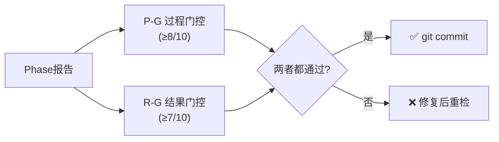

# 质量门控 v2.0 (双维度门控)

> **解决问题 S6**: 质量门控只查流程不查结果 — P-INT检查"有没有做"而非"做对没有"
> **核心思想**: 双维度门控 P-G(过程门控) + R-G(结果门控)，通过标准两者都要达标

---

## 设计哲学

**v1.0 (Fast Gate + QG)**: 检查"有没有写够字数""有没有标注""有没有KS" → 形式合规
**v2.0 (P-G + R-G)**: 在形式合规基础上增加"数字对不对""假设一致不一致""估值能追溯不" → 结果准确

---

## 双维度门控架构



**通过标准**: P-G ≥ 8/10 **且** R-G ≥ 7/10

---

## P-G: 过程门控 (10项)

> 继承自Fast Gate + 现有QG，检查"流程是否完成"

| # | 检查项 | 标准 | 检查方式 |
|---|--------|------|---------|
| P-1 | 字符数 | ≥Phase目标字符数 | `wc -m` |
| P-2 | 数据标注密度 | ≥15/万字符 (P4: ≥8/万) | `research_fast.sh` G2 |
| P-3 | 免责声明+目录 | 存在 | `research_fast.sh` G3 |
| P-4 | 可视化图表 | ≥3个Mermaid | `research_fast.sh` G4 |
| P-5 | 禁止词 | 0个违规 | `research_fast.sh` G5 |
| P-6 | 标注格式 | 无异常 | `research_fast.sh` G6 |
| P-7 | Kill Switch提及 | P4/P5: ≥15 | `research_fast.sh` G7 |
| P-8 | CQ覆盖 | 报告回应所有CQ | 人工/Agent检查 |
| P-9 | 三层标注比例 | 硬数据≥40% | 抽查 |
| P-10 | 看空篇幅 | ≥30%总篇幅 (P4适用) | 估算 |

**评分**: 每项通过=1分。P-G分数 = 通过项数/10。

**与Fast Gate的关系**: P-1~P-7 由 `research_fast.sh` 自动检查，P-8~P-10 需人工或Agent检查。

---

## R-G: 结果门控 (12项)

> **v2.0核心新增**。检查"结果是否正确"

### SOTP一致性 (3项)

| # | 检查项 | 标准 | 说明 |
|---|--------|------|------|
| R-1 | SOTP段值汇总 | Σ(分部) = 总值 | 各分部估值之和等于报告中的SOTP总值 |
| R-2 | SOTP每股计算 | 总值/股数 = 每股 | 企业价值除以稀释后股数等于报告中的每股估值 |
| R-3 | SOTP工作底稿 | 三步验证完整 | 详见 `docs/anti_hallucination_protocol.md` |

### KS一致性 (2项)

| # | 检查项 | 标准 | 说明 |
|---|--------|------|------|
| R-4 | KS定义唯一性 | 注册表=唯一来源 | 非KS章节未重新定义阈值/动作 |
| R-5 | KS引用正确性 | 引用与定义匹配 | 报告中[KS-xxx]引用的数值与注册表一致 |

### KAL一致性 (2项)

| # | 检查项 | 标准 | 说明 |
|---|--------|------|------|
| R-6 | 假设跨Phase一致 | 同一KA编号值不矛盾 | 不同Phase引用同一假设时值相同 |
| R-7 | A级假设已验证 | 全部A级KA为🟢 | Phase 4后所有A级假设状态为🟢已验证 |

### DM一致性 (2项)

| # | 检查项 | 标准 | 说明 |
|---|--------|------|------|
| R-8 | DM引用正确 | 报告值=DM值 | 所有[DM-xxx]引用的数值与Data Master记录一致 |
| R-9 | DM版本号正确 | 引用版本=最新版本 | 无引用已过时(🔴)的DM锚点 |

### 估值可追溯性 (2项)

| # | 检查项 | 标准 | 说明 |
|---|--------|------|------|
| R-10 | 估值修正有日志 | 审计日志完整 | 每次估值变动有记录(层级/幅度/原因) |
| R-11 | 最终估值可推导 | 可从审计日志重建 | 从Phase 2基线经审计日志可到达最终值 |

### 数字一致性 (1项)

| # | 检查项 | 标准 | 说明 |
|---|--------|------|------|
| R-12 | 核心数字跨章一致 | 抽查≥10个数字 | 同一数字在不同章节引用时值相同 |

**评分**: 每项通过=1分。R-G分数 = 通过项数/12，转换为10分制(×10/12)。

---

## 各Phase的门控要求

| Phase | P-G检查重点 | R-G检查重点 | P-G阈值 | R-G阈值 |
|-------|------------|------------|---------|---------|
| Phase 1 | P-1~P-6, P-8 | R-8, R-9 | ≥7/10 | ≥5/10 |
| Phase 2 | P-1~P-9 | R-1~R-3, R-6, R-8~R-9 | ≥8/10 | ≥6/10 |
| Phase 3 | P-1~P-9 | R-6, R-8~R-9, R-12 | ≥8/10 | ≥6/10 |
| Phase 3.5 | P-1~P-6 | R-8~R-9 | ≥7/10 | ≥5/10 |
| Phase 4 | P-1~P-10 | **R-1~R-12全部** | ≥8/10 | **≥7/10** |
| Phase 5 | P-1~P-10 | **R-1~R-12全部** | ≥8/10 | **≥7/10** |

**关键**: Phase 4和Phase 5必须通过全部12项R-G检查，因为这两个Phase是最终质量关卡。

---

## 检查执行流程

```
Phase完成后:

Step 1: 自动P-G检查
  → bash tests/research_fast.sh {file} {min_chars} 3
  → P-1~P-7自动评分

Step 2: Agent P-G补充检查
  → P-8: 核查CQ覆盖
  → P-9: 抽查三层标注比例
  → P-10: 估算看空篇幅占比

Step 3: Agent R-G检查 (Phase 4/5)
  → 按12项清单逐一检查
  → 记录每项通过/失败及原因

Step 4: 综合判定
  → P-G ≥ 8/10 且 R-G ≥ 7/10 → ✅ 通过 → git commit
  → 任一不达标 → ❌ 修复后重检
```

---

## R-G检查执行模板

Phase 4/5 完成时使用以下模板执行R-G检查：

```markdown
## R-G结果门控检查报告

**报告**: {TICKER} Phase {N}
**检查时间**: {YYYY-MM-DD}

### SOTP一致性
| # | 检查项 | 结果 | 备注 |
|---|--------|------|------|
| R-1 | SOTP段值汇总 | ✅/❌ | [具体数字] |
| R-2 | SOTP每股计算 | ✅/❌ | [具体数字] |
| R-3 | SOTP工作底稿 | ✅/❌ | [缺失项] |

### KS一致性
| R-4 | KS定义唯一性 | ✅/❌ | [冲突位置] |
| R-5 | KS引用正确性 | ✅/❌ | [不一致项] |

### KAL一致性
| R-6 | 假设跨Phase一致 | ✅/❌ | [矛盾假设] |
| R-7 | A级假设已验证 | ✅/❌ | [未验证KA编号] |

### DM一致性
| R-8 | DM引用正确 | ✅/❌ | [不一致锚点] |
| R-9 | DM版本号正确 | ✅/❌ | [过时引用] |

### 估值可追溯性
| R-10 | 估值修正有日志 | ✅/❌ | [缺失记录] |
| R-11 | 最终估值可推导 | ✅/❌ | [推导结果] |

### 数字一致性
| R-12 | 核心数字跨章一致 | ✅/❌ | [抽查数字] |

---

**R-G得分**: X/12 (X.X/10)
**P-G得分**: X/10
**综合判定**: ✅通过 / ❌需修复

**修复清单** (如有):
1. [R-X] [具体问题] → [修复方案]
```

---

## 与现有Fast Gate的关系

```
Fast Gate (research_fast.sh):
  → 自动化脚本，检查P-G的P-1~P-7
  → 保留，作为P-G的自动化基础

Quality Gate v2.0:
  → 扩展Fast Gate，增加P-8~P-10 (人工/Agent)
  → 全新R-G维度 (12项结果检查)
  → 最终通过标准: P-G≥8 且 R-G≥7

不替代Fast Gate:
  → Fast Gate仍是第一道自动化关卡
  → R-G是第二道人工/Agent关卡
  → 两层过滤确保质量
```

---

## 回归测试标准

新增R-G检查不得影响现有P-G（Fast Gate）的正常运行：

| 检查 | 标准 |
|------|------|
| `research_fast.sh` 脚本不变 | 脚本代码和阈值不修改 |
| P-G评分向后兼容 | 旧报告用P-G评分仍合理 |
| R-G为增量检查 | 旧报告可选做R-G，新报告(v22+)强制 |

---

## GOOGL案例回顾

| 问题 | v1.0门控行为 | v2.0 R-G解决 |
|------|-------------|-------------|
| SOTP段值偏差249% | 未检查(只查字数/密度) | R-1/R-2/R-3 段值汇总+每股+工作底稿 |
| KS三重不一致 | 未检查 | R-4/R-5 定义唯一性+引用正确性 |
| GCP假设跨Phase不一致 | 未检查 | R-6 假设跨Phase一致 |
| 估值来回跳$311→$326→$313 | 未检查 | R-10/R-11 审计日志+可推导性 |
| 形式分9.6实质分6.8 | 只有P-G | P-G+R-G双维度 |

---

## 版本历史

| 版本 | 日期 | 变更 |
|:---:|:---:|------|
| v1.0 | 2026-02-07 | 初版。P-G 10项+R-G 12项+各Phase阈值+执行模板+回归标准 |
