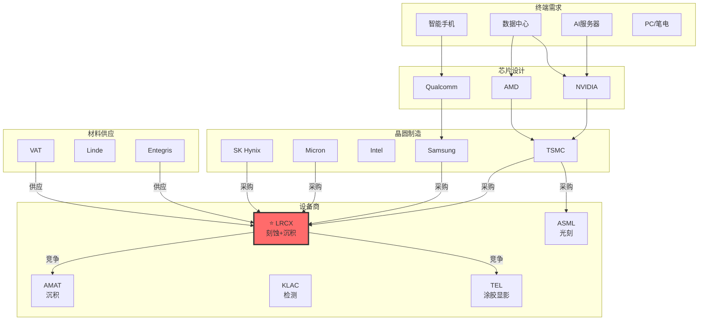

# 半导体产业链关系图：LRCX 视角

> 更新日期：2026年1月22日

---

## 一、产业链全景图（文本版）

```
┌─────────────────────────────────────────────────────────────────────────────────────┐
│                              半导体产业链全景                                         │
└─────────────────────────────────────────────────────────────────────────────────────┘

                                    【终端需求】
    ┌──────────┬──────────┬──────────┬──────────┬──────────┬──────────┐
    │    AI    │   数据   │   智能   │    PC    │   汽车   │   工业   │
    │  服务器  │   中心   │   手机   │  /笔电   │   电子   │   IoT    │
    └────┬─────┴────┬─────┴────┬─────┴────┬─────┴────┬─────┴────┬─────┘
         │          │          │          │          │          │
         ▼          ▼          ▼          ▼          ▼          ▼
    ┌─────────────────────────────────────────────────────────────────┐
    │                      【芯片设计公司】                             │
    │   NVDA    AMD    INTC    QCOM    AAPL    MRVL    AVGO    MCHP   │
    │  (GPU)  (CPU/GPU) (CPU)  (移动)  (自研)  (网络)  (定制)  (MCU)   │
    └────────────────────────────┬────────────────────────────────────┘
                                 │ 设计 → 代工
                                 ▼
┌────────────────────────────────────────────────────────────────────────────────────┐
│                            【晶圆代工 / IDM】                                        │
│  ┌─────────────────┐  ┌─────────────────┐  ┌─────────────────┐                     │
│  │      TSM        │  │    Samsung      │  │     Intel       │  ← 逻辑芯片制造      │
│  │   (代工龙头)     │  │   (代工+IDM)    │  │   (IDM转型)     │                     │
│  │  收入: $90B+    │  │  收入: $60B+    │  │  收入: $50B+    │                     │
│  └────────┬────────┘  └────────┬────────┘  └────────┬────────┘                     │
│           │                    │                    │                              │
│  ┌─────────────────┐  ┌─────────────────┐  ┌─────────────────┐                     │
│  │     Micron      │  │    SK Hynix     │  │ Samsung Memory  │  ← 存储芯片制造      │
│  │   (DRAM+NAND)   │  │  (DRAM+HBM)     │  │  (DRAM+NAND)    │                     │
│  │  收入: $25B+    │  │  收入: $35B+    │  │  收入: $50B+    │                     │
│  └────────┬────────┘  └────────┬────────┘  └────────┬────────┘                     │
└───────────┼────────────────────┼────────────────────┼───────────────────────────────┘
            │                    │                    │
            └────────────────────┼────────────────────┘
                                 │ 采购设备
                                 ▼
┌────────────────────────────────────────────────────────────────────────────────────┐
│                         【半导体设备商】⭐ LRCX 所在层                               │
│                                                                                    │
│   ┌──────────────┐    ┌──────────────┐    ┌──────────────┐    ┌──────────────┐    │
│   │     ASML     │    │     AMAT     │    │  ⭐ LRCX     │    │     KLAC     │    │
│   │    光刻机     │    │   薄膜沉积   │    │  刻蚀+沉积   │    │   检测设备   │    │
│   │   (垄断EUV)  │    │   (全制程)   │    │  (刻蚀龙头)  │    │   (缺陷检测) │    │
│   │  份额: 80%+  │    │  份额: ~20%  │    │  份额: ~50%  │    │  份额: ~55%  │    │
│   │  收入: €28B  │    │  收入: $27B  │    │  收入: $17B  │    │  收入: $11B  │    │
│   └──────┬───────┘    └──────┬───────┘    └──────┬───────┘    └──────┬───────┘    │
│          │                   │                   │                   │            │
│   ┌──────────────┐    ┌──────────────┐    ┌──────────────┐    ┌──────────────┐    │
│   │     TOKY     │    │     SNPS     │    │     CDNS     │    │    UCTT      │    │
│   │  东京电子     │    │   EDA软件    │    │   EDA软件    │    │   零部件     │    │
│   │  (涂胶显影)  │    │  (设计验证)  │    │  (设计验证)  │    │  (设备零件)  │    │
│   └──────────────┘    └──────────────┘    └──────────────┘    └──────────────┘    │
└───────────┬────────────────────┬────────────────────┬───────────────────────────────┘
            │                    │                    │
            └────────────────────┼────────────────────┘
                                 │ 采购材料/零部件
                                 ▼
┌────────────────────────────────────────────────────────────────────────────────────┐
│                           【材料与零部件】                                          │
│                                                                                    │
│   ┌──────────────┐    ┌──────────────┐    ┌──────────────┐    ┌──────────────┐    │
│   │   Entegris   │    │    Linde     │    │  Shin-Etsu   │    │    SUMCO     │    │
│   │   先进材料    │    │   特种气体   │    │   硅晶圆     │    │   硅晶圆     │    │
│   └──────────────┘    └──────────────┘    └──────────────┘    └──────────────┘    │
│                                                                                    │
│   ┌──────────────┐    ┌──────────────┐    ┌──────────────┐                        │
│   │     VAT      │    │   Ferrotec   │    │   Ichor      │    │                   │
│   │   真空阀门    │    │   热管理     │    │   气体系统   │    │                   │
│   └──────────────┘    └──────────────┘    └──────────────┘                        │
└────────────────────────────────────────────────────────────────────────────────────┘
```

---

## 二、LRCX 核心关系网络

```
                              ┌─────────────────────────────┐
                              │         ⭐ LRCX             │
                              │    Lam Research Corp        │
                              │                             │
                              │  核心产品:                  │
                              │  • 等离子刻蚀设备 (50%+)    │
                              │  • 薄膜沉积设备 (CVD/ALD)   │
                              │  • 清洗设备                 │
                              │                             │
                              │  收入: $17B  毛利率: 49%    │
                              └──────────────┬──────────────┘
                                             │
           ┌─────────────────────────────────┼─────────────────────────────────┐
           │                                 │                                 │
           ▼                                 ▼                                 ▼
┌─────────────────────┐          ┌─────────────────────┐          ┌─────────────────────┐
│      【客户】        │          │     【竞争对手】     │          │     【供应商】       │
│                     │          │                     │          │                     │
│  🔵 存储客户 (60%)  │          │  刻蚀领域:          │          │  关键零部件:         │
│  • Samsung Memory   │          │  • TEL (东京电子)   │          │  • VAT (真空阀门)    │
│  • SK Hynix         │          │    份额: ~25%       │          │  • Ferrotec (热管理) │
│  • Micron           │          │  • AMAT             │          │  • Ichor (气体系统)  │
│                     │          │    份额: ~20%       │          │                     │
│  🟢 代工客户 (30%)  │          │                     │          │  材料供应:           │
│  • TSMC             │          │  沉积领域:          │          │  • Entegris         │
│  • Samsung Foundry  │          │  • AMAT (龙头)      │          │  • Linde (气体)      │
│  • Intel            │          │    份额: ~40%       │          │                     │
│                     │          │  • TEL              │          │                     │
│  🟡 其他 (10%)      │          │    份额: ~15%       │          │                     │
│  • 中国客户         │          │                     │          │                     │
│    (收入占比 42%)   │          │                     │          │                     │
└─────────────────────┘          └─────────────────────┘          └─────────────────────┘
```

---

## 三、信号传导链（时间维度）

```
┌──────────────────────────────────────────────────────────────────────────────────────┐
│                           信号传导时间轴                                              │
│                                                                                      │
│  T-24月        T-18月        T-12月        T-6月         T-0          T+6月          │
│    │             │             │             │            │             │            │
│    ▼             ▼             ▼             ▼            ▼             ▼            │
│ ┌──────┐    ┌──────┐     ┌──────┐     ┌──────┐     ┌──────┐     ┌──────┐           │
│ │ DRAM │    │ HBM  │     │ Fab  │     │ 设备 │     │ LRCX │     │ 股价 │           │
│ │ 现货 │───▶│ 需求 │────▶│ CAPEX│────▶│ 订单 │────▶│ 收入 │────▶│ 反应 │           │
│ │ 上涨 │    │ 公告 │     │ 上调 │     │ 增加 │     │ 增长 │     │      │           │
│ └──────┘    └──────┘     └──────┘     └──────┘     └──────┘     └──────┘           │
│                                                                                      │
│  【先行指标】─────────────────────────────▶【同步指标】──────▶【滞后指标】            │
│                                                                                      │
└──────────────────────────────────────────────────────────────────────────────────────┘

信号强度传导:

    DRAM现货价 ──┬──▶ Memory厂商利润 ──▶ CAPEX扩张 ──▶ 设备订单 ──▶ LRCX收入
                 │
    HBM需求 ────┘

    领先周期:
    • DRAM现货 → LRCX收入: 12-24个月
    • CAPEX公告 → LRCX收入: 6-12个月
    • 设备订单 → LRCX收入: 3-6个月
```

---

## 四、关系类型详解

### 4.1 客户关系（Revenue Dependency）

| 客户 | 收入占比 | 关系强度 | 信号价值 |
|------|----------|----------|----------|
| **Samsung** | ~20% | 🔴 高依赖 | CAPEX指引、HBM产能公告 |
| **SK Hynix** | ~15% | 🔴 高依赖 | HBM出货量、CAPEX |
| **Micron** | ~10% | 🟡 中依赖 | CAPEX指引、库存水位 |
| **TSMC** | ~15% | 🔴 高依赖 | N3/N2产能、CAPEX |
| **Intel** | ~8% | 🟡 中依赖 | IDM 2.0进展、CAPEX |
| **中国客户** | ~42% | 🔴 高风险 | 出口管制政策 |

### 4.2 竞争关系（Market Share）

| 领域 | LRCX份额 | 主要竞争 | 竞争态势 |
|------|----------|----------|----------|
| **导体刻蚀** | 55% | TEL (25%), AMAT (15%) | ✅ 领先 |
| **介质刻蚀** | 45% | AMAT (30%), TEL (20%) | ✅ 领先 |
| **ALD沉积** | 40% | AMAT (35%), TEL (20%) | ⚠️ 竞争激烈 |
| **CVD沉积** | 25% | AMAT (45%), TEL (20%) | ⚠️ 第二位 |
| **清洗设备** | 35% | SCREEN (40%), TEL (15%) | ⚠️ 第二位 |

### 4.3 产业链协同关系

```
【同向指标】─ 这些公司的表现与LRCX高度相关:

    ASML订单 ↑  ←──┐
    AMAT收入 ↑  ←──┼── 说明整体设备周期向上 ──▶ LRCX受益
    KLAC收入 ↑  ←──┤
    TEL订单 ↑   ←──┘

【先行指标】─ 这些公司的表现领先LRCX:

    Micron CAPEX ↑  ───┐
    SK Hynix CAPEX ↑ ──┼── 领先 6-12月 ──▶ LRCX订单增加
    Samsung CAPEX ↑  ──┘

【客户重叠】─ 关注竞争对手在相同客户的份额变化:

    AMAT在TSM的份额 ↑ ──▶ 可能挤压LRCX在代工领域的机会
    TEL在Memory的份额 ↑ ──▶ 可能挤压LRCX在存储领域的优势
```

---

## 五、四种新增关系类型

### 5.1 跨产业链关系（Cross-Chain）

```
【AI产业链 → 半导体设备】

    NVDA GPU需求 ↑
         │
         ▼
    TSM先进制程需求 ↑ ──▶ EUV设备需求 ↑ ──▶ ASML
         │
         ▼
    HBM需求 ↑ ──────────▶ 刻蚀设备需求 ↑ ──▶ ⭐LRCX
         │
         ▼
    CoWoS封装需求 ↑ ────▶ 先进封装设备 ↑ ──▶ AMAT
```

### 5.2 客户重叠关系（Customer Overlap）

| 共同客户 | LRCX产品 | AMAT产品 | TEL产品 | 竞争强度 |
|----------|----------|----------|---------|----------|
| TSMC | 刻蚀、ALD | CVD、PVD | 涂胶显影 | 中 |
| Samsung | 刻蚀、清洗 | CVD、CMP | 刻蚀、涂胶 | 高 |
| Micron | 刻蚀、ALD | CVD、刻蚀 | 刻蚀 | 高 |

### 5.3 宏观敏感性（Macro Sensitivity）

| 宏观因素 | 传导路径 | 对LRCX影响 | 敏感度 |
|----------|----------|-----------|--------|
| 美联储利率 | 利率↑→科技股估值↓ | PE压缩 | 🔴 高 |
| 中美关系 | 出口管制→中国收入↓ | 收入-42% | 🔴 极高 |
| AI投资热度 | AI↑→HBM↑→刻蚀需求↑ | 收入+15%+ | 🟢 正相关 |
| DRAM价格 | 价格↑→CAPEX↑→订单↑ | 收入+20%+ | 🟢 正相关 |

### 5.4 周期同步性（Cycle Sync）

```
【Memory周期同步公司】

    高同步 (β > 1.5):
    ├── LRCX (β=1.78)
    ├── MU (β=1.65)
    ├── AMAT (β=1.55)
    └── KLAC (β=1.50)

    中同步 (β = 1.0-1.5):
    ├── ASML (β=1.35)
    ├── TSM (β=1.20)
    └── INTC (β=1.10)

    低同步 (β < 1.0):
    ├── NVDA (β=0.95) ← AI需求部分对冲周期
    └── QCOM (β=0.85)
```

---

## 六、监控清单

### 必须追踪的关系信号

| 关系类型 | 监控对象 | 数据源 | 频率 |
|----------|----------|--------|------|
| 客户CAPEX | TSM/Samsung/Micron指引 | 财报电话会 | 季度 |
| 竞争份额 | VLSI Research报告 | 第三方报告 | 年度 |
| 上游供应 | VAT/Ferrotec产能 | 财报 | 季度 |
| 周期指标 | DRAM现货/合约价 | DRAMeXchange | 周度 |
| 政策风险 | BIS出口管制 | 政府公告 | 实时 |

---

## 七、Mermaid 格式关系图



---

*产业链图更新日期：2026年1月22日*
*下一步：获取实时先行指标数据完善分析*
