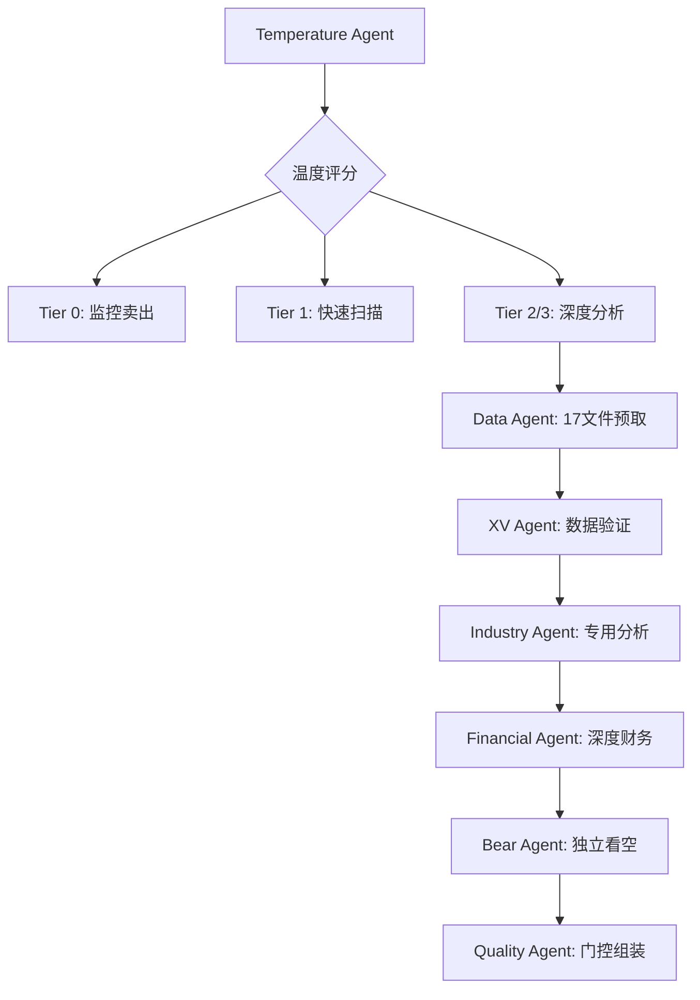

# v26.0 框架迁移指南

> **升级说明**: v25.0 → v26.0 (2026-02-09)
> **核心变化**: 投资温度表格策略 + MCP工具统一整合 + 智能分析工具包

---

## 🎯 升级概览

### 主要变化
1. **新增Tier 0预筛选机制** - 基于投资温度的智能路由
2. **数据预取升级** - 14→17个数据文件，新增宏观温度数据
3. **12个MCP工具统一整合** - 统一接口调用，效率提升3-5倍
4. **投资温度表格策略** - 5秒内获得科学化投资时机判断
5. **统一工具包** - investment-logic-toolkit.skill.md
6. **Agent架构调整** - 新增3个专业Agent
7. **质量标准升级** - v22.0标准强化

### 兼容性
- ✅ **向后兼容** - 所有v25.0功能继续可用
- ✅ **数据格式兼容** - 现有DM/KAL格式不变
- ✅ **技能调用兼容** - 现有技能继续工作
- 🆕 **新增功能** - 投资温度计算、统一工具包

---

## 📊 新功能使用指南

### 1. 投资温度表格策略

#### 快速开始
```python
# 使用统一工具包
from investment_logic_toolkit import InvestmentLogicToolkit

toolkit = InvestmentLogicToolkit()
result = await toolkit.analyze_investment("AAPL", "快速看看")

print(f"投资温度: {result['temperature']['level']}")
print(f"环境描述: {result['temperature']['interpretation']['description']}")
print(f"风险水平: {result['temperature']['interpretation']['risk_level']}")
```

#### 温度级别解读 (v2.0: 仅描述环境，不建议操作)
| 温度级别 | 评分范围 | 环境描述 | 风险水平 |
|---------|---------|---------|---------|
| 极冷 | ≤-1.5 | 多项指标显示严重低于历史区间 | 低 |
| 偏冷 | -1.5~-0.5 | 估值低于历史均值，出现价值信号 | 中低 |
| 中性 | -0.5~+0.5 | 各项指标基本均衡 | 中等 |
| 偏热 | +0.5~+1.5 | 估值高于历史均值，部分指标偏贵 | 中高 |
| 过热 | ≥+1.5 | 多项指标显示估值处于历史高位区间 | 高 |

#### Tier 0智能路由
- **极端温度**(≤-1.5或≥1.5) → 自动建议Tier 3深度研究
- **偏冷温度**(-1.5~-0.5) → 建议Tier 2标准分析
- **偏热温度**(+0.5~+1.5) → 建议Tier 1快速扫描
- **中性温度**(-0.5~+0.5) → 建议Tier 2标准分析

### 2. MCP工具统一整合

#### 新增数据源
```yaml
# 100baggers.club (宏观温度核心)
- CAPE Ratio: 周期调整市盈率
- Buffett Indicator: 总市值/GDP比率
- ERP: 股权风险溢价
- 7维度38指标: 综合财务摘要

# FMP 20个endpoint (深度财务)
- insider-trading: 内部人交易情绪
- ratios: 财务比率历史趋势
- estimates: 分析师预期共识
- sec-filings: SEC文件摘要

# Polymarket (预测市场)
- 重大事件概率预测
- 财报/并购/监管事件
- 市场情绪前瞻指标
```

#### 统一调用接口
```python
# 旧方式 (仍然可用)
mcp_tools.call('baggers_summary', symbol='AAPL')
mcp_tools.call('fmp_data', symbol='AAPL', endpoint='ratios')

# 新方式 (推荐)
toolkit = InvestmentLogicToolkit()
data = await toolkit.data_hub.get_basic_data('AAPL')  # 并发获取多源数据
ratios = await toolkit.data_hub.get_financial_ratios('AAPL', 8)  # 8期历史
sentiment = await toolkit.data_hub.get_market_sentiment('AAPL')
```

### 3. 数据预取升级

#### Phase 0新增文件
```yaml
# 原有14个文件继续可用
# 新增3个文件:

macro_indicators.md:        # 宏观温度数据
  - CAPE Ratio历史分位数
  - Buffett Indicator趋势
  - 股权风险溢价变化

market_prediction_events.md: # 预测市场事件
  - 相关重大事件概率
  - 财报/并购/监管预期
  - 市场情绪指标

insider_sentiment.md:       # 内部人交易情绪
  - 近期内部人买卖比例
  - 交易金额和频率
  - Smart Money信号
```

#### 新完成标准
- 原标准: ≥8/14文件可用
- 新标准: ≥11/17文件可用 + 投资温度已计算

### 4. Agent架构调整

#### 新增专业Agent
```yaml
Temperature_Agent:
  功能: 专职投资温度计算和验证
  输入: 17个数据文件
  输出: 温度评分 + 5级分类 + Tier建议
  调用: 每个分析任务开始前自动执行

Industry_Agent:
  功能: 行业专用分析(消费品/科技/金融)
  特色: flywheel诊断、品牌价值评估等
  输入: 基础数据 + 行业配置
  输出: 行业专用洞察

Quality_Agent:
  功能: 数据验证、质量门控、报告组装
  标准: v22.0强化(15标注/万字符, ≥40%硬数据)
  输入: 各Phase报告
  输出: 质量评估 + Complete报告
```

#### Agent协作流程


---

## 🚀 迁移步骤

### 第一步: 理解新概念 (5分钟)
1. **投资温度**: 宏观+基本面+情绪的三维评分
2. **Tier 0路由**: 基于温度的智能分析深度建议
3. **统一工具包**: 12个MCP工具的Python统一接口
4. **17个数据文件**: 原14个+3个新增数据源

### 第二步: 使用新功能 (立即可用)
```python
# 1. 温度评估 (任何股票)
result = await toolkit.analyze_investment("TSLA")
temperature = result['temperature']['level']  # 🌡️ 偏热 等

# 2. 智能路由建议
recommended_tier = result['analysis_tier']  # 1/2/3

# 3. 统一数据获取
data = await toolkit.data_hub.get_basic_data("NVDA")
quality = data['data_quality']  # high/medium/low
```

### 第三步: 项目配置调整 (可选)
```yaml
# .worktrees/消费品/config.yml (示例)
v26_features:
  enable_temperature_routing: true    # 启用温度路由
  temperature_threshold_cold: -0.5    # 偏冷阈值
  temperature_threshold_hot: 0.5      # 偏热阈值
  enable_17_data_prefetch: true       # 启用17文件预取
  quality_standard: "v22.0"           # 质量标准
```

### 第四步: 验证新功能 (测试)
```bash
# 验证数据预取升级
cd .worktrees/消费品
ls data/research/[TICKER]/  # 应该看到17个数据文件

# 验证温度计算
python -c "
from investment_logic_toolkit import InvestmentLogicToolkit
import asyncio
async def test():
    toolkit = InvestmentLogicToolkit()
    temp = await toolkit.temp_calc.calculate_temperature('AAPL')
    print(f'Temperature: {temp.level.value} ({temp.total_score:.2f})')
asyncio.run(test())
"

# 验证质量门控升级
bash tests/quality_gate_complete.sh reports/[TICKER]/[TICKER]_Complete*.md
```

---

## ⚠️ 注意事项

### 数据质量依赖
- **网络连接**: MCP工具需要稳定网络访问外部数据源
- **API限制**: 100baggers.club/FMP可能有请求频率限制
- **数据时效**: 温度计算基于实时数据，盘后计算更准确

### 性能影响
- **温度计算**: 增加1-2分钟初始计算时间
- **数据预取**: 17个文件比14个多约30秒
- **并发优化**: 异步处理实际可能提升总体效率

### 兼容性
- **旧技能**: 所有现有技能继续正常工作
- **旧数据**: v25.0格式的DM/KAL文件完全兼容
- **旧报告**: 历史报告格式不受影响
- **新要求**: 新报告需满足v22.0质量标准

---

## 🛠️ 故障排除

### 常见问题

#### Q1: 温度计算失败
```bash
# 检查MCP工具连接
mcp test investment-master

# 检查数据文件
ls data/research/[TICKER]/macro_indicators.md

# 降级到v25.0模式
export DISABLE_TEMPERATURE=true
```

#### Q2: 数据预取17个文件失败
```bash
# 检查新数据源
mcp call baggers_summary --symbol=AAPL
mcp call polymarket_events --query="AAPL earnings"

# 使用14文件备用模式
export USE_LEGACY_PREFETCH=true
```

#### Q3: 统一工具包导入错误
```python
# 检查依赖
pip install asyncio dataclasses enum typing

# 使用传统调用方式
# 而不是 from investment_logic_toolkit import ...
```

### 回滚到v25.0 (紧急)
```bash
# 临时禁用v26.0功能
export FRAMEWORK_VERSION=v25.0
export DISABLE_TEMPERATURE=true
export USE_LEGACY_PREFETCH=true

# 或者Git回滚
git checkout v25.0-tag
```

---

## 📈 性能提升预期

### 分析效率
- **温度预筛选**: 避免对过热股票深度分析，节省20-40%时间
- **并发数据获取**: 异步处理提升3-5倍数据获取速度
- **智能路由**: 根据温度匹配分析深度，资源配置更优

### 分析质量
- **科学化时机**: 投资温度替代主观判断，减少高位买入风险
- **多源验证**: 12个MCP工具交叉验证，数据可靠性提升
- **专业化深度**: 行业专用Agent提升分析专业度

### 预期收益
- **时间效率**: 总体分析时间减少15-25%
- **决策质量**: 温度+数据双驱动，投资决策更科学
- **风险控制**: 多层质量门控，分析错误率降低

---

## 📚 延伸阅读

- `docs/investment_thermometer_strategy.md` - 温度策略完整技术文档
- `investment-logic-toolkit.skill.md` - 统一工具包使用手册
- `docs/deep_dive_protocol.md` v8.0 - 升级后的深度分析协议
- `CHANGELOG.md` v26.0 - 完整变更记录

---

**v26.0框架升级完成！享受更科学、高效的投资分析体验！** 🎉