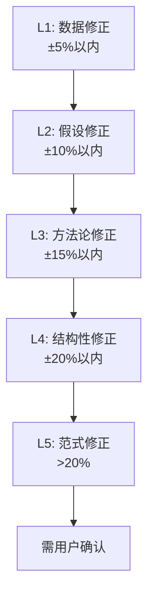

# 估值修正层级 v1.0

> **解决问题 S5**: 估值修正无层级 — Phase 4直接覆盖Phase 2，$311→$326→$313来回跳
> **核心思想**: 5层修正管道，每层有限制幅度+审计日志，禁止无记录直接覆盖

---

## 设计哲学

**旧模式**: Phase 4发现估值问题 → 直接改数字 → 无记录 → 最终估值不知道怎么来的
**新模式**: 每次估值调整走修正管道 → 限制单次调幅 → 每步审计 → 最终值可完整追溯

---

## 5层修正管道



| 层级 | 类型 | 单层修正幅度 | 审批 | 触发场景 |
|------|------|------------|------|---------|
| **L1** | 数据修正 | ≤±5% | 自动 | 数据更新（新财报/新股价） |
| **L2** | 假设修正 | ≤±10% | 自动 | KAL假设修正（增速/利润率调整） |
| **L3** | 方法论修正 | ≤±15% | Phase 4 Reviewer | 估值方法变更（换可比公司/换倍数） |
| **L4** | 结构性修正 | ≤±20% | 明确记录 | 分部重新划分/新分部加入 |
| **L5** | 范式修正 | >20% | **用户确认** | 投资逻辑根本改变 |

### 单层修正上限 ±15%

**核心约束**: 除L5范式修正外，任何单层修正不得超过±15%。

如果某个修正需要超过±15%，必须：
1. 拆分为多层修正（如L1数据修正+L2假设修正）
2. 每层各自记录审计日志
3. 如果拆分后仍超过合理范围，升级到L5并寻求用户确认

---

## 修正审计日志

每次估值修正必须记录在报告附录的审计日志中：

```markdown
## 估值修正审计日志

| 序号 | 层级 | 修正前 | 修正后 | 幅度 | 原因 | 关联 | Phase |
|------|------|--------|--------|------|------|------|-------|
| #1 | L1 | $342 | $339 | -0.9% | 股数更新(12.1B→12.2B) | DM-MKT-003 | P4 |
| #2 | L2 | $339 | $326 | -3.8% | GCP利润率下调(32%→28%) | KA-MG-001 v2 | P4 |
| #3 | L1 | $326 | $324 | -0.6% | Q4营收低于预期 | DM-FIN-002 v1.1 | P4 |
| — | — | — | — | — | — | — | — |
| **累计** | — | **$342** | **$324** | **-5.3%** | — | — | — |

修正路径: $342 →(L1)-0.9%→ $339 →(L2)-3.8%→ $326 →(L1)-0.6%→ $324
```

### 审计日志必填字段

| 字段 | 说明 |
|------|------|
| **序号** | 修正的时间顺序 |
| **层级** | L1-L5中的哪一层 |
| **修正前/后** | 修正前后的每股估值 |
| **幅度** | 百分比变化 |
| **原因** | 具体修正原因（不可为空） |
| **关联** | 关联的DM锚点或KAL假设编号 |
| **Phase** | 在哪个Phase执行的修正 |

---

## 各层级详细规范

### L1: 数据修正 (≤±5%)

```
触发: 客观数据更新
  - 新财报发布 → 营收/EPS更新
  - 股数变化 → 稀释后股数更新
  - 股价变化 → 相对估值倍数重算

操作:
  1. 更新Data Master对应锚点 (DM-FIN/MKT)
  2. 重算受影响的估值步骤
  3. 记录审计日志

审批: 自动（数据更新是客观事实）
约束: 单次修正≤±5%，超过则升级到L2
```

### L2: 假设修正 (≤±10%)

```
触发: KAL假设需要调整
  - Phase 4验证发现假设偏乐观/偏悲观
  - 新信息导致增速/利润率预期调整

操作:
  1. 修正KAL假设 (旧版本→新版本)
  2. 重算受影响的估值步骤
  3. 更新DM-VAL相关锚点
  4. 记录审计日志

审批: 自动（但必须在Phase 4验证语境中）
约束: 单次修正≤±10%，超过则升级到L3
```

### L3: 方法论修正 (≤±15%)

```
触发: 估值方法需要调整
  - 可比公司选择不当 → 更换可比组
  - 估值倍数类型不当 → EV/Revenue改为EV/EBITDA
  - DCF参数重大调整 → WACC/终端增长率

操作:
  1. 说明方法论变更理由
  2. 新旧方法估值对比
  3. 重算SOTP和/或DCF
  4. 更新DM-VAL相关锚点
  5. 记录审计日志

审批: Phase 4 Reviewer明确批准
约束: 单次修正≤±15%
```

### L4: 结构性修正 (≤±20%)

```
触发: 估值结构发生变化
  - 新业务分部出现 → 需要新增分部估值
  - 分部合并/拆分 → SOTP结构重组
  - 并购/剥离改变公司边界

操作:
  1. 重新构建SOTP结构
  2. 新旧结构对比分析
  3. 完整SOTP三步验证
  4. 更新所有DM-VAL锚点
  5. 记录审计日志

审批: 明确记录在报告中，标注为结构性修正
约束: 单次修正≤±20%
```

### L5: 范式修正 (>20%)

```
触发: 投资逻辑根本改变
  - 行业颠覆性事件
  - 公司战略根本转向
  - 估值框架需要重建

操作:
  1. 明确标注"范式修正"
  2. 完整说明旧逻辑为何失效
  3. 重建估值（相当于新的SOTP/DCF）
  4. 记录审计日志
  5. 报告中用显著标记提醒

审批: **必须获得用户确认** — 不得自动执行
约束: 无幅度上限，但必须有充分理由
```

---

## 修正方向规则

```
向下修正 (估值降低):
  - 天然倾向: 更保守 → 更安全
  - 规则: 正常走修正管道

向上修正 (估值提高):
  - 额外审查: 需排除乐观偏差
  - 规则: 每次向上修正需多1条支撑证据
  - 原因: 行为金融研究表明投资者天然有乐观偏差

累计修正:
  - 同方向累计>20% → 自动升级为L5，需用户确认
  - 交替方向（先上后下或先下后上）→ 需解释原因，避免"来回跳"
```

---

## 与其他机制的集成

| 机制 | 关系 |
|------|------|
| Data Master (M1) | 修正后必须同步更新DM-VAL锚点 |
| 反幻觉协议 (M2) | 修正后的新估值仍需通过SOTP三步验证 |
| KAL (M3) | L2假设修正 ← KAL假设修正触发 |
| Kill Switch (M4) | 估值修正可能触发KS状态变化 |
| Quality Gate (M6) | R-G检查估值修正审计日志的完整性 |

---

## GOOGL案例回顾

| 问题 | 旧行为 | 修正层级解决方案 |
|------|--------|-----------------|
| $311→$326→$313来回跳 | 无修正记录 | 每步走管道+审计日志，可追溯 |
| Phase 4直接覆盖Phase 2 | 无层级限制 | 单层±15%上限+层级分类 |
| 最终估值来源不明 | 无审计链 | 审计日志记录完整修正路径 |

---

## 版本历史

| 版本 | 日期 | 变更 |
|:---:|:---:|------|
| v1.0 | 2026-02-07 | 初版。5层管道+审计日志+单层±15%上限+方向规则 |
