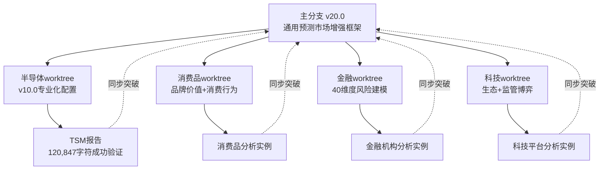

# 🔄 版本同步机制 v1.0

**创建时间**: 2026年2月5日
**适用版本**: v20.0预测市场增强框架
**维护状态**: 活跃

---

## 📋 概述

建立主分支与各行业worktree之间的自动化版本同步机制，确保：
1. **通用突破及时普及** - 在专业worktree中验证的突破性改进能及时同步到主分支
2. **专业优势持续保持** - 各行业worktree保持深度专业化配置
3. **版本分化有效避免** - 防止配置文件版本分化导致的能力退化
4. **合并决策规范执行** - 建立清晰的合并vs保留决策规则

---

## 🏗️ 版本管理架构

### 三层架构设计



### 角色定义

**主分支 (v20.0)**:
- **角色**: 通用框架提供者
- **职责**: 维护跨行业通用的预测市场增强能力
- **更新频率**: 基于worktree验证成功的突破性改进

**行业Worktree**:
- **角色**: 专业化创新者
- **职责**: 开发行业特定的分析能力，验证新功能
- **更新频率**: 实时创新，定期向主分支贡献通用改进

---

## 🎯 同步决策矩阵

### ✅ **必须同步到主分支的改进**

| 改进类型 | 判断标准 | 例子 | 同步时机 |
|---------|---------|------|----------|
| **算法突破** | 适用所有行业 | PPDA算法、PMSI构建方法 | 验证成功后立即同步 |
| **质量标准升级** | 普遍提升分析质量 | L6深度等级、12重Kill Switch | 标准确认后同步 |
| **框架创新** | 方法论突破 | 预测市场集成、五引擎协同 | 完整验证后同步 |
| **数据源扩展** | 增强所有分析 | 新预测市场平台、数据质量标准 | 稳定运行后同步 |
| **风险管理增强** | 通用风险控制 | 动态阈值调整、概率触发机制 | 测试完成后同步 |
| **BUG修复** | 影响核心功能 | 计算错误、逻辑缺陷 | 修复确认后立即同步 |

### ⏸️ **保留在专业Worktree的配置**

| 配置类型 | 判断标准 | 例子 | 保留原因 |
|---------|---------|------|----------|
| **行业专用参数** | 只对特定行业有效 | 半导体复杂度系数2.0、地缘风险权重40% | 行业特殊性 |
| **专业术语定义** | 行业特定概念 | EUV技术、先进制程、代工厂分类 | 专业精确性 |
| **特殊分析模块** | 行业独有需求 | 台海风险建模、芯片供应链分析 | 专业深度 |
| **公司特定配置** | 个股专用设置 | TSM地缘敏感度10.0、NVIDIA AI曝光度0.95 | 定制化需求 |
| **实验性功能** | 未充分验证 | 新AI评分算法、测试数据源 | 稳定性考虑 |
| **临时性需求** | 一次性使用 | 特定事件分析、应急评估模板 | 时效性限制 |

---

## 🔄 同步执行流程

### Phase 1: 创新验证（在专业Worktree）

```yaml
创新开发流程:
  1. 在专业worktree中开发新功能
  2. 通过实际案例验证（如TSM报告验证v10.0）
  3. 记录验证结果和改进效果
  4. 评估通用适用性

验证标准:
  - 功能稳定性: 无重大BUG，运行稳定
  - 效果验证: 有明确的改进效果数据
  - 适用性评估: 确认对其他行业的适用性
  - 用户反馈: 获得正面的使用反馈
```

### Phase 2: 同步决策（评估委员会）

```yaml
决策流程:
  1. 创新团队提交同步申请
  2. 评估适用性和通用价值
  3. 确定同步范围和修改方案
  4. 获得批准后执行同步

评估维度:
  - 通用适用性 (是否适用于所有行业)
  - 改进显著性 (是否有明确的质量提升)
  - 稳定可靠性 (是否经过充分测试)
  - 维护复杂性 (是否增加系统复杂度)
```

### Phase 3: 同步执行（技术实现）

```yaml
同步操作:
  1. 从专业worktree提取通用部分
  2. 适配主分支的通用语境
  3. 集成到主分支配置文件
  4. 更新版本号和变更日志

质量保证:
  - 语法检查: 确保配置文件语法正确
  - 逻辑检查: 确保新旧功能逻辑一致
  - 兼容性测试: 确保与其他worktree兼容
  - 文档同步: 更新相关文档和说明
```

### Phase 4: 验证反馈（持续改进）

```yaml
验证步骤:
  1. 在其他worktree中测试新功能
  2. 收集使用反馈和改进建议
  3. 修正发现的问题
  4. 持续优化和迭代

反馈机制:
  - 定期使用报告
  - 问题和建议收集
  - 性能影响评估
  - 用户满意度调查
```

---

## 📊 同步监控指标

### 关键性能指标 (KPI)

| 指标 | 目标值 | 监控频率 | 负责方 |
|------|--------|----------|--------|
| **同步及时性** | ≤7天 | 每次同步 | 技术团队 |
| **同步成功率** | ≥95% | 每次同步 | 技术团队 |
| **功能稳定性** | ≥99% | 每月 | 质量团队 |
| **用户满意度** | ≥90% | 每季度 | 产品团队 |
| **创新采纳率** | ≥80% | 每季度 | 创新团队 |

### 监控预警系统

```yaml
预警规则:
  同步延迟 > 7天: 黄色预警，需要解释原因
  同步失败 > 2次: 红色预警，立即处理
  功能异常 > 5次: 橙色预警，全面检查
  满意度 < 80%: 黄色预警，收集详细反馈

处理机制:
  黄色预警: 24小时内响应
  橙色预警: 12小时内响应
  红色预警: 4小时内响应
```

---

## 🛠️ 工具和自动化

### 自动化同步工具

```bash
# 同步检查脚本
#!/bin/bash
check_sync_opportunity() {
    # 检查worktree中的新功能
    # 评估通用适用性
    # 生成同步建议报告
}

# 同步执行脚本
execute_sync() {
    # 提取通用部分
    # 适配主分支语境
    # 执行同步操作
    # 生成变更日志
}

# 验证测试脚本
validate_sync() {
    # 语法检查
    # 功能测试
    # 兼容性验证
    # 性能评估
}
```

### 版本管理规范

```yaml
分支命名规范:
  feature/sync-[功能名]-[日期]: 功能同步分支
  hotfix/sync-[问题]-[日期]: 紧急修复同步分支

提交信息规范:
  sync: [worktree] - [功能描述]
  例: sync: semiconductor - PPDA algorithm integration

标签管理:
  v20.0: 主要版本升级
  v20.1: 次要功能同步
  v20.0.1: 补丁和修复
```

---

## 📋 执行检查清单

### 同步前检查

- [ ] 功能已在源worktree中充分验证
- [ ] 确认通用适用性和价值
- [ ] 准备同步方案和测试计划
- [ ] 获得相关方批准
- [ ] 备份当前主分支配置

### 同步中执行

- [ ] 按照标准流程执行同步
- [ ] 实时监控同步过程
- [ ] 记录详细的操作日志
- [ ] 执行质量检查和测试
- [ ] 更新相关文档

### 同步后验证

- [ ] 在多个环境中测试新功能
- [ ] 收集用户反馈
- [ ] 监控性能指标
- [ ] 修正发现的问题
- [ ] 更新版本记录

---

## 🚨 风险管控

### 主要风险点

1. **同步冲突风险**
   - **风险**: 不同worktree的功能相互冲突
   - **预防**: 标准化开发规范，冲突预检查
   - **应对**: 冲突解决协议，回滚机制

2. **功能退化风险**
   - **风险**: 同步过程中丢失重要功能
   - **预防**: 完整的备份和测试
   - **应对**: 快速回滚，损失评估

3. **稳定性风险**
   - **风险**: 新功能影响系统稳定性
   - **预防**: 充分的测试和渐进部署
   - **应对**: 紧急修复，稳定性监控

4. **复杂度风险**
   - **风险**: 过度同步导致系统复杂
   - **预防**: 严格的同步标准，定期简化
   - **应对**: 架构重构，功能精简

### 应急预案

```yaml
应急响应流程:
  Level 1 - 功能异常:
    - 立即停用异常功能
    - 评估影响范围
    - 修复或回滚

  Level 2 - 系统冲突:
    - 紧急隔离冲突部分
    - 分析冲突原因
    - 协调解决方案

  Level 3 - 全面故障:
    - 立即回滚到稳定版本
    - 全面系统检查
    - 重新设计同步方案
```

---

## 📈 持续改进

### 改进机制

```yaml
定期评估:
  月度回顾: 同步效果和问题总结
  季度优化: 流程改进和工具升级
  年度规划: 长期发展和技术演进

反馈收集:
  用户调研: 定期收集使用反馈
  性能监控: 持续监控系统指标
  技术跟踪: 关注行业最佳实践

迭代升级:
  小步快跑: 频繁小幅改进
  重大升级: 定期大版本更新
  创新实验: 前瞻性技术探索
```

### 学习和培训

- **团队培训**: 定期培训同步流程和工具使用
- **最佳实践分享**: 成功案例分析和经验分享
- **技术更新**: 新技术和方法的学习应用
- **跨团队协作**: 加强不同worktree团队间的协作

---

## 📞 联系和支持

### 责任分工

- **技术负责人**: 同步工具开发和维护
- **质量负责人**: 同步质量标准和检查
- **产品负责人**: 同步策略和用户需求
- **项目协调人**: 跨团队协调和进度管理

### 获取帮助

1. **技术问题**: 查看技术文档，联系技术团队
2. **流程问题**: 参考操作指南，联系项目协调人
3. **质量问题**: 查看质量标准，联系质量团队
4. **策略问题**: 提交决策申请，联系产品负责人

---

## 📝 版本历史

| 版本 | 日期 | 主要变更 | 负责人 |
|------|------|---------|--------|
| v1.0 | 2026-02-05 | 初始版本建立，基于TSM v10.0验证经验 | 系统架构师 |

---

**同步机制建立完成**

v1.0版本同步机制已建立，确保主分支与各专业worktree之间的有效协调，防止未来配置分化，保持系统的创新活力和专业优势。

**下一步行动**:
1. 实施自动化同步工具开发
2. 建立监控和预警系统
3. 定期评估和优化机制
4. 培训相关团队成员