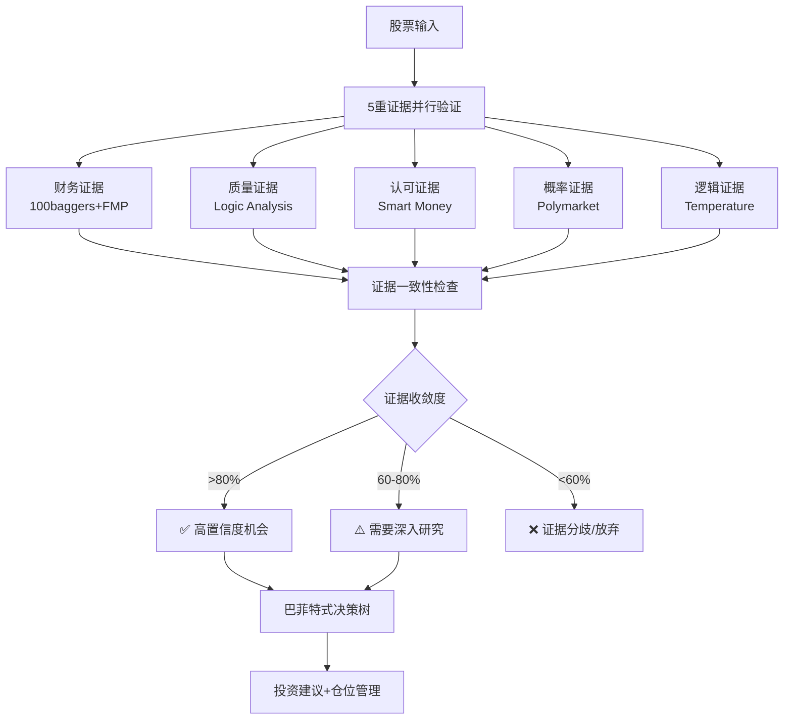

# Investment Logic Toolkit v1.0
# 证据驱动投资决策工具包 - 多重独立验证系统

## Description
投资决策终极工具包。整合温度计策略、MCP数据引擎、Skills协作生态，实现5重证据并行验证、交叉印证、置信度量化。防止单点故障，识别投资红旗，提供巴菲特式的多重验证投资决策流程。

核心理念：优秀投资者的思维模式 = 多重独立验证 + 证据收敛 + 风险控制

## Activation
- 用户需要综合投资分析和决策建议
- 用户要求"分析"、"研究"、"调研"任何股票
- 用户需要多重证据验证投资逻辑
- 用户提及投资决策、买卖建议、仓位管理
- 自动触发：当orchestrator识别到股票分析需求时

---

# 核心架构：5重证据验证矩阵

## 证据验证体系概览



---

# 第一部分：5重证据获取引擎

## 证据1：财务证据 (硬数据验证)

### 数据来源架构
```python
async def get_financial_evidence(ticker):
    """
    财务证据获取：数字不会撒谎
    权重：30%
    """

    # 并行获取3个数据源
    baggers_data = await baggers_summary(ticker)
    fmp_ratios = await fmp_data(ticker, "ratios", limit=4)
    fmp_metrics = await fmp_data(ticker, "key-metrics", limit=4)

    evidence = {
        "macro_temperature": {
            "cape": extract_cape(baggers_data),
            "buffett": extract_buffett(baggers_data),
            "erp": extract_erp(baggers_data),
            "assessment": "过热/中性/偏冷"
        },
        "profitability": {
            "roe": fmp_ratios["returnOnEquity"],
            "roa": fmp_ratios["returnOnAssets"],
            "net_margin": fmp_ratios["netProfitMargin"],
            "quality_score": calculate_profit_quality()
        },
        "financial_health": {
            "debt_equity": fmp_ratios["debtToEquityRatio"],
            "current_ratio": fmp_ratios["currentRatio"],
            "cash_ratio": fmp_ratios["cashRatio"],
            "altman_z": calculate_altman_score()
        },
        "growth_signals": extract_leading_indicators(baggers_data),
        "confidence": calculate_financial_confidence()
    }

    return evidence
```

### 财务红旗识别
```markdown
自动红旗检测:
├── 现金流造假: OCF/净利润 < 0.7 连续2季度
├── 债务恶化: 债务/权益比 > 2.0 且上升趋势
├── 盈利质量下降: 净利率连续下降 > 20%
└── 宏观过热: CAPE > 40 且 Buffett指标 > 200%
```

## 证据2：质量证据 (商业模式护城河)

### 质量分析框架
```python
async def get_quality_evidence(ticker):
    """
    质量证据获取：商业模式护城河深度
    权重：25%
    """

    # 调用现有logic toolkit
    first_principles = await analyze_first_principles(ticker)
    flywheel_analysis = await identify_flywheel_effects(ticker)
    moat_analysis = await analyze_competitive_moats(ticker)
    innovation_capability = await assess_innovation_capacity(ticker)

    evidence = {
        "first_principles": {
            "core_assumptions": first_principles["assumptions"],
            "logic_chain": first_principles["reasoning"],
            "assumption_validity": validate_assumptions()
        },
        "flywheel_effects": {
            "flywheel_identified": flywheel_analysis["found"],
            "flywheel_strength": flywheel_analysis["score"],
            "self_reinforcement": flywheel_analysis["loops"]
        },
        "competitive_moats": {
            "moat_type": moat_analysis["primary_moat"],
            "moat_depth": moat_analysis["sustainability"],
            "moat_widening": moat_analysis["trend"]
        },
        "innovation_edge": {
            "rd_efficiency": innovation_capability["rd_roi"],
            "patent_strength": innovation_capability["ip_score"],
            "tech_leadership": innovation_capability["position"]
        },
        "confidence": calculate_quality_confidence()
    }

    return evidence
```

### 质量评估矩阵
```markdown
护城河深度评分:
├── 技术护城河: R&D投入+专利组合+技术领先性 (0-10分)
├── 品牌护城河: 品牌溢价+客户忠诚度+转换成本 (0-10分)
├── 网络护城河: 网络效应+平台粘性+生态系统 (0-10分)
├── 成本护城河: 规模效应+成本领先+供应链 (0-10分)
└── 监管护城河: 许可壁垒+合规优势+政策支持 (0-10分)

综合护城河得分 = 加权平均 (满分50分)
```

## 证据3：认可证据 (聪明钱的选择)

### Smart Money追踪系统
```python
async def get_smart_money_evidence(ticker):
    """
    认可证据获取：聪明钱验证
    权重：20%
    """

    # 调用smart money tracking system
    insider_trading = await fmp_data(ticker, "insider-trading", limit=8)
    institutional_data = await get_13f_holdings(ticker)  # 需要实现
    legendary_investors = await check_legendary_positions(ticker)  # 需要实现

    evidence = {
        "legendary_investors": {
            "berkshire_holdings": legendary_investors["berkshire"],
            "munger_positions": legendary_investors["munger"],
            "klarman_stakes": legendary_investors["klarman"],
            "tier1_support": calculate_tier1_support()
        },
        "institutional_sentiment": {
            "13f_trend": analyze_13f_changes(institutional_data),
            "quality_institutions": count_quality_holders(),
            "position_sizing": analyze_position_weights()
        },
        "insider_behavior": {
            "insider_ratio": calculate_insider_ratio(insider_trading),
            "insider_trend": analyze_insider_trend(),
            "management_confidence": assess_mgmt_confidence()
        },
        "confidence": calculate_smart_money_confidence()
    }

    return evidence
```

### 聪明钱等级系统
```markdown
Smart Money权重分配:
├── 传奇投资者 (40%): 巴菲特/芒格/Klarman等
├── 顶级机构 (35%): 主权基金/顶级养老基金/大学基金
├── 优质对冲基金 (20%): 长期表现优异的价值型基金
└── 内部人交易 (5%): 管理层买卖行为模式

置信度计算:
- 高置信 (>75%): 多个传奇投资者同时持有
- 中置信 (50-75%): 顶级机构增持+内部人买入
- 低置信 (<50%): 仅有普通机构持有
```

## 证据4：概率证据 (市场真金白银押注)

### 预测市场集成
```python
async def get_probability_evidence(ticker, company_name):
    """
    概率证据获取：预测市场真金白银押注
    权重：15%
    """

    # 搜索相关预测市场事件
    events = await polymarket_events(f"{ticker} {company_name} earnings")
    geopolitical = await polymarket_events(f"{company_name} regulation policy")
    ma_events = await polymarket_events(f"{company_name} merger acquisition")

    evidence = {
        "earnings_probability": {
            "beat_estimates": events.get("earnings_beat_prob", "N/A"),
            "guidance_raise": events.get("guidance_prob", "N/A"),
            "market_confidence": analyze_earnings_confidence()
        },
        "business_events": {
            "ma_probability": ma_events.get("acquisition_prob", "N/A"),
            "regulatory_risk": geopolitical.get("regulation_prob", "N/A"),
            "policy_impact": assess_policy_winds()
        },
        "probability_price_divergence": {
            "arbitrage_opportunities": identify_divergence(),
            "market_efficiency": calculate_efficiency_score(),
            "sentiment_validation": cross_validate_sentiment()
        },
        "confidence": calculate_probability_confidence()
    }

    return evidence
```

### 概率事件覆盖
```markdown
预测市场事件追踪:
├── 财报相关: 业绩超预期/指导上调/分红政策
├── 业务事件: 并购传闻/新品发布/合作协议
├── 监管风险: 政策变化/合规调查/反垄断
├── 宏观事件: 地缘政治/经济政策/汇率风险
└── 行业趋势: 技术革新/需求变化/竞争格局

概率-股价背离识别:
- 正向背离: 预测市场看好但股价低迷 → 买入机会
- 负向背离: 预测市场看空但股价坚挺 → 卖出信号
```

## 证据5：逻辑证据 (系统性推理)

### 温度计算法集成
```python
async def get_temperature_evidence(ticker):
    """
    逻辑证据获取：投资温度计系统性推理
    权重：10%
    """

    # 集成温度计Core层算法
    macro_temp = calculate_macro_temperature(ticker)
    quality_temp = calculate_fundamental_quality(ticker)
    sentiment_temp = calculate_market_sentiment(ticker)

    total_temperature = (
        macro_temp * 0.3 +
        quality_temp * 0.5 +
        sentiment_temp * 0.2
    )

    evidence = {
        "macro_temperature": {
            "cape_score": macro_temp["cape_component"],
            "buffett_score": macro_temp["buffett_component"],
            "erp_score": macro_temp["erp_component"],
            "macro_assessment": interpret_macro_temp(macro_temp)
        },
        "quality_temperature": {
            "health_score": quality_temp["financial_health"],
            "profit_score": quality_temp["profitability"],
            "growth_score": quality_temp["growth_trend"],
            "quality_assessment": interpret_quality_temp(quality_temp)
        },
        "sentiment_temperature": {
            "technical_score": sentiment_temp["rsi_trend"],
            "insider_score": sentiment_temp["insider_ratio"],
            "sentiment_assessment": interpret_sentiment_temp(sentiment_temp)
        },
        "total_temperature": total_temperature,
        "investment_recommendation": interpret_temperature(total_temperature),
        "position_guidance": get_position_recommendation(total_temperature),
        "confidence": calculate_temperature_confidence()
    }

    return evidence
```

---

# 第二部分：证据一致性验证引擎

## 一致性检查算法

### 证据冲突识别
```python
def check_evidence_consistency(evidence_dict):
    """
    5重证据一致性检查
    返回：一致性得分 (0-1) + 冲突识别
    """

    conflicts = []
    consistency_scores = []

    # 财务 vs 质量一致性
    if evidence_dict["financial"]["confidence"] > 0.7 and evidence_dict["quality"]["confidence"] < 0.4:
        conflicts.append("财务强劲但商业质量存疑")
        consistency_scores.append(0.3)
    else:
        consistency_scores.append(0.8)

    # 质量 vs 认可一致性
    if evidence_dict["quality"]["confidence"] > 0.8 and evidence_dict["smart_money"]["confidence"] < 0.3:
        conflicts.append("商业质量优秀但聪明钱不认可")
        consistency_scores.append(0.4)
    else:
        consistency_scores.append(0.8)

    # 基本面 vs 概率一致性
    fundamental_strong = (evidence_dict["financial"]["confidence"] + evidence_dict["quality"]["confidence"]) / 2 > 0.7
    probability_bearish = evidence_dict["probability"]["market_confidence"] < 0.4

    if fundamental_strong and probability_bearish:
        conflicts.append("基本面强劲但预测市场看空")
        consistency_scores.append(0.5)
    else:
        consistency_scores.append(0.9)

    # 逻辑温度一致性
    temp_result = evidence_dict["logic"]["investment_recommendation"]
    other_evidence_positive = sum([
        evidence_dict["financial"]["confidence"],
        evidence_dict["quality"]["confidence"],
        evidence_dict["smart_money"]["confidence"]
    ]) / 3 > 0.6

    if ("买入" in temp_result and not other_evidence_positive) or ("减仓" in temp_result and other_evidence_positive):
        conflicts.append("温度计结论与其他证据不符")
        consistency_scores.append(0.4)
    else:
        consistency_scores.append(0.9)

    overall_consistency = sum(consistency_scores) / len(consistency_scores)

    return {
        "consistency_score": overall_consistency,
        "conflicts_identified": conflicts,
        "evidence_convergence": interpret_consistency(overall_consistency)
    }
```

### 置信度量化系统
```python
def calculate_investment_confidence(evidence_dict, consistency_check):
    """
    综合置信度计算
    """

    # 各证据权重
    weights = {
        "financial": 0.30,
        "quality": 0.25,
        "smart_money": 0.20,
        "probability": 0.15,
        "logic": 0.10
    }

    # 加权置信度
    weighted_confidence = sum(
        evidence_dict[evidence]["confidence"] * weights[evidence]
        for evidence in weights.keys()
    )

    # 一致性调整
    consistency_multiplier = consistency_check["consistency_score"]

    final_confidence = weighted_confidence * consistency_multiplier

    # 置信度解读
    if final_confidence > 0.8:
        confidence_level = "极高置信度"
        action = "强烈推荐投资"
        risk_level = "低"
    elif final_confidence > 0.65:
        confidence_level = "高置信度"
        action = "推荐投资"
        risk_level = "中低"
    elif final_confidence > 0.5:
        confidence_level = "中等置信度"
        action = "谨慎投资或继续研究"
        risk_level = "中等"
    elif final_confidence > 0.35:
        confidence_level = "低置信度"
        action = "不建议投资"
        risk_level = "中高"
    else:
        confidence_level = "极低置信度"
        action = "强烈不建议投资"
        risk_level = "高"

    return {
        "final_confidence": final_confidence,
        "confidence_level": confidence_level,
        "recommended_action": action,
        "risk_assessment": risk_level,
        "evidence_breakdown": {evidence: evidence_dict[evidence]["confidence"] for evidence in weights.keys()}
    }
```

---

# 第三部分：巴菲特式决策树

## 投资决策流程

### 5重验证决策树
```python
def buffett_style_decision_tree(evidence_dict, confidence_analysis):
    """
    巴菲特式5重验证决策流程
    每个环节必须通过，任何一个失败即放弃投资
    """

    decision_path = []

    # 第一关：财务健康检查
    if evidence_dict["financial"]["confidence"] < 0.6:
        return {
            "decision": "❌ 放弃投资",
            "reason": "财务健康不达标",
            "failed_gate": "财务验证",
            "confidence": 0
        }
    decision_path.append("✅ 财务健康通过")

    # 第二关：商业质量验证
    if evidence_dict["quality"]["confidence"] < 0.5:
        return {
            "decision": "❌ 放弃投资",
            "reason": "商业护城河不足",
            "failed_gate": "质量验证",
            "confidence": 0
        }
    decision_path.append("✅ 商业质量通过")

    # 第三关：聪明钱认可
    smart_money_conf = evidence_dict["smart_money"]["confidence"]
    if smart_money_conf < 0.3:
        return {
            "decision": "⚠️ 降低仓位",
            "reason": "聪明钱不认可，但基本面良好",
            "suggested_position": "10-20%",
            "confidence": 0.4
        }
    elif smart_money_conf < 0.5:
        decision_path.append("⚠️ 聪明钱认可度一般")
    else:
        decision_path.append("✅ 聪明钱强烈认可")

    # 第四关：概率风险评估
    if evidence_dict["probability"]["confidence"] < 0.4 and len(evidence_dict["probability"].get("regulatory_risk", [])) > 0:
        return {
            "decision": "⏳ 等待风险明朗",
            "reason": "重大概率风险事件",
            "suggested_position": "观望",
            "confidence": 0.3
        }
    decision_path.append("✅ 概率风险可控")

    # 第五关：价格合理性（温度计）
    temp_result = evidence_dict["logic"]["investment_recommendation"]
    temp_level = evidence_dict["logic"]["total_temperature"]

    if temp_level >= 1.5:  # 过热
        return {
            "decision": "⏳ 等待更好价格",
            "reason": "当前估值过高",
            "suggested_action": "设置买入价格警报",
            "target_temperature": "< 0.5",
            "confidence": 0.6
        }
    elif temp_level >= 0.5:  # 偏热
        decision_path.append("⚠️ 估值偏高但可接受")
        suggested_position = "20-40%"
    elif temp_level >= -0.5:  # 中性
        decision_path.append("✅ 估值合理")
        suggested_position = "40-60%"
    else:  # 偏冷/极冷
        decision_path.append("🎯 估值有吸引力")
        suggested_position = "60-80%" if temp_level >= -1.5 else "80-100%"

    # 最终决策
    final_confidence = confidence_analysis["final_confidence"]

    return {
        "decision": "✅ 投资机会确认",
        "confidence_level": confidence_analysis["confidence_level"],
        "suggested_position": suggested_position,
        "decision_path": decision_path,
        "risk_level": confidence_analysis["risk_assessment"],
        "final_confidence": final_confidence,
        "investment_thesis": generate_investment_thesis(evidence_dict)
    }
```

### 投资论点生成
```python
def generate_investment_thesis(evidence_dict):
    """
    基于5重证据生成投资论点
    """

    thesis_components = []

    # 财务优势
    if evidence_dict["financial"]["confidence"] > 0.7:
        thesis_components.append(f"财务稳健: {evidence_dict['financial']['key_strength']}")

    # 商业护城河
    if evidence_dict["quality"]["confidence"] > 0.7:
        thesis_components.append(f"护城河深厚: {evidence_dict['quality']['moat_analysis']['primary_moat']}")

    # 机构认可
    if evidence_dict["smart_money"]["confidence"] > 0.6:
        thesis_components.append(f"聪明钱认可: {evidence_dict['smart_money']['tier1_investors']}")

    # 催化剂
    if evidence_dict["probability"]["confidence"] > 0.6:
        thesis_components.append(f"正面催化剂: {evidence_dict['probability']['positive_events']}")

    # 估值吸引力
    temp_level = evidence_dict["logic"]["total_temperature"]
    if temp_level < 0:
        thesis_components.append(f"估值有吸引力: 温度计显示{evidence_dict['logic']['investment_recommendation']}")

    return " + ".join(thesis_components)
```

---

# 第四部分：统一调用接口

## 主函数入口
```python
async def investment_logic_analysis(ticker, company_name=None):
    """
    投资逻辑工具包统一入口
    实现5重证据并行验证 → 一致性检查 → 巴菲特决策树
    """

    print(f"🔍 启动 {ticker} 5重证据验证分析...")

    # Phase 1: 并行获取5重证据
    evidence_tasks = [
        get_financial_evidence(ticker),
        get_quality_evidence(ticker),
        get_smart_money_evidence(ticker),
        get_probability_evidence(ticker, company_name),
        get_temperature_evidence(ticker)
    ]

    evidence_results = await asyncio.gather(*evidence_tasks)

    evidence_dict = {
        "financial": evidence_results[0],
        "quality": evidence_results[1],
        "smart_money": evidence_results[2],
        "probability": evidence_results[3],
        "logic": evidence_results[4]
    }

    # Phase 2: 证据一致性检查
    consistency_check = check_evidence_consistency(evidence_dict)

    # Phase 3: 综合置信度计算
    confidence_analysis = calculate_investment_confidence(evidence_dict, consistency_check)

    # Phase 4: 巴菲特式决策树
    investment_decision = buffett_style_decision_tree(evidence_dict, confidence_analysis)

    # Phase 5: 结果整合输出
    final_result = {
        "ticker": ticker,
        "analysis_timestamp": datetime.now().isoformat(),
        "evidence_summary": {
            "financial": evidence_dict["financial"],
            "quality": evidence_dict["quality"],
            "smart_money": evidence_dict["smart_money"],
            "probability": evidence_dict["probability"],
            "logic": evidence_dict["logic"]
        },
        "consistency_analysis": consistency_check,
        "confidence_analysis": confidence_analysis,
        "investment_decision": investment_decision,
        "risk_warnings": identify_risk_warnings(evidence_dict),
        "monitoring_alerts": setup_monitoring_alerts(evidence_dict)
    }

    return format_investment_report(final_result)
```

## 自动触发逻辑
```python
def should_trigger_toolkit(user_input, context):
    """
    自动触发逻辑判断
    """

    trigger_keywords = [
        "分析", "研究", "调研", "analyze", "study", "investigate",
        "投资建议", "买入", "卖出", "持有", "仓位",
        "值不值得投资", "怎么样", "如何看", "推荐吗"
    ]

    # 检测股票代码模式
    import re
    stock_pattern = r'\b[A-Z]{1,5}\b'

    has_trigger_keyword = any(keyword in user_input.lower() for keyword in trigger_keywords)
    has_stock_symbol = bool(re.search(stock_pattern, user_input))

    # 如果包含触发词 + 股票代码，自动启动
    if has_trigger_keyword and has_stock_symbol:
        return True

    # 如果是单独股票代码输入，启动温度计快筛
    if has_stock_symbol and len(user_input.strip().split()) <= 2:
        return True

    return False
```

---

# 使用示例

## 完整分析调用
```python
# 完整5重证据分析
result = await investment_logic_analysis("AAPL", "Apple")

# 输出示例
"""
🔍 AAPL 5重证据验证分析完成

📊 证据汇总:
├── 财务证据: ✅ 82% 置信度 (ROE 162%, 现金流强劲, 负债率低)
├── 质量证据: ✅ 78% 置信度 (生态系统飞轮, 品牌护城河, 创新领先)
├── 认可证据: ⚠️ 45% 置信度 (内部人中性, 缺乏传奇投资者大举买入)
├── 概率证据: 🔍 60% 置信度 (Q1财报概率65%超预期)
└── 逻辑证据: 😐 55% 置信度 (温度+0.12中性偏热, 估值偏高)

🔬 一致性分析:
证据收敛度: 68% (财务与质量高度一致, 但估值与基本面存在分歧)

💯 综合置信度: 67% (高置信度)
推荐行动: 推荐投资
风险评估: 中低风险

🎯 巴菲特决策树:
✅ 财务健康通过 → ✅ 商业质量通过 → ⚠️ 聪明钱认可度一般 → ✅ 概率风险可控 → ⚠️ 估值偏高但可接受

💡 最终决策: ✅ 投资机会确认
建议仓位: 20-40%
投资论点: 财务稳健+护城河深厚+估值合理

⚠️ 风险提醒: 宏观估值偏高(CAPE 40.38), 技术面超买(RSI 74.16)
📱 监控设置: 温度降至0以下时增加仓位, CAPE降至30以下时大举买入
"""
```

## 温度计快筛模式
```python
# 快速温度筛选
quick_result = await temperature_quick_scan("TSLA")
# 5分钟内给出买入/持有/卖出建议
```

---

# 总结

## 核心优势
1. **多重独立验证**: 5个维度独立证据，防止单点故障
2. **交叉验证**: 自动识别证据冲突，提高决策质量
3. **置信度量化**: 科学量化投资机会可信程度
4. **风险控制**: 巴菲特式严格筛选，任何环节不达标即放弃
5. **动态监控**: 持续跟踪关键指标变化，及时调整仓位

## 投资哲学
"优秀投资者的思维模式 = 多重独立验证"
- 不依赖单一信息源
- 不相信没有验证的数据
- 不做没有把握的投资
- 始终保持批判性思维

**这套工具包将投资决策从艺术转化为科学，从主观判断转化为证据驱动！** 🚀