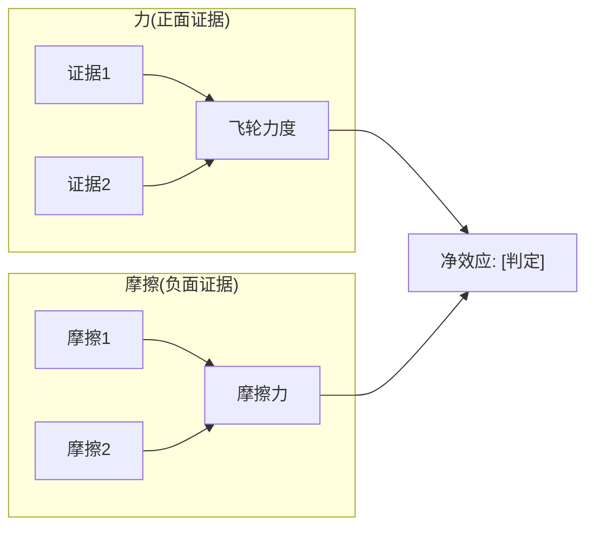

# 飞轮+摩擦力分析模块 v1.0

> **触发条件**: 管理层在财报/Investor Day中使用"flywheel/飞轮/平台协同/生态系统"等叙事
> **来源**: MCO v2.0 Ch6.2(MIS×MA飞轮真实性评估, 3正面+4负面证据→净判断)
> **核心创新**: 不只评估"飞轮是否存在"，还量化"摩擦力有多大"→净效应决定是否值得溢价

---

## 一、何时触发

| 触发信号 | 来源 | 示例 |
|---------|------|------|
| 管理层使用"flywheel/platform/ecosystem" | 财报/Investor Day/10-K | MCO "Integrated Risk Assessment" |
| 多业务线公司声称"协同效应" | M&A/重组叙事 | CRM "Customer 360" |
| 市场给予"平台溢价"(PE>同行均值) | 估值对比 | MCO PE 33x vs SPGI 30x |
| SOTP < 市值(隐含协同溢价) | 估值分析 | MCO SOTP $370 vs 市价$441 |

---

## 二、分析框架 (4步)

### Step 1: 管理层飞轮叙事解构

**提取管理层声称的飞轮循环**:
```
[业务A输出] → [业务B输入] → [客户价值增加] → [更多需求回到业务A] → ...
```

然后拆解为**连接点**(通常3-5个)，每个连接点独立评估。

**MCO案例**:
```
MIS评级数据 → MA分析模型(EDF/CreditLens) → 客户决策嵌入 → 更多信用需求 → MIS评级需求 → ...
连接点1: MIS数据→MA产品 (数据复用)
连接点2: MA客户→MIS需求 (交叉销售)
连接点3: 客户嵌入→需求增长 (正反馈)
```

### Step 2: 逐连接点验证 (力 vs 摩擦)

每个连接点用**正面证据(力)** 和 **负面证据(摩擦)** 双向评估:

| 连接点 | 力(正面证据) | 摩擦(负面证据) | 净判定 |
|--------|------------|-------------|--------|
| C1 | [数据支撑] | [数据反驳] | 真实/微弱/不存在 |
| C2 | ... | ... | ... |
| C3 | ... | ... | ... |

**评估标准**:
- **真实**: 有可量化的财务证据(收入协同、交叉销售率、客户重叠度)
- **微弱**: 逻辑成立但财务证据不足或因果链过长(>2个独立决策节点)
- **不存在**: 客户群不重叠、使用场景独立、数据流单向

### Step 3: 摩擦力清单 (MCO验证的5类摩擦)

| 摩擦类型 | 定义 | 检查方式 | MCO案例 |
|---------|------|---------|---------|
| **客户不重叠** | A和B的客户是不同的人/部门 | 客户画像对比 | 发行人CFO ≠ 银行风控官 |
| **数据流单向** | A→B有数据流,B→A没有 | 数据流图 | MIS→MA有,MA→MIS无 |
| **因果链过长** | A→B→C→D,中间>2个独立决策 | 传导链计数 | CreditLens→信贷→评估→MCO=3环 |
| **关键人依赖** | 飞轮靠个人推动非系统运转 | 人事变动影响 | MA总裁辞职→整合中断 |
| **零协同子业务** | 部分业务线与飞轮完全无关 | 收入归因 | KYC/Insurance与MIS零交叉 |

### Step 4: 净效应判定 → 估值含义

| 净效应 | 判定 | 估值影响 |
|--------|------|---------|
| **飞轮真实(力>摩擦)** | 值得协同溢价 | SOTP低估,PE溢价合理 |
| **数据复用(力≈摩擦)** | 有效率优势但非飞轮 | SOTP接近合理,PE溢价部分合理 |
| **叙事飞轮(力<摩擦)** | 管理层讲故事,协同不存在 | SOTP高估市值,PE含叙事泡沫 |

---

## 三、产出格式

```markdown
### 飞轮+摩擦力分析

**管理层飞轮叙事**: "[原文描述]"



| 连接点 | 力 | 摩擦 | 净判定 |
|--------|-----|------|--------|
| C1: ... | [证据] | [证据] | 真实/微弱/不存在 |

**飞轮力度判断**: [真实/数据复用/叙事] (置信度XX%)
**估值影响**: PE中约X个倍数为[协同溢价/叙事溢价]
```

---

## 四、可迁移案例

| 公司 | 管理层飞轮叙事 | 预期摩擦 | 何时分析 |
|------|-------------|---------|---------|
| **CRM** | Customer 360(Sales→Service→Marketing→Platform) | 客户部门不同+AppExchange第三方 | Phase 2 |
| **AMZN** | Retail→Prime→AWS→Alexa | AWS与零售客户几乎零重叠 | Phase 1 |
| **GOOGL** | Search→Ads→Cloud→YouTube→Android | 广告商≠Cloud客户 | Phase 1 |
| **META** | Facebook→Instagram→WhatsApp→Metaverse | 用户重叠但广告主重叠度? | Phase 2 |
| **UNH** | UHC保险→Optum服务→Optum数据 | 保险客户=Optum客户?垂直整合vs飞轮 | Phase 1 |
| **MSFT** | Office→Azure→LinkedIn→GitHub→Copilot | Azure→Office生态有真实飞轮 | Phase 1 |

---

## 五、与现有分析的集成

- **CQI C2(网络效应)**: 飞轮是网络效应的一种形式→本模块深化C2的定性判断
- **SOTP估值**: 如果飞轮=叙事→SOTP不应包含协同溢价
- **红队RT-2**: 飞轮摩擦是天然的红队攻击点
- **CI注册**: 如果发现"被高估的飞轮"→注册为CI(非共识洞见)
