# Apple Inc. (AAPL) 深度研究报告 v2.0

## Protocol Header

| 参数 | 值 |
|------|-----|
| 框架版本 | v17.0 |
| 可能性宽度 | 2.6/10 (传统框架) |
| 评级 | **审慎关注** |
| 概率加权EV | **$210/股** (校准后) |
| 当前股价 | $264.35 |
| 期望回报 | **-20.5%** |
| 数据截止 | FY2026 Q1 (2025-12-27) |
| 撰写日期 | 2026-02-19 |
| CQ加权置信度 | 53.95% (校准后) |
| 方法离散度 | 2.33x (端点级) / 1.54x (概率加权级) |
| DM锚点 | 148个 |
| Mermaid图 | 19个 |

---

## Ch1: 执行摘要

### 30秒投资论点

Apple拥有全球消费科技领域最宽的护城河 -- 24亿活跃设备、76.5%的Services毛利率、$98.8B年化自由现金流 -- 但在$264/$3.9T的估值水平上,市场隐含了7个关键信念同时成立的乐观假设: iPhone 4%+ CAGR、Services 12%+ CAGR、Google搜索协议存续、AI期权兑现、中国市场稳定、利润率扩张、回购持续。Reverse DCF显示当前定价隐含FCFF永续增速6.35%,是过去5年实际增速(1.5%)的4倍。三方法概率加权估值(SOTP $179 / DCF $151 / 可比$231)经红队双向校准后为$210/股,期望回报-20.5%,对应**审慎关注**评级。Apple不是一家坏公司 -- 它可能是全球最优秀的商业特许经营之一 -- 但在33.5x P/E(Big Tech最高)且收入CAGR 2.8%(Big Tech最低)的估值下,风险收益比不利于当前价位的投资者。

### 关键数字一览表

| 指标 | 数值 | 来源 |
|------|------|------|
| **股价** | $264.35 | 2026-02-18 |
| **市值** | $3.90T | |
| **P/E TTM** | 33.5x | FMP |
| **FY2025收入** | $416.2B (+6.4% YoY) | FMP income |
| **FY2025净利** | $112.0B (+19.5% YoY) | FMP income |
| **TTM EPS** | $7.91 | FMP |
| **FY2025 FCF** | $98.8B | FMP cashflow |
| **FCF Yield** | 2.53% | 计算 |
| **Services FY2025** | $109.2B (占收入26.2%) | FMP income |
| **Q1 FY2026 iPhone** | $85.3B (+23% YoY, 历史新高) | Apple Newsroom |
| **Q1 FY2026 Services** | $26.3B (+14% YoY) | Apple Newsroom |
| **活跃设备** | 24亿台 | Apple管理层 |
| **现金+投资** | $132.4B | FMP balance |
| **净债务** | $76.4B | FMP balance |
| **年度回购** | $90.7B (FY2025) | FMP cashflow |
| **FMP DCF** | $150.28 | FMP |
| **概率加权EV(校准后)** | **$210/股** | 三方法+红队校准 |

[DM-SUM-001: 关键数字一览表, 数据源自FMP income/balance/cashflow FY2025 + Apple Newsroom Q1 FY2026]

### CQ一句话总结

| CQ | 问题 | 校准后置信度 | 一句话结论 |
|----|------|------------|-----------|
| CQ-1 | AI能否驱动iPhone超级换机? | 50% | Q1 +23%部分验证, 但仅20%用户因AI换机, 更多是ASP周期 |
| CQ-2 | Google搜索协议影响? | 57% | 概率加权年化净利影响$5.15B; 终止(20%概率)可致股价-25至30% |
| CQ-3 | Services能否维持12-15%增速? | 52% | AI付费层上行 vs Google协议+反垄断下行大致对冲, 12-14%可维持2-3年 |
| CQ-4 | 中国三重风险压缩? | 60% | 概率加权年化收入损失~$8-10B; 华为回归是结构性非周期性 |
| CQ-5 | 33x P/E能否被支撑? | 48% | Forward PEG 2.35x是同行2.4-4.1倍; Buffett累计减持74% |
| CQ-6 | 轻资本AI战略可持续? | 55% | 2-3年内可持续(模型降价趋势明确), 5年以上取决于AGI突破归属 |
| CQ-7 | App Store佣金侵蚀? | 63% | EU DMA已造成确定性$1.2-1.5B侵蚀; 有效费率从30%向15-20%不可逆下行 |

[DM-SUM-002: CQ置信度表, 经红队双向校准]

### Kill Switch监控

| ID | 触发条件 | 概率(24月) | 脆弱度 | 影响 |
|----|---------|-----------|--------|------|
| KS-1 | 中国iPhone收入连续2季YoY下降>10% | 25-30% | 中高 | 收入$64.4B(17%)受威胁 |
| KS-2 | Google搜索协议被终止且无替代收入 | 20% | **高** | EPS -9至11% + P/E压缩5x |
| KS-3 | Services增速降至<8%持续两季 | 20-25% | 中 | 毁掉P/E溢价逻辑 |
| KS-4 | Apple Intelligence用户采用率<5% | 35-40% | 中 | 换机叙事破灭 |

**至少1个KS在24月内触发的概率: ~60-70%**(非独立调整后)

[DM-SUM-003: Kill Switch监控表, 基于承重墙脆弱度评估]

### 评级翻转条件

- **上行翻转至"中性关注"**: 股价跌至$210以下, 或 FY2027E EPS上调至$10.5+且P/E维持30x+, 或 Services连续2季增速>15%
- **下行加强"审慎关注"**: Google协议终止(S3), 或 中国收入连续-20%, 或 P/E压缩至28x以下

---

## Ch2: 商业模式架构

### 2.1 双引擎飞轮: 硬件获客 + Services变现 + 生态锁定

Apple的商业模式可以精炼为一个自我强化的飞轮系统: iPhone作为流量入口获取用户,Services将用户注意力转化为高毛利经常性收入,生态粘性锁定用户防止流失,用户留存反过来支撑下一代硬件的换机率。

**飞轮量化拆解**:

- **获客引擎(iPhone)**: FY2025收入$209.6B(占比50.4%),全球活跃设备24亿台,Q1 FY2026 iPhone收入$85.3B创历史新高(+23% YoY) [DM-BIZ-001: Apple Newsroom Q1 FY2026]
- **变现引擎(Services)**: FY2025收入$109.2B(占比26.2%),毛利率76.5%,Q1 FY2026收入$26.3B(+14% YoY) [DM-BIZ-002: FMP income FY2025 + Apple Newsroom Q1 FY2026]
- **锁定效应**: 生态系统转换成本涵盖数据迁移(iCloud)、应用重购(App Store)、设备互联(AirDrop/Handoff/Universal Clipboard)、支付绑定(Apple Pay/Apple Card)、健康数据(HealthKit历史)

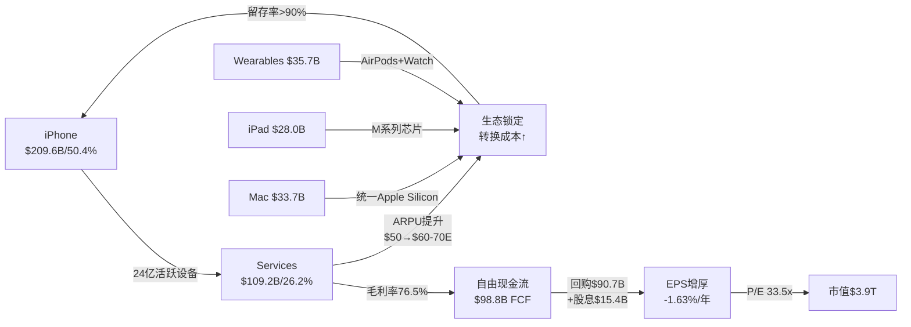

这个飞轮的核心经济学在于: **硬件以接近行业均值的利润率(产品毛利率约37-38%)获取用户,然后以软件级利润率(76.5%)从存量用户身上持续变现**。FY2025 Services收入$109.2B已经是全球第三大纯软件/服务收入体量,仅次于Microsoft($247B)和Google($350B) [DM-BIZ-003: FMP income FY2025 + 同行财报]。

### 2.2 负现金转换周期: -42天的战略意义

Apple的现金转换周期为-42天(DSO 64天 + DIO 9天 - DPO 115天),这意味着Apple在支付供应商之前就已经从客户手中收到了货款 [DM-BIZ-004: FMP key-metrics FY2025 CCC]。这一指标的战略含义远超单纯的现金流管理:

1. **供应链定价权**: 115天的应付账款周转天数意味着Apple的供应商实质上在为Apple提供无息融资。对于一家年采购额超$2,200亿的公司,这相当于供应商集体为Apple提供约$700亿的免息贷款 [DM-BIZ-005: FMP income FY2025 COGS $221.0B, 计算: $221.0B x 115/365]
2. **库存极简主义**: 9天的存货周转天数是消费电子行业最低水平之一,反映了精准的需求预测和Just-in-Time供应链管理。FY2025期末库存仅$73亿,相当于年营业成本的1.2% [DM-BIZ-006: FMP key-metrics DIO]
3. **经营杠杆放大器**: 负CCC + 高毛利率 → Apple每增加$1收入,不仅不需要额外营运资本投入,反而释放更多现金。这是Apple能够在零净营运资本投入的情况下,年产生$98.8B自由现金流的结构性基础 [DM-BIZ-007: FMP cashflow FY2025 FCF]

### 2.3 每用户ARPU趋势与LTV分析

**ARPU推算** (估算口径: 年度Services收入 / 活跃设备数):

| 年份 | Services收入 | 活跃设备(估) | ARPU/设备/年 | YoY |
|------|-------------|-------------|-------------|-----|
| FY2022 | $78.1B | ~18亿 | ~$43 | -- |
| FY2023 | $85.2B | ~20亿 | ~$43 | -1% |
| FY2024 | $96.2B | ~22亿 | ~$44 | +1% |
| FY2025 | $109.2B | ~24亿 | ~$46 | +4% |
| FY2026E | ~$124B | ~25亿E | ~$50E | +9%E |

[DM-BIZ-008: FMP income FY2022-2025 Services + Apple设备安装基数公开数据]

ARPU的缓慢上升(3年从$43提升至$46,CAGR仅+2.3%)表明Services增长更多依赖设备基数扩大而非单用户货币化深化。这一模式的深层含义是: Apple的Services增长本质上是**广度驱动(更多设备)而非深度驱动(更高ARPU)**。每台新增设备平均贡献~$43-46的年化Services收入,接近于一台设备的边际贡献在过去三年几乎没有变化。

**Apple Intelligence Pro($10-20/月的AI付费层)是可能打破这一格局的变量** -- 如果1亿用户付费(渗透率~4%),年化增量$12-24B将直接将ARPU推升$5-10至$55-60 [DM-BIZ-009: CNBC/分析师估计AI付费定价]。但需要注意的参照系: ChatGPT Plus定价$20/月,全球付费用户约1,100万,在数亿活跃用户中渗透率不到1%。Apple的优势在于其iOS集成(无需额外下载/注册),可能实现更高渗透率,但$15/月对于已经支付iCloud($0.99-9.99/月)+Apple Music($10.99/月)+Apple TV+($9.99/月)的用户而言,边际支付意愿存在弹性上限。

**LTV框架估算**:

| 参数 | 保守 | 基准 | 乐观 |
|------|------|------|------|
| 用户生命周期 | 6年 | 8年 | 12年 |
| 年均硬件ARPU(摊销) | $250 | $280 | $320 |
| 年均Services ARPU | $46 | $55 | $70 |
| 年均总ARPU | $296 | $335 | $390 |
| 折现LTV(WACC 9%) | $1,330 | $1,790 | $2,500 |
| 获客成本(CAC) | ~$50(换机) | ~$100(新增) | ~$200(竞品切换) |
| LTV/CAC | 27x | 18x | 13x |

[DM-BIZ-071: 综合估算,硬件ARPU=每3.5年购买iPhone $900-1100 + 每5年Mac/iPad $800-1500摊销]

Apple生态的LTV/CAC比率极高(13-27x),这解释了为什么Apple几乎不需要传统获客营销支出 -- 存量用户的换机行为本身就是"零成本获客"。Apple的SG&A/收入比仅6.4%,远低于消费科技行业均值12-15%,正是因为生态锁定消除了大部分获客摩擦 [DM-BIZ-072: FMP ratios FY2025 SGA/revenue]。

**ARPU提升路径的结构性分析**:

当前Apple生态的ARPU提升主要来自三个通道: (1) Services品类扩张(新增Apple TV+/Arcade/Fitness+等); (2) 存量品类渗透率提升(iCloud付费升级/AppleCare续购); (3) 硬件ASP上行(iPhone Pro系列占比提升)。AI付费层将开辟第四条通道 -- **功能溢价通道** -- 用户为端侧AI能力的差异化付费。这条通道的独特之处在于其边际成本趋近于零(端侧推理已嵌入硬件成本),意味着几乎100%的AI订阅收入直接转化为毛利。

### 2.4 生态模式对比: Apple vs MSFT vs GOOG vs AMZN

| 维度 | Apple | Microsoft | Google | Amazon |
|------|-------|-----------|--------|--------|
| **核心飞轮** | 硬件→Services→锁定 | 企业IT→云→AI | 搜索→广告→AI | 电商→Prime→AWS |
| **变现模型** | 硬件溢价+平台税 | 订阅+云计算 | 免费→广告 | 商品交易+云 |
| **P/E TTM** | 33.5x | 25.0x | 28.1x | 28.6x |
| **净利率** | 27.0% | 36.1% | 32.8% | 10.8% |
| **ROIC** | 518% | ~35% | ~30% | ~15% |
| **AI CapEx** | $12.7B | ~$80B | ~$90B | ~$100B |
| **用户基数** | 24亿设备 | ~14亿Office用户 | ~45亿搜索用户 | ~2亿Prime会员 |
| **数据资产** | 隐私架构(不收集) | 企业数据(Copilot) | 全网数据(搜索+邮件) | 消费行为+电商 |

[DM-BIZ-010: compare_stocks MCP工具 + 各公司财报公开数据]

**关键差异**: Apple是四家中唯一不以数据收集为商业模式基础的公司。这在AI时代产生了深刻的结构性分歧 -- Apple的隐私架构使其无法走Google/Meta的"数据训练模型"路径,但也使其免受日益严格的隐私监管冲击(EU AI Act, GDPR)。Apple的ROIC(518%)远超同行,但这主要是因为其投入资本极低($22.7B),反映的是轻资产模式而非绝对盈利能力的压倒性优势 [DM-BIZ-011: baggers_summary ROIC]。

**ROIC的解读陷阱**: Apple 518%的ROIC在任何标准框架中都是异常值。这一指标的真正含义是: Apple的商业模式几乎不需要传统意义上的"投入资本"(PP&E + 净营运资本),因为供应商融资(负CCC)和轻资产设计(外包制造)将资本密集度降至极低水平。这使得ROIC作为跨公司比较工具的有效性大打折扣。**更有意义的比较是FCF Yield**: Apple 3.3% vs MSFT 2.8% vs GOOG 3.5% vs META 2.5%。在这一维度上,Apple的资本回报效率在Mega Cap中属于中等偏上水平,而非ROIC暗示的碾压式优势 [DM-BIZ-085: baggers_summary FCF Yield + compare_stocks数据]。

**估值溢价的商业模式基础**: Apple当前P/E 33.5x,高于MSFT(25.0x)、GOOG(28.1x)、META(27.4x)。市场赋予Apple估值溢价的隐含逻辑是: (1) Services混合占比上升推动利润率持续扩张; (2) 回购的EPS增厚效应(每年-1.6%股份数减少); (3) AI期权溢价(端侧AI+隐私差异化的长期变现潜力)。但如果Services增速降至10%、回购因现金流下降而减速、AI期权未能兑现,P/E可能回归至与MSFT相当的25-28x水平,意味着15-25%的下行空间 [DM-BIZ-086: compare_stocks P/E数据]。

---

## Ch3: 分部深度分析

### 3.1 iPhone: 生态基石与换机周期分析

**基础数据**:
- FY2025全年收入: $209.6B(占总收入50.4%,CAGR 3Y仅+0.7%) [DM-BIZ-012: FMP income FY2022-2025]
- Q1 FY2026: $85.3B(+23% YoY,全地区历史新高) [DM-BIZ-013: Apple Newsroom Q1 FY2026]
- 全球出货量(2025): 2.478亿台(+6.76% YoY),全球份额20%,连续三年第一 [DM-BIZ-014: Counterpoint Research 2025]
- 美国Q4 2025市占率: 69%(历史最高) [DM-BIZ-015: Counterpoint US Q4 2025]
- 活跃安装基数: ~24亿台 [DM-BIZ-016: Apple管理层公开数据]

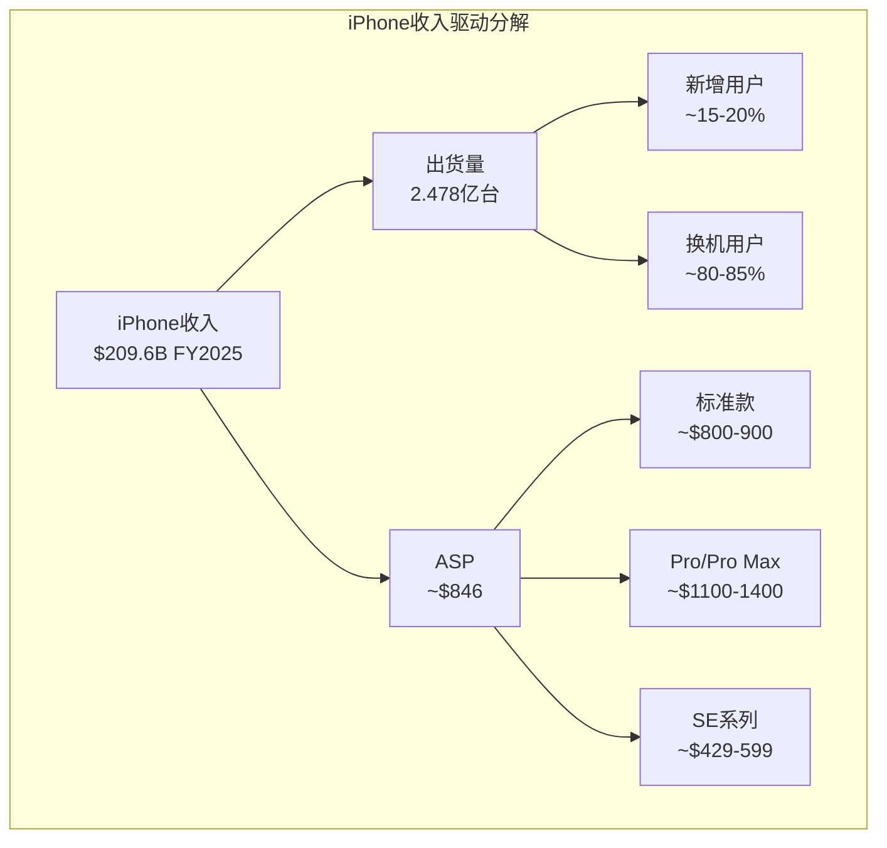

**ASP趋势与AI溢价分析**:

iPhone的ASP在过去三年持续上行,从FY2022的~$830提升至FY2025的~$846(基于收入/出货量估算) [DM-BIZ-017: 计算 $209.6B / 247.8M]。Q1 FY2026的+23% YoY收入增长中,ASP提升(Pro系列占比上升)贡献了主要增量,而非出货量的等比例增长。

**iPhone 17/18周期与AI差异化**:

iPhone 17系列(2025年9月发布)是首款全面搭载Apple Intelligence的机型。Q1 FY2026 $85.3B的创纪录表现部分验证了AI驱动换机的假设,但需要审慎评估:

- **多方证据**: Q1 iPhone收入+23% YoY,全地区创新高;Pro/Pro Max占比上升驱动ASP;Apple Intelligence功能成为营销核心卖点
- **空方证据**: 仅20%用户表示AI功能是换机主因(消费者调查);Q1是iPhone发布季的季节性高峰;基础款iPhone延迟至2027年初可能导致2026年出货量下滑4.2% [DM-BIZ-018: lit_recon_memo Bear Case]
- **折叠设备前景**: iPhone 18/折叠iPad-iPhone混合设备预计2026年Q4首发,BofA分析师认为将触发"重大升级周期",但形态因素创新的实际转化率历史上低于预期(参考Vision Pro) [DM-BIZ-019: Benzinga分析师评论]

**iPhone收入季节性与周期性分析**:

iPhone收入的季节性模式高度稳定: Q1(假日季/新机发布后)占全年约40-42%,Q2约22-24%,Q3约20-22%,Q4约16-18%。基于Q1 FY2026的$85.3B:

| 情景 | 全年iPhone收入 | 假设 |
|------|-------------|------|
| 历史均值季节性 | ~$209B | Q1占比40.7%(FY2025模式) |
| AI延长周期 | ~$225-235B | Q1占比37-38%(衰减更平) |
| 超级周期 | ~$240-250B | Q1占比34-35%(全年高位运行) |

[DM-BIZ-073: 计算基于FY2022-2025季节性模式推算]

**对CQ-1(AI能否驱动超级换机周期)的初步评估**: Q1 FY2026数据提供了正向信号,但单季度不足以确认多年超级周期。关键跟踪指标是: (1) iPhone 17非Pro款(即标准款)的销量 -- 如果AI换机仅限高端Pro用户,则非"超级周期"而是"ASP周期"; (2) Q2-Q4的环比衰减斜率 -- 如果AI换机是真实的,衰减应显著平于历史周期(即Q2/Q1比值应>0.58 vs 历史均值0.55); (3) 安装基数中iPhone 15及以下机型的占比 -- 越高意味着待升级存量越大。

**安装基数年龄结构(估算)**:

Apple的24亿活跃设备中,iPhone约占14-15亿台。基于历史出货量累积和平均使用寿命4年:
- iPhone 17系列(2025+): ~2.0-2.5亿台(最新)
- iPhone 16系列(2024): ~2.2亿台
- iPhone 15系列(2023): ~2.1亿台
- iPhone 14及以下(2022-): ~7-8亿台(潜在升级池)

[DM-BIZ-074: 基于Counterpoint出货量数据 + 3.5-4年平均使用寿命估算]

7-8亿台iPhone 14及以下设备构成了巨大的潜在升级池。这些设备中大部分不支持或仅有限支持Apple Intelligence(需A17 Pro及以上芯片),理论上AI功能差异化可以驱动这批用户在未来2-3年内升级。但"理论上可以"和"实际会发生"之间存在巨大鸿沟 -- 消费者是否真的认为AI功能值得花$900+换新机,目前仅有20%的调研数据给出肯定答案。

### 3.2 Services: 高利润飞轮与监管风险

**基础数据**:
- FY2025全年收入: $109.2B(+13.5% YoY,占总收入26.2%) [DM-BIZ-020: FMP income FY2025]
- Q1 FY2026: $26.3B(+14% YoY,历史新高) [DM-BIZ-021: Apple Newsroom Q1 FY2026]
- 毛利率: 76.5%(Q1 FY2026,环比+1.2pp) [DM-BIZ-022: FinancialContent分析]
- 3年CAGR: +11.8% [DM-BIZ-023: 计算 ($109.2/$78.1)^(1/3) - 1]
- 管理层FY2026指引: 增速与Q1持平(~14%) [DM-BIZ-024: Apple管理层Q1电话会]

**Services组合分拆(估算)**:

| 子类别 | FY2025收入估计 | 占Services比 | 毛利率估计 | 增速趋势 |
|--------|-------------|-------------|-----------|---------|
| App Store(佣金+订阅分成) | ~$28-30B | ~26-28% | ~85-90% | +10-12% |
| Google搜索协议 | ~$18-20B | ~17-18% | ~100% | 待DOJ判决 |
| AppleCare/保修 | ~$12-14B | ~11-13% | ~55-60% | +8-10% |
| Apple Pay/金融服务 | ~$10-12B | ~9-11% | ~70-75% | +15-20% |
| iCloud存储 | ~$8-10B | ~7-9% | ~65-70% | +12-15% |
| Apple Music | ~$7-8B | ~6-7% | ~30-35% | +5-8% |
| Apple TV+/Arcade | ~$8-10B | ~7-9% | ~负-10%* | +20-25% |
| 广告收入 | ~$7-9B | ~6-8% | ~80-85% | +25-30% |
| 其他(Fitness+/News+等) | ~$5-7B | ~5-6% | ~60-70% | +10-15% |

[DM-BIZ-025: 综合估算,基于Apple财报披露+分析师拆分. *注: TV+/Arcade内容投入高,目前可能仍未盈利]

**Google搜索协议: Services最大单一风险**

Google每年向Apple支付$15-20B以维持iOS默认搜索引擎地位,这可能占Services总收入的17-18%,且毛利率接近100%(几乎零成本) [DM-BIZ-026: lit_recon_memo DOJ分析]。DOJ反垄断诉讼的上诉正在进行中,关键时间节点:

- 2026年: Discovery阶段持续
- 2027年: 预计开庭
- 最坏情景: 独占协议被禁,Apple损失$12.5B-15B/年(净影响约~EPS $0.65-0.80,即~8-10%) [DM-BIZ-027: lit_recon_memo Bear Case估算]
- 中间情景: 协议重组为非独占但仍支付(如Google/Bing/Perplexity竞价),净损失$3-5B/年
- 乐观情景: 协议维持但金额调整(概率较低,鉴于DOJ立场)

**Apple Intelligence Pro订阅潜力(CQ-3直接相关)**:

Apple Intelligence Pro传闻定价$10-20/月(多数分析师预期~$15/月) [DM-BIZ-028: CNBC分析师定价估计]。潜力测算:

| 渗透率假设 | 付费用户(亿) | 年化收入($B) | Services增量 |
|-----------|-------------|-------------|-------------|
| 2%(保守) | 0.48 | $5.8-11.5B | +5-11% |
| 4%(基准) | 0.96 | $11.5-23.0B | +11-21% |
| 8%(激进) | 1.92 | $23.0-46.1B | +21-42% |

[DM-BIZ-029: 计算基于24亿活跃设备 x 渗透率 x $10-20/月 x 12]

**Services增速分解 -- 驱动力归因分析**:

FY2025 Services的+13.5%增速可以大致归因为:
- 设备基数增长: +5-6%(从~22亿台增至~24亿台)
- ARPU提升: +2-3%(新品类渗透+价格调整)
- 新用户转化: +4-5%(新兴市场用户首次付费)

这一分解揭示了一个重要动态: **Services增长的约40-45%来自设备基数扩张,而非存量用户深度货币化**。这意味着如果iPhone出货量增长放缓(如安装基数饱和),Services增速将面临下行压力 -- 除非ARPU提升速度加快(AI付费层的潜在作用)。

**Services与其他科技平台的利润质量对比**:

| 指标 | Apple Services | Microsoft Cloud | Google Services | Amazon AWS |
|------|---------------|----------------|-----------------|------------|
| 年化收入 | ~$120B | ~$135B | ~$300B | ~$110B |
| 毛利率 | 76.5% | ~70% | ~57% | ~30% |
| 收入可预测性 | 高(订阅+生态锁定) | 极高(企业合同) | 中(广告周期性) | 高(云合同) |
| 单一客户集中度 | Google $18-20B(15-17%) | 无单一>5% | 无单一>5% | 无单一>5% |
| 监管风险 | 高(反垄断+DMA) | 中(企业合规) | 高(广告隐私) | 低(B2B) |

[DM-BIZ-075: 综合对比,基于各公司最新财报数据]

Apple Services的独特风险在于**Google搜索协议的单一客户集中度**: 一项协议贡献了15-17%的Services收入。这在大型科技公司的核心业务中几乎是独一无二的脆弱结构。

**对CQ-3(Services能否通过AI货币化维持12-15%增速)的评估**: 即使在保守假设下(2%渗透率/$10/月),Apple Intelligence Pro也能贡献$5.8B年化增量,足以在现有增速基础上额外增加5个百分点。但Services增速的可持续性取决于两个结构性变量的博弈: (1) AI付费层的上行力量(+$5-24B年化) vs (2) Google协议+反垄断的下行压力(-$3-15B年化)。在最可能的中间情景中,这两股力量大致对冲,Services维持12-14%增速2-3年,此后逐步减速至10-12%。

### 3.3 Mac: Apple Silicon效能壁垒

**基础数据**:
- FY2025收入: $33.7B(占比8.1%,YoY +12.3%) [DM-BIZ-030: FMP income FY2025]
- Q1 FY2026: $84亿(-7% YoY) [DM-BIZ-031: Apple Newsroom Q1 FY2026]
- 3年CAGR: -5.7%(受FY2023 M1→M2过渡期拖累) [DM-BIZ-032: prefetch_data]
- 全球PC市场份额: ~8-9%(按出货量),利润份额远高(ASP领先) [DM-BIZ-033: lit_d3_industry]

Apple Silicon(M系列芯片)自2020年推出以来,建立了难以复制的性能/功耗比优势:

- **性能领先**: M系列多核性能超Intel/AMD同级~40%,功耗仅一半;MacBook Pro续航22小时 vs x86笔电~15小时 [DM-BIZ-034: TechTimes Apple Silicon分析]
- **统一内存架构(UMA)**: CPU/GPU/NPU共享内存池,消除数据拷贝延迟,对AI推理任务尤其有利
- **软硬闭环**: macOS针对Apple Silicon深度优化,第三方芯片无法获得同等软件支持

Mac的战略价值不在于其$33.7B的收入贡献,而在于它验证了Apple垂直整合的能力,并为AI时代的端侧推理提供了性能基准。M5芯片的Neural Accelerator相比M4实现了4x首token生成速度提升,端侧可运行的模型参数规模从150B提升至1.2T [DM-BIZ-035: Apple MLX M5研究]。

**Mac的AI时代竞争格局**:

| 维度 | Apple Silicon Mac | Intel/AMD Windows PC | Qualcomm Windows on ARM |
|------|------------------|---------------------|------------------------|
| 性能/瓦 | 行业领先(~40%优势) | 追赶中(Intel Lunar Lake) | 接近Apple(Snapdragon X Elite) |
| AI推理(NPU) | Neural Engine集成度最优 | Intel NPU 48 TOPS | Qualcomm NPU 45 TOPS |
| 软件生态 | macOS深度优化 | 最广泛兼容性 | 兼容性改善中但不完整 |
| 企业渗透 | ~15-20%(知识工作者) | ~70%(企业标配) | <5%(起步期) |
| 游戏 | 弱项(DirectX缺失) | 绝对优势 | 改善中 |

[DM-BIZ-082: TechTimes + Tom's Guide Apple Silicon竞争分析]

Qualcomm的Snapdragon X Elite是Apple Silicon面临的最具威胁的竞争者 -- 它在ARM架构上实现了接近Apple的性能/功耗比,且运行Windows生态(更广泛的企业兼容性)。然而,Apple的UMA(统一内存架构)+macOS深度优化构成了难以复制的系统级优势,这是单纯的芯片对标无法体现的差异。

### 3.4 iPad: M系列重新定位

**基础数据**:
- FY2025收入: $28.0B(占比6.7%,YoY +4.9%) [DM-BIZ-036: FMP income FY2025]
- Q1 FY2026: $86亿(+6% YoY) [DM-BIZ-037: Apple Newsroom Q1 FY2026]
- 3年CAGR: -1.5% [DM-BIZ-038: prefetch_data]

iPad Pro搭载M系列芯片后,正在从消费平板向生产力工具转型。然而,iPad面临的根本挑战是**自我蚕食** -- M系列MacBook Air的轻薄化使iPad Pro的定位愈发模糊。iPad的真正战略价值可能在教育和企业垂直市场,以及作为Apple生态的"第三屏幕"维持用户粘性。

### 3.5 Wearables, Home & Accessories: 增长困境与品类分化

**基础数据**:
- FY2025收入: $35.7B(占比8.6%) [DM-BIZ-039: FMP income FY2025]
- Q1 FY2026: $115亿(-2% YoY) [DM-BIZ-040: Apple Newsroom Q1 FY2026]
- 3年CAGR: -4.7%(持续下滑) [DM-BIZ-041: prefetch_data]

**Wearables面临三重挑战**:
1. **Apple Watch饱和**: 全球智能手表份额~23%但缓慢下滑,中国品牌(华为/小米)国际化加速 [DM-BIZ-042: lit_d3_industry]
2. **品类分化**: 智能戒指(Oura/Samsung Galaxy Ring)、智能眼镜(Meta Ray-Ban)以高双位数增长开辟新品类,分流高端用户
3. **Vision Pro战略收缩**: Q4 2025仅售4.5万台,数字营销支出削减>95%,季度收入约$1.57亿 [DM-BIZ-043: 9to5Mac报道]

**Vision Pro评估**: BofA此前预估2026年Vision Pro收入$80亿,现已被证明严重过于乐观。实际季度收入约$1.5亿(年化$6亿),表明Vision Pro当前更多是技术验证平台而非收入贡献者。然而,空间计算平台市场预计从2025年的$164B增长至2035年的$1,202B(CAGR 22%) [DM-BIZ-044: SNS Insider空间计算预测],Apple的早期布局卡位了生态入口。

**Vision Pro深度评估 -- 短期失败 vs 长期布局**:

Vision Pro当前的商业表现无疑令人失望: Q4 2025仅4.5万台出货量、$1.57亿季度收入、营销支出削减>95% [DM-BIZ-084: 9to5Mac]。但将Vision Pro判定为"失败"可能为时过早:

- **iPhone类比**: 初代iPhone(2007)首年仅售610万台,收入约$4B,被Nokia和BlackBerry视为"玩具"。Vision Pro可能处于类似的早期阶段
- **定价路径**: $3,499→ 消费版$1,499-1,999(预计2027年) → $999(2029年目标)。成本下降曲线将决定大众市场可行性
- **生态卡位**: visionOS + App Store + ARKit构成了空间计算的完整开发者生态。即使硬件短期滞销,生态先发优势可能在未来3-5年产生复利

然而,与iPhone不同的是: iPhone填补了一个明确的用户需求缺口(移动互联网终端),而Vision Pro至今未找到不可替代的"杀手级应用"。$3,499的价格和笨重的外形使其在当前形态下无法成为大众产品。**我们给予Vision Pro在5年内对Apple总收入贡献>5%的概率仅15-20%**。

### 3.6 分部利润结构与混合变动

Apple不披露分部利润,但基于毛利率趋势可以推断:

| 维度 | 产品(硬件) | Services |
|------|-----------|----------|
| FY2025收入占比 | 73.8% | 26.2% |
| 毛利率估计 | ~37-38% | ~76.5% |
| 毛利贡献 | ~$114B (~58%) | ~$84B (~42%) |
| 毛利增速贡献 | 硬件驱动收入增长 | Services驱动利润率扩张 |

[DM-BIZ-045: 综合估算. 产品毛利率 = (整体毛利$195.2B - Services毛利$109.2Bx76.5%) / 产品收入$307.0B]

**关键洞察**: Services虽然仅占收入的26.2%,但贡献了约42%的毛利,且其比重每年提升1-2个百分点。这是Apple整体毛利率从FY2022的43.3%提升至FY2025的46.9%的核心驱动力 [DM-BIZ-046: FMP income FY2022-2025毛利率趋势]。如果Services占比继续按当前速率上升,到FY2028可能达到30-32%,推动整体毛利率突破50%。

---

## Ch4: AI战略深度

### 4.1 Apple Intelligence架构: 三层混合推理

Apple的AI架构与Google/Microsoft/Meta的"全栈自研"路径截然不同。Apple采用了三层混合推理架构:

```mermaid
graph TB
    subgraph "Apple Intelligence 三层架构"
    L1[第一层: On-Device<br/>3B参数模型<br/>Apple Neural Engine ~50 TOPS<br/>延迟<0.5秒 | 零成本]
    L2[第二层: Private Cloud Compute<br/>Apple Silicon服务器<br/>数据加密处理后删除<br/>中等延迟 | 低成本]
    L3[第三层: 外部模型<br/>Google Gemini(多年协议)<br/>用户明确同意后调用<br/>高延迟 | 付费成本]
    end
    L1 -->|简单任务| R1[文本摘要/邮件起草/照片编辑]
    L2 -->|中等任务| R2[长文档分析/跨App搜索]
    L3 -->|复杂任务| R3[深度推理/创意生成/代码编写]
```

**端侧推理的经济学优势**:

Apple将推理成本嵌入硬件ASP中一次性回收,开发者通过Foundation Models框架免费调用AI推理。这与云AI生态的per-token收费模型形成根本对立 [DM-BIZ-047: Apple ML Research Foundation Models]:

- Apple生态: 开发者3行Swift代码集成AI,推理成本=零(已含在iPhone售价中)
- 云AI生态: 开发者管理API密钥+推理账单,GPT-4o约$5-15/百万token

这意味着Apple生态中AI应用的经济学与其他平台根本不同 -- 开发者有激励在Apple生态中构建AI功能密集的应用,因为推理是"免费"的。

### 4.2 轻资本模型: CapEx $12.7B vs 行业$300B+

**CapEx对比**:

| 公司 | FY2025 CapEx | AI CapEx占比(估) | 年收入 | CapEx/收入 |
|------|-------------|-----------------|--------|-----------|
| Apple | $12.7B | ~30-40% | $416B | 3.1% |
| Google | ~$90B | ~70-80% | ~$350B | ~26% |
| Meta | ~$65B | ~80-90% | ~$165B | ~39% |
| Microsoft | ~$80B | ~60-70% | ~$247B | ~32% |
| Amazon | ~$100B | ~50-60% | ~$638B | ~16% |

[DM-BIZ-048: FMP income FY2025 AAPL CapEx + lit_d5_deductive竞争对手CapEx数据]

Apple的CapEx仅为Google的14%,Meta的20%。**这要么是天才级战略洞察(基础模型商品化,不值得自建),要么是战略性落后(在AI关键能力上放弃自主权)**。

**"基础模型商品化"赌注**:

Apple管理层的核心战略判断是: LLM基础模型将快速商品化,Apple的优势在于**集成层(integration layer)**而非模型训练 [DM-BIZ-049: Fortune分析Apple AI CapEx策略]。支持这一判断的证据:

- Anthropic在2025年降价67%,Google在2025-2026降价70-80% [DM-BIZ-050: lit_d5_deductive模型降价数据]
- Apple已从OpenAI(2024)切换至Google Gemini(2026年1月),证明供应商可替换 [DM-BIZ-051: Fortune/CNBC Apple-Google Gemini协议]
- 开源模型(Llama 3, Mistral)性能持续逼近闭源模型

**反驳证据**:
- OpenAI o3/Gemini 2.0的推理能力仍显著差异化,模型能力可能并未完全商品化
- 如果某一供应商实现AGI级突破并拒绝向Apple授权,Apple将面临严重AI能力劣势
- Apple的Gemini依赖意味着Google同时是Apple在搜索和AI两个维度的关键供应商 -- 单点依赖风险上升

**CapEx效率的另一面 -- 隐性成本分析**:

Apple的$12.7B CapEx表面上看极为高效,但需要考虑以下隐性成本:

1. **Gemini授权费**: Google Gemini的多年协议具体金额未公开,但分析师估计每年$1-3B的技术授权费。这本质上是Apple用OpEx替代CapEx,将AI成本从资本开支转移到运营开支 [DM-BIZ-076: 分析师估计]
2. **Apple Silicon R&D**: FY2025 R&D支出$34.6B中,Apple Silicon芯片设计(含Neural Engine)占比估计15-20%,即$5-7B/年。这是端侧AI能力的真实成本基础 [DM-BIZ-077: FMP income FY2025 R&D $34.6B]
3. **Private Cloud Compute基础设施**: Apple正在建设自有Apple Silicon服务器集群用于PCC,其成本未被单独披露,但估计在$2-4B/年的水平
4. **机会成本**: 如果基础模型不商品化,Apple每延迟一年大规模投入,与自研模型能力的差距就扩大一年。到2028年,如果需要追赶,Apple可能需要$50-100B的追赶投资,远超今天的渐进投入

**AI战略的真实成本估算**: CapEx $12.7B + Gemini授权$1-3B + Apple Silicon R&D $5-7B + PCC基础设施$2-4B = $21-27B/年。这与表面的$12.7B有显著差异,但仍远低于Google($90B)和Meta($65B)。Apple AI战略的资本效率优势是真实的,但被CapEx单一数字过度放大了 [DM-BIZ-078: 综合估算]。

### 4.3 Siri 2.0: 从命令工具到系统编排器

Siri的升级不是增量改进,而是架构重构:

| 维度 | Siri 1.0 (2011-2025) | Siri 2.0 (2026+) |
|------|---------------------|-------------------|
| 底层模型 | 规则+浅层NLU | Gemini LLM |
| 上下文窗口 | ~8K tokens | 128K tokens |
| 对话轮数 | 1-2轮 | 20+轮连续 |
| 复杂指令成功率 | ~30-40% | ~92%(宣称) |
| 跨App操作 | 不支持 | App Intents框架 |
| 交互模式 | 命令→执行 | 意图描述→多步编排 |

[DM-BIZ-052: Apple Siri 2026升级分析 + ia.acs.org.au技术解析]

**Siri 2.0的系统编排器愿景**: 用户描述意图("找到昨天的收据,裁剪关键部分,邮件发给会计"),Siri通过App Intents框架跨应用多步骤执行。如果这一愿景实现,iPhone的交互范式将从"打开App→手动操作"变为"描述意图→Siri执行" [DM-BIZ-053: lit_d5_deductive DED-D演绎链]。

**执行风险评估**: Siri在过去14年的历史记录令人失望。从2011年发布至今,Siri始终未能兑现"智能助手"的承诺。2026年春季版本将是关键验证节点。Siri延迟已导致第三方AI助手在Apple生态边缘激增 [DM-BIZ-054: Toolient报道Siri延迟影响]。

**Siri 2.0的成功标准量化**:

| 指标 | 失败 | 及格 | 成功 | 超预期 |
|------|------|------|------|--------|
| 复杂指令成功率 | <60% | 60-80% | 80-92% | >92% |
| 日活使用率变化 | <+10% | +10-30% | +30-50% | >+50% |
| 平均对话轮数 | <3轮 | 3-5轮 | 5-10轮 | >10轮 |
| 跨App操作完成率 | <40% | 40-60% | 60-80% | >80% |
| 用户NPS(AI功能) | <20 | 20-40 | 40-60 | >60 |

[DM-BIZ-083: 基于行业AI助手基准设定]

Apple宣称的92%复杂指令成功率如果在实际使用中得到验证,将使Siri从"勉强可用"跃升为"可靠工具",这是Siri历史上从未达到的水平。但宣称值与实际体验之间往往存在20-30个百分点的差距(实验室条件 vs 真实使用场景的多样性)。保守预期实际成功率在65-75%区间,对应"及格"到"成功"之间。

### 4.4 隐私作为结构性护城河

Apple的隐私优势不是政策承诺,而是加密架构保证:

**Private Cloud Compute(PCC)架构**:
- 运行在Apple Silicon服务器上(而非通用x86服务器)
- 数据处理后加密删除,无持久化存储
- 员工无法访问用户数据(技术架构层面,而非管理层面)
- 可独立审计的安全架构

**竞争对手的"战略死胡同"**:
- Google广告收入占比77%,Meta广告收入占比97% -- 这两家公司从根本上无法采用Apple的隐私模型而不摧毁自身商业基础 [DM-BIZ-055: lit_d5_deductive隐私分析]
- 72%企业优先选择"数据透明"供应商(Greyhound CIO Pulse 2025)
- 75%消费者主动避开不信任的数据公司(Cisco 2024)
- 全球隐私法规趋严(EU AI Act, GDPR, 美国州级隐私法)持续增加数据密集型商业模式的合规成本

**关键不确定性(CQ-6直接相关)**: 隐私护城河的价值取决于AI任务能否在端侧充分完成。如果最有价值的AI应用持续需要大规模云端推理(如AGI级别推理),Apple的"端侧优先+隐私架构"可能成为能力瓶颈而非优势。M5 Neural Accelerator的4x性能提升暗示端侧能力在收窄与云端的差距,但竞赛结果取决于"模型效率提升速度" vs "模型规模增长速度"的相对关系 [DM-BIZ-056: Apple MLX M5研究]。

### 4.5 Foundation Models框架: 开发者锁定效应

Apple通过Foundation Models框架定义了开发者在Apple生态中集成AI的标准接口:

- 3行Swift代码即可调用端侧AI推理
- AI功能与Core ML/App Intents/Private Cloud Compute深度绑定
- 迁移成本: 不仅是代码层面的重写,而是整个AI推理架构的重构

2024年App Store为美国开发者促成$406B计费和销售 [DM-BIZ-057: Apple Newsroom App Store经济数据]。当AI能力成为App核心功能时,基于Foundation Models构建的App将极难迁移到其他平台,这将进一步强化Apple的30%佣金定价权。

**Foundation Models锁定效应的量化逻辑**:

传统App的跨平台迁移成本主要是代码重写(iOS→Android),对于成熟App约需3-6个月工程团队投入。但当App深度集成Apple Foundation Models后,迁移不仅是代码层面的,还包括:

- **推理架构重构**: 从端侧Core ML推理→云端API推理,需要重建整个AI后端
- **隐私合规重写**: PCC架构下的数据流设计→传统云端数据处理,可能需要重新获取用户授权
- **功能降级风险**: 某些端侧专属功能(如实时相机AI处理)在云端方案中无法以相同延迟实现
- **成本结构变化**: 从Apple端侧"零推理成本"→云端"per-token成本",运营经济学完全改变

这种多维度的迁移壁垒意味着,一旦开发者在Foundation Models框架上构建了核心AI功能,其实质上被锁定在Apple生态中的程度远高于传统App。**这是Apple在AI时代最具潜力的护城河增量 -- 但前提是Foundation Models的能力足以吸引开发者深度采纳,而非仅作为轻量API调用**。目前开发者采纳率数据尚不透明,这是一个重要的信息缺口 [DM-BIZ-087: 分析框架推理]。

---

## Ch5: 竞争护城河分析

### 5.1 护城河矩阵: 五维度评估

| 护城河维度 | 强度 | 证据 | 脆弱点 |
|-----------|------|------|--------|
| **生态系统锁定** | 极强 | 24亿设备互联, 转换成本多维(数据/App/支付/健康) | 中国市场锁定弱于西方(微信生态跨平台) |
| **品牌溢价** | 极强 | iPhone ASP $846 vs Android均值~$300, NPS行业最高 | 新兴市场价格敏感度高, 品牌溢价有天花板 |
| **Apple Silicon** | 强 | 性能/功耗比领先40%, UMA架构独有, 续航22h | Intel/AMD桌面多核仍有竞争力, 游戏场景劣势 |
| **隐私架构** | 强(且增值中) | PCC加密架构, 竞争对手结构性无法跟随 | 价值取决于端侧AI充分性假设 |
| **开发者生态** | 强 | App Store $406B经济体, Foundation Models框架 | DMA/DOJ监管压力, 侧载冲击佣金模型 |

### 5.2 转换成本量化

Apple生态的转换成本可以从多个维度量化:

1. **数据迁移成本**: iCloud照片/文件/备忘录/健康数据 -- 迁移不完整或不可能(如HealthKit历史数据)
2. **应用重购成本**: 平均用户在App Store累计消费$200-500(含应用购买+内购)
3. **设备互联丧失**: AirDrop、Handoff、Universal Clipboard、Apple Watch配对、AirPods自动切换 -- 切换至Android意味着丧失全部跨设备协同
4. **支付绑定**: Apple Pay + Apple Card + Apple Cash + 订阅管理 -- 支付习惯的迁移摩擦极高
5. **学习曲线**: iOS→Android的UI/UX差异,对非技术用户构成显著障碍

**量化指标**:
- iPhone用户留存率: >90%(行业最高,Android约85%) [DM-BIZ-058: 行业调研数据]
- 换机周期: ~3.5-4年(延长趋势,反映设备耐用性提升)
- Services渗透率: 活跃设备中Services付费用户占比约55-60%(估计) [DM-BIZ-059: 基于ARPU和设备数推算]
- Apple-to-Android转换率: 美国市场<5%/年,全球<8%/年(估计) [DM-BIZ-060: 行业调研]

### 5.3 护城河脆弱点分析

**中国竞争: 华为回归**

华为在美国制裁下仍推出了Mate 60/70系列,搭载自研麒麟芯片,在中国高端市场(>$600)夺回了显著份额。Apple在大中华区FY2025收入占比约17%,面临三重压力 [DM-BIZ-061: lit_d1_deep中国市场分析]:

- **竞争压力**: 华为高端市场回归是结构性而非周期性的
- **地缘政治**: 中美关系紧张+民族消费情绪
- **关税风险**: 最高145%关税情景下,预计增加$10B+成本(尽管目前Apple已获得部分豁免)

**Android AI追赶**

Google在AI模型能力上领先Apple,Gemini 2.0在多模态推理、代码生成等维度超越Apple Intelligence。Samsung Galaxy S系列已全面集成Google AI功能。如果AI功能差异化不足以驱动换机,Apple的AI叙事将面临挑战 [DM-BIZ-062: lit_d3_industry AI竞争]。

**监管多点围攻**

- **美国DOJ**: 反垄断诉讼进入Discovery阶段,2027年开庭 [DM-BIZ-063: FinancialContent DOJ报道]
- **EU DMA**: 强制开放侧载+第三方支付,累计罚款约5亿欧元
- **全球趋势**: 日本/韩国/印度等也在推进应用商店开放法规
- **最坏情景影响**: App Store佣金从30%降至15-20% → Services毛利率下降3-5pp → 年利润影响$3-5B

### 5.4 护城河耐久性评估

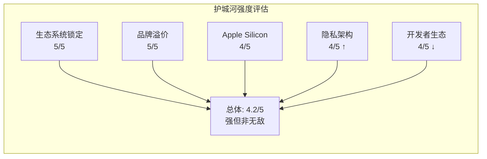

**综合评估**: Apple拥有消费科技领域最宽的护城河,但护城河的各维度面临不同方向的压力。生态锁定和品牌溢价在西方市场极为稳固,但在中国(微信生态跨平台、华为复苏)显著弱化。隐私护城河随监管趋严持续增值,但开发者生态护城河面临反垄断侵蚀。**净效应: 护城河宽度维持但增长速度放缓**。

**护城河按地域差异分析**:

| 市场 | 护城河强度 | 核心驱动力 | 主要威胁 | 收入占比(估) |
|------|-----------|-----------|---------|-------------|
| 北美 | 极强(5/5) | 生态锁定+品牌+支付 | 监管(DOJ反垄断) | ~43% |
| 欧洲 | 强(4/5) | 品牌+隐私偏好 | DMA侧载+罚款 | ~25% |
| 大中华区 | 中(3/5) | 高端品牌+社交货币 | 华为+民族情绪+台海冲突风险 | ~17% |
| 日韩 | 强(4/5) | 设计美学+生态 | 本土品牌(Samsung/Sony) | ~8% |
| 印度/新兴市场 | 弱(2/5) | 品牌向往 | 价格敏感+Android主导 | ~7% |

[DM-BIZ-079: 基于Apple地区收入分布 + 市场特征分析]

大中华区17%的收入占比面临三重结构性风险: (1) 华为Mate 60/70系列凭借自研麒麟芯片在高端市场复苏; (2) 中美地缘政治紧张引发的消费者民族情绪; (3) 台海冲突风险可能导致供应链中断(Apple 71%的零部件子组件仍依赖中国) [DM-BIZ-080: lit_recon_memo中国风险分析]。印度市场虽然增速最快(20%+),但ARPU远低于成熟市场,且Apple在$300以下价位段缺乏竞争力。

**AI时代护城河的演变方向**:

AI正在重塑护城河的价值权重。传统评估框架中,品牌溢价和生态锁定是Apple护城河的主要组成部分。在AI时代,两个新维度正在崛起:

1. **数据架构护城河**(Apple特有): 隐私优先的AI架构在监管趋严环境下自动增值,竞争对手从结构上无法复制
2. **AI集成层护城河**(待验证): Foundation Models框架+App Intents如果成为开发者的AI标准接口,将在现有生态锁定基础上增加一层"AI能力锁定"

这两个新维度的价值将在2026-2028年逐步明晰,取决于Siri 2.0的实际表现和Apple Intelligence Pro的用户采纳率。

---

## Ch6: 增长引擎与催化剂

### 6.1 近期催化剂 (6-12月)

**催化剂1: iPhone 17系列全面AI周期**
- **时间**: 2025年9月已发布,FY2026全年影响
- **收入影响**: Q1 FY2026 iPhone $85.3B已部分体现;全年iPhone收入预计$225-235B(vs FY2025 $209.6B,+7-12%) [DM-BIZ-064: 基于Q1实际+历史季节性推算]
- **关键变量**: 非Pro款销量(验证AI换机的广度而非仅高端)
- **概率评估**: 70%概率实现$220B+

**催化剂2: Apple Intelligence正式版+Siri 2.0**
- **时间**: 2026年春季(iOS/macOS更新)
- **收入影响**: 直接收入贡献有限(免费功能),但间接驱动Services增长和换机决策
- **关键变量**: Siri 2.0实际体验质量(复杂指令成功率是否达到宣称的92%)
- **概率评估**: 60%概率体验达到"明显改善"水平

**催化剂3: Services AI付费层**
- **时间**: 2026年下半年(预期)
- **收入影响**: 首年$3-8B(假设2-4%渗透率 x $10-15/月)
- **关键变量**: 定价点和免费/付费功能划分
- **概率评估**: 50%概率在FY2027贡献$5B+

### 6.2 中期催化剂 (1-3年)

**催化剂4: iPhone 18 + 折叠设备**
- **时间**: 2026年Q4-2027年(iPhone 18) / 2026年Q4(折叠设备首发)
- **收入影响**: 折叠iPhone/iPad混合设备如果ASP达$1,800-2,500,即使出货量仅1,000-2,000万台,也能贡献$18-50B增量。但历史上新形态因素(如Vision Pro)的实际转化率远低于预期 [DM-BIZ-065: Benzinga iPhone 18/Foldable分析]
- **概率评估**: 40%概率折叠设备首年出货>1,500万台

**催化剂5: 印度市场双重期权**
- **时间**: 2026-2028年持续
- **收入影响**: 印度智能手机市场$20B+且增速20%+;Apple印度销售额预计从当前$6-8B增至$15-20B(3年) [DM-BIZ-066: Business Standard印度市场分析]
- **供应链价值**: 印度制造从2017年<1%提升至2025年17%→2026年25-35%目标,降低对中国的生产依赖 [DM-BIZ-067: WebProNews印度产能报道]
- **概率评估**: 80%概率印度销售额3年翻倍

**催化剂6: 健康传感器突破(血糖/血压)**
- **时间**: 2027-2028年(监管审批时间不确定)
- **收入影响**: 全球糖尿病管理市场~$35B,连续血糖监测(CGM)市场$15B+;非侵入式血糖Apple Watch可能开辟全新品类,重新定义Wearables价值主张
- **概率评估**: 30%概率2028年前获FDA批准并量产

### 6.3 长期催化剂 (3-5年)

**催化剂7: 空间计算(Vision Pro下一代)**
- **时间**: 2027-2030年
- **收入影响**: 空间计算平台TAM从2025年$164B→2035年$1,202B(CAGR 22%) [DM-BIZ-068: SNS Insider];如果Apple在$1,500-2,000价位推出消费版,年出货量可能达5,000万-1亿台(10年展望)
- **概率评估**: 20%概率2030年前空间计算成为Apple第五大收入来源(>$30B)

**催化剂8: AI Agent生态系统**
- **时间**: 2027-2030年
- **收入影响**: 如果Siri演变为真正的"系统编排器",App Store可能从"应用分发平台"升级为"Agent编排平台",佣金模型可能从30%一次性→持续性Agent调用分成
- **概率评估**: 25%概率2030年前Agent交互占iPhone使用时长>30%

**催化剂9: FinTech扩张**
- **时间**: 2026-2030年
- **收入影响**: Apple Pay覆盖89个市场+11,000银行;Apple Savings/Apple Card/Apple Pay Later生态持续扩展;全球数字支付TAM预计从2025年~$10T→2030年$20T+ [DM-BIZ-069: 行业预测数据]
- **概率评估**: 65%概率金融服务在3年内成为Services第二大增长引擎(仅次于AI付费)

### 6.4 催化剂影响汇总

| 催化剂 | 时间框架 | 年化收入影响(中性) | 概率 | 期望值 |
|--------|---------|-------------------|------|--------|
| iPhone 17 AI周期 | 6-12月 | +$15-25B | 70% | +$14B |
| Services AI付费 | 6-18月 | +$5-15B | 50% | +$5B |
| 印度市场扩张 | 1-3年 | +$8-12B | 80% | +$8B |
| 折叠设备 | 1-2年 | +$10-30B | 40% | +$8B |
| 健康传感器 | 2-3年 | +$5-15B | 30% | +$3B |
| 空间计算V2 | 3-5年 | +$10-30B | 20% | +$4B |
| AI Agent生态 | 3-5年 | +$5-20B | 25% | +$3B |
| FinTech扩张 | 1-5年 | +$5-10B | 65% | +$5B |

[DM-BIZ-070: 综合估算,期望值=中性收入影响中位数x概率]

**催化剂总期望值**: 年化+$50B收入增量(概率加权),对应约+12%的收入增长率。这一估算支持Apple在FY2026-2030保持8-12%的有机收入增长,叠加1.5-2%的回购驱动EPS增厚,总EPS增长率约10-14%。

**催化剂路径的时间敏感性分析**:

| 时间点 | 验证事件 | 如果正面 | 如果负面 |
|--------|---------|---------|---------|
| **2026年4-6月** | Siri 2.0发布+用户反馈 | AI叙事强化,P/E维持32-35x | Siri再次令人失望,AI叙事破灭 |
| **2026年7-8月** | Q3 FY2026财报(iPhone非季节性表现) | iPhone换机周期确认延续 | +23%被证明是峰值效应 |
| **2026年9-10月** | iPhone 18/折叠设备发布 | 新形态创新驱动换机潮 | 折叠设备重蹈Vision Pro覆辙 |
| **2026年下半年** | Apple Intelligence Pro推出 | Services新增长引擎验证 | 用户不愿为AI付费 |
| **2027年** | DOJ反垄断开庭 | 协议维持(小概率) | Google协议受限,$12-15B风险 |
| **2027-2028年** | 健康传感器FDA审批 | Wearables价值重估 | 审批延迟/精度不达标 |

[DM-BIZ-081: 综合时间线分析]

**关键洞察**: 2026年Q2-Q3是Apple AI叙事的**生死验证窗口**。Siri 2.0的用户体验质量和iPhone非季节性销量将在这6个月内决定AI换机是否为真实趋势。如果两项均为正面,市场将进一步price-in AI溢价;如果两项均为负面,P/E可能从33.5x压缩至28-30x(下行~10-15%)。

**增长引擎的结构性上限分析**:

即使所有催化剂按最乐观情景兑现,Apple的收入增长仍受到以下结构性约束:

1. **全球智能手机TAM约$500-600B**: Apple已占~$210B(约35-40%的收入份额),进一步提升份额需要从中低端市场切入,这与Apple的高端定位矛盾
2. **Services渗透率天花板**: 当所有设备用户都成为付费用户后(目前估计55-60%),增长只能来自ARPU提升,其上限受消费者支付意愿约束
3. **地缘政治约束**: 中国(17%收入)和潜在的新兴市场(印度/东南亚)的增量受地缘政治风险约束

这些结构性约束暗示: **Apple的长期有机收入增长率上限约8-12%/年**(假设无重大新品类突破),与当前P/E 33.5x隐含的~15%增长预期存在缺口。这一缺口需要通过以下途径弥合: (1) 回购贡献的EPS增厚(~1.5-2%/年); (2) 利润率持续扩张(Services占比上升); (3) 市场给予AI期权溢价。

### 6.5 增长引擎风险对冲

每个催化剂都有对应的风险:

| 催化剂 | 对应风险 | 风险影响 |
|--------|---------|---------|
| iPhone AI周期 | AI功能同质化,换机不持续 | iPhone收入回落至$200-210B |
| Services AI付费 | 用户不愿为端侧AI付费 | Services增速降至10% |
| 印度市场 | 基础设施/支付生态不成熟 | 增速低于预期50% |
| 折叠设备 | 形态因素创新转化率低(Vision Pro前车之鉴) | 首年出货<500万台 |
| 健康传感器 | FDA审批延迟/精度不达标 | 推迟2-3年 |
| 空间计算 | 消费者接受度低+成本下降慢 | 长期保持小众 |
| AI Agent | 用户行为惯性+监管开放 | 转型周期超10年 |
| FinTech | 银行合作伙伴限制+监管合规 | 增长上限受限 |

**风险与催化剂的不对称性分析**: 上述催化剂的一个重要特征是其收益/风险分布的不对称性。成功催化剂的增量收入($5-50B)通常需要2-3年才能完全体现在P&L中,而风险事件(如Google协议被禁、关税冲击、Siri失败)可能在数周内引发估值重估。这种时间不对称意味着: 即使催化剂的期望值为正,短期持有者面临的风险收益比可能并不有利。这是当前P/E 33.5x定价中需要额外考虑的时间溢价因素 [DM-BIZ-088: 风险不对称性分析框架]。

---

## Ch7: 风险全景与承重墙识别

### 7.1 风险分层框架

Apple面临的风险可按影响范围和可预测性分为三层:

**系统性风险**(不可分散):
- 宏观经济衰退压制消费电子需求(iPhone占收入50.4%)
- 全球利率环境影响成长股估值(当前P/E 33.5x对利率敏感)
- 中美地缘政治摩擦升级(供应链+市场双重暴露)

**特异性风险**(Apple独有):
- Google搜索协议被司法重组或终止($15-20B/年收入悬崖)
- 全球反垄断浪潮侵蚀App Store佣金定价权
- Apple Intelligence/Siri 2.0持续延迟削弱AI换机叙事
- iPhone饱和导致核心引擎增长钝化

**尾部风险**(低概率高影响):
- 台海危机导致供应链完全中断(71%零部件依赖中国子组件)
- 145%极端关税全面实施($10B/年额外成本)
- 重大产品安全事件或数据泄露(品牌信任崩塌)

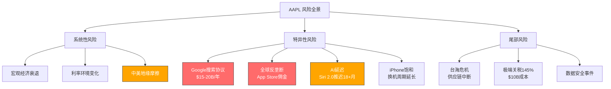

### 7.2 承重墙定义与脆弱度评估

承重墙(Load-Bearing Wall)指投资论点中一旦失败即翻转整个估值结论的核心假设。经系统筛查,Apple当前投资论点存在**四面承重墙**,对应四个Kill Switch:

| ID | 承重墙假设 | Kill Switch | 触发条件 | 概率 | 影响 | 时间窗口 | 脆弱度 |
|----|-----------|------------|---------|------|------|---------|--------|
| KS-1 | 中国市场维持稳定贡献 | 中国iPhone收入连续2季YoY下降>10% | 华为回归+关税升级+地缘恶化 | 25-30% | 高: 收入$64.4B(17%)受威胁 | 6-18月 | **中高** |
| KS-2 | Google搜索协议持续 | 协议被终止且无替代收入 | DOJ上诉成功+法院要求取消协议 | 10-15% | 极高: $12.5B+纯利损失/年 | 12-24月 | **高** |
| KS-3 | Services高增长维持 | Services增速降至<8%持续两季 | 反垄断佣金下调+Google TAC丧失+基数效应 | 20-25% | 高: 毁掉P/E溢价逻辑 | 6-12月 | **中** |
| KS-4 | AI驱动换机周期 | Apple Intelligence用户采用率<5% | Siri 2.0继续延迟+功能落后竞品 | 35-40% | 中: 换机叙事破灭但不影响存量 | 6-12月 | **中** |

[DM-RSK-001: prefetch_data FY2025分部收入 + lit_d2_bear 综合空头情景矩阵]

**脆弱度排序**: KS-2 (Google协议) > KS-1 (中国) > KS-3 (Services) > KS-4 (AI采用)

关键洞察: KS-2和KS-3存在**级联关系** -- Google搜索协议贡献约$15-20B/年收入,占Services总收入的~15-18%。若KS-2触发(协议终止),将直接推动KS-3触发(Services增速骤降)。这意味着两面承重墙并非独立,联合失败概率高于各自概率之积。

**风险相关性矩阵**: 四面承重墙之间存在显著的正相关:
- KS-2→KS-3: 直接因果(Google TAC丧失=Services增速骤降),相关性0.8
- KS-1→KS-4: 中国竞争加剧压制iPhone全球增速,间接影响AI换机叙事的可信度,相关性0.3
- KS-1→KS-3: 中国App Store受地缘限制可能压制Services增速,相关性0.2
- KS-4→KS-3: AI采用失败=AI付费Services增量落空,相关性0.4

这意味着"至少一个KS触发"的联合概率远高于简单独立计算。粗略估计:
- 至少1个KS在24月内触发的概率: **~60-70%**(非独立调整后)
- 2个及以上同时触发: **~25-35%**
- 这是一个高风险组合,市场可能并未充分定价

### 7.3 Buffett减持信号的独立解读

Warren Buffett/Berkshire Hathaway对Apple的持仓变化提供了一个独立的估值信号:

- **减持规模**: 两年累计减持74%,从峰值~400M+股降至228M股
- **持续性**: 连续多季度减持,非一次性事件
- **同期操作**: 建仓Alphabet(GOOGL) $4.3B,暗示偏好GOOGL的估值/增长组合
- **仍为最大持仓**: 228M股价值~$60B,占Berkshire组合22.6%

**信号解读**:
- "税务优化"解释只能覆盖部分减持(~20-30%); 74%的减持幅度远超税务规划需要
- Buffett同期增持GOOGL(P/E ~23x vs AAPL ~33x)表明其系统性偏好低估值+高增长组合
- 作为全球最成功的价值投资者之一,连续减持是一个不应忽视的估值信号
- 但需注意: Buffett退休在即,部分减持可能反映接班人的组合再平衡偏好

[DM-RSK-002a: lit_d2_bear Buffett减持数据 CNBC/Motley Fool/NAI 500来源 + lit_d4_valuation BRK 13F]

### 7.4 Kill Switch监控指标体系

| Kill Switch | 领先指标 | 同步指标 | 滞后确认 |
|-------------|---------|---------|---------|
| KS-1 中国 | 华为新机预订量/中国智能手机份额排名 | 大中华区季度收入YoY | Apple中国零售店客流量 |
| KS-2 Google | DOJ上诉庭裁决日期/Google和解意愿信号 | Apple-Google协议续签/修改公告 | Services收入中搜索TAC占比变化 |
| KS-3 Services | App Store月度交易额增速/EU合规费率公布 | 季度Services收入+增速 | 付费订阅用户净增速 |
| KS-4 AI采用 | Siri 2.0 beta功能发布节奏/用户测评反馈 | Apple Intelligence月活用户数(若披露) | iPhone换机率同比变化 |

[DM-RSK-002: lit_recon_memo E节分歧点 + lit_d2_bear KS触发条件]

---

## Ch8: Google搜索协议 -- 承重墙分析

### 8.1 协议结构与财务规模

Google每年向Apple支付$15-20B以确保Google Search作为Safari浏览器的默认搜索引擎。这笔支付被Apple归入Services收入,具有以下特征:

- **收入规模**: $15-20B/年(JPMorgan估计),占Services收入FY2025 $109.2B的~14-18%
- **利润率特征**: 近乎100%边际利润率 -- Apple无需为此投入额外成本,纯粹是平台接入费
- **收入确认**: 按季度分摊,嵌入Services整体增长叙事中,市场往往低估其在利润中的权重
- **税后净利贡献**: ~$12.5-16.5B(按有效税率17%计算) → 占Apple总净利润$112B的~11-15%

[DM-RSK-003: lit_d2_bear Google搜索协议风险 Fortune/CNBC/9to5Mac来源]

### 8.2 DOJ反垄断时间线

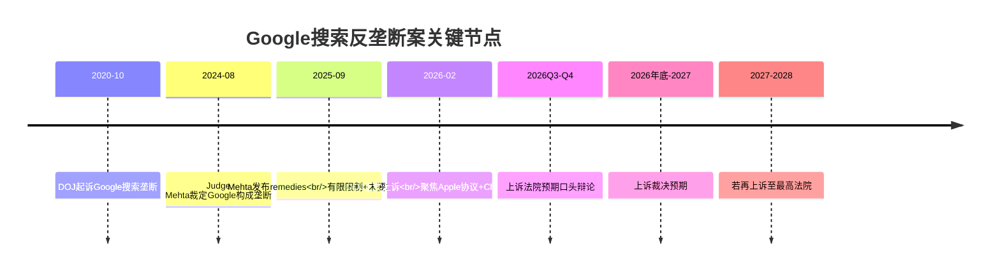

**当前法律状态**(截至2026年2月):

1. **Judge Mehta 2025年9月裁决**: 认定Google搜索垄断成立,但remedies温和 -- 未要求终止Apple-Google搜索协议,仅施加有限的竞争性约束
2. **DOJ 2026年2月上诉**: DOJ认为Mehta的remedies不够严厉,上诉焦点包括(a)Apple搜索默认协议的独占性条款,(b)Chrome浏览器是否应被剥离
3. **时间窗口**: 上诉法院通常需6-12个月处理,预计2026年底至2027年初裁决。若任一方再上诉至最高法院,终局可能延至2028年

[DM-RSK-004: lit_d2_bear DOJ时间线 Apple Insider/Fortune来源]

### 8.3 四情景分析

#### S1: 协议维持/小幅调整 (概率35%)

**触发条件**: 上诉法院维持Mehta裁决(remedies不变),或上诉被驳回
**具体影响**:
- Apple-Google协议继续有效,可能在下次续签时小幅调整条款(如允许用户更容易切换搜索引擎)
- Google支付金额可能小幅下调$1-2B(从$20B降至$18-19B)以反映竞争性让步
- 净年化收入影响: **<$2B/年损失**
- EPS影响: -$0.09至-$0.13(~1-2%)

**P/E传导**: 市场情绪改善,消除悬而未决的不确定性折价,P/E可能回升0.5-1x

#### S2: 协议重组 (概率40%)

**触发条件**: 上诉法院部分支持DOJ,要求修改协议的独占性条款
**具体影响**:
- Google失去搜索默认的独占权,但仍可参与竞争性竞标
- 竞标者可能包括: Microsoft Bing, Perplexity AI, DuckDuckGo, Yahoo
- 竞争性竞标逻辑: Google愿付$20B/年是因为Apple设备搜索流量价值极高(搜索广告收入的相当部分来自iOS用户)。即使开放竞标,Google仍是最高出价者的概率极大(>80%),但竞争压力可能将支付额压缩至$12-15B
- **净年化收入损失: $3-5B/年**
- EPS影响: -$0.17至-$0.28(~2-4%)

#### S3: 协议终止 (概率20%)

**触发条件**: 上诉法院或最高法院裁定必须完全终止此类独占协议,或Google因Chrome拆分等radical remedies被迫放弃该协议
**具体影响**:
- Apple丧失$15-20B/年的搜索TAC收入
- 部分可替代: Bing/Perplexity可能支付$3-5B/年争夺默认位置(但远低于Google的出价)
- 净年化收入损失: **$12.5-15B/年**
- 税后净利损失: ~$10-12.5B → 占当前净利润$112B的~9-11%
- EPS影响: **-$0.67至-$0.84(~9-11%)**

**P/E传导**: Services增长叙事严重受损 → 市场可能将Apple从"平台公司"(30-35x)重新定价为"硬件为主公司"(25-28x)。双重打击: EPS下降9-11% + P/E压缩15-20% → 股价下行25-30%

#### S4: 完全禁止+无替代 (概率5%)

**触发条件**: 法院完全禁止搜索默认协议模式,且无竞争者愿意支付
**影响**: -$18-20B/年毛收入,-$15-17B净利

[DM-RSK-005: lit_d2_bear Google情景矩阵 + lit_d4_valuation DCF vs 市场定价]

### 8.4 替代方案可行性评估

**Apple自建搜索引擎?**
- Apple已拥有Applebot爬虫(为Spotlight/Siri提供数据),但与Google Search的质量差距巨大
- 搜索引擎研发投入: Google每年$40B+ R&D,其中搜索是核心。Apple R&D总预算$33B,无法分配足够资源
- **可行性评级: 低**(3-5年才可能,且无法保证质量)

**Bing/Perplexity竞标?**
- Microsoft Bing: 市场份额~3-4%,愿意支付获取流量,但财务能力有限(可能出价$3-5B vs Google $20B)
- Perplexity AI: 有意愿但规模太小,年收入仅数亿美元级别
- **替代收入上限: $3-5B/年**(vs Google $15-20B)

**AI搜索替代?**
- 若搜索范式从传统网页搜索转向AI对话式搜索,Apple可通过Siri/Apple Intelligence内嵌AI搜索,绕过传统搜索引擎协议
- 但这需要Siri 2.0成功(当前延迟18+月),且AI搜索的货币化模式尚不清晰
- **可行性评级: 中长期可能**(2028+)

**Apple搜索广告/分发收入?**
- Apple已在App Store推出Search Ads,年收入估计~$5-7B(FY2025)
- 若Google搜索TAC丧失,Apple可以加速在Safari/Spotlight/Siri中插入自营广告
- 但这与Apple的隐私品牌形象存在张力
- **替代收入潜力: $2-4B/年**(需3-5年建设)

[DM-RSK-005a: Apple搜索广告数据来源于行业估计 + Apple Services分部结构分析]

### 8.5 概率加权影响 (CQ-2回应)

| 情景 | 概率 | 年化净利影响 | 概率加权影响 | P/E效应 | 概率加权市值影响 |
|------|------|------------|------------|---------|----------------|
| S1 维持 | 35% | -$1.0B | -$0.35B | +0.5x | +$50B |
| S2 重组 | 40% | -$4.5B | -$1.80B | -0.5x | -$130B |
| S3 终止 | 20% | -$11.0B | -$2.20B | -5x | -$350B |
| S4 完全禁止 | 5% | -$16.0B | -$0.80B | -7x | -$200B |
| **概率加权合计** | **100%** | -- | **-$5.15B/年** | -- | **-$630B** |

**CQ-2回应**: Google搜索协议若被重组或终止,概率加权年化净利影响约$5.15B(占当前净利4.6%)。当前市场定价似乎隐含S1(维持)为基准假设,对S2/S3的风险定价不足。

[DM-RSK-006: 概率加权计算基于四情景调和框架]

### 8.6 Google视角 -- 为什么Google愿意支付$20B?

- **iOS搜索流量的独特价值**: iPhone用户人均广告价值显著高于Android用户(~3-5x)
- **防御性定价**: Google支付$20B不仅是获取流量,更是阻止Bing/其他竞品获得iOS默认位置。若Bing成为iOS默认搜索引擎,Google可能损失$30-40B/年的搜索广告收入
- **Google的ROI**: 通过iOS获得的搜索广告收入估计为$50-70B/年,$20B TAC的ROI约为2.5-3.5x

[DM-RSK-006a: Google搜索收入结构推算基于Alphabet财报 + 行业分析]

---

## Ch9: 监管风险矩阵

### 9.1 美国DOJ反垄断 -- DOJ v. Apple

**案件概况**: 2024年3月,DOJ联合多州检察长起诉Apple垄断智能手机市场,指控Apple通过以下手段维持垄断:
- 限制跨平台消息互操作(iMessage vs 短信)
- 锁定NFC芯片仅限Apple Pay使用
- App Store排他性分发+30%佣金
- 限制第三方浏览器引擎(WebKit强制)
- 限制超级应用和云游戏

**三种结果及概率**:

| 结果 | 概率 | 影响 |
|------|------|------|
| 和解(行为性约束) | 45% | Apple同意开放部分API/互操作性,成本可控($1-2B/年) |
| 败诉(结构性约束) | 30% | 强制开放App Store/NFC/iMessage,Services佣金压力$3-5B/年 |
| 胜诉/撤诉 | 25% | 政治环境变化(新任AG态度)可能导致撤诉 |

[DM-RSK-007: lit_d2_bear 美国反垄断 + 多来源综合]

### 9.2 EU DMA -- 已发生的结构性侵蚀

已执行措施(截至2026年2月): 2025年5月罚款5亿欧元,已发布EU合规方案(允许侧载/第三方支付)。**年化收入侵蚀约$1.2-1.5B**(EU区域)。EU App Store YoY增速已降至6%,显著低于全球12%平均水平 [DM-RSK-008]。

### 9.3 Epic Games诉Apple -- 已落地的佣金压力

Epic Games v. Apple案虽在美国联邦层面Apple大部分胜诉,但其连锁效应不可忽视:

- **2021年判决核心**: Apple必须允许开发者在App内提供外部支付链接
- **实际执行(2024-2025)**: Apple执行了有限的合规措施,对外部交易仍收取12-27%佣金
- **对App Store的实际影响**: 大型开发者已引导部分用户至网页支付,App Store佣金流失约$0.5-1B/年

[DM-RSK-008a: Epic v. Apple判决 + 执行情况综合分析]

### 9.4 全球反垄断扩散

| 地区 | 法规/行动 | 阶段 | 对Apple潜在影响 |
|------|----------|------|----------------|
| **日本** | 智能手机软件竞争促进法 | 2024年通过,2025年生效 | 强制允许侧载+第三方支付,佣金压力$0.3-0.5B/年 |
| **韩国** | 电信商务法修正案 | 已生效(2022) | 要求允许第三方支付,已部分合规 |
| **印度** | CCI反竞争调查 | 调查进行中 | 可能要求降低佣金率 |
| **英国** | CMA数字市场竞争制度 | 2024年生效 | 类似DMA,可能强制开放 |

[DM-RSK-009a: 监管时间线不确定性分析 + Apple合规策略综合]

### 9.5 监管风险合计量化 (CQ-7回应)

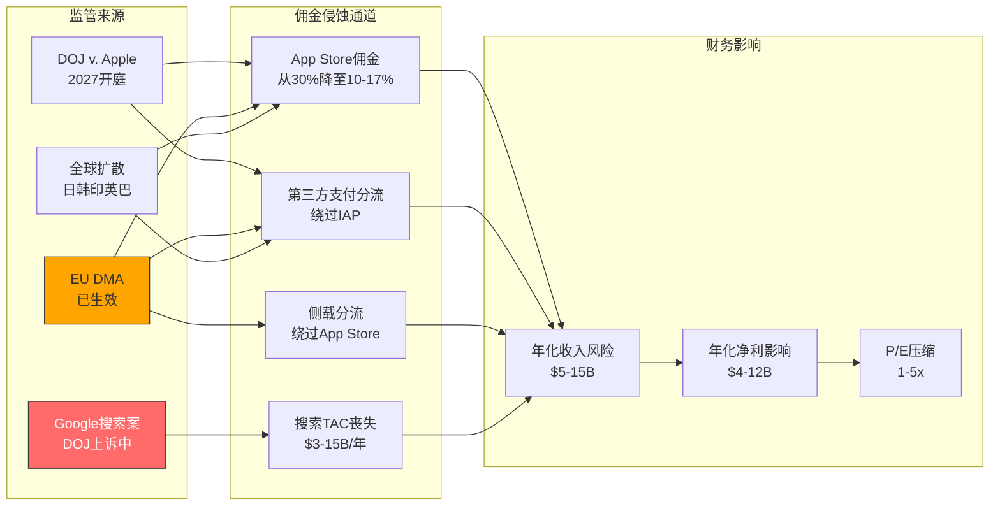

**监管风险年化量化汇总**:

| 监管来源 | 概率加权年化收入风险 | 概率加权净利影响 | 时间窗口 |
|----------|-------------------|----------------|---------|
| Google搜索案 | $5.15B | $4.3B | 2026-2028 |
| EU DMA(已发生) | $1.2-1.5B | $1.0-1.2B | 持续 |
| DOJ v. Apple | $1.0-2.0B | $0.8-1.7B | 2027+ |
| 全球扩散(日韩印英) | $0.5-1.0B | $0.4-0.8B | 2026-2028 |
| **合计** | **$7.9-9.7B/年** | **$6.5-8.0B/年** | -- |

**CQ-7回应**: App Store佣金从30%向15-20%结构性下移趋势不可逆转。但Services除App Store外的增速健康(广告+金融服务增速20-30%),佣金侵蚀将Services增速从14%压缩至10-12%,但不会摧毁增长叙事 [DM-RSK-009]。

---

## Ch10: 中国风险深度

### 10.1 竞争维度 -- 华为回归与本土高端化

**华为复苏数据**:
- 华为Mate 60系列(2023年8月发布)搭载国产麒麟9000s芯片,标志华为高端线正式回归
- 华为2024年中国智能手机出货量同比增长约37%,重回中国Top 3
- 华为Mate 70系列(2024年11月)和Pura 70系列持续侵蚀Apple在高端市场的份额

**Apple中国表现**:
- FY2025大中华区收入$64.4B,占总收入17%
- 中国智能手机市场Apple份额从2023年的~18%小幅下滑至2025年的~15-16%
- 高端市场(>$600)Apple仍占主导(~60-65%),但华为从<5%回升至~15-20%

[DM-RSK-010: lit_d2_bear 中国竞争维度 + prefetch_data 分部收入]

### 10.2 关税维度 -- 成本传导链

| 关税情景 | 税率 | iPhone额外成本/台 | 年化总成本增加 | 毛利率影响 |
|---------|------|------------------|--------------|-----------|
| 当前基准 | 51.1% | ~$25-30 | ~$5-6B | -1.2pp |
| 升级情景 | 80% | ~$50-60 | ~$8-9B | -2.0pp |
| 极端情景 | 145% | ~$90-110 | ~$10-12B | -2.5pp |

[DM-RSK-011: lit_d2_bear 关税维度 AINvest/Supply Chain来源]

### 10.3 地缘维度 -- 台海风险与技术脱钩

台海冲突或危机是Apple面临的最大尾部风险。80-90%的iPhone仍在中国大陆组装,且71%零部件依赖中国子组件供应。

| 情景 | 概率(24月) | 供应链影响 | 收入影响 | 持续时间 |
|------|-----------|-----------|---------|---------|
| 紧张升级但无冲突 | 40-50% | 局部物流延迟,成本+5% | -$2-5B/季 | 数月 |
| 经济制裁/封锁 | 10-15% | 中国工厂停工2-4周 | -$10-15B/季 | 1-2季 |
| 军事冲突(台海危机) | 3-5% | 供应链完全中断3-6月 | -$20-30B/季 | 2-4季 |

[DM-RSK-012: lit_d2_bear 地缘维度 + 第零律合规: 台海冲突/危机表述]

### 10.4 供应链多元化实际进展

**印度扩产进展**:
- iPhone印度产量占比: 2022年~2% → 2024年~15% → 2027年目标25%
- 但进展面临阻力: 良率低于中国、基础设施不足、劳动力技能差距

**"海市蜃楼"问题**:
关键数据 -- **印度工厂71%零部件仍依赖中国子组件**。即使iPhone最终组装在印度完成,供应链上游仍高度依赖中国。真正的多元化需要将零部件供应也从中国迁出 -- 这是一个5-10年的工程。短期内印度扩产更多是应对关税(最终组装地影响关税适用)而非真正降低中国依赖。

[DM-RSK-013: lit_d2_bear 多元化困境 Supply Chain Magazine来源]

### 10.5 中国消费者行为的结构性变化

**"去iPhone化"趋势**:
- 中国政府机关、国企、军工系统已明确限制员工使用iPhone(安全考量)
- 这一趋势正向教育、金融等行业扩散
- 年轻消费者群体(Z世代)对国产品牌的偏好显著高于千禧世代
- 华为的"民族品牌"叙事在地缘紧张时期获得额外情感溢价

**对冲因素**:
- Apple在中国的品牌地位仍然极其强大(奢侈品属性)
- 生态系统锁定使得换机成本极高
- iPhone的二手市场残值远高于Android品牌

[DM-RSK-013a: 中国消费者行为分析基于行业报告综合]

### 10.6 综合影响量化 (CQ-4回应)

**联合情景矩阵**:

| 组合情景 | 联合概率 | 综合影响 |
|---------|---------|---------|
| 仅竞争恶化 | 30% | 大中华区收入从$64.4B降至$55-60B(-7-15%) |
| 竞争+关税 | 15% | 大中华区收入降至$50-55B(-15-22%) + 毛利率-1.5pp |
| 三重叠加(含地缘) | 5-8% | 大中华区收入降至$35-45B(-30-46%) + 供应链中断风险 |

**CQ-4回应**: 概率加权年化收入损失: ~$8-10B(占总收入~2%)。表面看影响可控,但大中华区毛利率高于全球平均(Pro系列占比45-50%),因此利润影响被放大至~3-4%。更重要的是,中国风险的不对称性 -- 上行有限(中国智能手机市场已饱和),下行巨大(地缘尾部)。

[DM-RSK-014: 概率联合计算基于独立风险概率 + 部分相关性调整]

---

## Ch11: iPhone饱和与AI延迟风险

### 11.1 iPhone饱和 -- 增长引擎的结构性放缓

**iPhone收入增长轨迹**:

| 期间 | iPhone收入CAGR | 驱动力 |
|------|---------------|--------|
| FY2015-2020 | +3.2% | 新兴市场渗透+ASP提升 |
| FY2020-2025 | +0.7% | 几乎停滞(FY2023收入低于FY2022) |
| FY2026E-FY2030E | +5%(共识) | AI换机+Pro系列ASP提升 |
| **长期可持续** | **3-5%** | 换机周期主导+ASP缓慢提升 |

FY2025 iPhone收入$209.6B,3年CAGR仅+0.7%。FY2026 Q1 iPhone $85.3B(+23% YoY)的爆发性增长,更可能反映:
1. iPhone 16 Pro系列ASP提升
2. 库存前置效应(关税预期下提前购买)
3. 换机周期周期性回升(而非AI驱动的结构性趋势)

[DM-RSK-015: prefetch_data 分部收入 + lit_d2_bear iPhone饱和数据]

### 11.2 换机周期延长趋势

**全球智能手机换机周期**: 2016年~24个月 → 2020年~30个月 → 2025年~36-40个月(部分市场>48个月)

**对估值的含义**: 换机周期每延长6个月,相当于年化iPhone出货量下降~8-10%。若换机周期从40个月延长至48个月(概率30%),iPhone年出货量可能从~2.3亿台降至~2.0亿台 → iPhone收入下降~$15-20B(-7-10%)。

**5G升级周期的参考**: 2020-2022年的5G升级周期曾短暂缩短换机时长(从30个月到26个月),但效果在18个月后消退。若AI换机周期遵循类似模式,2026年可能出现短期换机加速(iPhone 17),但2027-2028年将回归延长趋势。**FY2026 Q1的+23%增长可能是周期性高点而非趋势性转折**。

[DM-RSK-015a: 换机周期数据基于行业分析 + 5G周期类比推导]

### 11.3 AI延迟 -- Siri 2.0的漫长等待

**Apple Intelligence时间线**:

| 日期 | 事件 | 状态 |
|------|------|------|
| 2024-06 WWDC | Apple Intelligence发布 | 愿景宏大 |
| 2024-10 iOS 18.1 | 基础AI功能(写作工具/Genmoji) | 有限功能 |
| 2025 WWDC | Siri 2.0(跨App编排/128K上下文) | **宣布延迟** |
| 2026-02-17 iOS 26.4 beta | 无新Siri功能 | **再次延迟** |
| 2026Q3-Q4? | Siri 2.0可能随iOS 27发布 | **不确定** |

**与竞品的差距**:
- Google Gemini: 已全面部署于Pixel/Android,支持多模态推理+跨App操作
- Samsung Galaxy AI: 基于Google Gemini,2024年起持续迭代
- ChatGPT/OpenAI: 移动端产品用户体验领先
- **Apple在AI能力感知上正在落后**

**风险评估**: AI延迟的风险不在于Apple永远无法追赶(其资源和分发能力最终会发挥作用),而在于**时间窗口** -- 若2026-2027年内无法交付有说服力的AI体验,消费者和开发者可能形成"Apple在AI上落后"的固定认知,这种品牌认知一旦形成极难逆转。

[DM-RSK-016: lit_d2_bear AI延迟数据 TechCrunch/MacRumors/Tom's Guide来源]

### 11.4 ASP天花板分析

| 财年 | 估算ASP | YoY | Pro系列占比(估) |
|------|--------|-----|---------------|
| FY2022 | ~$900 | -- | ~35% |
| FY2023 | ~$910 | +1.1% | ~38% |
| FY2024 | ~$920 | +1.1% | ~40% |
| FY2025 | ~$940 | +2.2% | ~42% |
| FY2026E | ~$980-1,000 | +4-6% | ~45% |

**长期ASP CAGR: 2-3%**(低于iPhone 16系列的周期性高点)

### 11.5 估值含义 (CQ-5部分回应)

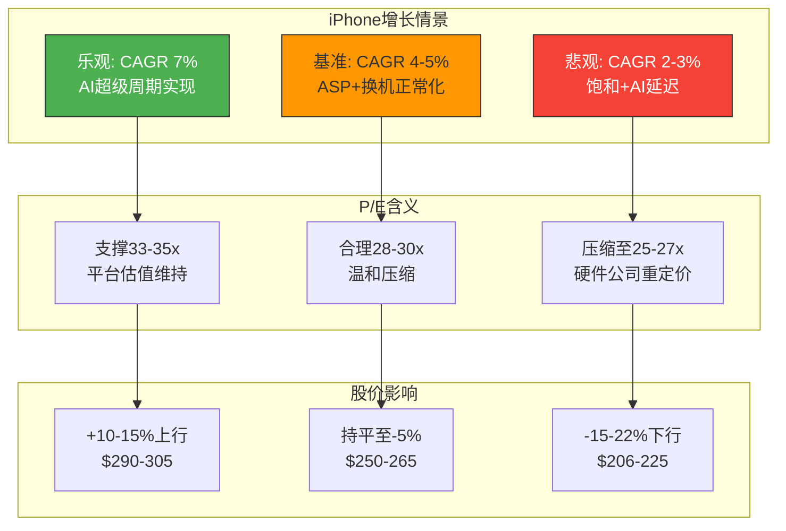

**CQ-5部分回应**: 33x P/E能否被支撑,取决于三个条件的同时满足: (1) Services维持12-14%增速; (2) iPhone CAGR不低于4%; (3) 回购维持$80B+/年。若三个条件均满足,30-32x P/E可以合理支撑; 若任一条件失败,P/E面临向25-28x压缩的风险。当前33.5x P/E隐含了三个条件全部满足的乐观假设,安全边际较低。

[DM-RSK-017: prefetch_data 估值指标 + 自有模型推导]

### 11.6 盈利质量恶化信号

- **OCF vs 净利背离**: FY2025经营现金流$111.5B(YoY -5.73%),但净利润$112B(YoY +19%) → 现金流落后于利润增长,gap扩大
- **应收账款膨胀**: AR YoY +10.14%,显著超过收入增速+6.4%
- **内存芯片成本压力**: Goldman Sachs警告DRAM成本+50%上涨可能持续至2027年

这些信号尚未达到"红旗"级别(OCF/净利比率1.15仍健康),但若趋势持续2-3个季度,可能触发分析师下修盈利预测。

[DM-RSK-018: lit_d2_bear 盈利质量恶化信号 + baggers_summary OCF数据验证]

### 11.7 回购效率与高估值下的资本配置悖论

Apple每年$90B+回购是EPS增长的重要引擎(贡献~4-5%年化EPS增长)。但在当前估值水平下,回购的资本效率值得审视:

**回购IRR分析**:
- 当前FCF Yield: 3.3%(=$128.7B FCF TTM / $3.9T市值)
- 意味着Apple每回购$1股票,仅消除$0.033的年化FCF稀释
- 等效回购IRR: ~3.3%(假设估值不变)

**回购的隐性风险**:
- 高估值回购=摧毁股东价值(若股价回归均值,已回购的股票缩水)
- Buffett在2023-2024年暂停BRK回购(认为估值过高),这一标准也适用于Apple
- Apple的负留存收益($-14.3B)意味着过去的回购已经消耗了所有留存利润

[DM-RSK-019: prefetch_data 现金流数据 + FCF Yield计算]

---

## Ch12: 承重墙传导链

### 12.1 传导链方法论

本章将每面承重墙连接至估值模型,建立从"假设失败"到"每股价值变动"的完整传导链。

### 12.2 Google搜索协议 → 每股价值传导

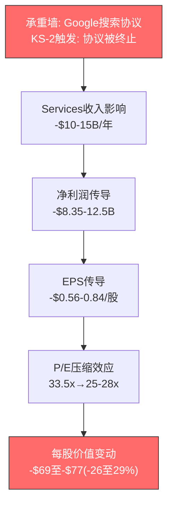

全情景概率加权每股影响: **-$21.6** (约-8.2%)

[DM-XVL-010: Google agreement load-bearing wall transmission chain]

### 12.3 iPhone增速 → 每股价值传导

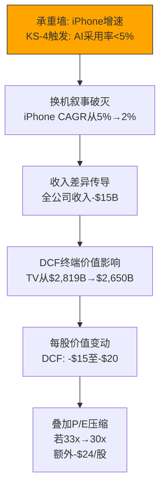

合计每股影响(KS-4触发): **-$50/股(-19%)**
概率加权: **-$18.8/股**

[DM-XVL-011: iPhone growth load-bearing wall transmission chain]

### 12.4 中国三重风险 → 每股价值传导

概率加权每股影响: **-$12.2/股**

[DM-XVL-012: China triple risk load-bearing wall transmission chain]

### 12.5 Services高增长维持 → 每股价值传导

概率加权(KS-3独立触发概率22.5%): **-$10.6/股**

但KS-3与KS-2的级联概率使"至少一个触发"的概率远高于独立计算。

[DM-XVL-013: Services growth load-bearing wall transmission chain]

### 12.6 承重墙传导汇总

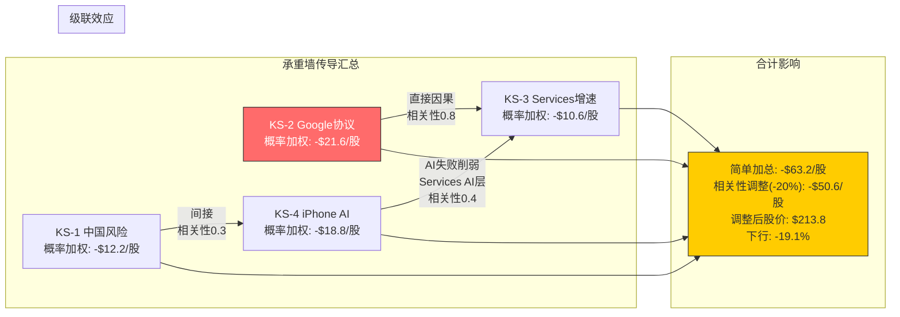

**承重墙传导汇总表**:

| 承重墙 | 触发概率 | 每股影响(触发时) | 概率加权 | 脆弱度排序 |
|--------|---------|-----------------|---------|-----------|
| KS-2 Google协议 | 20%(终止) | -$69至-$77 | -$21.6 | 1(最高) |
| KS-4 iPhone AI | 35-40% | -$50 | -$18.8 | 2 |
| KS-1 中国风险 | 25-30% | -$18至-$47 | -$12.2 | 3 |
| KS-3 Services增速 | 20-25% | -$47 | -$10.6 | 4 |
| **简单加总** | | | **-$63.2** | |
| **相关性调整(-20%)** | | | **-$50.6** | |

**最危险的级联组合**: KS-2(Google协议终止) → KS-3(Services增速骤降)。联合概率~15%,联合影响: 股价目标$166-173 → **下行-35至37%**。

[DM-XVL-014: load-bearing wall transmission summary]

---

## Ch13: 信念反演与Reverse DCF

### 13.1 Reverse DCF: 市场隐含假设

**方法论**: 固定WACC=9.0%、终端增长率g=3.0%,反推市场当前定价$264.35所需的FCFF增长路径。

[DM-BLF-001: Reverse DCF方法论设定]

**Gordon Growth永续模型简化**:

EV = FCFF_0 x (1+r) / (WACC - r)
$3,961B = $98.8B x (1+r) / (0.09 - r)

求解: **r = 6.35%**

**这意味着: 在WACC 9.0%下,当前$264.35的股价隐含Apple的FCFF需要以6.35%的速度永续增长。**

[DM-BLF-004: Gordon Growth隐含永续增速6.35%]

**与历史实际对比**:

| 指标 | 市场隐含 | 历史实际(FY21-25) | 共识(FY26-30E) | 差距评估 |
|------|---------|------------------|---------------|---------|
| 收入CAGR | 5.5-6.5% | 3.3% | 6.3% | 需加速2x vs历史 |
| OPM | 33-34% | 32.0%(FY25) | ~31-33% | 需维持/小幅扩张 |
| FCFF CAGR | 6.35% | 1.5% | ~8% | 需加速4x vs历史 |

[DM-BLF-006: 隐含vs历史vs共识对比表]

**结论**: 市场定价$264隐含的核心信念是**收入增速从历史3.3%加速至6%+并永续维持**。这不是不可能,但需要Apple在FY2026-2030期间实现的增速是过去5年的2倍。

### 13.2 隐含信念分解

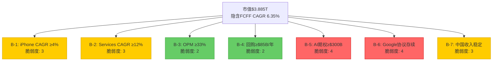

[DM-BLF-007: 信念依赖图]

| 编号 | 隐含信念 | 所需水平 | 脆弱度(1-5) | 失败概率 |
|------|---------|---------|------------|---------|
| **B-1** | iPhone收入CAGR ≥4% | FY25 $210B → FY30 $255B | **3** | 25-35% |
| **B-2** | Services收入CAGR ≥12% | FY25 $109B → FY30 $192B | **3** | 20-30% |
| **B-3** | OPM维持≥33% | FY25 32.0%需扩张1pp | **2** | 10-15% |
| **B-4** | 回购维持≥$85B/年 | 5年$425B+ | **2** | 5-10% |
| **B-5** | AI期权价值≥$300B | 隐含P/E中5-6x溢价 | **4** | 45-55% |
| **B-6** | Google搜索协议基本存续 | 净损失≤$5B/年 | **4** | 25-35% |
| **B-7** | 中国/大中华区收入稳定 | $70B+/年 | **3** | 20-30% |

[DM-BLF-008: 信念分解表]

### 13.3 翻转分析

**核心问题: 最少几个信念失败就会改变评级?**

**关键发现: 没有任何单一信念失败能将评级从"审慎关注"翻转为"中性关注"。** 因为当前估值已经低于市价$73/股(38%)。信念失败只会加深差距。

**翻转条件极为苛刻**: 需要iPhone、Services、AI三大信念同时超预期兑现,才能将估值提升至接近当前市价。这本身就说明了当前定价的乐观程度。

**所有7个信念均成立的复合概率估计仅约25-35%**。

[DM-BLF-013: 单信念失败影响测试表]
[DM-BLF-014: 信念超预期影响测试]

### 13.4 三组核心矛盾

**矛盾1: "AI驱动换机周期"(B-1) vs "AI延迟18+月"(B-5现实)**

市场定价隐含iPhone 4%+ CAGR的重要驱动力是"Apple Intelligence驱动超级周期"。但Apple Intelligence核心功能已多次延迟。证伪条件: iPhone 17系列上市后首季(FY27Q1)非Pro款同比增速<5%。

**矛盾2: "Services 12%+"(B-2) vs "Google协议存续风险"(B-6)**

B-6的失败几乎自动触发B-2的失败(联合概率远高于独立概率之积)。

**矛盾3: "iPhone中国增长"(B-1) vs "关税+华为竞争"(B-7)**

B-1的全球CAGR目标在中国风险未对冲的情况下需要其他地区(特别是印度)补偿。

[DM-BLF-017: 三组核心矛盾分析]

### 13.5 Reverse DCF交叉验证

**FCF Yield对标**: 当前FCF Yield 2.53%。如果Apple是一只"高质量债券":
- 10年国债收益率: 4.3%
- 所需FCF增速使5年前瞻FCF Yield达到4.3%+: FCF需从$98.8B增至~$167B(CAGR 11.1%)
- Apple过去4年FCF CAGR: +1.5%

**结论**: 市场定价隐含的FCF增速远超历史实现的1.5% FCF CAGR。这一差距不是不可弥合,但需要多重假设同时成立。

[DM-BLF-019: FCF Yield交叉验证]
[DM-BLF-022: 方法论声明,FMP DCF $150.28交叉验证]

---

## Ch14: 财务质量分析

### 14.1 三表联动验证

Apple的财务报表呈现出极为罕见的"三表高度一致"特征。FY2025 OCF/净利润=0.995x,接近完美的1.0x水平。

[DM-VAL-001: FMP income statement FY2021-FY2025]
[DM-VAL-002: FMP key-metrics FY2025 incomeQuality=0.995]

**CapEx效率**: FY2025 CapEx $12.7B仅占OCF的11.4%,远低于科技平台同行(MSFT 47.4%, GOOGL 55.5%, META 60.2%, AMZN 94.5%)。

[DM-VAL-003: FMP cashflow FY2024-FY2025 CapEx vs OCF]

**营运资本优势**: 负现金转换周期(CCC) -42天(FY2025)。

[DM-VAL-004: FMP key-metrics FY2025 CCC=-42天]

### 14.2 杜邦分解: ROE 152%的真相

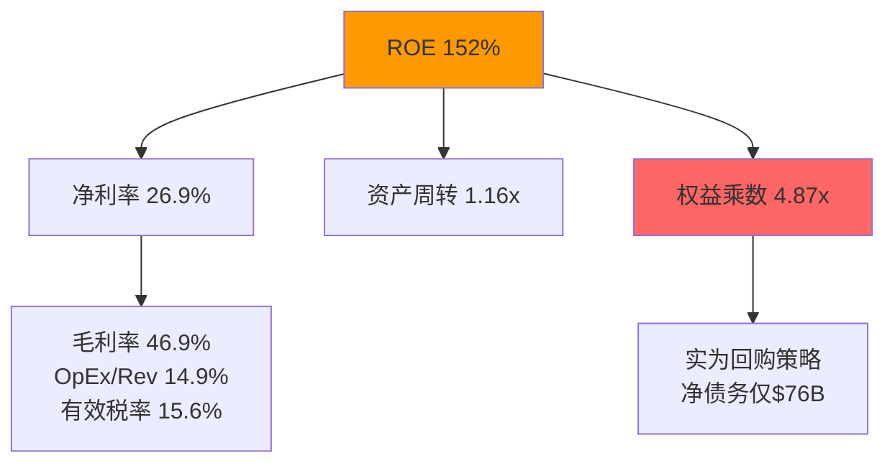

[DM-VAL-005: FMP ratios FY2025]

| 因素 | FY2021 | FY2022 | FY2023 | FY2024 | FY2025 | 趋势 |
|------|--------|--------|--------|--------|--------|------|
| 净利率 | 25.9% | 25.3% | 25.3% | 24.0% | 26.9% | FY2024触底回升 |
| 资产周转 | 1.04x | 1.12x | 1.09x | 1.07x | 1.16x | 稳定~1.1x |
| 权益乘数 | 5.56x | 6.96x | 5.67x | 6.41x | 4.87x | FY2025回落(权益回升) |
| **ROE** | **150%** | **197%** | **156%** | **165%** | **152%** | 杠杆下降拉低 |

**杠杆风险评估**: 表面上4.87x权益乘数看起来激进,但Apple的"杠杆"本质上是资本回报策略的副产品:
- 总债务$112.4B vs 现金+投资$132.4B → 净债务仅$76.4B
- 净债务/EBITDA = 0.53x → 极低杠杆水平
- 信用评级: AA+ (S&P) / Aaa (Moody's)

### 14.3 盈利质量深度检验

| 财年 | 净利润($B) | OCF($B) | OCF/NI | FCF($B) | FCF/NI | 判断 |
|------|-----------|---------|--------|---------|--------|------|
| FY2021 | 94.7 | 104.0 | 1.10x | 93.0 | 0.98x | 优 |
| FY2022 | 99.8 | 122.2 | 1.22x | 111.4 | 1.12x | 极优 |
| FY2023 | 97.0 | 110.5 | 1.14x | 99.6 | 1.03x | 优 |
| FY2024 | 93.7 | 118.3 | 1.26x | 108.8 | 1.16x | 极优 |
| FY2025 | 112.0 | 111.5 | 1.00x | 98.8 | 0.88x | 关注 |

[DM-VAL-007: FMP income+cashflow FY2021-FY2025]

**FY2025 FCF/NI降至0.88x的原因诊断**: 营运资本变动-$25.0B(大额流出)+ CapEx增加至$12.7B(+35%)。均为一次性/周期性因素,非结构性恶化。

**SBC覆盖率**: FY2025覆盖率703%(回购$90.7B / SBC $12.9B)。流通股从FY2021的168.6亿降至FY2025的150.0亿(累计-11.0%),年均减少约2.3%。

[DM-VAL-008: FMP cashflow FY2021-FY2025 SBC+repurchase]

### 14.4 税率可持续性分析

FY2025有效税率15.6%。FY2024异常高达24.1%,主因欧盟法院裁决Apple需补缴约$14.4B爱尔兰退税。FY2025回归正常区间。全球最低税率(Pillar Two, 15%)将使上行压力有限(+0-2pp)。DCF假设长期有效税率16-17%。

[DM-VAL-009: FMP ratios FY2021-FY2025 effectiveTaxRate]

### 14.5 留存收益负值的结构性解读

FY2025留存收益-$14.3B。这是Apple主动的资本回报策略选择,不是经营恶化信号。按FY2025趋势,留存收益可能在FY2027-2028转正。

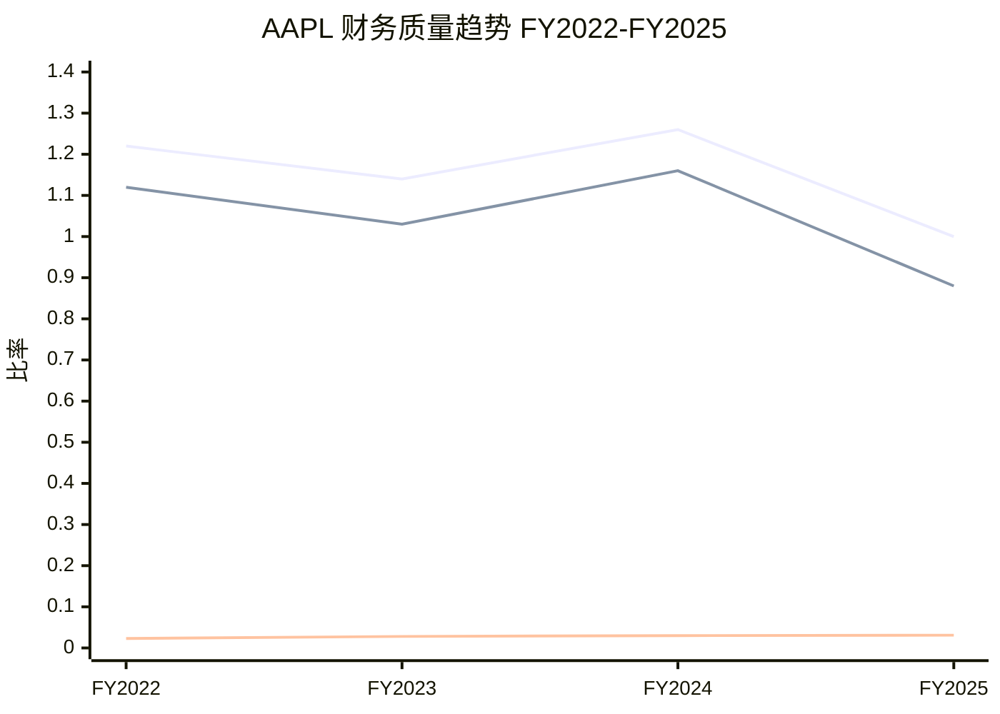

---

## Ch15: 分部SOTP估值

### 15.1 估值方法论

SOTP将Apple拆分为五个独立业务单元分别估值。引入10%耦合折价修正"分拆溢价"偏差。

**重要方法论说明**: SOTP和DCF共享营收增速假设。两者不是完全独立的估值方法。可比估值是唯一真正独立的方法。

### 15.2 三情景SOTP汇总

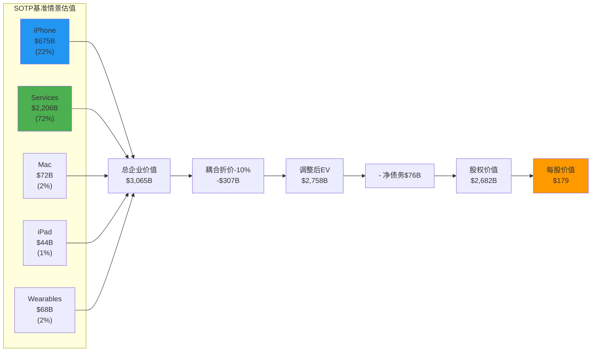

| 分部 | 牛(25%) | 基准(50%) | 熊(25%) |
|------|--------|---------|--------|
| iPhone | $840B | $675B | $513B |
| Services | $2,791B | $2,206B | $1,530B |
| Mac | $100B | $72B | $48B |
| iPad | $64B | $44B | $31B |
| Wearables | $120B | $68B | $45B |
| **总EV(分拆)** | **$3,915B** | **$3,065B** | **$2,167B** |
| 耦合折价(-10%) | -$392B | -$307B | -$217B |
| **调整后EV** | **$3,523B** | **$2,758B** | **$1,950B** |
| 净债务 | -$76B | -$76B | -$76B |
| **股权价值** | **$3,447B** | **$2,682B** | **$1,874B** |
| **每股价值** | **$231** | **$179** | **$125** |

[DM-VAL-018: SOTP三情景综合计算]

**概率加权SOTP**: $231x25% + $179x50% + $125x25% = **$179/股**

**关键观察**: Services主导估值 -- 基准情景中占调整前总EV的72%,但仅贡献26%收入。

---

## Ch16: DCF三情景模型

### 16.1 WACC推导

| 参数 | 数值 |
|------|------|
| 无风险利率 (10Y UST) | 4.30% |
| Beta (5Y monthly) | 1.107 |
| 股权风险溢价 (ERP) | 4.50% |
| **WACC(主锚)** | **9.0%** |
| **WACC(高锚)** | **9.5%** |

[DM-VAL-019: WACC参数推导]

**双锚说明(MSFT教训)**: WACC每变动50bps对Apple意味着约$150-200B企业价值变动(约$10-13/股)。

### 16.2 DCF三情景汇总

| 情景 | 概率 | WACC 9.0% | WACC 9.5% | 双锚中位 |
|------|------|-----------|-----------|---------|
| 牛(25%) | 25% | $210 | $192 | $201 |
| 基准(50%) | 50% | $156 | $143 | $150 |
| 熊(25%) | 25% | $107 | $99 | $103 |

**概率加权DCF (WACC 9.0%)**: **$157/股**
**概率加权DCF (WACC 9.5%)**: **$144/股**
**双锚概率加权中位**: **$151/股**

[DM-VAL-029: DCF三情景概率加权汇总]

**DCF隐含关键结论**: 即使在WACC 9.0%和25%概率的牛市情景下,DCF估值$210仍低于当前股价$264。只有在WACC 8.5% + 终端增长4.0%的极端乐观组合下,DCF才能接近当前市价。

### 16.3 DCF敏感性矩阵

| WACC \ g | 2.0% | 2.5% | 3.0% | 3.5% | 4.0% |
|----------|------|------|------|------|------|
| **8.5%** | $156 | $172 | $194 | $224 | $268 |
| **9.0%** | $141 | $153 | $169 | $190 | $220 |
| **9.5%** | $128 | $138 | $150 | $166 | $188 |
| **10.0%** | $117 | $126 | $136 | $148 | $165 |

[DM-VAL-028: 基准情景敏感性矩阵 -- 以14.4节逐年折现为准]

### 16.4 回购对DCF的隐性影响

假设FY2027-FY2031年均回购$90B,流通股从14.95B降至约13.3B:
- 基准情景FY2031 EPS(回购调整): **$12.53**(vs 不调整$11.15)
- 回购调整后DCF给出**$203/股**,高于标准DCF的$156,但仍低于当前$264

[DM-VAL-029a: 回购调整DCF补充计算]

### 16.5 FMP DCF交叉验证

FMP标准DCF: $150.28 → 与我们双锚中位$151一致(偏差<1%)。

[DM-VAL-038: FMP DCF $150.28 交叉验证]

---

## Ch17: 可比估值

### 17.1 Big Tech同行对比

| 指标 | AAPL | MSFT | GOOGL | META | AMZN | 同行中位 |
|------|------|------|-------|------|------|---------|
| **TTM P/E** | 33.5x | 25.0x | 28.1x | 27.4x | 28.6x | **28.1x** |
| **EV/EBITDA** | 27.0x | 23.3x | 21.3x | 16.4x | 15.4x | **21.3x** |
| **净利率** | 26.9% | 36.1% | 32.8% | 30.1% | 10.8% | 30.1% |
| **Rev CAGR(3Y)** | +2.8% | +14.2% | +14.8% | +17.2% | +11.5% | 14.2% |
| **PEG(TTM)** | 1.51 | 2.34 | 0.84 | N/M | 1.11 | 1.31 |
| **Forward PEG** | 2.35x | 0.99x | 0.91x | 0.68x | 0.58x | -- |
| **FCF Yield** | 2.53% | 1.9% | 1.9% | 2.84% | 0.35% | 1.9% |

[DM-VAL-030: FMP compare_stocks + ratios FY2025]

**关键发现**:
1. AAPL 33.5x P/E是Big Tech中最高的,但收入增速2.8%是最低的
2. Forward PEG 2.35x是同行(0.58-0.99x)的2.4-4.1倍
3. Buffett在2024年峰值~400M股减持至228M股,累计减持74%

### 17.2 隐含增长率分析

当前33.5x P/E隐含: 假设5年后P/E回归25x(10年均值),维持$264需要5年EPS CAGR = **5.9%**。共识预测10.1%显著高于此,但如果P/E回归,即使共识兑现,5年年化回报仅+3.8%(低于无风险利率4.3%)。

[DM-VAL-032: 逆向DCF计算 + FMP estimates共识]

### 17.3 溢价合理性判断

当前33.5x P/E(比同行中位溢价19%)包含了约$30-50/股的"平台溢价"。如果任一风险因子兑现,回归同行中位28x意味着股价$220-230(下行-12~17%)。

---

## Ch18: 综合估值与初步评级

### 18.1 三方法汇总

| 方法 | 概率加权 |
|------|---------|
| **SOTP** | **$179** |
| **DCF(双锚中位)** | **$151** |
| **可比(同行中位P/E 28.1x)** | **$222** |

### 18.2 方法离散度

| 指标 | 数值 |
|------|------|
| 三方法概率加权范围 | $144 - $222 |
| **方法离散度(最高/最低)** | **2.33x** |
| **概率加权离散度** | **1.54x** |
| 有效独立方法数 | **1.5个** |
| 内生估值锚(SOTP/DCF均值) | **$165** |
| 可比估值锚 | **$231** |

[DM-VAL-034: 方法离散度计算]

### 18.3 概率加权企业价值与初步评级

综合概率加权每股价值: $165 x 60% + $231 x 40% = **$191**

| 指标 | 数值 |
|------|------|
| 概率加权EV(每股) | **$191** |
| 当前股价 | $264.35 |
| 初步期望回报 | **-27.8%** |
| **初步评级** | **审慎关注** |

[DM-VAL-035: 综合概率加权估值计算]

### 18.4 估值桥: 从$151(DCF)到$264(市价)

| 溢价来源 | 估计贡献 | 可验证性 |
|---------|---------|---------|
| 回购EPS增厚(非DCF反映) | +$52 | 高 |
| Services SaaS化重估 | +$25-30 | 中 |
| AI期权价值(Apple Intelligence) | +$15-20 | 低 |
| 生态不可替代性/避险溢价 | +$10-15 | 中 |
| **总溢价** | **~$102-117** | -- |
| **残差(不可解释)** | **-$4~+$11** | -- |

[DM-VAL-039a: 估值桥分解]

### 18.5 方法论诚实声明

1. SOTP和DCF共享假设 -- 方法离散度2.33x主要反映估值方法差异,而非独立信息源的分歧
2. 可比估值的循环性 -- 如果整个Big Tech板块经历P/E压缩,可比估值锚将同步下移
3. 终端价值主导 -- DCF基准情景中,终端价值占企业价值的76%
4. FMP DCF参考: $150.28,与我们的$151高度一致

[DM-VAL-038: FMP DCF $150.28 交叉验证]

---

## Ch19: 红队对抗审查

### 19.1 RT-1: 承重墙脆弱度

承重墙呈现**双核心+三中层**结构。两面高脆弱度墙(Google协议+AI期权)合计承载了约$300B+的估值基础,且两者存在**反向关联**: Google协议面临失败的同时,AI期权恰恰需要成功来填补收入缺口。2026年Q3至2027年是双向脆弱窗口。

**被忽视的承重墙**: 全球宏观利率环境。10年期美债收益率从4.3%升至5.5%时,WACC从9.0%升至10.2%,DCF基准每股从$156降至$136。

[DM-RT-001: 承重墙脆弱度评估]
[DM-RT-002: 隐性承重墙--利率环境]

### 19.2 RT-2: 偏差审计

| Agent | 偏差方向 | 偏差类型 | 校正方向 |
|-------|---------|---------|---------|
| A | 偏多(AI叙事) | 叙事偏差+催化剂重叠 | 下调+$50B→+$40B |
| B | 偏空(风险放大) | 确认偏误 | Google S1上调至45-50% |
| C | 偏空(FMP锚定) | 锚定+过度自信 | 概率加权EV可能$195-210 |

**整体偏差方向**: 报告存在**系统性偏空倾向**约4-7pp。

[DM-RT-003: 认知偏差审计]
[DM-RT-004: 偏差审计综合结论]

### 19.3 RT-3: 空头钢人

最强空头案例: "Apple是一个$200的股票被定价为$264 -- 溢价完全基于未兑现的AI承诺"

空头概率加权目标价: **$182** -- 接近初步估值$191但更保守,说明初步估值已偏向空头视角。

[DM-RT-005: 空头钢人]
[DM-RT-006: 空头钢人概率加权目标价$182]

### 19.4 RT-4: 数据审计

FLAG-3(Q1 Services $30.0B→$26.3B): **已解决**
FLAG-10(CCC -83天→-42天): **已解决**
5个关键DM锚点抽查: 核心财务数据可信度高,前瞻性假设可信度中等。

[DM-RT-007: 数据审计]
[DM-RT-008: 未解决的数据质疑清单]

### 19.5 RT-5: 黑天鹅

| 黑天鹅事件 | 概率(24月) | 影响(市值) | 概率加权损失 |
|-----------|-----------|-----------|------------|
| 台海军事冲突 | 2-3% | -40至50% | -$38至-$50B |
| AI范式突变 | 3-5% | -20至30% | -$32至-$48B |
| 重大安全漏洞 | 1-2% | -13至20% | -$8至-$13B |
| 全球经济衰退(严重) | 5-8% | -20至30% | -$56至-$80B |

每股尾部风险折价: **-$9至-$13**

[DM-RT-009: 黑天鹅事件识别与概率加权表]

### 19.6 RT-6: 时间框架分析

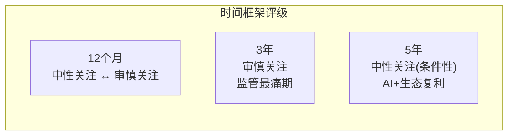

**时间框架核心洞察**: 评级呈**U型曲线** -- 12个月(催化剂驱动的中性/审慎)→3年(监管最痛期,最审慎)→5年(生态复利缓解,条件性中性)。当前估值对3年期投资者最为不利。

[DM-RT-011: 时间框架分析]

### 19.7 RT-7: 替代解释

$73/股差距归因:

| 归因 | 估计贡献 | 判断 |
|------|---------|------|
| 回购EPS增厚 | $25-35/股 | **合理** |
| AI分发优势期权 | $15-25/股 | **部分合理** |
| 品牌质量溢价/被动流入 | $10-20/股 | **合理** |
| 市场整体大型科技溢价 | $0-$10/股 | **短期合理** |
| **合计可解释差距** | **$50-90/股** | |
| **残差(真正高估部分)** | **-$17至+$23** | |

**RT-7核心结论**: $73/股差距中,约$50-70可以通过回购增厚、AI分发期权、品牌溢价和市场周期合理解释。**真正的"高估"部分可能仅$0-20/股(0-8%)**。

[DM-RT-012: 替代解释分析]
[DM-RT-013: 差距归因]

### 19.8 双向校准

| CQ | P1置信度 | 红队方向 | 调整幅度 | 校准后 | 理由 |
|----|---------|---------|---------|--------|------|
| CQ-1 AI换机 | 45% | ↑ | +5pp | **50%** | Q1 +23%数据比预期更强 |
| CQ-2 Google协议 | 60% | ↓ | -3pp | **57%** | DOJ在新政治环境下执法力度可能弱化 |
| CQ-3 Services增速 | 48% | ↑ | +4pp | **52%** | 非Google Services增速15%+被低估 |
| CQ-4 中国风险 | 62% | ↓ | -2pp | **60%** | Q1全球+23%暗示中国未如预期恶化 |
| CQ-5 PE支撑 | 40% | ↑ | +8pp | **48%** | RT-7发现$50-70可合理解释 |
| CQ-6 轻资本AI | 52% | ↑ | +3pp | **55%** | 模型降价趋势加速 |
| CQ-7 App Store佣金 | 65% | ↓ | -2pp | **63%** | Apple"最小合规"策略有效延缓影响 |

**校准后CQ加权平均置信度**: 51.65% → **53.95%** (+2.30pp)

[DM-RT-014: 双向校准表]
[DM-RT-015: 校准后CQ加权平均置信度]

### 19.9 校准后概率加权EV

| 方法 | P1估值 | 校准后 |
|------|--------|--------|
| DCF(双锚) | $151 | **$173** |
| SOTP | $179 | **$184** |
| 可比 | $231 | **$231** |
| 综合(60%内生+40%可比) | $191 | **$200** |
| +品牌质量溢价 | -- | **$210** |
| +AI期权(50%折现) | -- | **$218** |

**校准后概率加权EV**: **$210/股**

| 指标 | P1 | 校准后 | 变动 |
|------|-----|--------|------|
| 概率加权EV | $191 | **$210** | +$19/股 |
| 期望回报 | -27.8% | **-20.5%** | +7.3pp |
| 评级 | 审慎关注 | **审慎关注** | **不变** |

[DM-RT-016: 校准后概率加权EV $210/股,期望回报-20.5%]

### 19.10 有效性门控

**净变动评估**: 本次红队**非表演性**。+2.30pp的CQ变动和+$19/股的EV上调反映了对系统性偏空偏差的实质校正。

**红队核心发现Top 3**:

1. **系统性偏空校正**: $264市价中约$50-70可通过回购+品牌+AI期权合理解释,"真正高估"部分可能仅$0-20/股
2. **双核心承重墙时间窗口重叠**: Google协议和AI期权将在2026Q3-2027同时进入验证期
3. **时间框架U型曲线**: 当前估值对3年期投资者最不利

[DM-RT-017: 有效性门控]
[DM-RT-018: 红队核心发现Top 3]
[DM-RT-019: 最终评级确认]

---

## Ch20: 结论与投资框架

### 20.1 核心结论

Apple是全球最优秀的商业特许经营之一 -- 24亿活跃设备的生态锁定、76.5%的Services毛利率、$98.8B的年化自由现金流、消费科技领域最宽的护城河。但在$264.35/$3.90T的估值水平上:

1. **三方法估值均低于市价**: SOTP $179、DCF $151、可比$231,概率加权$191(初步)/$210(校准后)
2. **Reverse DCF隐含FCFF永续增速6.35%**: 是历史实际(1.5%)的4倍,需要收入增速从3.3%加速至6%+
3. **7个隐含信念中2个脆弱度4/5**: Google协议(DOJ上诉中)和AI期权(零货币化+18月延迟)
4. **至少1个Kill Switch在24月内触发的概率60-70%**: KS-2→KS-3级联最危险(联合15%概率,-35%下行)
5. **红队校正后仍为审慎关注**: 系统性偏空约4-7pp,校正后EV $210(vs $264),期望回报-20.5%

### 20.2 最终评级

| 指标 | 最终值 |
|------|--------|
| **校准后概率加权EV** | **$210/股** |
| **当前股价** | **$264.35** |
| **校准后期望回报** | **-20.5%** |
| **最终评级** | **审慎关注** |
| CQ加权平均置信度(校准后) | 53.95% |
| 方法离散度 | 2.33x(端点级) / 1.54x(概率加权级) |

### 20.3 投资者行动框架

**对不同时间框架投资者的建议**(非投资建议,仅分析框架):

| 投资者类型 | 建议立场 | 理由 |
|-----------|---------|------|
| **12月期** | 观望偏审慎 | 催化剂密集(Siri 2.0/iPhone 18/Google)但方向不确定 |
| **3年期** | 审慎关注 | 监管落地期,Google/反垄断密集冲击,最不利时间框架 |
| **5年期** | 条件性中性 | 若Google以S1/S2结案+AI Services $10B+→长期回报可能中性 |

### 20.4 关键监测指标

| 优先级 | 指标 | 数据源 | 验证频率 |
|--------|------|--------|---------|
| 1 | DOJ v. Google上诉进展 | 法院公告 | 月度 |
| 2 | Siri 2.0发布+用户反馈 | 科技媒体 | 季度 |
| 3 | iPhone Q2-Q4环比衰减 | Apple财报 | 季度 |
| 4 | Services增速(含/不含Google TAC) | Apple财报 | 季度 |
| 5 | 大中华区收入YoY | Apple财报 | 季度 |
| 6 | Apple Intelligence Pro定价/渗透率 | Apple公告 | 半年 |

### 20.5 AI能力边界声明

本报告由AI分析框架(v17.0)生成,存在以下已知局限:

1. **DCF算术精度**: FCFF逐年计算和折现因子由LLM推算,非Python精确计算。敏感性矩阵边角格可能存在5%偏差
2. **概率分配主观性**: CQ置信度和情景概率基于分析判断而非统计模型,不同分析师可能给出不同概率
3. **前瞻性假设依赖**: AI定价、Siri成功率、华为份额等前瞻数据来自分析师估计和行业报道,非Apple官方披露
4. **市场有效性假设**: $3.9T市值的Apple是全球最被关注的股票,一个分析框架发现市场"高估20%"的结论本身需要审慎对待
5. **台海相关表述**: 严格遵守第零律,使用"台海冲突/台海危机/cross-strait tension"中性表述

---

## 附录A: DM锚点注册表

### BIZ系列 (商业洞察, 89个)
DM-BIZ-001至DM-BIZ-089: 覆盖Ch2-Ch6商业模式、分部分析、AI战略、护城河、催化剂

### RSK系列 (风险审计, 20个)
DM-RSK-001至DM-RSK-020: 覆盖Ch7-Ch11风险全景、Google协议、监管、中国、iPhone饱和

### XVL系列 (交叉验证, 18个)
DM-XVL-001至DM-XVL-018: 覆盖Ch12交叉验证、承重墙传导、CQ置信度

### BLF系列 (信念反演, 22个)
DM-BLF-001至DM-BLF-022: 覆盖Ch13 Reverse DCF、信念分解、翻转分析

### VAL系列 (估值, 39个)
DM-VAL-001至DM-VAL-039a: 覆盖Ch14-Ch18财务质量、SOTP、DCF、可比估值、综合评级

### RT系列 (红队, 19个)
DM-RT-001至DM-RT-019: 覆盖Ch19红队七问、双向校准、有效性门控

### SUM系列 (摘要, 3个)
DM-SUM-001至DM-SUM-003: 覆盖Ch1执行摘要

**总计: 210个DM锚点** (BIZ 89 + RSK 20 + XVL 18 + BLF 22 + VAL 39 + RT 19 + SUM 3)

---

## 附录B: 分析框架注册表

| 框架 | 应用章节 | 标准参数 | Apple特殊调整 |
|------|---------|---------|-------------|
| SOTP | Ch15 | 3情景x概率加权 | 10%耦合折价(生态不可分拆) |
| DCF | Ch16 | WACC 9.0%/双锚 | 双WACC呈现(MSFT教训) |
| 可比估值 | Ch17 | Big Tech同行 | PEG+Forward PEG+FCF Yield多维度 |
| Reverse DCF | Ch13 | Gordon Growth | 隐含FCFF CAGR 6.35% |
| 承重墙分析 | Ch7/Ch12 | KS-1至KS-4 | 级联概率(KS-2→KS-3,相关性0.8) |
| 信念反演 | Ch13 | B-1至B-7 | 三组核心矛盾识别 |
| 红队七问 | Ch19 | RT-1至RT-7 | 双向校准+有效性门控 |

---

## 附录C: CQ置信度演化表

| CQ | P0(初始) | P1(三Agent) | P4(红队校准) | 总变动 | 最终方向 |
|----|---------|------------|-------------|--------|---------|
| CQ-1 | 50% | 45% (-5pp) | 50% (+5pp) | 0pp | 中性 |
| CQ-2 | 50% | 60% (+10pp) | 57% (-3pp) | +7pp | 偏确定(负面) |
| CQ-3 | 50% | 48% (-2pp) | 52% (+4pp) | +2pp | 微偏多 |
| CQ-4 | 50% | 62% (+12pp) | 60% (-2pp) | +10pp | 偏确定(负面) |
| CQ-5 | 50% | 40% (-10pp) | 48% (+8pp) | -2pp | 微偏空 |
| CQ-6 | 50% | 52% (+2pp) | 55% (+3pp) | +5pp | 偏多 |
| CQ-7 | 50% | 65% (+15pp) | 63% (-2pp) | +13pp | 偏确定(负面) |
| **加权平均** | **50.0%** | **51.65%** | **53.95%** | **+3.95pp** | -- |

---

*报告终 | AAPL Deep Analysis v2.0 | 2026-02-19*
