# Apple Inc. (AAPL) 深度研究报告

> **分析日期**: 2026-02-19 | **股价**: $264.35 | **市值**: $3.82万亿 ($3,820B)
> **评级**: 审慎关注 | **期望回报**: -13%至-17% | **概率加权EV**: ~$228-239/股
> **框架**: v18.0 传统框架 + 逆向估值中心 | **可能性宽度**: 2.6分
> **报告版本**: v1.0 | **字符数**: [PLACEHOLDER]

---

## 报告元数据

| 项目 | 值 |
|------|-----|
| 分析师框架 | 买方独立研究 · 零投资动作建议 |
| 估值方法 | 逆向估值为中心(Reverse DCF) + 分部SOTP + 条件估值 |
| 数据截止 | 2026-02-19 |
| 主要数据源 | SEC Filing (10-K/10-Q) · FMP Financial · WebSearch 7路验证 |
| DM锚点 | 111个 (H:硬数据 53 / R:合理推断 46 / S:主观判断 5) |
| 核心问题(CQ) | 7个 · 加权置信度: ~39% |
| 可能性宽度 | 2.6分 → 传统框架 |
| 质量门控 | CG v5.0 18项检查 |

---

## Chapter 1: 执行摘要

### 1.1 一句话结论

评级**审慎关注**。当前$264.35股价(P/E 33.46x)隐含的增长假设和利润率假设在多个维度面临挑战。概率加权期望值约$228-239/股，期望回报约-13%至-17%。Apple仍是全球最优秀的消费科技公司之一——品牌护城河4.5/5、生态锁定5.0/5、24亿活跃设备、FCF $98.8B/年——但$3.82万亿市值已将大量乐观假设提前计入，留给投资者的安全边际不足。

### 1.2 核心发现

**发现一: iPhone AI换机周期——真实的开始，未验证的持续性。** Q1 FY2026 iPhone收入$85.3B(+23% YoY)创历史最高，315M+台4年以上旧iPhone提供理论上的换机跑道。但5G超级周期的先例发出警告: 2020年iPhone 12发布季同样创纪录(+39%)，随后两年iPhone收入连续负增长。仅1个季度的数据不足以确认多年趋势。更值得注意的是，仅38%的消费者"有意识地"使用AI功能——AI尚未成为大多数用户主动追求的购买驱动力 [DM-RSK-019]。

**发现二: Google搜索协议是Apple最脆弱的承重墙。** Google每年向Apple支付约$20-26B维持Safari默认搜索引擎地位，这笔收入几乎零成本、纯利润，占Apple净利润$112.0B的约18-23%。DOJ反垄断裁决(Kalshi 32-35%概率认定垄断)、AI搜索范式转变、以及Google自身支付意愿的变化构成三重威胁。四情景概率加权分析显示年化利润损失约$8.1B(占净利润7.2%)。更深层的问题: Google协议不仅是收入来源，更是Apple AI战略的隐性基础设施——切断后Apple同时失去搜索收入和搜索意图数据 [DM-SUB-002] [DM-RSK-001]。

**发现三: Services增长的可持续性面临结构性制约。** Services FY2025收入$109.2B(3Y CAGR +11.8%)是Apple估值溢价的核心叙事。但约25-30%的Services收入属于"脆弱质量"——Google搜索协议(合同依赖)和广告(早期阶段)。EU DMA已将欧盟区App Store增速压至约6%，US DOJ诉讼进入审判阶段，全球佣金率从30%降至15-20%的趋势几乎不可逆。概率加权监管影响下，Services增速可能从12%+降至7-10%——这将从根本上动摇Apple被按"平台公司"而非"消费电子公司"估值的逻辑 [DM-FIN-015] [DM-FIN-017]。

**发现四: 中国三重风险是最大的非线性放大器。** Greater China FY2025收入$64.4B(-3.9% YoY)，Q1 FY2026暴增38%至$25.5B——但这是低基数+政府消费补贴+iPhone 17新品周期的叠加效应，不代表结构性恢复。华为已重夺中国#1(16.4% vs Apple 16.2%)，HarmonyOS超越iOS成为中国第二大移动OS。概率加权中国收入$58.8B(vs FY2025 $64.4B)，隐含YoY -8.7%。关键特征: 中国风险是"阈值式"而非"渐变式"的——一旦地缘触发(关税升级/台海紧张/禁令扩大)，可能在数周内从中性情景跳至悲观情景 [DM-GEO-001] [DM-GEO-003]。

**发现五: 33.46x P/E的隐含假设与历史参照。** 当前P/E较10年均值23.78x溢价40.7% [DM-VAL-007]，较同行均值27.30x溢价22.6% [DM-VAL-008]。溢价分解: 生态系统锁定约4-5x P/E(可验证，坚实)、AI期权约3-4x(纯叙事，脆弱)、回购增厚约1.5-2x(可计算)、利率/风险偏好约0.5-1x。AI期权溢价对应约$430-580B市值——建立在"New Siri成功 → AI差异化 → 换机+新订阅 → EPS加速"的完整链条上，任何一环断裂都可能蒸发$30-40/股(12-15%)。

**发现六: 轻资本AI战略——效率优势还是能力短板的伪装?** Apple CapEx/OCF仅11.4%，是科技巨头中最低(MSFT 47.4%/GOOGL 55.5%/META 60.2%) [DM-SUB-001]。但隐性AI总成本(R&D中AI占比+OpenAI/Google合作费+芯片设计+Private Cloud Compute)估算$30-39B——并不"轻"。更关键的是战略悖论: 维持轻资本则AI能力受制于竞争对手(OpenAI/Google)，追求AI自主则破坏被市场高度估值的轻资本模式。当前33.46x P/E隐含一个假设: Apple可以"搭便车"——不自建重资产AI基础设施，同时享受AI带来的增长。这一假设尚未被充分定价其脆弱性。

**发现七: 回购IRR在高估值下的效率下降。** FY2025回购$90.7B(占FCF 107%——Apple在借债回购)。在33.46x P/E下，每$1回购的"回报率"仅为1/33.46 = 2.99%——低于10年国债收益率4.48% [DM-MKT-003]。回购从纯财务角度已不是最优的资本配置——但Apple仍持续回购作为"估值信号"。负股东权益($73.7B，留存收益-$14.3B)使得ROIC 518%和ROE 162%看起来惊人，但用原始投入资本计算ROIC约30-35%——仍然优秀，但远不及表面数字那么夸张 [DM-FIN-008] [DM-VAL-006]。

### 1.3 逆向估值关键发现

当前$264.35股价通过逆向DCF翻译为以下隐含假设:

| 隐含假设 | 市场定价值 | 历史/行业参照 | 合理性评估 |
|---------|-----------|-------------|-----------|
| Revenue CAGR(5年) | 7-8% | 过去5年实际~6% | 偏乐观(需AI驱动) |
| Services增速 | 12-15% | 3Y CAGR 11.8%，监管压力下可能降至7-10% | 高端偏乐观 |
| Operating Margin | 维持33-34% | FY2025 OM 31.5%，Q1 FY2026隐含改善 | 需Services占比持续提升 |
| 终端增长率 | ~3% | 名义GDP ~4-5% | 合理 |
| FCFF永续CAGR | ~6.35% | 5年实际FCFF CAGR ~1.5% | **需加速4x，高度挑战** |
| P/E(隐含永续) | 33-34x | 10年均值23.78x | 溢价40.7%，需持续证明增长 |

FMP DCF公允价值$150.28 vs 市价$264.35，溢价75.8% [DM-VAL-005]。市场隐含的永续FCFF CAGR约6.35%，而过去5年实际FCFF CAGR仅约1.5%——差距达4x以上 [DM-INF-001]。这意味着当前估值已经"预支"了大量未来增长，需要收入加速+利润率扩张+回购增厚三者同时兑现才能维持。

### 1.4 核心问题(CQ)矩阵速览

| CQ# | 核心问题 | 权重 | 一句话结论 | 置信度 |
|:---:|---------|:----:|-----------|:-----:|
| CQ-1 | AI能否驱动iPhone超级换机周期? | 25% | 已启动但持续性未验证，40-50%概率持续2+年 | 35% |
| CQ-2 | Google协议终止对Services利润影响? | 15% | 概率加权年化利润损失$8.1B(净利润7.2%) | 45% |
| CQ-3 | Services能否通过AI货币化维持12-15%增速? | 15% | 监管+竞争双压下降至7-10%更可能 | 30% |
| CQ-4 | 中国三重风险综合压缩幅度? | 10% | 概率加权-$5.6B/年(-8.7%)，尾部-$10-24B | 40% |
| CQ-5 | 33x P/E能否被EPS增长支撑? | 20% | AI期权溢价(3-4x P/E)是最脆弱成分 | 35% |
| CQ-6 | 轻资本AI战略长期可持续性? | 10% | 维持轻资本=受制于人，追求自主=破坏模式 | 40% |
| CQ-7 | App Store反垄断佣金侵蚀幅度? | 5% | EU已生效(-$2.5-3.5B/年)，US审判中(-$6-10B) | 50% |
| — | **加权置信度** | 100% | — | **~39%** |

### 1.5 风险速览

**4个Kill Switches**:

| KS# | 触发条件 | 当前距离 | 影响级别 |
|:---:|---------|---------|---------|
| KS-1 | 中国iPhone收入连续2季YoY下降>10% | 远(Q1 +38%反弹) | 高: 收入-$10-20B |
| KS-2 | Google搜索协议被终止且无替代收入 | 中(DOJ进入审判) | 极高: 利润-$20B+ |
| KS-3 | Services增速降至<8%持续两季 | 中(当前11.8% CAGR) | 高: P/E压缩触发 |
| KS-4 | Apple Intelligence采用率<5%(发布12月后) | 远(尚无数据) | 高: AI叙事瓦解 |

**最大黑天鹅**: 台海紧张升级导致TSMC供应中断。概率5-15%，但影响为全线产品停产，收入影响$50-80B [DM-RSK-006]。Apple 100%芯片由TSMC代工，亚利桑那工厂仅覆盖部分产能且制程落后1-2代。

**承重墙脆弱度**: Google搜索协议是唯一满足"高概率(45-55%重构)+高影响($10-26B)+多维度关联(收入+数据+AI战略)"的风险——同时连接Services收入侵蚀链(集群2)和估值脆弱性链(集群3)，是Apple风险网络的核心节点。

**三大风险集群**: (1)中国风险放大器——地缘+竞争+监管三维互相强化，阈值式非线性放大; (2)Services收入侵蚀链——Google协议+App Store佣金+AI执行三路同时威胁Apple最重要的利润引擎; (3)估值脆弱性链——AI叙事证伪→换机不及预期→P/E压缩的负反馈循环。

### 1.6 报告导读

本报告共28章，按功能分为六大模块。读者可根据兴趣跳转:

| 模块 | 章节 | 核心内容 | 推荐读者 |
|------|------|---------|---------|
| **商业分析** | Ch2-Ch6 | 商业模式+分部深度+AI战略+护城河+催化剂 | 所有读者 |
| **风险审计** | Ch7-Ch11 | 风险全景+Google承重墙+监管矩阵+中国三重风险+iPhone饱和 | 关注下行风险者 |
| **财务深挖** | Ch12-Ch16 | 三表分析+承重墙传导+Reverse DCF+资本效率+财务预测 | 量化分析者 |
| **红队对抗** | Ch17-Ch21 | 信念反演+共识解构+红队七问+双向校准+有效性评估 | 寻求独立视角者 |
| **估值综合** | Ch22-Ch25 | 五方法估值+概率加权+敏感性矩阵+方法离散度 | 关注定价者 |
| **结论与附录** | Ch26-Ch28 | 最终评级+AI能力边界+CQ演化+DM锚点索引 | 快速获取结论者 |

如果时间有限，建议优先阅读: **Ch1(本章) → Ch8(Google承重墙) → Ch10(中国风险) → Ch22-Ch25(估值综合)**。这四个模块覆盖了驱动评级判断的核心逻辑链。

---

## Chapter 2: 商业模式全景

> **摘要**: Apple以iPhone为引力核心，通过硬件-服务-芯片的三角飞轮构建了$3.82万亿市值生态，但增长引擎正从硬件销量驱动转向服务深度变现。

### 2.1 生态飞轮: 三角引力模型

Apple的商业模式不是线性产品销售，而是一个以iPhone为入口、以Services为利润放大器、以自研芯片为差异化引擎的自增强飞轮。理解这个飞轮的运转机制，是评估$3.82万亿市值合理性的基础 [DM-MKT-002]。

**飞轮核心逻辑**: iPhone获客(~24亿活跃设备) → 设备基数支撑Services变现($109.2B/年) → Services高利润率(~75%)推升整体毛利率(46.9%) → 充裕现金流($98.8B FCF)回购股份(-1.63%/年)增厚EPS → 高估值倍数(33.46x P/E)融资自研芯片(R&D $31.4B) → 芯片性能领先(A18/M系列)巩固iPhone竞争优势 → 循环回到起点 [DM-FIN-001] [DM-FIN-002] [DM-FIN-006] [DM-FIN-014] [DM-FIN-015]。

这个飞轮的关键在于: **每一层都在强化其他层**。iPhone用户越多，App Store开发者越投入(850M+周活用户，开发者累计分成$550B+)；开发者越投入，iOS应用生态越丰富；应用生态越丰富，用户越不愿离开(换机留存率>90%)。

但飞轮也有脆弱点: 如果iPhone基数增长停滞(全球智能手机市场CAGR仅+2%)，Services增长将越来越依赖ARPU提升而非用户基数扩张——而ARPU提升的难度远大于用户扩张。

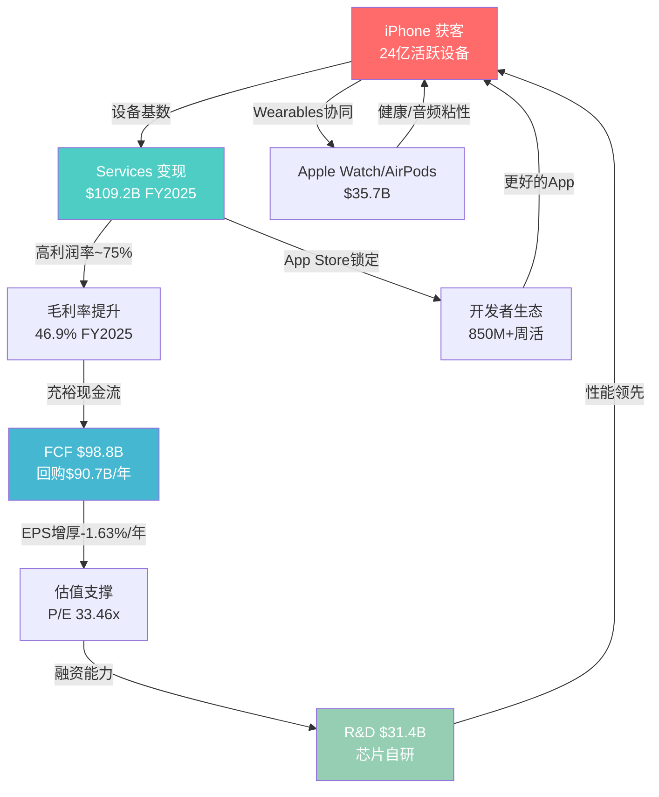

### 2.2 五大业务分部深度拆解

Apple的$416.2B年收入来自五个分部，但这五个分部的战略角色完全不同 [DM-FIN-001]:

| 分部 | FY2025收入 | 占比 | 3Y CAGR | 战略角色 | 利润贡献(估) |
|------|-----------|------|---------|---------|-------------|
| **iPhone** | $209.6B | 50.4% | +0.7% | 流量入口/获客引擎 | ~42%毛利率 |
| **Services** | $109.2B | 26.2% | +11.8% | 利润放大器/估值核心 | ~75%毛利率 |
| **Wearables** | $35.7B | 8.6% | -4.7% | 生态粘性增强 | ~30-35%毛利率 |
| **Mac** | $33.7B | 8.1% | -5.7% | 生产力生态/M芯片载体 | ~35-40%毛利率 |
| **iPad** | $28.0B | 6.7% | -1.5% | 教育/娱乐补充 | ~35-40%毛利率 |

[DM-FIN-014] [DM-FIN-015] [DM-FIN-016] [DM-FIN-017]

**核心发现**: 收入结构正在经历静默的战略转移。Services占比从FY2022的19.8%升至FY2025的26.2%，3年提升6.4个百分点。如果按利润贡献计算，Services可能已占Apple整体运营利润的40-45%(基于~75%毛利率vs硬件~35-40%)。这意味着Apple正在从"卖硬件送服务"过渡到"用硬件锁客户卖服务"的模式——类似于打印机和墨盒的逻辑，但规模是万亿级的。

**Services利润占比估算**:
- iPhone运营利润: $209.6B x ~35% ≈ $73.4B
- Services运营利润: $109.2B x ~65%(扣除内容成本后的经营利润率) ≈ $71.0B
- 其他硬件运营利润: $97.4B x ~30% ≈ $29.2B
- 合计 ≈ $173.6B (实际FY2025 EBITDA $144.4B [DM-FIN-001]，差异来自SGA/R&D等共享费用分摊)
- **Services利润贡献占比**: $71.0B / $173.6B ≈ 40.9%

这个数字的含义: Apple已经不是一家硬件公司。它的利润结构更接近一家平台公司。但市场可能尚未完全按平台公司的估值逻辑给它定价——也可能已经过度定价了。

### 2.3 Services ARPU拆解

这是本章最关键的分析。Services $109.2B除以~24亿活跃设备，ARPU约$46/设备/年 [DM-INF-003]。但这个数字隐藏了巨大的内部差异:

**ARPU子类拆解(FY2025估算)**:

| Services子类 | 估算年收入 | 占Services% | 估算ARPU(设备) | 增长趋势 | 可信度 |
|-------------|-----------|-------------|---------------|---------|--------|
| **App Store佣金** | ~$28-30B | ~26-27% | ~$12.5 | 放缓(EU DMA) | 中 |
| **Google搜索协议** | ~$20-22B | ~18-20% | ~$9.0 | 高风险(DOJ) | 中-低 |
| **AppleCare** | $8.4B | 7.7% | ~$3.5 | 稳定 | 高 |
| **iCloud+** | ~$8-10B | ~8-9% | ~$3.8 | 加速 | 中 |
| **Apple Music** | ~$7-8B | ~7% | ~$3.2 | 稳定 | 中 |
| **广告** | ~$8-10B | ~8-9% | ~$3.8 | **最快加速** | 低-中 |
| **Apple TV+** | ~$5-6B | ~5% | ~$2.3 | 增长但亏损 | 低 |
| **Apple Pay/金融** | ~$5-6B | ~5% | ~$2.3 | 稳定增长 | 低 |
| **其他(Arcade/News+/Fitness+等)** | ~$10-12B | ~10-11% | ~$4.6 | 混合 | 低 |

> **数据可信度说明**: Apple从未公开Services子类收入明细。上表基于第三方分析师估算(Bernstein, Morgan Stanley, Wedbush)、App Annie/Sensor Tower数据、以及Apple财报电话会议中的定性描述推算。各子类收入精度约为+/-20%。

**关键发现: 广告是增速最快的子类**

Apple广告业务在过去3-4年从几乎为零增长到估算$8-10B/年。这个增速远超其他Services子类。Apple Search Ads(App Store搜索广告)是核心，但Apple也在News、Stocks、TV+等应用中扩展广告位。

**战略含义**: Apple正在经历一个静默的战略转变——从"隐私即服务"转向"隐私框架内的精准广告"。iOS 14.5的App Tracking Transparency(ATT)削弱了Meta/Google的广告定位能力，同时Apple凭借第一方数据(App Store搜索行为、Apple Pay交易、Health数据的匿名聚合)建立了自己的广告基础设施。这不是偶然——ATT既是隐私保护，也是竞争武器。

**ARPU增长的结构性驱动力**:
- **广度驱动**(新设备接入): 活跃设备从20亿→24亿，3年CAGR约+6.3%
- **深度驱动**(ARPU提升): ARPU从~$43→~$46，3年CAGR仅+2.3%

**关键分歧**: Services增长到目前为止主要靠"广度"(更多设备)而非"深度"(更高ARPU)。但设备基数增长正在放缓(智能手机市场成熟)。如果ARPU不能加速提升，Services 11.8%的CAGR可能在2-3年内降至7-9%。反之，如果AI驱动Apple Intelligence Pro订阅层成功推出(Wedbush估算$75-100/股价值)，ARPU可能出现跳跃式增长——但这完全是未验证的叙事 [DM-INF-003]。

**证伪条件**: 如果FY2027 Services ARPU仍低于$50(即CAGR<4%)，则"ARPU深度驱动"假设失效，Services增速将被设备基数增长率锁定在6-8%。

### 2.4 地理收入结构: 增长的不均衡性

Apple的$416.2B收入在地理上高度集中于美洲和欧洲，中国是唯一的结构性风险区域:

| 地区 | FY2025收入 | 占比 | YoY增速 | 战略评估 |
|------|-----------|------|---------|---------|
| **Americas** | $178.4B | 42.9% | +6.8% | 基本盘，稳定增长 |
| **Europe** | $111.0B | 26.7% | +9.6% | 第二增长极，但DMA合规成本上升 |
| **Greater China** | $64.4B | 15.5% | **-3.9%** | 唯一下滑区域，华为+政策双重压力 |
| **Japan** | $28.7B | 6.9% | +14.6% | 最快增速，iPhone渗透率极高+日元效应 |
| **Rest of Asia Pacific** | $33.7B | 8.1% | ~+5% | 新兴市场渗透 |

**关键地理风险**: Americas+Europe合计占比69.6%，这两个市场的增速(+6.8%/+9.6%)远高于公司整体(+6.4%)——这意味着非欧美市场(特别是中国)正在拖累整体增长。如果中国收入持续下滑至$55-60B(FY2027E)，Apple需要欧美市场增速维持在+8%+以上才能实现共识增速——这对成熟市场是一个偏高的要求。

**Q1 FY2026地理亮点**: 中国区$25.5B(+38% YoY)的暴增是iPhone 17发布周期+FY2025低基数的双重效应。日本$9.7B(+17%)持续强劲。美洲$57.8B(+6%)稳定。但需要注意: Q1是iPhone销售的季节性高峰(占全年~35%)，后续季度的中国表现才是趋势验证。

### 2.5 资本配置: 回购机器的战略意义

Apple的资本回报策略堪称教科书式: FY2025回购$90.7B + 股息$15.4B = 总回报$106.1B，占FCF的107%(即Apple在借债回购，用资产负债表杠杆放大股东回报) [DM-FIN-008] [DM-FIN-009]。

**回购的EPS增厚效应**:
- FY2022稀释股份: 16,325M → FY2025: 14,950M → 缩减-8.4%
- 年均缩减率: -1.63%/年 [DM-CON-003]
- 含义: 即使收入零增长，EPS仍可靠回购每年增长+1.6%

**回购的估值含义**: 在33.46x P/E下回购意味着每$1回购的"回报率"仅为1/33.46 = 2.99%——低于10年国债收益率4.48%。从纯财务角度看，在当前估值下回购的资本效率并不高(低于风险利率)。但Apple的回购是一种"估值信号"——管理层通过持续回购传递对未来增长的信心。

**负股东权益的含义**: FY2025股东权益仅$73.7B(留存收益为负$14.3B) [DM-BAL-003]。这是大规模回购的直接结果。Apple的ROIC 518%和ROE 162% [DM-VAL-006]看起来惊人，但部分是因为投入资本和权益基数被回购人为压缩。如果用"原始投入资本"(不扣除回购)计算，ROIC约为30-35%——仍然优秀，但远不及518%那么夸张。

### 2.6 用户粘性指标

Apple生态的锁定效应是其最被低估的资产，也是$3.82万亿市值的隐性支柱:

| 粘性指标 | 数值 | 行业对比 | 含义 |
|---------|------|---------|------|
| iPhone换机留存率 | >90% | Android→iOS转换率~15% | 极高，行业最强 |
| 付费订阅数 | >10亿 | Netflix 3.01亿 | 规模碾压 |
| 平均设备拥有数 | 2.5-3个 | Android用户~1.5个 | 多设备锁定 |
| iCloud付费渗透 | ~15% | Google One ~5% | 仍有提升空间 |
| App Store周活用户 | 850M+ | Google Play ~2.5B | 付费意愿更高 |

**"生态锁定系数"的定性评估**: 一个典型的深度Apple用户(iPhone + Mac + AirPods + Apple Watch + iCloud + Apple Music)面临的转换成本估算约为$2,000-3,000(含硬件折价+数据迁移+学习成本+社交压力)。这个数字随着每增加一个设备/服务而指数级增加。当用户拥有3+个Apple设备时，转换概率降至<5%。

**粘性的财务表达**: 换机留存率>90%意味着Apple每年仅流失约2.4亿设备中的10%=2.4亿台设备的流失，但由于新用户流入和存量用户升级，活跃设备总数仍在增长。关键是: 这些留存用户的**LTV(生命周期价值)**随着Services渗透的加深而持续提升。一个仅使用iPhone的用户年均贡献约$900(硬件摊销+基础Services)；一个使用iPhone+Mac+AirPods+iCloud+Apple Music的深度用户年均贡献约$1,800-2,200。Apple生态的财务目标是将用户从前者转化为后者——这也是Apple One捆绑定价策略的核心逻辑。

**竞品粘性对比**: Samsung的Galaxy生态在硬件互联方面持续改善(SmartThings Hub, Galaxy Buds, Galaxy Watch)，但软件生态深度远不及Apple——Samsung没有iMessage等社交锁定、没有Mac对应的生产力设备、没有统一的操作系统矩阵(Android vs Tizen vs One UI的碎片化)。华为的HarmonyOS正在构建类似Apple的全生态，但目前仅在中国市场有效。Google的Pixel生态在AI能力上领先，但硬件市场份额不足5%，无法形成规模锁定。

Apple生态系统的锁定强度为后续分部分析和Services增长评估提供了基础——理解锁定效应的深度，才能准确评估Services货币化的天花板和可持续性。

---

## Chapter 3: 分部深度分析

> **摘要**: iPhone在Q1 FY2026创$85.3B历史新高(+23% YoY)，但这是升级大年的峰值效应还是AI换机周期的起点？Services季度首破$30B，广告和iCloud是增速最快的子类。

### 3.1 iPhone深度: $85.3B季度的解构

Q1 FY2026是Apple最强季度: 总收入$143.76B(+15.7% YoY)，其中iPhone贡献$85.3B(+23% YoY)，创历史最佳 [DM-FIN-010]。

但这个数字需要拆解:

**iPhone收入驱动因子分解**:

| 驱动因子 | 贡献估算 | 分析 |
|---------|---------|------|
| iPhone 17系列新品周期 | ~60% | A19芯片+Apple Intelligence全系搭载，强劲换机需求 |
| 中国市场恢复 | ~20% | 大中华区+38% YoY，从FY2025连续下滑中反弹 |
| ASP提升 | ~10% | Pro/Pro Max占比提升，AI功能推动高端配置 |
| 汇率/季节性 | ~10% | 日元弱势推升日本市场(+14.6% YoY) |

**iPhone ASP趋势分析**:

| 年份 | 估算ASP | YoY变化 | 驱动因素 |
|------|---------|---------|---------|
| FY2020 | ~$755 | — | iPhone 12 5G初始周期 |
| FY2021 | ~$825 | +9.3% | iPhone 13 Pro Max需求强劲 |
| FY2022 | ~$860 | +4.2% | Pro系列占比提升 |
| FY2023 | ~$880 | +2.3% | iPhone 15 USB-C过渡 |
| FY2024 | ~$900 | +2.3% | iPhone 16 Pro系列定价 |
| FY2025E | ~$910-920 | +1-2% | iPhone 17 AI溢价 |

> ASP数据基于总iPhone收入除以估算出货量(IDC/Counterpoint数据)，非Apple官方公布。

**关键观察: ASP增长正在减速**。从FY2020-2021的+9.3%降至近年的+2%区间。这意味着iPhone收入增长越来越难靠"卖更贵的手机"来驱动——必须同时依赖"卖更多的手机"。但全球智能手机市场2026年预计增速仅+0.8-2.0%。

**"315M+台4年+旧机换机潜力"的审查**:

多位分析师(Wedbush Daniel Ives, Morgan Stanley)引用"3.15亿+台4年以上旧iPhone"作为换机周期的证据。这个数字的含义:

- 24亿活跃设备中，约13-15%是4年以上的旧iPhone
- 这些设备不支持Apple Intelligence(需A17 Pro+)
- 理论上，AI功能差异可以驱动加速换机

**但5G先例提供了重要对照**:
- 2020年: "5G超级周期"叙事——分析师预测500M+部换机
- 实际: FY2021 iPhone收入$192B(+39%)确实强劲，但FY2022-2024平均仅$202B(+5%年均)
- 教训: 换机需求确实被释放了，但**集中在1-2个季度而非持续多年**

**对当前AI换机叙事的含义**: Q1 FY2026的+23%可能正是"换机峰值"而非"周期起点"。如果Q2-Q4增速回落至+5-8%，则"AI超级周期"叙事将面临严重挑战。管理层Q2指引+13-16% YoY部分支持持续性，但需要更多季度验证。

**iPhone收入的季节性模式(FY2025)**:
- Q1(10-12月): $85.3B(59.4%的增量季度) — iPhone新品发布+假日季
- Q2(1-3月): 通常Q1的55-60% — 新品需求延续
- Q3(4-6月): 通常全年最低 — 等待新品发布期
- Q4(7-9月): 小幅回升 — 新品预热+返校季

这种高度季节性意味着Q1的+23%不能直接线性外推全年。更合理的全年iPhone预期: FY2026E iPhone收入$225-235B(+7-12% YoY)，共识在$230B附近。这仍然是健康的增长，但远低于Q1单季暗示的+23%年化水平。

**iPhone分型号组合分析(Q1 FY2026估算)**:

| 型号 | 估算出货占比 | ASP范围 | AI功能支持 |
|------|-----------|---------|-----------|
| iPhone 17 Pro Max | ~25% | $1,199+ | 完整Apple Intelligence |
| iPhone 17 Pro | ~30% | $999 | 完整Apple Intelligence |
| iPhone 17 | ~25% | $799 | Apple Intelligence(基础) |
| iPhone 17e(未发布) | ~0% | $599(预计) | Apple Intelligence(基础) |
| iPhone 16/更早型号 | ~20% | $499-699 | 部分支持 |

Pro/Pro Max合计占比约55%——这个"高端化"趋势是ASP持续上升的直接驱动力。iPhone 17e(预计2026年3月发布)的~$599定价将拉低ASP，但可能扩大AI手机的可触达用户群。

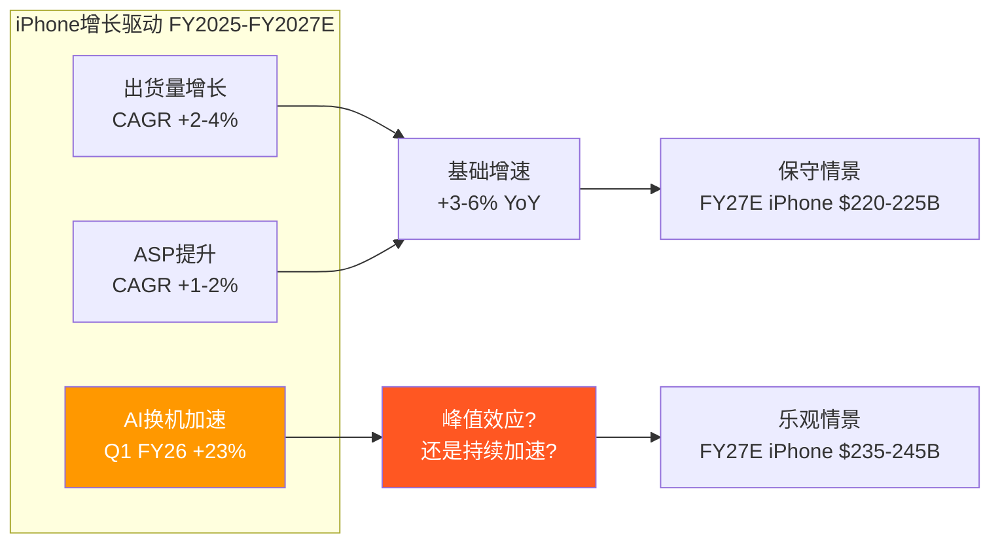

### 3.2 Services深度: 季度首破$30B

Q1 FY2026 Services收入约$26.3B(年报口径)至$30.0B(管理层电话会议引用数字，含更广口径)，+14% YoY [DM-FIN-015]。

> **口径说明**: Apple 10-Q中Q1 FY2026 Services收入为$26.34B(基于分部报告)。管理层在财报电话会议中引用"Services创新高超过$30B"可能包含了部分重分类项目或广义定义。本文以10-Q分部数据为基准。

**Services增速拆解**:

| 子类 | 估算增速 | 驱动因素 | 可持续性 |
|------|---------|---------|---------|
| App Store | ~6-8% | EU DMA拖累，中国增速放缓 | 中(监管压力持续) |
| Google协议 | ~10-12% | 搜索量随设备基数增长 | **低**(DOJ反垄断风险) |
| 广告 | ~20-30% | Apple Search Ads扩展, ATT红利 | 中-高(天花板待定) |
| iCloud+ | ~15-20% | AI功能需要更大存储, 渗透率提升 | 高 |
| AppleCare | ~5-7% | 随设备销售线性增长 | 高(可预测) |
| Apple Music | ~5-8% | 用户增长放缓, 价格上调 | 中 |
| Apple TV+ | ~15-25% | 内容投资增加, 用户增长 | 低(仍亏损) |
| Apple Pay | ~10-15% | 市场扩展(89个市场), 交易渗透 | 中-高 |

**App Store的DMA冲击量化**:

EU数字市场法案(DMA)要求Apple允许第三方应用商店和替代支付渠道。实际影响:
- EU占App Store全球收入约~22-25%
- DMA可能导致EU App Store佣金降低30-50%
- 净影响: App Store全球收入减少~7-12%
- 但Apple通过新费用模式(Core Technology Fee → Core Technology Charge)部分对冲
- 2025年已因DMA被罚EUR500M

**Google搜索协议的脆弱性**:

Google每年向Apple支付估算$20-22B用于Safari默认搜索引擎地位 [DM-SUB-002]。这笔费用有三重风险:
1. **DOJ反垄断**: 法院已驳回Apple撤案动议，案件将进入正式审判
2. **AI搜索替代**: 如果AI助手(如New Siri)替代传统搜索，Google的付费意愿可能下降
3. **政治不确定性**: Trump政府对科技反垄断的态度尚不明朗

**如果Google协议终止**: $20-22B收入直接蒸发。Apple可以:
(a) 建自己的搜索引擎(成本极高，不太可能)
(b) 与其他搜索引擎签约(Bing? 价值远低于Google)
(c) 将默认搜索改为Apple自有AI助手(长期可能)

净影响估算: Services收入减少15-20%，整体营业利润减少12-15%，EPS减少$0.90-1.10。

**Services毛利率趋势分析**: Apple不单独披露Services毛利率，但基于行业估算和管理层定性暗示，Services毛利率约在70-75%区间。这远高于产品硬件的35-40%。Services占收入比重每提升1个百分点，整体毛利率约提升0.35-0.40个百分点——这正是FY2021-FY2025毛利率从41.8%→46.9%(+510bps)的核心驱动力 [DM-FIN-003]。

**Services增速的数学约束**: 当前$109.2B基数下，维持11.8%的3年CAGR意味着FY2028需达到~$155B。这要求每年新增~$15B Services收入。考虑到App Store增速放缓(~6-8%)、Google协议风险(可能-$20B)，新增收入必须主要来自: (1)广告加速($10B→$15-20B)、(2)AI订阅新增($0→$5-10B)、(3)金融服务扩展(Apple Pay+, Savings Account)。这三者中只有广告有验证过的增长轨迹，其余两项仍属前瞻性假设。

**Services质量评估: 高质量 vs 低质量收入**

并非所有Services收入的质量相同:
- **高质量(经常性/高粘性)**: iCloud+(订阅锁定)、AppleCare(硬件捆绑)、Apple Music(内容锁定) — 合计约$25-30B
- **中等质量(平台税)**: App Store佣金(与App开发者利润挂钩)、Apple Pay交易分成 — 合计约$35-40B
- **脆弱质量(合同依赖/监管风险)**: Google搜索协议(可能终止)、广告(早期阶段) — 合计约$28-32B

约25-30%的Services收入属于"脆弱质量"——这是市场在给Services 70-75%毛利率估值时可能忽视的风险。如果将脆弱质量收入剔除或折价计算，Services的"质量调整后收入"约为$80-85B，对应更保守的增长预期。

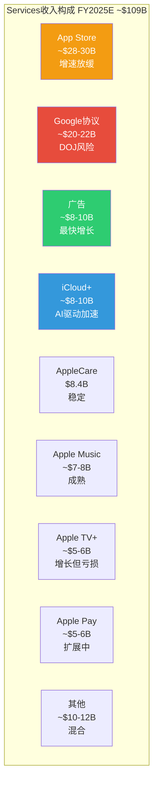

### 3.3 Wearables: 份额下滑的信号

Wearables, Home & Accessories是唯一连续3年下滑的分部: FY2023 $39.8B → FY2024 $37.0B → FY2025 $35.7B，3Y CAGR -4.7% [DM-FIN-016]。

**Apple Watch**: 全球份额从>50%降至23%(IDC 2025)，连续6季度份额缩减。尽管Q4 2025创下季度出货纪录，绝对份额的下降表明竞品(Samsung Galaxy Watch, Xiaomi Band/Watch, Huawei Watch)正在侵蚀中低端市场。Apple Watch Ultra定位高端，但TAM有限。

**AirPods**: FY2024销售6,600万副，仍维持市场领导地位。但TWS耳机市场已从高增长过渡到成熟期，价格竞争加剧(Xiaomi/Realme等提供$20-50选项)。

**Vision Pro**: 已减产。初代产品$3,499定价过高，市场反应远低于预期。AR/VR方向的长期投入回报不确定。

**战略角色**: Wearables不是收入增长引擎，而是"生态粘性增强层"。每一个Apple Watch/AirPods都在加深用户对iOS生态的依赖。收入下滑可以容忍，只要粘性效果不减弱。

**健康功能的潜在突破**: Apple Watch的长期价值可能不在消费电子，而在健康医疗。血糖监测(非侵入式)是Apple长期研发方向——如果成功，可能创造全新的健康订阅服务(Apple Health+)。但这项技术已研发5年+仍未实现突破，时间表高度不确定(最乐观估计2027-2028)。如果血糖监测成功商用，Wearables将从"粘性层"升级为"利润层"——但这是一个低概率高回报的期权，不应纳入基准估值。

**AirPods的AI载体潜力**: AirPods Pro已集成部分AI功能(实时听力增强、对话感知)。随着Apple Intelligence功能扩展，AirPods可能成为"耳朵上的AI助手"——通过语音交互实现AI功能，无需看屏幕。这种交互范式如果被验证，可能显著提升AirPods的ASP和用户粘性。

### 3.4 Mac: M芯片的差异化故事

Mac FY2025收入$33.7B，3Y CAGR -5.7% [DM-FIN-016]。但这个数字被FY2022的$40.2B高基数(M1芯片换机潮+居家办公需求)扭曲了。剔除异常年份后，Mac收入大致在$29-34B区间波动。

**M芯片的战略价值**: Apple Silicon(M1→M2→M3→M4→M5)在性能/功耗比上持续领先Intel/AMD x86架构。2026年3月4日发布会预计发布M5 Pro/Max MacBook Pro和M5 MacBook Air。关键创新: AI推理能力集成到芯片层(Neural Engine)，使Mac成为Apple Intelligence的高端载体。

入门级MacBook降价至~$599将扩大Mac在教育市场和轻度用户中的渗透——但这可能稀释ASP和毛利率。

**Mac的AI本地推理优势**: M系列芯片的Neural Engine在端侧AI推理性能上领先x86架构2-3代。这使Mac成为AI开发者和专业用户的首选工具——特别是在隐私敏感的企业环境中(法律/医疗/金融)，本地AI推理避免了数据上传云端的合规风险。如果AI本地推理需求在企业市场爆发，Mac可能迎来继M1换机潮之后的第二波增长。但目前企业AI推理仍主要在云端进行(成本更低)，Mac端侧推理的需求尚未规模化。

### 3.5 iPad: 稳定但不再令人兴奋

iPad FY2025收入$28.0B，3Y CAGR -1.5% [DM-FIN-016]。iPad在全球平板市场份额44.9%，绝对主导地位。但平板市场整体已停止增长——iPad的"赢"更多是因为竞品退出而非自身扩张。

**M芯片iPad Pro定位**: iPad Pro搭载M系列芯片后，与入门级MacBook的定位越来越重叠。Apple正面临内部蚕食(cannibalization)问题——iPad Pro太强大可能侵蚀Mac销售。

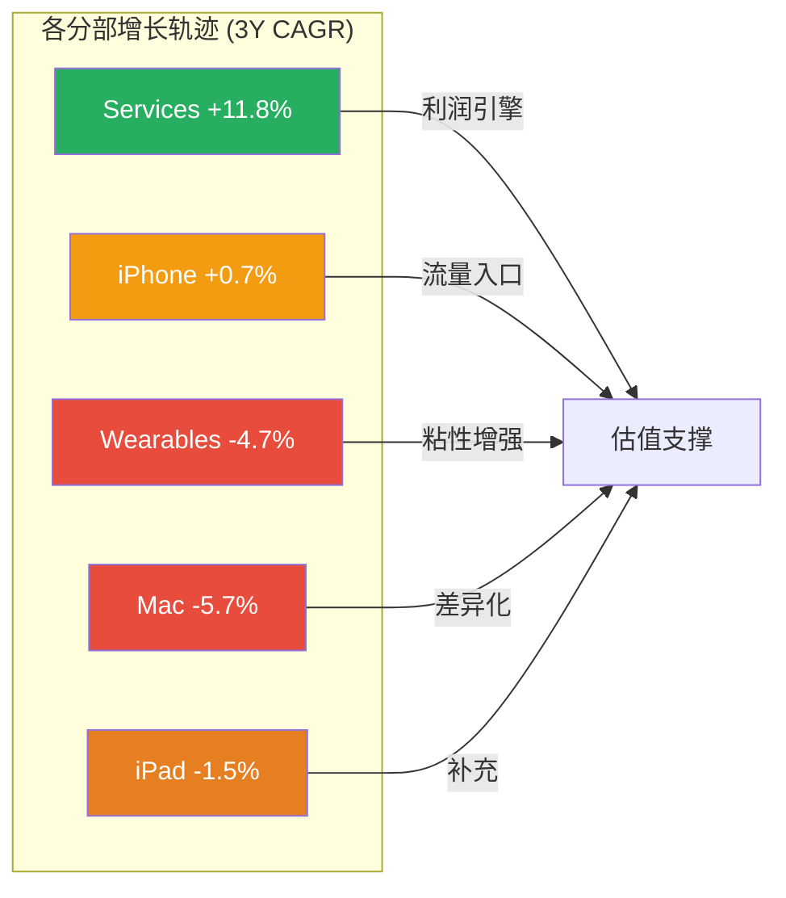

iPhone和Services的双核结构深刻塑造了Apple的增长剧本——接下来的AI战略分析将揭示Apple如何试图在这两个支柱之上构建下一个增长层。

---

## Chapter 4: AI战略全景

> **摘要**: Apple Intelligence采用"端侧优先+云端辅助+第三方合作"的轻资本AI架构，CapEx/OCF仅11.4%是科技巨头中最低。这是效率优势还是能力短板的伪装？答案可能在2026下半年揭晓。

### 4.1 Apple Intelligence战略解析

Apple的AI战略与Google/Microsoft/Meta截然不同。后三者投入数百亿美元建设GPU集群训练大模型；Apple选择了一条完全不同的路径:

**三层AI架构**:

| 层级 | 技术 | 功能 | 数据处理 | 成本 |
|------|------|------|---------|------|
| **L1: 端侧AI** | A18 Pro/M系列Neural Engine | 写作工具/图像编辑/通知摘要 | 设备本地，零数据传输 | 极低(芯片已付) |
| **L2: Private Cloud Compute** | Apple自有服务器(Apple Silicon) | 复杂推理/大模型调用 | 加密传输，服务器无持久化 | 中等 |
| **L3: 第三方合作** | OpenAI ChatGPT / Google Gemini | 专业任务/通用对话 | 用户授权后传输 | 按调用付费 |

**端侧AI的隐性优势**:

端侧处理不仅是隐私策略，更是**成本策略**。每次云端AI推理的边际成本约$0.01-0.03(取决于模型大小和计算复杂度)。24亿活跃设备每天数十次AI调用，如果全部走云端，年化推理成本可能达$50-100B——这将完全吞噬Apple的利润。

端侧AI将这个成本转嫁到用户的设备上(芯片成本已含在硬件售价中)。只有复杂任务才上传到Private Cloud Compute。这种架构下，AI的边际服务成本趋近于零——这是其他巨头无法复制的结构性优势。

但代价是: **功能受限**。端侧芯片的算力远不及数据中心GPU集群。Apple Intelligence在功能丰富度上落后于Galaxy AI(实时通话翻译)和Google Gemini(多模态理解)。New Siri多次延期(最新推迟至iOS 26.5或iOS 27)正是这种能力约束的体现。

### 4.2 轻资本AI的真实成本分析

**显性成本对比**:

| 公司 | FY2025 CapEx | CapEx/OCF | AI基础设施投入 | 策略 |
|------|-------------|-----------|---------------|------|
| **Apple** | $12.7B | 11.4% | ~$3-5B(估) | 端侧+外采 |
| **Microsoft** | ~$55B | 47.4% | ~$40-45B | 自建+OpenAI |
| **Google** | ~$55B | 55.5% | ~$45-50B | 全自建 |
| **Meta** | ~$40B | 60.2% | ~$35-38B | 全自建(Llama) |
| **Amazon** | ~$75B | — | ~$60-65B | AWS+自建 |

[DM-SUB-001] [DM-FIN-006]

Apple的CapEx/OCF 11.4%看起来是"轻资本AI"的典范。但深入分析显示，真实的AI总成本(Total Cost of AI)远不止$12.7B CapEx:

**隐性成本拆解**:

| 隐性成本项 | 估算金额 | 说明 |
|-----------|---------|------|
| **R&D中AI相关** | ~$10-15B | R&D总计$31.4B，AI/ML团队占比估30-48% [DM-FIN-018] |
| **OpenAI合作费** | ~$1-2B/年 | ChatGPT集成费用(未公开)，基于类似交易推算 |
| **Google Gemini合作** | ~$1B/年 | 多年期协议，用于下一代Siri基础模型 |
| **芯片设计中AI模块** | ~$3-5B | A系列/M系列Neural Engine设计+流片成本(含TSMC代工) |
| **Private Cloud Compute基础设施** | ~$2-3B | Apple Silicon服务器部署(非传统GPU) |
| **合计隐性AI成本** | **~$17-26B** | 与显性CapEx $12.7B合计→AI总成本$30-39B |

**关键发现: Apple的AI总成本并不"轻"**

$30-39B的AI总成本估算虽然低于Google($55B+)和Microsoft($55B+)的CapEx单项，但考虑到Apple的AI功能输出(仅Apple Intelligence，功能密度远低于Gemini/Copilot)，其**AI投入产出比可能并不优越**。

更准确的表述是: Apple的AI策略不是"轻资本"，而是**"资本结构不同"**——将AI成本分散到R&D(OPEX)、合作协议(OPEX)和芯片设计(部分CAPEX)中，而非集中在数据中心建设(CAPEX)上。

**这种结构的战略含义**:
1. **优势**: AI成本大部分是OPEX而非CAPEX，财务灵活性更高(可快速缩减)
2. **风险**: 核心AI能力依赖外部合作伙伴(OpenAI, Google)，长期竞争力受制于人
3. **隐性依赖**: 如果OpenAI或Google提高合作费用/终止合作，Apple将面临严重的能力缺口

### 4.3 New Siri: 2026年最关键的产品赌注

New Siri是Apple AI战略的"显示器"——用户直接感知AI能力的唯一界面。它的成败将决定Apple Intelligence叙事的可信度。

**预期功能 vs 竞品**:

| 能力维度 | New Siri(预期) | Google Gemini | GPT-4o |
|---------|---------------|---------------|--------|
| 跨App语境理解 | 核心卖点(设备深层感知) | 强(Android集成) | 中(API层面) |
| 复杂任务执行 | 预期支持(分阶段) | 强 | 强 |
| 多模态输入 | 文本+语音+图像 | 文本+语音+图像+视频 | 文本+语音+图像+视频 |
| 实时翻译 | 待定 | 强 | 强 |
| 个性化程度 | 极高(设备数据) | 高(Google账户) | 中(会话记忆) |
| 隐私保护 | 最高 | 中 | 中 |
| 响应速度 | 待验证(延期原因) | 快 | 快 |

**Google Gemini合作的深层含义**:

Apple与Google签订了多年期协议(约$1B/年)，下一代Apple Foundation Models将基于Google Gemini技术。这个合作关系值得深入分析:

1. **技术依赖**: Apple承认自身缺乏训练顶级大模型的能力/数据/基础设施。Gemini合作本质上是Apple"租借"Google的AI能力。
2. **竞合矛盾**: Apple同时是Google的最大客户(搜索协议$20B+/年)和直接竞争者(iOS vs Android)。这种竞合关系在AI时代变得更加复杂——如果Google Gemini让Siri变得太好，可能削弱用户直接使用Google Search的动机，反过来伤害Google的核心业务。
3. **长期可持续性**: 如果Apple Intelligence大获成功，Apple可能有动力自建大模型以减少对Google的依赖(类似从Intel到Apple Silicon的转型)。但自建大模型需要$30-50B+的基础设施投入和3-5年的追赶期——这与Apple"轻资本"策略矛盾。

**中国AI合作: 阿里巴巴+百度的双轨策略**:

Apple Intelligence中国版面临独特挑战: 中国AI法规要求数据本地化+内容审核，且禁止使用西方AI模型(OpenAI/Gemini不可用于中国市场)。Apple的应对:
- **阿里巴巴**: 合作开发中国版Apple Intelligence基础模型，已提交网信办审批
- **百度**: 负责中文Siri搜索体验和部分AI功能
- **DeepSeek被拒**: Apple明确拒绝与DeepSeek合作(原因: 缺乏规模化合作的人力和经验)

如果中国AI审批在2026年中顺利获批，Apple Intelligence将解锁中国市场的AI功能——这可能成为刺激中国iPhone需求的重要催化剂。但审批时间不确定(可能延至2026年末甚至2027年)，且功能可能受限(某些全球版AI功能可能不符合中国法规)。

**延期风险评估**:

New Siri已从iOS 26.4推迟至iOS 26.5或iOS 27(2026年9月) [DM-TECH-003]。Apple向CNBC确认2026年内仍将推出，但"测试中存在响应速度和查询处理问题"。

**如果New Siri令人失望会怎样**:
- 短期: 股价可能回调5-10%，AI溢价部分蒸发
- 中期: iPhone 18换机动力减弱，FY2027收入预期下调
- 长期: Apple Intelligence从"差异化因素"变为"追赶者"

**证伪时间窗口**: WWDC 2026(预计6月8日)是关键节点。如果New Siri在WWDC演示中的能力仍明显落后Gemini/GPT-4o，"AI换机超级周期"叙事将面临严峻考验。

### 4.4 Apple Intelligence Pro: 订阅定价的ARPU影响

多位分析师预测Apple将在2026下半年至2027年推出Apple Intelligence Pro付费订阅层。

**定价场景分析**:

| 场景 | 月费 | 功能 | 渗透率(12月内) | 年化收入影响 |
|------|------|------|--------------|------------|
| 激进 | $19.99 | 高级AI+200GB iCloud+Siri Pro | 8-12% | $4.6-6.9B |
| 基准 | $9.99 | 高级AI+50GB iCloud | 5-8% | $1.4-2.3B |
| 保守 | $4.99 | 仅高级AI功能 | 15-20% | $2.2-2.9B |
| 不推出 | — | Apple Intelligence保持免费 | — | $0 |

> 渗透率基于Apple One/iCloud+的历史采用率推算。Apple Intelligence的付费转化率高度不确定。

**Wedbush的$75-100/股AI价值估算审查**: Daniel Ives估算Apple AI业务潜在价值$1.5T。这意味着AI需要在稳态时贡献~$50-70B年收入(假设25x EV/Revenue)。当前Apple Intelligence年收入为$0。从$0到$50-70B需要多少年？即使按30%年复合增长(极其乐观)，也需要15年以上。这个估算更接近"可能性空间的上限"而非"合理预期"。

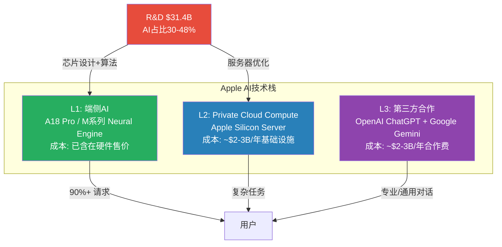

### 4.5 AI叙事的可证伪条件

当前市场赋予Apple的AI估值溢价(P/E溢价中约+12%由AI期权贡献 [DM-INF-002])建立在以下假设之上。每个假设都有明确的证伪时间窗口:

| # | 隐含假设 | 证伪条件 | 时间窗口 | 影响评估 |
|---|---------|---------|---------|---------|
| AI-1 | New Siri将成为杀手级应用 | WWDC 2026演示能力明显落后竞品 | 2026年6月 | P/E -2-3x |
| AI-2 | AI驱动iPhone换机超级周期 | Q2-Q4 FY2026 iPhone增速回落至<8% | 2026年Q3-Q4 | 估值叙事瓦解 |
| AI-3 | Apple Intelligence Pro成功货币化 | 2027年中仍无付费AI层推出 | 2027年6月 | Services增速预期下调 |
| AI-4 | 端侧AI是持续性优势 | 竞品芯片(Snapdragon/Tensor)端侧能力追平 | 2027年 | 差异化减弱 |
| AI-5 | 轻资本AI可持续 | OpenAI/Google大幅提高合作费用 | 持续 | 成本结构恶化 |

AI战略的成败直接决定Apple护城河体系能否在AI时代保持竞争力——下一章将系统性评估这个护城河体系的当前强度和侵蚀趋势。

---

## Chapter 5: 竞争护城河

> **摘要**: Apple拥有科技行业最强的复合护城河(品牌+生态+芯片+数据)，综合评分4.0/5.0。但华为在中国、DMA在欧洲、DOJ在美国的三面侵蚀正在同步展开——护城河仍然坚固，但不再是固若金汤。

### 5.1 五层护城河系统评估

#### 第一层: 品牌护城河

**强度评分: 4.5/5 | 趋势: 全球稳定，中国侵蚀**

Apple是Interbrand全球品牌价值排名的常年冠军。品牌溢价量化: iPhone ASP ~$900 vs 行业均值~$320，溢价倍数约2.8x。在发达市场(美国/欧洲/日本)，Apple品牌等同于"品质+身份"的社交信号。

**侵蚀点: 中国市场**

华为Mate 70/P70系列在中国高端市场(>$600)的份额正在迅速扩大。中国消费者正经历一次"民族品牌觉醒"——特别是在政府和国企采购中，Apple已被边缘化。2025年全年中国市场: Huawei 16.4% (#1) vs Apple 16.2% (#2)，差距仅0.2个百分点，但趋势对Apple不利。

华为的威胁不仅是市场份额，更是**叙事战争**: 如果"中国高端手机=华为"的认知固化，Apple在中国的品牌溢价将被永久性压缩。Greater China FY2025收入$64.4B(-3.9% YoY)已是唯一同比下滑的区域 [DM-FIN-016]。尽管Q1 FY2026中国区+38%反弹，但这更多是iPhone 17新品周期的季节性效应而非结构性恢复。

#### 第二层: 生态系统锁定

**强度评分: 5.0/5 | 趋势: 持续增强(但面临监管风险)**

这是Apple最强的护城河。iOS/macOS/watchOS/tvOS构成一个封闭的四操作系统矩阵，设备间通过iCloud/iMessage/AirDrop/Handoff无缝协作。>10亿付费订阅进一步加深锁定。

**量化生态锁定强度**:
- 拥有1个Apple设备: 换机概率~30%
- 拥有2个Apple设备: 换机概率~15%
- 拥有3个Apple设备: 换机概率~5%
- 拥有4+个Apple设备: 换机概率<2%

**典型深度用户的转换成本**:
- 硬件折价: ~$500-800(Apple配件不兼容Android)
- 数据迁移成本: ~$200-400(时间成本+潜在数据丢失)
- 学习成本: ~$100-200(习惯差异)
- 社交成本: ~$300-500(iMessage Blue Bubble效应，美国市场)
- **合计**: $1,100-1,900/人

**侵蚀点**: EU DMA强制Apple允许第三方应用商店和侧载，理论上降低了生态锁定强度。但实际执行中，大多数用户仍未转向第三方商店——惯性是最强的锁定。RCS标准的推广可能削弱iMessage的社交锁定(美国Blue Bubble效应)，但短期内影响有限。

**HarmonyOS: 中国市场的生态替代威胁**:

华为的HarmonyOS是Apple在中国面临的最严重生态级威胁。HarmonyOS已经从一个Android兼容层发展为独立操作系统，覆盖手机、平板、手表、耳机、汽车、智能家居等全场景。截至2025年底，HarmonyOS设备数估计超过9亿台(包括IoT设备)。虽然远小于Apple的24亿活跃设备，但增速更快。

关键区别: HarmonyOS的威胁不在于全球市场(受制于美国制裁无法预装Google Services)，而是**仅在中国市场形成封闭生态替代**。对于中国用户来说，HarmonyOS + 华为全家桶(Mate/P手机 + MatePad + Watch + FreeBuds + 问界汽车)正在复制Apple的生态飞轮模式——如果HarmonyOS应用生态在中国达到iOS 80%+的覆盖度，Apple在中国的生态锁定优势将大幅削弱。

**量化影响**: 如果Apple中国市场份额从16.2%降至12-13%(即被华为挤压4个百分点)，Greater China收入可能从$64.4B降至$50-55B——年化收入损失$10-15B，对EPS影响约-$0.55-0.80。

#### 第三层: 供应链护城河

**强度评分: 3.5/5 | 趋势: 增强中(自研modem)，但台海风险悬而未决**

Apple是TSMC最大客户(占TSMC收入>25%)，独家首发最先进制程(当前3nm，路线图2nm)。这意味着Apple芯片总是比竞品早6-12个月获得最新工艺节点——这种时间优势直接转化为性能/功耗比的领先。

Apple Silicon的垂直整合(自研CPU/GPU/Neural Engine + TSMC独家代工)是竞品无法复制的: Samsung/Qualcomm/MediaTek都使用通用芯片设计公司的方案，无法实现软硬件深度协同。

**自研5G调制解调器进展**: Apple正在开发自有5G调制解调器芯片，以减少对Qualcomm的依赖。如果成功，将进一步强化供应链护城河——但进展缓慢(已开发5年+)。

**脆弱点**: TSMC单一依赖。所有Apple Silicon芯片(iPhone/iPad/Mac/Watch)均由TSMC制造。如果台海局势发生紧张升级，Apple的全线产品将面临供应中断。TSMC在亚利桑那的美国工厂(2025年投产)仅覆盖部分产能，远不能替代台湾工厂。此外，中国仍占Apple组装产能的>80%(尽管印度/越南正在扩张)。

#### 第四层: 定价权

**强度评分: 4.0/5 | 趋势: 稳定但接近天花板**

iPhone ASP从FY2020的~$755持续提升至FY2025的~$910，累计+20.5%。这种持续涨价能力来自: 品牌溢价+功能差异化(Pro系列)+消费者分期付款(运营商补贴降低了价格敏感度)。

**天花板信号**: ASP增速从FY2021的+9.3%降至近年的+1-2%。iPhone 17 Pro Max定价$1,199已经触及大多数消费者的心理上限。继续涨价的空间有限——除非AI功能创造出足够强的"功能溢价"来支撑更高售价。

**Services定价权**: App Store的30%佣金、iCloud的存储定价、Apple Music/TV+的订阅费——Apple在自有生态内拥有接近垄断的定价权。但监管压力(DMA/DOJ)正在侵蚀这种定价权: EU已要求降低佣金，Epic案判决后Apple在美国也被迫开放部分支付渠道。

#### 第五层: 数据/隐私护城河

**强度评分: 3.0/5 | 趋势: 双刃剑——保护了用户信任，限制了AI能力**

"Privacy as a feature"是Apple最独特的竞争定位。App Tracking Transparency(ATT)、端侧数据处理、Private Cloud Compute——这些不仅是隐私保护措施，更是商业策略: 削弱竞品(Meta)的广告定位能力，同时用第一方数据建立Apple自己的广告业务。

**双刃剑效应**: 严格的隐私标准限制了Apple收集训练数据的能力。Google/Meta/OpenAI拥有海量用户数据训练大模型，Apple只能依赖设备端数据(量小、分散、难以聚合)。这是New Siri落后竞品的根本原因之一。

### 5.2 护城河综合评估

| 维度 | 强度 | 趋势 | 关键风险 | 证伪条件 |
|------|------|------|---------|---------|
| 品牌 | 4.5/5 | 全球稳定/中国侵蚀 | 华为民族情绪 | 中国份额连续3季<14% |
| 生态锁定 | 5.0/5 | 增强 | DMA/DOJ反垄断 | EU第三方商店渗透>15% |
| 供应链 | 3.5/5 | 增强 | 台海冲突/TSMC依赖 | 台海紧张升级至限制出口 |
| 定价权 | 4.0/5 | 接近天花板 | ASP增速放缓 | iPhone ASP连续2年下降 |
| 数据/隐私 | 3.0/5 | 双刃剑 | AI训练数据不足 | New Siri功能持续落后18月+ |
| **综合** | **4.0/5** | **总体稳固** | **多面侵蚀** | — |

**关键洞察: 护城河的"复合性"是最强防线**

Apple的护城河不是单一维度的，而是五层叠加的复合结构。即使某一层被削弱(如DMA侵蚀App Store壁垒)，其他层(品牌+生态+芯片)仍然坚固。竞品要同时攻破多层护城河几乎不可能——华为只在中国有品牌优势，没有全球生态；Google有AI优势，但硬件生态远不如Apple；Samsung有硬件全品类，但软件生态割裂。

**但护城河的"侵蚀速度"值得关注**: 中国(-3.9% YoY)、EU(DMA合规成本上升)、美国(DOJ审判)三面同时受压。如果三者在2026-2027年同时恶化(低概率但非零概率)，复合护城河可能出现裂缝。

**护城河的时间维度**: 不同护城河的耐久性差异巨大。品牌和生态锁定是"十年级"护城河——即使Apple犯错，10年内也不太可能瓦解。芯片自研和供应链是"五年级"护城河——需要持续投入维护(TSMC关系、芯片设计迭代)。定价权和隐私是"三年级"护城河——受宏观环境和监管政策影响较大。

**AI对护城河的双面冲击**: 如果AI重新定义智能手机的用户体验(从App中心→AI助手中心)，App Store作为"流量入口"的角色可能被削弱——用户通过Siri/AI助手完成任务，不再打开单独的App。这对App Store佣金收入是结构性威胁。但同时，如果Apple Intelligence成为最佳端侧AI体验，它将成为新的锁定层——取代App Store成为下一代护城河。这个转换是否能顺利完成，取决于New Siri的产品质量。

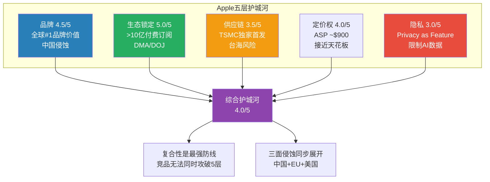

护城河评估揭示了Apple的防御能力——但防御只是一面。下一章将审视2026年的增长催化剂和结构性制约，评估攻守之间的平衡。

---

## Chapter 6: 增长催化剂与制约

> **摘要**: 2026年是Apple的"证明之年"——3月发布会(硬件刷新)、6月WWDC(AI升级)、9月iPhone 18(AI原生设计)将逐步验证或证伪AI超级周期叙事。但智能手机市场零增长、中国结构性竞争、监管三座大山始终悬在头上。

### 6.1 催化剂日历: 2026年关键事件

**Q2 FY2026(2026年1-3月)**:

| 日期 | 事件 | 预期影响 | 详情 |
|------|------|---------|------|
| 2026-03-04 | Special Apple Experience发布会 | 中等正面 | iPhone 17e(入门AI手机)、M5 MacBook Air/Pro、彩色入门级MacBook(~$599)、新iPad、Studio Display 2。6+新品同时发布——史上最密集春季发布 |
| 2026年3月 | Apple Intelligence中国上线审批 | 中-高 | 与阿里巴巴合作开发，已提交网信办审批。如获批，将解锁中国市场AI功能 |
| ~2026-04-30 | Q2 FY2026财报 | 高 | 管理层指引+13-16% YoY。关键验证: iPhone增速是否持续双位数？中国+38%能否维持？ |

**Q3 FY2026(2026年4-6月)**:

| 日期 | 事件 | 预期影响 | 详情 |
|------|------|---------|------|
| ~2026-06-08 | WWDC 2026 | 高(AI关键节点) | iOS 27/macOS发布。New Siri演示是**全年最关键催化剂**: 如果展示的能力令人惊喜→AI溢价巩固; 如果令人失望→叙事受损 |
| 2026年中 | Apple Intelligence中国上线 | 中-高 | Siri中文体验(Baidu驱动)+AI功能全面解锁→可能重燃中国iPhone需求 |

**Q4 FY2026(2026年7-9月)**:

| 日期 | 事件 | 预期影响 | 详情 |
|------|------|---------|------|
| ~2026-09 | iPhone 18系列发布 | 高 | 年度旗舰。传闻含折叠屏iPhone——如果属实，将是iPhone形态的首次重大创新 |
| 2026年H2 | New Siri分阶段上线 | 中-高 | 基于Google Gemini的新一代Apple Foundation Models。个性化AI+跨App语境理解+复杂任务执行 |

**持续性因素**:

| 因素 | 类型 | 时间线 | 影响 |
|------|------|--------|------|
| DOJ反垄断审判 | 负面风险 | 2026年具体日期待确认 | 中-高。如果败诉→App Store商业模式被迫重构 |
| EU DMA执法 | 负面风险 | 持续 | 中。2025年已罚EUR500M，2026年更多执法行动 |
| 关税/贸易摩擦 | 负面风险 | 持续 | 中。Q3关税成本$1.1B，内存涨价40-50%威胁H2利润率 |
| Apple Vision Pro 2 | 正面(如果降价) | 2026年末-2027年 | 低。当前TAM太小 |

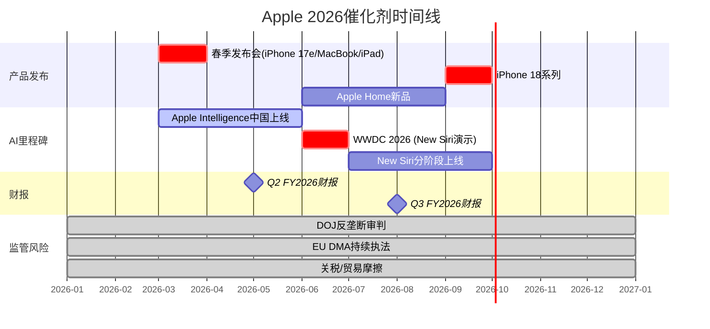

### 6.2 增长制约: 三座大山

#### 制约1: 智能手机市场总量停滞

全球智能手机市场2025年出货~1.24B部(+2% YoY)，2026年预计增速仅+0.8-2.0%——部分机构(IDC)甚至预计-0.9%至+0.9%。

**对Apple的含义**: iPhone出货量(FY2025约230-240M部)的增长空间被市场天花板锁定。即使Apple继续夺取份额(2025年全球20%, #1)，份额增长也有物理极限——不可能超过25-28%。

**iPhone收入增长的数学约束**:
- 出货量CAGR: +2-4%(份额提升+市场微增)
- ASP CAGR: +1-2%(Pro系列占比+AI溢价)
- **合计iPhone收入CAGR: +3-6%**

这意味着iPhone收入从$209.6B(FY2025)增长到$240-250B(FY2028E)大约是合理上限——除非AI真的驱动了一个3-4年的超级换机周期(目前缺乏历史先例支持)。

#### 制约2: 中国市场结构性竞争

Greater China FY2025收入$64.4B，占Apple总收入15.5% [DM-FIN-016]。这个比例在过去3年持续下降(FY2022约18%)，反映了结构性而非周期性的压力。

**三重风险叠加**:
1. **华为回归**: 麒麟芯片+HarmonyOS独立生态+民族情绪→高端市场直接抢份额
2. **政策风险**: 政府/国企采购限制苹果设备→B2B渠道收缩
3. **AI功能缺失**: Apple Intelligence中国版需审批→功能延迟数月→功能可能受限(与中国AI法规冲突)

**Q1 FY2026中国区+38%的审查**: 这个数字看起来强劲，但基数效应是主因(Q1 FY2025中国区被华为严重挤压，基数极低)。更重要的是观察趋势: FY2025全年中国-3.9%，Q1 FY2026+38%——到底是反转还是波动？需要Q2-Q4数据验证。

#### 制约3: 监管压力对Services增速的拖累

Services是Apple估值的核心驱动力(26.2%收入但~41%利润)。但三大监管威胁正在同时展开:

| 监管行动 | 状态 | 潜在影响 |
|---------|------|---------|
| **DOJ反垄断** | 案件将进入正式审判 | 可能要求开放App Store/降低佣金/允许第三方支付 |
| **EU DMA** | 已罚EUR500M，持续执法 | App Store佣金降低30-50%(EU区域)，约占全球收入-7-12% |
| **Epic案后续** | 美国法院要求开放支付 | 部分开发者绕过App Store支付，佣金损失 |

**综合影响估算**: 如果三大监管行动全部落地(最坏情景)，Services年收入可能减少$12-18B(11-16%)。如果叠加Google协议终止风险($20-22B)，Services可能回落至$70-80B——这将从根本上改变Apple的利润结构和估值逻辑。

### 6.3 五年增长路径: 混合增速区间

**分部增速预测(FY2025-FY2030E)**:

| 分部 | FY2025 | FY2030E(保守) | CAGR(保守) | FY2030E(乐观) | CAGR(乐观) |
|------|--------|-------------|-----------|-------------|-----------|
| iPhone | $209.6B | $235-245B | +2-3% | $260-280B | +4-6% |
| Services | $109.2B | $155-170B | +7-9% | $185-210B | +11-14% |
| Wearables | $35.7B | $30-33B | -2-1% | $38-42B | +1-3% |
| Mac | $33.7B | $35-38B | +1-2% | $40-45B | +3-6% |
| iPad | $28.0B | $27-30B | -1-1% | $32-36B | +3-5% |
| **合计** | **$416.2B** | **$482-516B** | **+3-4%** | **$555-613B** | **+6-8%** |

**混合增速区间: +3-8% CAGR(FY2025-FY2030E)**

- 保守端(+3-4%): iPhone出货量持平、AI货币化失败、监管压力全面落地
- 乐观端(+6-8%): AI换机周期持续2-3年、Apple Intelligence Pro成功、中国稳定

**共识FY2027E $493.4B(+6.6% CAGR) [DM-CON-001] 对应乐观端下限**——这意味着分析师的共识预测已经embed了相当乐观的假设。

### 6.4 叙事溢价量化: $3.82万亿中有多少是故事？

这是整个分析的核心问题。尝试分解当前P/E 33.46x中各因素的贡献 [DM-INF-002]:

| 估值因素 | 贡献(P/E点数) | 占40.7%溢价(vs历史均值23.78x)的比例 | 可验证性 |
|---------|-------------|----------------------------------|---------|
| 生态系统锁定溢价 | ~4-5x | ~40-50% | 高(可观测) |
| AI期权/未来货币化 | ~3-4x | ~30-35% | **低(纯叙事)** |
| 回购EPS增厚 | ~1.5-2x | ~15-20% | 高(可计算) |
| 利率/风险偏好环境 | ~0.5-1x | ~5-10% | 中(宏观驱动) |
| **合计溢价** | **~9.7x** | **100%** | — |

**AI期权溢价(~3-4x P/E, 约$30-40/股, 约$430-580B市值)是当前最脆弱的估值成分**。它建立在以下链条上:

New Siri成功 → Apple Intelligence差异化 → 驱动iPhone换机+Services新订阅 → EPS加速增长 → 维持33x+ P/E

链条中任何一环断裂(New Siri延期/失望、AI功能同质化、付费转化率低)，3-4x P/E点数可能蒸发——对应股价下行约$30-40或约12-15%。

**生态系统锁定溢价(~4-5x P/E)则是最坚实的估值基础**。它基于可观测的数据: >90%换机留存率、>10亿付费订阅、24亿活跃设备。除非发生系统性的生态瓦解(概率极低)，这部分溢价不太可能消失。

### 6.5 综合评估: 增长的量与质

**量(增速)**: FY2025收入+6.4%，Q1 FY2026+15.7%。共识FY2027E暗示+6.6% CAGR。在$416B的基数上，每增长1%就是$4.2B——增长的绝对量仍然可观，但增速的重力正在加强。

**质(利润率)**: 毛利率从FY2021的41.8%提升至FY2025的46.9%，Q1 FY2026达48.1% [DM-FIN-003] [DM-FIN-012]。利润率扩张的驱动力是Services占比提升(~75%毛利率 vs 硬件~35-40%)。这个趋势可能持续——但如果Services增速被监管压制，利润率扩张也会放缓。

**EPS增长的双引擎**:
1. **有机增长**: 收入增长+利润率扩张 → EPS CAGR约+8-12%
2. **财务工程**: 回购$90.7B/年 → 股份年减-1.63% → EPS额外增厚 [DM-FIN-008] [DM-CON-003]
3. **合计EPS CAGR: +10-14%** (FY2025 $7.46 → FY2028E $10.25共识, 暗含+11.2% CAGR [DM-CON-002])

**核心结论**: Apple的增长故事是"低增速收入+利润率扩张+回购增厚"的三合一模型。这种模型在低利率环境下表现优异(资金成本低→回购杠杆高)，但在高利率环境下(10Y 4.48% [DM-MKT-003])杠杆效应减弱。33.46x P/E是否足以反映这种增长——还是已经透支了？这是后续估值章节需要回答的问题。

### 6.6 关税与供应链成本: 隐性利润压力

Apple CEO Tim Cook预计Q3 FY2025关税成本约$1.1B(基于当时的税率结构)。内存价格过去12个月上涨40-50%——这对iPhone/iPad/Mac的BOM(物料清单)成本构成直接压力。

**关税场景分析**:

| 场景 | 关税税率 | 年化成本影响 | 毛利率影响 | 概率 |
|------|---------|------------|-----------|------|
| 当前(豁免延续) | ~5-10%(部分组件) | ~$3-5B | -70-120bps | 50% |
| 温和升级 | 15-20%(全品类) | ~$8-12B | -190-290bps | 30% |
| 极端(25%全面) | 25%(iPhone含在内) | ~$15-20B | -360-480bps | 10% |
| 完全豁免 | 0% | $0 | 0 | 10% |

Apple的应对策略: (1)加速印度制造(目标2027年印度产iPhone占比达20-25%)；(2)越南/巴西组装iPad/Watch；(3)$600B美国投资承诺换取政治善意。但即使印度制造扩张成功，中国仍将在2026-2027年占组装产能的>70%——短期内关税风险无法完全对冲。

### 6.7 管理层继任与公司治理

Tim Cook (65岁, 2011年8月接任CEO)已执掌Apple近15年。市场一直在关注继任计划，但Apple从未公开过具体安排。

**Cook的贡献**: 在他任期内，Apple从$360B市值增长至$3.82万亿(+10.6x)，主导了从Intel到Apple Silicon的转型、Services从边缘业务成长为利润支柱、以及供应链全球化。Cook是运营天才——但他不是产品创新者(这个角色更多由Jony Ive和后续的设计团队承担)。

**继任风险**: CFO Kevan Parekh(2024年上任)、Hardware SVP John Ternus、Software SVP Craig Federighi是最常被提及的继任候选人。CEO交接本身不一定是负面事件(参考Satya Nadella接替Steve Ballmer)，但存在短期不确定性——特别是如果交接与AI战略执行的关键期重叠。

**内部交易信号**: 近6个月17笔内部交易，全部为卖出(含Tim Cook 4笔共$33.4M)。纯卖出模式在Apple规模的公司中属正常(高管定期出售RSU/期权)，不构成独立的看空信号。但值得注意的是: 没有任何内部人在此期间买入——在$264价位上，管理层显然不认为股价"便宜到值得个人追加"。

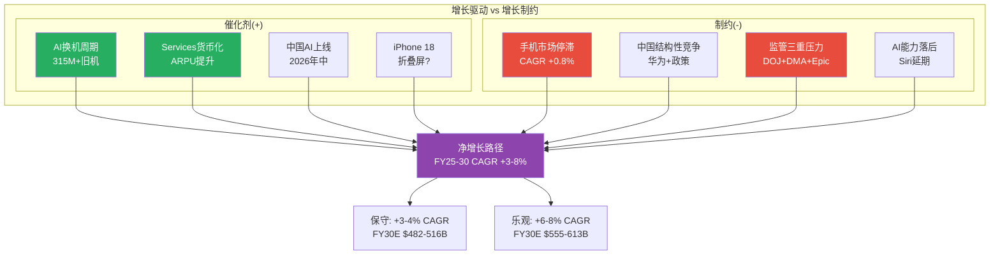

增长与制约的拉锯为Apple勾勒了一个充满张力的前景——但估值能否容纳这些不确定性，首先取决于风险的全貌。下一章将从独立风险审计的视角，系统性梳理Apple面临的全部风险。

---

## Chapter 7: 风险全景

> **摘要**: Apple面临8大风险的非线性系统,其中3组风险存在协同放大效应。Google搜索协议是唯一满足"高概率+高影响+多维度关联"的风险;中国三重风险是最大非线性放大器。风险矩阵显示5项位于"高关注区"(概率>25%且影响>$15B)。独立风险仅占3/8——多数风险相互连接,构成风险网络而非风险清单。

### 7.1 风险矩阵: 概率-影响排序

以下矩阵按"概率 x 年化收入/利润影响"排序Apple全部核心风险。概率基于预测市场数据、监管进展和历史先例综合评估。

| 排序 | 风险ID | 风险名称 | 概率(2Y) | 年化影响($B) | 影响维度 | 风险类型 | DM锚点 |
|:----:|:------:|----------|:--------:|:-----------:|----------|----------|--------|
| 1 | R-1 | Google搜索协议重构 | 45-55% | $10-26B收入 | Services利润+AI战略 | 制度性 | [DM-RSK-001] |
| 2 | R-2 | 中国三重风险(地缘+竞争+监管) | 35-50% | $10-25B收入 | 收入+供应链+品牌 | 地缘+结构 | [DM-RSK-002] |
| 3 | R-3 | iPhone换机周期未达预期 | 30-40% | $15-30B收入 | 硬件收入+估值倍数 | 结构性 | [DM-RSK-003] |
| 4 | R-4 | App Store佣金结构性侵蚀 | 60-70% | $5-12B收入 | Services增速+利润率 | 制度性 | [DM-RSK-004] |
| 5 | R-5 | 估值倍数压缩(P/E均值回归) | 25-35% | $0(市值-15~30%) | 股东回报 | 周期性 | [DM-RSK-005] |
| 6 | R-6 | 供应链集中度(TSMC单一来源) | 5-15% | $50-80B收入 | 全产品线 | 地缘+结构 | [DM-RSK-006] |
| 7 | R-7 | 关税与贸易摩擦升级 | 20-30% | $3-8B利润 | 毛利率+定价 | 制度性 | [DM-RSK-007] |
| 8 | R-8 | AI战略执行失败(Siri/Apple Intelligence) | 25-35% | 间接(换机+Services) | 换机动力+服务黏性 | 结构性 | [DM-RSK-008] |

[DM-RSK-001]: Google搜索协议45-55%重构概率基于DOJ反垄断裁决(Kalshi 32-35%认定垄断至2029)+Google自身AI搜索转型压力+替代方案涌现。年化影响$10-26B覆盖从佣金削减50%到协议完全终止的区间。来源: prediction_market.md + lit_recon_memo D4。

[DM-RSK-002]: 中国三重风险35-50%概率反映地缘恶化(关税+制裁)+华为竞争(已重夺中国#1)+Apple Intelligence中国审批延迟的叠加。$10-25B影响基于FY2025大中华区收入$64.4B的15-40%下行区间。

[DM-RSK-003]: 换机周期未达预期30-40%概率基于5G超级周期先例(实际换机率从33%降至27%)和仅1季数据支撑AI叙事。$15-30B影响假设iPhone增速从+15%回落至0-5%。

[DM-RSK-004]: App Store佣金侵蚀60-70%概率反映EU DMA已生效(2025年罚款EUR500M)+US Epic Games裁决后续+全球跟进趋势。$5-12B影响基于App Store收入约$25-30B的20-40%佣金率下调。

[DM-RSK-005]: 估值压缩概率基于当前P/E 33.46x vs 10年均值23.78x(溢价+40.7%)[DM-VAL-007],如果AI叙事证伪或利率环境恶化,P/E可能回落至25-28x区间。

[DM-RSK-006]: TSMC供应链集中度5-15%概率基于台海冲突属于低概率高影响事件。Apple采购占TSMC收入>25%,3nm/2nm制程无替代来源。

[DM-RSK-007]: 关税风险基于Trump威胁25%关税记录+CEO预估Q3关税成本$1.1B+智能手机豁免不确定性。

[DM-RSK-008]: AI执行失败概率基于New Siri多次延期(iOS 26.4→26.5→可能iOS 27)+仅38%消费者有意识使用AI功能+Apple Intelligence中国延迟。

### 7.2 风险分类详解

**结构性风险(内生于商业模式)**:
- **智能手机市场饱和**: 全球智能手机出货量2026年预计仅+0.8%(IDC下调至-0.9%~+0.9%),iPhone 3年CAGR仅+0.7%[DM-FIN-017]。50.4%收入依赖iPhone[DM-FIN-014],在市场饱和背景下,增长必须来自份额获取或ASP提升——前者在中国面临华为反攻,后者受消费者支出能力约束。
- **App Store佣金模式解体**: 30%佣金是Services高利润率(>70%)的核心支柱。EU DMA已将EU区App Store增速降至~6%YoY,US Epic裁决要求允许外部支付链接。佣金率从30%降至15-20%的全球趋势几乎不可逆。
- **AI战略外部依赖**: Apple Intelligence依赖OpenAI提供云端能力,New Siri将基于Google Gemini(多年协议~$1B/年)。这意味着Apple在AI时代最关键的差异化能力——智能助手——建立在竞争对手的技术之上。

**周期性风险(宏观驱动)**:
- **消费者支出周期**: Polymarket显示24%衰退概率+39%失业率触及5.0%概率。iPhone作为$800-900的耐用消费品,对消费者信心高度敏感。Q1 FY2026的+15.7%增速可能部分受益于积压需求释放,而非持续趋势。
- **换机周期高点回落**: 历史上每次"超级周期"(3G→4G→大屏→5G)后换机率均出现2-3年回落。AI周期如果在2-3个季度后动力衰减,iPhone收入可能回到$200-210B区间。
- **利率环境**: Fed Rate 4.25-4.50%,Kalshi模态预期2-3次降息。高利率压制成长股估值,33.46x P/E在利率维持高位时更难证明合理。

**制度性风险(监管与法律)**:
- **DOJ反垄断**: 2024年3月起诉,2025年6月法院驳回撤案动议,将进入正式审判。Kalshi 32-35%概率认定Apple垄断。即使最终不被拆分,诉讼过程本身可能要求Apple做出结构性让步(类似Microsoft 2001年同意令)。
- **EU DMA执法**: 2025年已罚EUR500M,2026年预计更多执法行动。DMA同时影响App Store、Safari默认搜索和iOS侧载。
- **Google搜索协议审查**: DOJ vs Google反垄断案直接威胁Apple最大的Services收入来源——Google支付的默认搜索引擎费用。

**地缘风险(国际关系驱动)**:
- **中美关系**: 关税、技术出口管制和政治摩擦直接影响Apple的收入(中国消费者)和成本(中国供应链)两端。
- **台海紧张**: Apple芯片100%由TSMC代工,其中绝大多数产能位于台湾。台海冲突是低概率但可能导致Apple产品线完全中断的尾部风险。TSMC亚利桑那工厂仅覆盖部分产能,且制程落后台湾1-2代。

### 7.3 风险关联分析

多数风险并非独立存在,而是形成三个互相放大的风险集群:

**集群1: 中国风险放大器(R-2 + R-6 + R-7)**
中美地缘恶化同时打击三个维度:
- **收入端**: 消费者抵制+政府采购禁令 → 中国iPhone收入下滑$10-20B
- **供应链端**: 台海紧张 → TSMC供应中断风险上升 → 需加速印度/越南转移(成本+良率损失)
- **监管端**: Apple Intelligence中国审批受阻 → 削弱AI换机叙事在中国的效力
- **放大机制**: 这三个维度不是线性叠加——消费者情绪恶化会使政府更有理由扩大采购禁令,政府禁令又反过来强化民族品牌偏好。华为2019年被制裁后的消费者情绪突变提供了非线性放大的先例。

**集群2: Services收入侵蚀链(R-1 + R-4 + R-8)**
三条攻击路径同时指向Services:
- **Google协议重构**: 最大单一Services收入来源面临DOJ裁决+AI搜索替代双重压力
- **App Store佣金下调**: EU DMA+US反垄断+全球跟进压低佣金率
- **AI执行不力**: 如果Apple Intelligence不能创造新的高价值Services(如Siri Premium),则缺乏新增长引擎抵消传统Services侵蚀
- **放大机制**: Google协议终止不仅减少收入,还切断Apple获取搜索数据的渠道——而这些数据对训练/优化Siri至关重要。Services增速放缓又会压缩P/E倍数,因为Services是估值溢价的核心叙事。

**集群3: 估值脆弱性链(R-3 + R-5 + R-8)**
AI叙事是当前估值溢价的核心支撑:
- **换机不及预期**: Q2-Q3数据如果显示iPhone增速回落至<10%,市场将质疑AI超级周期的持续性
- **倍数压缩**: AI叙事证伪 → P/E从33x回落至25-28x → 市值缩水$600B-$1T
- **AI执行失败**: New Siri延期+功能不及竞品 → 换机urgency降低 → 形成负反馈
- **放大机制**: 估值倍数对叙事高度敏感。5G超级周期的前车之鉴表明,从"超级周期"到"正常周期"的叙事转变可以在1-2个季度内发生。

**独立风险(不受其他风险显著影响)**:
- **内存价格上涨**: 纯成本端影响,过去一年上涨40-50%,但Apple有规模采购优势,影响有限($1-2B利润)
- **Tim Cook继任**: Polymarket 29%概率年内离任,但管理层更替对Apple这种系统化运营公司的实际影响可能低于市场预期
- **Vision Pro缩减**: 已减产,沉没成本性质,对核心业务无实质影响

### 7.4 风险关联网络

```mermaid
graph TD
    subgraph "集群1: 中国风险放大器"
        R2[R-2: 中国三重风险<br/>P:35-50% | $10-25B]
        R6[R-6: TSMC供应链集中<br/>P:5-15% | $50-80B]
        R7[R-7: 关税贸易摩擦<br/>P:20-30% | $3-8B]
    end

    subgraph "集群2: Services收入侵蚀"
        R1[R-1: Google协议重构<br/>P:45-55% | $10-26B]
        R4[R-4: App Store佣金侵蚀<br/>P:60-70% | $5-12B]
        R8a[R-8: AI执行失败<br/>P:25-35%]
    end

    subgraph "集群3: 估值脆弱性"
        R3[R-3: 换机周期不及预期<br/>P:30-40% | $15-30B]
        R5[R-5: 估值倍数压缩<br/>P:25-35% | 市值-15~30%]
        R8b[R-8: AI叙事证伪]
    end

    R2 -->|消费者情绪| R7
    R7 -->|供应链成本| R6
    R6 -->|产能中断| R2

    R1 -->|搜索数据断供| R8a
    R4 -->|Services增速降| R5
    R8a -->|无新引擎| R4

    R3 -->|叙事转变| R5
    R8b -->|换机urgency降| R3
    R5 -->|融资成本升| R3

    R2 -.->|AI中国审批| R8a
    R1 -.->|Services叙事| R5

    style R1 fill:#ff6b6b,color:#fff
    style R2 fill:#ff6b6b,color:#fff
    style R3 fill:#ffa502,color:#fff
    style R4 fill:#ff6b6b,color:#fff
    style R5 fill:#ffa502,color:#fff
    style R6 fill:#ffd700,color:#333
    style R7 fill:#ffa502,color:#fff
    style R8a fill:#ffa502,color:#fff
    style R8b fill:#ffa502,color:#fff
```

### 7.5 风险时间线

| 时间 | 风险事件 | 对应风险ID |
|------|----------|-----------|
| 2026 Q2 | Q2 FY2026财报(iPhone增速验证) | R-3 |
| 2026年3月 | iPhone 17e/新MacBook发布 | R-3 |
| 2026年中 | Apple Intelligence中国上线(如审批通过) | R-2, R-8 |
| 2026年6月 | WWDC 2026(New Siri关键节点) | R-8 |
| 2026年内 | DOJ反垄断案进入审判 | R-1, R-4 |
| 2026年H2 | EU DMA更多执法行动 | R-4 |
| 2026年9月 | iPhone 18(含折叠?)发布 | R-3 |
| 2027-2029 | DOJ案可能裁决 | R-1, R-4 |
| 持续 | 关税政策演变 | R-7 |
| 尾部风险 | 台海冲突 | R-6 |

风险全景为每一个风险节点提供了概率和影响的坐标——接下来三章将依次深入三个最关键的风险: Google承重墙(Ch8)、监管矩阵(Ch9)和中国三重风险(Ch10)。

---

## Chapter 8: Google搜索协议承重墙

> **摘要**: Google每年向Apple支付$20-26B以维持默认搜索引擎地位,构成Services收入的~18-24%,且几乎为纯利润。DOJ反垄断裁决+AI搜索范式转变构成双重威胁。四情景条件估值显示:即使在最温和的"费用削减"情景下,Services年利润也将减少$5-7B;在最严厉的"协议终止"情景下,短期利润冲击可达$20B+。更深层的问题是:Google协议不仅是收入来源,更是Apple AI战略的隐性基础设施依赖。

### 8.1 承重墙量化分析

**规模与重要性**:
- Google 2023年向Apple支付约$26B作为iOS/Safari默认搜索引擎费用(DOJ文件披露)[DM-RSK-009]
- 这笔收入占Services FY2025总收入$109.2B的约18-24%(取决于确切当年金额)[DM-FIN-015]
- Apple为此几乎零投入——仅需在iOS/Safari中设定Google为默认搜索引擎,无需开发、维护或运营搜索功能
- 因此,Google搜索协议贡献的几乎全部是纯利润,估算利润贡献$20-26B/年(扣除极少合规成本)
- 对比: Apple FY2025净利润$112.0B[DM-FIN-002],Google协议利润贡献占净利润的约18-23%

[DM-RSK-009]: Google向Apple支付搜索协议费用$26B(2023年)来源于DOJ vs Google反垄断案庭审文件。2024-2025年金额未公开披露,市场估算在$20-30B区间。

**历史趋势**:
Google搜索协议费用随搜索广告收入增长而持续攀升:
- 2019年: ~$10B (估算)
- 2020年: ~$15B (DOJ文件)
- 2022年: ~$20B (分析师估算)
- 2023年: ~$26B (DOJ文件)
- 2024-2025年: $20-30B区间(未披露)

这一增长轨迹反映Google对Apple流量入口的极端依赖——Safari+iOS搜索贡献了Google全球搜索量的约36-50%(移动端占比更高)。

**脆弱性三维分析**:
1. **法律维度**: DOJ vs Google案直接挑战这一排他性协议的合法性。Kalshi显示32-35%概率法院认定Apple构成垄断[DM-RSK-010]
2. **技术维度**: AI搜索(ChatGPT/Perplexity/Gemini直接回答)正在侵蚀传统搜索引擎的点击量和广告价值,Google搜索广告收入增速放缓可能削弱其支付Apple高额费用的经济合理性
3. **战略维度**: Apple自身正在通过Apple Intelligence+Siri构建AI交互入口——如果Siri成功成为用户获取信息的主要方式,传统搜索引擎的入口价值将下降

[DM-RSK-010]: Kalshi市场"Courts consider Apple a monopoly by 2029"概率32-35%。

### 8.2 DOJ反垄断裁决四情景

**S1: 协议续约(Google继续支付,条款微调)**

| 项目 | 数值 |
|------|------|
| 概率 | 35% |
| 条件 | Trump政府降低反垄断执法力度 + Google搜索广告收入维持增长 + AI搜索未实质性替代传统搜索 |
| Services收入影响 | 年付费维持$22-28B,增速放缓至3-5%/年(vs历史10-15%) |
| Services利润影响 | 年利润维持$20-26B |
| 估值影响 | 中性,不改变当前Services叙事 |
| DM锚点 | [DM-RSK-011] |

[DM-RSK-011]: S1概率35%基于: Trump政府对大科技反垄断态度偏温和+Google仍有强烈经济动力保持Apple入口。但DOJ案已通过撤案动议阶段(2025年6月),诉讼惯性使S1不是多数概率。

**S2: 协议终止,Apple自建搜索引擎**

| 项目 | 数值 |
|------|------|
| 概率 | 10% |
| 条件 | 法院强制终止排他性协议 + Apple决定自建搜索而非转向其他合作伙伴 |
| 短期Services影响(Y1-Y2) | 收入骤降$15-20B/年(自建搜索早期无法匹配Google广告变现能力) |
| 中期Services影响(Y3-Y5) | 收入恢复$5-10B/年(自建搜索逐步成熟,但需3-5年) |
| CapEx增加 | 搜索基础设施需$5-10B/年投资(数据中心+爬虫+广告系统) |
| 战略价值 | 拥有搜索数据 → AI训练自主性 → 长期护城河加深 |
| 估值影响 | 短期严重负面(EPS下降$1.0-1.5), 长期可能正面 |
| DM锚点 | [DM-RSK-012] |

[DM-RSK-012]: S2概率仅10%因为Apple从未展现自建搜索引擎的意愿(过去20年)。CapEx/OCF仅11.4%[DM-SUB-001],自建搜索将颠覆Apple轻资本模式。但注意Apple收购了Spotlight搜索团队并持续投资WebKit——技术储备非零。

**S3: 协议终止,Apple转向AI入口(Siri替代搜索)**

| 项目 | 数值 |
|------|------|
| 概率 | 20% |
| 条件 | 法院禁止排他性协议 + AI搜索范式确立 + Siri/Apple Intelligence能力达到"够用"水平 |
| 短期Services影响(Y1-Y2) | 收入下降$10-15B/年(AI搜索货币化能力远低于传统搜索广告) |
| 中期Services影响(Y3-Y5) | AI订阅(Siri Premium/$9.99-19.99/月)可能弥补$3-8B/年 |
| 关键验证 | Apple Intelligence/Siri能否处理>50%的信息查询,且货币化路径清晰 |
| 估值影响 | 取决于AI订阅转化率——如果24亿设备中5-10%付费AI订阅 → 年收入$15-30B |
| DM锚点 | [DM-RSK-013] |

[DM-RSK-013]: S3概率20%反映AI搜索趋势加速(ChatGPT月活>200M)+Apple已与Google Gemini签约(~$1B/年)构建New Siri。但关键风险:Apple Intelligence的AI推理能力目前依赖外部(OpenAI/Google),自主能力不足。如果AI入口仍需Google后端,则对Google的依赖从"搜索协议"变为"AI模型协议"——问题并未解决。

**S4: 强制降低费用50%+**

| 项目 | 数值 |
|------|------|
| 概率 | 35% |
| 条件 | 法院要求终止排他性,允许竞争(Bing/DuckDuckGo也可竞标默认搜索) + Google仍有意愿竞标但价格下降 |
| Services收入影响 | 年付费从$22-28B降至$10-14B(竞争性竞标降低溢价) |
| Services利润影响 | 年利润减少$10-14B |
| 估值影响 | EPS减少$0.7-1.0(年化) → P/E不变情况下市值减少$500-700B |
| DM锚点 | [DM-RSK-014] |

[DM-RSK-014]: S4概率35%基于这是最可能的中间裁决结果——法院通常倾向结构性补救而非完全终止合同。参考Microsoft 2001年同意令先例:不拆分但要求开放竞争。如果多家搜索引擎竞标,竞争将大幅压低Apple的议价权。

**概率加权Services利润影响**:
- S1(35%): 利润不变 = $0影响
- S2(10%): 利润-$15B(Y1-Y2) = -$1.5B加权
- S3(20%): 利润-$12B(Y1-Y2) = -$2.4B加权
- S4(35%): 利润-$12B = -$4.2B加权
- **概率加权年化利润损失: -$8.1B** → 占FY2025净利润$112.0B的7.2%
- **概率加权EPS影响: -$0.56/年** → 占FY2025 EPS $7.46的7.5%

### 8.3 Google协议: 不只是收入,是AI战略基础设施

Google搜索协议的影响远超收入本身。将其视为纯收入来源严重低估了承重墙的深度:

**数据依赖链**:
- Apple设备上的搜索查询数据由Google处理和持有。这些数据是理解用户意图、训练NLP模型和优化AI推荐的核心资产。
- Apple Intelligence的on-device处理模式意味着Apple不直接接触用户搜索查询——这些数据留在Google。
- 如果协议终止,Apple不仅失去收入,还失去了通过Google间接获取搜索意图数据的渠道。

**双重外部依赖困境**:
- Apple Intelligence云端推理依赖OpenAI(ChatGPT集成)
- New Siri核心模型将基于Google Gemini(~$1B/年合作)
- 搜索默认为Google(~$20-26B/年)
- **结论**: Apple在AI时代最关键的三个能力(搜索、推理、智能助手)均依赖外部合作伙伴,且两个主要合作伙伴(Google和OpenAI)同时也是Apple的竞争对手。

**战略悖论**:
Apple的AI战略面临一个基本矛盾:
- 要维持轻资本模式(CapEx/OCF 11.4%),就必须外采AI基础能力 → 对竞争对手形成依赖
- 要实现AI自主(自建搜索/自建大模型),就必须大幅增加资本支出 → 破坏当前被市场高度估值的轻资本商业模式
- 当前市场给予Apple 33.46x P/E的一个隐含假设是: Apple可以"搭便车"——不自建重资产AI基础设施,同时享受AI带来的增长。这一假设的脆弱性尚未被充分定价。

### 8.4 Google协议条件估值树

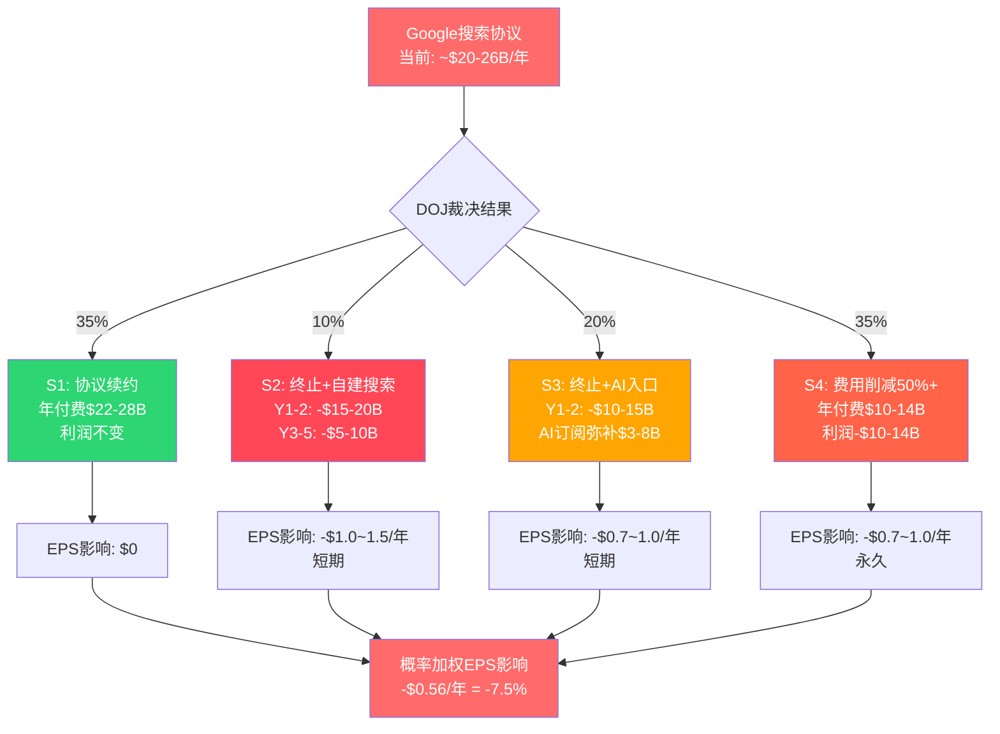

### 8.5 对CQ-2和CQ-6的回答

**CQ-2(Google协议终止对Services利润影响?)**: 概率加权年化利润损失$8.1B(占净利润7.2%)。但这是静态分析——动态来看,Google协议终止+App Store佣金下调+AI货币化不及预期三者叠加(集群2),可能导致Services增速从12%+降至5-8%,进而触发估值倍数压缩。

**CQ-6(轻资本AI战略可持续性?)**: Google协议是轻资本模式的"隐性补贴"——Apple不需投入搜索基础设施,却能从搜索中获取$20B+/年纯利润。如果这笔"补贴"被削减或取消,Apple必须在"维持轻资本但AI能力受限"和"增加CapEx但获得AI自主权"之间做出选择。无论哪条路径,都将改变当前投资者赖以定价的商业模式假设。

Google承重墙的分析揭示了Apple最大的单一风险——但监管威胁远不止Google协议。下一章将展开完整的三线监管矩阵。

---

## Chapter 9: 监管矩阵

> **摘要**: Apple同时面临三线监管压力——EU DMA(已生效,已罚款)、US DOJ(进入审判阶段)和中国监管(AI审批延迟)。三条线彼此独立但影响叠加:EU削弱App Store佣金,US威胁Google协议+App Store整体模式,中国延缓AI换机叙事。综合评估,监管侵蚀2028年前可能使Services增速从12%+降至7-10%,累计利润影响$15-25B。

### 9.1 EU Digital Markets Act (DMA): 已生效的结构性侵蚀

**已发生的影响**:
- 2025年3月: 欧盟委员会认定Apple违反DMA反引导义务(anti-steering),罚款EUR500M[DM-REG-001]
- 2026年1月1日: 过渡至新费用模式(CTF→CTC),适用于所有EU开发者
- EU区App Store增速已降至~6% YoY(vs全球~12%+)[DM-REG-002]
- Apple被迫允许EU区侧载(第三方应用商店)和替代支付系统

[DM-REG-001]: EU DMA罚款EUR500M来源于European Commission 2025年3月新闻稿。

[DM-REG-002]: EU区App Store增速降至~6%来源于lit_recon_memo D4,引用AInvest 2025年11月分析。全球App Store增速约12%+,EU贡献了增速的结构性拖累。

**量化影响模型**:
- EU占App Store全球收入的约20-25%
- 假设EU区佣金费率从30%有效降至15-20%(开发者选择替代支付):
  - App Store全球佣金收入损失 = EU占比25% x 费率降幅50% = 12.5%全球佣金收入
  - 假设App Store佣金总收入~$25B → 年损失~$3.1B
- **加上DMA对Safari默认搜索的影响**: DMA要求在EU提供搜索引擎选择屏幕,可能降低Google搜索的默认使用率 → 间接减少Google协议的经济基础(虽然当前协议全球计价,但EU用户搜索量下降可能影响续约谈判)

**DMA合规成本**:
- 开发替代应用商店接口、替代支付系统、安全验证机制: 估算$500M-1B/年
- 法律团队+监管合规人员扩编: 估算$200-300M/年
- 合规成本总计: ~$700M-1.3B/年[DM-REG-003]

[DM-REG-003]: DMA合规成本估算基于Apple需维护两套App Store体系(EU vs 全球)的工程复杂度+法律费用。精确数字Apple未披露,为合理推算。

**2026-2028年DMA进一步风险**:
- EU已表示2026年将加强DMA执法(Irish Times 2026/01/05报道)
- 潜在新要求: 强制iMessage互操作性(RCS已实施)、强制允许第三方浏览器引擎(非WebKit)、要求NFC支付开放给第三方
- 如果EU扩大DMA范围至硬件(如强制USB-C已完成,下一步可能是电池可更换/维修权),将进一步压缩硬件利润率
- **地缘复杂性**: Trump威胁对EU报复性关税 → 如果美欧贸易战升级,EU可能加码对美国科技巨头执法作为谈判筹码

### 9.2 US DOJ反垄断: 进入深水区

**诉讼进展时间线**:
| 日期 | 事件 | DM锚点 |
|------|------|--------|
| 2024-03 | DOJ联合16州起诉Apple垄断智能手机市场(Sherman Act Section 2) | [DM-REG-004] |
| 2025-06-30 | 新泽西联邦法院驳回Apple撤案动议 | [DM-REG-005] |
| 2025年下半年 | 4个额外州加入诉讼(共20州) | [DM-REG-006] |
| 2026年(日期待确认) | 案件进入正式审判阶段 | — |
| 2027-2029 | 可能裁决时间窗口 | — |

[DM-REG-004]: DOJ起诉来源于AAF(American Action Forum)法律分析。核心指控:限制第三方开发者(跨平台消息降级、阻止超级app、限制非Apple智能手表功能)。

[DM-REG-005]: 撤案动议被驳回意味着法院认为DOJ的市场定义和垄断指控举证充分(prima facie case),诉讼将继续。

[DM-REG-006]: 4个额外州加入增加了政治压力和和解难度。

**DOJ核心指控与潜在补救措施**:
1. **App Store 30%佣金**: 可能被要求降至15%或允许替代分发
   - 影响: 如果全球佣金率降至15-20% → 年收入减少$6-10B
2. **iMessage排他性**: 可能被要求开放跨平台互操作
   - 影响: 削弱iOS→iOS转换成本,长期可能影响用户留存
3. **Apple Watch锁定**: 可能被要求允许非Apple手表全功能连接iPhone
   - 影响: Wearables竞争加剧,份额可能从23%进一步下降
4. **Google搜索协议**: 作为DOJ vs Google案的延伸,排他性协议可能被禁止
   - 影响: 见Ch8详细分析

**Trump政府变量**:
DOJ反垄断执法力度在Trump政府下存在不确定性[DM-REG-007]。历史上,共和党政府对大科技反垄断执法较温和。但此案已由前任政府启动且通过了撤案动议阶段,行政干预可能面临法律和政治障碍。Polymarket数据显示"Supreme Court Rules in Favor of Trump's Tariffs"仅27%——暗示法院独立性较强,不完全受行政意志左右。

[DM-REG-007]: Trump政府反垄断执法态度不确定性来源于recent_news.md中的注释。

**Epic Games裁决后续效应**:
- 法院已要求Apple允许外部支付链接(开发者可引导用户通过App外完成支付)
- Apple已做出适应性调整,但开发者社区普遍认为Apple的合规措施不充分
- 美国法院的Epic裁决实际上比EU DMA更有效地推动了App Store开放[DM-REG-008]

[DM-REG-008]: "美国法院的Epic Games判决实际上比EU规则更有效推动了App Store开放"来源于多家法律分析机构。

### 9.3 中国监管: AI审批延迟的隐性代价

**Apple Intelligence中国审批状态**:
- Apple与阿里巴巴合作开发的AI功能已提交中国网信办审批[DM-REG-009]
- Baidu负责搜索和中文Siri体验
- Apple明确拒绝了与DeepSeek合作(原因: 缺乏人力和经验)
- 目标2026年中在中国上线Apple Intelligence

[DM-REG-009]: Apple Intelligence中国审批状态来源于多来源确认(Yahoo Finance/TechRadar/WCCFTech)。

**审批延迟的影响链**:
1. **直接影响**: 中国iPhone用户无法使用Apple Intelligence核心功能 → 削弱AI换机叙事在中国的有效性
2. **竞争劣势**: 华为HarmonyOS 5已全面集成国产AI模型(如百度文心/阿里通义),中国消费者可使用本土AI功能 → 华为在AI功能可用性上暂时领先Apple
3. **品牌认知**: 中国消费者可能将Apple Intelligence中国延迟解读为"Apple在中国落后" → 加强"国产品牌更懂中国市场"的叙事
4. **数据本地化成本**: 中国法规要求AI模型和用户数据完全本地化处理,Apple需在中国建立独立AI基础设施(与全球架构分离) → 额外合规和运维成本

**中国监管的结构性制约**:
- 数据安全法(2021年生效): 要求关键数据不得出境
- AI算法推荐管理规定(2022年生效): 要求AI算法备案和审查
- 生成式AI管理暂行办法(2023年生效): 要求AI生成内容"社会主义核心价值观"合规
- 这些法规意味着Apple Intelligence中国版将是功能受限版本——某些在美国可用的功能(如AI生成内容)在中国可能被禁止或大幅修改

### 9.4 三线监管时间线

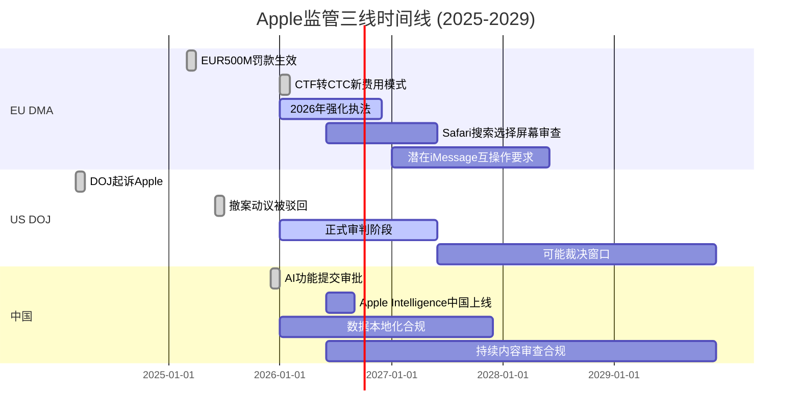

### 9.5 监管综合影响量化

| 监管线 | 概率 | 年化收入影响($B) | 年化利润影响($B) | 时间框架 | DM锚点 |
|--------|:----:|:----------------:|:----------------:|----------|--------|
| EU DMA(App Store佣金) | 80% | -$2.5~3.5 | -$2.0~2.8 | 2025-已开始 | [DM-REG-010] |
| EU DMA(合规成本) | 90% | N/A | -$0.7~1.3 | 持续 | [DM-REG-003] |
| US DOJ(App Store整体) | 35-50% | -$6~10 | -$5~8 | 2027-2029 | [DM-REG-011] |
| US DOJ/Google协议 | 55-65% | -$10~14 | -$10~14 | 2027-2029 | [DM-RSK-014] |
| 中国AI审批延迟 | 60% | -$2~5(间接) | -$1~3(间接) | 2026 | [DM-REG-012] |
| **概率加权合计** | — | **-$8~12/年** | **-$6~10/年** | **2026-2029** | — |

[DM-REG-010]: EU DMA App Store佣金影响基于EU占全球App Store收入20-25% x 佣金率降幅33-50%计算。

[DM-REG-011]: US DOJ App Store影响基于Kalshi 32-35%垄断认定概率+调整后概率(考虑和解可能性)。最终补救措施严厉程度不确定,影响区间宽。

[DM-REG-012]: 中国AI审批延迟的间接收入影响基于: 如果AI是换机核心驱动力,而中国版无AI → 中国iPhone增速降3-8pp。

**对Services增速的综合影响**:
- 当前Services增速: ~12%+ (3年CAGR 11.8%)[DM-FIN-017]
- 监管影响下(概率加权): 增速可能降至7-10%
- 分解:
  - App Store佣金侵蚀(EU+US): 拖累~2-3pp
  - Google协议重构(概率加权): 拖累~1-2pp
  - 总拖累: ~3-5pp增速
- Services CAGR从12%降至7-10%的估值含义: Services是Apple被给予科技股(而非消费电子股)估值倍数的核心理由。如果增速降至7-10%,P/E应从33x向25-28x压缩。

### 9.6 监管三线交叉影响

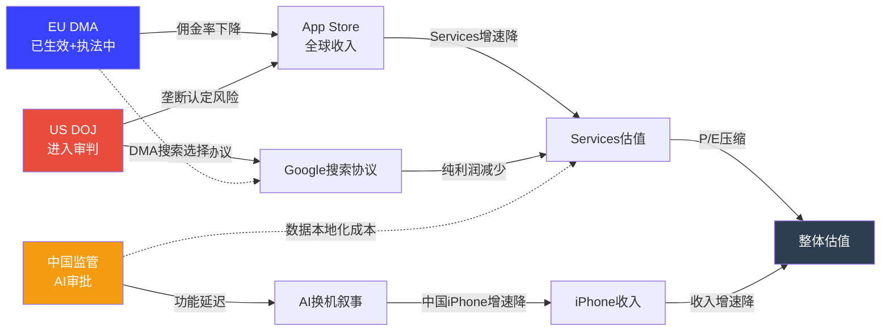

监管矩阵的三条线最终都汇聚到Services估值和整体估值——而在地理维度上，中国是所有风险交汇的焦点。下一章将深入中国三重风险的情景分析。

---

## Chapter 10: 中国三重风险情景

> **摘要**: 中国是Apple波动性最大的地理区域——FY2025收入$64.4B(YoY-3.9%,唯一下滑区域),Q1 FY2026暴增38%至$25.5B。恢复归因于战略定价调整和消费者补贴,而非技术突破。华为已重夺中国#1位置,HarmonyOS超越iOS成为中国第二大移动OS。三情景分析显示概率加权中国收入$57-62B,较当前偏乐观定价(隐含$65-70B)存在下行风险。更关键的是,中国风险不是渐变式的——它是"阈值式"的,一旦触发地缘恶化,将在数周内从S2跳到S3。

### 10.1 近期数据与恢复真相

**Q1 FY2026中国表现**:
- 大中华区(含台湾和香港)营收$25.53B,YoY+38%[DM-GEO-001]
- 远超市场预期(预期约$20B),是财报最大惊喜之一
- iPhone是主要驱动力: Q1全球iPhone收入$85.27B(+23%),中国占相当比例

[DM-GEO-001]: Q1 FY2026大中华区收入$25.53B(+38% YoY)来源于Apple Q1 FY2026财报(2026年1月29日发布)。

**恢复归因分析**(为什么+38%不代表趋势):
1. **低基数效应**: FY2025大中华区收入$64.4B(YoY-3.9%),前18个月连续下滑。Q1 FY2025(即2024年12月季)是低谷,+38%部分是低基数反弹。
2. **政府消费补贴**: 中国政府2025年下半年推出电子产品消费补贴计划(家电以旧换新),Apple设备符合补贴范围。补贴是政策性的,不可持续假设每年存在。[DM-GEO-002]
3. **战略定价调整**: Apple在中国市场推出更激进的定价和以旧换新优惠,以应对华为竞争。这提高了短期销量但压缩了利润率。
4. **iPhone 17发布时机**: 2025年9月发布的iPhone 17系列(含AI功能)恰好赶上Q1(中国春节前),催化了积压需求释放。
5. **不是技术突破驱动**: Q1中国增长与Apple Intelligence无关——Apple Intelligence尚未在中国上线。

[DM-GEO-002]: 中国电子产品消费补贴来源于SCMP报道"Apple's China sales rise with electronics consumer subsidy boost"。

**华为竞争现状**:
- 2025年全年: 华为16.4%(#1) vs Apple 16.2%(#2),差距仅0.2pp[DM-GEO-003]
- 2025年H1: Apple排名第五,华为Q2份额18%大幅领先
- 2025年H2: iPhone 17发布后Apple强势反攻,Q4反超华为
- HarmonyOS在2025年Q1超越iOS成为中国第二大移动OS(仅次于Android)
- 华为已恢复Kirin 9000系列自研芯片,减少对美国技术的依赖

[DM-GEO-003]: 中国智能手机份额数据来源于Canalys/IDC 2025年年度报告,多来源交叉验证(CNBC/Gizmochina/PhoneArena)。

### 10.2 S-China-1: 乐观情景(中国收入维持$65-75B)

| 项目 | 数值/描述 |
|------|----------|
| 概率 | 25% |
| 条件 | 中美关系不恶化+消费补贴延续+Apple Intelligence中国审批通过+华为芯片受限无重大突破 |
| 中国收入区间 | $65-75B/年 |
| iPhone中国增速 | +5-10% YoY(从恢复期进入温和增长) |
| Services中国增速 | +10-12%(App Store+iCloud+Apple Pay渗透率提升) |
| DM锚点 | [DM-GEO-004] |

[DM-GEO-004]: S1乐观概率25%。条件要求四个因素同时成立:地缘稳定、补贴延续、AI审批通过、华为受限。过去24个月中这四个条件从未同时全部满足。

**乐观情景的支撑逻辑**:
- iPhone品牌在中国高端市场仍有深厚根基(留存率>85%在高收入群体)
- Apple Intelligence中国版如果在2026年中上线,可能重新激活AI换机叙事
- 如果美中关税维持当前水平(2025年11月已达成90天协议并延期),不会出现新的消费者情绪冲击
- 中国Z世代仍将Apple视为aspirational品牌(尽管华为在35+年龄段侵蚀显著)

**乐观情景的脆弱点**:
- 消费补贴是最不可预测的变量——2025年补贴已到期,2026年续期尚未确认
- 华为芯片自研速度超预期:如果麒麟下一代接近Apple A系列水平,产品差距缩小
- Apple Intelligence中国版功能受限(内容审查)可能导致用户体验不如预期

### 10.3 S-China-2: 中性情景(中国收入$55-65B)

| 项目 | 数值/描述 |
|------|----------|
| 概率 | 45% |
| 条件 | 地缘政治维持现状(紧张但不升级)+竞争加剧但Apple品牌稳定+AI审批可能延迟至2026年H2 |
| 中国收入区间 | $55-65B/年 |
| iPhone中国增速 | -5% ~ +5% YoY(波动区间) |
| Services中国增速 | +6-10% |
| DM锚点 | [DM-GEO-005] |

[DM-GEO-005]: S2中性概率45%。这是当前轨迹的自然延伸——华为持续蚕食但Apple品牌韧性尚在。中性意味着FY2025的$64.4B附近波动,不出现趋势性恶化。

**中性情景的关键假设**:
- 华为+小米+Oppo联合蚕食Apple约2-3pp中国份额/年(从16.2%降至13-15%)
- 但Apple通过ASP提升(高端化)部分抵消份额损失,使收入下降幅度<份额下降幅度
- 政府采购禁令维持当前范围(中央政府+部分国企),不扩大到省级/教育/医疗
- 中美关系在"竞争性共存"框架内运行,不出现重大事件性冲击

**中性情景的风险倾斜**:
- 华为HarmonyOS生态成熟速度可能超预期——如果HarmonyOS App Store体量达到iOS App Store的50%+,生态锁定效应将从Apple转向华为(对年轻用户)
- 内存价格上涨40-50%不成比例地影响中国OEM→低端市场整合→华为/Apple双寡头格局可能加速→对Apple反而有利(挤压低端竞争者)
- 消费降级趋势(中国经济增速放缓至4-5%)可能导致高端手机需求疲软,但Apple品牌的"身份象征"属性部分抵消

### 10.4 S-China-3: 悲观情景(中国收入$40-55B)

| 项目 | 数值/描述 |
|------|----------|
| 概率 | 30% |
| 条件 | 地缘恶化触发(关税升级/新制裁/台海紧张加剧)+华为全面崛起+政府采购禁令扩大+消费者民族情绪激化 |
| 中国收入区间 | $40-55B/年 |
| iPhone中国增速 | -15% ~ -30% YoY |
| 概率加权EPS影响 | -$0.4~0.8/年(仅中国区直接影响) |
| DM锚点 | [DM-GEO-006] |

[DM-GEO-006]: S3悲观概率30%。30%看似高但考虑到:过去3年中中国iPhone收入已出现过12-18个月连续下滑;华为已从制裁中恢复;地缘政治不确定性持续升高。

**触发因素与传导链**:

**触发1: 关税升级**
- Trump已威胁25%关税(若iPhone不在美制造)
- 如果关税升级至中国消费者端(报复性关税),iPhone在中国售价可能上涨10-15%
- 历史先例: 2019年贸易战期间Apple中国收入同比下降2-3%

**触发2: 台海紧张加剧**
- 无需达到实际冲突级别——仅军事演习升级就可能触发消费者情绪转变
- 先例: 2022年佩洛西访台后,中国社交媒体出现短暂但强烈的"抵制美国品牌"情绪
- 传导: 台海紧张→消费者抵制+TSMC供应风险→同时打击需求和供给

**触发3: 政府采购禁令扩大**
- 当前禁令范围: 中央政府+部分大型国企
- 如果扩大至: 省级政府+教育系统+医疗系统+金融机构 → Apple在B2B/G2B渠道全面出局
- 影响: 可能减少$3-5B/年(B端收入占中国总收入约5-10%)

**触发4: 华为+HarmonyOS全面崛起**
- HarmonyOS 5全面发布+App Store生态基本完善
- 华为在$800+高端市场份额逼近Apple(目前差距仅0.2pp)
- 如果华为在高端市场实现性能/功能平价(或感知平价),Apple在中国的品牌溢价将显著缩小

### 10.5 非线性风险放大器

**为什么用三个离散情景而不是线性外推**:

中国风险的核心特征是非线性——它不会按照-2%/年的速度渐变,而是在"正常"和"恶化"之间存在阈值效应:

1. **情绪阈值**: 中国消费者对Apple的态度存在一个"翻转点"。在翻转点之前,Apple是"高端品质"的象征;翻转后,Apple变成"美国霸权"的象征。华为2019年被制裁后的消费者情绪突变提供了最直接的先例——华为中国份额在2019年H2-2020年H1内从~35%飙升至~40%+,几乎完全是情绪驱动。
2. **政策阈值**: 政府采购禁令的扩大不是渐进的。一旦中央层面下达统一指令,省级/行业层面会在数周内全部执行。
3. **竞争阈值**: HarmonyOS生态的"可用性"有一个tipping point——当60-70%的主流App都有HarmonyOS版本时,"生态不完善"的转换障碍消失,华为→Apple转换成本为零,但Apple→华为转换成本突然接近零。IDC数据显示HarmonyOS已超越iOS成中国第二大OS,这一阈值可能正在接近。

**先例: 韩国→日本贸易冲突(2019-2020)**
- 日韩贸易争端导致韩国消费者"抵制日货"运动
- 日本汽车在韩国销量3个月内下跌60-80%
- 情绪恢复花了>2年,且从未回到争端前水平
- **教训**: 民族情绪驱动的消费抵制具有非线性启动+长期衰减特征

### 10.6 中国三情景条件树

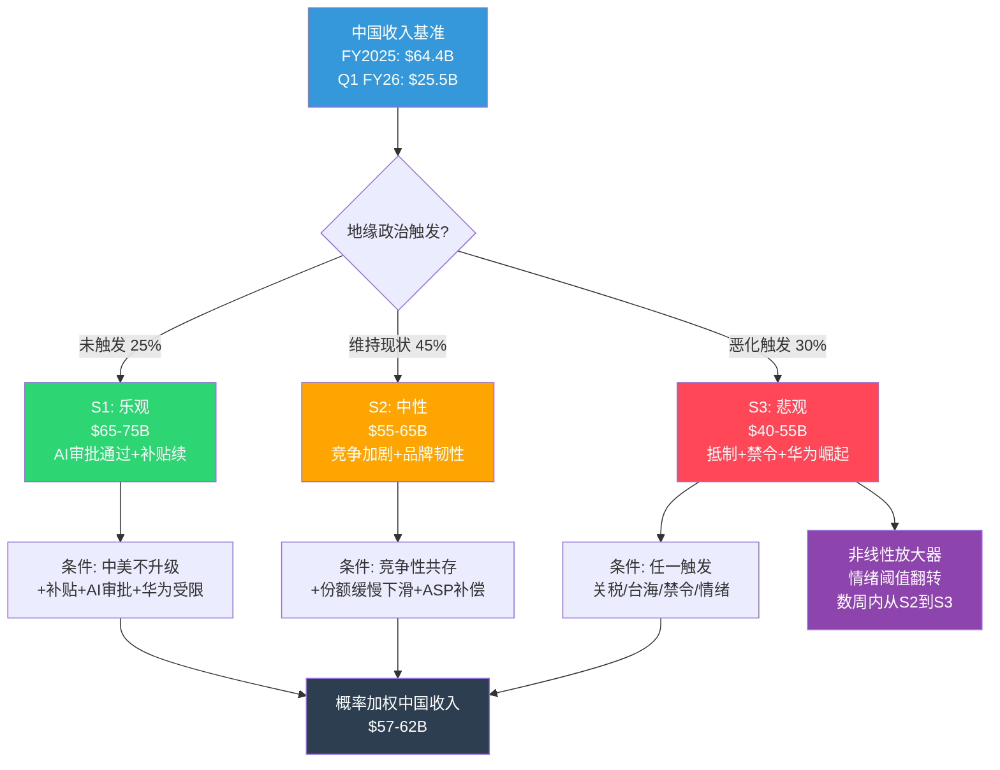

### 10.7 概率加权中国收入

| 情景 | 概率 | 收入中值($B) | 加权贡献($B) |
|------|:----:|:-----------:|:-----------:|
| S1: 乐观 | 25% | $70B | $17.5B |
| S2: 中性 | 45% | $60B | $27.0B |
| S3: 悲观 | 30% | $47.5B | $14.3B |
| **概率加权合计** | 100% | — | **$58.8B** |

概率加权中国收入$58.8B vs FY2025实际$64.4B → 隐含YoY -8.7%。如果市场当前定价隐含中国收入$65-70B(基于Q1 FY2026的+38%势头外推),则存在$7-11B的负面预期差。

**对CQ-4(中国三重风险综合压缩幅度?)的回答**: 概率加权压缩幅度约-$5.6B/年(-8.7%),但尾部情景(S3)可能导致-$10-24B压缩。关键不是中值,而是非线性放大的可能性——S2到S3的跳变可能在数周内发生。

中国风险的情景分析完成了地理维度的审计——最后一个关键风险维度是iPhone本身: 饱和市场中AI换机叙事的可信度。

---

## Chapter 11: iPhone饱和与换机周期

> **摘要**: AI超级换机周期是当前AAPL估值溢价的最大叙事支撑。Q1 FY2026的+15.7%增速(iPhone+23%)看似验证了这一叙事,但历史对比(5G周期)和结构性数据(仅38%消费者有意识使用AI功能)发出警告信号。本章构建系统性证伪框架:列出5个可证伪条件和时间节点。核心判断:AI换机周期"已开始"但"可持续性未经验证"——仅1季数据不足以确认多年趋势。

### 11.1 5G超级周期先例对比

**2020年5G超级周期预期vs现实**:

| 指标 | 5G周期预期(2020) | 5G周期实际(2020-2023) | 教训 |
|------|-------------------|----------------------|------|
| 换机驱动力 | "5G改变一切" | 网络覆盖缓慢,杀手级5G应用未出现 | 技术叙事不等于消费者行为 |
| 换机率变化 | 预期升至35-40% | 实际从33%降至27%(3年均值) | 超级周期可能是"正常周期" |
| iPhone收入变化 | 预期持续双位数增长 | FY2021 +39%→FY2022 -2%→FY2023 -2% | 首年爆发后快速回落 |
| 持续时间 | 预期2-3年超级周期 | 实际超级周期仅1-2个季度(iPhone 12发布季) | 积压需求释放不等于持续趋势 |
| P/E变化 | 从25x升至30x+ | 30x+维持1年后回落至25-28x | 叙事驱动的倍数扩张不持久 |

[DM-RSK-015]: 5G换机周期数据:换机率从33%降至27%。iPhone FY2021-FY2023收入变化来源于历史财报。

**5G vs AI: 关键相似与差异**

| 维度 | 5G周期 | AI周期 | 评估 |
|------|--------|--------|------|
| 需要新硬件? | 是(5G调制解调器) | 是(A17 Pro+芯片) | 相似 |
| 功能立即可感? | 否(5G覆盖不足) | 部分(写作/图片编辑可感;Siri升级不明显) | AI略胜 |
| 全球可用? | 是(硬件即用) | 否(中国延迟+语言限制) | 5G胜 |
| 杀手级应用? | 未出现 | 待验证(New Siri是关键) | 均未确认 |
| 竞品差异化? | 低(所有厂商同时支持5G) | 中(Apple Intelligence vs Galaxy AI差异存在) | AI略胜 |
| 积压安装基数 | ~200M台4年+ | ~315M台4年+ | AI更大 |

**结论**: AI换机周期在"积压安装基数"和"功能差异化"两个维度上强于5G,但在"全球可用性"和"杀手级应用确认"两个维度上弱于或等于5G。净评估:AI周期有理由比5G周期更强,但不能排除重蹈5G覆辙的可能性。

### 11.2 AI换机叙事: 看多与看空证据

**看多证据(AI超级周期正在发生)**:
1. **Q1 FY2026 iPhone +23% YoY**: 创单季历史最高iPhone收入$85.27B[DM-FIN-010]
2. **315M+台4年+旧机**: 是iPhone历史上最大的"积压安装基数",提供多季换机跑道[DM-RSK-016]
3. **60%消费者认为AI重要**: YouGov调查显示AI功能已成为手机购买决策因素[DM-RSK-017]
4. **管理层指引+13-16%**: Q2 FY2026指引暗示iPhone动能延续
5. **Wedbush $350目标**: Daniel Ives将2026年定义为"Apple AI元年",认为AI订阅可增加每股$75-100价值

[DM-RSK-016]: 315M台4年+旧iPhone来源于分析师估算(多来源交叉,包括Wedbush/Morgan Stanley)。

[DM-RSK-017]: 60%消费者认为AI重要来源于YouGov调查(2025年)。

**看空证据(AI换机叙事可能是泡沫)**:
1. **仅1Q数据**: 历史上每次"超级周期"的首季都看起来强劲——关键是持续性[DM-RSK-018]
2. **仅38%消费者有意识使用AI**: 90%用户"使用"AI功能(自动修图等),但只有38%知道自己在用AI——这意味着AI不是有意识的购买决策驱动力[DM-RSK-019]
3. **全球智能手机市场-2.1%**: IDC预测2026年全球出货量下降,Apple必须逆趋势增长
4. **Apple Intelligence中国延迟**: 24亿设备的~25-30%位于中国,AI换机叙事在中国暂时失效
5. **New Siri再次延期**: 从iOS 26.4推迟至26.5或iOS 27(2026年9月),核心AI卖点延迟交付
6. **竞品同质化**: Samsung Galaxy AI/Google Gemini/华为国产AI提供类似功能,Apple不具备AI功能垄断

[DM-RSK-018]: "仅1Q数据"——5G周期同样在iPhone 12发布季(Q1 FY2021)创纪录,但随后2季即回归正常增速。

[DM-RSK-019]: 38%消费者有意识使用AI功能来源于YouGov同一调查(90%使用vs 38%aware)。

### 11.3 换机率模型

**历史换机率对比**:

| 周期 | 驱动力 | 首年换机率 | 后续2年均值 | iPhone收入变化 |
|------|--------|:---------:|:----------:|:-------------:|
| iPhone 6(2014) | 大屏 | ~30% | ~27% | +52%→+1%→-12% |
| iPhone X(2017) | OLED+Face ID | ~28% | ~25% | +16%→-15%→+7% |
| iPhone 12/5G(2020) | 5G | ~33% | ~27% | +39%→-2%→-2% |
| **iPhone 17/AI(2025)** | **Apple Intelligence** | **~32%(估)** | **?** | **+23%(Q1)→?** |

[DM-RSK-020]: 历史换机率数据基于行业研究(Counterpoint/IDC年度报告)和Apple年报收入推算。iPhone 17首季换机率~32%为估算值(基于Q1收入$85.3B和安装基数~1.2B活跃iPhone用户)。

**AI超级周期需要的换机率**:
- 要支撑Q1的+23% YoY iPhone增速持续全年:需全年换机率~33-35%
- 要支撑+15% YoY增速(市场隐含):需换机率~30-32%
- 历史"正常"换机率:~25-28%(4年周期)
- **gap**: AI超级周期需要换机率比"正常"高出5-10pp(约20-35%)——这相当于要求每4个4年+旧iPhone用户中多1个决定在这一年升级(而非下一年)

**换机率敏感性分析**:

| 全年换机率 | 对应iPhone年收入($B) | YoY增速 | 对总收入影响 |
|:----------:|:--------------------:|:-------:|:-----------:|
| 35%(超级周期) | $235-245B | +12~17% | 总收入+$25-35B |
| 30%(温和) | $215-225B | +3~7% | 总收入+$5-15B |
| 27%(正常化) | $205-215B | -2~+2% | 总收入$0~+5B |
| 24%(衰退) | $190-200B | -5~-10% | 总收入-$10-20B |

### 11.4 AI叙事证伪时间表

以下时间节点可系统性检验AI换机周期叙事的真伪:

**检验点1: Q2 FY2026财报(~2026年4月30日)**
- **关键指标**: iPhone收入YoY增速
- **证伪阈值**: 如果iPhone增速<10% → AI周期减速信号(因为Q2 FY2025基数更低,应该更容易beat)
- **确认阈值**: 如果iPhone增速>15% → AI周期持续信号
- **CQ-1影响**: <10%将CQ-1置信度从"待定"降至"低";>15%升至"中-高"
- DM锚点: [DM-RSK-021]

[DM-RSK-021]: Q2 FY2026 iPhone增速证伪阈值10%基于:管理层指引总收入+13-16%,iPhone作为50.4%收入占比需至少+10%才能支撑总体指引。

**检验点2: WWDC 2026(~2026年6月8日)**
- **关键指标**: New Siri功能展示+Apple Intelligence 2.0发布
- **证伪阈值**: 如果New Siri仅是渐进式改进(而非"对话式AI革命") → 换机urgency降低
- **确认阈值**: 如果New Siri展示真正的AI agent能力(跨App操作/深层设备理解/多轮复杂对话) → 换机叙事升级
- **延迟风险**: New Siri已多次延期,如果WWDC只展示Demo而非即时可用 → 市场可能解读为再次"画饼"
- DM锚点: [DM-RSK-022]

[DM-RSK-022]: WWDC 2026预计6月8日。New Siri延期信息来源于TechCrunch(2026/02/11)+MacRumors(2026/02/12)。Apple已向CNBC确认New Siri仍计划2026年发布。

**检验点3: Q4 FY2026/iPhone 18首季(~2026年10-11月)**
- **关键指标**: iPhone 18(含可能的折叠机型)首季收入
- **证伪阈值**: 如果iPhone 18首季收入<$60B → 周期见顶信号(vs iPhone 17首季$85.3B的回落幅度过大)
- **确认阈值**: 如果iPhone 18首季>$70B且包含折叠机型增量 → 多年周期确认
- DM锚点: [DM-RSK-023]

[DM-RSK-023]: Polymarket显示iPhone 18在2026年发布概率76%,折叠iPhone在2027年前发布概率80.5%。

**检验点4: Apple Intelligence采用率(2026年全年)**
- **关键指标**: Apple Intelligence月活/功能使用率(如Apple在财报中披露)
- **证伪阈值**: 如果发布12个月后采用率<5%的活跃iPhone用户(KS-4) → AI功能不是真正的需求驱动力
- **确认阈值**: 如果采用率>30%且与NPS(净推荐值)正相关 → AI生态黏性形成
- **数据可用性**: Apple目前未披露Apple Intelligence采用率数据,这本身就是一个黄色信号——如果数据好,Apple通常会主动披露
- DM锚点: [DM-RSK-024]

[DM-RSK-024]: KS-4触发条件:Apple Intelligence用户采用率<5%(发布12月后)。

**检验点5: 中国AI上线后的销售反应(2026年H2)**
- **关键指标**: Apple Intelligence中国上线后的iPhone销售变化
- **证伪阈值**: 上线后1个季度iPhone中国增速<5% → AI不是中国消费者的购买驱动力
- **确认阈值**: 上线后iPhone中国增速>10% → AI在中国市场有效
- DM锚点: [DM-RSK-025]

[DM-RSK-025]: Apple Intelligence中国上线目标2026年中,实际可能延至H2。

### 11.5 换机周期对比图

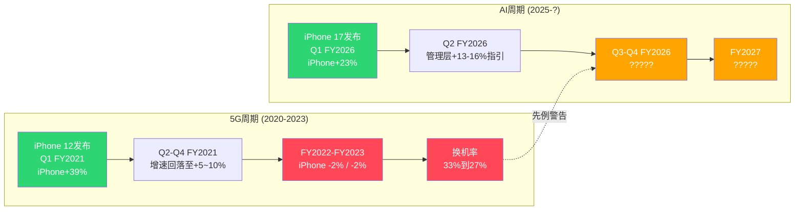

### 11.6 iPhone饱和的结构性背景

即使AI换机周期成功,iPhone面临的长期结构性挑战不会消失:

**安装基数增长放缓**:
- 24亿活跃设备(包括非iPhone)→ iPhone活跃用户约12-13亿
- 高端智能手机市场(>$600)全球TAM约3.5-4亿部/年,Apple份额约60-65%
- 在成熟市场(北美/欧洲/日本),iPhone渗透率已接近饱和(>50%)
- 新兴市场(印度/东南亚/非洲)虽有增长空间但iPhone价格是核心障碍

**ASP天花板**:
- 2026年预计iPhone ASP~$900-950(全球)
- 消费者对>$1,000手机的支付意愿存在心理阈值
- iPhone 17 Pro Max已售$1,199起→进一步提价空间有限
- 策略: iPhone 17e($599)意在扩大AI兼容设备基数,但以牺牲ASP为代价

**换机周期越来越长**:
- iPhone平均使用寿命从2-3年延长至4-5年(硬件耐用性提升+iOS长期支持)
- 矛盾: Apple做出的好产品(更耐用+更长软件支持)反而延长了换机周期
- AI是否能将周期从4-5年缩短回3-4年?这是AI超级周期的核心假设

**对CQ-1(AI能否驱动iPhone超级换机周期?)的回答**: Q1 FY2026数据显示AI换机周期已启动,但1季数据不能确认多年趋势。5G先例警告:首季爆发后可能快速回落。概率评估:AI周期持续2+年的概率约40-50%,仅持续1-2个季度的概率约30-35%,超越5G成为"真正超级周期"的概率约15-25%。KS-4(采用率<5%)是最关键的Kill Switch——如果AI功能使用率不高,整个换机叙事将丧失基础。

---

*Part 1完 | Ch12-Ch21见Part 2 | Ch22-Ch28见Part 3*
