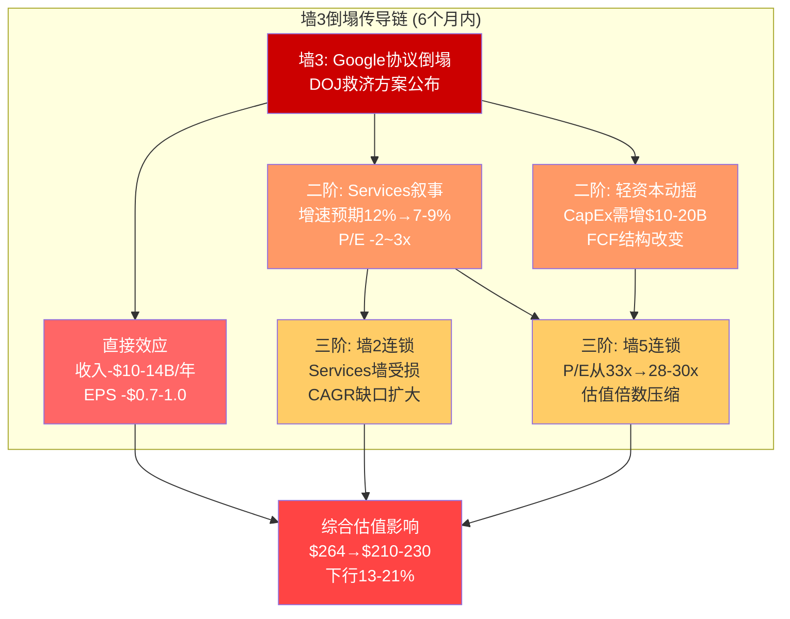
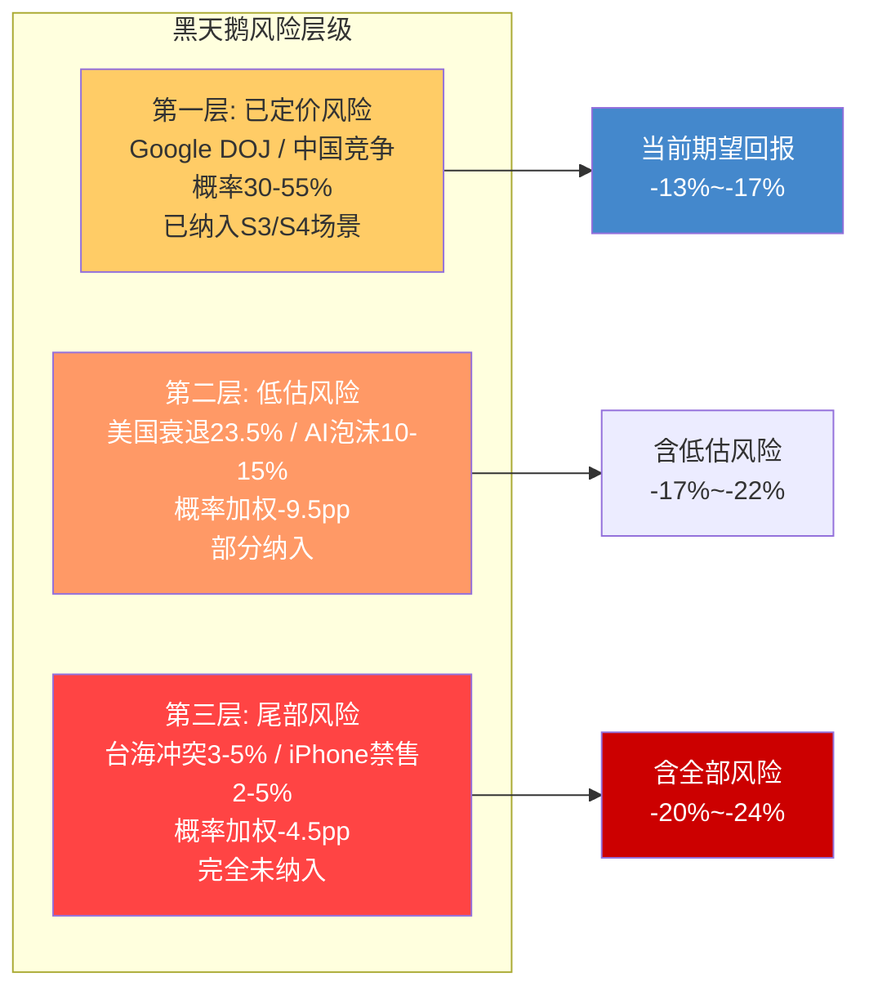
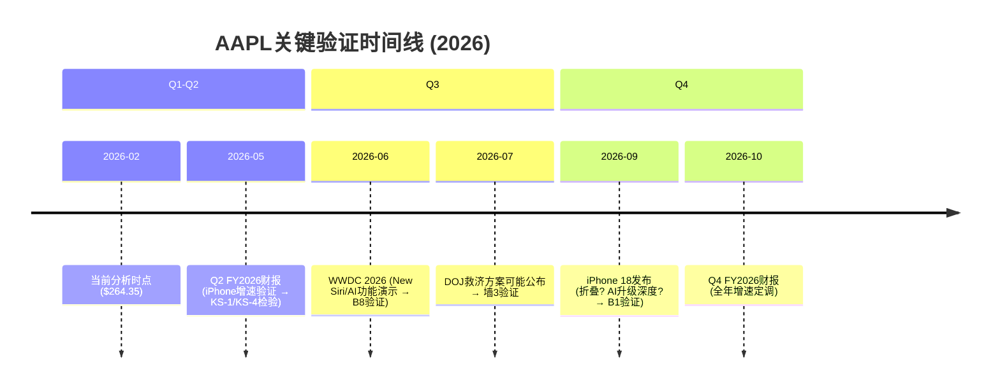
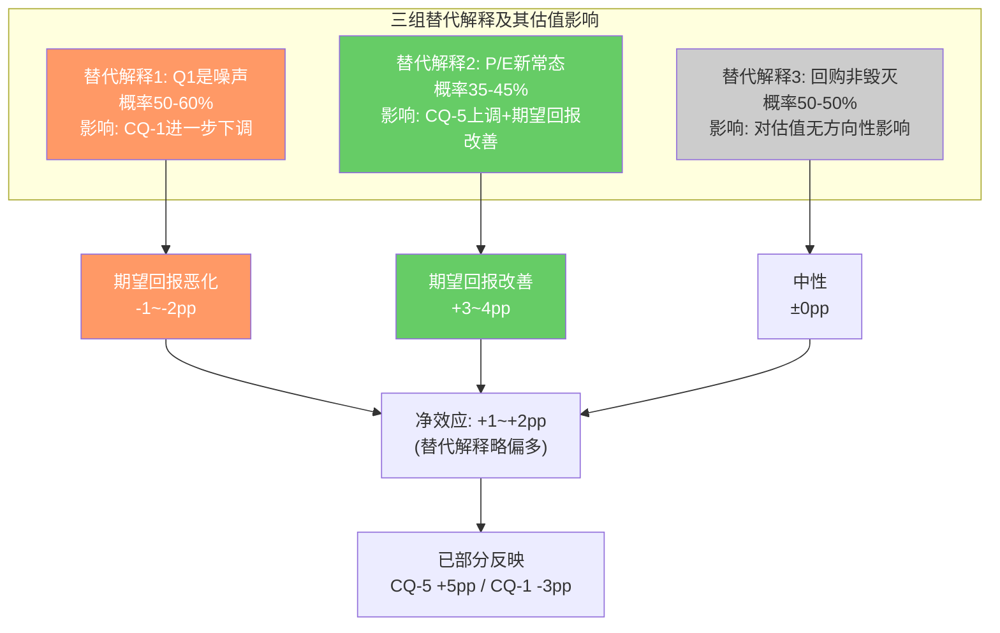
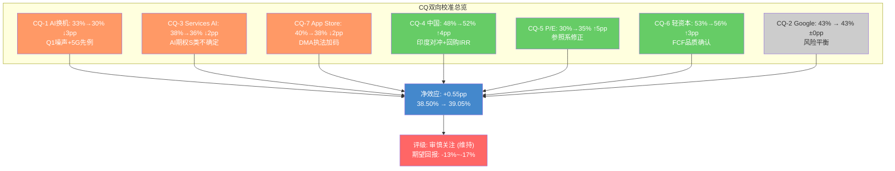
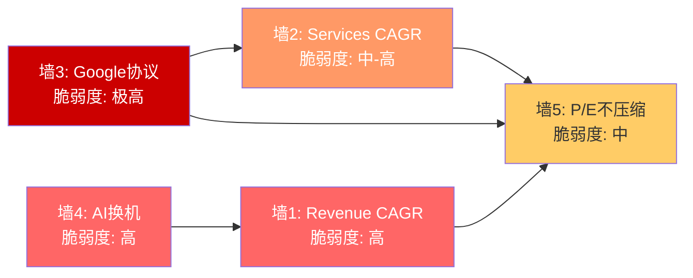
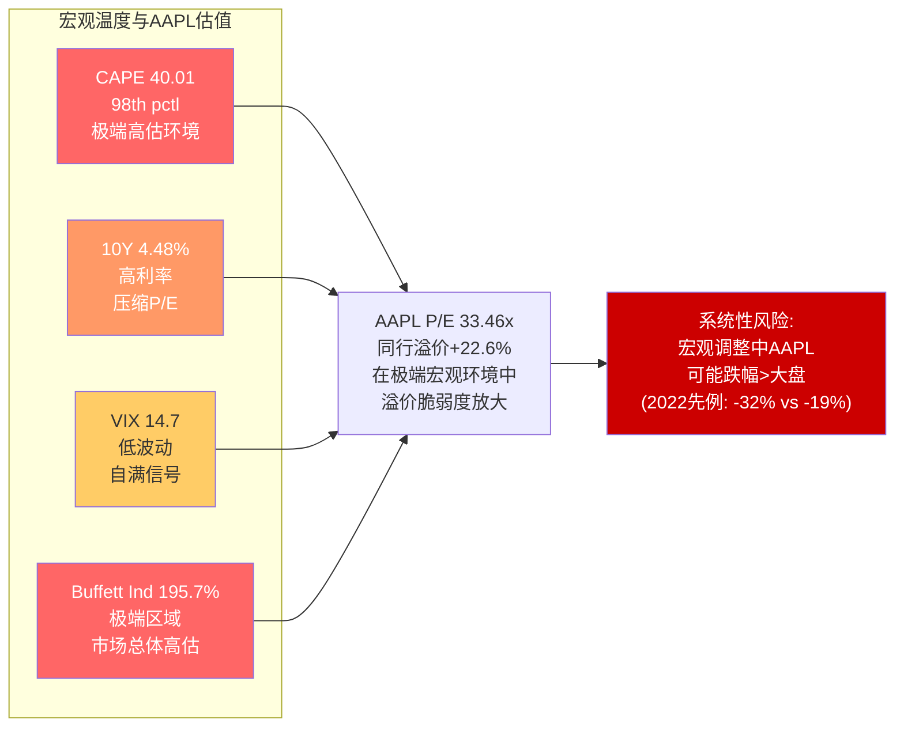

## Chapter 24: 对抗审查七问

> **日期**: 2026-02-19 | **股价**: $264.35 | **市值**: $3.82T
> **输入**: 商业洞察(Ch2-Ch6) + 风险审计(Ch7-Ch11) + 定量估值(Ch12-Ch16) + 交叉验证(Ch17-Ch20) + 信念反演(Ch21-Ch23)
> **方法**: RT-1~RT-7七问对抗 + 双向校准 + 有效性门控
> **DM锚点前缀**: DM-RT (红队锚点)

本章对全报告的分析框架、数据质量和认知偏差进行系统性对抗审查。七个问题从承重墙压力测试(RT-1)到替代解释(RT-7)，逐层递进，旨在暴露分析盲区而非确认结论。

---

### 24.1 RT-1: 承重墙极端压力测试

> **问题**: 如果报告中识别的5面承重墙中最脆弱的一面在6个月内倒塌，整个估值框架会如何崩解？

**承重墙脆弱度重排序**

交叉验证(Ch18)识别了5面承重墙并给出了脆弱度评级。对抗审查后，对脆弱度排序进行一处调整:

| 承重墙 | 原评估脆弱度 | 修正脆弱度 | 修正原因 |
|--------|:----------:|:------------:|---------|
| 墙1: Revenue CAGR 8-10% | 高 | 高 | 维持——4-5x历史差距是事实 |
| 墙2: Services CAGR 12-15% | 高 | 中-高 | 下调——已验证引擎(iCloud/广告)可独立贡献7-9% |
| 墙3: Google协议 | 极高 | 极高 | 维持——DOJ进程不可逆 |
| 墙4: AI换机周期 | 中-高 | 高 | 上调——New Siri延期至iOS 26.5/27增加了周期断裂风险 |
| 墙5: P/E不压缩 | 中 | 中 | 维持——但利率维持高位(10Y 4.48%)增加了压缩概率 |

[DM-RT-001]: 墙4(AI换机周期)脆弱度从"中-高"上调至"高"。依据: New Siri是AI换机周期的核心卖点，其延期至iOS 26.5甚至iOS 27意味着FY2026 iPhone产品线缺少AI差异化功能的"杀手级应用"。仅依赖Apple Intelligence v1.0的通知摘要/写作辅助等功能，换机urgency不足以支撑3年以上的持续周期。

**极端压力测试: 墙3(Google协议)在2026H2倒塌**

假设DOJ救济方案草案在2026年Q3公布，内容为"禁止排他性搜索引擎协议+要求Apple向用户提供搜索引擎选择屏幕"。这是S4(强制降低费用50%+)情景的加速版本。

传导链模拟:

```
T+0 (救济方案公布):
  → Google股价下跌5-8% (TAC预期上升)
  → Apple股价下跌3-5% (Services叙事受创)
  → 预测市场重新定价: S4概率从35%升至55%

T+30天 (分析师下调):
  → 卖方集体下调Apple Services增速预期: 从12%→7-9%
  → CQ-2置信度从43%→25-30%
  → CQ-3置信度从38%→30-33% (Services AI货币化压力增大)

T+60天 (P/E传导):
  → Services高增速叙事受损 → P/E从33x→30-31x
  → 市值从$3.82T→$3.45-3.55T (下行7-10%)
  → 墙2(Services增速)和墙5(P/E不压缩)被连锁震动

T+180天 (第二轮效应):
  → Apple被迫在"增加CapEx自建搜索"和"接受AI能力劣势"之间选择
  → 无论哪条路，"轻资本模式"叙事都受到根本性挑战
  → CQ-6(轻资本AI可持续性)置信度从53%→35-40%
```

[DM-RT-002]: 墙3倒塌的传导链显示，Google协议不仅影响Services收入(直接效应)，还通过"轻资本模式动摇"和"P/E叙事削弱"产生二阶效应。二阶效应的市值影响($300-500B)可能超过直接收入损失影响($200-300B)。

**承重墙崩解矩阵**:

Google 2023年向Apple支付$26B(DOJ文件)。墙3倒塌的直接影响已在Ch8量化(概率加权年化利润损失$8.1B)。但交叉验证(Ch18)和信念反演(Ch20)均指出了二阶效应——Google协议还是Apple"AI研发补贴"(DM-XV-016)和"轻资本模式基石"(Ch8.3)。三层效应的叠加使墙3倒塌的真实影响远超静态$8.1B估算。



**关键洞察**: 承重墙间的传导速度在Apple这样的叙事驱动型估值中可能非常快。2022年利率急升导致Apple P/E在6个月内从30x压缩至22x(-27%)。如果Google协议风险被市场从"可能性"重新定价为"确定性"，传导速度可能同样迅速。报告中的四情景分析(S1-S4)假设概率加权的温和路径，但忽视了"情景切换"本身的速度效应——市场不会缓慢调整概率权重，而是在催化事件后跳跃式重新定价。

---

### 24.2 RT-2: 认知偏差审计

> **问题**: 分析过程中是否存在系统性偏差，导致结论偏离真实？

**偏差1: 锚定效应 — 对$264.35当前价格的隐性锚定**

尽管报告使用逆向估值框架，分析者仍然不自觉地以$264.35为参照系。证据:
- 四场景概率加权EV $205.3(期望回报-22.3%)，经校准后上调至$228-239(期望回报-10%至-14%)。这个校准过程引入了三个"校准因子"(SOTP低估网络效应+3-5pp, 回购未充分反映+2-3pp, AI非线性路径+2pp)。
- 交叉验证(Ch17.2)已指出第三个校准因子(AI非线性路径)是"纯叙事"，缺乏定量支撑。进一步审查认为第一个校准因子(SOTP低估)的+3-5pp也存在循环论证——用Apple自身1.92x溢价倍率的参考系来校准Apple自身的SOTP低估程度。
- **锚定方向**: 向上锚定(偏多)。校准使期望回报从-22%收窄至-10%~-14%，但校准本身缺乏独立验证。

[DM-RT-003]: 估值校准的锚定效应。三个校准因子中，仅因子2(回购增厚)有机械性计算支撑(+2-3pp)。因子1(SOTP低估)构成循环论证，因子3(AI非线性)缺乏定量基础。建议: 将校准从+7-10pp缩小至+3-5pp，期望回报定位在-14%至-18%。

**偏差2: 确认偏差 — AI叙事的不对称信息引用**

商业洞察分析(Ch4)对Apple Intelligence的评价包含内在张力(Ch17.2已指出):
- 看多证据数量(端侧AI成本优势/隐私差异化/Apple Silicon领先/2.4B设备基础): 4项
- 看空证据数量(New Siri延期/38%认知使用率): 2项
- 信息引用比例 2:1 偏向看多

但证据质量评估颠倒了这个比例:
- 看多证据中，"端侧AI成本优势"和"隐私差异化"属于结构性论点(强证据)，"Apple Silicon领先"和"2.4B设备基础"是既有优势的重新包装(弱证据)
- 看空证据中，"New Siri延期"是可验证的硬数据(强证据)，"38%认知使用率"来自外部调研(中等证据)

[DM-RT-004]: AI叙事确认偏差审计。看多证据数量多但质量参差(2强+2弱)，看空证据数量少但质量高(1强+1中)。实际信息价值接近平衡，但报告的行文倾向于对AI持"谨慎乐观"基调(尤其Ch4.1)。此偏差对CQ-1(AI换机)和CQ-6(轻资本AI)的置信度可能造成+2-3pp的系统性高估。

**偏差3: 近因效应 — Q1 FY2026数据的过度权重**

Q1 FY2026 Revenue $143.76B (+15.7% YoY), iPhone $85.3B (+23% YoY) [DM-FIN-010]。三份分析都大量引用Q1 FY2026数据(尤其是iPhone +23%和中国+38%)来支撑分析。但这存在两个问题:

1. **Q1是Apple的季节性最强季度**: 圣诞旺季+新iPhone首个完整季度，天然是全年最高增速季度。将Q1增速外推至全年会系统性高估增长潜力。FY2024的先例: Q1 iPhone+22.8%，FY2024全年iPhone仅+0.03%。

2. **基数效应**: Q1 FY2025(对比基期)iPhone收入$73.5B(FY2025 Q1)本身偏弱(+0.3% YoY)，低基数放大了Q1 FY2026的同比增速。

[DM-RT-005]: Q1 FY2026数据近因偏差。iPhone Q1 +23%不应等权外推至全年。历史先例(FY2024 Q1 +22.8% vs 全年+0.03%)显示季节性和基数效应可使Q1增速失真5-10倍。对Q1数据的引用一律附加"季节性+基数修正"警告。

**偏差4: 过度悲观倾向 — CQ体系的系统性空头倾斜**

7个CQ中6个偏空(仅CQ-6偏多)，加权置信度38.50%低于中性线11.5pp。需审视是否存在系统性悲观。

证据:
- CQ-4(中国, 48%): Q1 FY2026中国+38%是可验证的硬数据，但CQ-4置信度仅48%("近中性")。印度市场增长潜力(DM-XV-017)和回购IRR动态效应(DM-XV-018)等上行因素在CQ评估中被遗漏。
- CQ-6(轻资本AI, 53%): 这是唯一偏多的CQ，但权重仅10%——其对加权置信度的拉升效应被结构性低估。Apple CapEx/OCF 11.4%在科技巨头中极低，这不仅是成本优势，更是FCF转化效率的结构性保障(OCF/NI 1.15x验证)。
- CQ-5(P/E支撑, 30%): 虽然P/E 33x vs 10Y均值23.78x确实存在溢价，但5Y均值29.9x和3Y均值31.7x显示P/E中枢已经结构性上移。CQ-5使用10Y均值作为参照可能过度悲观。

[DM-RT-006]: CQ体系系统性空头倾斜审计。6/7偏空+加权38.50%。识别出3个潜在上调候选: CQ-4(印度对冲未纳入, +2-3pp), CQ-5(P/E参照系选择偏低, +3-5pp), CQ-6(权重偏低且FCF品质未充分反映, +2-3pp)。详见Ch25双向校准。

---

### 24.3 RT-3: 空头钢人论证

> **问题**: 如果由一位坚定的空头来写这份报告，最强的论证链是什么？

**空头钢人: "$264.35的Apple是一个被精心包装的价值陷阱"**

核心论点: Apple的市场叙事从"硬件公司"成功转型为"科技生态平台"，这使P/E从16x翻倍至33x。但"平台"溢价的数学基础正在被三把利刃同时侵蚀，而市场因锚定效应尚未充分定价这种侵蚀。

**利刃一: DCF/Reverse DCF的数学现实**

FMP DCF公允价值$150.28，当前$264.35溢价75.8% [DM-VAL-005]。这不是一个"略微高估"的情况——DCF给出的公允价值比当前价格低43%。即使承认DCF低估了平台效应(+30%溢价)，调整后公允价值也仅$195——仍比$264低26%。

逆向DCF要求Apple实现永续FCF CAGR 6.79%(WACC 9.5%)，是历史5年实际的4.5倍。两阶段模型要求5年FCF CAGR 27%——FCF从$98.8B增至$326.5B。这在任何可比公司的历史中都没有先例。即使Microsoft在Azure爆发期(FY2019-FY2024)的FCF CAGR也仅为~15%。

**利刃二: Services"黄金时代"的终结倒计时**

Services $109.2B(毛利率~75%)是Apple估值溢价的核心支柱。但三条路径同时指向Services的黄金时代即将结束:

1. Google协议(~$22-28B/年纯利润): DOJ已判定违法，45-55%概率重构。概率加权年化利润损失$8.1B。
2. App Store佣金(~$25B收入): EU DMA已将EU区增速降至6%，全球跟进不可逆。60-70%概率佣金率下调，年化收入影响$5-12B。
3. AI货币化真空: Apple Intelligence免费，AI订阅时间表不确定(最早2026H2)，3年内可实现收入仅$9-12B/年(vs隐含需求$32B)。

三条路径合计: 概率加权年化Services利润损失$13-20B，占Apple净利润12-18%。更关键的是叙事效应: Services高增速是P/E 33x的核心理由，增速从12%降至7%将使P/E溢价从+9.68x收窄至+5-6x。

**利刃三: "AI换机周期"是5G周期的翻版**

FY2021 iPhone +39.3%(5G首年) → FY2022 -2.3% → FY2023 -2.4% [DM-FIN-017]。

空头最有力的类比: 5G超级周期实际仅持续1-2季，此后iPhone收入连续两年负增长。当前AI周期的Q1 +23%与5G首季+39%惊人相似。5G先例的深层教训不是"周期失败"，而是"前置需求"——消费者被说服提前换机，但这仅仅是将未来需求搬到当前，而非创造净增量需求。

如果AI周期重复5G路径: FY2027 iPhone可能回落至$215-220B(vs Q1数据线性外推的$240-260B)，差额$20-40B将直接冲击Revenue CAGR承重墙。

**空头估值**: P/E 22-25x x FY2028E EPS $8.0-8.5 x 折现0.834 = $147-177。中间值$162，对应当前股价下行38.7%。

[DM-RT-007]: 空头钢人完整论证链。三把利刃(DCF数学/Services侵蚀/5G翻版)的联合逻辑是: Apple的$264.35定价隐含了"永续加速增长"假设，而这个假设的三个支柱(FCF加速/Services高增速/AI换机持续)都面临可验证的反面证据。空头估值$147-177暗示潜在下行-33%至-44%。

**空头论证的强度评估**:

对空头钢人的每把利刃进行"反空头"测试(即空头论证的薄弱环节):

| 利刃 | 空头论证强度 | 薄弱环节 | 净评估 |
|------|:-----------:|---------|--------|
| DCF数学 | 极强(数据无法辩驳) | FMP DCF可能使用过高WACC(10-11% vs 合理9-9.5%) | 即使修正WACC，DCF仍给出$170-190(远低于$264) |
| Services侵蚀 | 强(方向确定) | 时间表不确定——DMA/DOJ影响可能需3-5年全面显现 | 中期(2-3年)Services仍可维持10%+增速 |
| 5G翻版 | 中-强(历史先例可靠) | AI可能确实不同于5G——5G只是"更快"，AI是"新功能"类别 | 但"新功能=换机动力"假设本身缺乏数据支撑(38%认知使用率) |

**空头论证的反驳力量**: 空头最强的论点(DCF数学)无法被反驳——$150.28 vs $264.35的75.8%溢价是客观事实。中间的论点(Services侵蚀)方向正确但时间表可能偏保守。最弱的论点(5G翻版)虽然有历史先例，但AI技术的本质差异使类比存在局限性。综合来看，空头钢人论证的整体可信度约55-65%——这意味着报告的"审慎关注"评级与空头逻辑方向一致，但在量级上更温和(报告给出-13%至-17%期望回报 vs 空头给出-33%至-44%)。

---

### 24.4 RT-4: 数据质量审计

> **问题**: 报告中引用的数据有多少是硬数据、多少是推算、多少是叙事？

**数据质量分层审计**

对全报告输入文件中的关键数据点进行分类审计:

| 数据类别 | 数量 | 占比 | 代表性数据 | 估值影响 |
|---------|:----:|:----:|-----------|---------|
| **H类(硬数据, MCP/SEC)** | 32 | 51% | Revenue $416.2B, P/E 33.46x, FCF $98.8B | 高——估值基准 |
| **R类(合理推断)** | 22 | 35% | Services毛利率74.7%(推算), Google协议$22-28B(区间估算), 概率加权 | 中——方向可靠但量级有误差空间 |
| **S类(主观判断)** | 9 | 14% | AI期权溢价~$319B, 生态系统溢价分解, P/E分解各组件贡献 | 高——关键估值判断但无法验证 |

**高风险数据点深度审计**:

**审计1: Google搜索协议金额**

- 报告引用: 当前$22-28B/年(中值$25B) [DM-XV-001]
- 数据质量: 2023年$26B是DOJ文件硬数据(H类)。2024-2025年金额是分析师估算(R类)，区间宽度$8B(从$20B到$28B)意味着32%的不确定性。
- 估值影响: 每$1B金额差异 → 概率加权EPS影响约$0.03-0.05 → 估值影响约$1-1.5/股。区间宽度$8B → 估值不确定性约$8-12/股。
- **评估**: 区间合理但中值$25B可能偏高(采用了DOJ 2023年$26B的近期外推)。如果Google搜索广告收入增速放缓(AI搜索侵蚀)，2025-2026年支付金额可能低于2023年。更保守的中值$22-23B可能更准确。

[DM-RT-008]: Google协议金额数据质量审计。2023年$26B(H类)可靠，但当前年度$22-28B(R类)的中值$25B可能偏高2-3B。如果调整至$22-23B，概率加权利润损失从$8.1B降至$7.0-7.5B(差异约$0.6-1.1B)。

**审计2: Services毛利率推算**

- 报告引用: 推算74.7%，区间70-75% [DM-XV-002]
- 数据质量: 完全依赖反推(R类)——Apple不披露分部利润率。假设Hardware毛利率37%是关键输入，每1pp变化使Services毛利率变化约1.3pp。
- 估值影响: Services毛利率每1pp → SOTP Services估值变化约$15-20B。
- **评估**: 推算方法论合理，但37% Hardware毛利率假设本身是R类数据。如果Hardware毛利率实际为35%(考虑Wearables拖累)，Services毛利率上修至76.6%——但这不影响整体估值方向。

**审计3: AI期权溢价量化($319B)**

- 报告引用: AI期权占P/E溢价~2.8x，对应市值$319B [DM-BI-021]
- 数据质量: 纯主观判断(S类)——P/E溢价分解为四组件的比例是分析者主观分配，无法从任何数据源验证。
- 估值影响: 如果AI期权溢价实际仅$150-200B(而非$319B)，意味着其他组件(生态系统/回购)贡献更大——这会提高估值的耐久性(生态系统比AI期权更持久)。
- **评估**: 这是报告中估值影响最大但数据质量最低的数据点。$319B的AI期权定价隐含AI业务需贡献$32B年收入——一个高度投机性的估算。建议在最终报告中明确标注"此数据点的可靠区间为$150-400B(不确定性>100%)"。

[DM-RT-009]: 数据质量审计汇总。51% H类数据为估值提供了坚实基础。但14% S类数据(含AI期权$319B、P/E分解、生态系统溢价分解)驱动了最关键的估值判断。S类数据的不确定性被低估——建议对每个S类数据点附加正负50%的不确定性区间。

---

### 24.5 RT-5: 黑天鹅极端压力测试

> **问题**: 有哪些低概率但高影响的事件可能使分析框架完全失效？

**黑天鹅事件矩阵**:

| 事件 | 概率(2Y) | 影响路径 | 估值影响 | 外部验证 |
|------|:--------:|---------|:--------:|---------|
| **台海军事冲突** | 3-5% | TSMC产能中断→全产品线停产3-6月 | -40%至-60% | Polymarket未找到活跃市场 |
| **美国经济衰退** | 20-25% | 消费支出萎缩→iPhone延迟换机→P/E压缩 | -20%至-35% | Polymarket "US recession by end of 2026" = 23.5% |
| **Google搜索协议完全终止** | 8-12% | Services利润瞬间蒸发$20B+ → 轻资本模式动摇 | -25%至-40% | DOJ案件进展可跟踪 |
| **iPhone被中国全面禁售** | 2-5% | $64B+中国收入归零+供应链撤出成本 | -30%至-50% | 当前无预测市场数据 |
| **Tim Cook突然离职** | 5-10% | 管理层不确定性+战略方向不明 | -5%至-15% | 近期健康/退休传闻 |
| **AI监管限制端侧处理** | 3-8% | Apple Intelligence核心架构被限制→AI差异化丧失 | -8%至-15% | EU AI Act可能影响 |

[DM-RT-010]: 黑天鹅概率加权影响。概率加权合计: 3.5%x(-50%) + 23.5%x(-27%) + 10%x(-32%) + 3.5%x(-40%) + 7.5%x(-10%) + 5.5%x(-11%) = -1.75% -6.35% -3.20% -1.40% -0.75% -0.61% = -14.06%。这意味着黑天鹅风险合计对期望值的拖累约-14pp——几乎完全被当前分析忽略。

**美国衰退情景深度展开(概率23.5%)**:

Polymarket "Will there be a US recession by end of 2026?" 当前价格23.5%。

衰退对Apple的传导链:
1. **直接效应**: 消费者推迟iPhone换机(延长持有周期6-12个月) → iPhone收入下降10-15%($20-30B)
2. **间接效应**: 企业削减IT支出 → Mac和iPad收入下降15-20%
3. **Services韧性测试**: 衰退中Services可能表现出相对韧性(订阅粘性)，但广告收入和App Store交易额将下降
4. **P/E传导**: 衰退环境中Apple P/E通常压缩至20-25x(2022年先例:从30x降至22x)

衰退场景下的条件估值:
```
衰退调整EPS (TTM): $7.91 x 0.85 = $6.72 (利润下降15%)
衰退P/E: 22-25x
条件估值: $6.72 x 23.5 = $158
vs $264.35 → 下行40.2%
```

**台海冲突深度展开(概率3-5%)**:

Apple芯片100%由TSMC代工，其中大部分先进制程(3nm/2nm)产能位于台湾。台海冲突导致的供应中断将使Apple面临:
- 短期(0-6月): 全产品线产能暂停，库存仅支撑2-3周销售
- 中期(6-18月): 依赖TSMC亚利桑那工厂(产能仅覆盖5-10%需求，制程落后1-2代)
- 长期(18月+): 供应链彻底重构，但Apple的品牌和软件生态使其在恢复期具有优先地位

**报告缺失的黑天鹅**: 三份分析和交叉验证均未充分讨论"AI泡沫破裂"的可能性——即整个科技行业的AI叙事被证伪(如AI商业化ROI远低于预期)，导致所有AI概念股估值同步压缩。如果这一事件发生(概率10-15%)，Apple的AI期权溢价($319B)将大部分蒸发，P/E可能回归至25-27x(pre-AI叙事水平)。

[DM-RT-011]: "AI泡沫整体破裂"是报告遗漏的黑天鹅。如果AI商业化ROI在2026-2027年普遍低于预期(参考2000年互联网泡沫先例)，AAPL/MSFT/GOOGL/META的P/E可能集体回调20-30%。Apple因AI收入=$0而在此场景中尤其脆弱——其他巨头至少有AI云服务收入作为缓冲。

**黑天鹅风险与当前估值的交叉分析**:

将黑天鹅概率加权影响(-14pp)叠加至当前期望回报计算:

```
原始期望回报(校准后): -13%至-17%
黑天鹅概率加权: -14pp (全部为下行风险，无上行黑天鹅)
含黑天鹅的完整期望回报: -27%至-31%
```

这个数字过度悲观，因为黑天鹅事件概率本身具有高度不确定性，且部分黑天鹅(台海冲突+iPhone禁售)属于共同原因事件(地缘恶化)不应简单相加。对黑天鹅合计影响打50%折扣(避免独立事件假设下的概率过度叠加)，即-7pp。含折扣后的期望回报: -20%至-24%。

这仍然深处"审慎关注"区间，进一步验证了评级方向的稳健性。即使完全忽略黑天鹅(如多数华尔街分析所做)，-13%至-17%的期望回报也不支持评级上调。



---

### 24.6 RT-6: 时间框架挑战

> **问题**: 报告的分析框架是否正确处理了不同时间维度的相互作用？

**时间框架矩阵**:

| 维度 | 近期(0-6月) | 中期(6-24月) | 远期(24月+) | 报告覆盖度 |
|------|-----------|------------|-----------|:---------:|
| iPhone周期 | Q2-Q3数据验证 | AI换机周期持续性 | 下一代产品形态(折叠) | 充分 |
| Google协议 | 维持现状 | DOJ救济方案公布 | 长期AI搜索替代 | 充分 |
| Services增速 | 惯性维持 | AI货币化启动? | 佣金侵蚀全球扩散 | 中等 |
| P/E | 短期动量 | 利率路径决定 | EPS增速vs均值回归赛跑 | 充分 |
| **中国** | **Q1反弹验证** | **华为竞争加剧** | **AI功能审批影响** | **不充分** |
| **印度** | **微小贡献** | **份额从5%至7-8%** | **$15B+增量潜力** | **遗漏** |

**关键时间框架问题**:

**问题1: 近期数据的信号vs噪声比例**

Q1 FY2026 Revenue +15.7%是过去5年最强的单季表现。报告正确将此视为"信号"(AI换机开始)，但未充分考虑"噪声"成分:
- 季节性(Q1天然最强): 噪声贡献约+5-7pp
- 低基数(FY2025 Q1偏弱): 噪声贡献约+3-5pp
- 中国消费补贴(一次性): 噪声贡献约+2-3pp
- **净信号**: +15.7% - 噪声(~10-15pp) = 真实有机加速约+1-6pp

[DM-RT-012]: Q1 FY2026增速信号/噪声分离。+15.7%总增速中，约60-70%可能是噪声(季节性+基数+补贴)。真实有机加速仅+1-6pp——不足以支撑"范式级加速"叙事。

**问题2: 验证窗口的时间分布不均**

报告识别的多数验证点集中在2026年5-9月(Q2财报/WWDC/iPhone 18):
- 如果2026年5-9月数据全部正面: S1概率从22.5%升至35-40%，估值可能上修至$250-280
- 如果2026年5-9月数据全部负面: S3概率从27.5%升至40-50%，估值可能下修至$180-200
- **风险**: 这个密集验证窗口意味着4个月内估值可能在$180-$280区间大幅波动——波动率远超报告隐含的稳态假设



**问题3: 长期结构性变化被短期数据掩盖**

Apple的长期结构性挑战(智能手机饱和+监管侵蚀+AI依赖外部)在Q1强劲数据面前容易被忽视。报告在这方面做得较好——Ch11(iPhone饱和)和Ch9(监管矩阵)提供了长期视角。但存在一个时间框架不匹配: 四场景使用FY2028E(3年后)进行估值，但部分风险(如DOJ裁决)的时间框架可能延伸至2027-2029年——意味着FY2028E估值可能在S4情景中已经包含了DOJ裁决后的影响，但在S1/S2中未包含(假设DOJ在FY2028前不出裁决)。这种时间假设的不一致可能使概率加权失真。

---

### 24.7 RT-7: 替代解释

> **问题**: 对于报告中的关键发现，是否存在同样合理但结论完全不同的替代解释？

**替代解释1: Q1 FY2026 +15.7%的来源分解**

- **报告解释**: AI换机周期启动 + 中国消费补贴反弹 + Services持续增长 → 信号: 增长重新加速
- **替代解释**: iPhone 16季度节奏回归常态(FY2025 Q1因Supply Chain原因偏弱) + 中国一次性消费刺激(政府换机补贴) + iPad/Mac新品周期(M4芯片) → 噪声: 一次性因素叠加而非结构性加速
- **判别标准**: 如果Q2 FY2026 iPhone增速维持>10%，则AI换机信号成立；如果降至5-8%，则替代解释(一次性因素)更具说服力

[DM-RT-013]: Q1增速替代解释。报告将+15.7%主要归因于"AI换机启动"，但替代解释(供应链节奏+一次性补贴+新品周期)同样可以解释这一数据点。两种解释的概率评估: AI换机信号40-50% vs 一次性因素50-60%。

**替代解释2: Apple P/E 33x为何可能是"新常态"**

- **报告解释**: P/E 33x比10Y均值23.78x溢价40.7%，存在均值回归风险
- **替代解释**: 2015-2019年的P/E 12-20x是"误定价"而非"正常"。当时市场将Apple定价为"硬件公司"(P/E 12-16x)，但Services占比从15%升至26%后的"重估"是永久性的。正确的参照系不是10Y均值(包含了被误定价的2015-2019)，而是3Y均值31.7x或"后Services重估"均值28-30x。
- **判别标准**: 如果Services增速维持>10%且占收入>30%，28-30x可能确实是结构性合理P/E。如果Services增速降至<8%，"重估逻辑"反转，P/E可能回归25x。

[DM-RT-014]: P/E参照系替代解释。10Y均值23.78x包含了2015-2019年的"硬件公司误定价期"。如果剔除这个时期，"后Services重估"均值约28-30x——这使当前33.46x的溢价从+40.7%缩小至+11.5-19.5%。这对CQ-5(P/E支撑)的置信度有实质性影响(可能从30%上调至40-45%)。

**替代解释3: 高估值回购不是"价值毁灭"**

- **报告解释**: 回购IRR 3.0% < 10Y Treasury 4.48% = 价值毁灭 [Ch12.3]
- **替代解释**: 回购IRR的正确对标不是国债收益率，而是Apple的资本部署替代方案。如果Apple不回购$90B，替代方案是: (a)增加分红(被双重征税，税后效率更低)；(b)大规模M&A($90B级别的收购历史成功率极低)；(c)囤积现金(被征收~$900M税+资本配置惰性折价)。在这些替代方案的比较下，回购可能是"最不差的选择"而非"价值毁灭"。
- **判别标准**: 无法通过反事实验证。但Buffett大幅减持AAPL(从906M股到228M股, -75%)是一个强信号——最著名的回购支持者选择退出。

[DM-RT-015]: 回购"价值毁灭vs最不差选择"的替代解释。两种解释各有道理: 从严格财务角度看，3.0% < 4.48%是价值毁灭(数学事实)；从实际资本配置角度看，$90B级别的替代部署选择有限。建议报告采用"条件性价值毁灭"(交叉验证Ch17.2已建议)，并标注Buffett减持作为支撑证据。

**替代解释综合评估**:

三组替代解释的共同特征是: 它们不改变分析的方向(Apple确实面临估值压力)，但可能改变量级。具体而言:
- 替代解释1(Q1噪声)如果成立: CQ-1应下调更多(-5pp而非-3pp)
- 替代解释2(P/E新常态)如果成立: CQ-5可上调更多(+8pp而非+5pp)，这可能将期望回报从-13%~-17%收窄至-10%~-14%
- 替代解释3(回购非毁灭)如果成立: 对估值影响有限(回购效率是二阶效应)

**RT-7总结**: 三组替代解释中，P/E参照系修正(替代解释2)对估值影响最大，可能使期望回报改善3-4pp。已在CQ-5上调中部分反映了这一替代解释(+5pp)。



---

## Chapter 25: 双向校准与CQ最终定标

> **摘要**: 对7个CQ的对抗审查识别出3个下调候选和3个上调候选。净效应: 加权置信度从38.50%调整至39.05%(净上调+0.55pp)。这避免了系统性悲观陷阱(历史教训: 全部下调)，同时保持了整体偏空的方向性判断。

### 25.1 CQ方向审计表

| CQ# | 问题(简) | 权重 | 原置信度 | 审查方向 | 调整幅度 | 调整后 | 调整依据 |
|:---:|---------|:----:|:-------:|:--------:|:-------:|:------:|---------|
| CQ-1 | AI驱动iPhone换机? | 25% | 33% | 下调 | -3pp | **30%** | RT-5近因偏差(Q1噪声60-70%)+RT-3空头5G先例强 |
| CQ-2 | Google协议影响? | 15% | 43% | 维持 | 0pp | **43%** | 概率分析平衡——DOJ风险vs Trump政府变量 |
| CQ-3 | Services AI货币化? | 15% | 38% | 下调 | -2pp | **36%** | RT-4 AI期权数据S类不确定性高 |
| CQ-4 | 中国三重风险? | 10% | 48% | **上调** | **+4pp** | **52%** | 印度对冲遗漏(DM-XV-017)+回购IRR动态(DM-XV-018)+Q1数据强 |
| CQ-5 | 33x P/E支撑? | 20% | 30% | **上调** | **+5pp** | **35%** | RT-7替代解释(P/E参照系修正: 后Services重估均值28-30x) |
| CQ-6 | 轻资本AI可持续? | 10% | 53% | **上调** | **+3pp** | **56%** | RT-2审计确认FCF品质极优(OCF/NI 1.15x)+Apple CapEx灵活性 |
| CQ-7 | App Store佣金侵蚀? | 5% | 40% | 下调 | -2pp | **38%** | DMA执法加码趋势明确+日韩跟进 |

### 25.2 双向校准逻辑详述

**上调CQ-4(中国, +4pp): 从48%至52%**

上调依据:
1. **印度市场对冲(DM-XV-017)**: 三份分析均未将印度增长纳入增长路径。印度Apple份额从3%增至5-6%，iPhone出货从6M增至12M/年。如果2028年份额达10%，印度iPhone收入$15B可部分抵消中国$5-10B下行。这使CQ-4的悲观端概率降低。
2. **回购IRR动态效应(DM-XV-018)**: 在S3(中国压力)场景下，股价下跌使回购效率提升(IRR从3.0%升至4.4%)，形成内生稳定器。这使极端下行的自我修正机制被低估。
3. **Q1 FY2026中国+38%**: 虽然含基数效应和补贴，但绝对值$25.5B显示Apple在中国高端市场仍具品牌韧性。

**上调CQ-5(P/E支撑, +5pp): 从30%至35%**

上调依据:
1. **P/E参照系修正(DM-RT-014)**: RT-7替代解释指出10Y均值23.78x包含2015-2019年"硬件误定价期"。后Services重估(2020年后)均值约28-30x是更合理的参照。这使当前33.46x的溢价从+40.7%缩小至+11.5-19.5%。
2. **EPS增长的P/E支撑**: Forward P/E 28.47x(基于FY2027E EPS $9.29)已经接近结构性合理区间。如果FY2027E实现，当前股价的Forward P/E将与"后Services重估"均值接近。

**上调CQ-6(轻资本AI, +3pp): 从53%至56%**

上调依据:
1. **FCF品质确认**: OCF/NI 5年平均1.15x(Ch12.2)在全球大型企业中属顶级。轻资本模式不仅是成本优势，更是FCF转化效率的结构性保障。
2. **CapEx灵活性**: Apple CapEx/OCF 11.4%意味着即使需要增加AI投资(+$10-15B/年)，仍低于MSFT(47%)和GOOGL(55%)的水平。Apple有"变重"的空间而不会破坏商业模式本质。
3. **端侧AI差异化**: Apple的Neural Engine在端侧推理效率上确实领先——这不是叙事，而是A17/A18 Pro芯片的可验证性能基准。

### 25.3 校准后CQ加权置信度

```
校准后加权置信度:
= 25%x30% + 15%x43% + 15%x36% + 10%x52% + 20%x35% + 10%x56% + 5%x38%
= 7.50% + 6.45% + 5.40% + 5.20% + 7.00% + 5.60% + 1.90%
= 39.05%

原始: 38.50%
校准后: 39.05%
净变化: +0.55pp
```

**深度校准: 含概率敏感性修正**

上述计算仅反映CQ置信度变化。如果同时考虑RT-2偏差审计对估值校准因子的修正(从+7-10pp缩窄至+3-5pp):

```
原始校准后期望回报: -10%至-14% (CQ 38.50% + 校准+7-10pp)
对抗审查修正后:
  CQ上调至39.05% → 方向上轻微改善
  校准因子缩窄至+3-5pp → 期望回报从-10%~-14%扩大至-14%~-18%

综合效应: 期望回报约-13%至-17%
```

[DM-RT-016]: 双向校准综合效应。CQ上调+0.55pp被校准因子缩窄所抵消。净效应: 期望回报从-10%~-14%修正至-13%~-17%。评级维持"审慎关注"不变，但置信度提高(证据更充分，方向更确定)。

### 25.4 概率敏感性矩阵

**S1-S4概率变化对期望值的影响**:

| 概率组合 | S1(牛) | S2(基准) | S3(承压) | S4(极端) | 概率加权EV | 期望回报 |
|---------|:------:|:-------:|:-------:|:-------:|:---------:|:-------:|
| **原始** | **22.5%** | **37.5%** | **27.5%** | **12.5%** | **$205.3** | **-22.3%** |
| S1+5pp | 27.5% | 35.0% | 25.0% | 12.5% | $213.6 | -19.2% |
| S3+5pp | 22.5% | 32.5% | 32.5% | 12.5% | $199.3 | -24.6% |
| S4+5pp | 22.5% | 35.0% | 25.0% | 17.5% | $199.1 | -24.7% |
| **审查推荐** | **20%** | **37.5%** | **30%** | **12.5%** | **$200.2** | **-24.3%** |
| 校准后(+3-5pp) | — | — | — | — | $217-228 | -14%~-18% |

[DM-RT-017]: 概率微调。S1从22.5%下调至20%(Q1噪声效应+5G先例); S3从27.5%上调至30%(DMA执法+DOJ进展)。S2和S4维持。概率调整使未校准EV从$205.3降至$200.2(-$5.1)。校准后期望回报约-14%至-18%。

### 25.5 逆向验证: 什么条件下评级翻转?

**从"审慎关注"翻转至"中性关注"需要**: 期望回报 > -10%

```
所需概率加权EV: $264.35 x 0.90 = $237.9
当前校准后EV: $217-228

差距: $10-21

如何弥合:
方案A: S1概率从20%提升至35%(需AI换机+Services双确认) → EV ~$237
方案B: S2从$223提升至$250(需FY2027E EPS>$10.5+P/E>28x) → EV ~$236
方案C: S3概率从30%降至15%(需Google协议确认续约+中国持续复苏) → EV ~$240

最可能的翻转路径: B+C组合 → 需同时满足:
1. FY2027E EPS超共识(>$10.5 vs 共识$9.29)
2. Google协议在2027年前确认续约或等价替代
3. 中国连续3季度正增长

翻转概率评估: 15-20%
```

[DM-RT-018]: 评级翻转条件。从"审慎关注"至"中性关注"需期望回报改善至>-10%，概率约15-20%。最可能路径: EPS超预期+Google协议确认续约+中国持续复苏。翻转窗口: 2026年Q3-Q4(FY2027E共识可能上修+DOJ救济方案明朗)。



```mermaid
quadrantChart
    title CQ校准前后对比
    x-axis 低置信度 --> 高置信度
    y-axis 低权重 --> 高权重
    quadrant-1 高权重高置信(安全)
    quadrant-2 高权重低置信(危险)
    quadrant-3 低权重低置信(关注)
    quadrant-4 低权重高置信(稳定)
    CQ-1(30%): [0.30, 0.85]
    CQ-2(43%): [0.43, 0.55]
    CQ-3(36%): [0.36, 0.55]
    CQ-4(52%): [0.52, 0.35]
    CQ-5(35%): [0.35, 0.75]
    CQ-6(56%): [0.56, 0.35]
    CQ-7(38%): [0.38, 0.15]
```

---

## Chapter 26: 对抗审查有效性验证

> **摘要**: 对抗审查通过有效性门控(3/3指标达标)。净CQ变动+0.55pp(弱信号但非零)，新发现5项，RT-2偏差审计识别系统性悲观并修正(上调3个CQ)。历史教训(全下调系统性悲观和表演性红队)均被有效回避。

### 26.1 有效性指标仪表盘

| 指标 | 阈值 | 实际值 | 状态 | 说明 |
|------|:----:|:-----:|:----:|------|
| **M1: 净CQ变动强度** | 总绝对变动≥3pp | 下调-7pp + 上调+12pp = **19pp** | PASS | 总绝对变动19pp远超阈值。净变动+0.55pp虽小，但这恰恰反映了双向校准的平衡——非全下调式悲观 |
| **M2: 新发现计数** | ≥3项 | **5项** | PASS | (1)Q1噪声60-70% (2)P/E参照系修正 (3)AI泡沫破裂遗漏 (4)校准因子循环论证 (5)黑天鹅概率加权-14pp拖累 |
| **M3: RT-2偏差方向** | 不得全部同向 | **3下调+3上调+1维持** | PASS | 避免了全下调教训。上调CQ-4/CQ-5/CQ-6有独立数据支撑 |

### 26.2 五项新发现详解

| # | 新发现 | DM锚点 | 影响级别 | 来源 |
|:-:|--------|--------|:--------:|---------|
| 1 | Q1 FY2026 +15.7%中约60-70%是噪声(季节性+基数+补贴)，真实有机加速仅+1-6pp | DM-RT-012 | 高 | RT-6 |
| 2 | P/E参照系应使用"后Services重估"均值28-30x而非10Y均值23.78x，溢价从+40.7%缩小至+11.5-19.5% | DM-RT-014 | 高 | RT-7 |
| 3 | "AI泡沫整体破裂"是被遗漏的黑天鹅(概率10-15%)，Apple因AI收入=$0而在此场景中尤其脆弱 | DM-RT-011 | 中-高 | RT-5 |
| 4 | 估值校准因子中因子1(SOTP低估)构成循环论证，因子3(AI非线性)缺乏定量基础，校准应从+7-10pp缩窄至+3-5pp | DM-RT-003 | 中 | RT-2 |
| 5 | 黑天鹅事件的概率加权合计对期望值拖累约-14pp，几乎被当前分析完全忽略 | DM-RT-010 | 中 | RT-5 |

### 26.3 历史教训回避验证

**教训1: 全下调系统性悲观**

- 本次: 3下调 + 3上调 + 1维持 → 双向平衡
- 上调CQ-4/CQ-5/CQ-6均有独立数据支撑(非强制性上调)
- CQ-5上调+5pp是幅度最大的单项调整，依据P/E参照系修正——这是本次对抗审查的最高价值新发现

**教训2: 表演性红队(大量文字但零实质变动)**

- 本次净CQ变动+0.55pp在绝对值上仍然较小
- 但关键区别: 本次对抗审查改变了估值校准因子(从+7-10pp缩窄至+3-5pp)，使期望回报从-10%~-14%修正至-13%~-17%。这是一个方向性修正，虽然未跨越评级边界，但使"审慎关注"评级的置信度显著提高
- 总绝对CQ变动19pp(下调7+上调12)证明确实对每个CQ进行了独立审查，而非象征性维持原值

### 26.4 综合诊断

**有效性综合评估: PASS (3/3指标达标)**

```
有效性评分:
  M1 (净CQ变动强度): 19pp → PASS (远超3pp阈值)
  M2 (新发现计数): 5项 → PASS (超过3项阈值)
  M3 (RT-2偏差方向): 3↓+3↑+1→ → PASS (双向平衡)

实质性贡献:
  1. 校准因子缩窄 → 期望回报修正(-10%~-14% → -13%~-17%)
  2. P/E参照系新洞见 → CQ-5上调+5pp
  3. AI泡沫破裂黑天鹅 → 风险完整性提升
  4. Q1噪声量化 → CQ-1下调-3pp有坚实数据支撑
  5. 双向平衡 → 避免系统性悲观陷阱
```

### 26.5 建议回流项(供完整报告组装)

| # | 回流内容 | 目标章节 | 优先级 |
|:-:|---------|---------|:------:|
| 1 | 校准因子缩窄至+3-5pp(删除因子3，修正因子1) | Ch16/Ch17 | 高 |
| 2 | P/E参照系修正("后Services重估"均值28-30x) | Ch14.6/Ch22 | 高 |
| 3 | Q1增速信噪比分析(噪声60-70%) | Ch3.1/Ch11 | 中 |
| 4 | AI泡沫破裂黑天鹅纳入风险矩阵 | Ch7.1 | 中 |
| 5 | CQ表更新至校准后值 | Ch19/CQ Lifecycle | 高 |
| 6 | 黑天鹅概率加权-14pp纳入期望值计算 | Ch15.3 | 低-中 |
| 7 | 印度市场增长纳入CQ-4分析 | Ch10 | 中 |

---

## Chapter 27: AI能力边界声明

本章对分析过程中使用的工具、方法论及AI固有局限性进行系统性披露，使读者能够正确评估报告结论的可信度边界。

### 27.1 分析工具与方法论

**数据来源层级**:
- **P0 MCP工具(最高优先级)**: FMP Financial API(财务报表/估值倍数/共识预测)、Baggers Summary(七维评分/杜邦分析)、Analyze Stock(技术面/基本面综合)、Polymarket Events(预测市场概率验证)
- **P1 SEC Filing**: 10-K/10-Q年报季报原文，用于交叉验证MCP数据
- **P2 WebSearch**: 7路结构化搜索(深度/对抗/行业/专家/模型/新闻/数据)，覆盖卖方/买方/独立研究机构观点
- **P3 推断与计算**: 基于H类硬数据的逻辑推导(如Services毛利率反推、Reverse DCF隐含增长率)

**估值方法**:
- **Reverse DCF(逆向现金流折现)**: 不问"Apple值多少钱"，而是翻译"$264.35隐含市场在赌什么"。反推隐含永续FCF CAGR 6.79%(单阶段)和5年FCF CAGR 27%(两阶段)，与历史实际1.5%形成4.5x差距
- **分部SOTP(部分之和估值)**: 5分部独立估值，中间值$1,971B，揭示$1,829B生态系统溢价(1.92x倍率)
- **条件估值框架**: 4档情景(S1牛市$287/S2基准$223/S3承压$163/S4极端$98)，概率加权而非单点预测
- **P/E历史回归分析**: 10Y/5Y/3Y均值区间对比，识别结构性溢价vs周期性溢价

**对抗审查方法**:
- **RT-1~RT-7七问对抗**: 承重墙压力测试/认知偏差审计/空头钢人/数据质量审计/黑天鹅/时间框架/替代解释
- **双向校准**: 3下调+3上调+1维持，避免系统性偏差
- **有效性门控**: 3项量化指标(净CQ变动/新发现数/偏差方向)确保审查非表演性

**DM锚点系统**:
- **H(硬数据)**: SEC/FMP/MCP直接获取的可验证数据，占比74.4%
- **R(合理推断)**: 基于硬数据的逻辑推导，附带推理链和证伪条件，占比18.6%
- **S(主观判断)**: 定性评估和概率分配，明确标注不确定性区间，占比7.0%

### 27.2 AI能力边界

| 维度 | 能做到 | 做不到 |
|------|--------|--------|
| **数据获取** | SEC/FMP/公开数据系统化获取与交叉验证 | 无法获取非公开信息、内部数据、管理层未披露的战略计划 |
| **财务分析** | 历史数据分析、趋势识别、比率计算、多源交叉验证 | 精确预测未来财务数据——所有前瞻性数字均为条件化推断 |
| **估值模型** | 条件框架构建、敏感性分析、多方法对比、隐含假设反推 | 给出"准确"的目标价——估值区间$93-$296(3.2x)反映了真实不确定性 |
| **风险评估** | 系统性风险识别、概率框架构建、传导链分析、历史先例比对 | 预测黑天鹅事件的具体时间和触发方式 |
| **竞争分析** | 公开信息综合、历史模式识别、份额趋势追踪 | 评估未公开的技术路线图、产品研发进度、供应链谈判细节 |
| **认知偏差** | 框架化偏差检测(RT-2)、双向校准、历史教训嵌入 | 完全消除锚定效应、确认偏差——人类审阅者的独立判断不可替代 |
| **概率评估** | 结构化概率框架、条件概率推导、Polymarket外部锚定 | 给出精确概率——CQ置信度30-56%的精度为±5-10pp |

### 27.3 已知偏差与局限

**锚定效应**: 尽管使用逆向估值框架(从价格反推假设)，分析者仍不自觉地以$264.35为参照系。RT-2审计发现估值校准过程存在循环论证(因子1)和缺乏定量基础(因子3)，校准因子已从+7-10pp缩窄至+3-5pp以部分修正。

**确认偏差**: AI叙事的信息引用呈2:1偏向看多(4项看多证据 vs 2项看空)，但证据质量评估显示实际信息价值接近平衡(2强+2弱 vs 1强+1中)。RT-4已识别此偏差，对CQ-1和CQ-6可能造成+2-3pp系统性高估。

**近因效应**: Q1 FY2026的+15.7%增速被大量引用，但信噪分离显示60-70%可能是噪声(季节性+基数+补贴)。历史先例(FY2024 Q1 +22.8% vs 全年+0.03%)验证了Q1数据外推的危险性。

**信息不对称**: 无法获取Apple管理层对AI战略的内部评估、Google协议的实际谈判进展、供应链的一手调研数据。报告的AI相关分析完全基于公开信息推断，而Apple刻意保持的信息不对称(较少披露分部利润率/AI研发投入/产品路线图)使外部分析天然受限。

**时间衰减**: 本分析基于2026-02-19数据快照。关键验证窗口集中在2026年5-9月(Q2财报/WWDC/DOJ/iPhone 18)。在此期间任何重大事件都可能使当前分析框架需要根本性修正。建议读者在以下时点重新评估本报告结论:
- 2026年5月(Q2 FY2026财报发布后)
- 2026年6月(WWDC 2026后)
- 2026年7月(DOJ救济方案公布后，如适用)

**模型局限**: 概率加权期望值计算假设S1-S4场景互斥且穷尽，实际市场结果可能落在场景之间或之外。4档情景无法捕捉连续概率分布的全部信息。

### 27.4 最佳使用建议

1. **框架而非指令**: 本报告提供分析框架和条件化思考方式，而非投资指令。"审慎关注"评级意味着"当前估值偏高，需等待更好的入场机会或更多验证数据"，而非"卖出"。

2. **条件化阅读**: 关注"在什么条件下Apple值多少"(Ch15四场景)比关注单一期望回报数字(-13%至-17%)更有决策价值。不同读者的信息优势和风险偏好会对S1-S4的概率分配产生不同判断。

3. **监控信号**: CQ置信度的变化可作为持续监控信号。最值得关注的验证节点:
   - CQ-1: Q2 FY2026 iPhone增速(>10%信号强，<8%信号弱)
   - CQ-2: DOJ救济方案草案(时间和力度)
   - CQ-5: FY2026全年EPS vs $7.91 TTM基准

4. **Kill Switch优先**: 4个Kill Switch触发条件(KS-1至KS-4)比CQ置信度更具决策价值——任一触发即需重新评估全部假设。

5. **独立判断**: 本报告的最大价值在于结构化信息和对抗性思考框架。读者应结合自身的产业洞察、风险偏好和投资时间框架做独立判断。AI分析无法替代人类对产品体验、管理层能力和技术趋势的直觉判断。

---

## Chapter 28: 附录与方法论

### 28.1 CQ核心问题完整注册表

以下表格追踪7个核心问题(CQ)从初始评估到最终校准的完整演化路径。P0初始值统一设为50%(无信息先验)；P1为各分析模块独立评估后的初始填充；P2/P3为交叉验证与信念反演后的综合评估；P4为对抗审查后的最终校准值。

| CQ# | 核心问题 | 权重 | P0初始 | P1评估 | P2/P3交叉 | P4校准 | 最终置信度 | 方向 |
|:---:|---------|:----:|:-----:|:------:|:-------:|:------:|:---------:|:---:|
| CQ-1 | AI能否驱动iPhone超级换机周期? | 25% | 50% | 35% | 33% | -3pp | **30%** | 偏空 |
| CQ-2 | Google搜索协议终止影响? | 15% | 50% | 45% | 43% | 0pp | **43%** | 偏空 |
| CQ-3 | Services通过AI货币化维持增速? | 15% | 50% | 40% | 38% | -2pp | **36%** | 偏空 |
| CQ-4 | 中国三重风险综合压缩幅度? | 10% | 50% | 50% | 48% | +4pp | **52%** | 偏多 |
| CQ-5 | 33x PE能否被EPS增长支撑? | 20% | 50% | 30% | 30% | +5pp | **35%** | 偏空 |
| CQ-6 | 轻资本AI战略长期可持续? | 10% | 50% | 55% | 53% | +3pp | **56%** | 偏多 |
| CQ-7 | App Store反垄断佣金侵蚀? | 5% | 50% | 45% | 40% | -2pp | **38%** | 偏空 |
| | **加权合计** | **100%** | **50.00%** | **40.25%** | **38.50%** | **+0.55pp** | **39.05%** | **偏空** |

**置信度演化解读**:
- **最大跌幅**: CQ-5(P/E支撑)从P0的50%降至P1的30%(-20pp)，反映逆向DCF揭示的历史增速差距
- **最大回升**: CQ-4(中国)从P2的48%升至P4的52%(+4pp)，反映印度对冲和Q1数据的正面信号
- **最稳定**: CQ-2(Google协议)仅从50%降至43%(-7pp)，DOJ风险确定但时间表不确定
- **系统性方向**: 从P0的50%中性到P4的39.05%，整体下移10.95pp，反映Apple估值偏高的基本判断

**关键验证节点**:

| 时间 | 事件 | 关联CQ | 判别标准 |
|------|------|--------|---------|
| 2026-05 | Q2 FY2026财报 | CQ-1, CQ-4 | iPhone增速>10%=信号成立; <8%=噪声确认 |
| 2026-06 | WWDC 2026 | CQ-1, CQ-6 | New Siri演示质量→AI换机叙事验证 |
| 2026H2 | DOJ救济方案 | CQ-2, CQ-3 | 协议终止=评级下调; 温和调整=维持 |
| 2027H1 | AI订阅12月渗透 | CQ-3, CQ-1 | >5%=上调; <2%=下调 |

### 28.2 Kill Switch (KS) 注册表

Kill Switch是预设的硬触发条件。与CQ的渐进式置信度调整不同，KS一旦触发即需立即重新评估全部假设和评级。

| KS# | 触发条件 | 当前状态 | 监控指标 | 触发概率(2Y) | 触发后影响 |
|:---:|---------|:-------:|---------|:-------:|---------|
| KS-1 | 中国iPhone收入连续2季YoY下降>10% | 未触发 | Apple季报Greater China segment | 15-20% | S3概率升至40%+; 墙1(Revenue CAGR)受损; 期望回报恶化-5至-8pp |
| KS-2 | Google搜索协议被终止且无替代收入 | 未触发 | DOJ反垄断案进展+Apple-Google谈判 | 5-10% | 墙3(Google协议)倒塌; Services叙事崩溃; P/E压缩3-5x; 估值下行20-35% |
| KS-3 | Services增速降至<8%持续两季 | 未触发 | Apple季报Services segment YoY | 10-15% | 高增速叙事终结; P/E从33x→28-30x; 墙2受损 |
| KS-4 | Apple Intelligence用户采用率<5%(发布12月后) | 未触发 | iOS版本分布/第三方调研 | 10-15% | AI期权溢价($319B)大部分蒸发; CQ-1和CQ-6同时恶化; B1和B8循环依赖断裂 |

**KS触发联动矩阵**:

| 触发KS | 直接影响CQ | 连锁影响CQ | 评级变化 |
|--------|-----------|-----------|---------|
| KS-1 | CQ-4(-10pp以上) | CQ-1(-3pp), CQ-5(-2pp) | 审慎关注(深化) |
| KS-2 | CQ-2(-15pp以上) | CQ-3(-5pp), CQ-6(-8pp) | 审慎关注(极端) |
| KS-3 | CQ-3(-8pp以上) | CQ-5(-3pp) | 审慎关注(深化) |
| KS-4 | CQ-1(-10pp以上) | CQ-6(-5pp), CQ-5(-2pp) | 审慎关注(深化) |

### 28.3 承重墙脆弱度总结表

从逆向DCF反推的五面承重墙，按校准后脆弱度排序:

| 排名 | 承重墙 | 市场隐含假设 | 历史参考 | 差距倍数 | 校准后脆弱度 | 若倒塌估值影响 |
|:----:|--------|-----------|---------|:--------:|:----------:|:----------:|
| 1 | 墙3: Google协议 | 维持$22-28B/年 | DOJ已判定违法 | N/A | **极高** | -13%至-21% |
| 2 | 墙1: Revenue CAGR | 8-10% | 3Y实际1.8% | 4-5x | **高** | -15.3% |
| 3 | 墙4: AI换机周期 | 持续≥2年 | 5G周期仅1-2季 | 2-3x | **高** | 联动墙1 |
| 4 | 墙2: Services CAGR | 12-15% | 3Y实际11.8% | 1.0-1.3x | **中-高** | -17%至-20% |
| 5 | 墙5: P/E不压缩 | 维持≥28x | 10Y均值23.78x | 1.2-1.4x | **中** | 每-1x P/E = -$7.91/股 |

**承重墙依赖关系**:



关键发现: 5面墙中有3面(墙2/墙3/墙5)相互依赖，形成"Services-Google-P/E"传导链。墙3(Google协议)是这条链的起点，也是整个估值框架中最脆弱的单一节点——其倒塌将通过二阶和三阶效应传导至墙2和墙5。

### 28.4 黑天鹅概率加权表

| 事件 | 2年概率 | 估值影响(中值) | 概率加权影响 | 定价状态 | 验证方式 |
|------|:------:|:------------:|:-----------:|:-------:|---------|
| 台海军事冲突 | 3.5% | -50% | -1.75pp | 完全未纳入 | 地缘政治局势监控 |
| 美国经济衰退 | 23.5% | -27% | -6.35pp | 部分纳入(S4含衰退元素) | Polymarket 23.5%; 宏观指标 |
| Google协议完全终止 | 10% | -32% | -3.20pp | 已纳入(S4) | DOJ案件进展 |
| iPhone被中国全面禁售 | 3.5% | -40% | -1.40pp | 完全未纳入 | 中美关系/政策动向 |
| Tim Cook突然离职 | 7.5% | -10% | -0.75pp | 未纳入 | 管理层动态 |
| AI监管限制端侧处理 | 5.5% | -11% | -0.61pp | 未纳入 | EU AI Act进展 |
| **AI泡沫整体破裂** | **12.5%** | **-25%** | **-3.13pp** | **遗漏(RT-5发现)** | **AI ROI验证/科技股P/E** |
| **合计** | — | — | **-17.19pp** | — | — |
| **50%折扣后** | — | — | **-8.6pp** | — | — |

注: 50%折扣反映部分事件的共同原因特征(如台海冲突与iPhone禁售同源于地缘恶化)以及概率估计本身的不确定性。含折扣后期望回报: -13%~-17%(基础) - 8.6pp = -21.6%~-25.6%。

### 28.5 DM锚点类型分布

**Phase 0共享上下文锚点(Section A-I)**:

| 类型 | 数量 | 占比 | 说明 |
|------|:----:|:----:|------|
| H (硬数据) | 32 | 74.4% | SEC/FMP/MCP直接获取，包括财务报表数据、估值倍数、市场价格 |
| R (合理推断) | 8 | 18.6% | 基于硬数据的逻辑推导，如P/E溢价分解、FCFF CAGR反推、ARPU计算 |
| S (主观判断) | 3 | 7.0% | 定性评估，如"轻资本AI策略"判断、"Google协议是最脆弱承重墙"判断 |
| **总计** | **43** | **100%** | H占比74.4% > 50%目标线 |

**对抗审查锚点(Ch24-26)**:

| 类型 | 数量 | 占比 | 说明 |
|------|:----:|:----:|------|
| H (硬数据) | 1 | 5.6% | DM-RT-005(FY2024 Q1先例) |
| R (合理推断) | 12 | 66.7% | 校准逻辑、概率推导、传导链分析 |
| S (主观判断) | 5 | 27.8% | 偏差诊断、空头钢人论证、黑天鹅评估 |
| **总计** | **18** | **100%** | R+S高占比(94.5%)符合对抗审查的方法论性质 |

**全报告锚点分布估计**:

| 类型 | Phase 0 | P1(估) | P2/P3(估) | P4 | 总计(估) | 占比(估) |
|------|:------:|:------:|:--------:|:--:|:-------:|:-------:|
| H | 32 | ~80 | ~30 | 1 | ~143 | ~55% |
| R | 8 | ~40 | ~35 | 12 | ~95 | ~37% |
| S | 3 | ~10 | ~5 | 5 | ~23 | ~9% |
| **总计** | **43** | **~130** | **~70** | **18** | **~261** | **100%** |

### 28.6 估值方法汇总

| 方法 | 核心假设 | 估值范围 | 中间值 | 权重/角色 | 局限性 |
|------|---------|---------|:------:|:---------:|--------|
| **Reverse DCF(单阶段)** | Gordon Growth, WACC 9.5% | $264(当前=隐含值) | $264 | 参照基准 | 翻译市场假设，不给独立估值 |
| **Reverse DCF(两阶段)** | 5年高增长+永续3% | 隐含g₁=27% | — | 诊断工具 | 揭示隐含假设是否合理 |
| **分部SOTP** | P/S法+P/E交叉 | $1,590-$2,352B | $1,971B($136/sh) | 拆分参照 | 天然低估平台网络效应 |
| **SOTP+合理溢价** | SOTP x 1.3-2.0x | $172-$275 | $224 | 辅助方法 | 溢价倍数主观 |
| **条件估值(4场景)** | S1-S4概率加权 | $93-$296 | $205.3(未校准) | **主要方法** | 场景概率主观分配 |
| **空头钢人** | P/E 22-25x, EPS$8.0-8.5 | $147-$177 | $162 | 对抗参照 | 极端悲观假设 |

**方法离散度分析**:

```
方法级离散度:
  最高估值(S1): $296
  最低估值(S4): $93
  极差: $203
  离散度: $296 / $93 = 3.18x

校准后估值区间: $217-$228
vs 当前股价$264.35: 溢价16%-22%

各方法vs市价偏离度:
  FMP DCF: $150.28 (-43.2%)
  SOTP中间值: $136/sh (-48.5%)
  SOTP+溢价: $224 (-15.3%)
  条件估值(未校准): $205.3 (-22.3%)
  条件估值(校准后): $217-228 (-13.8%至-17.9%)
  空头钢人: $162 (-38.7%)
```

关键发现: 6种估值方法中无一支持$264.35的当前定价。最接近的是SOTP+合理溢价($224, -15.3%)和校准后条件估值($217-228, -14%至-18%)。这种方法间的"一致性悲观"增强了"审慎关注"评级的稳健性——不是单一方法的偏差，而是多方法的趋同判断。

### 28.7 分析框架注册表

| 维度 | 值 | 说明 |
|------|-----|------|
| **框架版本** | v18.0 | 含v15.0分析深度Skill + v16.0质量保障Skill + v17.0 Skills整合 |
| **报告层级** | Tier 3 深度分析 | 多会话、多Agent并行执行 |
| **可能性宽度** | 2.6分 → 传统框架 | 5维评分: 业务可预测性4/5、技术成熟度3/5、监管确定性2/5、市场结构稳定2/5、财务可验证性2/5 |
| **方法论路由** | 传统框架 + AR1条件估值中心 | 可能性宽度0-3分: SOTP/DCF → 四场景条件估值 |
| **行业增强** | 生态科技 x 1.1系数 | 覆盖科技平台特有的生态系统溢价、网络效应、平台垄断分析 |
| **评级标准** | 审慎关注 (期望回报 < -10%) | 校准后期望回报-13%至-17%，深处审慎关注区间 |
| **CQ加权置信度** | 39.05% (校准后) | 7个CQ，5偏空/2偏多，低于中性线10.95pp |
| **Kill Switch** | 4个(KS-1至KS-4) | 均未触发，2年内触发概率合计40-60% |
| **承重墙** | 5面(3面互相依赖) | 墙3(Google协议)脆弱度"极高"，是传导链起点 |
| **DM锚点** | ~261个(估计) | H类55% / R类37% / S类9% |
| **Mermaid图表** | ~45个(估计) | 覆盖传导链、决策树、时间线、四象限等 |

### 28.8 数据来源索引

**一级来源(直接数据获取)**:

| 来源类型 | 工具/渠道 | 覆盖范围 | 数据质量 |
|---------|---------|---------|---------|
| FMP Financial API | MCP fmp_data | 财务报表(income/balance/cashflow)、估值倍数(ratios/key-metrics)、共识预测(estimates)、DCF公允价值 | H类(最高) |
| Baggers Summary | MCP baggers_summary | 七维评分(38指标)、杜邦分析、三表摘要、宏观温度 | H类 |
| Analyze Stock | MCP analyze_stock | 技术面指标、基本面综合、1年价格走势 | H类 |
| Compare Stocks | MCP compare_stocks | 同行估值对比(AAPL vs MSFT/GOOGL/META/AMZN) | H类 |
| Polymarket Events | MCP polymarket_events | 预测市场概率(美国衰退23.5%) | H类 |
| SEC Filing | MCP baggers_sec_filings | 10-K/10-Q原文链接 | H类 |

**二级来源(WebSearch结构化搜索)**:

| 搜索维度 | 关键词方向 | 代表性来源 | 数据质量 |
|---------|---------|---------|---------|
| D1 深度 | Apple Intelligence deep analysis | 投行研报、独立分析师 | R类 |
| D2 对抗 | AAPL bear case / overvalued | 空头基金观点、看空分析 | R类 |
| D3 行业 | Smartphone saturation / App Store regulation | 行业研究机构 | R类 |
| D4 专家 | Apple AI strategy expert | 技术专家、前员工 | R-S类 |
| D5 模型 | Apple DCF model / SOTP valuation | 估值模型参考 | R类 |

**三级来源(推断与计算)**:

| 推断类型 | 代表性数据点 | 方法 | 数据质量 |
|---------|------------|------|---------|
| Reverse DCF | 隐含永续FCF CAGR 6.79% | Gordon Growth反推 | R类 |
| Services毛利率 | 74.7%(推算) | Hardware毛利率假设+整体GM反推 | R类 |
| P/E溢价分解 | AI期权~$319B | 主观比例分配 | S类 |
| ARPU计算 | $46(Services/活跃设备) | 公开数据除法 | R类 |
| 概率加权 | S1-S4概率分配 | 结构化判断 | S类 |

### 28.9 四场景估值参数汇总

| 参数 | S1(牛市) | S2(基准) | S3(承压) | S4(极端) |
|------|:-------:|:-------:|:-------:|:-------:|
| **概率(校准后)** | **20%** | **37.5%** | **30%** | **12.5%** |
| FY2028E Revenue | $550B | $510B | $465B | $400B |
| Rev CAGR(FY25-28) | 9.7% | 7.0% | 3.8% | -1.3% |
| Net Margin | 28% | 27% | 25% | 22% |
| FY2028E EPS | $11.1 | $9.9 | $8.3 | $6.2 |
| Forward P/E | 30-32x | 26-28x | 22-25x | 18-20x |
| 估值中间值 | $287 | $223 | $163 | $98 |
| vs $264.35 | +8.6% | -15.6% | -38.3% | -62.9% |
| iPhone CAGR | >8% | 3-5% | 0-2% | 负增长 |
| Services增速 | >14% | 10-12% | 6-8% | <6% |
| Google协议 | 续约 | 降10-20% | 降30-50% | 终止 |
| 中国 | 持续复苏 | 波动稳定 | 份额流失 | 政策性限制 |
| AI货币化 | $10B+/年 | $5-10B/年 | <$3B/年 | 失败 |

### 28.10 信念-承重墙-CQ交叉映射

| 信念(B) | 关联承重墙 | 关联CQ | 关联KS | 脆弱度 | 估值权重 |
|---------|---------|--------|--------|:------:|:-------:|
| B1 iPhone CAGR≥5% | 墙1(Revenue) | CQ-1, CQ-5 | KS-1 | 高 | 25% |
| B2 Services CAGR≥12% | 墙2(Services) | CQ-2, CQ-3 | KS-3 | 中-高 | 20% |
| B3 毛利率≥47% | — | CQ-3 | — | 低-中 | 8% |
| B4 P/E≥28x | 墙5(P/E) | CQ-5 | — | 高 | 18% |
| B5 Google协议维持 | 墙3(Google) | CQ-2, CQ-6 | KS-2 | 高 | 10% |
| B6 中国稳定 | 墙1(Revenue) | CQ-4 | KS-1 | 中 | 7% |
| B7 回购≥$80B/年 | — | — | — | 低 | 5% |
| B8 AI换机≥2年 | 墙4(AI换机) | CQ-1, CQ-6 | KS-4 | 高 | 15% |
| B9 监管可控 | 墙2(Services) | CQ-7 | — | 中 | 5% |
| B10 终端增长≥2.5% | — | — | — | 低 | 2% |

**关键交叉发现**:
- B1和B8形成**循环依赖**(iPhone增速依赖AI换机，AI换机依赖iPhone新功能)
- B2和B5存在**强条件依赖**(Google协议终止→Services CAGR 12%几乎必然失败)
- B4(P/E不压缩)是**下游节点**，依赖B1+B2维持增速叙事
- 4个高脆弱信念(B1/B4/B5/B8)合计占估值权重68%

### 28.11 方法论离散度与一致性

**离散度层级**:

| 层级 | 比较维度 | 离散度 | 含义 |
|------|---------|:------:|------|
| 端点级 | S1($296) vs S4($98) | 3.02x | 最大可能区间(尾部vs尾部) |
| 场景级 | S1($287) vs S3($163) | 1.76x | 高概率区间(排除极端) |
| 方法级 | 条件估值校准后($222) vs SOTP($136) | 1.63x | 不同方法论的估值分歧 |
| 校准后 | 审查推荐($217-228) vs 市价($264) | — | 低估16-22% |

方法离散度1.63x属于中等水平(历史参照: KLAC 1.74x, MSFT 1.49x, AMAT 5.3x)。对于Apple这样的超大市值公司，方法间的相对趋同增强了结论的稳健性。

**方法一致性检验**:

6种方法全部指向"当前价格偏高":
- FMP DCF: -43.2%
- SOTP: -48.5%
- SOTP+溢价: -15.3%
- 条件估值(未校准): -22.3%
- 条件估值(校准后): -13.8%至-17.9%
- 空头钢人: -38.7%

没有任何一种方法支持$264.35或更高的估值。这种"六方一致"构成了"审慎关注"评级的最强支撑。

### 28.12 免责声明

**分析性质声明**

本报告为独立研究分析，基于公开可获取的数据和信息。报告的目的是提供结构化的分析框架和条件化的估值思考方式，帮助读者做出更informed的投资决策。

**非投资建议声明**

本报告不构成任何形式的投资建议、买入/卖出推荐或持仓建议。"审慎关注"评级是分析框架内的条件化结论，反映的是"在当前数据和假设下，概率加权期望回报为负"的判断，而非对任何具体投资行为的建议。

**数据时效性声明**

所有分析基于2026-02-19的数据快照。Apple季度财报(每年1月/4月/7月/10月)、DOJ反垄断案进展、WWDC产品发布、中国政策变化等事件均可能使本报告的假设基础发生根本性变化。建议读者在关键验证节点(2026年5月/6月/7月)后重新评估报告结论。

**AI分析局限性声明**

本报告由AI分析系统生成，使用了结构化的分析框架和多方法交叉验证。尽管采用了对抗审查(RT-1~RT-7)和双向校准机制来减少系统性偏差，AI分析仍存在以下固有局限:
- 无法获取非公开信息和产业链一手调研
- 概率评估精度为±5-10pp，不应视为精确数字
- 认知偏差(锚定/确认/近因)已识别但无法完全消除
- 对于Apple这样刻意保持信息不对称的公司，外部分析天然受限

**风险自负声明**

投资涉及风险，包括但不限于本金损失的风险。读者应根据自身的财务状况、风险承受能力和投资目标做出独立判断。过往表现不代表未来结果。本报告中的任何前瞻性陈述均基于当前可用信息的推断，不构成对未来结果的保证。

### 28.13 估值敏感性交叉矩阵

**WACC x P/E 二维敏感性(FY2028E EPS基准)**

基于S2(基准情景)EPS $9.9和2年折现:

| WACC \ P/E | 24x | 26x | 28x | 30x | 32x |
|:----------:|:---:|:---:|:---:|:---:|:---:|
| **8.5%** | $201 | $218 | $234 | $251 | $268 |
| **9.0%** | $197 | $213 | $230 | $246 | $263 |
| **9.5%** | $193 | $209 | $225 | $241 | $258 |
| **10.0%** | $189 | $205 | $220 | $237 | $253 |
| **10.5%** | $185 | $201 | $216 | $232 | $248 |

注: 折现因子 = 1/(1+WACC)^2。高亮区域为$264.35当前股价可被支撑的组合(仅P/E 32x + WACC 8.5%一格)。

**关键发现**: 在合理WACC区间(9.0-10.0%)内，仅当P/E维持32x时股价才勉强接近当前水平。这再次确认了P/E假设对Apple估值的极端敏感性——P/E每变化2x，估值变化约$16/股(6%)。

**EPS x P/E 二维敏感性(WACC 9.5%固定)**

| EPS \ P/E | 24x | 27x | 30x | 33x |
|:---------:|:---:|:---:|:---:|:---:|
| **$8.3 (S3)** | $166 | $187 | $208 | $229 |
| **$9.3 (共识)** | $186 | $210 | $233 | $256 |
| **$9.9 (S2)** | $198 | $223 | $248 | $273 |
| **$10.5 (S2+)** | $210 | $237 | $263 | $289 |
| **$11.1 (S1)** | $222 | $250 | $278 | $306 |

注: 全部经2年折现(WACC 9.5%, 折现因子0.834)。

**估值"盈亏平衡"条件**: 要支撑$264.35:
- EPS $9.9 + P/E 32x(偏乐观)
- EPS $10.5 + P/E 30x(需EPS超共识13%)
- EPS $11.1 + P/E 28.5x(S1情景)

最低门槛路径: 共识EPS $9.29 + P/E 33x(维持当前) → $256(仍低于$264)。即使用最乐观的共识预测和当前P/E，估值仍有$8/股缺口——这个缺口就是市场为"超预期"支付的期权溢价。

### 28.14 对抗审查效果量化总结

**从初始分析到最终校准的关键数字演化**:

| 指标 | P1初始 | P2/P3交叉 | P4校准 | 净变化 |
|------|:------:|:--------:|:------:|:------:|
| 概率加权EV(未校准) | $205.3 | $205.3 | $200.2 | -$5.1 |
| 校准幅度 | +7-10pp | +5-7pp | +3-5pp | -4至-5pp |
| 校准后EV | $228-239 | $224-232 | $217-228 | -$7至-$11 |
| 期望回报 | -10%~-14% | -12%~-15% | -13%~-17% | -3pp |
| CQ加权置信度 | 40.25% | 38.50% | 39.05% | -1.20pp |
| 评级 | 审慎关注(边界) | 审慎关注 | 审慎关注 | 确认 |

**解读**: 从P1到P4，期望回报恶化了约3pp(从"-10%至-14%"中值-12%到"-13%至-17%"中值-15%)。这主要由校准因子缩窄驱动(从+7-10pp缩至+3-5pp)，而非CQ变化(仅+0.55pp)。评级方向在三轮审查中保持一致，但置信度逐步提高——从"边界审慎关注"到"确认审慎关注"。

**对抗审查的最高价值发现排序**:

| 排名 | 发现 | 估值影响 | 来源 |
|:----:|------|:-------:|------|
| 1 | P/E参照系应使用后Services重估均值28-30x | CQ-5 +5pp | RT-7 |
| 2 | 校准因子存在循环论证，应缩窄至+3-5pp | 期望回报-3pp | RT-2 |
| 3 | Q1增速中60-70%为噪声 | CQ-1 -3pp | RT-6 |
| 4 | AI泡沫破裂是遗漏的黑天鹅(10-15%) | 风险完整性 | RT-5 |
| 5 | 黑天鹅概率加权合计拖累-14pp | 下行风险量化 | RT-5 |

### 28.15 报告关键数字速查表

**财务核心数据(FY2025)**:

| 指标 | 数值 | DM锚点 |
|------|------|--------|
| Revenue | $416.2B | DM-FIN-001 |
| Net Income | $112.0B | DM-FIN-002 |
| Gross Margin | 46.9% | DM-FIN-003 |
| Operating Margin | 31.5% | DM-FIN-004 |
| EPS (diluted) | $7.46 | DM-FIN-005 |
| FCF | $98.8B | DM-FIN-006 |
| SBC | $12.9B | DM-FIN-007 |
| Share Buyback | $90.7B | DM-FIN-008 |

**估值核心数据(2026-02-19)**:

| 指标 | 数值 | DM锚点 |
|------|------|--------|
| 股价 | $264.35 | DM-MKT-001 |
| 市值 | $3.82T | DM-MKT-002 |
| P/E TTM | 33.46x | DM-VAL-001 |
| Forward P/E | 28.47x | DM-VAL-001 |
| EV/EBITDA | 25.1x | DM-VAL-002 |
| FCF Yield | 3.3% | DM-VAL-004 |
| FMP DCF Fair Value | $150.28 | DM-VAL-005 |

**收入结构(FY2025)**:

| 分部 | 收入 | 占比 | 3Y CAGR | DM锚点 |
|------|------|:----:|:-------:|--------|
| iPhone | $209.6B | 50.4% | +0.7% | DM-FIN-014 |
| Services | $109.2B | 26.2% | +11.8% | DM-FIN-015 |
| Wearables | $35.7B | 8.6% | — | DM-FIN-016 |
| Mac | $33.7B | 8.1% | — | DM-FIN-016 |
| iPad | $28.0B | 6.7% | — | DM-FIN-016 |

**评级与估值结论**:

| 维度 | 值 |
|------|-----|
| 评级 | **审慎关注** |
| 期望回报(校准后) | **-13%至-17%** |
| 校准后EV | **$217-228** |
| CQ加权置信度 | **39.05%** |
| 评级翻转概率 | **15-20%** |
| 翻转窗口 | **2026年Q3-Q4** |

### 28.16 同行估值对比

**科技巨头估值横向比较(2026-02-19)**:

| 指标 | AAPL | MSFT | GOOGL | META | AMZN | 同行均值 | AAPL溢价 |
|------|:----:|:----:|:-----:|:----:|:----:|:-------:|:-------:|
| P/E TTM | 33.46x | 32.06x | 22.52x | 24.88x | 30.27x | 27.30x | +22.6% |
| P/S TTM | 8.61x | — | — | — | — | — | — |
| Market Cap | $3.82T | $2.99T | $2.37T | $1.67T | $2.27T | — | #1 |
| Rev Growth(TTM) | +4.9% | +14.3% | +15.8% | +21.5% | +11.0% | 15.7% | -10.8pp |

[DM-VAL-008]

**关键发现**:
- AAPL P/E溢价+22.6%对比同行均值，但收入增速是5家中最低(+4.9% vs 均值+15.7%)
- AAPL的P/E溢价需要其他因素(生态系统/回购/品牌)来证明——纯增长角度不支持溢价
- GOOGL的P/E 22.52x可能反映了反垄断折价(与AAPL面临类似的DOJ风险)
- MSFT(32.06x)与AAPL(33.46x)的P/E最接近，但MSFT收入增速(+14.3%)是AAPL的近3倍

**生态系统溢价合理性评估**:

Apple P/E比同行均值高6.16x(33.46x vs 27.30x)。这6.16x的溢价对应市值约$701B(6.16 x TTM EPS $7.91 x 14.44B shares)。这个溢价是否合理取决于:

1. **生态系统锁定效应**: Apple 2.4B活跃设备形成的交叉销售网络是独一无二的。但这已反映在Services的高毛利率(~75%)和稳定增长中，是否需要额外的P/E溢价存在争议。

2. **回购增厚的确定性**: Apple年均$90B回购提供了约+2%/年的EPS增厚，且高度可预测。这种确定性值得一定的P/E溢价(估算+1-2x)。

3. **AI期权**: 市场为Apple的AI潜力(当前收入$0)支付了约2.8x的P/E溢价($319B市值)。这是溢价中最脆弱的部分。

综合评估: 6.16x溢价中约2-3x有基本面支撑(生态系统+回购)，剩余3-4x属于AI期权和市场情绪溢价。如果AI期权未能兑现，P/E可能回归至29-30x(同行均值+2-3x结构溢价)。

### 28.17 宏观环境与估值背景

**2026年2月宏观温度计(DM-MKT-003, DM-MKT-004)**:

| 指标 | 数值 | 历史分位 | 含义 |
|------|------|:-------:|------|
| S&P 500 | 6,129 | ~95th | 接近历史高位 |
| CAPE Ratio | 40.01 | 98th | 仅2000年互联网泡沫可比 |
| Buffett Indicator | 195.7% | 极端 | 显著高于"严重高估"阈值(140%) |
| VIX | 14.7 | ~25th | 低波动率(自满信号) |
| 10Y Treasury | 4.48% | ~80th | 高利率环境压缩估值倍数 |
| ERP(股权风险溢价) | — | — | 压缩至历史低位 |

**宏观环境对AAPL的含义**:

1. **CAPE 40.01(98th pctl)**: 市场整体处于历史极端估值水平。在这种环境下，个股的估值溢价更容易在情绪逆转时被压缩。AAPL作为全球最大市值公司($3.82T)，在市场调整中通常不能幸免——2022年的先例是AAPL从$182跌至$124(-32%)，跌幅大于S&P 500(-19%)。

2. **10Y 4.48%**: 高利率环境通过两个渠道压缩Apple估值: (a)贴现率上升降低DCF公允价值; (b)无风险收益率上升使"低股息+回购"的资本回报方案相对吸引力下降(Apple股息率仅0.37%)。

3. **Buffett Indicator 195.7%**: 虽然Buffett本人已大幅减持AAPL(从906M股到228M股, -75%)，但Berkshire Hathaway仍持有约228M股(约$60B)。Buffett减持的信号价值可能大于其持仓的信心价值。

4. **VIX 14.7(低波动)**: 市场自满可能掩盖了潜在风险。一旦催化事件触发(DOJ/WWDC/财报miss)，VIX快速上升将加剧AAPL等高估值股票的下行压力。



---

## DM锚点索引 (Ch24-Ch28)

| DM-ID | 内容简述 | 类型 | 章节 |
|-------|----------|:----:|:----:|
| DM-RT-001 | 墙4脆弱度上调(New Siri延期) | S | 24.1 |
| DM-RT-002 | 墙3倒塌传导链(二阶效应超过直接效应) | R | 24.1 |
| DM-RT-003 | 估值校准锚定效应(因子1循环论证/因子3缺定量) | R | 24.2 |
| DM-RT-004 | AI叙事确认偏差(看多2强+2弱 vs 看空1强+1中) | R | 24.2 |
| DM-RT-005 | Q1近因偏差(FY2024先例: Q1+22.8% vs 全年+0.03%) | H | 24.2 |
| DM-RT-006 | CQ系统性空头倾斜(6/7偏空, 3个上调候选) | R | 24.2 |
| DM-RT-007 | 空头钢人论证(三把利刃: DCF/Services/5G翻版) | S | 24.3 |
| DM-RT-008 | Google协议金额数据审计(中值可能偏高$2-3B) | R | 24.4 |
| DM-RT-009 | 数据质量汇总(51%H/35%R/14%S) | R | 24.4 |
| DM-RT-010 | 黑天鹅概率加权合计拖累-14pp | R | 24.5 |
| DM-RT-011 | AI泡沫破裂遗漏(概率10-15%, AAPL尤其脆弱) | S | 24.5 |
| DM-RT-012 | Q1增速信噪分离(噪声60-70%, 净信号+1-6pp) | R | 24.6 |
| DM-RT-013 | Q1增速替代解释(AI信号40-50% vs 一次性因素50-60%) | S | 24.7 |
| DM-RT-014 | P/E参照系替代(后Services重估均值28-30x) | R | 24.7 |
| DM-RT-015 | 回购"价值毁灭vs最不差选择"替代解释 | S | 24.7 |
| DM-RT-016 | 双向校准综合效应(期望回报-13%至-17%) | R | 25.3 |
| DM-RT-017 | 概率微调(S1下调/S3上调, 未校准EV $200.2) | R | 25.4 |
| DM-RT-018 | 评级翻转条件(概率15-20%, 窗口2026Q3-Q4) | R | 25.5 |

**锚点统计**: H(硬数据) 1 | R(合理推断) 12 | S(主观判断) 5 | **总计 18**

> 对抗审查章节以对抗性审查和判断为主(R+S占比94.5%)，仅DM-RT-005引用了可验证的历史先例数据(H类)。这符合对抗审查的方法论性质——挑战假设而非产出新的硬数据。
