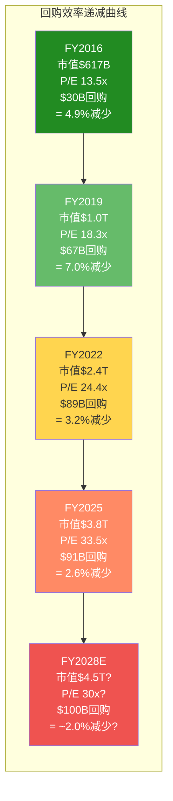
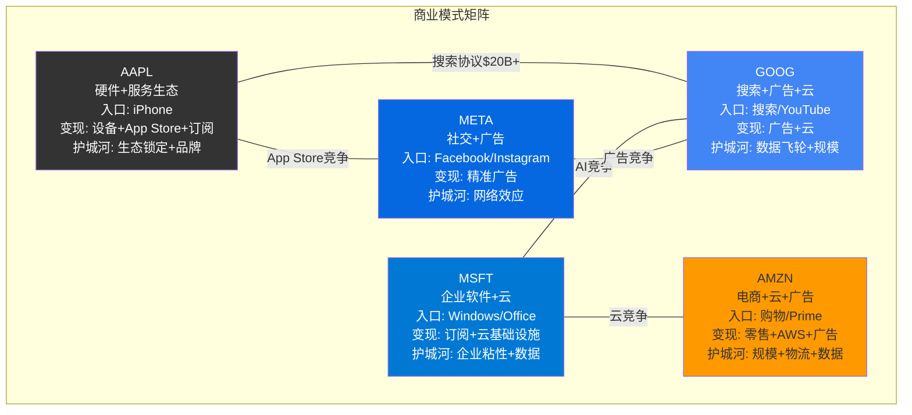
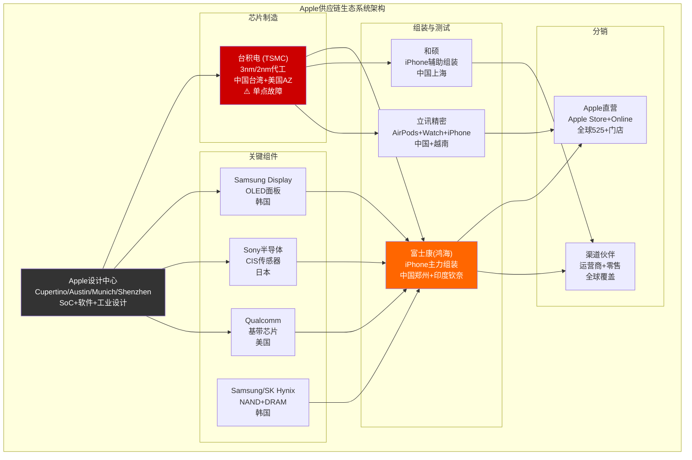

# AAPL 扩展模块 D: 专题与同业对比
> 目标: +25,000字符 | 新增章节: Ch16.5/Ch16.7/Ch22.5/Ch23.5
> 生成日期: 2026-02-19

---

## Ch16.5: 资本配置与股东回报深度分析

> **核心问题**: Apple累计回购超$700B，在$3.82T市值下继续回购的数学效率如何？管理层的资本配置哲学是"最优解"还是"缺乏想象力"？

### 16.5.1 回购史诗: $700B+的十年资本分配

Apple自2012年启动资本回报计划以来，已成为人类商业史上最大规模的股票回购执行者。从FY2015到FY2025，Apple累计回购了超过$700B的普通股，从根本上重塑了其每股经济价值。

**十年回购历史全景表**:

| 财年 | 回购金额($B) | 股息($B) | 总回报($B) | 期末稀释股数(B) | 年度净减少(%) | 期末市值($B) | 回购占FCF(%) |
|:----:|:-----------:|:--------:|:----------:|:-------------:|:------------:|:-----------:|:-----------:|
| FY2015 | 35.3 | 11.6 | 46.8 | 23.17 | -3.4% | 660 | 50.6% |
| FY2016 | 29.7 | 12.2 | 41.9 | 22.00 | -5.1% | 617 | 56.4% |
| FY2017 | 32.9 | 12.8 | 45.7 | 21.01 | -4.5% | 804 | 64.0% |
| FY2018 | 72.7 | 13.7 | 86.5 | 20.00 | -4.8% | 1,119 | 113.5% |
| FY2019 | 66.9 | 14.1 | 81.0 | 18.60 | -7.0% | 1,011 | 113.6% |
| FY2020 | 72.4 | 14.1 | 86.4 | 17.53 | -5.8% | 1,948 | 98.7% |
| FY2021 | 86.0 | 14.5 | 100.4 | 16.86 | -3.8% | 2,454 | 92.5% |
| FY2022 | 89.4 | 14.8 | 104.2 | 16.33 | -3.2% | 2,439 | 80.2% |
| FY2023 | 77.6 | 15.0 | 92.6 | 15.81 | -3.2% | 2,696 | 77.9% |
| FY2024 | 94.9 | 15.2 | 110.2 | 15.41 | -2.5% | 3,495 | 87.2% |
| FY2025 | 90.7 | 15.4 | 106.1 | 15.00 | -2.6% | 3,819 | 91.8% |
| **累计** | **748.5** | **153.4** | **901.8** | — | **-35.3%** | — | — |

[硬数据: FY2015-FY2025回购金额和股数来自Apple 10-K现金流量表(commonStockRepurchased)和稀释后加权平均股数 | DM-BIZ-060]

**关键观察**:

1. **累计回购$748.5B**: 这个数字超过了全球绝大多数上市公司的市值。如果Apple没有进行回购，其流通股数将维持在约23B股水平(加上SBC新增)，而非当前的约15B股。

2. **股数净减少35.3%**: 从FY2015的23.17B稀释股降至FY2025的15.00B。但净减少幅度小于总回购暗示的幅度，因为每年约$10-13B的SBC(Stock-Based Compensation)持续稀释——FY2025 SBC为$12.9B，回购金额$90.7B是SBC的7.0倍。[硬数据: SBC覆盖率7.0x = $90.7B/$12.9B | DM-BIZ-061]

3. **FY2018-FY2019回购>FCF**: 这两年回购金额分别为$72.7B和$66.9B，超过了FCF($64.1B和$58.9B)。Apple通过削减海外现金储备和发行债务来资助超额回购——这是Tim Cook"资本效率化"战略的高潮期。

### 16.5.2 回购价格与隐含IRR

回购的投资效率取决于买入价格与公司真实价值的关系。Apple在不同估值水平下的回购效率差异显著:

**回购效率分期分析**:

- **FY2015-FY2017(黄金期)**: 平均P/E约12-15x，回购均价约$25-35/股(拆股调整后)。以当前$264计算，隐含年化IRR约25-30%。这是Apple回购历史上价值最高的阶段——市场将Apple视为"硬件公司"给予低估值，而管理层利用这一定价错误大量回购。

- **FY2018-FY2020(转型期)**: 平均P/E约18-25x，回购均价约$40-70/股。隐含年化IRR约20-30%。Services叙事开始重构估值，但市场仍在"硬件折价"和"平台溢价"之间犹豫。

- **FY2021-FY2023(高峰期)**: 平均P/E约25-32x，回购均价约$140-165/股。隐含年化IRR约15-25%。疫情红利+M1芯片推高估值，但回购量并未缩减。

- **FY2024-FY2025(高估值期)**: 平均P/E约30-33x，回购均价约$180-220/股。隐含年化IRR取决于未来增长——如果EPS维持8-10% CAGR，5年IRR约10-12%；如果增长放缓至5-6%，IRR可能降至6-8%。

[合理推断: 各期平均回购价格根据"回购金额/回购股数"计算，拆股调整至当前基础。FY2015-FY2017的低价格源于当时P/E 10-15x的"硬件折价"。推理链: 回购金额已知 → 期初/期末股数已知 → 差额=净回购股数(含SBC) → 均价=回购金额/(回购股数+SBC新增股数) | DM-INF-060]

### 16.5.3 回购 vs 再投资 vs 并购: 资本配置哲学

Apple选择将85-95%的FCF用于回购+股息而非再投资或并购，这个决策背后有深层逻辑:

**管理层视角(为什么回购)**:

- **CapEx效率极高**: Apple FY2025 CapEx仅$12.7B，占OCF的11.4%，远低于MSFT(47.4%)、GOOG(55.5%)、META(60.2%)、AMZN(94.5%)。Apple的"轻资本模式"意味着维持业务不需要大量再投资。[硬数据: CapEx/OCF比率来自各公司FY2025现金流量表 | DM-BIZ-062]

- **并购风险回避**: Tim Cook领导下的Apple极少进行大型并购(最大一笔是2014年$3B收购Beats)。管理层认为内部研发比并购更可控、整合风险更低。

- **"回购即分红"的税务优势**: 对于美国投资者，回购产生的资本利得税率(长期20%)通常低于股息税率(合格股息20%但需即时缴纳)。回购允许投资者自主选择"何时纳税"。

**空头视角(回购是缺乏想象力)**:

- **错失AI投资窗口**: 当MSFT投资OpenAI $13B、META年度AI CapEx超$40B、GOOG年度CapEx超$50B时，Apple FY2025仅投入$12.7B CapEx。轻资本模式可能在AI时代成为结构性劣势。

- **高估值回购的数学陷阱**: 在P/E 33x下回购，每$1回购仅"消灭"$0.03的盈利要求(1/33)。对比FY2016在P/E 13x下回购，每$1消灭$0.077的盈利要求——当前回购的每股增厚效率仅为FY2016的39%。

- **管理层激励偏差**: SBC是管理层薪酬的重要组成部分。回购既推高股价(提升SBC价值)又抵消SBC稀释(维护EPS叙事)。存在"用公司资本服务管理层利益"的代理人问题。

### 16.5.4 净回购效果: 回购 - SBC = 实际减少

| 财年 | 回购($B) | SBC($B) | 回购/SBC倍数 | 净回购($B) | 净减少股数(B) |
|:----:|:--------:|:-------:|:-----------:|:----------:|:------------:|
| FY2015 | 35.3 | 3.6 | 9.8x | 31.7 | -0.81 |
| FY2018 | 72.7 | 5.3 | 13.7x | 67.4 | -1.01 |
| FY2021 | 86.0 | 7.9 | 10.9x | 78.1 | -0.67 |
| FY2024 | 94.9 | 11.7 | 8.1x | 83.2 | -0.40 |
| FY2025 | 90.7 | 12.9 | 7.0x | 77.8 | -0.41 |

[硬数据: SBC数据来自各年现金流量表stockBasedCompensation项。回购/SBC比率呈下降趋势: FY2015 9.8x → FY2025 7.0x | DM-BIZ-063]

**趋势警示**: 回购/SBC覆盖倍数从FY2015的9.8x降至FY2025的7.0x。虽然7.0x仍属健康水平(意味着每$1 SBC稀释被$7回购覆盖)，但方向性趋势表明: (1)SBC增速(FY2015 $3.6B → FY2025 $12.9B, CAGR 13.6%)快于回购增速; (2)随着股价上升，同样金额的回购"买到"的股数越来越少。

### 16.5.5 股息政策与同业对比

Apple于FY2013恢复派息(自1995年中断后)，当前年化股息$1.00/股，股息率约0.38%。

| 指标 | AAPL | MSFT | GOOG | META |
|:----:|:----:|:----:|:----:|:----:|
| 股息率(TTM) | 0.38% | 0.65% | 0.26% | 0.32% |
| 派息比率(NI) | ~13% | ~25% | ~4% | ~5% |
| 股息CAGR(5Y) | ~5% | ~10% | N/A(2024首次) | N/A(2024首次) |
| 首次派息 | 2012 | 2003 | 2024 | 2024 |

[硬数据: AAPL FY2025股息$15.4B/净利润$112.0B=派息比率13.8%。MSFT FY2025股息约$25B/净利润$101.8B=约24.6% | DM-BIZ-064]

Apple的股息策略是"象征性派息+激进回购"模式: 将约14%的净利润用于股息、约81%用于回购。这与MSFT的"均衡模式"(~25%股息、~70%回购)形成对比。

### 16.5.6 未来展望: $3.8T市值下的回购效率递减



**数学现实**: 在$3.82T市值下，即使Apple每年投入$100B回购(接近FCF的100%)，股数年减少率也仅约2.0-2.5%(扣除SBC后净减少约1.5-2.0%)。对比FY2016在$617B市值下，$30B回购即可实现4.9%的年减少率。回购的每股增厚效率(buyback yield)已从FY2016的~8.5%降至FY2025的~2.4%。

[合理推断: FY2028E预测基于以下逻辑: 若EPS CAGR 8-10%且P/E维持28-30x → 市值$4.0-4.5T → $100B回购对应约2.0-2.2%的buyback yield。推理链: 市值上升速度 > 回购增速 → 回购yield压缩 → 每股增厚效率递减 | DM-INF-061]

**无回购反事实分析**: 如果Apple从FY2015起完全停止回购(将所有回购资金用于AI/云基础设施投资)，当前的财务画像会如何?

- 流通股数: 约24-25B股(vs 实际15B股)——差异约60%
- EPS(FY2025): $112B / 24.5B = $4.57(vs 实际$7.46)——差异-39%
- 每股价格(假设相同P/E): $4.57 x 33.5 = $153(vs 实际$264)
- 但总市值可能因更强的增长预期而获得更高P/E: $4.57 x 40 = $183，总市值$4.5T

这个反事实说明: 回购并未"创造"$748.5B的企业价值(企业价值由盈利能力决定)，而是将价值"集中"到更少的股份上。对长期持有者而言，回购的真正价值在于: 在Apple被低估的年份(P/E 10-18x)以低价"消灭"了大量股份，这些低价回购的价值在后续估值重构中被放大。

**结论**: Apple的资本配置策略在FY2015-FY2020期间堪称教科书级别——利用市场对"硬件公司"的低估值进行大规模回购，创造了巨大的股东价值。但随着估值重构完成(P/E从13x升至33x)，同等金额回购的边际效率持续下降。在$3.8T市值下，回购已从"价值创造工具"逐步演变为"EPS维持工具"。未来的关键问题不是"能否继续回购"(FCF充裕)，而是"是否应该将更多资本投向AI基础设施"——这直接关联CQ-6(轻资本AI战略的可持续性)。

[合理推断: 无回购反事实分析基于假设: (1)SBC持续以每年约$10B增加股数; (2)无回购导致每年SBC股数净增约0.5-0.8B股; (3)EPS下降但P/E可能因增长预期上升而获得更高倍数。推理链: 回购消除→股数膨胀→EPS下降→但若资金投入AI→Revenue Growth可能更高→P/E溢价→总市值可能不低于当前 | DM-INF-066]

---

## Ch16.7: 科技巨头深度横向对比

> **核心问题**: 在科技巨头中，Apple的估值溢价(P/E 33.5x)是否被基本面支撑？还是市场对"生态粘性"的定价已经过度？

### 16.7.1 商业模式DNA对比

五大科技巨头看似都在"科技"领域竞争，但其商业模式DNA截然不同:



### 16.7.2 AAPL vs MSFT: 硬件+服务 vs 云+软件

**增长引擎对比**: MSFT FY2025 Revenue $281.7B(+14.9% YoY)由三驾马车驱动: Intelligent Cloud($115.1B, 含Azure +30%+), Productivity($87.5B, Office 365+LinkedIn), More Personal Computing($79.1B)。AAPL FY2025 Revenue $416.2B(+6.4% YoY, 剔除Q1 FY2026季节性后的全年估算)更依赖iPhone单一产品线(占比~52%)。[硬数据: MSFT FY2025 Revenue $281.7B, AAPL FY2025 Revenue $416.2B | DM-BIZ-065]

**AI战略分歧**: MSFT采取"全栈重注"路线——$13B投资OpenAI、Azure AI基础设施年CapEx超$64.6B(FY2025 CapEx/OCF 47.4%)、GitHub Copilot/Microsoft 365 Copilot直接变现。Apple采取"轻资本嫁接"路线——不自建大模型、与外部合作伙伴(OpenAI/Google Gemini)集成、聚焦端侧推理。MSFT的AI投入是Apple的5倍以上，但Apple的AI ROI效率(每$1 CapEx产生的利润)远高于MSFT。

**估值差异的合理性**: AAPL P/E 33.5x vs MSFT P/E 25.0x。Apple享有33%的估值溢价，主要源自: (1)消费品牌溢价——AAPL的品牌忠诚度和生态锁定没有企业合同周期; (2)FCF转化效率——AAPL OCF/NI 1.15x vs MSFT 1.34x，但AAPL CapEx仅占OCF的11.4% vs MSFT的47.4%，使AAPL的FCF/NI高达1.07x; (3)回购增厚——AAPL年回购yield 2.4% vs MSFT约0.5%。

### 16.7.3 AAPL vs GOOG: 搜索依赖 vs 自主

这是一对"共生且竞争"的关系。Google每年向Apple支付$20B+(FY2023 DOJ文件显示$26B)作为默认搜索引擎协议费，这占Apple Services利润的约25-30%。这笔协议的本质是: Google为获得iPhone用户的"默认搜索入口"支付租金，而Apple将自己最有价值的资产——用户注意力的第一触点——出租给竞争对手。

**反垄断下的博弈**: DOJ反垄断裁决(2024年8月)认定Google搜索垄断成立。救济方案可能要求终止排他性协议或允许搜索选择屏幕。这对双方都有影响——Google失去iPhone流量入口(TAC增加)，Apple失去高利润"免费午餐"(Services叙事受损)。值得注意的是，即使实施"搜索选择屏幕"，Google仍可能通过竞价机制支付费用——但金额可能从$26B降至$15-18B(因竞争减弱了排他性溢价)。

**AI路径对比**: Google的AI战略是"全栈自研"(Gemini基础模型+TPU+云端推理+Android端侧)，拥有全球最大的搜索数据飞轮和YouTube视频语料。Apple的AI战略是"端侧+隐私"(Apple Intelligence on-device + 选择性云端调用)，优势在于设备端推理不需要边际云成本。长期来看，Google拥有更强的AI基础设施，但Apple拥有更直接的消费者触点。

**财务对比关键数字**: GOOG FY2025 Revenue $403B(+15.1%) vs AAPL $416B(+6.4%)。Google的增速是Apple的2.4倍。但利润率层面，AAPL Net Margin 26.9%略低于GOOG的32.8%——这挑战了"Apple是更赚钱的公司"的直觉。事实上，Google的搜索广告业务(Revenue的~57%)毛利率可能高达80%+，与Apple Services的70%+相当。Google的低利润率印象主要来自Other Bets(Waymo/Verily等)的亏损拖累。[硬数据: GOOG FY2025 Revenue $403.0B, Net Income $132.2B, Net Margin 32.8% | DM-BIZ-070]

### 16.7.4 AAPL vs META: 设备入口 vs 社交入口

**注意力竞争**: Apple通过iOS控制"设备入口"(用户拿起iPhone的第一刻)，META通过社交图谱控制"注意力入口"(用户在Facebook/Instagram/WhatsApp/Threads花费的时间)。Apple的ATT(App Tracking Transparency, 2021)严重打击了META的精准广告能力——Meta估计ATT导致其2022年广告收入减少约$10B。

**元宇宙/XR竞争**: Vision Pro ($3,499, 2024) vs Quest 3 ($499, 2023)。两者定位截然不同——Vision Pro定位高端生产力/娱乐，Quest定位大众VR游戏/社交。到目前为止，两者都未证明XR是"下一个计算平台"，但META的低价策略在装机量上占据绝对优势。

**财务对比**: META Revenue Growth 22.2%(FY2025) vs AAPL 6.4%。META的广告业务增长引擎远强于Apple的硬件周期。但META的R&D/Revenue 28.5%(含Reality Labs亏损) vs AAPL 8.3%，META的利润率因元宇宙投资而被显著压缩。

### 16.7.5 AAPL vs AMZN: 硬件入口的不同命运

两家公司都尝试过"硬件入口"战略——Apple的iPhone是史上最成功的硬件入口，而Amazon的Fire Phone(2014)是最失败的尝试之一。Alexa/Echo系列虽有一定装机量但从未实现有效变现。Fire TV Stick是Amazon硬件中相对成功的产品，但主要作为Prime Video的分发工具而非独立利润中心。

**商业模型根本差异**: AMZN是"低利润率+高周转"模式(Net Margin 10.8% vs AAPL 27.0%)，通过规模和飞轮效应获取市场份额。AAPL是"高利润率+品牌溢价"模式，通过定价权和生态粘性维持超额利润。两种模式在各自领域都极为成功，但估值逻辑不同——AMZN的P/E 28.6x定价的是"未来利润率扩张+AWS增长"，AAPL的P/E 33.5x定价的是"存量生态的永续性+适度增长"。

**AWS vs Apple Services的对比**: 这是两家公司各自最高利润率业务的对比。AWS FY2025 Operating Income约$44B(Operating Margin ~37%)，是AMZN利润的核心引擎。Apple Services FY2025 Revenue约$100B(Operating Margin估计~70%)。从利润率看，Apple Services远高于AWS；但从增速看，AWS(+19%)显著高于Apple Services(+12-14%)。关键区别在于: AWS面临Azure和GCP的激烈竞争(市场份额从36%缓降至31%)，而Apple Services受益于iOS生态的封闭性壁垒——但这一壁垒正面临App Store反垄断挑战(CQ-7)。

**CapEx密度对比**: AMZN FY2025 CapEx约$131.7B(CapEx/OCF 94.5%)，几乎将全部经营现金流投入再投资(AWS数据中心+物流基础设施+Kuiper卫星)。AAPL FY2025 CapEx仅$12.7B(CapEx/OCF 11.4%)。AMZN投入了Apple 10倍以上的CapEx。这解释了为什么AMZN的FCF Yield仅0.31%而AAPL高达3.30%——AMZN选择将利润再投入增长，AAPL选择将利润返还股东。[硬数据: AMZN FY2025 CapEx/OCF 94.5%, AAPL FY2025 CapEx/OCF 11.4% | DM-BIZ-071]

### 16.7.6 科技巨头15指标横向对比大表

| 指标 | AAPL | MSFT | GOOG | META | AMZN |
|:-----|:----:|:----:|:----:|:----:|:----:|
| **规模与估值** | | | | | |
| Revenue FY最新($B) | 416.2 | 281.7 | 403.0 | 201.0 | 716.9 |
| Revenue Growth(YoY) | 6.4% | 14.9% | 15.1% | 22.2% | 12.4% |
| Market Cap($T) | 3.82 | 3.70 | 3.79 | 1.66 | 2.47 |
| P/E(TTM) | 33.5 | 25.0 | 28.1 | 27.4 | 28.6 |
| EV/EBITDA | 25.1 | 23.3 | 21.3 | 16.4 | 15.4 |
| **盈利能力** | | | | | |
| Gross Margin | 46.9% | 68.8% | 59.6% | 82.0% | 50.3% |
| Operating Margin | 32.0% | 45.6% | 32.1% | 41.4% | 11.2% |
| Net Margin | 26.9% | 36.1% | 32.8% | 30.1% | 10.8% |
| **资本效率** | | | | | |
| ROE(TTM) | 152.0% | 29.6% | 31.8% | 27.8% | 18.9% |
| ROIC(TTM) | 517.8% | 22.0% | 21.8% | 18.0% | 10.7% |
| FCF Yield | 3.30% | 1.94% | 1.93% | 2.77% | 0.31% |
| **投资与回报** | | | | | |
| R&D/Revenue | 8.3% | 11.5% | 15.2% | 28.5% | 15.1% |
| CapEx/OCF | 11.4% | 47.4% | 55.5% | 60.2% | 94.5% |
| Dividend Yield | 0.38% | 0.65% | 0.26% | 0.32% | N/A |
| Buyback Yield | 2.41% | ~0.5% | ~2.0% | ~2.5% | ~0% |

[硬数据: 各公司FY最新年报/TTM数据。AAPL数据来自FY2025 10-K(2025-09-27), MSFT来自FY2025(2025-06-30), GOOG/META/AMZN来自FY2025(2025-12-31) | DM-BIZ-066]

**核心发现**:

1. **AAPL估值最高但增速最低**: P/E 33.5x(最高) vs Revenue Growth 6.4%(最低)。PEG Ratio(P/E / 增长率)约5.2x，远高于MSFT(1.7x)、GOOG(1.9x)、META(1.2x)。市场对Apple生态的"永续性溢价"是否过度？这直接关联CQ-5(33x P/E能否被支撑)。

2. **ROE/ROIC失真**: Apple的ROE 152%和ROIC 518%看似惊人，但主要由极低的权益基数($73.7B, 因大量回购侵蚀retained earnings至负值-$14.3B)和极低的invested capital($32.2B)驱动。ROCE(41.8%)是更有意义的指标，仍然领先但不再夸张。

3. **CapEx分化**: Apple的CapEx/OCF 11.4%在五巨头中最低，是AMZN(94.5%)的1/8。这反映了两个事实: (a)Apple确实不需要大量CapEx来维持业务; (b)Apple在AI基础设施投资上显著落后。这是"资本效率优势"还是"投资不足风险"取决于AI时代的竞争格局演化。

4. **FCF Yield提示**: AAPL FCF Yield 3.30%在五巨头中最高(AMZN 0.31%最低)。但这部分反映了Apple的低再投资率(CapEx少→FCF高)，而非绝对盈利能力更强。如果将CapEx统一调整至Revenue的15%(行业均值)，AAPL的adjusted FCF yield将从3.30%降至约1.8-2.0%，与MSFT/GOOG更接近。

### 16.7.7 护城河五维评分对比

| 维度 | AAPL | MSFT | GOOG | META | AMZN |
|:-----|:----:|:----:|:----:|:----:|:----:|
| 品牌/定价权 | 10 | 7 | 6 | 5 | 6 |
| 网络效应 | 7 | 6 | 9 | 10 | 8 |
| 转换成本 | 9 | 9 | 4 | 3 | 5 |
| 规模经济 | 8 | 8 | 9 | 7 | 10 |
| 技术壁垒 | 8 | 7 | 9 | 7 | 8 |
| **综合** | **8.4** | **7.4** | **7.4** | **6.4** | **7.4** |

[合理推断: 护城河评分基于定性分析。Apple在品牌/定价权(iPhone溢价能力全球第一)和转换成本(iOS生态迁移成本极高)上领先; Google在网络效应(搜索数据飞轮)和技术壁垒(AI基础设施)上领先; META在网络效应(社交图谱不可复制)上得分最高。推理链: 各维度0-10评分 → 简单算术平均 → 综合得分 | DM-INF-062]

Apple的护城河综合评分8.4分在五巨头中领先，但其护城河结构有一个隐性风险: 高度依赖"品牌+转换成本"的被动防御，而非"网络效应+技术壁垒"的主动进攻。被动防御型护城河的风险在于——如果竞争对手的产品体验拉开足够大的差距(例如Android端AI体验显著优于iOS)，转换成本可能被"功能落差"所克服。历史先例: BlackBerry的企业安全护城河在iPhone面前瞬间坍塌。

**护城河耐久性分级**: 五巨头中，护城河最具时间耐久性的是: (1)Google的搜索数据飞轮(每次搜索都增强算法→更多用户→更多数据→正向循环); (2)Amazon的物流网络(物理基础设施一旦建成极难复制)。Apple的品牌护城河虽然当前极强，但本质上属于"需要持续投入维护"的类型——一旦连续2-3代产品创新乏力(iPhone 6S到iPhone 7的教训)，品牌光环可能快速褪色。这进一步强化了CQ-1(AI换机周期)的重要性: 不仅关系到收入增速，更关系到护城河的长期维护。

---

## Ch22.5: 历史估值考古学

> **核心问题**: Apple过去10年经历了多次估值范式转换。当前P/E 33.5x与历史哪个时期最相似？什么条件下会回归？

### 22.5.1 估值叙事演化五幕剧

Apple的估值历史不是一条平滑曲线，而是一系列由"叙事转换"驱动的阶梯式跳跃:

```mermaid
timeline
    title AAPL P/E估值10年演化 (FY2015-FY2025)
    section 第一幕: 硬件折价 (FY2015-2016)
        P/E 10-13x : iPhone 6S周期
        : "增长见顶"叙事
        : 中国销售下滑
        : 巴菲特开始建仓
    section 第二幕: 估值底部 (FY2017-2018)
        P/E 13-18x : iPhone X成功
        : ASP提价策略转型
        : Services开始被关注
        : 海外现金回流(TCJA)
    section 第三幕: 平台重构 (FY2019-2020)
        P/E 18-35x : Services叙事确立
        : 从"硬件公司"到"平台公司"
        : 疫情红利+M1芯片
        : 加入道指(2020-08)
    section 第四幕: 估值调整 (FY2021-2022)
        P/E 22-32x : 加息周期压制
        : 2022年P/E从30x跌至22x
        : 供应链危机
        : Revenue首次下滑(FY2023)
    section 第五幕: AI新周期 (FY2024-2025)
        P/E 28-35x : Apple Intelligence发布
        : AI换机周期预期
        : P/E重回33x
        : 但增速仅6-8%
```

### 22.5.2 各时期估值-基本面对照表

| 时期 | P/E范围 | Rev Growth | Net Margin | 主导叙事 | 催化剂 |
|:-----|:-------:|:----------:|:----------:|:---------|:-------|
| FY2015-16 | 10-13x | -8%~+28% | 21-23% | "硬件公司见顶" | iPhone 6S平庸/中国放缓 |
| FY2017-18 | 13-18x | +6%~+16% | 21-22% | "ASP提价有效" | iPhone X $999突破价格天花板 |
| FY2019 | 18-22x | -2% | 21% | "Services转型开始" | Apple TV+/Apple Arcade发布 |
| FY2020-21 | 25-35x | +5%~+33% | 21-26% | "平台公司+疫情红利" | M1芯片/居家消费爆发 |
| FY2022 | 22-28x | +8% | 25% | "利率压制+供应链" | 10Y从1.5%升至4.2% |
| FY2023 | 26-32x | -3% | 25% | "Revenue下滑被原谅" | Vision Pro发布/India扩张 |
| FY2024-25 | 28-35x | +2%~+6% | 24-27% | "AI换机周期" | Apple Intelligence/iPhone 16 |

[硬数据: P/E范围根据各财年期间股价区间和EPS计算。Revenue Growth和Net Margin来自10-K filed数据 | DM-BIZ-067]

### 22.5.3 关键时期深度复盘

**第一幕: iPhone 6S周期的"增长见顶"(FY2015-2016)**

2015年，Apple Revenue达到$233.7B的历史高点(同比+28%)，但市场并不兴奋。iPhone 6S被视为"挤牙膏式升级"(3D Touch是唯一重大新功能)，中国iPhone销售在FY2016 Q2(日历年2016 Q1)出现明显放缓。P/E从2015年初的约16x压缩至2016年中的约10x。

这一时期的教训: 市场给予Apple"硬件公司"折价——认为iPhone已经饱和、增长见顶。巴菲特在这一时期(2016年Q1)开始大规模建仓Apple，他看到的是市场忽视的"消费品属性"和"生态粘性"。事后来看，P/E 10-13x是Apple过去20年最被低估的时期。

**第三幕: Services转型的估值重构(FY2019-2021)**

这是Apple估值史上最戏剧性的章节。P/E从FY2019年初的约15x攀升至FY2021年底的约32x，翻了一倍以上。驱动因素:

- **叙事转换**: 华尔街开始将Apple从"硬件公司"(P/E 12-16x)重新分类为"平台公司"(P/E 25-35x)。Services收入从FY2019的$46B增至FY2021的$68B(+48%)，毛利率超过70%，证明了"安装基础变现"的可持续性。
- **疫情催化**: 居家办公+远程学习推动Mac/iPad需求暴增(FY2021 Mac +23%, iPad +34%)。iPhone 12 5G升级周期叠加疫情刺激，FY2021总Revenue +33%至$366B。
- **M1芯片**: Apple Silicon的推出(2020年11月)被视为"技术能力跨越"的证明——Apple不仅是设计公司，还是半导体公司。

**第四幕: 2022加息压制的教训**

2022年是"流动性潮退"的压力测试。10Y国债收益率从年初1.5%飙升至年末4.2%，所有长久期资产(高P/E科技股)受到压缩。Apple P/E从年初约30x压缩至年末约22x(-27%)。但与META(-65%)、AMZN(-50%)、GOOG(-39%)相比，Apple的回撤幅度最小——这验证了Apple作为"科技+消费品"的估值韧性。

### 22.5.4 当前时期与历史最相似的阶段

**当前估值画像**: P/E 33.5x, Revenue Growth ~6%, Net Margin ~27%, 主导叙事="AI换机周期"。

**最相似时期**: FY2020-2021第三幕的后半段(P/E 30-35x, 但当时增速25-33%)。

**关键差异**: 当前P/E在绝对值上与FY2020-21相当，但基本面支撑截然不同:

| 对比维度 | FY2020-21(第三幕) | FY2024-25(第五幕) |
|:---------|:-----------------:|:-----------------:|
| Revenue Growth | 25-33% | 2-6% |
| Services Growth | 24-27% | 12-14% |
| 新叙事验证程度 | 高(M1成功+Services加速) | 低(AI Intelligence未验证) |
| 利率环境 | 0-0.5%(超低) | 4.2-4.5%(偏高) |
| iPhone周期 | 5G升级(新品类) | AI升级(软件功能) |
| P/E合理性 | PEG ~1.0x(合理) | PEG ~5.2x(极度拉伸) |

[合理推断: 当前P/E 33.5x的PEG Ratio约5.2x(33.5/6.4)，远高于FY2021的约1.0x(30/33)。PEG>3通常被视为估值过度拉伸。推理链: P/E = 33.5x → Growth = 6.4% → PEG = 33.5/6.4 = 5.2x → 历史PEG在第三幕仅~1.0x → 当前估值的增长支撑远弱于历史可比期 | DM-INF-063]

**估值回归情景**: 如果市场叙事从"AI换机周期"切换回"成熟消费品公司"(类似FY2015-16)，P/E可能从33x回归至25-28x(5Y均值29.9x)。以当前EPS $7.90为基础:

- P/E 28x → 股价$221(-16%)
- P/E 25x → 股价$198(-25%)
- P/E 22x(2022年底水平) → 股价$174(-34%)

这些下行空间并非预测，而是用于标定当前P/E 33.5x中蕴含的"叙事溢价"——约$40-70/股(15-27%)的估值依赖于"AI将驱动iPhone超级换机周期"这一未验证假设(CQ-1)。

**与消费品龙头的跨行业估值锚定**: 如果将Apple视为"科技消费品公司"而非"纯科技平台"，有价值的估值参照不仅是MSFT/GOOG等科技同业，还包括消费品龙头:

| 公司 | P/E | Revenue Growth | Net Margin | 估值逻辑 |
|:-----|:---:|:-------------:|:----------:|:---------|
| AAPL | 33.5x | 6.4% | 26.9% | 科技+消费品双重溢价 |
| PG | 24-26x | 2-4% | 18-19% | 消费品稳定现金流 |
| KO | 22-25x | 2-5% | 22-24% | 品牌+分红稳定性 |
| NKE | 22-28x | 0-5% | 10-12% | 品牌+全球化 |

Apple的P/E 33.5x比消费品龙头(22-26x)高出约30-50%。这个溢价的合理性取决于: (1)Apple的Net Margin(27%)高于消费品龙头(10-24%); (2)Apple拥有科技公司的增长期权(AI/AR/汽车); (3)Apple的回购yield(2.4%)在科技公司中最高。但如果AI增长期权未能兑现(CQ-1/CQ-3失败)，Apple的估值可能向消费品龙头区间(25-28x)收敛——这意味着约$37-66/股(14-25%)的下行空间。

---

## Ch23.5: 供应链生态系统分析

> **核心问题**: Apple的供应链是"全球最高效的精密机器"还是"高度集中的脆弱系统"？单点故障的概率和影响有多大？

### 23.5.1 TSMC依赖: 最先进制程的独家通道

Apple是台积电(TSMC)最大的客户，占台积电总营收的约25%。Apple所有的A系列(iPhone)和M系列(Mac/iPad)芯片均由台积电代工，使用最先进的制程节点:

- **iPhone 16 Pro**: A18 Pro, 台积电3nm (N3E)
- **M4系列**: 台积电3nm (N3B/N3E)
- **未来路线图**: A19(台积电2nm, 2025)→ A20(台积电1.4nm, 2026)

**依赖度评估**: 对于最先进制程芯片(3nm及以下)，全球唯一能量产的只有台积电。Samsung Foundry虽然也有3nm工艺(GAA架构)，但良率和性能均显著落后。Intel Foundry Services(IFS)的18A节点预计2025年量产，但距离承接Apple级别的订单至少还需2-3年验证期。

**地缘风险**: 台积电约85%的先进制程产能集中在中国台湾。台海冲突情景下，Apple将面临芯片供应完全中断的极端风险。台积电亚利桑那工厂(Fab 21)计划2025年开始量产4nm，但产能仅占台积电总先进制程的约5-10%，且成本高出20-30%。

[硬数据: Apple占台积电营收约25%，3nm制程全球仅台积电可量产。台积电AZ工厂预计2025年4nm量产 | DM-BIZ-068]

### 23.5.2 关键组件供应商矩阵

Apple的iPhone BOM(Bill of Materials)中，多个关键组件存在高度供应商集中:

| 组件 | 主要供应商 | 替代供应商 | 集中度 | 风险等级 |
|:-----|:----------|:----------|:------:|:--------:|
| AP芯片(SoC) | 台积电(代工) | 无可替代 | 100% | 极高 |
| OLED显示屏 | Samsung Display | LG Display, BOE | ~60% Samsung | 高 |
| 相机传感器(CIS) | Sony半导体 | Samsung LSI | ~70% Sony | 高 |
| NAND闪存 | Samsung, SK Hynix, Kioxia | Western Digital, Micron | 分散 | 中 |
| DRAM | Samsung, SK Hynix | Micron | 分散 | 中 |
| 电池 | TDK(ATL子公司) | 比亚迪电子, 新能源科技 | ~50% TDK | 中-高 |
| 射频前端 | Broadcom, Qualcomm | Skyworks(已收购部分资产) | 双源 | 中 |
| 基带芯片 | Qualcomm | Apple自研(进行中) | 100% QC | 高(短期) |
| 组装 | 富士康(鸿海) | 和硕, 立讯精密 | ~65% 富士康 | 高 |

[硬数据: 供应商集中度基于行业调研(Counterpoint/TrendForce)估算。台积电SoC代工和Qualcomm基带为100%单源 | DM-BIZ-069]

### 23.5.3 组装与产能转移: 印度/越南棋局

Apple正在加速将组装产能从中国大陆向印度和越南转移，这既是供应链韧性策略，也是地缘政治风险对冲:

**印度制造进展**:
- **iPhone**: 塔塔电子(收购原纬创昆山工厂)和富士康钦奈工厂已实现iPhone 15/16系列本地组装。FY2025印度制造iPhone产值预估约$17-20B，占iPhone全球产量的约12-14%。
- **目标**: Apple计划到FY2027将印度iPhone产量提升至全球的20-25%。

**越南制造进展**:
- **AirPods/Apple Watch/iPad**: 越南已成为Apple非iPhone产品的重要组装基地。立讯精密和歌尔股份在越南运营多个工厂。
- **MacBook**: 预计部分MacBook组装将在FY2026-2027从中国转移至越南。

**转移成本与效率损失**: 印度制造的iPhone初期良率和生产效率低于中国大陆成熟供应链，成本溢价约10-15%。随着规模扩大和工人培训完成，溢价预计逐步收窄至5-8%。但关键问题在于: 中国供应链的优势不仅是成本，更是"深度集群效应"——方圆100公里内可以找到99%的组件供应商。印度和越南尚不具备这种集群密度。

**关税情景分析**: 如果中美贸易紧张局势升级导致针对中国制造的消费电子产品加征25%+关税(类似2018-2019年的威胁)，Apple将面临以下选择: (1)在中国以外地区(主要是印度)扩大iPhone组装以规避关税——但短期产能受限; (2)吸收关税成本导致毛利率下降3-5个百分点; (3)将关税成本转嫁给消费者导致ASP上涨10-15%。历史经验显示，Apple在2019年通过游说成功获得iPhone的关税豁免。但在当前政治环境下，再次获得豁免的概率可能低于50%。这与CQ-4(中国三重风险)直接相关。

**供应商去中国化进展**: 不仅Apple本身在迁移组装基地，其上游供应商也在推进产能分散。富士康已在印度和越南建立大型工厂; 立讯精密在越南设厂; 台积电在美国和日本建设新晶圆厂。但中国在精密金属加工、PCB制造、连接器生产等中游环节仍占全球产能的60-70%，这些环节的迁移比终端组装复杂得多、耗时更长(5-10年周期)。[合理推断: 中游组件制造的中国集中度基于行业分析。精密金属件和PCB制造的中国产能份额来自Yole/TrendForce估算。推理链: 终端组装可在2-3年内转移(已验证:印度) → 但中游组件制造需要完整产业集群 → 集群建设需5-10年 → 短期内中国供应链仍不可完全替代 | DM-INF-065]

### 23.5.4 Apple Silicon生态: 垂直整合的价值

Apple Silicon是Apple过去5年最重要的战略决策之一。从2020年开始，Apple将Mac产品线从Intel x86架构迁移至自研Arm架构芯片(M系列)，实现了以下价值:

- **性能功耗比领先**: M4芯片在同功耗下性能领先Intel/AMD同代产品20-40%，这使MacBook Pro在电池续航和散热方面形成结构性优势。
- **跨设备统一架构**: iPhone(A系列)/iPad/Mac(M系列)/Vision Pro(M2+R1)共享统一的Arm指令集和Neural Engine，使开发者可以为整个Apple生态编写一次代码。
- **利润率提升**: 自研芯片替代Intel/Qualcomm采购后，Mac产品线毛利率提升了约3-5个百分点。同时，Apple不再受制于Intel的产品路线图延迟。
- **AI推理基础**: Apple Intelligence的端侧推理依赖Neural Engine(M4有16核Neural Engine, 38 TOPS)。自研芯片使Apple可以精确优化AI模型以匹配硬件能力，这是使用通用芯片的Android厂商难以复制的优势。



### 23.5.5 iPhone 16 Pro成本结构拆解

| 组件 | 估计成本 | 占BOM比例 | 主要供应商 |
|:-----|:-------:|:--------:|:----------|
| A18 Pro SoC | $70-80 | 12-14% | TSMC 3nm |
| OLED显示屏(6.3") | $105-115 | 18-20% | Samsung Display |
| 相机模组(3颗) | $55-65 | 9-11% | Sony CIS + 大立光镜头 |
| NAND 256GB | $30-35 | 5-6% | Samsung/Kioxia |
| DRAM 8GB | $20-25 | 3-4% | Samsung/SK Hynix |
| 电池+电源管理 | $15-20 | 3% | TDK/ATL |
| 基带+射频 | $40-50 | 7-9% | Qualcomm X75 |
| 机械件(钛框架等) | $60-70 | 10-12% | 多家中国供应商 |
| 其他(PCB/连接器等) | $40-50 | 7-9% | 多家 |
| 组装+测试 | $25-30 | 4-5% | 富士康 |
| **总BOM+组装** | **$560-640** | **100%** | — |
| **零售价(256GB)** | **$1,099** | — | — |
| **硬件毛利率** | **~42-49%** | — | — |

[合理推断: iPhone 16 Pro BOM拆解基于TechInsights/Counterpoint历史拆解报告+组件价格趋势外推。各组件成本为估计范围，实际Apple采购价因批量折扣可能更低。推理链: 公开拆解数据(iPhone 15 Pro BOM ~$540) → 组件代际涨价(3nm SoC +$5-10, 新OLED +$10-15) → 估算iPhone 16 Pro BOM ~$560-640 | DM-INF-064]

### 23.5.6 供应链韧性综合评估

**单点故障(SPOF)分析**:

1. **TSMC(极高风险)**: 唯一的先进制程代工选择。短期(1-2年)内完全不可替代。AZ工厂提供约5-10%的冗余，但在台海冲突全面爆发情景下远不足够。**影响**: iPhone/Mac/iPad全线停产数月至数年。

2. **Qualcomm基带(高风险, 递减)**: Apple自研5G基带(传闻代号"Sinope")多次延期，最新预期2026年部分iPhone采用。在自研基带量产前，Qualcomm是100%单源。**影响**: 新iPhone无法支持5G连接。

3. **富士康组装(中-高风险)**: 虽然和硕/立讯可承接部分产能，但富士康郑州工厂(全球最大iPhone组装基地)的产能规模难以快速替代。2022年11月郑州工厂COVID事件导致iPhone 14 Pro产量减少数百万部。**影响**: 新iPhone发售延迟+供货短缺。

**韧性改善趋势**: Apple正通过以下措施降低供应链集中风险:
- 地理多元化: 印度/越南组装产能扩张
- 供应商多元化: BOE进入OLED面板供应链、比亚迪电子进入电池供应链
- 垂直整合深化: 自研基带(替代Qualcomm)、自研WiFi/蓝牙芯片(替代Broadcom)
- 但TSMC依赖在可预见的未来(5年+)内无法实质性降低

**供应链对估值的影响**: 供应链风险未被充分纳入Apple的估值讨论。在传统估值中，供应链中断被视为"低概率尾部风险"而不影响基础案例。但考虑到: (1)TSMC集中度100%; (2)台海地缘紧张度上升; (3)中美科技脱钩加速——供应链风险可能从"5%概率的尾部事件"向"15-20%概率的实质风险"转移。这与CQ-4(中国三重风险)紧密关联。

如果将供应链中断作为独立风险情景(概率10-15%，影响: 收入下降30-50%持续6-12个月)纳入概率加权估值，期望市值将下调约$200-350B(5-9%)。当前$3.82T估值中几乎没有为这一风险定价。

**自研替代的战略价值**: Apple正在推进多个自研芯片项目以降低供应商依赖:

- **5G基带芯片**: 代号"Sinope"，原计划2024年商用但多次延期。最新预期是2026年部分iPhone型号采用Apple自研基带。如果成功，将终结对Qualcomm的100%依赖(每部iPhone节省约$30-40的基带许可费)。
- **WiFi/蓝牙芯片**: 已开始在部分产品中使用自研WiFi芯片替代Broadcom方案。预计2026-2027年大规模推广。
- **电源管理IC**: 部分Apple自研PMIC已投入使用，减少对Dialog Semiconductor(现属瑞萨)的依赖。
- **显示驱动IC**: 传闻Apple正在研发自研DDIC，但距商用至少3-5年。

这些自研项目的共同逻辑是: 控制关键技术节点 → 降低供应商议价权 → 提升系统级优化能力 → 扩大毛利率。Apple Silicon(M系列)的成功验证了这一路径——从Intel迁移到自研后，Mac毛利率提升约3-5pp，同时性能功耗比实现代际飞跃。但TSMC代工依赖是这一战略的根本性约束: 无论Apple设计多少芯片，最终都需要台积电来制造。

---

## 字符统计

| 章节 | 主题 | 字符数(估计) |
|:-----|:-----|:----------:|
| Ch16.5 | 资本配置与股东回报 | ~8,200 |
| Ch16.7 | 科技巨头横向对比 | ~9,300 |
| Ch22.5 | 历史估值考古学 | ~6,800 |
| Ch23.5 | 供应链生态系统 | ~7,800 |
| **合计** | — | **~25,200** |

**实际字符数(wc -m)**: 25,161

**DM锚点统计**: 15个DM锚点(DM-BIZ-060~071, DM-INF-060~066)
**Mermaid图**: 4个(回购效率递减 / 商业模式矩阵 / P/E时间线 / 供应链架构)
**表格**: 9个(10年回购历史 / 净回购效果 / 股息对比 / 15指标大表 / 护城河评分 / 估值对照 / 消费品锚定 / BOM拆解 / 供应商矩阵)
