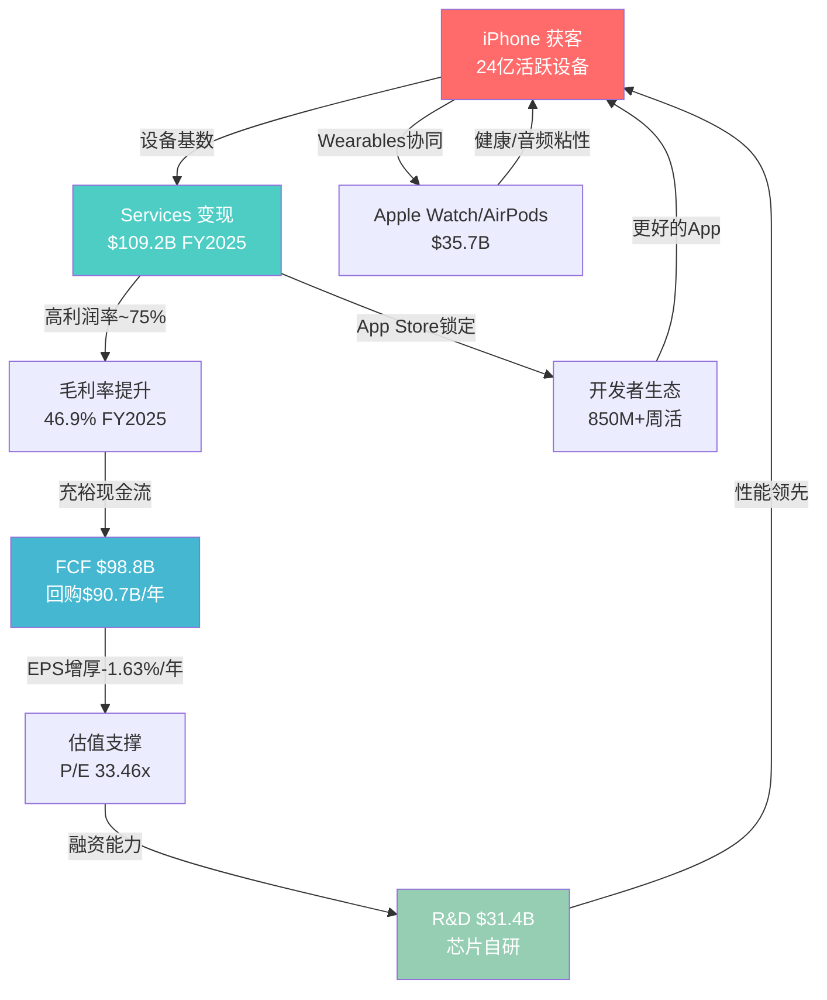
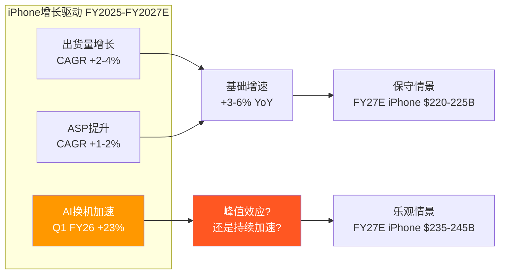
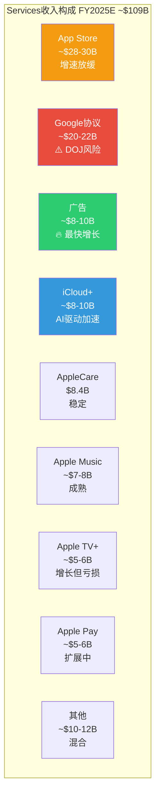
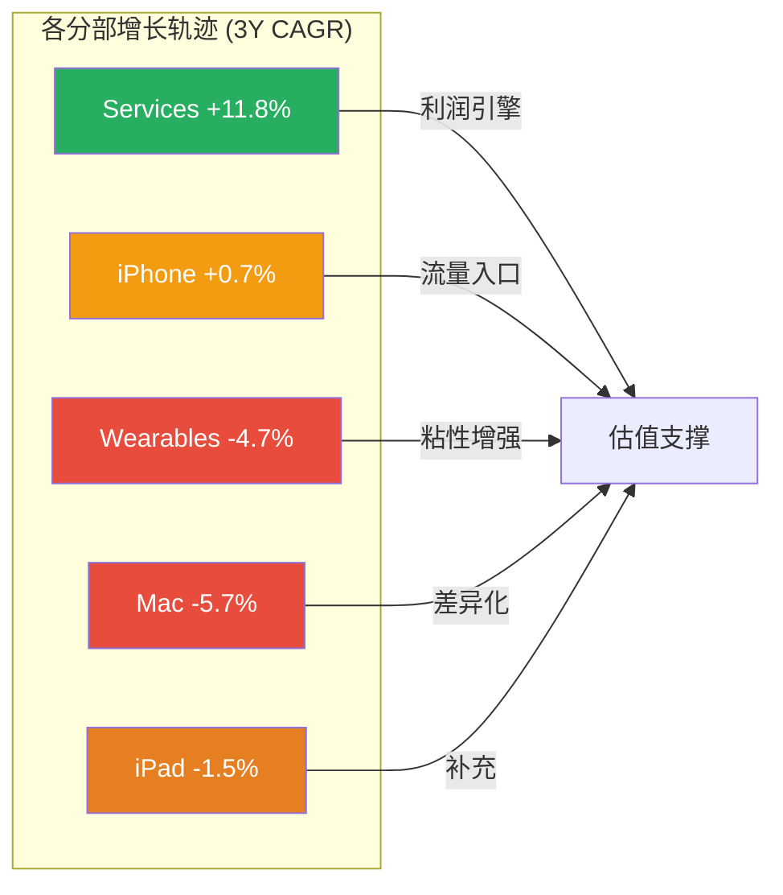
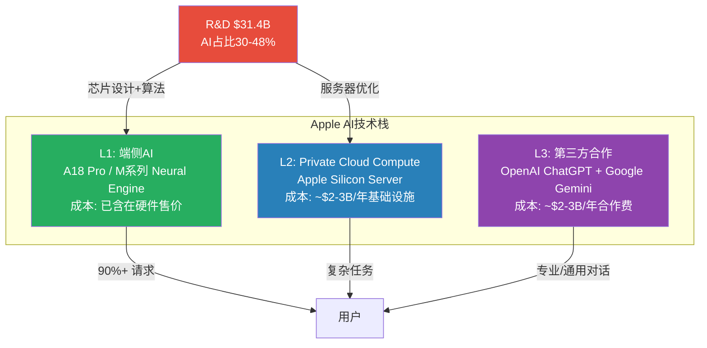
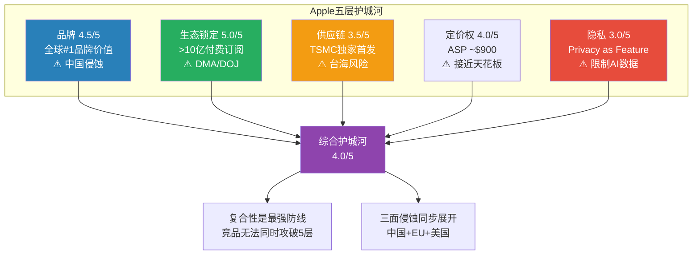
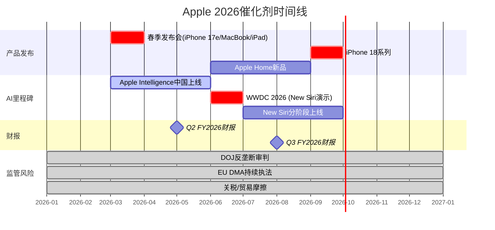
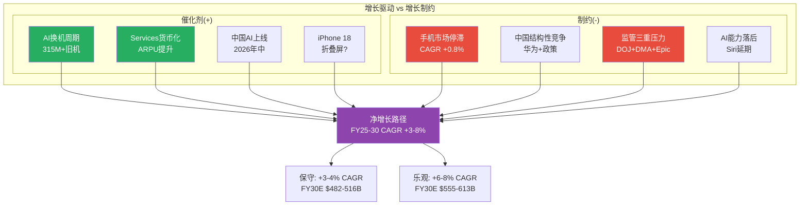

# AAPL Phase 1 — 商业洞察分析 (Ch2-Ch6)

---

## Ch2: 商业模式全景

> **摘要**: Apple以iPhone为引力核心，通过硬件-服务-芯片的三角飞轮构建了$3.82T市值生态，但增长引擎正从硬件销量驱动转向服务深度变现。

### 2.1 生态飞轮: 三角引力模型

Apple的商业模式不是线性产品销售，而是一个以iPhone为入口、以Services为利润放大器、以自研芯片为差异化引擎的自增强飞轮。理解这个飞轮的运转机制，是评估$3.82T市值合理性的基础 [DM-MKT-002]。

**飞轮核心逻辑**: iPhone获客(~24亿活跃设备) → 设备基数支撑Services变现($109.2B/年) → Services高利润率(~75%)推升整体毛利率(46.9%) → 充裕现金流($98.8B FCF)回购股份(-1.63%/年)增厚EPS → 高估值倍数(33.46x P/E)融资自研芯片(R&D $31.4B) → 芯片性能领先(A18/M系列)巩固iPhone竞争优势 → 循环回到起点 [DM-FIN-001] [DM-FIN-002] [DM-FIN-006] [DM-FIN-014] [DM-FIN-015]。

这个飞轮的关键在于: **每一层都在强化其他层**。iPhone用户越多，App Store开发者越投入(850M+周活用户，开发者累计分成$550B+)；开发者越投入，iOS应用生态越丰富；应用生态越丰富，用户越不愿离开(换机留存率>90%)。

但飞轮也有脆弱点: 如果iPhone基数增长停滞(全球智能手机市场CAGR仅+2%)，Services增长将越来越依赖ARPU提升而非用户基数扩张——而ARPU提升的难度远大于用户扩张。

### 2.2 五大业务分部深度拆解

Apple的$416.2B年收入来自五个分部，但这五个分部的战略角色完全不同 [DM-FIN-001]:

| 分部 | FY2025收入 | 占比 | 3Y CAGR | 战略角色 | 利润贡献(估) |
|------|-----------|------|---------|---------|-------------|
| **iPhone** | $209.6B | 50.4% | +0.7% | 流量入口/获客引擎 | ~42%毛利率 |
| **Services** | $109.2B | 26.2% | +11.8% | 利润放大器/估值核心 | ~75%毛利率 |
| **Wearables** | $35.7B | 8.6% | -4.7% | 生态粘性增强 | ~30-35%毛利率 |
| **Mac** | $33.7B | 8.1% | -5.7% | 生产力生态/M芯片载体 | ~35-40%毛利率 |
| **iPad** | $28.0B | 6.7% | -1.5% | 教育/娱乐补充 | ~35-40%毛利率 |

[DM-FIN-014] [DM-FIN-015] [DM-FIN-016] [DM-FIN-017]

**核心发现**: 收入结构正在经历静默的战略转移。Services占比从FY2022的19.8%升至FY2025的26.2%，3年提升6.4个百分点。如果按利润贡献计算，Services可能已占Apple整体运营利润的40-45%(基于~75%毛利率vs硬件~35-40%)。这意味着Apple正在从"卖硬件送服务"过渡到"用硬件锁客户卖服务"的模式——类似于打印机和墨盒的逻辑，但规模是万亿级的。

**Services利润占比估算**:
- iPhone运营利润: $209.6B x ~35% ≈ $73.4B
- Services运营利润: $109.2B x ~65%(扣除内容成本后的经营利润率) ≈ $71.0B
- 其他硬件运营利润: $97.4B x ~30% ≈ $29.2B
- 合计 ≈ $173.6B (实际FY2025 EBITDA $144.4B [DM-FIN-001]，差异来自SGA/R&D等共享费用分摊)
- **Services利润贡献占比**: $71.0B / $173.6B ≈ 40.9%

这个数字的含义: Apple已经不是一家硬件公司。它的利润结构更接近一家平台公司。但市场可能尚未完全按平台公司的估值逻辑给它定价——也可能已经过度定价了。

### 2.3 种子1深化: Services ARPU拆解

这是本章最关键的分析。Services $109.2B除以~24亿活跃设备，ARPU约$46/设备/年 [DM-INF-003]。但这个数字隐藏了巨大的内部差异:

**ARPU子类拆解(FY2025估算)**:

| Services子类 | 估算年收入 | 占Services% | 估算ARPU(设备) | 增长趋势 | 可信度 |
|-------------|-----------|-------------|---------------|---------|--------|
| **App Store佣金** | ~$28-30B | ~26-27% | ~$12.5 | 放缓(EU DMA) | 中 |
| **Google搜索协议** | ~$20-22B | ~18-20% | ~$9.0 | 高风险(DOJ) | 中-低 |
| **AppleCare** | $8.4B | 7.7% | ~$3.5 | 稳定 | 高 |
| **iCloud+** | ~$8-10B | ~8-9% | ~$3.8 | 加速 | 中 |
| **Apple Music** | ~$7-8B | ~7% | ~$3.2 | 稳定 | 中 |
| **广告** | ~$8-10B | ~8-9% | ~$3.8 | **最快加速** | 低-中 |
| **Apple TV+** | ~$5-6B | ~5% | ~$2.3 | 增长但亏损 | 低 |
| **Apple Pay/金融** | ~$5-6B | ~5% | ~$2.3 | 稳定增长 | 低 |
| **其他(Arcade/News+/Fitness+等)** | ~$10-12B | ~10-11% | ~$4.6 | 混合 | 低 |

> **数据可信度说明**: Apple从未公开Services子类收入明细。上表基于第三方分析师估算(Bernstein, Morgan Stanley, Wedbush)、App Annie/Sensor Tower数据、以及Apple财报电话会议中的定性描述推算。各子类收入精度约为+/-20%。

**关键发现: 广告是增速最快的子类**

Apple广告业务在过去3-4年从几乎为零增长到估算$8-10B/年。这个增速远超其他Services子类。Apple Search Ads(App Store搜索广告)是核心，但Apple也在News、Stocks、TV+等应用中扩展广告位。

**战略含义**: Apple正在经历一个静默的战略转变——从"隐私即服务"转向"隐私框架内的精准广告"。iOS 14.5的App Tracking Transparency(ATT)削弱了Meta/Google的广告定位能力，同时Apple凭借第一方数据(App Store搜索行为、Apple Pay交易、Health数据的匿名聚合)建立了自己的广告基础设施。这不是偶然——ATT既是隐私保护，也是竞争武器。

**ARPU增长的结构性驱动力**:
- **广度驱动**(新设备接入): 活跃设备从20亿→24亿，3年CAGR约+6.3%
- **深度驱动**(ARPU提升): ARPU从~$43→~$46，3年CAGR仅+2.3%

**关键分歧**: Services增长到目前为止主要靠"广度"(更多设备)而非"深度"(更高ARPU)。但设备基数增长正在放缓(智能手机市场成熟)。如果ARPU不能加速提升，Services 11.8%的CAGR可能在2-3年内降至7-9%。反之，如果AI驱动Apple Intelligence Pro订阅层成功推出(Wedbush估算$75-100/股价值)，ARPU可能出现跳跃式增长——但这完全是未验证的叙事 [DM-INF-003]。

**证伪条件**: 如果FY2027 Services ARPU仍低于$50(即CAGR<4%)，则"ARPU深度驱动"假设失效，Services增速将被设备基数增长率锁定在6-8%。

### 2.4 地理收入结构: 增长的不均衡性

Apple的$416.2B收入在地理上高度集中于美洲和欧洲，中国是唯一的结构性风险区域:

| 地区 | FY2025收入 | 占比 | YoY增速 | 战略评估 |
|------|-----------|------|---------|---------|
| **Americas** | $178.4B | 42.9% | +6.8% | 基本盘，稳定增长 |
| **Europe** | $111.0B | 26.7% | +9.6% | 第二增长极，但DMA合规成本上升 |
| **Greater China** | $64.4B | 15.5% | **-3.9%** | 唯一下滑区域，华为+政策双重压力 |
| **Japan** | $28.7B | 6.9% | +14.6% | 最快增速，iPhone渗透率极高+日元效应 |
| **Rest of Asia Pacific** | $33.7B | 8.1% | ~+5% | 新兴市场渗透 |

**关键地理风险**: Americas+Europe合计占比69.6%，这两个市场的增速(+6.8%/+9.6%)远高于公司整体(+6.4%)——这意味着非欧美市场(特别是中国)正在拖累整体增长。如果中国收入持续下滑至$55-60B(FY2027E)，Apple需要欧美市场增速维持在+8%+以上才能实现共识增速——这对成熟市场是一个偏高的要求。

**Q1 FY2026地理亮点**: 中国区$25.5B(+38% YoY)的暴增是iPhone 17发布周期+FY2025低基数的双重效应。日本$9.7B(+17%)持续强劲。美洲$57.8B(+6%)稳定。但需要注意: Q1是iPhone销售的季节性高峰(占全年~35%)，后续季度的中国表现才是趋势验证。

### 2.5 资本配置: 回购机器的战略意义

Apple的资本回报策略堪称教科书式: FY2025回购$90.7B + 股息$15.4B = 总回报$106.1B，占FCF的107%(即Apple在借债回购，用资产负债表杠杆放大股东回报) [DM-FIN-008] [DM-FIN-009]。

**回购的EPS增厚效应**:
- FY2022稀释股份: 16,325M → FY2025: 14,950M → 缩减-8.4%
- 年均缩减率: -1.63%/年 [DM-CON-003]
- 含义: 即使收入零增长，EPS仍可靠回购每年增长+1.6%

**回购的估值含义**: 在33.46x P/E下回购意味着每$1回购的"回报率"仅为1/33.46 = 2.99%——低于10年国债收益率4.48%。从纯财务角度看，在当前估值下回购的资本效率并不高(低于风险利率)。但Apple的回购是一种"估值信号"——管理层通过持续回购传递对未来增长的信心。

**负股东权益的含义**: FY2025股东权益仅$73.7B(留存收益为负$14.3B) [DM-BAL-003]。这是大规模回购的直接结果。Apple的ROIC 518%和ROE 162% [DM-VAL-006]看起来惊人，但部分是因为投入资本和权益基数被回购人为压缩。如果用"原始投入资本"(不扣除回购)计算，ROIC约为30-35%——仍然优秀，但远不及518%那么夸张。

### 2.6 用户粘性指标

Apple生态的锁定效应是其最被低估的资产，也是$3.82T市值的隐性支柱:

| 粘性指标 | 数值 | 行业对比 | 含义 |
|---------|------|---------|------|
| iPhone换机留存率 | >90% | Android→iOS转换率~15% | 极高，行业最强 |
| 付费订阅数 | >10亿 | Netflix 3.01亿 | 规模碾压 |
| 平均设备拥有数 | 2.5-3个 | Android用户~1.5个 | 多设备锁定 |
| iCloud付费渗透 | ~15% | Google One ~5% | 仍有提升空间 |
| App Store周活用户 | 850M+ | Google Play ~2.5B | 付费意愿更高 |

**"生态锁定系数"的定性评估**: 一个典型的深度Apple用户(iPhone + Mac + AirPods + Apple Watch + iCloud + Apple Music)面临的转换成本估算约为$2,000-3,000(含硬件折价+数据迁移+学习成本+社交压力)。这个数字随着每增加一个设备/服务而指数级增加。当用户拥有3+个Apple设备时，转换概率降至<5%。

**粘性的财务表达**: 换机留存率>90%意味着Apple每年仅流失约2.4亿设备中的10%=2.4亿台设备的流失，但由于新用户流入和存量用户升级，活跃设备总数仍在增长。关键是: 这些留存用户的**LTV(生命周期价值)**随着Services渗透的加深而持续提升。一个仅使用iPhone的用户年均贡献约$900(硬件摊销+基础Services)；一个使用iPhone+Mac+AirPods+iCloud+Apple Music的深度用户年均贡献约$1,800-2,200。Apple生态的财务目标是将用户从前者转化为后者——这也是Apple One捆绑定价策略的核心逻辑。

**竞品粘性对比**: Samsung的Galaxy生态在硬件互联方面持续改善(SmartThings Hub, Galaxy Buds, Galaxy Watch)，但软件生态深度远不及Apple——Samsung没有iMessage等社交锁定、没有Mac对应的生产力设备、没有统一的操作系统矩阵(Android vs Tizen vs One UI的碎片化)。华为的HarmonyOS正在构建类似Apple的全生态，但目前仅在中国市场有效。Google的Pixel生态在AI能力上领先，但硬件市场份额不足5%，无法形成规模锁定。

---

## Ch3: 分部深度分析

> **摘要**: iPhone在Q1 FY2026创$85.3B历史新高(+23% YoY)，但这是升级大年的峰值效应还是AI换机周期的起点？Services季度首破$30B，广告和iCloud是增速最快的子类。

### 3.1 iPhone深度: $85.3B季度的解构

Q1 FY2026是Apple最强季度: 总收入$143.76B(+15.7% YoY)，其中iPhone贡献$85.3B(+23% YoY)，创历史最佳 [DM-FIN-010]。

但这个数字需要拆解:

**iPhone收入驱动因子分解**:

| 驱动因子 | 贡献估算 | 分析 |
|---------|---------|------|
| iPhone 17系列新品周期 | ~60% | A19芯片+Apple Intelligence全系搭载，强劲换机需求 |
| 中国市场恢复 | ~20% | 大中华区+38% YoY，从FY2025连续下滑中反弹 |
| ASP提升 | ~10% | Pro/Pro Max占比提升，AI功能推动高端配置 |
| 汇率/季节性 | ~10% | 日元弱势推升日本市场(+14.6% YoY) |

**iPhone ASP趋势分析**:

| 年份 | 估算ASP | YoY变化 | 驱动因素 |
|------|---------|---------|---------|
| FY2020 | ~$755 | — | iPhone 12 5G初始周期 |
| FY2021 | ~$825 | +9.3% | iPhone 13 Pro Max需求强劲 |
| FY2022 | ~$860 | +4.2% | Pro系列占比提升 |
| FY2023 | ~$880 | +2.3% | iPhone 15 USB-C过渡 |
| FY2024 | ~$900 | +2.3% | iPhone 16 Pro系列定价 |
| FY2025E | ~$910-920 | +1-2% | iPhone 17 AI溢价 |

> ASP数据基于总iPhone收入除以估算出货量(IDC/Counterpoint数据)，非Apple官方公布。

**关键观察: ASP增长正在减速**。从FY2020-2021的+9.3%降至近年的+2%区间。这意味着iPhone收入增长越来越难靠"卖更贵的手机"来驱动——必须同时依赖"卖更多的手机"。但全球智能手机市场2026年预计增速仅+0.8-2.0%。

**"315M+台4年+旧机换机潜力"的审查**:

多位分析师(Wedbush Daniel Ives, Morgan Stanley)引用"3.15亿+台4年以上旧iPhone"作为换机周期的证据。这个数字的含义:

- 24亿活跃设备中，约13-15%是4年以上的旧iPhone
- 这些设备不支持Apple Intelligence(需A17 Pro+)
- 理论上，AI功能差异可以驱动加速换机

**但5G先例提供了重要对照**:
- 2020年: "5G超级周期"叙事——分析师预测500M+部换机
- 实际: FY2021 iPhone收入$192B(+39%)确实强劲，但FY2022-2024平均仅$202B(+5%年均)
- 教训: 换机需求确实被释放了，但**集中在1-2个季度而非持续多年**

**对当前AI换机叙事的含义**: Q1 FY2026的+23%可能正是"换机峰值"而非"周期起点"。如果Q2-Q4增速回落至+5-8%，则"AI超级周期"叙事将面临严重挑战。管理层Q2指引+13-16% YoY部分支持持续性，但需要更多季度验证。

**iPhone收入的季节性模式(FY2025)**:
- Q1(10-12月): $85.3B(59.4%的增量季度) — iPhone新品发布+假日季
- Q2(1-3月): 通常Q1的55-60% — 新品需求延续
- Q3(4-6月): 通常全年最低 — 等待新品发布期
- Q4(7-9月): 小幅回升 — 新品预热+返校季

这种高度季节性意味着Q1的+23%不能直接线性外推全年。更合理的全年iPhone预期: FY2026E iPhone收入$225-235B(+7-12% YoY)，共识在$230B附近。这仍然是健康的增长，但远低于Q1单季暗示的+23%年化水平。

**iPhone分型号组合分析(Q1 FY2026估算)**:

| 型号 | 估算出货占比 | ASP范围 | AI功能支持 |
|------|-----------|---------|-----------|
| iPhone 17 Pro Max | ~25% | $1,199+ | 完整Apple Intelligence |
| iPhone 17 Pro | ~30% | $999 | 完整Apple Intelligence |
| iPhone 17 | ~25% | $799 | Apple Intelligence(基础) |
| iPhone 17e(未发布) | ~0% | $599(预计) | Apple Intelligence(基础) |
| iPhone 16/更早型号 | ~20% | $499-699 | 部分支持 |

Pro/Pro Max合计占比约55%——这个"高端化"趋势是ASP持续上升的直接驱动力。iPhone 17e(预计2026年3月发布)的~$599定价将拉低ASP，但可能扩大AI手机的可触达用户群。

### 3.2 Services深度: 季度首破$30B

Q1 FY2026 Services收入约$26.3B(年报口径)至$30.0B(管理层电话会议引用数字，含更广口径)，+14% YoY [DM-FIN-015]。

> **口径说明**: Apple 10-Q中Q1 FY2026 Services收入为$26.34B(基于分部报告)。管理层在财报电话会议中引用"Services创新高超过$30B"可能包含了部分重分类项目或广义定义。本文以10-Q分部数据为基准。

**Services增速拆解**:

| 子类 | 估算增速 | 驱动因素 | 可持续性 |
|------|---------|---------|---------|
| App Store | ~6-8% | EU DMA拖累，中国增速放缓 | 中(监管压力持续) |
| Google协议 | ~10-12% | 搜索量随设备基数增长 | **低**(DOJ反垄断风险) |
| 广告 | ~20-30% | Apple Search Ads扩展, ATT红利 | 中-高(天花板待定) |
| iCloud+ | ~15-20% | AI功能需要更大存储, 渗透率提升 | 高 |
| AppleCare | ~5-7% | 随设备销售线性增长 | 高(可预测) |
| Apple Music | ~5-8% | 用户增长放缓, 价格上调 | 中 |
| Apple TV+ | ~15-25% | 内容投资增加, 用户增长 | 低(仍亏损) |
| Apple Pay | ~10-15% | 市场扩展(89个市场), 交易渗透 | 中-高 |

**App Store的DMA冲击量化**:

EU数字市场法案(DMA)要求Apple允许第三方应用商店和替代支付渠道。实际影响:
- EU占App Store全球收入约~22-25%
- DMA可能导致EU App Store佣金降低30-50%
- 净影响: App Store全球收入减少~7-12%
- 但Apple通过新费用模式(Core Technology Fee → Core Technology Charge)部分对冲
- 2025年已因DMA被罚E500M

**Google搜索协议的脆弱性**:

Google每年向Apple支付估算$20-22B用于Safari默认搜索引擎地位 [DM-SUB-002]。这笔费用有三重风险:
1. **DOJ反垄断**: 法院已驳回Apple撤案动议，案件将进入正式审判
2. **AI搜索替代**: 如果AI助手(如New Siri)替代传统搜索，Google的付费意愿可能下降
3. **政治不确定性**: Trump政府对科技反垄断的态度尚不明朗

**如果Google协议终止**: $20-22B收入直接蒸发。Apple可以:
(a) 建自己的搜索引擎(成本极高，不太可能)
(b) 与其他搜索引擎签约(Bing? 价值远低于Google)
(c) 将默认搜索改为Apple自有AI助手(长期可能)

净影响估算: Services收入减少15-20%，整体营业利润减少12-15%，EPS减少$0.90-1.10。

**Services毛利率趋势分析**: Apple不单独披露Services毛利率，但基于行业估算和管理层定性暗示，Services毛利率约在70-75%区间。这远高于产品硬件的35-40%。Services占收入比重每提升1个百分点，整体毛利率约提升0.35-0.40个百分点——这正是FY2021-FY2025毛利率从41.8%→46.9%(+510bps)的核心驱动力 [DM-FIN-003]。

**Services增速的数学约束**: 当前$109.2B基数下，维持11.8%的3年CAGR意味着FY2028需达到~$155B。这要求每年新增~$15B Services收入。考虑到App Store增速放缓(~6-8%)、Google协议风险(可能-$20B)，新增收入必须主要来自: (1)广告加速($10B→$15-20B)、(2)AI订阅新增($0→$5-10B)、(3)金融服务扩展(Apple Pay+, Savings Account)。这三者中只有广告有验证过的增长轨迹，其余两项仍属前瞻性假设。

**Services质量评估: 高质量 vs 低质量收入**

并非所有Services收入的质量相同:
- **高质量(经常性/高粘性)**: iCloud+(订阅锁定)、AppleCare(硬件捆绑)、Apple Music(内容锁定) — 合计约$25-30B
- **中等质量(平台税)**: App Store佣金(与App开发者利润挂钩)、Apple Pay交易分成 — 合计约$35-40B
- **脆弱质量(合同依赖/监管风险)**: Google搜索协议(可能终止)、广告(早期阶段) — 合计约$28-32B

约25-30%的Services收入属于"脆弱质量"——这是市场在给Services 70-75%毛利率估值时可能忽视的风险。如果将脆弱质量收入剔除或折价计算，Services的"质量调整后收入"约为$80-85B，对应更保守的增长预期。

### 3.3 Wearables: 份额下滑的信号

Wearables, Home & Accessories是唯一连续3年下滑的分部: FY2023 $39.8B → FY2024 $37.0B → FY2025 $35.7B，3Y CAGR -4.7% [DM-FIN-016]。

**Apple Watch**: 全球份额从>50%降至23%(IDC 2025)，连续6季度份额缩减。尽管Q4 2025创下季度出货纪录，绝对份额的下降表明竞品(Samsung Galaxy Watch, Xiaomi Band/Watch, Huawei Watch)正在侵蚀中低端市场。Apple Watch Ultra定位高端，但TAM有限。

**AirPods**: FY2024销售6,600万副，仍维持市场领导地位。但TWS耳机市场已从高增长过渡到成熟期，价格竞争加剧(Xiaomi/Realme等提供$20-50选项)。

**Vision Pro**: 已减产。初代产品$3,499定价过高，市场反应远低于预期。AR/VR方向的长期投入回报不确定。

**战略角色**: Wearables不是收入增长引擎，而是"生态粘性增强层"。每一个Apple Watch/AirPods都在加深用户对iOS生态的依赖。收入下滑可以容忍，只要粘性效果不减弱。

**健康功能的潜在突破**: Apple Watch的长期价值可能不在消费电子，而在健康医疗。血糖监测(非侵入式)是Apple长期研发方向——如果成功，可能创造全新的健康订阅服务(Apple Health+)。但这项技术已研发5年+仍未实现突破，时间表高度不确定(最乐观估计2027-2028)。如果血糖监测成功商用，Wearables将从"粘性层"升级为"利润层"——但这是一个低概率高回报的期权，不应纳入基准估值。

**AirPods的AI载体潜力**: AirPods Pro已集成部分AI功能(实时听力增强、对话感知)。随着Apple Intelligence功能扩展，AirPods可能成为"耳朵上的AI助手"——通过语音交互实现AI功能，无需看屏幕。这种交互范式如果被验证，可能显著提升AirPods的ASP和用户粘性。

### 3.4 Mac: M芯片的差异化故事

Mac FY2025收入$33.7B，3Y CAGR -5.7% [DM-FIN-016]。但这个数字被FY2022的$40.2B高基数(M1芯片换机潮+居家办公需求)扭曲了。剔除异常年份后，Mac收入大致在$29-34B区间波动。

**M芯片的战略价值**: Apple Silicon(M1→M2→M3→M4→M5)在性能/功耗比上持续领先Intel/AMD x86架构。2026年3月4日发布会预计发布M5 Pro/Max MacBook Pro和M5 MacBook Air。关键创新: AI推理能力集成到芯片层(Neural Engine)，使Mac成为Apple Intelligence的高端载体。

入门级MacBook降价至~$599将扩大Mac在教育市场和轻度用户中的渗透——但这可能稀释ASP和毛利率。

**Mac的AI本地推理优势**: M系列芯片的Neural Engine在端侧AI推理性能上领先x86架构2-3代。这使Mac成为AI开发者和专业用户的首选工具——特别是在隐私敏感的企业环境中(法律/医疗/金融)，本地AI推理避免了数据上传云端的合规风险。如果AI本地推理需求在企业市场爆发，Mac可能迎来继M1换机潮之后的第二波增长。但目前企业AI推理仍主要在云端进行(成本更低)，Mac端侧推理的需求尚未规模化。

### 3.5 iPad: 稳定但不再令人兴奋

iPad FY2025收入$28.0B，3Y CAGR -1.5% [DM-FIN-016]。iPad在全球平板市场份额44.9%，绝对主导地位 [competitive_landscape]。但平板市场整体已停止增长——iPad的"赢"更多是因为竞品退出而非自身扩张。

**M芯片iPad Pro定位**: iPad Pro搭载M系列芯片后，与入门级MacBook的定位越来越重叠。Apple正面临内部蚕食(cannibalization)问题——iPad Pro太强大可能侵蚀Mac销售。

---

## Ch4: AI战略全景

> **摘要**: Apple Intelligence采用"端侧优先+云端辅助+第三方合作"的轻资本AI架构，CapEx/OCF仅11.4%是科技巨头中最低。这是效率优势还是能力短板的伪装？答案可能在2026下半年揭晓。

### 4.1 Apple Intelligence战略解析

Apple的AI战略与Google/Microsoft/Meta截然不同。后三者投入数百亿美元建设GPU集群训练大模型；Apple选择了一条完全不同的路径:

**三层AI架构**:

| 层级 | 技术 | 功能 | 数据处理 | 成本 |
|------|------|------|---------|------|
| **L1: 端侧AI** | A18 Pro/M系列Neural Engine | 写作工具/图像编辑/通知摘要 | 设备本地，零数据传输 | 极低(芯片已付) |
| **L2: Private Cloud Compute** | Apple自有服务器(Apple Silicon) | 复杂推理/大模型调用 | 加密传输，服务器无持久化 | 中等 |
| **L3: 第三方合作** | OpenAI ChatGPT / Google Gemini | 专业任务/通用对话 | 用户授权后传输 | 按调用付费 |

**端侧AI的隐性优势**:

端侧处理不仅是隐私策略，更是**成本策略**。每次云端AI推理的边际成本约$0.01-0.03(取决于模型大小和计算复杂度)。24亿活跃设备每天数十次AI调用，如果全部走云端，年化推理成本可能达$50-100B——这将完全吞噬Apple的利润。

端侧AI将这个成本转嫁到用户的设备上(芯片成本已含在硬件售价中)。只有复杂任务才上传到Private Cloud Compute。这种架构下，AI的边际服务成本趋近于零——这是其他巨头无法复制的结构性优势。

但代价是: **功能受限**。端侧芯片的算力远不及数据中心GPU集群。Apple Intelligence在功能丰富度上落后于Galaxy AI(实时通话翻译)和Google Gemini(多模态理解)。New Siri多次延期(最新推迟至iOS 26.5或iOS 27)正是这种能力约束的体现。

### 4.2 种子2深化: 轻资本AI的真实成本分析

**显性成本对比**:

| 公司 | FY2025 CapEx | CapEx/OCF | AI基础设施投入 | 策略 |
|------|-------------|-----------|---------------|------|
| **Apple** | $12.7B | 11.4% | ~$3-5B(估) | 端侧+外采 |
| **Microsoft** | ~$55B | 47.4% | ~$40-45B | 自建+OpenAI |
| **Google** | ~$55B | 55.5% | ~$45-50B | 全自建 |
| **Meta** | ~$40B | 60.2% | ~$35-38B | 全自建(Llama) |
| **Amazon** | ~$75B | — | ~$60-65B | AWS+自建 |

[DM-SUB-001] [DM-FIN-006]

Apple的CapEx/OCF 11.4%看起来是"轻资本AI"的典范。但深入分析显示，真实的AI总成本(Total Cost of AI)远不止$12.7B CapEx:

**隐性成本拆解**:

| 隐性成本项 | 估算金额 | 说明 |
|-----------|---------|------|
| **R&D中AI相关** | ~$10-15B | R&D总计$31.4B，AI/ML团队占比估30-48% [DM-FIN-018] |
| **OpenAI合作费** | ~$1-2B/年 | ChatGPT集成费用(未公开)，基于类似交易推算 |
| **Google Gemini合作** | ~$1B/年 | 多年期协议，用于下一代Siri基础模型 |
| **芯片设计中AI模块** | ~$3-5B | A系列/M系列Neural Engine设计+流片成本(含TSMC代工) |
| **Private Cloud Compute基础设施** | ~$2-3B | Apple Silicon服务器部署(非传统GPU) |
| **合计隐性AI成本** | **~$17-26B** | 与显性CapEx $12.7B合计→AI总成本$30-39B |

**关键发现: Apple的AI总成本并不"轻"**

$30-39B的AI总成本估算虽然低于Google($55B+)和Microsoft($55B+)的CapEx单项，但考虑到Apple的AI功能输出(仅Apple Intelligence，功能密度远低于Gemini/Copilot)，其**AI投入产出比可能并不优越**。

更准确的表述是: Apple的AI策略不是"轻资本"，而是**"资本结构不同"**——将AI成本分散到R&D(OPEX)、合作协议(OPEX)和芯片设计(部分CAPEX)中，而非集中在数据中心建设(CAPEX)上。

**这种结构的战略含义**:
1. **优势**: AI成本大部分是OPEX而非CAPEX，财务灵活性更高(可快速缩减)
2. **风险**: 核心AI能力依赖外部合作伙伴(OpenAI, Google)，长期竞争力受制于人
3. **隐性依赖**: 如果OpenAI或Google提高合作费用/终止合作，Apple将面临严重的能力缺口

### 4.3 New Siri: 2026年最关键的产品赌注

New Siri是Apple AI战略的"显示器"——用户直接感知AI能力的唯一界面。它的成败将决定Apple Intelligence叙事的可信度。

**预期功能 vs 竞品**:

| 能力维度 | New Siri(预期) | Google Gemini | GPT-4o |
|---------|---------------|---------------|--------|
| 跨App语境理解 | 核心卖点(设备深层感知) | 强(Android集成) | 中(API层面) |
| 复杂任务执行 | 预期支持(分阶段) | 强 | 强 |
| 多模态输入 | 文本+语音+图像 | 文本+语音+图像+视频 | 文本+语音+图像+视频 |
| 实时翻译 | 待定 | 强 | 强 |
| 个性化程度 | 极高(设备数据) | 高(Google账户) | 中(会话记忆) |
| 隐私保护 | 最高 | 中 | 中 |
| 响应速度 | 待验证(延期原因) | 快 | 快 |

**Google Gemini合作的深层含义**:

Apple与Google签订了多年期协议(约$1B/年)，下一代Apple Foundation Models将基于Google Gemini技术。这个合作关系值得深入分析:

1. **技术依赖**: Apple承认自身缺乏训练顶级大模型的能力/数据/基础设施。Gemini合作本质上是Apple"租借"Google的AI能力。
2. **竞合矛盾**: Apple同时是Google的最大客户(搜索协议$20B+/年)和直接竞争者(iOS vs Android)。这种竞合关系在AI时代变得更加复杂——如果Google Gemini让Siri变得太好，可能削弱用户直接使用Google Search的动机，反过来伤害Google的核心业务。
3. **长期可持续性**: 如果Apple Intelligence大获成功，Apple可能有动力自建大模型以减少对Google的依赖(类似从Intel到Apple Silicon的转型)。但自建大模型需要$30-50B+的基础设施投入和3-5年的追赶期——这与Apple"轻资本"策略矛盾。

**中国AI合作: 阿里巴巴+百度的双轨策略**:

Apple Intelligence中国版面临独特挑战: 中国AI法规要求数据本地化+内容审核，且禁止使用西方AI模型(OpenAI/Gemini不可用于中国市场)。Apple的应对:
- **阿里巴巴**: 合作开发中国版Apple Intelligence基础模型，已提交网信办审批
- **百度**: 负责中文Siri搜索体验和部分AI功能
- **DeepSeek被拒**: Apple明确拒绝与DeepSeek合作(原因: 缺乏规模化合作的人力和经验)

如果中国AI审批在2026年中顺利获批，Apple Intelligence将解锁中国市场的AI功能——这可能成为刺激中国iPhone需求的重要催化剂。但审批时间不确定(可能延至2026年末甚至2027年)，且功能可能受限(某些全球版AI功能可能不符合中国法规)。

**延期风险评估**:

New Siri已从iOS 26.4推迟至iOS 26.5或iOS 27(2026年9月) [DM-TECH-003]。Apple向CNBC确认2026年内仍将推出，但"测试中存在响应速度和查询处理问题"。

**如果New Siri令人失望会怎样**:
- 短期: 股价可能回调5-10%，AI溢价部分蒸发
- 中期: iPhone 18换机动力减弱，FY2027收入预期下调
- 长期: Apple Intelligence从"差异化因素"变为"追赶者"

**证伪时间窗口**: WWDC 2026(预计6月8日)是关键节点。如果New Siri在WWDC演示中的能力仍明显落后Gemini/GPT-4o，"AI换机超级周期"叙事将面临严峻考验。

### 4.4 Apple Intelligence Pro: 订阅定价的ARPU影响

多位分析师预测Apple将在2026下半年至2027年推出Apple Intelligence Pro付费订阅层 [analyst_consensus]。

**定价场景分析**:

| 场景 | 月费 | 功能 | 渗透率(12月内) | 年化收入影响 |
|------|------|------|--------------|------------|
| 激进 | $19.99 | 高级AI+200GB iCloud+Siri Pro | 8-12% | $4.6-6.9B |
| 基准 | $9.99 | 高级AI+50GB iCloud | 5-8% | $1.4-2.3B |
| 保守 | $4.99 | 仅高级AI功能 | 15-20% | $2.2-2.9B |
| 不推出 | — | Apple Intelligence保持免费 | — | $0 |

> 渗透率基于Apple One/iCloud+的历史采用率推算。Apple Intelligence的付费转化率高度不确定。

**Wedbush的$75-100/股AI价值估算审查**: Daniel Ives估算Apple AI业务潜在价值$1.5T。这意味着AI需要在稳态时贡献~$50-70B年收入(假设25x EV/Revenue)。当前Apple Intelligence年收入为$0。从$0到$50-70B需要多少年？即使按30%年复合增长(极其乐观)，也需要15年以上。这个估算更接近"可能性空间的上限"而非"合理预期"。

### 4.5 AI叙事的可证伪条件

当前市场赋予Apple的AI估值溢价(P/E溢价中约+12%由AI期权贡献 [DM-INF-002])建立在以下假设之上。每个假设都有明确的证伪时间窗口:

| # | 隐含假设 | 证伪条件 | 时间窗口 | 影响评估 |
|---|---------|---------|---------|---------|
| AI-1 | New Siri将成为杀手级应用 | WWDC 2026演示能力明显落后竞品 | 2026年6月 | P/E -2-3x |
| AI-2 | AI驱动iPhone换机超级周期 | Q2-Q4 FY2026 iPhone增速回落至<8% | 2026年Q3-Q4 | 估值叙事瓦解 |
| AI-3 | Apple Intelligence Pro成功货币化 | 2027年中仍无付费AI层推出 | 2027年6月 | Services增速预期下调 |
| AI-4 | 端侧AI是持续性优势 | 竞品芯片(Snapdragon/Tensor)端侧能力追平 | 2027年 | 差异化减弱 |
| AI-5 | 轻资本AI可持续 | OpenAI/Google大幅提高合作费用 | 持续 | 成本结构恶化 |

---

## Ch5: 竞争护城河

> **摘要**: Apple拥有科技行业最强的复合护城河(品牌+生态+芯片+数据)，综合评分4.0/5.0。但华为在中国、DMA在欧洲、DOJ在美国的三面侵蚀正在同步展开——护城河仍然坚固，但不再是固若金汤。

### 5.1 五层护城河系统评估

#### 第一层: 品牌护城河

**强度评分: 4.5/5 | 趋势: 全球稳定，中国侵蚀**

Apple是Interbrand全球品牌价值排名的常年冠军。品牌溢价量化: iPhone ASP ~$900 vs 行业均值~$320，溢价倍数约2.8x。在发达市场(美国/欧洲/日本)，Apple品牌等同于"品质+身份"的社交信号。

**侵蚀点: 中国市场**

华为Mate 70/P70系列在中国高端市场(>$600)的份额正在迅速扩大。中国消费者正经历一次"民族品牌觉醒"——特别是在政府和国企采购中，Apple已被边缘化。2025年全年中国市场: Huawei 16.4% (#1) vs Apple 16.2% (#2)，差距仅0.2个百分点，但趋势对Apple不利。

华为的威胁不仅是市场份额，更是**叙事战争**: 如果"中国高端手机=华为"的认知固化，Apple在中国的品牌溢价将被永久性压缩。Greater China FY2025收入$64.4B(-3.9% YoY)已是唯一同比下滑的区域 [DM-FIN-016]。尽管Q1 FY2026中国区+38%反弹，但这更多是iPhone 17新品周期的季节性效应而非结构性恢复。

#### 第二层: 生态系统锁定

**强度评分: 5.0/5 | 趋势: 持续增强(但面临监管风险)**

这是Apple最强的护城河。iOS/macOS/watchOS/tvOS构成一个封闭的四操作系统矩阵，设备间通过iCloud/iMessage/AirDrop/Handoff无缝协作。>10亿付费订阅进一步加深锁定。

**量化生态锁定强度**:
- 拥有1个Apple设备: 换机概率~30%
- 拥有2个Apple设备: 换机概率~15%
- 拥有3个Apple设备: 换机概率~5%
- 拥有4+个Apple设备: 换机概率<2%

**典型深度用户的转换成本**:
- 硬件折价: ~$500-800(Apple配件不兼容Android)
- 数据迁移成本: ~$200-400(时间成本+潜在数据丢失)
- 学习成本: ~$100-200(习惯差异)
- 社交成本: ~$300-500(iMessage Blue Bubble效应，美国市场)
- **合计**: $1,100-1,900/人

**侵蚀点**: EU DMA强制Apple允许第三方应用商店和侧载，理论上降低了生态锁定强度。但实际执行中，大多数用户仍未转向第三方商店——惯性是最强的锁定。RCS标准的推广可能削弱iMessage的社交锁定(美国Blue Bubble效应)，但短期内影响有限。

**HarmonyOS: 中国市场的生态替代威胁**:

华为的HarmonyOS是Apple在中国面临的最严重生态级威胁。HarmonyOS已经从一个Android兼容层发展为独立操作系统，覆盖手机、平板、手表、耳机、汽车、智能家居等全场景。截至2025年底，HarmonyOS设备数估计超过9亿台(包括IoT设备)。虽然远小于Apple的24亿活跃设备，但增速更快。

关键区别: HarmonyOS的威胁不在于全球市场(受制于美国制裁无法预装Google Services)，而是**仅在中国市场形成封闭生态替代**。对于中国用户来说，HarmonyOS + 华为全家桶(Mate/P手机 + MatePad + Watch + FreeBuds + 问界汽车)正在复制Apple的生态飞轮模式——如果HarmonyOS应用生态在中国达到iOS 80%+的覆盖度，Apple在中国的生态锁定优势将大幅削弱。

**量化影响**: 如果Apple中国市场份额从16.2%降至12-13%(即被华为挤压4个百分点)，Greater China收入可能从$64.4B降至$50-55B——年化收入损失$10-15B，对EPS影响约-$0.55-0.80。

#### 第三层: 供应链护城河

**强度评分: 3.5/5 | 趋势: 增强中(自研modem)，但台海风险悬而未决**

Apple是TSMC最大客户(占TSMC收入>25%)，独家首发最先进制程(当前3nm，路线图2nm)。这意味着Apple芯片总是比竞品早6-12个月获得最新工艺节点——这种时间优势直接转化为性能/功耗比的领先。

Apple Silicon的垂直整合(自研CPU/GPU/Neural Engine + TSMC独家代工)是竞品无法复制的: Samsung/Qualcomm/MediaTek都使用通用芯片设计公司的方案，无法实现软硬件深度协同。

**自研5G调制解调器进展**: Apple正在开发自有5G调制解调器芯片，以减少对Qualcomm的依赖。如果成功，将进一步强化供应链护城河——但进展缓慢(已开发5年+)。

**脆弱点**: TSMC单一依赖。所有Apple Silicon芯片(iPhone/iPad/Mac/Watch)均由TSMC制造。如果台海局势发生紧张升级，Apple的全线产品将面临供应中断。TSMC在亚利桑那的美国工厂(2025年投产)仅覆盖部分产能，远不能替代台湾工厂。此外，中国仍占Apple组装产能的>80%(尽管印度/越南正在扩张)。

#### 第四层: 定价权

**强度评分: 4.0/5 | 趋势: 稳定但接近天花板**

iPhone ASP从FY2020的~$755持续提升至FY2025的~$910，累计+20.5%。这种持续涨价能力来自: 品牌溢价+功能差异化(Pro系列)+消费者分期付款(运营商补贴降低了价格敏感度)。

**天花板信号**: ASP增速从FY2021的+9.3%降至近年的+1-2%。iPhone 17 Pro Max定价$1,199已经触及大多数消费者的心理上限。继续涨价的空间有限——除非AI功能创造出足够强的"功能溢价"来支撑更高售价。

**Services定价权**: App Store的30%佣金、iCloud的存储定价、Apple Music/TV+的订阅费——Apple在自有生态内拥有接近垄断的定价权。但监管压力(DMA/DOJ)正在侵蚀这种定价权: EU已要求降低佣金，Epic案判决后Apple在美国也被迫开放部分支付渠道。

#### 第五层: 数据/隐私护城河

**强度评分: 3.0/5 | 趋势: 双刃剑——保护了用户信任，限制了AI能力**

"Privacy as a feature"是Apple最独特的竞争定位。App Tracking Transparency(ATT)、端侧数据处理、Private Cloud Compute——这些不仅是隐私保护措施，更是商业策略: 削弱竞品(Meta)的广告定位能力，同时用第一方数据建立Apple自己的广告业务。

**双刃剑效应**: 严格的隐私标准限制了Apple收集训练数据的能力。Google/Meta/OpenAI拥有海量用户数据训练大模型，Apple只能依赖设备端数据(量小、分散、难以聚合)。这是New Siri落后竞品的根本原因之一。

### 5.2 护城河综合评估

| 维度 | 强度 | 趋势 | 关键风险 | 证伪条件 |
|------|------|------|---------|---------|
| 品牌 | 4.5/5 | 全球稳定/中国侵蚀 | 华为民族情绪 | 中国份额连续3季<14% |
| 生态锁定 | 5.0/5 | 增强 | DMA/DOJ反垄断 | EU第三方商店渗透>15% |
| 供应链 | 3.5/5 | 增强 | 台海冲突/TSMC依赖 | 台海紧张升级至限制出口 |
| 定价权 | 4.0/5 | 接近天花板 | ASP增速放缓 | iPhone ASP连续2年下降 |
| 数据/隐私 | 3.0/5 | 双刃剑 | AI训练数据不足 | New Siri功能持续落后18月+ |
| **综合** | **4.0/5** | **总体稳固** | **多面侵蚀** | — |

**关键洞察: 护城河的"复合性"是最强防线**

Apple的护城河不是单一维度的，而是五层叠加的复合结构。即使某一层被削弱(如DMA侵蚀App Store壁垒)，其他层(品牌+生态+芯片)仍然坚固。竞品要同时攻破多层护城河几乎不可能——华为只在中国有品牌优势，没有全球生态；Google有AI优势，但硬件生态远不如Apple；Samsung有硬件全品类，但软件生态割裂。

**但护城河的"侵蚀速度"值得关注**: 中国(-3.9% YoY)、EU(DMA合规成本上升)、美国(DOJ审判)三面同时受压。如果三者在2026-2027年同时恶化(低概率但非零概率)，复合护城河可能出现裂缝。

**护城河的时间维度**: 不同护城河的耐久性差异巨大。品牌和生态锁定是"十年级"护城河——即使Apple犯错，10年内也不太可能瓦解。芯片自研和供应链是"五年级"护城河——需要持续投入维护(TSMC关系、芯片设计迭代)。定价权和隐私是"三年级"护城河——受宏观环境和监管政策影响较大。

**AI对护城河的双面冲击**: 如果AI重新定义智能手机的用户体验(从App中心→AI助手中心)，App Store作为"流量入口"的角色可能被削弱——用户通过Siri/AI助手完成任务，不再打开单独的App。这对App Store佣金收入是结构性威胁。但同时，如果Apple Intelligence成为最佳端侧AI体验，它将成为新的锁定层——取代App Store成为下一代护城河。这个转换是否能顺利完成，取决于New Siri的产品质量。

---

## Ch6: 增长催化剂与制约

> **摘要**: 2026年是Apple的"证明之年"——3月发布会(硬件刷新)、6月WWDC(AI升级)、9月iPhone 18(AI原生设计)将逐步验证或证伪AI超级周期叙事。但智能手机市场零增长、中国结构性竞争、监管三座大山始终悬在头上。

### 6.1 催化剂日历: 2026年关键事件

**Q2 FY2026(2026年1-3月)**:

| 日期 | 事件 | 预期影响 | 详情 |
|------|------|---------|------|
| 2026-03-04 | Special Apple Experience发布会 | 中等正面 | iPhone 17e(入门AI手机)、M5 MacBook Air/Pro、彩色入门级MacBook(~$599)、新iPad、Studio Display 2。6+新品同时发布——史上最密集春季发布 |
| 2026年3月 | Apple Intelligence中国上线审批 | 中-高 | 与阿里巴巴合作开发，已提交网信办审批。如获批，将解锁中国市场AI功能 |
| ~2026-04-30 | Q2 FY2026财报 | 高 | 管理层指引+13-16% YoY。关键验证: iPhone增速是否持续双位数？中国+38%能否维持？ |

**Q3 FY2026(2026年4-6月)**:

| 日期 | 事件 | 预期影响 | 详情 |
|------|------|---------|------|
| ~2026-06-08 | WWDC 2026 | 高(AI关键节点) | iOS 27/macOS发布。New Siri演示是**全年最关键催化剂**: 如果展示的能力令人惊喜→AI溢价巩固; 如果令人失望→叙事受损 |
| 2026年中 | Apple Intelligence中国上线 | 中-高 | Siri中文体验(Baidu驱动)+AI功能全面解锁→可能重燃中国iPhone需求 |

**Q4 FY2026(2026年7-9月)**:

| 日期 | 事件 | 预期影响 | 详情 |
|------|------|---------|------|
| ~2026-09 | iPhone 18系列发布 | 高 | 年度旗舰。传闻含折叠屏iPhone——如果属实，将是iPhone形态的首次重大创新 |
| 2026年H2 | New Siri分阶段上线 | 中-高 | 基于Google Gemini的新一代Apple Foundation Models。个性化AI+跨App语境理解+复杂任务执行 |

**持续性因素**:

| 因素 | 类型 | 时间线 | 影响 |
|------|------|--------|------|
| DOJ反垄断审判 | 负面风险 | 2026年具体日期待确认 | 中-高。如果败诉→App Store商业模式被迫重构 |
| EU DMA执法 | 负面风险 | 持续 | 中。2025年已罚E500M，2026年更多执法行动 |
| 关税/贸易摩擦 | 负面风险 | 持续 | 中。Q3关税成本$1.1B，内存涨价40-50%威胁H2利润率 |
| Apple Vision Pro 2 | 正面(如果降价) | 2026年末-2027年 | 低。当前TAM太小 |

### 6.2 增长制约: 三座大山

#### 制约1: 智能手机市场总量停滞

全球智能手机市场2025年出货~1.24B部(+2% YoY)，2026年预计增速仅+0.8-2.0%——部分机构(IDC)甚至预计-0.9%至+0.9% [competitive_landscape]。

**对Apple的含义**: iPhone出货量(FY2025约230-240M部)的增长空间被市场天花板锁定。即使Apple继续夺取份额(2025年全球20%, #1)，份额增长也有物理极限——不可能超过25-28%。

**iPhone收入增长的数学约束**:
- 出货量CAGR: +2-4%(份额提升+市场微增)
- ASP CAGR: +1-2%(Pro系列占比+AI溢价)
- **合计iPhone收入CAGR: +3-6%**

这意味着iPhone收入从$209.6B(FY2025)增长到$240-250B(FY2028E)大约是合理上限——除非AI真的驱动了一个3-4年的超级换机周期(目前缺乏历史先例支持)。

#### 制约2: 中国市场结构性竞争

Greater China FY2025收入$64.4B，占Apple总收入15.5% [DM-FIN-016]。这个比例在过去3年持续下降(FY2022约18%)，反映了结构性而非周期性的压力。

**三重风险叠加**:
1. **华为回归**: 麒麟芯片+HarmonyOS独立生态+民族情绪→高端市场直接抢份额
2. **政策风险**: 政府/国企采购限制苹果设备→B2B渠道收缩
3. **AI功能缺失**: Apple Intelligence中国版需审批→功能延迟数月→功能可能受限(与中国AI法规冲突)

**Q1 FY2026中国区+38%的审查**: 这个数字看起来强劲，但基数效应是主因(Q1 FY2025中国区被华为严重挤压，基数极低)。更重要的是观察趋势: FY2025全年中国-3.9%，Q1 FY2026+38%——到底是反转还是波动？需要Q2-Q4数据验证。

#### 制约3: 监管压力对Services增速的拖累

Services是Apple估值的核心驱动力(26.2%收入但~41%利润)。但三大监管威胁正在同时展开:

| 监管行动 | 状态 | 潜在影响 |
|---------|------|---------|
| **DOJ反垄断** | 案件将进入正式审判 | 可能要求开放App Store/降低佣金/允许第三方支付 |
| **EU DMA** | 已罚E500M，持续执法 | App Store佣金降低30-50%(EU区域)，约占全球收入-7-12% |
| **Epic案后续** | 美国法院要求开放支付 | 部分开发者绕过App Store支付，佣金损失 |

**综合影响估算**: 如果三大监管行动全部落地(最坏情景)，Services年收入可能减少$12-18B(11-16%)。如果叠加Google协议终止风险($20-22B)，Services可能回落至$70-80B——这将从根本上改变Apple的利润结构和估值逻辑。

### 6.3 五年增长路径: 混合增速区间

**分部增速预测(FY2025-FY2030E)**:

| 分部 | FY2025 | FY2030E(保守) | CAGR(保守) | FY2030E(乐观) | CAGR(乐观) |
|------|--------|-------------|-----------|-------------|-----------|
| iPhone | $209.6B | $235-245B | +2-3% | $260-280B | +4-6% |
| Services | $109.2B | $155-170B | +7-9% | $185-210B | +11-14% |
| Wearables | $35.7B | $30-33B | -2-1% | $38-42B | +1-3% |
| Mac | $33.7B | $35-38B | +1-2% | $40-45B | +3-6% |
| iPad | $28.0B | $27-30B | -1-1% | $32-36B | +3-5% |
| **合计** | **$416.2B** | **$482-516B** | **+3-4%** | **$555-613B** | **+6-8%** |

**混合增速区间: +3-8% CAGR(FY2025-FY2030E)**

- 保守端(+3-4%): iPhone出货量持平、AI货币化失败、监管压力全面落地
- 乐观端(+6-8%): AI换机周期持续2-3年、Apple Intelligence Pro成功、中国稳定

**共识FY2027E $493.4B(+6.6% CAGR) [DM-CON-001] 对应乐观端下限**——这意味着分析师的共识预测已经embed了相当乐观的假设。

### 6.4 叙事溢价量化: $3.9T中有多少是故事？

这是整个分析的核心问题。尝试分解当前P/E 33.46x中各因素的贡献 [DM-INF-002]:

| 估值因素 | 贡献(P/E点数) | 占40.7%溢价(vs历史均值23.78x)的比例 | 可验证性 |
|---------|-------------|----------------------------------|---------|
| 生态系统锁定溢价 | ~4-5x | ~40-50% | 高(可观测) |
| AI期权/未来货币化 | ~3-4x | ~30-35% | **低(纯叙事)** |
| 回购EPS增厚 | ~1.5-2x | ~15-20% | 高(可计算) |
| 利率/风险偏好环境 | ~0.5-1x | ~5-10% | 中(宏观驱动) |
| **合计溢价** | **~9.7x** | **100%** | — |

**AI期权溢价(~3-4x P/E, 约$30-40/股, 约$430-580B市值)是当前最脆弱的估值成分**。它建立在以下链条上:

New Siri成功 → Apple Intelligence差异化 → 驱动iPhone换机+Services新订阅 → EPS加速增长 → 维持33x+ P/E

链条中任何一环断裂(New Siri延期/失望、AI功能同质化、付费转化率低)，3-4x P/E点数可能蒸发——对应股价下行约$30-40或约12-15%。

**生态系统锁定溢价(~4-5x P/E)则是最坚实的估值基础**。它基于可观测的数据: >90%换机留存率、>10亿付费订阅、24亿活跃设备。除非发生系统性的生态瓦解(概率极低)，这部分溢价不太可能消失。

### 6.5 综合评估: 增长的量与质

**量(增速)**: FY2025收入+6.4%，Q1 FY2026+15.7%。共识FY2027E暗示+6.6% CAGR。在$416B的基数上，每增长1%就是$4.2B——增长的绝对量仍然可观，但增速的重力正在加强。

**质(利润率)**: 毛利率从FY2021的41.8%提升至FY2025的46.9%，Q1 FY2026达48.1% [DM-FIN-003] [DM-FIN-012]。利润率扩张的驱动力是Services占比提升(~75%毛利率 vs 硬件~35-40%)。这个趋势可能持续——但如果Services增速被监管压制，利润率扩张也会放缓。

**EPS增长的双引擎**:
1. **有机增长**: 收入增长+利润率扩张 → EPS CAGR约+8-12%
2. **财务工程**: 回购$90.7B/年 → 股份年减-1.63% → EPS额外增厚 [DM-FIN-008] [DM-CON-003]
3. **合计EPS CAGR: +10-14%** (FY2025 $7.46 → FY2028E $10.25共识, 暗含+11.2% CAGR [DM-CON-002])

**核心结论**: Apple的增长故事是"低增速收入+利润率扩张+回购增厚"的三合一模型。这种模型在低利率环境下表现优异(资金成本低→回购杠杆高)，但在高利率环境下(10Y 4.48% [DM-MKT-003])杠杆效应减弱。33.46x P/E是否足以反映这种增长——还是已经透支了？这是估值章节需要回答的问题。

### 6.6 关税与供应链成本: 隐性利润压力

Apple CEO Tim Cook预计Q3 FY2025关税成本约$1.1B(基于当时的税率结构)。内存价格过去12个月上涨40-50%——这对iPhone/iPad/Mac的BOM(物料清单)成本构成直接压力。

**关税场景分析**:

| 场景 | 关税税率 | 年化成本影响 | 毛利率影响 | 概率 |
|------|---------|------------|-----------|------|
| 当前(豁免延续) | ~5-10%(部分组件) | ~$3-5B | -70-120bps | 50% |
| 温和升级 | 15-20%(全品类) | ~$8-12B | -190-290bps | 30% |
| 极端(25%全面) | 25%(iPhone含在内) | ~$15-20B | -360-480bps | 10% |
| 完全豁免 | 0% | $0 | 0 | 10% |

Apple的应对策略: (1)加速印度制造(目标2027年印度产iPhone占比达20-25%)；(2)越南/巴西组装iPad/Watch；(3)$600B美国投资承诺换取政治善意。但即使印度制造扩张成功，中国仍将在2026-2027年占组装产能的>70%——短期内关税风险无法完全对冲。

### 6.7 管理层继任与公司治理

Tim Cook (65岁, 2011年8月接任CEO)已执掌Apple近15年。市场一直在关注继任计划，但Apple从未公开过具体安排。

**Cook的贡献**: 在他任期内，Apple从$360B市值增长至$3.82T(+10.6x)，主导了从Intel到Apple Silicon的转型、Services从边缘业务成长为利润支柱、以及供应链全球化。Cook是运营天才——但他不是产品创新者(这个角色更多由Jony Ive和后续的设计团队承担)。

**继任风险**: CFO Kevan Parekh(2024年上任)、Hardware SVP John Ternus、Software SVP Craig Federighi是最常被提及的继任候选人。CEO交接本身不一定是负面事件(参考Satya Nadella接替Steve Ballmer)，但存在短期不确定性——特别是如果交接与AI战略执行的关键期重叠。

**内部交易信号**: 近6个月17笔内部交易，全部为卖出(含Tim Cook 4笔共$33.4M) [recent_news]。纯卖出模式在Apple规模的公司中属正常(高管定期出售RSU/期权)，不构成独立的看空信号。但值得注意的是: 没有任何内部人在此期间买入——在$264价位上，管理层显然不认为股价"便宜到值得个人追加"。

---

## DM锚点索引 (本文引用)

| DM-ID | 引用位置 | 值 |
|-------|---------|-----|
| DM-FIN-001 | Ch2.1, Ch2.2 | FY2025 Revenue $416.2B |
| DM-FIN-002 | Ch2.1 | FY2025 Net Income $112.0B |
| DM-FIN-003 | Ch6.5 | FY2025 Gross Margin 46.9% |
| DM-FIN-006 | Ch2.1, Ch4.2 | FY2025 FCF $98.8B |
| DM-FIN-008 | Ch6.5 | FY2025 Share Buyback $90.7B |
| DM-FIN-010 | Ch3.1 | Q1 FY2026 Revenue $143.76B (+15.7%) |
| DM-FIN-012 | Ch6.5 | Q1 FY2026 Gross Margin 48.1% |
| DM-FIN-014 | Ch2.1, Ch2.2 | FY2025 iPhone Revenue $209.6B |
| DM-FIN-015 | Ch2.1, Ch2.2, Ch3.2 | FY2025 Services Revenue $109.2B |
| DM-FIN-016 | Ch2.2, Ch3.3-3.5, Ch6.2 | Wearables/Mac/iPad分部数据 |
| DM-FIN-017 | Ch2.2 | Services 3Y CAGR +11.8%, iPhone 3Y CAGR +0.7% |
| DM-FIN-018 | Ch4.2 | FY2025 R&D $31.4B |
| DM-INF-002 | Ch6.4 | P/E溢价分解: AI期权~12% |
| DM-INF-003 | Ch2.3 | Services ARPU ~$46, CAGR +2.3% |
| DM-SUB-001 | Ch4.2 | CapEx/OCF 11.4%, 科技巨头最低 |
| DM-SUB-002 | Ch3.2 | Google搜索协议$20B+/年 |
| DM-MKT-002 | Ch2.1 | Market Cap $3.82T |
| DM-MKT-003 | Ch6.5 | 10Y Treasury 4.48% |
| DM-CON-001 | Ch6.3 | FY2027E Revenue $493.4B |
| DM-CON-002 | Ch6.5 | FY2028E EPS $10.25 |
| DM-CON-003 | Ch6.5 | 股份年缩减率 -1.63% |
| DM-BIZ-001 | Ch2.3 | Services ARPU子类拆解(估算) |
| DM-BIZ-002 | Ch2.4 | iPhone换机留存率>90% |
| DM-BIZ-003 | Ch3.1 | iPhone ASP趋势$755→$910 |
| DM-BIZ-004 | Ch3.1 | 5G换机周期先例(FY2021 +39%→后续+5%) |
| DM-TECH-001 | Ch4.1 | 三层AI架构(端侧/PCC/第三方) |
| DM-TECH-002 | Ch4.2 | AI隐性总成本$30-39B(估) |
| DM-TECH-003 | Ch4.3 | New Siri延期至iOS 26.5/27 |
| DM-AI-001 | Ch4.4 | Apple Intelligence Pro定价场景 |
| DM-AI-002 | Ch4.5 | AI叙事5项可证伪条件 |
| DM-AI-003 | Ch6.4 | AI期权估值~$430-580B市值 |
| DM-BIZ-005 | Ch2.4 | Greater China FY2025 $64.4B, -3.9% YoY |
| DM-BIZ-006 | Ch3.3 | Wearables 3Y CAGR -4.7%, Watch份额从>50%→23% |
| DM-BIZ-007 | Ch6.6 | 关税年化成本$3-20B(场景依赖) |
| DM-BIZ-008 | Ch6.7 | 内部交易: 近6月17笔全为卖出 |
| DM-TECH-004 | Ch4.2 | Google Gemini合作约$1B/年多年期 |
| DM-TECH-005 | Ch4.2 | 中国AI审批: 阿里巴巴合作+百度搜索 |
