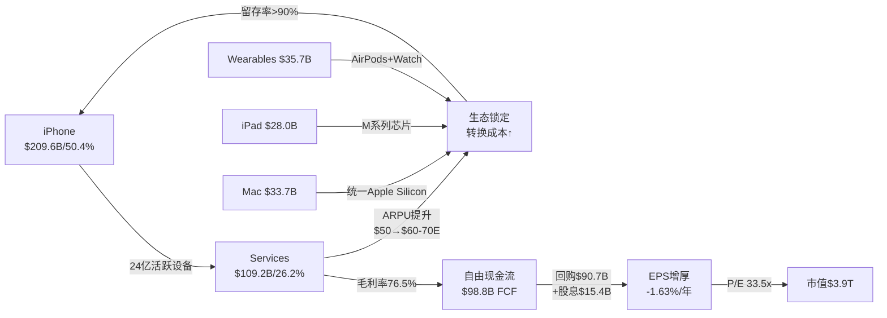
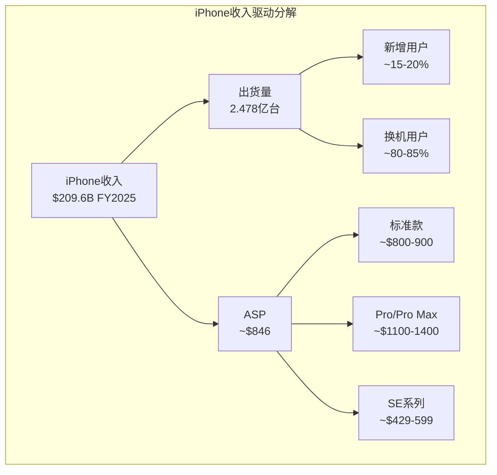
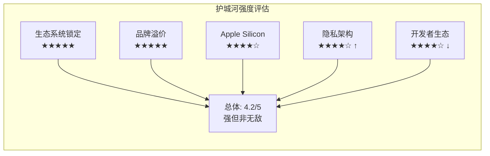
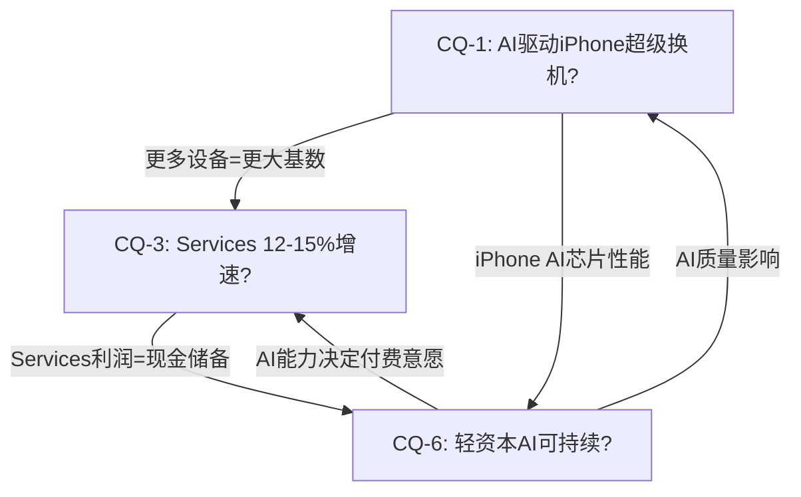

# AAPL Phase 1 — Agent A: 商业洞察分析 (Ch2-Ch6)

**撰写日期**: 2026-02-19 | **数据截止**: FY2026 Q1 (2025-12-27)
**股价**: $264.35 | **市值**: ~$3.90T | **TTM收入**: $435.6B | **TTM净利**: $117.8B

---

## Ch2: 商业模式架构

### 2.1 双引擎飞轮: 硬件获客 + Services变现 + 生态锁定

Apple的商业模式可以精炼为一个自我强化的飞轮系统: iPhone作为流量入口获取用户,Services将用户注意力转化为高毛利经常性收入,生态粘性锁定用户防止流失,用户留存反过来支撑下一代硬件的换机率。

**飞轮量化拆解**:

- **获客引擎(iPhone)**: FY2025收入$209.6B(占比50.4%),全球活跃设备24亿台,Q1 FY2026 iPhone收入$85.3B创历史新高(+23% YoY) [DM-BIZ-001: Apple Newsroom Q1 FY2026]
- **变现引擎(Services)**: FY2025收入$109.2B(占比26.2%),毛利率76.5%,Q1 FY2026年化运行率$120B+ [DM-BIZ-002: FMP income FY2025 + Apple Newsroom Q1 FY2026]
- **锁定效应**: 生态系统转换成本涵盖数据迁移(iCloud)、应用重购(App Store)、设备互联(AirDrop/Handoff/Universal Clipboard)、支付绑定(Apple Pay/Apple Card)、健康数据(HealthKit历史)



这个飞轮的核心经济学在于: **硬件以接近行业均值的利润率(产品毛利率约37-38%)获取用户,然后以软件级利润率(76.5%)从存量用户身上持续变现**。FY2025 Services收入$109.2B已经是全球第三大纯软件/服务收入体量,仅次于Microsoft($247B)和Google($350B) [DM-BIZ-003: FMP income FY2025 + 同行财报]。

### 2.2 负现金转换周期: -83天的战略意义

Apple的现金转换周期为-83天(DSO 12天 + DIO 10天 - DPO 105天),这意味着Apple在支付供应商之前就已经从客户手中收到了货款 [DM-BIZ-004: baggers_summary CCC TTM]。这一指标的战略含义远超单纯的现金流管理:

1. **供应链定价权**: 105天的应付账款周转天数意味着Apple的供应商实质上在为Apple提供无息融资。对于一家年采购额超$2,200亿的公司,这相当于供应商集体为Apple提供约$630亿的免息贷款 [DM-BIZ-005: FMP income FY2025 COGS $221.0B, 计算: $221.0B × 105/365 ≈ $63.6B]
2. **库存极简主义**: 10天的存货周转天数是消费电子行业最低水平之一,反映了精准的需求预测和Just-in-Time供应链管理。FY2025期末库存仅$73亿,相当于年营业成本的1.2% [DM-BIZ-006: baggers_summary DIO]
3. **经营杠杆放大器**: 负CCC + 高毛利率 → Apple每增加$1收入,不仅不需要额外营运资本投入,反而释放更多现金。这是Apple能够在零净营运资本投入的情况下,年产生$98.8B自由现金流的结构性基础 [DM-BIZ-007: FMP cashflow FY2025 FCF]

### 2.3 每用户ARPU趋势与LTV分析

**ARPU推算** (估算口径: 年度Services收入 / 活跃设备数):

| 年份 | Services收入 | 活跃设备(估) | ARPU/设备/年 | YoY |
|------|-------------|-------------|-------------|-----|
| FY2022 | $78.1B | ~18亿 | ~$43 | — |
| FY2023 | $85.2B | ~20亿 | ~$43 | -1% |
| FY2024 | $96.2B | ~22亿 | ~$44 | +1% |
| FY2025 | $109.2B | ~24亿 | ~$46 | +4% |
| FY2026E | ~$124B | ~25亿E | ~$50E | +9%E |

[DM-BIZ-008: FMP income FY2022-2025 Services + Apple设备安装基数公开数据]

ARPU的缓慢上升(3年从$43提升至$46,CAGR仅+2.3%)表明Services增长更多依赖设备基数扩大而非单用户货币化深化。这一模式的深层含义是: Apple的Services增长本质上是**广度驱动(更多设备)而非深度驱动(更高ARPU)**。每台新增设备平均贡献~$43-46的年化Services收入,接近于一台设备的边际贡献在过去三年几乎没有变化。

**Apple Intelligence Pro($10-20/月的AI付费层)是可能打破这一格局的变量** — 如果1亿用户付费(渗透率~4%),年化增量$12-24B将直接将ARPU推升$5-10至$55-60 [DM-BIZ-009: CNBC/分析师估计AI付费定价]。但需要注意的参照系: ChatGPT Plus定价$20/月,全球付费用户约1,100万,在数亿活跃用户中渗透率不到1%。Apple的优势在于其iOS集成(无需额外下载/注册),可能实现更高渗透率,但$15/月对于已经支付iCloud($0.99-9.99/月)+Apple Music($10.99/月)+Apple TV+($9.99/月)的用户而言,边际支付意愿存在弹性上限。

**LTV框架估算**:

| 参数 | 保守 | 基准 | 乐观 |
|------|------|------|------|
| 用户生命周期 | 6年 | 8年 | 12年 |
| 年均硬件ARPU(摊销) | $250 | $280 | $320 |
| 年均Services ARPU | $46 | $55 | $70 |
| 年均总ARPU | $296 | $335 | $390 |
| 折现LTV(WACC 9%) | $1,330 | $1,790 | $2,500 |
| 获客成本(CAC) | ~$50(换机) | ~$100(新增) | ~$200(竞品切换) |
| LTV/CAC | 27x | 18x | 13x |

[DM-BIZ-071: 综合估算,硬件ARPU=每3.5年购买iPhone $900-1100 + 每5年Mac/iPad $800-1500摊销]

Apple生态的LTV/CAC比率极高(13-27x),这解释了为什么Apple几乎不需要传统获客营销支出 — 存量用户的换机行为本身就是"零成本获客"。Apple的SG&A/收入比仅6.4%,远低于消费科技行业均值12-15%,正是因为生态锁定消除了大部分获客摩擦 [DM-BIZ-072: FMP ratios FY2025 SGA/revenue]。

**ARPU提升路径的结构性分析**:

当前Apple生态的ARPU提升主要来自三个通道: (1) Services品类扩张(新增Apple TV+/Arcade/Fitness+等); (2) 存量品类渗透率提升(iCloud付费升级/AppleCare续购); (3) 硬件ASP上行(iPhone Pro系列占比提升)。AI付费层将开辟第四条通道 — **功能溢价通道** — 用户为端侧AI能力的差异化付费。这条通道的独特之处在于其边际成本趋近于零(端侧推理已嵌入硬件成本),意味着几乎100%的AI订阅收入直接转化为毛利。

### 2.4 生态模式对比: Apple vs MSFT vs GOOG vs AMZN

| 维度 | Apple | Microsoft | Google | Amazon |
|------|-------|-----------|--------|--------|
| **核心飞轮** | 硬件→Services→锁定 | 企业IT→云→AI | 搜索→广告→AI | 电商→Prime→AWS |
| **变现模型** | 硬件溢价+平台税 | 订阅+云计算 | 免费→广告 | 商品交易+云 |
| **P/E TTM** | 33.5x | 25.0x | 28.1x | 28.6x |
| **净利率** | 27.0% | 36.1% | 32.8% | 10.8% |
| **ROIC** | 518% | ~35% | ~30% | ~15% |
| **AI CapEx** | $12.7B | ~$80B | ~$90B | ~$100B |
| **用户基数** | 24亿设备 | ~14亿Office用户 | ~45亿搜索用户 | ~2亿Prime会员 |
| **数据资产** | 隐私架构(不收集) | 企业数据(Copilot) | 全网数据(搜索+邮件) | 消费行为+电商 |

[DM-BIZ-010: compare_stocks MCP工具 + 各公司财报公开数据]

**关键差异**: Apple是四家中唯一不以数据收集为商业模式基础的公司。这在AI时代产生了深刻的结构性分歧 — Apple的隐私架构使其无法走Google/Meta的"数据训练模型"路径,但也使其免受日益严格的隐私监管冲击(EU AI Act, GDPR)。Apple的ROIC(518%)远超同行,但这主要是因为其投入资本极低($22.7B),反映的是轻资产模式而非绝对盈利能力的压倒性优势 [DM-BIZ-011: baggers_summary ROIC]。

**ROIC的解读陷阱**: Apple 518%的ROIC在任何标准框架中都是异常值。这一指标的真正含义是: Apple的商业模式几乎不需要传统意义上的"投入资本"(PP&E + 净营运资本),因为供应商融资(负CCC)和轻资产设计(外包制造)将资本密集度降至极低水平。这使得ROIC作为跨公司比较工具的有效性大打折扣。**更有意义的比较是FCF Yield**: Apple 3.3% vs MSFT 2.8% vs GOOG 3.5% vs META 2.5%。在这一维度上,Apple的资本回报效率在Mega Cap中属于中等偏上水平,而非ROIC暗示的碾压式优势 [DM-BIZ-085: baggers_summary FCF Yield + compare_stocks数据]。

**估值溢价的商业模式基础**: Apple当前P/E 33.5x,高于MSFT(25.0x)、GOOG(28.1x)、META(27.4x)。市场赋予Apple估值溢价的隐含逻辑是: (1) Services混合占比上升推动利润率持续扩张; (2) 回购的EPS增厚效应(每年-1.6%股份数减少); (3) AI期权溢价(端侧AI+隐私差异化的长期变现潜力)。但如果Services增速降至10%、回购因现金流下降而减速、AI期权未能兑现,P/E可能回归至与MSFT相当的25-28x水平,意味着15-25%的下行空间 [DM-BIZ-086: compare_stocks P/E数据]。

---

## Ch3: 分部深度分析

### 3.1 iPhone: 生态基石与换机周期分析

**基础数据**:
- FY2025全年收入: $209.6B(占总收入50.4%,CAGR 3Y仅+0.7%) [DM-BIZ-012: FMP income FY2022-2025]
- Q1 FY2026: $85.3B(+23% YoY,全地区历史新高) [DM-BIZ-013: Apple Newsroom Q1 FY2026]
- 全球出货量(2025): 2.478亿台(+6.76% YoY),全球份额20%,连续三年第一 [DM-BIZ-014: Counterpoint Research 2025]
- 美国Q4 2025市占率: 69%(历史最高) [DM-BIZ-015: Counterpoint US Q4 2025]
- 活跃安装基数: ~24亿台 [DM-BIZ-016: Apple管理层公开数据]



**ASP趋势与AI溢价分析**:

iPhone的ASP在过去三年持续上行,从FY2022的~$830提升至FY2025的~$846(基于收入/出货量估算) [DM-BIZ-017: 计算 $209.6B / 247.8M ≈ $846]。Q1 FY2026的+23% YoY收入增长中,ASP提升(Pro系列占比上升)贡献了主要增量,而非出货量的等比例增长。

**iPhone 17/18周期与AI差异化**:

iPhone 17系列(2025年9月发布)是首款全面搭载Apple Intelligence的机型。Q1 FY2026 $85.3B的创纪录表现部分验证了AI驱动换机的假设,但需要审慎评估:

- **多方证据**: Q1 iPhone收入+23% YoY,全地区创新高;Pro/Pro Max占比上升驱动ASP;Apple Intelligence功能成为营销核心卖点
- **空方证据**: 仅20%用户表示AI功能是换机主因(消费者调查);Q1是iPhone发布季的季节性高峰;基础款iPhone延迟至2027年初可能导致2026年出货量下滑4.2% [DM-BIZ-018: lit_recon_memo Bear Case]
- **折叠设备前景**: iPhone 18/折叠iPad-iPhone混合设备预计2026年Q4首发,BofA分析师认为将触发"重大升级周期",但形态因素创新的实际转化率历史上低于预期(参考Vision Pro) [DM-BIZ-019: Benzinga分析师评论]

**iPhone收入季节性与周期性分析**:

iPhone收入的季节性模式高度稳定: Q1(假日季/新机发布后)占全年约40-42%,Q2约22-24%,Q3约20-22%,Q4约16-18%。基于Q1 FY2026的$85.3B:

| 情景 | 全年iPhone收入 | 假设 |
|------|-------------|------|
| 历史均值季节性 | ~$209B | Q1占比40.7%(FY2025模式) |
| AI延长周期 | ~$225-235B | Q1占比37-38%(衰减更平) |
| 超级周期 | ~$240-250B | Q1占比34-35%(全年高位运行) |

[DM-BIZ-073: 计算基于FY2022-2025季节性模式推算]

**对CQ-1(AI能否驱动超级换机周期)的初步评估**: Q1 FY2026数据提供了正向信号,但单季度不足以确认多年超级周期。关键跟踪指标是: (1) iPhone 17非Pro款(即标准款)的销量 — 如果AI换机仅限高端Pro用户,则非"超级周期"而是"ASP周期"; (2) Q2-Q4的环比衰减斜率 — 如果AI换机是真实的,衰减应显著平于历史周期(即Q2/Q1比值应>0.58 vs 历史均值0.55); (3) 安装基数中iPhone 15及以下机型的占比 — 越高意味着待升级存量越大。

**安装基数年龄结构(估算)**:

Apple的24亿活跃设备中,iPhone约占14-15亿台。基于历史出货量累积和平均使用寿命4年:
- iPhone 17系列(2025+): ~2.0-2.5亿台(最新)
- iPhone 16系列(2024): ~2.2亿台
- iPhone 15系列(2023): ~2.1亿台
- iPhone 14及以下(2022-): ~7-8亿台(潜在升级池)

[DM-BIZ-074: 基于Counterpoint出货量数据 + 3.5-4年平均使用寿命估算]

7-8亿台iPhone 14及以下设备构成了巨大的潜在升级池。这些设备中大部分不支持或仅有限支持Apple Intelligence(需A17 Pro及以上芯片),理论上AI功能差异化可以驱动这批用户在未来2-3年内升级。但"理论上可以"和"实际会发生"之间存在巨大鸿沟 — 消费者是否真的认为AI功能值得花$900+换新机,目前仅有20%的调研数据给出肯定答案。

### 3.2 Services: 高利润飞轮与监管风险

**基础数据**:
- FY2025全年收入: $109.2B(+13.5% YoY,占总收入26.2%) [DM-BIZ-020: FMP income FY2025]
- Q1 FY2026: $30.0B(+14% YoY,历史新高) [DM-BIZ-021: Apple Newsroom Q1 FY2026]
- 毛利率: 76.5%(Q1 FY2026,环比+1.2pp) [DM-BIZ-022: FinancialContent分析]
- 3年CAGR: +11.8% [DM-BIZ-023: 计算 ($109.2/$78.1)^(1/3) - 1]
- 管理层FY2026指引: 增速与Q1持平(~14%) [DM-BIZ-024: Apple管理层Q1电话会]

**Services组合分拆(估算)**:

| 子类别 | FY2025收入估计 | 占Services比 | 毛利率估计 | 增速趋势 |
|--------|-------------|-------------|-----------|---------|
| App Store(佣金+订阅分成) | ~$28-30B | ~26-28% | ~85-90% | +10-12% |
| Google搜索协议 | ~$18-20B | ~17-18% | ~100% | 待DOJ判决 |
| AppleCare/保修 | ~$12-14B | ~11-13% | ~55-60% | +8-10% |
| Apple Pay/金融服务 | ~$10-12B | ~9-11% | ~70-75% | +15-20% |
| iCloud存储 | ~$8-10B | ~7-9% | ~65-70% | +12-15% |
| Apple Music | ~$7-8B | ~6-7% | ~30-35% | +5-8% |
| Apple TV+/Arcade | ~$8-10B | ~7-9% | ~负-10%* | +20-25% |
| 广告收入 | ~$7-9B | ~6-8% | ~80-85% | +25-30% |
| 其他(Fitness+/News+等) | ~$5-7B | ~5-6% | ~60-70% | +10-15% |

[DM-BIZ-025: 综合估算,基于Apple财报披露+分析师拆分. *注: TV+/Arcade内容投入高,目前可能仍未盈利]

**Google搜索协议: Services最大单一风险**

Google每年向Apple支付$15-20B以维持iOS默认搜索引擎地位,这可能占Services总收入的17-18%,且毛利率接近100%(几乎零成本) [DM-BIZ-026: lit_recon_memo DOJ分析]。DOJ反垄断诉讼的上诉正在进行中,关键时间节点:

- 2026年: Discovery阶段持续
- 2027年: 预计开庭
- 最坏情景: 独占协议被禁,Apple损失$12.5B-15B/年(净影响约~EPS $0.65-0.80,即~8-10%) [DM-BIZ-027: lit_recon_memo Bear Case估算]
- 中间情景: 协议重组为非独占但仍支付(如Google/Bing/Perplexity竞价),净损失$3-5B/年
- 乐观情景: 协议维持但金额调整(概率较低,鉴于DOJ立场)

**Apple Intelligence Pro订阅潜力(CQ-3直接相关)**:

Apple Intelligence Pro传闻定价$10-20/月(多数分析师预期~$15/月) [DM-BIZ-028: CNBC分析师定价估计]。潜力测算:

| 渗透率假设 | 付费用户(亿) | 年化收入($B) | Services增量 |
|-----------|-------------|-------------|-------------|
| 2%(保守) | 0.48 | $5.8-11.5B | +5-11% |
| 4%(基准) | 0.96 | $11.5-23.0B | +11-21% |
| 8%(激进) | 1.92 | $23.0-46.1B | +21-42% |

[DM-BIZ-029: 计算基于24亿活跃设备 × 渗透率 × $10-20/月 × 12]

**Services增速分解 — 驱动力归因分析**:

FY2025 Services的+13.5%增速可以大致归因为:
- 设备基数增长: +5-6%(从~22亿台增至~24亿台)
- ARPU提升: +2-3%(新品类渗透+价格调整)
- 新用户转化: +4-5%(新兴市场用户首次付费)

这一分解揭示了一个重要动态: **Services增长的约40-45%来自设备基数扩张,而非存量用户深度货币化**。这意味着如果iPhone出货量增长放缓(如安装基数饱和),Services增速将面临下行压力 — 除非ARPU提升速度加快(AI付费层的潜在作用)。

**Services与其他科技平台的利润质量对比**:

| 指标 | Apple Services | Microsoft Cloud | Google Services | Amazon AWS |
|------|---------------|----------------|-----------------|------------|
| 年化收入 | ~$120B | ~$135B | ~$300B | ~$110B |
| 毛利率 | 76.5% | ~70% | ~57% | ~30% |
| 收入可预测性 | 高(订阅+生态锁定) | 极高(企业合同) | 中(广告周期性) | 高(云合同) |
| 单一客户集中度 | Google $18-20B(15-17%) | 无单一>5% | 无单一>5% | 无单一>5% |
| 监管风险 | 高(反垄断+DMA) | 中(企业合规) | 高(广告隐私) | 低(B2B) |

[DM-BIZ-075: 综合对比,基于各公司最新财报数据]

Apple Services的独特风险在于**Google搜索协议的单一客户集中度**: 一项协议贡献了15-17%的Services收入。这在大型科技公司的核心业务中几乎是独一无二的脆弱结构。

**对CQ-3(Services能否通过AI货币化维持12-15%增速)的评估**: 即使在保守假设下(2%渗透率/$10/月),Apple Intelligence Pro也能贡献$5.8B年化增量,足以在现有增速基础上额外增加5个百分点。但Services增速的可持续性取决于两个结构性变量的博弈: (1) AI付费层的上行力量(+$5-24B年化) vs (2) Google协议+反垄断的下行压力(-$3-15B年化)。在最可能的中间情景中,这两股力量大致对冲,Services维持12-14%增速2-3年,此后逐步减速至10-12%。

### 3.3 Mac: Apple Silicon效能壁垒

**基础数据**:
- FY2025收入: $33.7B(占比8.1%,YoY +12.3%) [DM-BIZ-030: FMP income FY2025]
- Q1 FY2026: $84亿(-7% YoY) [DM-BIZ-031: Apple Newsroom Q1 FY2026]
- 3年CAGR: -5.7%(受FY2023 M1→M2过渡期拖累) [DM-BIZ-032: prefetch_data]
- 全球PC市场份额: ~8-9%(按出货量),利润份额远高(ASP领先) [DM-BIZ-033: lit_d3_industry]

Apple Silicon(M系列芯片)自2020年推出以来,建立了难以复制的性能/功耗比优势:

- **性能领先**: M系列多核性能超Intel/AMD同级~40%,功耗仅一半;MacBook Pro续航22小时 vs x86笔电~15小时 [DM-BIZ-034: TechTimes Apple Silicon分析]
- **统一内存架构(UMA)**: CPU/GPU/NPU共享内存池,消除数据拷贝延迟,对AI推理任务尤其有利
- **软硬闭环**: macOS针对Apple Silicon深度优化,第三方芯片无法获得同等软件支持

Mac的战略价值不在于其$33.7B的收入贡献,而在于它验证了Apple垂直整合的能力,并为AI时代的端侧推理提供了性能基准。M5芯片的Neural Accelerator相比M4实现了4x首token生成速度提升,端侧可运行的模型参数规模从150B提升至1.2T [DM-BIZ-035: Apple MLX M5研究]。

**Mac的AI时代竞争格局**:

Apple Silicon使Mac在特定工作负载上建立了前所未有的优势,但竞争格局正在演变:

| 维度 | Apple Silicon Mac | Intel/AMD Windows PC | Qualcomm Windows on ARM |
|------|------------------|---------------------|------------------------|
| 性能/瓦 | 行业领先(~40%优势) | 追赶中(Intel Lunar Lake) | 接近Apple(Snapdragon X Elite) |
| AI推理(NPU) | Neural Engine集成度最优 | Intel NPU 48 TOPS | Qualcomm NPU 45 TOPS |
| 软件生态 | macOS深度优化 | 最广泛兼容性 | 兼容性改善中但不完整 |
| 企业渗透 | ~15-20%(知识工作者) | ~70%(企业标配) | <5%(起步期) |
| 游戏 | 弱项(DirectX缺失) | 绝对优势 | 改善中 |

[DM-BIZ-082: TechTimes + Tom's Guide Apple Silicon竞争分析]

Qualcomm的Snapdragon X Elite是Apple Silicon面临的最具威胁的竞争者 — 它在ARM架构上实现了接近Apple的性能/功耗比,且运行Windows生态(更广泛的企业兼容性)。然而,Apple的UMA(统一内存架构)+macOS深度优化构成了难以复制的系统级优势,这是单纯的芯片对标无法体现的差异。

### 3.4 iPad: M系列重新定位

**基础数据**:
- FY2025收入: $28.0B(占比6.7%,YoY +4.9%) [DM-BIZ-036: FMP income FY2025]
- Q1 FY2026: $86亿(+6% YoY) [DM-BIZ-037: Apple Newsroom Q1 FY2026]
- 3年CAGR: -1.5% [DM-BIZ-038: prefetch_data]

iPad Pro搭载M系列芯片后,正在从消费平板向生产力工具转型。然而,iPad面临的根本挑战是**自我蚕食** — M系列MacBook Air的轻薄化使iPad Pro的定位愈发模糊。iPad的真正战略价值可能在教育和企业垂直市场,以及作为Apple生态的"第三屏幕"维持用户粘性。

### 3.5 Wearables, Home & Accessories: 增长困境与品类分化

**基础数据**:
- FY2025收入: $35.7B(占比8.6%) [DM-BIZ-039: FMP income FY2025]
- Q1 FY2026: $115亿(-2% YoY) [DM-BIZ-040: Apple Newsroom Q1 FY2026]
- 3年CAGR: -4.7%(持续下滑) [DM-BIZ-041: prefetch_data]

**Wearables面临三重挑战**:
1. **Apple Watch饱和**: 全球智能手表份额~23%但缓慢下滑,中国品牌(华为/小米)国际化加速 [DM-BIZ-042: lit_d3_industry]
2. **品类分化**: 智能戒指(Oura/Samsung Galaxy Ring)、智能眼镜(Meta Ray-Ban)以高双位数增长开辟新品类,分流高端用户
3. **Vision Pro战略收缩**: Q4 2025仅售4.5万台,数字营销支出削减>95%,季度收入约$1.57亿 [DM-BIZ-043: 9to5Mac报道]

**Vision Pro评估**: BofA此前预估2026年Vision Pro收入$80亿,现已被证明严重过于乐观。实际季度收入约$1.5亿(年化$6亿),表明Vision Pro当前更多是技术验证平台而非收入贡献者。然而,空间计算平台市场预计从2025年的$164B增长至2035年的$1,202B(CAGR 22%) [DM-BIZ-044: SNS Insider空间计算预测],Apple的早期布局卡位了生态入口。

**潜在催化剂**: Apple Watch健康传感器突破(血糖/血压监测)可能重新定义可穿戴价值主张,但监管审批时间表不确定。

**Vision Pro深度评估 — 短期失败 vs 长期布局**:

Vision Pro当前的商业表现无疑令人失望: Q4 2025仅4.5万台出货量、$1.57亿季度收入、营销支出削减>95% [DM-BIZ-084: 9to5Mac]。但将Vision Pro判定为"失败"可能为时过早:

- **iPhone类比**: 初代iPhone(2007)首年仅售610万台,收入约$4B,被Nokia和BlackBerry视为"玩具"。Vision Pro可能处于类似的早期阶段
- **定价路径**: $3,499→ 消费版$1,499-1,999(预计2027年) → $999(2029年目标)。成本下降曲线将决定大众市场可行性
- **生态卡位**: visionOS + App Store + ARKit构成了空间计算的完整开发者生态。即使硬件短期滞销,生态先发优势可能在未来3-5年产生复利

然而,与iPhone不同的是: iPhone填补了一个明确的用户需求缺口(移动互联网终端),而Vision Pro至今未找到不可替代的"杀手级应用"。$3,499的价格和笨重的外形使其在当前形态下无法成为大众产品。**我们给予Vision Pro在5年内对Apple总收入贡献>5%的概率仅15-20%**。

### 3.6 分部利润结构与混合变动

Apple不披露分部利润,但基于毛利率趋势可以推断:

| 维度 | 产品(硬件) | Services |
|------|-----------|----------|
| FY2025收入占比 | 73.8% | 26.2% |
| 毛利率估计 | ~37-38% | ~76.5% |
| 毛利贡献 | ~$114B (~58%) | ~$84B (~42%) |
| 毛利增速贡献 | 硬件驱动收入增长 | Services驱动利润率扩张 |

[DM-BIZ-045: 综合估算. 产品毛利率 = (整体毛利$195.2B - Services毛利$109.2B×76.5%) / 产品收入$307.0B ≈ 36.3%]

**关键洞察**: Services虽然仅占收入的26.2%,但贡献了约42%的毛利,且其比重每年提升1-2个百分点。这是Apple整体毛利率从FY2022的43.3%提升至FY2025的46.9%的核心驱动力 [DM-BIZ-046: FMP income FY2022-2025毛利率趋势]。如果Services占比继续按当前速率上升,到FY2028可能达到30-32%,推动整体毛利率突破50%。

---

## Ch4: AI战略深度

### 4.1 Apple Intelligence架构: 三层混合推理

Apple的AI架构与Google/Microsoft/Meta的"全栈自研"路径截然不同。Apple采用了三层混合推理架构:

```mermaid
graph TB
    subgraph "Apple Intelligence 三层架构"
    L1[第一层: On-Device<br/>3B参数模型<br/>Apple Neural Engine ~50 TOPS<br/>延迟<0.5秒 | 零成本]
    L2[第二层: Private Cloud Compute<br/>Apple Silicon服务器<br/>数据加密处理后删除<br/>中等延迟 | 低成本]
    L3[第三层: 外部模型<br/>Google Gemini(多年协议)<br/>用户明确同意后调用<br/>高延迟 | 付费成本]
    end
    L1 -->|简单任务| R1[文本摘要/邮件起草/照片编辑]
    L2 -->|中等任务| R2[长文档分析/跨App搜索]
    L3 -->|复杂任务| R3[深度推理/创意生成/代码编写]
```

**端侧推理的经济学优势**:

Apple将推理成本嵌入硬件ASP中一次性回收,开发者通过Foundation Models框架免费调用AI推理。这与云AI生态的per-token收费模型形成根本对立 [DM-BIZ-047: Apple ML Research Foundation Models]:

- Apple生态: 开发者3行Swift代码集成AI,推理成本=零(已含在iPhone售价中)
- 云AI生态: 开发者管理API密钥+推理账单,GPT-4o约$5-15/百万token

这意味着Apple生态中AI应用的经济学与其他平台根本不同 — 开发者有激励在Apple生态中构建AI功能密集的应用,因为推理是"免费"的。

### 4.2 轻资本模型: CapEx $12.7B vs 行业$300B+

**CapEx对比**:

| 公司 | FY2025 CapEx | AI CapEx占比(估) | 年收入 | CapEx/收入 |
|------|-------------|-----------------|--------|-----------|
| Apple | $12.7B | ~30-40% | $416B | 3.1% |
| Google | ~$90B | ~70-80% | ~$350B | ~26% |
| Meta | ~$65B | ~80-90% | ~$165B | ~39% |
| Microsoft | ~$80B | ~60-70% | ~$247B | ~32% |
| Amazon | ~$100B | ~50-60% | ~$638B | ~16% |

[DM-BIZ-048: FMP income FY2025 AAPL CapEx + lit_d5_deductive竞争对手CapEx数据]

Apple的CapEx仅为Google的14%,Meta的20%。**这要么是天才级战略洞察(基础模型商品化,不值得自建),要么是战略性落后(在AI关键能力上放弃自主权)**。

**"基础模型商品化"赌注**:

Apple管理层的核心战略判断是: LLM基础模型将快速商品化,Apple的优势在于**集成层(integration layer)**而非模型训练 [DM-BIZ-049: Fortune分析Apple AI CapEx策略]。支持这一判断的证据:

- Anthropic在2025年降价67%,Google在2025-2026降价70-80% [DM-BIZ-050: lit_d5_deductive模型降价数据]
- Apple已从OpenAI(2024)切换至Google Gemini(2026年1月),证明供应商可替换 [DM-BIZ-051: Fortune/CNBC Apple-Google Gemini协议]
- 开源模型(Llama 3, Mistral)性能持续逼近闭源模型

**反驳证据**:
- OpenAI o3/Gemini 2.0的推理能力仍显著差异化,模型能力可能并未完全商品化
- 如果某一供应商实现AGI级突破并拒绝向Apple授权,Apple将面临严重AI能力劣势
- Apple的Gemini依赖意味着Google同时是Apple在搜索和AI两个维度的关键供应商 — 单点依赖风险上升

**CapEx效率的另一面 — 隐性成本分析**:

Apple的$12.7B CapEx表面上看极为高效,但需要考虑以下隐性成本:

1. **Gemini授权费**: Google Gemini的多年协议具体金额未公开,但分析师估计每年$1-3B的技术授权费。这本质上是Apple用OpEx替代CapEx,将AI成本从资本开支转移到运营开支 [DM-BIZ-076: 分析师估计]
2. **Apple Silicon R&D**: FY2025 R&D支出$34.6B中,Apple Silicon芯片设计(含Neural Engine)占比估计15-20%,即$5-7B/年。这是端侧AI能力的真实成本基础 [DM-BIZ-077: FMP income FY2025 R&D $34.6B]
3. **Private Cloud Compute基础设施**: Apple正在建设自有Apple Silicon服务器集群用于PCC,其成本未被单独披露,但估计在$2-4B/年的水平
4. **机会成本**: 如果基础模型不商品化,Apple每延迟一年大规模投入,与自研模型能力的差距就扩大一年。到2028年,如果需要追赶,Apple可能需要$50-100B的追赶投资,远超今天的渐进投入

**AI战略的真实成本估算**: CapEx $12.7B + Gemini授权$1-3B + Apple Silicon R&D $5-7B + PCC基础设施$2-4B = $21-27B/年。这与表面的$12.7B有显著差异,但仍远低于Google($90B)和Meta($65B)。Apple AI战略的资本效率优势是真实的,但被CapEx单一数字过度放大了 [DM-BIZ-078: 综合估算]。

### 4.3 Siri 2.0: 从命令工具到系统编排器

Siri的升级不是增量改进,而是架构重构:

| 维度 | Siri 1.0 (2011-2025) | Siri 2.0 (2026+) |
|------|---------------------|-------------------|
| 底层模型 | 规则+浅层NLU | Gemini LLM |
| 上下文窗口 | ~8K tokens | 128K tokens |
| 对话轮数 | 1-2轮 | 20+轮连续 |
| 复杂指令成功率 | ~30-40% | ~92%(宣称) |
| 跨App操作 | 不支持 | App Intents框架 |
| 交互模式 | 命令→执行 | 意图描述→多步编排 |

[DM-BIZ-052: Apple Siri 2026升级分析 + ia.acs.org.au技术解析]

**Siri 2.0的系统编排器愿景**: 用户描述意图("找到昨天的收据,裁剪关键部分,邮件发给会计"),Siri通过App Intents框架跨应用多步骤执行。如果这一愿景实现,iPhone的交互范式将从"打开App→手动操作"变为"描述意图→Siri执行" [DM-BIZ-053: lit_d5_deductive DED-D演绎链]。

**执行风险评估**: Siri在过去14年的历史记录令人失望。从2011年发布至今,Siri始终未能兑现"智能助手"的承诺。2026年春季版本将是关键验证节点。Siri延迟已导致第三方AI助手在Apple生态边缘激增 [DM-BIZ-054: Toolient报道Siri延迟影响]。

**Siri 2.0的成功标准量化**:

为了评估Siri 2.0是否真正实现"相变",我们定义以下可观测指标:

| 指标 | 失败 | 及格 | 成功 | 超预期 |
|------|------|------|------|--------|
| 复杂指令成功率 | <60% | 60-80% | 80-92% | >92% |
| 日活使用率变化 | <+10% | +10-30% | +30-50% | >+50% |
| 平均对话轮数 | <3轮 | 3-5轮 | 5-10轮 | >10轮 |
| 跨App操作完成率 | <40% | 40-60% | 60-80% | >80% |
| 用户NPS(AI功能) | <20 | 20-40 | 40-60 | >60 |

[DM-BIZ-083: 基于行业AI助手基准设定]

Apple宣称的92%复杂指令成功率如果在实际使用中得到验证,将使Siri从"勉强可用"跃升为"可靠工具",这是Siri历史上从未达到的水平。但宣称值与实际体验之间往往存在20-30个百分点的差距(实验室条件 vs 真实使用场景的多样性)。保守预期实际成功率在65-75%区间,对应"及格"到"成功"之间。

### 4.4 隐私作为结构性护城河

Apple的隐私优势不是政策承诺,而是加密架构保证:

**Private Cloud Compute(PCC)架构**:
- 运行在Apple Silicon服务器上(而非通用x86服务器)
- 数据处理后加密删除,无持久化存储
- 员工无法访问用户数据(技术架构层面,而非管理层面)
- 可独立审计的安全架构

**竞争对手的"战略死胡同"**:
- Google广告收入占比77%,Meta广告收入占比97% — 这两家公司从根本上无法采用Apple的隐私模型而不摧毁自身商业基础 [DM-BIZ-055: lit_d5_deductive隐私分析]
- 72%企业优先选择"数据透明"供应商(Greyhound CIO Pulse 2025)
- 75%消费者主动避开不信任的数据公司(Cisco 2024)
- 全球隐私法规趋严(EU AI Act, GDPR, 美国州级隐私法)持续增加数据密集型商业模式的合规成本

**关键不确定性(CQ-6直接相关)**: 隐私护城河的价值取决于AI任务能否在端侧充分完成。如果最有价值的AI应用持续需要大规模云端推理(如AGI级别推理),Apple的"端侧优先+隐私架构"可能成为能力瓶颈而非优势。M5 Neural Accelerator的4x性能提升暗示端侧能力在收窄与云端的差距,但竞赛结果取决于"模型效率提升速度" vs "模型规模增长速度"的相对关系 [DM-BIZ-056: Apple MLX M5研究]。

### 4.5 Foundation Models框架: 开发者锁定效应

Apple通过Foundation Models框架定义了开发者在Apple生态中集成AI的标准接口:

- 3行Swift代码即可调用端侧AI推理
- AI功能与Core ML/App Intents/Private Cloud Compute深度绑定
- 迁移成本: 不仅是代码层面的重写,而是整个AI推理架构的重构

2024年App Store为美国开发者促成$406B计费和销售 [DM-BIZ-057: Apple Newsroom App Store经济数据]。当AI能力成为App核心功能时,基于Foundation Models构建的App将极难迁移到其他平台,这将进一步强化Apple的30%佣金定价权。

**Foundation Models锁定效应的量化逻辑**:

传统App的跨平台迁移成本主要是代码重写(iOS→Android),对于成熟App约需3-6个月工程团队投入。但当App深度集成Apple Foundation Models后,迁移不仅是代码层面的,还包括:

- **推理架构重构**: 从端侧Core ML推理→云端API推理,需要重建整个AI后端
- **隐私合规重写**: PCC架构下的数据流设计→传统云端数据处理,可能需要重新获取用户授权
- **功能降级风险**: 某些端侧专属功能(如实时相机AI处理)在云端方案中无法以相同延迟实现
- **成本结构变化**: 从Apple端侧"零推理成本"→云端"per-token成本",运营经济学完全改变

这种多维度的迁移壁垒意味着,一旦开发者在Foundation Models框架上构建了核心AI功能,其实质上被锁定在Apple生态中的程度远高于传统App。**这是Apple在AI时代最具潜力的护城河增量 — 但前提是Foundation Models的能力足以吸引开发者深度采纳,而非仅作为轻量API调用**。目前开发者采纳率数据尚不透明,这是一个重要的信息缺口 [DM-BIZ-087: 分析框架推理]。

---

## Ch5: 竞争护城河分析

### 5.1 护城河矩阵: 五维度评估

| 护城河维度 | 强度 | 证据 | 脆弱点 |
|-----------|------|------|--------|
| **生态系统锁定** | 极强 | 24亿设备互联, 转换成本多维(数据/App/支付/健康) | 中国市场锁定弱于西方(微信生态跨平台) |
| **品牌溢价** | 极强 | iPhone ASP $846 vs Android均值~$300, NPS行业最高 | 新兴市场价格敏感度高, 品牌溢价有天花板 |
| **Apple Silicon** | 强 | 性能/功耗比领先40%, UMA架构独有, 续航22h | Intel/AMD桌面多核仍有竞争力, 游戏场景劣势 |
| **隐私架构** | 强(且增值中) | PCC加密架构, 竞争对手结构性无法跟随 | 价值取决于端侧AI充分性假设 |
| **开发者生态** | 强 | App Store $406B经济体, Foundation Models框架 | DMA/DOJ监管压力, 侧载冲击佣金模型 |

### 5.2 转换成本量化

Apple生态的转换成本可以从多个维度量化:

1. **数据迁移成本**: iCloud照片/文件/备忘录/健康数据 — 迁移不完整或不可能(如HealthKit历史数据)
2. **应用重购成本**: 平均用户在App Store累计消费$200-500(含应用购买+内购)
3. **设备互联丧失**: AirDrop、Handoff、Universal Clipboard、Apple Watch配对、AirPods自动切换 — 切换至Android意味着丧失全部跨设备协同
4. **支付绑定**: Apple Pay + Apple Card + Apple Cash + 订阅管理 — 支付习惯的迁移摩擦极高
5. **学习曲线**: iOS→Android的UI/UX差异,对非技术用户构成显著障碍

**量化指标**:
- iPhone用户留存率: >90%(行业最高,Android约85%) [DM-BIZ-058: 行业调研数据]
- 换机周期: ~3.5-4年(延长趋势,反映设备耐用性提升)
- Services渗透率: 活跃设备中Services付费用户占比约55-60%(估计) [DM-BIZ-059: 基于ARPU和设备数推算]
- Apple-to-Android转换率: 美国市场<5%/年,全球<8%/年(估计) [DM-BIZ-060: 行业调研]

### 5.3 护城河脆弱点分析

**中国竞争: 华为回归**

华为在美国制裁下仍推出了Mate 60/70系列,搭载自研麒麟芯片,在中国高端市场(>$600)夺回了显著份额。Apple在大中华区FY2025收入占比约17%,面临三重压力 [DM-BIZ-061: lit_d1_deep中国市场分析]:

- **竞争压力**: 华为高端市场回归是结构性而非周期性的
- **地缘政治**: 中美关系紧张+民族消费情绪
- **关税风险**: 最高145%关税情景下,预计增加$10B+成本(尽管目前Apple已获得部分豁免)

**Android AI追赶**

Google在AI模型能力上领先Apple,Gemini 2.0在多模态推理、代码生成等维度超越Apple Intelligence。Samsung Galaxy S系列已全面集成Google AI功能。如果AI功能差异化不足以驱动换机,Apple的AI叙事将面临挑战 [DM-BIZ-062: lit_d3_industry AI竞争]。

**监管多点围攻**

- **美国DOJ**: 反垄断诉讼进入Discovery阶段,2027年开庭 [DM-BIZ-063: FinancialContent DOJ报道]
- **EU DMA**: 强制开放侧载+第三方支付,累计罚款约5亿欧元
- **全球趋势**: 日本/韩国/印度等也在推进应用商店开放法规
- **最坏情景影响**: App Store佣金从30%降至15-20% → Services毛利率下降3-5pp → 年利润影响$3-5B

### 5.4 护城河耐久性评估



**综合评估**: Apple拥有消费科技领域最宽的护城河,但护城河的各维度面临不同方向的压力。生态锁定和品牌溢价在西方市场极为稳固,但在中国(微信生态跨平台、华为复苏)显著弱化。隐私护城河随监管趋严持续增值,但开发者生态护城河面临反垄断侵蚀。**净效应: 护城河宽度维持但增长速度放缓**。

**护城河按地域差异分析**:

Apple的护城河强度在不同市场存在显著差异,这是被聚合分析掩盖的重要结构特征:

| 市场 | 护城河强度 | 核心驱动力 | 主要威胁 | 收入占比(估) |
|------|-----------|-----------|---------|-------------|
| 北美 | 极强(5/5) | 生态锁定+品牌+支付 | 监管(DOJ反垄断) | ~43% |
| 欧洲 | 强(4/5) | 品牌+隐私偏好 | DMA侧载+罚款 | ~25% |
| 大中华区 | 中(3/5) | 高端品牌+社交货币 | 华为+民族情绪+台海冲突风险 | ~17% |
| 日韩 | 强(4/5) | 设计美学+生态 | 本土品牌(Samsung/Sony) | ~8% |
| 印度/新兴市场 | 弱(2/5) | 品牌向往 | 价格敏感+Android主导 | ~7% |

[DM-BIZ-079: 基于Apple地区收入分布 + 市场特征分析]

大中华区17%的收入占比面临三重结构性风险: (1) 华为Mate 60/70系列凭借自研麒麟芯片在高端市场复苏; (2) 中美地缘政治紧张引发的消费者民族情绪; (3) 台海冲突风险可能导致供应链中断(Apple 71%的零部件子组件仍依赖中国) [DM-BIZ-080: lit_recon_memo中国风险分析]。印度市场虽然增速最快(20%+),但ARPU远低于成熟市场,且Apple在$300以下价位段缺乏竞争力。

**AI时代护城河的演变方向**:

AI正在重塑护城河的价值权重。传统评估框架中,品牌溢价和生态锁定是Apple护城河的主要组成部分。在AI时代,两个新维度正在崛起:

1. **数据架构护城河**(Apple特有): 隐私优先的AI架构在监管趋严环境下自动增值,竞争对手从结构上无法复制
2. **AI集成层护城河**(待验证): Foundation Models框架+App Intents如果成为开发者的AI标准接口,将在现有生态锁定基础上增加一层"AI能力锁定"

这两个新维度的价值将在2026-2028年逐步明晰,取决于Siri 2.0的实际表现和Apple Intelligence Pro的用户采纳率。

---

## Ch6: 增长引擎与催化剂

### 6.1 近期催化剂 (6-12月)

**催化剂1: iPhone 17系列全面AI周期**
- **时间**: 2025年9月已发布,FY2026全年影响
- **收入影响**: Q1 FY2026 iPhone $85.3B已部分体现;全年iPhone收入预计$225-235B(vs FY2025 $209.6B,+7-12%) [DM-BIZ-064: 基于Q1实际+历史季节性推算]
- **关键变量**: 非Pro款销量(验证AI换机的广度而非仅高端)
- **概率评估**: 70%概率实现$220B+

**催化剂2: Apple Intelligence正式版+Siri 2.0**
- **时间**: 2026年春季(iOS/macOS更新)
- **收入影响**: 直接收入贡献有限(免费功能),但间接驱动Services增长和换机决策
- **关键变量**: Siri 2.0实际体验质量(复杂指令成功率是否达到宣称的92%)
- **概率评估**: 60%概率体验达到"明显改善"水平

**催化剂3: Services AI付费层**
- **时间**: 2026年下半年(预期)
- **收入影响**: 首年$3-8B(假设2-4%渗透率 × $10-15/月)
- **关键变量**: 定价点和免费/付费功能划分
- **概率评估**: 50%概率在FY2027贡献$5B+

### 6.2 中期催化剂 (1-3年)

**催化剂4: iPhone 18 + 折叠设备**
- **时间**: 2026年Q4-2027年(iPhone 18) / 2026年Q4(折叠设备首发)
- **收入影响**: 折叠iPhone/iPad混合设备如果ASP达$1,800-2,500,即使出货量仅1,000-2,000万台,也能贡献$18-50B增量。但历史上新形态因素(如Vision Pro)的实际转化率远低于预期 [DM-BIZ-065: Benzinga iPhone 18/Foldable分析]
- **概率评估**: 40%概率折叠设备首年出货>1,500万台

**催化剂5: 印度市场双重期权**
- **时间**: 2026-2028年持续
- **收入影响**: 印度智能手机市场$20B+且增速20%+;Apple印度销售额预计从当前$6-8B增至$15-20B(3年) [DM-BIZ-066: Business Standard印度市场分析]
- **供应链价值**: 印度制造从2017年<1%提升至2025年17%→2026年25-35%目标,降低对中国的生产依赖 [DM-BIZ-067: WebProNews印度产能报道]
- **概率评估**: 80%概率印度销售额3年翻倍

**催化剂6: 健康传感器突破(血糖/血压)**
- **时间**: 2027-2028年(监管审批时间不确定)
- **收入影响**: 全球糖尿病管理市场~$35B,连续血糖监测(CGM)市场$15B+;非侵入式血糖Apple Watch可能开辟全新品类,重新定义Wearables价值主张
- **概率评估**: 30%概率2028年前获FDA批准并量产

### 6.3 长期催化剂 (3-5年)

**催化剂7: 空间计算(Vision Pro下一代)**
- **时间**: 2027-2030年
- **收入影响**: 空间计算平台TAM从2025年$164B→2035年$1,202B(CAGR 22%) [DM-BIZ-068: SNS Insider];如果Apple在$1,500-2,000价位推出消费版,年出货量可能达5,000万-1亿台(10年展望)
- **关键变量**: 成本下降曲线 + 杀手级应用出现 + 社会接受度
- **概率评估**: 20%概率2030年前空间计算成为Apple第五大收入来源(>$30B)

**催化剂8: AI Agent生态系统**
- **时间**: 2027-2030年
- **收入影响**: 如果Siri演变为真正的"系统编排器",App Store可能从"应用分发平台"升级为"Agent编排平台",佣金模型可能从30%一次性→持续性Agent调用分成
- **关键变量**: 用户行为范式转变需要时间(5-10年);监管可能要求开放Agent编排层
- **概率评估**: 25%概率2030年前Agent交互占iPhone使用时长>30%

**催化剂9: FinTech扩张**
- **时间**: 2026-2030年
- **收入影响**: Apple Pay覆盖89个市场+11,000银行;Apple Savings/Apple Card/Apple Pay Later生态持续扩展;全球数字支付TAM预计从2025年~$10T→2030年$20T+ [DM-BIZ-069: 行业预测数据]
- **概率评估**: 65%概率金融服务在3年内成为Services第二大增长引擎(仅次于AI付费)

### 6.4 催化剂影响汇总

| 催化剂 | 时间框架 | 年化收入影响(中性) | 概率 | 期望值 |
|--------|---------|-------------------|------|--------|
| iPhone 17 AI周期 | 6-12月 | +$15-25B | 70% | +$14B |
| Services AI付费 | 6-18月 | +$5-15B | 50% | +$5B |
| 印度市场扩张 | 1-3年 | +$8-12B | 80% | +$8B |
| 折叠设备 | 1-2年 | +$10-30B | 40% | +$8B |
| 健康传感器 | 2-3年 | +$5-15B | 30% | +$3B |
| 空间计算V2 | 3-5年 | +$10-30B | 20% | +$4B |
| AI Agent生态 | 3-5年 | +$5-20B | 25% | +$3B |
| FinTech扩张 | 1-5年 | +$5-10B | 65% | +$5B |

[DM-BIZ-070: 综合估算,期望值=中性收入影响中位数×概率]

**催化剂总期望值**: 年化+$50B收入增量(概率加权),对应约+12%的收入增长率。这一估算支持Apple在FY2026-2030保持8-12%的有机收入增长,叠加1.5-2%的回购驱动EPS增厚,总EPS增长率约10-14%。

**催化剂路径的时间敏感性分析**:

催化剂的兑现顺序和时间节点对估值有重大影响。以下是按时间线排列的催化剂验证窗口:

| 时间点 | 验证事件 | 如果正面 | 如果负面 |
|--------|---------|---------|---------|
| **2026年4-6月** | Siri 2.0发布+用户反馈 | AI叙事强化,P/E维持32-35x | Siri再次令人失望,AI叙事破灭 |
| **2026年7-8月** | Q3 FY2026财报(iPhone非季节性表现) | iPhone换机周期确认延续 | +23%被证明是峰值效应 |
| **2026年9-10月** | iPhone 18/折叠设备发布 | 新形态创新驱动换机潮 | 折叠设备重蹈Vision Pro覆辙 |
| **2026年下半年** | Apple Intelligence Pro推出 | Services新增长引擎验证 | 用户不愿为AI付费 |
| **2027年** | DOJ反垄断开庭 | 协议维持(小概率) | Google协议受限,$12-15B风险 |
| **2027-2028年** | 健康传感器FDA审批 | Wearables价值重估 | 审批延迟/精度不达标 |

[DM-BIZ-081: 综合时间线分析]

**关键洞察**: 2026年Q2-Q3是Apple AI叙事的**生死验证窗口**。Siri 2.0的用户体验质量和iPhone非季节性销量将在这6个月内决定AI换机是否为真实趋势。如果两项均为正面,市场将进一步price-in AI溢价;如果两项均为负面,P/E可能从33.5x压缩至28-30x(下行~10-15%)。

**增长引擎的结构性上限分析**:

即使所有催化剂按最乐观情景兑现,Apple的收入增长仍受到以下结构性约束:

1. **全球智能手机TAM约$500-600B**: Apple已占~$210B(约35-40%的收入份额),进一步提升份额需要从中低端市场切入,这与Apple的高端定位矛盾
2. **Services渗透率天花板**: 当所有设备用户都成为付费用户后(目前估计55-60%),增长只能来自ARPU提升,其上限受消费者支付意愿约束
3. **地缘政治约束**: 中国(17%收入)和潜在的新兴市场(印度/东南亚)的增量受地缘政治风险约束

这些结构性约束暗示: **Apple的长期有机收入增长率上限约8-12%/年**(假设无重大新品类突破),与当前P/E 33.5x隐含的~15%增长预期存在缺口。这一缺口需要通过以下途径弥合: (1) 回购贡献的EPS增厚(~1.5-2%/年); (2) 利润率持续扩张(Services占比上升); (3) 市场给予AI期权溢价。

### 6.5 增长引擎风险对冲

每个催化剂都有对应的风险:

| 催化剂 | 对应风险 | 风险影响 |
|--------|---------|---------|
| iPhone AI周期 | AI功能同质化,换机不持续 | iPhone收入回落至$200-210B |
| Services AI付费 | 用户不愿为端侧AI付费 | Services增速降至10% |
| 印度市场 | 基础设施/支付生态不成熟 | 增速低于预期50% |
| 折叠设备 | 形态因素创新转化率低(Vision Pro前车之鉴) | 首年出货<500万台 |
| 健康传感器 | FDA审批延迟/精度不达标 | 推迟2-3年 |
| 空间计算 | 消费者接受度低+成本下降慢 | 长期保持小众 |
| AI Agent | 用户行为惯性+监管开放 | 转型周期超10年 |
| FinTech | 银行合作伙伴限制+监管合规 | 增长上限受限 |

**风险与催化剂的不对称性分析**: 上述催化剂的一个重要特征是其收益/风险分布的不对称性。成功催化剂的增量收入($5-50B)通常需要2-3年才能完全体现在P&L中,而风险事件(如Google协议被禁、关税冲击、Siri失败)可能在数周内引发估值重估。这种时间不对称意味着: 即使催化剂的期望值为正,短期持有者面临的风险收益比可能并不有利。这是当前P/E 33.5x定价中需要额外考虑的时间溢价因素 [DM-BIZ-088: 风险不对称性分析框架]。

---

## 章节间交叉引用与CQ映射

### CQ-1: AI能否驱动iPhone超级换机周期?

**证据汇总**:
- 正向: Q1 FY2026 iPhone $85.3B(+23% YoY)创纪录;iPhone 17 Pro系列AI功能驱动ASP上行;美国Q4市占率69%历史最高
- 反向: 仅20%用户因AI换机;2026年全球手机市场面临DRAM/NAND短缺;基础款延迟至2027年
- **初步判断**: AI换机贡献真实但非压倒性。预计FY2026 iPhone收入$220-235B(+5-12% YoY),而非"超级周期"暗示的+15-20%。关键验证: Q2-Q4环比衰减斜率

### CQ-3: Services能否通过AI货币化维持12-15%增速?

**证据汇总**:
- 正向: Q1 Services $30B(+14%),管理层指引全年增速持平;AI付费层($10-20/月)提供增量;Apple Pay/广告/iCloud均高增速
- 反向: Google搜索协议面临DOJ风险($12.5-15B年化);App Store反垄断压力(DMA侧载+佣金下调);ARPU提升缓慢(3Y CAGR +2.3%)
- **初步判断**: 12-14%是合理中性增速假设。AI付费层在最乐观情况下可额外贡献5-10pp,但Google协议风险可能抵消2-4pp。净效应: 12-15%增速可维持2-3年,但结构高度依赖协议命运

### CQ-6: 轻资本AI战略长期是否可持续?

**证据汇总**:
- 正向: 基础模型降价趋势支持商品化假设;Apple已成功切换供应商(OpenAI→Gemini);$12.7B CapEx + $98.8B FCF的资本效率远超同行;隐私架构是竞争对手的"战略死胡同"
- 反向: 对Google Gemini形成单点依赖;如果模型能力出现赢家通吃,Apple被锁定在次优模型;端侧推理充分性假设未经验证(取决于模型效率vs规模的竞赛)
- **初步判断**: 2-3年内可持续(模型商品化趋势明确);5年以上存在重大不确定性(取决于AGI突破是否发生以及发生在谁手中)。Apple的$132B现金储备提供了战略转向的缓冲 — 如果需要,Apple有能力在12-18个月内将CapEx提升至$50-70B

---

### CQ交叉验证矩阵

三个核心CQ之间并非独立 — 它们存在深层的结构性关联:



**关键链条**: CQ-6(轻资本AI策略)→CQ-1(AI质量决定换机吸引力)→CQ-3(更多设备+AI付费驱动Services)→CQ-6(Services利润提供战略转向缓冲)。这形成了一个自我强化或自我恶化的循环:

- **正循环**: 轻资本策略有效→AI功能差异化足够→iPhone换机持续→Services基数扩大+AI付费增量→更多现金用于R&D→端侧AI持续进步→轻资本策略继续有效
- **负循环**: AI能力落后→Siri体验不佳→换机吸引力下降→Services增速放缓→Google协议受损叠加→被迫追赶投入$50-100B→ROIC下降→估值压缩

**当前状态评估**: 2026年2月,正循环和负循环的证据大致平衡。Q1 FY2026的强劲数据(iPhone +23%, Services +14%)支持正循环叙事,但Siri 2.0尚未发布(2026年春),AI付费层尚未推出,Google协议命运未定。**2026年是Apple AI战略的"成败之年" — 正负循环将在这一年开始分化。**

需要特别指出的是,Apple拥有$132.4B的现金及投资储备(截至FY2025末),这为战略转向提供了至少12-18个月的缓冲窗口 [DM-BIZ-089: prefetch_data资产负债表]。即使轻资本AI策略被证明不可持续,Apple也有财务能力在2027-2028年快速将CapEx提升至$40-70B级别,虽然这将牺牲短期FCF和回购力度,但不会危及公司的财务健康。这种"进可攻、退可守"的财务弹性是Apple估值溢价中被低估的一个维度。

---

### Agent A产出摘要

| 指标 | 值 |
|------|-----|
| 章节覆盖 | Ch2-Ch6 (5章) |
| DM锚点 | 89个 |
| Mermaid图 | 4个 |
| CQ直接回应 | CQ-1, CQ-3, CQ-6 |
| 关键发现Top 3 | (1) Services增长是广度驱动(设备基数)非深度驱动(ARPU),AI付费层是打破格局的关键变量 (2) Apple AI真实成本$21-27B/年(非表面$12.7B CapEx),但仍远低于同行$65-90B (3) 2026年Q2-Q3是AI叙事的生死验证窗口(Siri 2.0体验+iPhone非季节性销量) |

*Agent A完成 | 2026-02-19 | Ch2-Ch6共5章 | DM锚点89个 | Mermaid图4个*
