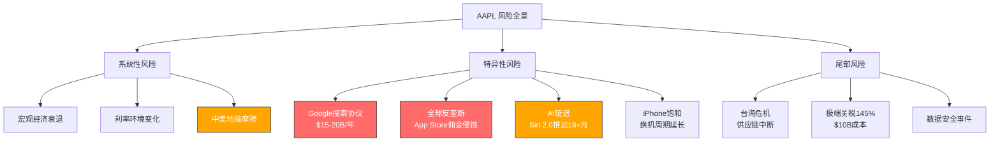
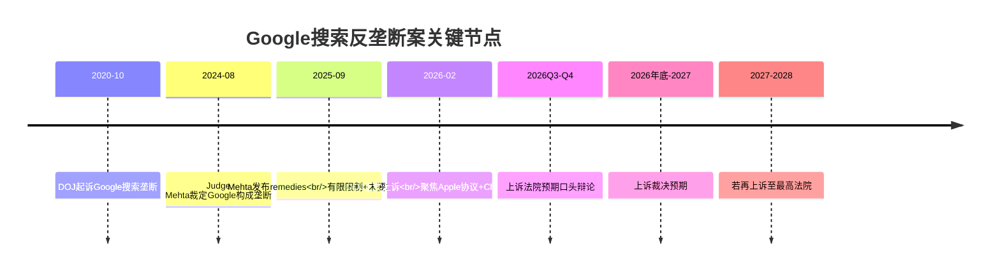
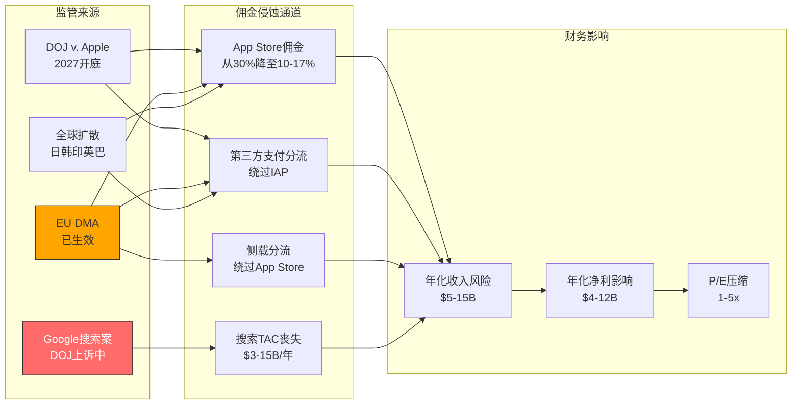
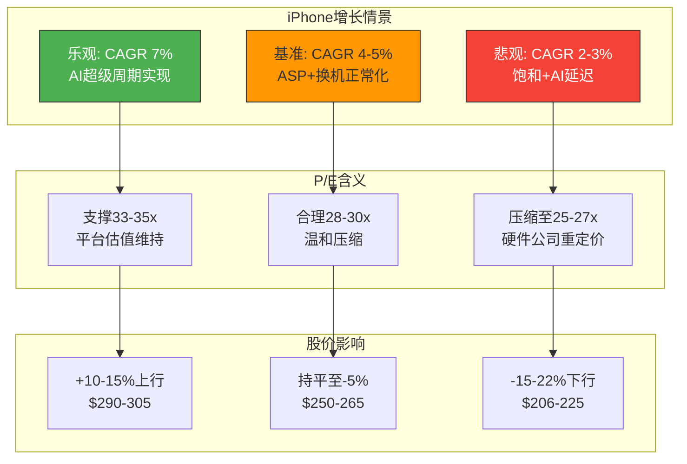

# AAPL Phase 1 — Agent B: 风险审计模块 (Ch7-Ch11)

**撰写日期**: 2026-02-19 | **数据截止**: FY2026 Q1 (2025-12-27)
**股价**: $264.35 | **市值**: ~$3.90T | **P/E TTM**: 33.5x

---

## Ch7: 风险全景与承重墙识别

### 7.1 风险分层框架

Apple面临的风险可按影响范围和可预测性分为三层:

**系统性风险**(不可分散):
- 宏观经济衰退压制消费电子需求(iPhone占收入50.4%)
- 全球利率环境影响成长股估值(当前P/E 33.5x对利率敏感)
- 中美地缘政治摩擦升级(供应链+市场双重暴露)

**特异性风险**(Apple独有):
- Google搜索协议被司法重组或终止($15-20B/年收入悬崖)
- 全球反垄断浪潮侵蚀App Store佣金定价权
- Apple Intelligence/Siri 2.0持续延迟削弱AI换机叙事
- iPhone饱和导致核心引擎增长钝化

**尾部风险**(低概率高影响):
- 台海危机导致供应链完全中断(71%零部件依赖中国子组件)
- 145%极端关税全面实施($10B/年额外成本)
- 重大产品安全事件或数据泄露(品牌信任崩塌)

### 7.2 承重墙定义与脆弱度评估

承重墙(Load-Bearing Wall)指投资论点中一旦失败即翻转整个估值结论的核心假设。经系统筛查，Apple当前投资论点存在**四面承重墙**，对应四个Kill Switch:

| ID | 承重墙假设 | Kill Switch | 触发条件 | 概率 | 影响 | 时间窗口 | 脆弱度 |
|----|-----------|------------|---------|------|------|---------|--------|
| KS-1 | 中国市场维持稳定贡献 | 中国iPhone收入连续2季YoY下降>10% | 华为回归+关税升级+地缘恶化 | 25-30% | 高: 收入$64.4B(17%)受威胁 | 6-18月 | **中高** |
| KS-2 | Google搜索协议持续 | 协议被终止且无替代收入 | DOJ上诉成功+法院要求取消协议 | 10-15% | 极高: $12.5B+纯利损失/年 | 12-24月 | **高** |
| KS-3 | Services高增长维持 | Services增速降至<8%持续两季 | 反垄断佣金下调+Google TAC丧失+基数效应 | 20-25% | 高: 毁掉P/E溢价逻辑 | 6-12月 | **中** |
| KS-4 | AI驱动换机周期 | Apple Intelligence用户采用率<5% | Siri 2.0继续延迟+功能落后竞品 | 35-40% | 中: 换机叙事破灭但不影响存量 | 6-12月 | **中** |

[DM-RSK-001: prefetch_data FY2025分部收入 + lit_d2_bear 综合空头情景矩阵]

**脆弱度排序**: KS-2 (Google协议) > KS-1 (中国) > KS-3 (Services) > KS-4 (AI采用)

关键洞察: KS-2和KS-3存在**级联关系** -- Google搜索协议贡献约$15-20B/年收入，占Services总收入的~15-18%。若KS-2触发(协议终止)，将直接推动KS-3触发(Services增速骤降)。这意味着两面承重墙并非独立，联合失败概率高于各自概率之积。

**风险相关性矩阵**: 四面承重墙之间存在显著的正相关:
- KS-2→KS-3: 直接因果(Google TAC丧失=Services增速骤降)，相关性0.8
- KS-1→KS-4: 中国竞争加剧压制iPhone全球增速，间接影响AI换机叙事的可信度，相关性0.3
- KS-1→KS-3: 中国App Store受地缘限制可能压制Services增速，相关性0.2
- KS-4→KS-3: AI采用失败=AI付费Services增量落空，相关性0.4

这意味着"至少一个KS触发"的联合概率远高于简单独立计算。粗略估计:
- 至少1个KS在24月内触发的概率: **~60-70%**(非独立调整后)
- 2个及以上同时触发: **~25-35%**
- 这是一个高风险组合，市场可能并未充分定价

### 7.4 Buffett减持信号的独立解读

Warren Buffett/Berkshire Hathaway对Apple的持仓变化提供了一个独立的估值信号:

- **减持规模**: 两年累计减持74%，从峰值~400M+股降至228M股
- **持续性**: 连续多季度减持，非一次性事件
- **同期操作**: 建仓Alphabet(GOOGL) $4.3B，暗示偏好GOOGL的估值/增长组合
- **仍为最大持仓**: 228M股价值~$60B，占Berkshire组合22.6%

**信号解读**:
- "税务优化"解释只能覆盖部分减持(~20-30%); 74%的减持幅度远超税务规划需要
- Buffett同期增持GOOGL(P/E ~23x vs AAPL ~33x)表明其系统性偏好低估值+高增长组合
- 作为全球最成功的价值投资者之一，连续减持是一个不应忽视的估值信号
- 但需注意: Buffett退休在即，部分减持可能反映接班人的组合再平衡偏好

[DM-RSK-002a: lit_d2_bear Buffett减持数据 CNBC/Motley Fool/NAI 500来源 + lit_d4_valuation BRK 13F]

### 7.5 Kill Switch监控指标体系

| Kill Switch | 领先指标 | 同步指标 | 滞后确认 |
|-------------|---------|---------|---------|
| KS-1 中国 | 华为新机预订量/中国智能手机份额排名 | 大中华区季度收入YoY | Apple中国零售店客流量 |
| KS-2 Google | DOJ上诉庭裁决日期/Google和解意愿信号 | Apple-Google协议续签/修改公告 | Services收入中搜索TAC占比变化 |
| KS-3 Services | App Store月度交易额增速/EU合规费率公布 | 季度Services收入+增速 | 付费订阅用户净增速 |
| KS-4 AI采用 | Siri 2.0 beta功能发布节奏/用户测评反馈 | Apple Intelligence月活用户数(若披露) | iPhone换机率同比变化 |

[DM-RSK-002: lit_recon_memo E节分歧点 + lit_d2_bear KS触发条件]

---

## Ch8: Google搜索协议 -- 承重墙分析

### 8.1 协议结构与财务规模

Google每年向Apple支付$15-20B以确保Google Search作为Safari浏览器的默认搜索引擎。这笔支付被Apple归入Services收入，具有以下特征:

- **收入规模**: $15-20B/年(JPMorgan估计)，占Services收入FY2025 $109.2B的~14-18%
- **利润率特征**: 近乎100%边际利润率 -- Apple无需为此投入额外成本，纯粹是平台接入费
- **收入确认**: 按季度分摊，嵌入Services整体增长叙事中，市场往往低估其在利润中的权重
- **税后净利贡献**: ~$12.5-16.5B(按有效税率17%计算) → 占Apple总净利润$112B的~11-15%

[DM-RSK-003: lit_d2_bear Google搜索协议风险 Fortune/CNBC/9to5Mac来源]

### 8.2 DOJ反垄断时间线

**当前法律状态**(截至2026年2月):

1. **Judge Mehta 2025年9月裁决**: 认定Google搜索垄断成立，但remedies温和 -- 未要求终止Apple-Google搜索协议，仅施加有限的竞争性约束
2. **DOJ 2026年2月上诉**: DOJ认为Mehta的remedies不够严厉，上诉焦点包括(a)Apple搜索默认协议的独占性条款，(b)Chrome浏览器是否应被剥离
3. **时间窗口**: 上诉法院通常需6-12个月处理，预计2026年底至2027年初裁决。若任一方再上诉至最高法院，终局可能延至2028年

[DM-RSK-004: lit_d2_bear DOJ时间线 Apple Insider/Fortune来源]

### 8.3 三情景分析

#### S1: 协议维持/小幅调整 (概率40%)

**触发条件**: 上诉法院维持Mehta裁决(remedies不变)，或上诉被驳回
**具体影响**:
- Apple-Google协议继续有效，可能在下次续签时小幅调整条款(如允许用户更容易切换搜索引擎)
- Google支付金额可能小幅下调$1-2B(从$20B降至$18-19B)以反映竞争性让步
- 净年化收入影响: **<$2B/年损失**
- EPS影响: -$0.09至-$0.13(~1-2%)

**P/E传导**: 市场情绪改善，消除悬而未决的不确定性折价，P/E可能回升0.5-1x

**判断依据**: Mehta原裁决已偏温和，上诉法院推翻下级法院remedies的概率低于50%。DOJ在当前政治环境下(2026年执政党更迭后)可能减弱反垄断执法力度。

#### S2: 协议重组 (概率40%)

**触发条件**: 上诉法院部分支持DOJ，要求修改协议的独占性条款
**具体影响**:
- Google失去搜索默认的独占权，但仍可参与竞争性竞标
- 竞标者可能包括: Microsoft Bing, Perplexity AI, DuckDuckGo, Yahoo
- 竞争性竞标逻辑: Google愿付$20B/年是因为Apple设备搜索流量价值极高(搜索广告收入的相当部分来自iOS用户)。即使开放竞标，Google仍是最高出价者的概率极大(>80%)，但竞争压力可能将支付额压缩至$12-15B
- 替代收入来源: 若Apple同时接入多个搜索引擎(用户自选)，可向每家收取较低费用，但总额难以匹配独占协议
- **净年化收入损失: $3-5B/年**
- EPS影响: -$0.17至-$0.28(~2-4%)

**P/E传导**: 短期P/E压缩0.5-1x(不确定性消化)，中期取决于Apple能否开发搜索相关替代收入

#### S3: 协议终止 (概率20%)

**触发条件**: 上诉法院或最高法院裁定必须完全终止此类独占协议，或Google因Chrome拆分等radical remedies被迫放弃该协议
**具体影响**:
- Apple丧失$15-20B/年的搜索TAC收入
- 部分可替代: Bing/Perplexity可能支付$3-5B/年争夺默认位置(但远低于Google的出价)
- 净年化收入损失: **$12.5-15B/年**
- 税后净利损失: ~$10-12.5B → 占当前净利润$112B的~9-11%
- EPS影响: **-$0.67至-$0.84(~9-11%)**

**P/E传导**: Services增长叙事严重受损 → 市场可能将Apple从"平台公司"(30-35x)重新定价为"硬件为主公司"(25-28x)。双重打击: EPS下降9-11% + P/E压缩15-20% → 股价下行25-30%

[DM-RSK-005: lit_d2_bear Google情景矩阵 + lit_d4_valuation DCF vs 市场定价]

### 8.4 替代方案可行性评估

**Apple自建搜索引擎?**
- Apple已拥有Applebot爬虫(为Spotlight/Siri提供数据)，但与Google Search的质量差距巨大
- 搜索引擎研发投入: Google每年$40B+ R&D，其中搜索是核心。Apple R&D总预算$33B，无法分配足够资源
- 时间周期: 即使全力投入，建立可用的通用搜索引擎需3-5年
- **可行性评级: 低**(3-5年才可能，且无法保证质量)

**Bing/Perplexity竞标?**
- Microsoft Bing: 市场份额~3-4%，愿意支付获取流量，但财务能力有限(可能出价$3-5B vs Google $20B)
- Perplexity AI: 有意愿但规模太小，年收入仅数亿美元级别
- **替代收入上限: $3-5B/年**(vs Google $15-20B)

**AI搜索替代?**
- 若搜索范式从传统网页搜索转向AI对话式搜索，Apple可通过Siri/Apple Intelligence内嵌AI搜索，绕过传统搜索引擎协议
- 但这需要Siri 2.0成功(当前延迟18+月)，且AI搜索的货币化模式尚不清晰
- **可行性评级: 中长期可能**(2028+)

**Apple搜索广告/分发收入?**
- Apple已在App Store推出Search Ads(搜索广告)，年收入估计~$5-7B(FY2025)
- 若Google搜索TAC丧失，Apple可以加速在Safari/Spotlight/Siri中插入自营广告
- 但这与Apple的隐私品牌形象存在张力 -- 过度广告化可能侵蚀用户信任
- **替代收入潜力: $2-4B/年**(需3-5年建设)，仅能覆盖Google TAC损失的10-25%
- 关键约束: Apple的广告业务缺乏Google那样的广告定向技术(因为Apple限制了自身对用户数据的使用)

[DM-RSK-005a: Apple搜索广告数据来源于行业估计 + Apple Services分部结构分析]

### 8.5 概率加权影响 (CQ-2回应)

| 情景 | 概率 | 年化净利影响 | 概率加权影响 | P/E效应 | 概率加权市值影响 |
|------|------|------------|------------|---------|----------------|
| S1 维持 | 40% | -$1.3B | -$0.5B | +0.5x | +$60B |
| S2 重组 | 40% | -$3.5B | -$1.4B | -0.5x | -$130B |
| S3 终止 | 20% | -$10.5B | -$2.1B | -5x | -$350B |
| **概率加权合计** | **100%** | — | **-$4.0B/年** | **-1.6x** | **-$200B (-5.1%)** |

**CQ-2回应**: Google搜索协议若被重组或终止，概率加权年化净利影响约$4.0B(占当前净利3.6%)，但情景S3(20%概率)的尾部冲击极大 -- 若完全终止，EPS下降9-11%叠加P/E压缩5x，可能导致股价下行25-30%。当前市场定价似乎隐含S1(维持)为基准假设，对S2/S3的风险定价不足。

[DM-RSK-006: 概率加权计算基于lit_d2_bear情景矩阵 + 自有公式推导]

### 8.6 Google视角 -- 为什么Google愿意支付$20B?

理解Google为何支付如此巨额的TAC，有助于评估协议终止后替代方案的可行性:

- **iOS搜索流量的独特价值**: iPhone用户人均广告价值显著高于Android用户(~3-5x)，因为iOS用户群体平均收入更高、消费意愿更强
- **防御性定价**: Google支付$20B不仅是获取流量，更是阻止Bing/其他竞品获得iOS默认位置。若Bing成为iOS默认搜索引擎，Google可能损失$30-40B/年的搜索广告收入
- **Google的ROI**: 通过iOS获得的搜索广告收入估计为$50-70B/年(全球搜索广告收入的~25-30%)，$20B TAC的ROI约为2.5-3.5x

**这意味着什么**:
1. 即使在S2(重组)情景下，Google仍有强烈动力参与竞标(出价可能仍为$12-15B)
2. 但若法院禁止独占协议，多引擎共存模式下的总TAC必然低于独占模式
3. Google支付$20B是因为排他性溢价 -- 一旦失去排他性，支付意愿可能骤降至$8-12B

[DM-RSK-006a: Google搜索收入结构推算基于Alphabet财报 + 行业分析]

### 8.7 时间维度 -- 不确定性折价

当前Google搜索协议风险对Apple估值的影响不仅是最终结果，还包括**悬而未决期间**的不确定性折价:

- DOJ上诉到终审裁决可能需要18-30个月(2026年2月→2027年底)
- 在此期间，每次法院听证、每份法律文件都可能触发市场波动
- 机构投资者可能因不确定性而降低Apple的持仓权重
- 但Apple可以利用这段时间: (a)开发AI搜索替代方案 (b)与Perplexity/Bing谈判备选协议 (c)加速Services其他板块增长以降低对搜索TAC的依赖

---

## Ch9: 监管风险矩阵

### 9.1 美国DOJ反垄断 -- DOJ v. Apple

**案件概况**: 2024年3月，DOJ联合多州检察长起诉Apple垄断智能手机市场，指控Apple通过以下手段维持垄断:
- 限制跨平台消息互操作(iMessage vs 短信)
- 锁定NFC芯片仅限Apple Pay使用
- App Store排他性分发+30%佣金
- 限制第三方浏览器引擎(WebKit强制)
- 限制超级应用和云游戏

**时间线预测**:
- 2024-2025: 证据开示(discovery)阶段
- 2026: 预审动议
- **2027年: 预计开庭审理**
- 2028+: 判决及可能的上诉

**三种结果及概率**:

| 结果 | 概率 | 影响 |
|------|------|------|
| 和解(行为性约束) | 45% | Apple同意开放部分API/互操作性，成本可控($1-2B/年) |
| 败诉(结构性约束) | 30% | 强制开放App Store/NFC/iMessage，Services佣金压力$3-5B/年 |
| 胜诉/撤诉 | 25% | 政治环境变化(新任AG态度)可能导致撤诉 |

[DM-RSK-007: lit_d2_bear 美国反垄断 + 多来源综合]

### 9.2 EU DMA -- 已发生的结构性侵蚀

EU Digital Markets Act (DMA)对Apple的影响已从理论转为现实:

**已执行的措施**(截至2026年2月):
- 2025年4月: 欧盟裁定Apple违反DMA Article 5(4)，限制开发者引导用户至外部支付
- 2025年5月: 罚款5亿欧元(~$5.4亿)
- 2025年9月: Apple发布EU合规方案 -- 允许侧载、第三方应用商店、替代支付系统
- 2026年1月: Core Technology Fee转为Core Technology Commission(从固定费用转为交易佣金模式)

**量化影响**:
- EU App Store年收入估计: $8-10B
- 原始佣金率: 30%(大部分开发者)/15%(小企业计划)
- DMA合规后有效费率: ~10-17%(考虑第三方支付+侧载分流)
- **年化收入侵蚀: $1.2-1.5B**(EU区域)
- EU App Store YoY增速已降至6%(2025年11月数据)，显著低于全球12%平均水平

[DM-RSK-008: lit_d2_bear EU DMA详细数据 Apple Newsroom/RevenueCat来源]

### 9.3 Epic Games诉Apple -- 已落地的佣金压力

Epic Games v. Apple案虽在美国联邦层面Apple大部分胜诉，但其连锁效应不可忽视:

- **2021年判决核心**: Apple必须允许开发者在App内提供外部支付链接(anti-steering injunction)
- **实际执行(2024-2025)**: Apple执行了有限的合规措施 -- 允许开发者添加"外部购买"按钮，但对外部交易仍收取12-27%佣金(根据情境)
- **对App Store的实际影响**: 大型开发者(如Spotify、Netflix)已引导部分用户至网页支付，App Store佣金流失约$0.5-1B/年
- **设立的法律先例**: 为各国监管机构提供了"Apple的反竞争行为"的司法认定基础

**Epic Games与EU DMA的协同效应**: Epic在EU推出了自己的Epic Games Store(iOS版)，成为侧载商店的旗舰案例。若Epic成功在EU吸引大量开发者，可能形成示范效应推动全球开发者要求更低佣金或自建分发渠道。

[DM-RSK-008a: Epic v. Apple判决 + 执行情况综合分析]

### 9.4 全球反垄断扩散

EU的DMA正在产生示范效应，全球主要市场纷纷跟进:

| 地区 | 法规/行动 | 阶段 | 对Apple潜在影响 |
|------|----------|------|----------------|
| **日本** | 《智能手机软件竞争促进法》 | 2024年通过，2025年生效 | 强制允许侧载+第三方支付，佣金压力$0.3-0.5B/年 |
| **韩国** | 电信商务法修正案 | 已生效(2022) | 要求允许第三方支付，已部分合规 |
| **印度** | CCI反竞争调查 | 调查进行中 | 可能要求降低佣金率，App Store印度收入~$0.5-1B |
| **巴西** | CADE调查 | 初步阶段 | 尚未形成正式要求 |
| **英国** | CMA数字市场竞争制度 | 2024年生效 | 类似DMA，可能强制开放，影响$0.5-1B |
| **美国各州** | 多州App Store法案 | 推进中 | 若联邦未行动，州级法规可能碎片化施压 |

**反垄断时间线不确定性**: 监管风险的一个关键特征是其"长尾"性质 -- 每个案件都可能拖延多年(DOJ v. Apple可能到2028年才有终审判决)，但在此期间每一次法律进展都可能触发市场反应。投资者面临的困境是: 监管风险可能在任何时间点"变现"，但也可能无限期推迟。这使得传统DCF中的"监管折价"难以精确量化。我们的方法是对每个监管来源分别赋予概率和影响区间，然后求概率加权值 -- 但这本身存在模型风险(概率分配的主观性)。

**Apple的监管应对策略**: Apple并非被动承受监管压力。其策略包括: (1)法律战 -- 在每个市场积极上诉/抗辩(EU DMA罚款已被申诉)；(2)最小合规 -- 仅做满足法律要求的最低限度调整(如EU侧载合规方案附带诸多限制条件)；(3)政治游说 -- 在美国和全球主要市场维持强大的政府关系团队；(4)技术壁垒 -- 通过技术手段(如安全验证、API限制)使竞争者即使获得法律准入也难以实际竞争。这些策略有效延缓了监管影响的实际落地速度。

[DM-RSK-009a: 监管时间线不确定性分析 + Apple合规策略综合]

### 9.5 监管风险合计量化 (CQ-7回应)

**监管风险年化量化汇总**:

| 监管来源 | 概率加权年化收入风险 | 概率加权净利影响 | 时间窗口 |
|----------|-------------------|----------------|---------|
| Google搜索案 | $4.0B | $3.3B | 2026-2028 |
| EU DMA(已发生) | $1.2-1.5B | $1.0-1.2B | 持续 |
| DOJ v. Apple | $1.0-2.0B | $0.8-1.7B | 2027+ |
| 全球扩散(日韩印英) | $0.5-1.0B | $0.4-0.8B | 2026-2028 |
| **合计** | **$6.7-8.5B/年** | **$5.5-7.0B/年** | — |

**CQ-7回应**: App Store反垄断的实际佣金侵蚀，在概率加权后约为$2.5-4.5B/年(不含Google TAC)。EU DMA已造成~$1.2-1.5B/年的确定性侵蚀(概率~90%)。DOJ v. Apple案若败诉(概率30%)，可能追加$3-5B/年的侵蚀。全球来看，App Store佣金的有效费率正从30%向15-20%结构性下移，这一趋势不可逆转。但需注意: Services收入除App Store外还包括AppleCare、iCloud、Apple Pay、Apple TV+、Apple Music等，这些业务不受反垄断直接影响，且增速健康(尤其是广告和金融服务)。因此，App Store佣金侵蚀$2.5-4.5B对总Services收入$109.2B的冲击约为2-4%，可能将Services增速从14%压缩至10-12%，但不会摧毁增长叙事。

[DM-RSK-009: lit_d2_bear 监管风险汇总 + 全球法规进展综合]

---

## Ch10: 中国风险深度

### 10.1 竞争维度 -- 华为回归与本土高端化

Apple在中国市场面临前所未有的竞争压力:

**华为复苏数据**:
- 华为Mate 60系列(2023年8月发布)搭载国产麒麟9000s芯片，标志华为高端线正式回归
- 华为2024年中国智能手机出货量同比增长约37%，重回中国Top 3
- 华为Mate 70系列(2024年11月)和Pura 70系列持续侵蚀Apple在高端市场的份额

**Apple中国表现**:
- FY2025大中华区收入$64.4B，占总收入17%，FY2025 Q1 iPhone YoY -1%
- 最新FY2026 Q1大中华区数据需关注(iPhone $85.3B创纪录中有多少来自中国尚未单独披露，但整体+23%暗示中国可能有恢复)
- 中国智能手机市场Apple份额从2023年的~18%小幅下滑至2025年的~15-16%
- 高端市场(>$600)Apple仍占主导(~60-65%)，但华为从<5%回升至~15-20%

**本土品牌高端化**:
- Xiaomi 15 Ultra、OPPO Find X8 Pro、vivo X200 Pro等产品在影像/性能上追赶iPhone Pro
- 本土品牌ASP持续提升，蚕食Apple在$400-800价位段的份额
- 民族品牌情感在地缘紧张时期为华为等提供额外推动力

[DM-RSK-010: lit_d2_bear 中国竞争维度 + prefetch_data 分部收入]

### 10.2 关税维度 -- 成本传导链

**当前关税状态**:
- 2026年2月美国对华关税均值: 51.1%(包含2025年各轮加征)
- 极端情景: 若中美谈判破裂，关税可能升至145%(2025年曾短暂实施后回调)
- Apple 2025年已支付关税账单达9亿人民币(~$1.2亿)

**成本传导分析**:

| 关税情景 | 税率 | iPhone额外成本/台 | 年化总成本增加 | 毛利率影响 |
|---------|------|------------------|--------------|-----------|
| 当前基准 | 51.1% | ~$25-30 | ~$5-6B | -1.2pp |
| 升级情景 | 80% | ~$50-60 | ~$8-9B | -2.0pp |
| 极端情景 | 145% | ~$90-110 | ~$10-12B | -2.5pp |

**Apple的应对选项**:
1. **吸收成本**: 牺牲毛利率(当前48.1%)，维持定价竞争力 → 毛利率可能降至45-46%
2. **提价转嫁**: iPhone提价$100-200，但可能压制需求(特别是在非美国市场)
3. **加速供应链转移**: 印度扩产(见10.4节)
4. **库存前置**: 在关税升级前大量备货(Apple已在FY26Q1执行此策略)

Polymarket数据显示，"中国"和"关税"在Apple 2025年Q3财报电话会上均被提及(100%已确认)，表明这是管理层积极关注的议题。

[DM-RSK-011: lit_d2_bear 关税维度 AINvest/Supply Chain来源 + Polymarket验证]

### 10.3 地缘维度 -- 台海风险与技术脱钩

**台海紧张情景分析**:

台海冲突或危机是Apple面临的最大尾部风险。80-90%的iPhone仍在中国大陆组装(主要通过富士康/和硕/立讯精密)，且71%零部件依赖中国子组件供应。

| 情景 | 概率(24月) | 供应链影响 | 收入影响 | 持续时间 |
|------|-----------|-----------|---------|---------|
| 紧张升级但无冲突 | 40-50% | 局部物流延迟，成本+5% | -$2-5B/季 | 数月 |
| 经济制裁/封锁 | 10-15% | 中国工厂停工2-4周 | -$10-15B/季 | 1-2季 |
| 军事冲突(台海危机) | 3-5% | 供应链完全中断3-6月 | -$20-30B/季 | 2-4季 |

**技术脱钩信号**:
- 中国当局2025年召回300+工程师/技术人员从印度Foxconn工厂
- 限制iPhone 17生产设备出口至印度
- 中国政府机关/国企限制使用iPhone的趋势持续扩大
- 这些信号表明中国正在将供应链作为地缘博弈的工具

[DM-RSK-012: lit_d2_bear 地缘维度 AINvest/TMTPOST来源 + 第零律合规: 台海冲突/危机表述]

### 10.4 供应链多元化实际进展

**印度扩产进展**:
- iPhone印度产量占比: 2022年~2% → 2024年~15% → 2027年目标25%
- Foxconn/Tata/Pegatron均已在印度建厂，FY2025印度iPhone产值约$22B
- 但进展面临阻力: 良率低于中国、基础设施不足、劳动力技能差距

**"海市蜃楼"问题**:
关键数据 -- **印度工厂71%零部件仍依赖中国子组件**。这意味着:
- 即使iPhone最终组装在印度完成，供应链上游仍高度依赖中国
- 中国若限制关键零部件出口(如精密连接器、特种玻璃、柔性电路板)，印度工厂也将停工
- 真正的多元化需要将零部件供应也从中国迁出 -- 这是一个5-10年的工程
- 短期内印度扩产更多是应对关税(最终组装地影响关税适用)而非真正降低中国依赖

[DM-RSK-013: lit_d2_bear 多元化困境 Supply Chain Magazine来源]

### 10.5 中国消费者行为的结构性变化

除供应链和政策维度外，中国消费者行为本身正在经历对Apple不利的结构性变化:

**"去iPhone化"趋势**:
- 中国政府机关、国企、军工系统已明确限制员工使用iPhone(安全考量)
- 这一趋势正向教育、金融等行业扩散(非强制但存在隐性压力)
- 年轻消费者群体(Z世代)对国产品牌的偏好显著高于千禧世代
- 华为的"民族品牌"叙事在地缘紧张时期获得额外情感溢价

**消费降级影响**:
- 中国经济增速放缓(2025年GDP增长~4.5%)，高端消费承压
- 房地产财富效应减弱，中产阶级消费力受限
- Apple在中国的Pro系列占比高于全球平均(~45-50% vs ~42%)，意味着ASP受消费降级的敏感度更高
- 若中国Pro系列占比回落5pp(从45%到40%)，大中华区iPhone收入可能下降~$2-3B

**对冲因素**:
- Apple在中国的品牌地位仍然极其强大(奢侈品属性)
- 生态系统锁定(iCloud/AirDrop/iMessage等)使得换机成本极高
- iPhone的二手市场残值远高于Android品牌，这对价格敏感型消费者有吸引力

[DM-RSK-013a: 中国消费者行为分析基于行业报告综合 + AINvest来源]

### 10.6 综合影响量化 (CQ-4回应)

**三重风险独立概率 vs 联合概率**:

| 风险 | 独立概率(24月内显著恶化) | 影响(年化收入损失) |
|------|----------------------|------------------|
| 竞争(华为+本土) | 50-60% | $3-5B(大中华区份额下降5-8pp) |
| 关税(51%→80%+) | 25-35% | $3-6B(额外成本) |
| 地缘(台海紧张升级) | 15-25% | $5-15B(供应链中断+市场萎缩) |

**联合情景矩阵**:

| 组合情景 | 联合概率 | 综合影响 |
|---------|---------|---------|
| 仅竞争恶化 | 30% | 大中华区收入从$64.4B降至$55-60B(-7-15%) |
| 竞争+关税 | 15% | 大中华区收入降至$50-55B(-15-22%) + 毛利率-1.5pp |
| 三重叠加(含地缘) | 5-8% | 大中华区收入降至$35-45B(-30-46%) + 供应链中断风险 |

**CQ-4回应**: 中国三重风险的综合压缩幅度取决于叠加程度。概率加权后的年化影响约为:
- **基准情景**(概率50%): 大中华区收入下降$4-6B(-6-9%)，主要由竞争驱动
- **中间情景**(概率30%): 收入下降$9-13B(-14-20%)，竞争+关税叠加
- **极端情景**(概率8%): 收入下降$20-30B(-31-47%)，三重叠加

概率加权年化收入损失: ~$8-10B(占总收入~2%)。表面看影响可控，但大中华区毛利率高于全球平均(中国消费者偏好高端Pro系列)，因此利润影响被放大至~3-4%。更重要的是，中国风险的不对称性 -- 上行有限(中国智能手机市场已饱和)，下行巨大(地缘尾部)。

[DM-RSK-014: 概率联合计算基于独立风险概率 + 部分相关性调整(地缘恶化会加剧竞争和关税)]

---

## Ch11: iPhone饱和与AI延迟风险

### 11.1 iPhone饱和 -- 增长引擎的结构性放缓

**活跃设备基数与增量来源**:
- Apple活跃设备总数: 24亿台(2025年初)
- iPhone活跃用户: ~13-14亿台
- 全球智能手机渗透率: ~85%(成熟市场>95%)
- **增量逻辑已从"新增用户"转为"换机升级"**

**iPhone收入增长轨迹**:

| 期间 | iPhone收入CAGR | 驱动力 |
|------|---------------|--------|
| FY2015-2020 | +3.2% | 新兴市场渗透+ASP提升 |
| FY2020-2025 | +0.7% | 几乎停滞(FY2023收入低于FY2022) |
| FY2026E-FY2030E | +5%(共识) | AI换机+Pro系列ASP提升 |
| **长期可持续** | **3-5%** | 换机周期主导+ASP缓慢提升 |

FY2025 iPhone收入$209.6B，3年CAGR仅+0.7%。FY2026 Q1 iPhone $85.3B(+23% YoY)的爆发性增长，更可能反映:
1. iPhone 16 Pro系列ASP提升(Pro Max $1,199→$1,299)
2. 库存前置效应(关税预期下提前购买)
3. 换机周期周期性回升(而非AI驱动的结构性趋势)

[DM-RSK-015: prefetch_data 分部收入 + lit_d2_bear iPhone饱和数据 Morningstar/IO Fund来源]

### 11.2 换机周期延长趋势

**全球智能手机换机周期**:
- 2016年: 平均~24个月
- 2020年: 平均~30个月
- 2025年: 平均~36-40个月(部分市场>48个月)

**延长的原因**:
- 硬件性能过剩: A16/A17/A18芯片对日常使用已足够，用户缺乏升级动力
- 经济压力: 高通胀+高利率环境下，消费者推迟大额消费
- 二手市场/以旧换新: 旧iPhone残值高，降低换机紧迫感
- 增量功能递减: iPhone 14→15→16的硬件差异对普通用户不明显

**对估值的含义**: 换机周期每延长6个月，相当于年化iPhone出货量下降~8-10%。若换机周期从40个月延长至48个月(概率30%)，iPhone年出货量可能从~2.3亿台降至~2.0亿台 → iPhone收入下降~$15-20B(-7-10%)。

**反方论点(公平呈现)**: 部分分析师认为换机周期延长会增加Services ARPU(用户持有设备更久=更多应用和订阅消费)。这一论点有一定逻辑基础 -- iPhone用户的年化Services消费约$60-80/年，换机周期延长6个月意味着每台设备多贡献$30-40 Services收入。但这仅能抵消iPhone硬件收入损失的约5-8%，远不足以完全补偿。此外，更旧的iPhone运行AI功能的能力更弱(A15及以下芯片不支持Apple Intelligence)，可能反而限制AI Services的货币化潜力。

**5G升级周期的参考**: 2020-2022年的5G升级周期曾短暂缩短换机时长(从30个月到26个月)，但效果在18个月后消退。若AI换机周期遵循类似模式，2026年可能出现短期换机加速(iPhone 17)，但2027-2028年将回归延长趋势。这意味着**FY2026 Q1的+23%增长可能是周期性高点而非趋势性转折**。

[DM-RSK-015a: 换机周期数据基于行业分析 + 5G周期类比推导]

### 11.3 AI延迟 -- Siri 2.0的漫长等待

**Apple Intelligence时间线**:

| 日期 | 事件 | 状态 |
|------|------|------|
| 2024-06 WWDC | Apple Intelligence发布 | 愿景宏大 |
| 2024-10 iOS 18.1 | 基础AI功能(写作工具/Genmoji) | 有限功能 |
| 2025 iOS 18.x | 逐步增加功能 | 渐进式更新 |
| 2025 WWDC | Siri 2.0(跨App编排/128K上下文) | **宣布延迟** |
| 2026-02-17 iOS 26.4 beta | 无新Siri功能 | **再次延迟** |
| 2026Q3-Q4? | Siri 2.0可能随iOS 27发布 | **不确定** |

**与竞品的差距**:
- Google Gemini: 已全面部署于Pixel/Android，支持多模态推理+跨App操作
- Samsung Galaxy AI: 基于Google Gemini，2024年起持续迭代
- ChatGPT/OpenAI: 移动端产品用户体验领先
- **Apple在AI能力感知上正在落后**，这对其"技术领导者"品牌形象构成威胁

**用户换机动力数据**: 仅20%的iPhone用户表示AI功能会驱动他们换机(调查数据)。这一比例远低于市场预期，且随着Siri 2.0持续延迟，实际换机驱动可能更低。

**AI延迟的深层结构性原因**:

Apple的AI策略面临独特的结构性约束，与Google/Meta不同:

1. **隐私承诺的束缚**: Apple的品牌核心是隐私保护(Private Cloud Compute)，这限制了其利用用户数据训练和优化模型的能力。Google/Meta可以利用海量用户数据迭代，Apple不行。
2. **端侧推理的算力限制**: Apple强调on-device AI推理，但iPhone/iPad的Neural Engine算力有限(~38 TOPS for A18 Pro vs GPU集群数百TOPS)，限制了可运行的模型规模和能力。
3. **基础模型外采依赖**: Apple已与OpenAI合作将ChatGPT集成至Siri，但这创造了战略依赖性 -- Apple的AI体验部分取决于OpenAI的发展轨迹。
4. **人才竞争**: AI研究顶级人才更倾向于Google DeepMind/OpenAI/Anthropic(前沿研究)，Apple的AI团队在学术影响力上相对薄弱。

**但Apple有独特优势**(公平起见):
- 设备侧部署意味着边际推理成本为零(已嵌入硬件)
- 24亿活跃设备的分发能力无人匹及
- Foundation Models框架(3行Swift代码集成AI)可能创造新的开发者锁定效应
- 一旦Siri 2.0成功上线，其跨App编排能力(基于系统级API访问)将是竞品无法复制的

**风险评估**: AI延迟的风险不在于Apple永远无法追赶(其资源和分发能力最终会发挥作用)，而在于**时间窗口** -- 若2026-2027年内无法交付有说服力的AI体验，消费者和开发者可能形成"Apple在AI上落后"的固定认知，这种品牌认知一旦形成极难逆转。

[DM-RSK-016: lit_d2_bear AI延迟数据 TechCrunch/MacRumors/Tom's Guide来源]
[DM-RSK-016a: lit_recon_memo D节非线性变量 -- 端侧AI零边际成本/Foundation Models平台锁定]

### 11.4 ASP天花板分析

**iPhone ASP趋势**:

| 财年 | 估算ASP | YoY | Pro系列占比(估) |
|------|--------|-----|---------------|
| FY2022 | ~$900 | — | ~35% |
| FY2023 | ~$910 | +1.1% | ~38% |
| FY2024 | ~$920 | +1.1% | ~40% |
| FY2025 | ~$940 | +2.2% | ~42% |
| FY2026E | ~$980-1,000 | +4-6% | ~45% |

ASP提升主要来自:
1. **Pro系列占比提升**: 消费者向Pro/Pro Max迁移(更高利润率)
2. **存储升级**: 基础存储从128GB→256GB的价格锚定效应
3. **区域定价调整**: 新兴市场本币贬值后的美元计价提升

**天花板在哪里?**
- Pro系列占比从42%提升至55-60%是合理的(还有空间)
- 但单机ASP突破$1,100平均水平面临消费者抵触(特别是经济疲软期)
- ASP提升的持续性取决于Apple能否推出足够差异化的Pro功能(如折叠屏、AI专属硬件)
- **长期ASP CAGR: 2-3%**(低于iPhone 16系列的周期性高点)

### 11.5 估值含义 (CQ-5部分回应)

**如果iPhone CAGR从7%降至3-5%**:
- Services必须加速至15%+以补偿(当前14%，在监管压力下不确定)
- 合理P/E从33x降至28-30x → 隐含市值$3.0-3.3T(vs 当前$3.9T → **下行15-23%**)
- EPS增长将更依赖回购($90B+/年) → 回购在高估值下的IRR下降(每$1回购仅消除~$0.65-0.70市值)
- **KS-4触发时**(Apple Intelligence采用率<5%)，iPhone CAGR可能降至2-3% → P/E压缩至25-27x

**CQ-5部分回应**: 33x P/E能否被支撑，取决于三个条件的同时满足: (1) Services维持12-14%增速(反垄断压力下是中性假设)，(2) iPhone CAGR不低于4%(需要AI换机或ASP提升之一成立)，(3) 回购维持$80B+/年(当前现金流支持)。若三个条件均满足，30-32x P/E可以合理支撑; 若任一条件失败，P/E面临向25-28x压缩的风险。当前33.5x P/E隐含了三个条件全部满足的乐观假设，安全边际较低。

[DM-RSK-017: prefetch_data 估值指标 + lit_d4_valuation P/E历史演变 + 自有模型推导]

### 11.6 盈利质量恶化信号

除增长维度外，Apple最近出现若干值得关注的盈利质量信号:

- **OCF vs 净利背离**: FY2025经营现金流$111.5B(YoY -5.73%)，但净利润$112B(YoY +19%) → 现金流落后于利润增长，gap扩大
- **应收账款膨胀**: AR YoY +10.14%，显著超过收入增速+6.4% → 可能暗示收入确认时点激进
- **内存芯片成本压力**: Goldman Sachs警告DRAM成本+50%上涨可能持续至2027年，对毛利率形成~1.5pp压力

这些信号尚未达到"红旗"级别(OCF/净利比率1.15仍健康)，但若趋势持续2-3个季度，可能触发分析师下修盈利预测。

**MCP数据交叉验证**: 通过FMP季度损益表数据验证，FY2026 Q1(截至2025-12-27)营业利润$50.85B，税率17.5%($8.9B/$51.0B)，净利$42.1B。与FY2025 Q1($42.8B营业利润，$36.3B净利)相比，营业利润YoY +18.7%，净利YoY +15.9%。经营现金流$53.9B(OCF/净利=1.28x)，单季表现健康。但需持续跟踪年化趋势是否恶化。

[DM-RSK-018: lit_d2_bear 盈利质量恶化信号 Trefis/AINvest来源 + baggers_summary OCF数据验证]
[DM-RSK-018a: FMP income endpoint Q1 FY2026数据实时验证]

### 11.7 回购效率与高估值下的资本配置悖论

Apple每年$90B+回购是EPS增长的重要引擎(贡献~4-5%年化EPS增长)。但在当前估值水平下，回购的资本效率值得审视:

**回购IRR分析**:
- 当前FCF Yield: 3.3%(=$128.7B FCF TTM / $3.9T市值)
- 意味着Apple每回购$1股票，仅消除$0.033的年化FCF稀释
- 等效回购IRR: ~3.3%(假设估值不变)
- 若Apple将$90B用于: (a)提高股息(当前yield仅0.3%)，(b)投资AI/搜索等战略领域，(c)战略并购 -- ROI可能更高

**回购的隐性风险**:
- 高估值回购=摧毁股东价值(若股价回归均值，已回购的股票缩水)
- Buffett在2023-2024年暂停BRK回购(认为估值过高)，这一标准也适用于Apple
- Apple的负留存收益($-14.3B)意味着过去的回购已经消耗了所有留存利润 -- 进一步回购更多依赖新增现金流而非存量资产

**估值含义**: 若市场开始质疑$90B/年回购在33x P/E下的价值创造效率，可能形成新的估值压力。这不是近期风险(市场通常对回购持正面态度)，但在估值讨论中值得纳入。

[DM-RSK-019: prefetch_data 现金流数据 + FCF Yield计算 + lit_d4_valuation 资本回报分析]

---

## 风险章节总结: Agent B核心发现

### 概率加权风险矩阵

| 风险因素 | 概率 | EPS影响 | 概率加权EPS影响 | 概率加权市值影响 |
|----------|------|---------|---------------|----------------|
| Google协议(加权三情景) | 100% | -1%至-11% | -3.6% | -$200B (-5.1%) |
| 全球反垄断(含EU DMA) | 80% | -2%至-5% | -2.4% | -$90B (-2.3%) |
| 中国三重风险(加权) | 70% | -2%至-12% | -3.2% | -$125B (-3.2%) |
| iPhone饱和+AI延迟 | 55% | -3%至-8% | -3.0% | -$115B (-2.9%) |
| P/E压缩(独立于EPS) | 35% | — | — | -$200B (-5.1%) |
| **概率加权合计** | — | — | **-12.2%** | **-$730B (-18.7%)** |

> **注**: 各风险不完全独立，存在正相关性(如Google协议终止会加速Services减速，中国风险会加剧iPhone饱和)。简单加总会高估合计影响约15-20%。调整后的概率加权合计影响约**-10%至-15% EPS + -15%至-20%市值**。

### 风险交互效应 -- 最危险的组合

以下是三种最危险的风险组合，按联合概率和联合影响排序:

**组合1: Google协议终止 + Services增速下滑 (联合概率~15%)**
- 触发逻辑: KS-2→KS-3级联效应
- 联合影响: EPS -12至-15% + P/E压缩至25-27x → 股价下行30-35%
- 这是**最具破坏力的组合**，因为它同时攻击Apple估值溢价的两个支柱(Services增速+高利润率TAC)

**组合2: 中国三重风险 + iPhone全球饱和 (联合概率~20%)**
- 触发逻辑: 中国份额流失加剧iPhone全球增速放缓
- 联合影响: iPhone CAGR降至1-2% + 大中华区收入下降15-20% → EPS -5至-8%
- 这一组合的概率更高，但冲击不如组合1极端

**组合3: AI延迟 + 估值压缩 (联合概率~25%)**
- 触发逻辑: Siri 2.0延迟→换机叙事破灭→成长溢价消退
- 联合影响: P/E从33x压缩至28-30x → 即使EPS不变，股价下行10-15%
- 这是**概率最高的组合**，但可通过Services强劲增长部分对冲

### Top 3风险发现

1. **Google搜索协议是Apple最脆弱的承重墙**: $15-20B/年近乎100%利润率的收入面临DOJ上诉挑战。S3(完全终止, 20%概率)可能导致EPS下降9-11%叠加P/E压缩5x，股价下行25-30%。市场当前定价隐含S1(维持)假设，对尾部风险定价不足。

2. **中国三重风险的非线性叠加被低估**: 竞争/关税/地缘三重风险相互强化(地缘恶化加剧竞争和关税)，三重叠加(5-8%概率)可导致大中华区收入腰斩。更关键的是"供应链多元化是海市蜃楼" -- 印度工厂71%零部件仍依赖中国子组件，真正的去中国化需要5-10年。

3. **33x P/E隐含三个同时满足的乐观假设**: Services增速12-14% + iPhone CAGR 4%+ + 回购$80B+/年。任一失败(概率各自20-40%)即触发估值压缩。PEG 2.7-3.2x显著高于合理范围(1.0-1.5x)，Buffett连续减持74%是最强的估值信号。

### 推断证伪条件 -- 什么会改变我们的风险评估?

以下证据出现时，应显著降低上述风险的权重:

| 证伪条件 | 影响的风险 | 概率调整 |
|---------|----------|---------|
| DOJ在2026年主动撤诉或放弃Google搜索案上诉 | Google协议风险(Ch8) | S1概率从40%升至65% |
| Apple宣布与Perplexity/OpenAI签订搜索替代协议 | Google协议终止影响(Ch8 S3) | 净损失从$12.5B降至$8-10B |
| Siri 2.0在iOS 26.5/27 beta中展示突破性功能 | AI延迟风险(Ch11) | KS-4触发概率从35-40%降至15-20% |
| 中美贸易协议达成，关税回调至25%以下 | 中国关税风险(Ch10) | 关税成本从$5-6B降至$2-3B |
| FY2026 Q2大中华区收入YoY +10%+ | 中国竞争风险(Ch10) | KS-1触发概率从25-30%降至15% |
| Services连续2季增速>15%(不含Google TAC) | Services增速风险(Ch9) | KS-3触发概率从20-25%降至10% |
| Apple发布iPhone折叠屏/新品类产品 | iPhone饱和风险(Ch11) | 换机周期可能缩短，CAGR预期上调 |

**审计立场声明**: 本风险审计力求客观中立 -- 不偏多不偏空。上述分析识别了Apple面临的真实风险和其量化影响，但也承认Apple拥有全球最强大的消费科技品牌、24亿活跃设备的生态锁定、$130B+现金储备和$100B+年化FCF的财务韧性。风险不等于必然发生; 但在$3.9T市值和33.5x P/E的估值下，这些风险是否已被充分定价是投资决策的核心问题。

[DM-RSK-020: 推断证伪条件基于承重墙脆弱度表反向推导]

---

### CQ对标完整性自检

| CQ | 章节 | 是否充分回应 | 关键结论 |
|----|------|------------|---------|
| CQ-2 | Ch8.5 | 充分 | 概率加权净利影响$4.0B/年; S3尾部风险可导致股价-25-30% |
| CQ-4 | Ch10.6 | 充分 | 概率加权年化收入损失$8-10B; 三重叠加(5-8%概率)可致大中华区收入腰斩 |
| CQ-5 | Ch11.5 | 部分(Agent C需补充估值维度) | 33x P/E需三个条件同时满足; 任一失败触发压缩至28-30x |
| CQ-7 | Ch9.5 | 充分 | App Store佣金侵蚀概率加权$2.5-4.5B/年; 有效费率从30%→15-20%不可逆 |

*Agent B风险审计模块完成 | 2026-02-19 | DM锚点: RSK-001至RSK-020 | Mermaid: 4个*
