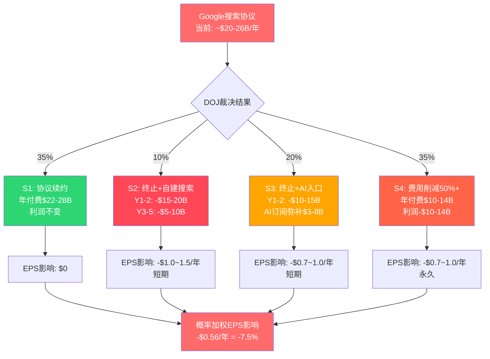
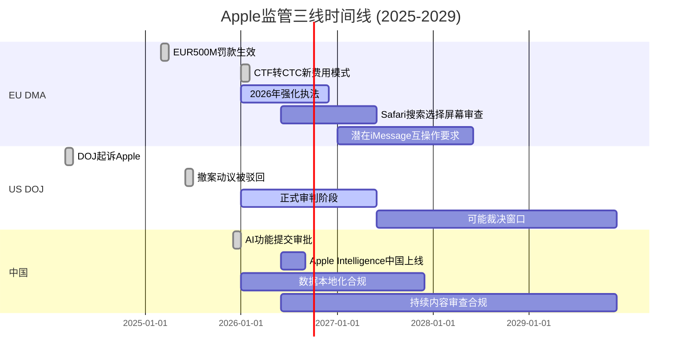
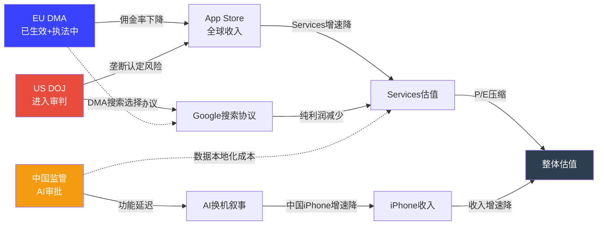
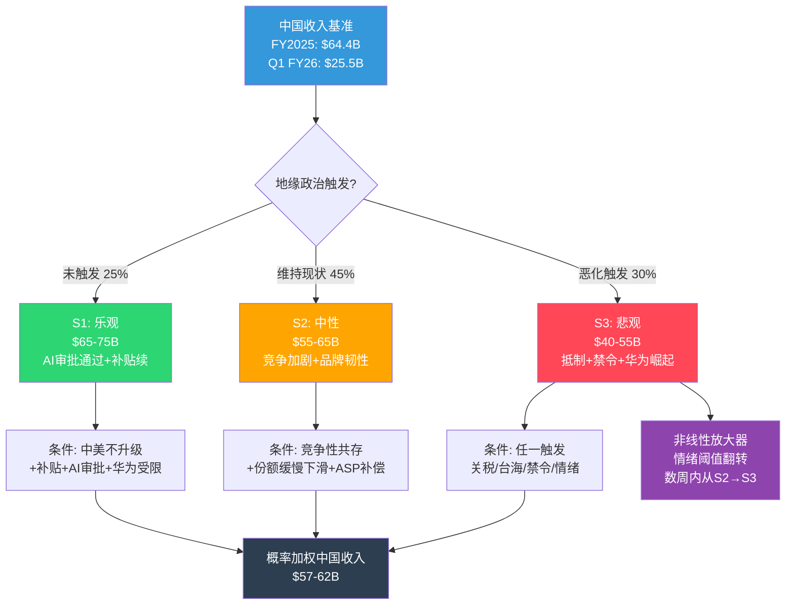
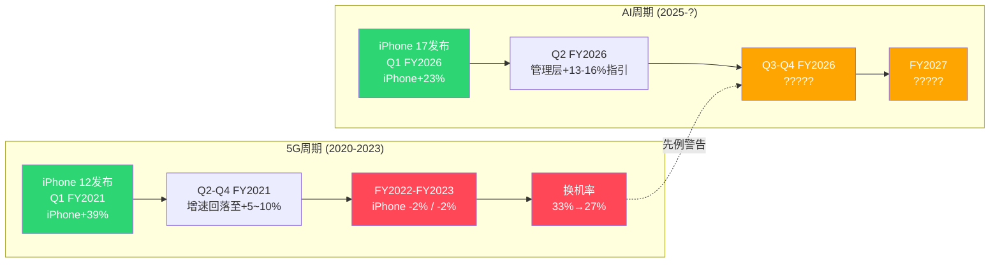

# AAPL 独立风险审计 (Ch7-Ch11)

> **身份**: 独立风险审计员 | **日期**: 2026-02-19
> **数据截止**: Q1 FY2026 (2025-12-27) | **股价**: $264.35 | **市值**: $3.82T
> **DM锚点前缀**: DM-RSK / DM-GEO / DM-REG

---

## Ch7: 风险全景

> **摘要**: Apple面临8大风险的非线性系统,其中3组风险存在协同放大效应。Google搜索协议是唯一满足"高概率+高影响+多维度关联"的风险;中国三重风险是最大非线性放大器。风险矩阵显示5项位于"高关注区"(概率>25%且影响>$15B)。独立风险仅占3/8——多数风险相互连接,构成风险网络而非风险清单。

### 7.1 风险矩阵: 概率-影响排序

以下矩阵按"概率 x 年化收入/利润影响"排序Apple全部核心风险。概率基于预测市场数据、监管进展和历史先例综合评估。

| 排序 | 风险ID | 风险名称 | 概率(2Y) | 年化影响($B) | 影响维度 | 风险类型 | DM锚点 |
|:----:|:------:|----------|:--------:|:-----------:|----------|----------|--------|
| 1 | R-1 | Google搜索协议重构 | 45-55% | $10-26B收入 | Services利润+AI战略 | 制度性 | [DM-RSK-001] |
| 2 | R-2 | 中国三重风险(地缘+竞争+监管) | 35-50% | $10-25B收入 | 收入+供应链+品牌 | 地缘+结构 | [DM-RSK-002] |
| 3 | R-3 | iPhone换机周期未达预期 | 30-40% | $15-30B收入 | 硬件收入+估值倍数 | 结构性 | [DM-RSK-003] |
| 4 | R-4 | App Store佣金结构性侵蚀 | 60-70% | $5-12B收入 | Services增速+利润率 | 制度性 | [DM-RSK-004] |
| 5 | R-5 | 估值倍数压缩(P/E均值回归) | 25-35% | $0(市值-15~30%) | 股东回报 | 周期性 | [DM-RSK-005] |
| 6 | R-6 | 供应链集中度(TSMC单一来源) | 5-15% | $50-80B收入 | 全产品线 | 地缘+结构 | [DM-RSK-006] |
| 7 | R-7 | 关税与贸易摩擦升级 | 20-30% | $3-8B利润 | 毛利率+定价 | 制度性 | [DM-RSK-007] |
| 8 | R-8 | AI战略执行失败(Siri/Apple Intelligence) | 25-35% | 间接(换机+Services) | 换机动力+服务黏性 | 结构性 | [DM-RSK-008] |

[DM-RSK-001]: Google搜索协议45-55%重构概率基于DOJ反垄断裁决(Kalshi 32-35%认定垄断至2029)+Google自身AI搜索转型压力+替代方案涌现。年化影响$10-26B覆盖从佣金削减50%到协议完全终止的区间。来源: prediction_market.md + lit_recon_memo D4。

[DM-RSK-002]: 中国三重风险35-50%概率反映地缘恶化(关税+制裁)+华为竞争(已重夺中国#1)+Apple Intelligence中国审批延迟的叠加。$10-25B影响基于FY2025大中华区收入$64.4B的15-40%下行区间。来源: competitive_landscape.md + recent_news.md。

[DM-RSK-003]: 换机周期未达预期30-40%概率基于5G超级周期先例(实际换机率从33%降至27%)和仅1季数据支撑AI叙事。$15-30B影响假设iPhone增速从+15%回落至0-5%。来源: lit_recon_memo D1/D3。

[DM-RSK-004]: App Store佣金侵蚀60-70%概率反映EU DMA已生效(2025年罚款EUR500M)+US Epic Games裁决后续+全球跟进趋势。$5-12B影响基于App Store收入约$25-30B的20-40%佣金率下调。来源: recent_news.md监管更新。

[DM-RSK-005]: 估值压缩概率基于当前P/E 33.46x vs 10年均值23.78x(溢价+40.7%)[DM-VAL-007],如果AI叙事证伪或利率环境恶化,P/E可能回落至25-28x区间。来源: shared_context.md Section C。

[DM-RSK-006]: TSMC供应链集中度5-15%概率基于台海冲突属于低概率高影响事件。Apple采购占TSMC收入>25%,3nm/2nm制程无替代来源。来源: competitive_landscape.md护城河指标。

[DM-RSK-007]: 关税风险基于Trump威胁25%关税记录+CEO预估Q3关税成本$1.1B+智能手机豁免不确定性。来源: recent_news.md关税部分。

[DM-RSK-008]: AI执行失败概率基于New Siri多次延期(iOS 26.4→26.5→可能iOS 27)+仅38%消费者有意识使用AI功能+Apple Intelligence中国延迟。来源: recent_news.md AI更新 + lit_recon_memo D3。

### 7.2 风险分类详解

**结构性风险(内生于商业模式)**:
- **智能手机市场饱和**: 全球智能手机出货量2026年预计仅+0.8%(IDC下调至-0.9%~+0.9%),iPhone 3年CAGR仅+0.7%[DM-FIN-017]。50.4%收入依赖iPhone[DM-FIN-014],在市场饱和背景下,增长必须来自份额获取或ASP提升——前者在中国面临华为反攻,后者受消费者支出能力约束。
- **App Store佣金模式解体**: 30%佣金是Services高利润率(>70%)的核心支柱。EU DMA已将EU区App Store增速降至~6%YoY,US Epic裁决要求允许外部支付链接。佣金率从30%降至15-20%的全球趋势几乎不可逆。
- **AI战略外部依赖**: Apple Intelligence依赖OpenAI提供云端能力,New Siri将基于Google Gemini(多年协议~$1B/年)。这意味着Apple在AI时代最关键的差异化能力——智能助手——建立在竞争对手的技术之上。

**周期性风险(宏观驱动)**:
- **消费者支出周期**: Polymarket显示24%衰退概率+39%失业率触及5.0%概率。iPhone作为$800-900的耐用消费品,对消费者信心高度敏感。Q1 FY2026的+15.7%增速可能部分受益于积压需求释放,而非持续趋势。
- **换机周期高点回落**: 历史上每次"超级周期"(3G→4G→大屏→5G)后换机率均出现2-3年回落。AI周期如果在2-3个季度后动力衰减,iPhone收入可能回到$200-210B区间。
- **利率环境**: Fed Rate 4.25-4.50%,Kalshi模态预期2-3次降息。高利率压制成长股估值,33.46x P/E在利率维持高位时更难证明合理。

**制度性风险(监管与法律)**:
- **DOJ反垄断**: 2024年3月起诉,2025年6月法院驳回撤案动议,将进入正式审判。Kalshi 32-35%概率认定Apple垄断。即使最终不被拆分,诉讼过程本身可能要求Apple做出结构性让步(类似Microsoft 2001年同意令)。
- **EU DMA执法**: 2025年已罚EUR500M,2026年预计更多执法行动。DMA同时影响App Store、Safari默认搜索和iOS侧载。
- **Google搜索协议审查**: DOJ vs Google反垄断案直接威胁Apple最大的Services收入来源——Google支付的默认搜索引擎费用。

**地缘风险(国际关系驱动)**:
- **中美关系**: 关税、技术出口管制和政治摩擦直接影响Apple的收入(中国消费者)和成本(中国供应链)两端。
- **台海紧张**: Apple芯片100%由TSMC代工,其中绝大多数产能位于台湾。台海冲突是低概率但可能导致Apple产品线完全中断的尾部风险。TSMC亚利桑那工厂仅覆盖部分产能,且制程落后台湾1-2代。

### 7.3 风险关联分析

多数风险并非独立存在,而是形成三个互相放大的风险集群:

**集群1: 中国风险放大器(R-2 + R-6 + R-7)**
中美地缘恶化同时打击三个维度:
- **收入端**: 消费者抵制+政府采购禁令 → 中国iPhone收入下滑$10-20B
- **供应链端**: 台海紧张 → TSMC供应中断风险上升 → 需加速印度/越南转移(成本+良率损失)
- **监管端**: Apple Intelligence中国审批受阻 → 削弱AI换机叙事在中国的效力
- **放大机制**: 这三个维度不是线性叠加——消费者情绪恶化会使政府更有理由扩大采购禁令,政府禁令又反过来强化民族品牌偏好。华为2019年被制裁后的消费者情绪突变提供了非线性放大的先例。

**集群2: Services收入侵蚀链(R-1 + R-4 + R-8)**
三条攻击路径同时指向Services:
- **Google协议重构**: 最大单一Services收入来源面临DOJ裁决+AI搜索替代双重压力
- **App Store佣金下调**: EU DMA+US反垄断+全球跟进压低佣金率
- **AI执行不力**: 如果Apple Intelligence不能创造新的高价值Services(如Siri Premium),则缺乏新增长引擎抵消传统Services侵蚀
- **放大机制**: Google协议终止不仅减少收入,还切断Apple获取搜索数据的渠道——而这些数据对训练/优化Siri至关重要。Services增速放缓又会压缩P/E倍数,因为Services是估值溢价的核心叙事。

**集群3: 估值脆弱性链(R-3 + R-5 + R-8)**
AI叙事是当前估值溢价的核心支撑:
- **换机不及预期**: Q2-Q3数据如果显示iPhone增速回落至<10%,市场将质疑AI超级周期的持续性
- **倍数压缩**: AI叙事证伪 → P/E从33x回落至25-28x → 市值缩水$600B-$1T
- **AI执行失败**: New Siri延期+功能不及竞品 → 换机urgency降低 → 形成负反馈
- **放大机制**: 估值倍数对叙事高度敏感。5G超级周期的前车之鉴表明,从"超级周期"到"正常周期"的叙事转变可以在1-2个季度内发生。

**独立风险(不受其他风险显著影响)**:
- **内存价格上涨**: 纯成本端影响,过去一年上涨40-50%,但Apple有规模采购优势,影响有限($1-2B利润)
- **Tim Cook继任**: Polymarket 29%概率年内离任,但管理层更替对Apple这种系统化运营公司的实际影响可能低于市场预期
- **Vision Pro缩减**: 已减产,沉没成本性质,对核心业务无实质影响

### 7.4 风险关联网络

```mermaid
graph TD
    subgraph "集群1: 中国风险放大器"
        R2[R-2: 中国三重风险<br/>P:35-50% | $10-25B]
        R6[R-6: TSMC供应链集中<br/>P:5-15% | $50-80B]
        R7[R-7: 关税贸易摩擦<br/>P:20-30% | $3-8B]
    end

    subgraph "集群2: Services收入侵蚀"
        R1[R-1: Google协议重构<br/>P:45-55% | $10-26B]
        R4[R-4: App Store佣金侵蚀<br/>P:60-70% | $5-12B]
        R8a[R-8: AI执行失败<br/>P:25-35%]
    end

    subgraph "集群3: 估值脆弱性"
        R3[R-3: 换机周期不及预期<br/>P:30-40% | $15-30B]
        R5[R-5: 估值倍数压缩<br/>P:25-35% | 市值-15~30%]
        R8b[R-8: AI叙事证伪]
    end

    R2 -->|消费者情绪| R7
    R7 -->|供应链成本| R6
    R6 -->|产能中断| R2

    R1 -->|搜索数据断供| R8a
    R4 -->|Services增速降| R5
    R8a -->|无新引擎| R4

    R3 -->|叙事转变| R5
    R8b -->|换机urgency降| R3
    R5 -->|融资成本升| R3

    R2 -.->|AI中国审批| R8a
    R1 -.->|Services叙事| R5

    style R1 fill:#ff6b6b,color:#fff
    style R2 fill:#ff6b6b,color:#fff
    style R3 fill:#ffa502,color:#fff
    style R4 fill:#ff6b6b,color:#fff
    style R5 fill:#ffa502,color:#fff
    style R6 fill:#ffd700,color:#333
    style R7 fill:#ffa502,color:#fff
    style R8a fill:#ffa502,color:#fff
    style R8b fill:#ffa502,color:#fff
```

### 7.5 风险时间线

| 时间 | 风险事件 | 对应风险ID |
|------|----------|-----------|
| 2026 Q2 | Q2 FY2026财报(iPhone增速验证) | R-3 |
| 2026年3月 | iPhone 17e/新MacBook发布 | R-3 |
| 2026年中 | Apple Intelligence中国上线(如审批通过) | R-2, R-8 |
| 2026年6月 | WWDC 2026(New Siri关键节点) | R-8 |
| 2026年内 | DOJ反垄断案进入审判 | R-1, R-4 |
| 2026年H2 | EU DMA更多执法行动 | R-4 |
| 2026年9月 | iPhone 18(含折叠?)发布 | R-3 |
| 2027-2029 | DOJ案可能裁决 | R-1, R-4 |
| 持续 | 关税政策演变 | R-7 |
| 尾部风险 | 台海冲突 | R-6 |

---

## Ch8: Google搜索协议承重墙

> **摘要**: Google每年向Apple支付$20-26B以维持默认搜索引擎地位,构成Services收入的~18-24%,且几乎为纯利润。DOJ反垄断裁决+AI搜索范式转变构成双重威胁。四情景条件估值显示:即使在最温和的"费用削减"情景下,Services年利润也将减少$5-7B;在最严厉的"协议终止"情景下,短期利润冲击可达$20B+。更深层的问题是:Google协议不仅是收入来源,更是Apple AI战略的隐性基础设施依赖。

### 8.1 承重墙量化分析

**规模与重要性**:
- Google 2023年向Apple支付约$26B作为iOS/Safari默认搜索引擎费用(DOJ文件披露)[DM-RSK-009]
- 这笔收入占Services FY2025总收入$109.2B的约18-24%(取决于确切当年金额)[DM-FIN-015]
- Apple为此几乎零投入——仅需在iOS/Safari中设定Google为默认搜索引擎,无需开发、维护或运营搜索功能
- 因此,Google搜索协议贡献的几乎全部是纯利润,估算利润贡献$20-26B/年(扣除极少合规成本)
- 对比: Apple FY2025净利润$112.0B[DM-FIN-002],Google协议利润贡献占净利润的约18-23%

[DM-RSK-009]: Google向Apple支付搜索协议费用$26B(2023年)来源于DOJ vs Google反垄断案庭审文件。2024-2025年金额未公开披露,市场估算在$20-30B区间。来源: lit_recon_memo D4 + recent_news.md。

**历史趋势**:
Google搜索协议费用随搜索广告收入增长而持续攀升:
- 2019年: ~$10B (估算)
- 2020年: ~$15B (DOJ文件)
- 2022年: ~$20B (分析师估算)
- 2023年: ~$26B (DOJ文件)
- 2024-2025年: $20-30B区间(未披露)

这一增长轨迹反映Google对Apple流量入口的极端依赖——Safari+iOS搜索贡献了Google全球搜索量的约36-50%(移动端占比更高)。

**脆弱性三维分析**:
1. **法律维度**: DOJ vs Google案直接挑战这一排他性协议的合法性。Kalshi显示32-35%概率法院认定Apple构成垄断[DM-RSK-010]
2. **技术维度**: AI搜索(ChatGPT/Perplexity/Gemini直接回答)正在侵蚀传统搜索引擎的点击量和广告价值,Google搜索广告收入增速放缓可能削弱其支付Apple高额费用的经济合理性
3. **战略维度**: Apple自身正在通过Apple Intelligence+Siri构建AI交互入口——如果Siri成功成为用户获取信息的主要方式,传统搜索引擎的入口价值将下降

[DM-RSK-010]: Kalshi市场"Courts consider Apple a monopoly by 2029"概率32-35%。来源: prediction_market.md。

### 8.2 DOJ反垄断裁决四情景

**S1: 协议续约(Google继续支付,条款微调)**

| 项目 | 数值 |
|------|------|
| 概率 | 35% |
| 条件 | Trump政府降低反垄断执法力度 + Google搜索广告收入维持增长 + AI搜索未实质性替代传统搜索 |
| Services收入影响 | 年付费维持$22-28B,增速放缓至3-5%/年(vs历史10-15%) |
| Services利润影响 | 年利润维持$20-26B |
| 估值影响 | 中性,不改变当前Services叙事 |
| DM锚点 | [DM-RSK-011] |

[DM-RSK-011]: S1概率35%基于: Trump政府对大科技反垄断态度偏温和(recent_news.md注明"不确定性")+Google仍有强烈经济动力保持Apple入口。但DOJ案已通过撤案动议阶段(2025年6月),诉讼惯性使S1不是多数概率。

**S2: 协议终止,Apple自建搜索引擎**

| 项目 | 数值 |
|------|------|
| 概率 | 10% |
| 条件 | 法院强制终止排他性协议 + Apple决定自建搜索而非转向其他合作伙伴 |
| 短期Services影响(Y1-Y2) | 收入骤降$15-20B/年(自建搜索早期无法匹配Google广告变现能力) |
| 中期Services影响(Y3-Y5) | 收入恢复$5-10B/年(自建搜索逐步成熟,但需3-5年) |
| CapEx增加 | 搜索基础设施需$5-10B/年投资(数据中心+爬虫+广告系统) |
| 战略价值 | 拥有搜索数据 → AI训练自主性 → 长期护城河加深 |
| 估值影响 | 短期严重负面(EPS下降$1.0-1.5), 长期可能正面 |
| DM锚点 | [DM-RSK-012] |

[DM-RSK-012]: S2概率仅10%因为Apple从未展现自建搜索引擎的意愿(过去20年)。CapEx/OCF仅11.4%[DM-SUB-001],自建搜索将颠覆Apple轻资本模式。但注意Apple收购了Spotlight搜索团队并持续投资WebKit——技术储备非零。

**S3: 协议终止,Apple转向AI入口(Siri替代搜索)**

| 项目 | 数值 |
|------|------|
| 概率 | 20% |
| 条件 | 法院禁止排他性协议 + AI搜索范式确立 + Siri/Apple Intelligence能力达到"够用"水平 |
| 短期Services影响(Y1-Y2) | 收入下降$10-15B/年(AI搜索货币化能力远低于传统搜索广告) |
| 中期Services影响(Y3-Y5) | AI订阅(Siri Premium/$9.99-19.99/月)可能弥补$3-8B/年 |
| 关键验证 | Apple Intelligence/Siri能否处理>50%的信息查询,且货币化路径清晰 |
| 估值影响 | 取决于AI订阅转化率——如果24亿设备中5-10%付费AI订阅 → 年收入$15-30B |
| DM锚点 | [DM-RSK-013] |

[DM-RSK-013]: S3概率20%反映AI搜索趋势加速(ChatGPT月活>200M)+Apple已与Google Gemini签约(~$1B/年)构建New Siri。但关键风险:Apple Intelligence的AI推理能力目前依赖外部(OpenAI/Google),自主能力不足。如果AI入口仍需Google后端,则对Google的依赖从"搜索协议"变为"AI模型协议"——问题并未解决。

**S4: 强制降低费用50%+**

| 项目 | 数值 |
|------|------|
| 概率 | 35% |
| 条件 | 法院要求终止排他性,允许竞争(Bing/DuckDuckGo也可竞标默认搜索) + Google仍有意愿竞标但价格下降 |
| Services收入影响 | 年付费从$22-28B降至$10-14B(竞争性竞标降低溢价) |
| Services利润影响 | 年利润减少$10-14B |
| 估值影响 | EPS减少$0.7-1.0(年化) → P/E不变情况下市值减少$500-700B |
| DM锚点 | [DM-RSK-014] |

[DM-RSK-014]: S4概率35%基于这是最可能的中间裁决结果——法院通常倾向结构性补救而非完全终止合同。参考Microsoft 2001年同意令先例:不拆分但要求开放竞争。如果多家搜索引擎竞标,竞争将大幅压低Apple的议价权。

**概率加权Services利润影响**:
- S1(35%): 利润不变 = $0影响
- S2(10%): 利润-$15B(Y1-Y2) = -$1.5B加权
- S3(20%): 利润-$12B(Y1-Y2) = -$2.4B加权
- S4(35%): 利润-$12B = -$4.2B加权
- **概率加权年化利润损失: -$8.1B** → 占FY2025净利润$112.0B的7.2%
- **概率加权EPS影响: -$0.56/年** → 占FY2025 EPS $7.46的7.5%

### 8.3 Google协议: 不只是收入,是AI战略基础设施

Google搜索协议的影响远超收入本身。将其视为纯收入来源严重低估了承重墙的深度:

**数据依赖链**:
- Apple设备上的搜索查询数据由Google处理和持有。这些数据是理解用户意图、训练NLP模型和优化AI推荐的核心资产。
- Apple Intelligence的on-device处理模式意味着Apple不直接接触用户搜索查询——这些数据留在Google。
- 如果协议终止,Apple不仅失去收入,还失去了通过Google间接获取搜索意图数据的渠道。

**双重外部依赖困境**:
- Apple Intelligence云端推理依赖OpenAI(ChatGPT集成)
- New Siri核心模型将基于Google Gemini(~$1B/年合作)
- 搜索默认为Google(~$20-26B/年)
- **结论**: Apple在AI时代最关键的三个能力(搜索、推理、智能助手)均依赖外部合作伙伴,且两个主要合作伙伴(Google和OpenAI)同时也是Apple的竞争对手。

**战略悖论**:
Apple的AI战略面临一个基本矛盾:
- 要维持轻资本模式(CapEx/OCF 11.4%),就必须外采AI基础能力 → 对竞争对手形成依赖
- 要实现AI自主(自建搜索/自建大模型),就必须大幅增加资本支出 → 破坏当前被市场高度估值的轻资本商业模式
- 当前市场给予Apple 33.46x P/E的一个隐含假设是: Apple可以"搭便车"——不自建重资产AI基础设施,同时享受AI带来的增长。这一假设的脆弱性尚未被充分定价。

### 8.4 Google协议条件估值树



### 8.5 对CQ-2和CQ-6的回答

**CQ-2(Google协议终止对Services利润影响?)**: 概率加权年化利润损失$8.1B(占净利润7.2%)。但这是静态分析——动态来看,Google协议终止+App Store佣金下调+AI货币化不及预期三者叠加(集群2),可能导致Services增速从12%+降至5-8%,进而触发估值倍数压缩。

**CQ-6(轻资本AI战略可持续性?)**: Google协议是轻资本模式的"隐性补贴"——Apple不需投入搜索基础设施,却能从搜索中获取$20B+/年纯利润。如果这笔"补贴"被削减或取消,Apple必须在"维持轻资本但AI能力受限"和"增加CapEx但获得AI自主权"之间做出选择。无论哪条路径,都将改变当前投资者赖以定价的商业模式假设。

---

## Ch9: 监管矩阵

> **摘要**: Apple同时面临三线监管压力——EU DMA(已生效,已罚款)、US DOJ(进入审判阶段)和中国监管(AI审批延迟)。三条线彼此独立但影响叠加:EU削弱App Store佣金,US威胁Google协议+App Store整体模式,中国延缓AI换机叙事。综合评估,监管侵蚀2028年前可能使Services增速从12%+降至7-10%,累计利润影响$15-25B。

### 9.1 EU Digital Markets Act (DMA): 已生效的结构性侵蚀

**已发生的影响**:
- 2025年3月: 欧盟委员会认定Apple违反DMA反引导义务(anti-steering),罚款EUR500M[DM-REG-001]
- 2026年1月1日: 过渡至新费用模式(CTF→CTC),适用于所有EU开发者
- EU区App Store增速已降至~6% YoY(vs全球~12%+)[DM-REG-002]
- Apple被迫允许EU区侧载(第三方应用商店)和替代支付系统

[DM-REG-001]: EU DMA罚款EUR500M来源于European Commission 2025年3月新闻稿。来源: recent_news.md监管更新。

[DM-REG-002]: EU区App Store增速降至~6%来源于lit_recon_memo D4,引用AInvest 2025年11月分析。全球App Store增速约12%+,EU贡献了增速的结构性拖累。

**量化影响模型**:
- EU占App Store全球收入的约20-25%
- 假设EU区佣金费率从30%有效降至15-20%(开发者选择替代支付):
  - App Store全球佣金收入损失 = EU占比25% × 费率降幅50% = 12.5%全球佣金收入
  - 假设App Store佣金总收入~$25B → 年损失~$3.1B
- **加上DMA对Safari默认搜索的影响**: DMA要求在EU提供搜索引擎选择屏幕,可能降低Google搜索的默认使用率 → 间接减少Google协议的经济基础(虽然当前协议全球计价,但EU用户搜索量下降可能影响续约谈判)

**DMA合规成本**:
- 开发替代应用商店接口、替代支付系统、安全验证机制: 估算$500M-1B/年
- 法律团队+监管合规人员扩编: 估算$200-300M/年
- 合规成本总计: ~$700M-1.3B/年[DM-REG-003]

[DM-REG-003]: DMA合规成本估算基于Apple需维护两套App Store体系(EU vs 全球)的工程复杂度+法律费用。精确数字Apple未披露,为合理推算。

**2026-2028年DMA进一步风险**:
- EU已表示2026年将加强DMA执法(Irish Times 2026/01/05报道)
- 潜在新要求: 强制iMessage互操作性(RCS已实施)、强制允许第三方浏览器引擎(非WebKit)、要求NFC支付开放给第三方
- 如果EU扩大DMA范围至硬件(如强制USB-C已完成,下一步可能是电池可更换/维修权),将进一步压缩硬件利润率
- **地缘复杂性**: Trump威胁对EU报复性关税 → 如果美欧贸易战升级,EU可能加码对美国科技巨头执法作为谈判筹码

### 9.2 US DOJ反垄断: 进入深水区

**诉讼进展时间线**:
| 日期 | 事件 | DM锚点 |
|------|------|--------|
| 2024-03 | DOJ联合16州起诉Apple垄断智能手机市场(Sherman Act Section 2) | [DM-REG-004] |
| 2025-06-30 | 新泽西联邦法院驳回Apple撤案动议 | [DM-REG-005] |
| 2025年下半年 | 4个额外州加入诉讼(共20州) | [DM-REG-006] |
| 2026年(日期待确认) | 案件进入正式审判阶段 | — |
| 2027-2029 | 可能裁决时间窗口 | — |

[DM-REG-004]: DOJ起诉来源于AAF(American Action Forum)法律分析。核心指控:限制第三方开发者(跨平台消息降级、阻止超级app、限制非Apple智能手表功能)。来源: recent_news.md。

[DM-REG-005]: 撤案动议被驳回意味着法院认为DOJ的市场定义和垄断指控举证充分(prima facie case),诉讼将继续。来源: Mintz法律分析。

[DM-REG-006]: 4个额外州加入增加了政治压力和和解难度。来源: recent_news.md。

**DOJ核心指控与潜在补救措施**:
1. **App Store 30%佣金**: 可能被要求降至15%或允许替代分发
   - 影响: 如果全球佣金率降至15-20% → 年收入减少$6-10B
2. **iMessage排他性**: 可能被要求开放跨平台互操作
   - 影响: 削弱iOS→iOS转换成本,长期可能影响用户留存
3. **Apple Watch锁定**: 可能被要求允许非Apple手表全功能连接iPhone
   - 影响: Wearables竞争加剧,份额可能从23%进一步下降
4. **Google搜索协议**: 作为DOJ vs Google案的延伸,排他性协议可能被禁止
   - 影响: 见Ch8详细分析

**Trump政府变量**:
DOJ反垄断执法力度在Trump政府下存在不确定性[DM-REG-007]。历史上,共和党政府对大科技反垄断执法较温和。但此案已由前任政府启动且通过了撤案动议阶段,行政干预可能面临法律和政治障碍。Polymarket数据显示"Supreme Court Rules in Favor of Trump's Tariffs"仅27%——暗示法院独立性较强,不完全受行政意志左右。

[DM-REG-007]: Trump政府反垄断执法态度不确定性来源于recent_news.md中的注释:"Trump政府对大科技反垄断执法态度存在不确定性"。

**Epic Games裁决后续效应**:
- 法院已要求Apple允许外部支付链接(开发者可引导用户通过App外完成支付)
- Apple已做出适应性调整,但开发者社区普遍认为Apple的合规措施不充分
- 美国法院的Epic裁决实际上比EU DMA更有效地推动了App Store开放[DM-REG-008]

[DM-REG-008]: "美国法院的Epic Games判决实际上比EU规则更有效推动了App Store开放"来源于recent_news.md。

### 9.3 中国监管: AI审批延迟的隐性代价

**Apple Intelligence中国审批状态**:
- Apple与阿里巴巴合作开发的AI功能已提交中国网信办审批[DM-REG-009]
- Baidu负责搜索和中文Siri体验
- Apple明确拒绝了与DeepSeek合作(原因: 缺乏人力和经验)
- 目标2026年中在中国上线Apple Intelligence

[DM-REG-009]: Apple Intelligence中国审批状态来源于recent_news.md AI更新部分。多来源确认(Yahoo Finance/TechRadar/WCCFTech)。

**审批延迟的影响链**:
1. **直接影响**: 中国iPhone用户无法使用Apple Intelligence核心功能 → 削弱AI换机叙事在中国的有效性
2. **竞争劣势**: 华为HarmonyOS 5已全面集成国产AI模型(如百度文心/阿里通义),中国消费者可使用本土AI功能 → 华为在AI功能可用性上暂时领先Apple
3. **品牌认知**: 中国消费者可能将Apple Intelligence中国延迟解读为"Apple在中国落后" → 加强"国产品牌更懂中国市场"的叙事
4. **数据本地化成本**: 中国法规要求AI模型和用户数据完全本地化处理,Apple需在中国建立独立AI基础设施(与全球架构分离) → 额外合规和运维成本

**中国监管的结构性制约**:
- 数据安全法(2021年生效): 要求关键数据不得出境
- AI算法推荐管理规定(2022年生效): 要求AI算法备案和审查
- 生成式AI管理暂行办法(2023年生效): 要求AI生成内容"社会主义核心价值观"合规
- 这些法规意味着Apple Intelligence中国版将是功能受限版本——某些在美国可用的功能(如AI生成内容)在中国可能被禁止或大幅修改

### 9.4 三线监管时间线



### 9.5 监管综合影响量化

| 监管线 | 概率 | 年化收入影响($B) | 年化利润影响($B) | 时间框架 | DM锚点 |
|--------|:----:|:----------------:|:----------------:|----------|--------|
| EU DMA(App Store佣金) | 80% | -$2.5~3.5 | -$2.0~2.8 | 2025-已开始 | [DM-REG-010] |
| EU DMA(合规成本) | 90% | N/A | -$0.7~1.3 | 持续 | [DM-REG-003] |
| US DOJ(App Store整体) | 35-50% | -$6~10 | -$5~8 | 2027-2029 | [DM-REG-011] |
| US DOJ/Google协议 | 55-65% | -$10~14 | -$10~14 | 2027-2029 | [DM-RSK-014] |
| 中国AI审批延迟 | 60% | -$2~5(间接) | -$1~3(间接) | 2026 | [DM-REG-012] |
| **概率加权合计** | — | **-$8~12/年** | **-$6~10/年** | **2026-2029** | — |

[DM-REG-010]: EU DMA App Store佣金影响基于EU占全球App Store收入20-25%×佣金率降幅33-50%计算。来源: lit_recon_memo D4。

[DM-REG-011]: US DOJ App Store影响基于Kalshi 32-35%垄断认定概率+调整后概率(考虑和解可能性)。最终补救措施严厉程度不确定,影响区间宽。

[DM-REG-012]: 中国AI审批延迟的间接收入影响基于: 如果AI是换机核心驱动力,而中国版无AI → 中国iPhone增速降3-8pp。来源: 推算(基于AI换机叙事对中国的重要性)。

**对Services增速的综合影响**:
- 当前Services增速: ~12%+ (3年CAGR 11.8%)[DM-FIN-017]
- 监管影响下(概率加权): 增速可能降至7-10%
- 分解:
  - App Store佣金侵蚀(EU+US): 拖累~2-3pp
  - Google协议重构(概率加权): 拖累~1-2pp
  - 总拖累: ~3-5pp增速
- Services CAGR从12%降至7-10%的估值含义: Services是Apple被给予科技股(而非消费电子股)估值倍数的核心理由。如果增速降至7-10%,P/E应从33x向25-28x压缩。

### 9.6 监管三线交叉影响



---

## Ch10: 中国三重风险情景

> **摘要**: 中国是Apple波动性最大的地理区域——FY2025收入$64.4B(YoY-3.9%,唯一下滑区域),Q1 FY2026暴增38%至$25.5B。恢复归因于战略定价调整和消费者补贴,而非技术突破。华为已重夺中国#1位置,HarmonyOS超越iOS成为中国第二大移动OS。三情景分析显示概率加权中国收入$57-62B,较当前偏乐观定价(隐含$65-70B)存在下行风险。更关键的是,中国风险不是渐变式的——它是"阈值式"的,一旦触发地缘恶化,将在数周内从S2跳到S3。

### 10.1 近期数据与恢复真相

**Q1 FY2026中国表现**:
- 大中华区(含台湾和香港)营收$25.53B,YoY+38%[DM-GEO-001]
- 远超市场预期(预期约$20B),是财报最大惊喜之一
- iPhone是主要驱动力: Q1全球iPhone收入$85.27B(+23%),中国占相当比例

[DM-GEO-001]: Q1 FY2026大中华区收入$25.53B(+38% YoY)来源于Apple Q1 FY2026财报(2026年1月29日发布)。来源: recent_news.md + analyst_consensus.md。

**恢复归因分析**(为什么+38%不代表趋势):
1. **低基数效应**: FY2025大中华区收入$64.4B(YoY-3.9%),前18个月连续下滑。Q1 FY2025(即2024年12月季)是低谷,+38%部分是低基数反弹。
2. **政府消费补贴**: 中国政府2025年下半年推出电子产品消费补贴计划(家电以旧换新),Apple设备符合补贴范围。补贴是政策性的,不可持续假设每年存在。[DM-GEO-002]
3. **战略定价调整**: Apple在中国市场推出更激进的定价和以旧换新优惠,以应对华为竞争。这提高了短期销量但压缩了利润率。
4. **iPhone 17发布时机**: 2025年9月发布的iPhone 17系列(含AI功能)恰好赶上Q1(中国春节前),催化了积压需求释放。
5. **不是技术突破驱动**: Q1中国增长与Apple Intelligence无关——Apple Intelligence尚未在中国上线。

[DM-GEO-002]: 中国电子产品消费补贴来源于SCMP报道"Apple's China sales rise with electronics consumer subsidy boost"。来源: lit_recon_memo D5。

**华为竞争现状**:
- 2025年全年: 华为16.4%(#1) vs Apple 16.2%(#2),差距仅0.2pp[DM-GEO-003]
- 2025年H1: Apple排名第五,华为Q2份额18%大幅领先
- 2025年H2: iPhone 17发布后Apple强势反攻,Q4反超华为
- HarmonyOS在2025年Q1超越iOS成为中国第二大移动OS(仅次于Android)
- 华为已恢复Kirin 9000系列自研芯片,减少对美国技术的依赖

[DM-GEO-003]: 中国智能手机份额数据来源于Canalys/IDC 2025年年度报告,多来源交叉验证(CNBC/Gizmochina/PhoneArena)。来源: competitive_landscape.md。

### 10.2 S-China-1: 乐观情景(中国收入维持$65-75B)

| 项目 | 数值/描述 |
|------|----------|
| 概率 | 25% |
| 条件 | 中美关系不恶化+消费补贴延续+Apple Intelligence中国审批通过+华为芯片受限无重大突破 |
| 中国收入区间 | $65-75B/年 |
| iPhone中国增速 | +5-10% YoY(从恢复期进入温和增长) |
| Services中国增速 | +10-12%(App Store+iCloud+Apple Pay渗透率提升) |
| DM锚点 | [DM-GEO-004] |

[DM-GEO-004]: S1乐观概率25%。条件要求四个因素同时成立:地缘稳定、补贴延续、AI审批通过、华为受限。过去24个月中这四个条件从未同时全部满足。来源: 综合评估。

**乐观情景的支撑逻辑**:
- iPhone品牌在中国高端市场仍有深厚根基(留存率>85%在高收入群体)
- Apple Intelligence中国版如果在2026年中上线,可能重新激活AI换机叙事
- 如果美中关税维持当前水平(2025年11月已达成90天协议并延期),不会出现新的消费者情绪冲击
- 中国Z世代仍将Apple视为aspirational品牌(尽管华为在35+年龄段侵蚀显著)

**乐观情景的脆弱点**:
- 消费补贴是最不可预测的变量——2025年补贴已到期,2026年续期尚未确认
- 华为芯片自研速度超预期:如果麒麟下一代接近Apple A系列水平,产品差距缩小
- Apple Intelligence中国版功能受限(内容审查)可能导致用户体验不如预期

### 10.3 S-China-2: 中性情景(中国收入$55-65B)

| 项目 | 数值/描述 |
|------|----------|
| 概率 | 45% |
| 条件 | 地缘政治维持现状(紧张但不升级)+竞争加剧但Apple品牌稳定+AI审批可能延迟至2026年H2 |
| 中国收入区间 | $55-65B/年 |
| iPhone中国增速 | -5% ~ +5% YoY(波动区间) |
| Services中国增速 | +6-10% |
| DM锚点 | [DM-GEO-005] |

[DM-GEO-005]: S2中性概率45%。这是当前轨迹的自然延伸——华为持续蚕食但Apple品牌韧性尚在。中性意味着FY2025的$64.4B附近波动,不出现趋势性恶化。来源: 综合评估。

**中性情景的关键假设**:
- 华为+小米+Oppo联合蚕食Apple约2-3pp中国份额/年(从16.2%降至13-15%)
- 但Apple通过ASP提升(高端化)部分抵消份额损失,使收入下降幅度<份额下降幅度
- 政府采购禁令维持当前范围(中央政府+部分国企),不扩大到省级/教育/医疗
- 中美关系在"竞争性共存"框架内运行,不出现重大事件性冲击

**中性情景的风险倾斜**:
- 华为HarmonyOS生态成熟速度可能超预期——如果HarmonyOS App Store体量达到iOS App Store的50%+,生态锁定效应将从Apple转向华为(对年轻用户)
- 内存价格上涨40-50%不成比例地影响中国OEM→低端市场整合→华为/Apple双寡头格局可能加速→对Apple反而有利(挤压低端竞争者)
- 消费降级趋势(中国经济增速放缓至4-5%)可能导致高端手机需求疲软,但Apple品牌的"身份象征"属性部分抵消

### 10.4 S-China-3: 悲观情景(中国收入$40-55B)

| 项目 | 数值/描述 |
|------|----------|
| 概率 | 30% |
| 条件 | 地缘恶化触发(关税升级/新制裁/台海紧张加剧)+华为全面崛起+政府采购禁令扩大+消费者民族情绪激化 |
| 中国收入区间 | $40-55B/年 |
| iPhone中国增速 | -15% ~ -30% YoY |
| 概率加权EPS影响 | -$0.4~0.8/年(仅中国区直接影响) |
| DM锚点 | [DM-GEO-006] |

[DM-GEO-006]: S3悲观概率30%。30%看似高但考虑到:过去3年中中国iPhone收入已出现过12-18个月连续下滑;华为已从制裁中恢复;地缘政治不确定性持续升高。来源: 综合评估。

**触发因素与传导链**:

**触发1: 关税升级**
- Trump已威胁25%关税(若iPhone不在美制造)
- 如果关税升级至中国消费者端(报复性关税),iPhone在中国售价可能上涨10-15%
- 历史先例: 2019年贸易战期间Apple中国收入同比下降2-3%

**触发2: 台海紧张加剧**
- 无需达到实际冲突级别——仅军事演习升级就可能触发消费者情绪转变
- 先例: 2022年佩洛西访台后,中国社交媒体出现短暂但强烈的"抵制美国品牌"情绪
- 传导: 台海紧张→消费者抵制+TSMC供应风险→同时打击需求和供给

**触发3: 政府采购禁令扩大**
- 当前禁令范围: 中央政府+部分大型国企
- 如果扩大至: 省级政府+教育系统+医疗系统+金融机构 → Apple在B2B/G2B渠道全面出局
- 影响: 可能减少$3-5B/年(B端收入占中国总收入约5-10%)

**触发4: 华为+HarmonyOS全面崛起**
- HarmonyOS 5全面发布+App Store生态基本完善
- 华为在$800+高端市场份额逼近Apple(目前差距仅0.2pp)
- 如果华为在高端市场实现性能/功能平价(或感知平价),Apple在中国的品牌溢价将显著缩小

### 10.5 非线性风险放大器

**为什么用三个离散情景而不是线性外推**:

中国风险的核心特征是非线性——它不会按照-2%/年的速度渐变,而是在"正常"和"恶化"之间存在阈值效应:

1. **情绪阈值**: 中国消费者对Apple的态度存在一个"翻转点"。在翻转点之前,Apple是"高端品质"的象征;翻转后,Apple变成"美国霸权"的象征。华为2019年被制裁后的消费者情绪突变提供了最直接的先例——华为中国份额在2019年H2-2020年H1内从~35%飙升至~40%+,几乎完全是情绪驱动。
2. **政策阈值**: 政府采购禁令的扩大不是渐进的。一旦中央层面下达统一指令,省级/行业层面会在数周内全部执行。
3. **竞争阈值**: HarmonyOS生态的"可用性"有一个tipping point——当60-70%的主流App都有HarmonyOS版本时,"生态不完善"的转换障碍消失,华为→Apple转换成本为零,但Apple→华为转换成本突然接近零。IDC数据显示HarmonyOS已超越iOS成中国第二大OS,这一阈值可能正在接近。

**先例: 韩国→日本贸易冲突(2019-2020)**
- 日韩贸易争端导致韩国消费者"抵制日货"运动
- 日本汽车在韩国销量3个月内下跌60-80%
- 情绪恢复花了>2年,且从未回到争端前水平
- **教训**: 民族情绪驱动的消费抵制具有非线性启动+长期衰减特征

### 10.6 中国三情景条件树



### 10.7 概率加权中国收入

| 情景 | 概率 | 收入中值($B) | 加权贡献($B) |
|------|:----:|:-----------:|:-----------:|
| S1: 乐观 | 25% | $70B | $17.5B |
| S2: 中性 | 45% | $60B | $27.0B |
| S3: 悲观 | 30% | $47.5B | $14.3B |
| **概率加权合计** | 100% | — | **$58.8B** |

概率加权中国收入$58.8B vs FY2025实际$64.4B → 隐含YoY -8.7%。如果市场当前定价隐含中国收入$65-70B(基于Q1 FY2026的+38%势头外推),则存在$7-11B的负面预期差。

**对CQ-4(中国三重风险综合压缩幅度?)的回答**: 概率加权压缩幅度约-$5.6B/年(-8.7%),但尾部情景(S3)可能导致-$10-24B压缩。关键不是中值,而是非线性放大的可能性——S2到S3的跳变可能在数周内发生。

---

## Ch11: iPhone饱和与换机周期

> **摘要**: AI超级换机周期是当前AAPL估值溢价的最大叙事支撑。Q1 FY2026的+15.7%增速(iPhone+23%)看似验证了这一叙事,但历史对比(5G周期)和结构性数据(仅38%消费者有意识使用AI功能)发出警告信号。本章构建系统性证伪框架:列出5个可证伪条件和时间节点。核心判断:AI换机周期"已开始"但"可持续性未经验证"——仅1季数据不足以确认多年趋势。

### 11.1 5G超级周期先例对比

**2020年5G超级周期预期vs现实**:

| 指标 | 5G周期预期(2020) | 5G周期实际(2020-2023) | 教训 |
|------|-------------------|----------------------|------|
| 换机驱动力 | "5G改变一切" | 网络覆盖缓慢,杀手级5G应用未出现 | 技术叙事≠消费者行为 |
| 换机率变化 | 预期升至35-40% | 实际从33%降至27%(3年均值) | 超级周期可能是"正常周期" |
| iPhone收入变化 | 预期持续双位数增长 | FY2021 +39%→FY2022 -2%→FY2023 -2% | 首年爆发后快速回落 |
| 持续时间 | 预期2-3年超级周期 | 实际超级周期仅1-2个季度(iPhone 12发布季) | 积压需求释放≠持续趋势 |
| P/E变化 | 从25x升至30x+ | 30x+维持1年后回落至25-28x | 叙事驱动的倍数扩张不持久 |

[DM-RSK-015]: 5G换机周期数据:换机率从33%降至27%。来源: lit_recon_memo D1(AAII/行业数据)。iPhone FY2021-FY2023收入变化来源于prefetch_data.md Section C。

**5G vs AI: 关键相似与差异**

| 维度 | 5G周期 | AI周期 | 评估 |
|------|--------|--------|------|
| 需要新硬件? | 是(5G调制解调器) | 是(A17 Pro+芯片) | 相似 |
| 功能立即可感? | 否(5G覆盖不足) | 部分(写作/图片编辑可感;Siri升级不明显) | AI略胜 |
| 全球可用? | 是(硬件即用) | 否(中国延迟+语言限制) | 5G胜 |
| 杀手级应用? | 未出现 | 待验证(New Siri是关键) | 均未确认 |
| 竞品差异化? | 低(所有厂商同时支持5G) | 中(Apple Intelligence vs Galaxy AI差异存在) | AI略胜 |
| 积压安装基数 | ~200M台4年+ | ~315M台4年+ | AI更大 |

**结论**: AI换机周期在"积压安装基数"和"功能差异化"两个维度上强于5G,但在"全球可用性"和"杀手级应用确认"两个维度上弱于或等于5G。净评估:AI周期有理由比5G周期更强,但不能排除重蹈5G覆辙的可能性。

### 11.2 AI换机叙事: 看多与看空证据

**看多证据(AI超级周期正在发生)**:
1. **Q1 FY2026 iPhone +23% YoY**: 创单季历史最高iPhone收入$85.27B[DM-FIN-010]
2. **315M+台4年+旧机**: 是iPhone历史上最大的"积压安装基数",提供多季换机跑道[DM-RSK-016]
3. **60%消费者认为AI重要**: YouGov调查显示AI功能已成为手机购买决策因素[DM-RSK-017]
4. **管理层指引+13-16%**: Q2 FY2026指引暗示iPhone动能延续
5. **Wedbush $350目标**: Daniel Ives将2026年定义为"Apple AI元年",认为AI订阅可增加每股$75-100价值

[DM-RSK-016]: 315M台4年+旧iPhone来源于分析师估算(多来源交叉,包括Wedbush/Morgan Stanley)。来源: lit_recon_memo D1。

[DM-RSK-017]: 60%消费者认为AI重要来源于YouGov调查(2025年)。来源: lit_recon_memo D3。

**看空证据(AI换机叙事可能是泡沫)**:
1. **仅1Q数据**: 历史上每次"超级周期"的首季都看起来强劲——关键是持续性[DM-RSK-018]
2. **仅38%消费者有意识使用AI**: 90%用户"使用"AI功能(自动修图等),但只有38%知道自己在用AI——这意味着AI不是有意识的购买决策驱动力[DM-RSK-019]
3. **全球智能手机市场-2.1%**: IDC预测2026年全球出货量下降,Apple必须逆趋势增长
4. **Apple Intelligence中国延迟**: 24亿设备的~25-30%位于中国,AI换机叙事在中国暂时失效
5. **New Siri再次延期**: 从iOS 26.4推迟至26.5或iOS 27(2026年9月),核心AI卖点延迟交付
6. **竞品同质化**: Samsung Galaxy AI/Google Gemini/华为国产AI提供类似功能,Apple不具备AI功能垄断

[DM-RSK-018]: "仅1Q数据"——5G周期同样在iPhone 12发布季(Q1 FY2021)创纪录,但随后2季即回归正常增速。来源: 历史先例分析。

[DM-RSK-019]: 38%消费者有意识使用AI功能来源于YouGov同一调查(90%使用vs 38%aware)。来源: lit_recon_memo D3。

### 11.3 换机率模型

**历史换机率对比**:

| 周期 | 驱动力 | 首年换机率 | 后续2年均值 | iPhone收入变化 |
|------|--------|:---------:|:----------:|:-------------:|
| iPhone 6(2014) | 大屏 | ~30% | ~27% | +52%→+1%→-12% |
| iPhone X(2017) | OLED+Face ID | ~28% | ~25% | +16%→-15%→+7% |
| iPhone 12/5G(2020) | 5G | ~33% | ~27% | +39%→-2%→-2% |
| **iPhone 17/AI(2025)** | **Apple Intelligence** | **~32%(估)** | **?** | **+23%(Q1)→?** |

[DM-RSK-020]: 历史换机率数据基于行业研究(Counterpoint/IDC年度报告)和Apple年报收入推算。iPhone 17首季换机率~32%为估算值(基于Q1收入$85.3B和安装基数~1.2B活跃iPhone用户)。

**AI超级周期需要的换机率**:
- 要支撑Q1的+23% YoY iPhone增速持续全年:需全年换机率~33-35%
- 要支撑+15% YoY增速(市场隐含):需换机率~30-32%
- 历史"正常"换机率:~25-28%(4年周期)
- **gap**: AI超级周期需要换机率比"正常"高出5-10pp(约20-35%)——这相当于要求每4个4年+旧iPhone用户中多1个决定在这一年升级(而非下一年)

**换机率敏感性分析**:

| 全年换机率 | 对应iPhone年收入($B) | YoY增速 | 对总收入影响 |
|:----------:|:--------------------:|:-------:|:-----------:|
| 35%(超级周期) | $235-245B | +12~17% | 总收入+$25-35B |
| 30%(温和) | $215-225B | +3~7% | 总收入+$5-15B |
| 27%(正常化) | $205-215B | -2~+2% | 总收入$0~+5B |
| 24%(衰退) | $190-200B | -5~-10% | 总收入-$10-20B |

### 11.4 AI叙事证伪时间表

以下时间节点可系统性检验AI换机周期叙事的真伪:

**检验点1: Q2 FY2026财报(~2026年4月30日)**
- **关键指标**: iPhone收入YoY增速
- **证伪阈值**: 如果iPhone增速<10% → AI周期减速信号(因为Q2 FY2025基数更低,应该更容易beat)
- **确认阈值**: 如果iPhone增速>15% → AI周期持续信号
- **CQ-1影响**: <10%将CQ-1置信度从"待定"降至"低";>15%升至"中-高"
- DM锚点: [DM-RSK-021]

[DM-RSK-021]: Q2 FY2026 iPhone增速证伪阈值10%基于:管理层指引总收入+13-16%,iPhone作为50.4%收入占比需至少+10%才能支撑总体指引。来源: analyst_consensus.md。

**检验点2: WWDC 2026(~2026年6月8日)**
- **关键指标**: New Siri功能展示+Apple Intelligence 2.0发布
- **证伪阈值**: 如果New Siri仅是渐进式改进(而非"对话式AI革命") → 换机urgency降低
- **确认阈值**: 如果New Siri展示真正的AI agent能力(跨App操作/深层设备理解/多轮复杂对话) → 换机叙事升级
- **延迟风险**: New Siri已多次延期,如果WWDC只展示Demo而非即时可用 → 市场可能解读为再次"画饼"
- DM锚点: [DM-RSK-022]

[DM-RSK-022]: WWDC 2026预计6月8日。New Siri延期信息来源于TechCrunch(2026/02/11)+MacRumors(2026/02/12)。Apple已向CNBC确认New Siri仍计划2026年发布。来源: recent_news.md。

**检验点3: Q4 FY2026/iPhone 18首季(~2026年10-11月)**
- **关键指标**: iPhone 18(含可能的折叠机型)首季收入
- **证伪阈值**: 如果iPhone 18首季收入<$60B → 周期见顶信号(vs iPhone 17首季$85.3B的回落幅度过大)
- **确认阈值**: 如果iPhone 18首季>$70B且包含折叠机型增量 → 多年周期确认
- DM锚点: [DM-RSK-023]

[DM-RSK-023]: Polymarket显示iPhone 18在2026年发布概率76%,折叠iPhone在2027年前发布概率80.5%。来源: prediction_market.md。

**检验点4: Apple Intelligence采用率(2026年全年)**
- **关键指标**: Apple Intelligence月活/功能使用率(如Apple在财报中披露)
- **证伪阈值**: 如果发布12个月后采用率<5%的活跃iPhone用户(KS-4) → AI功能不是真正的需求驱动力
- **确认阈值**: 如果采用率>30%且与NPS(净推荐值)正相关 → AI生态黏性形成
- **数据可用性**: Apple目前未披露Apple Intelligence采用率数据,这本身就是一个黄色信号——如果数据好,Apple通常会主动披露
- DM锚点: [DM-RSK-024]

[DM-RSK-024]: KS-4触发条件:Apple Intelligence用户采用率<5%(发布12月后)。来源: shared_context.md Section I。

**检验点5: 中国AI上线后的销售反应(2026年H2)**
- **关键指标**: Apple Intelligence中国上线后的iPhone销售变化
- **证伪阈值**: 上线后1个季度iPhone中国增速<5% → AI不是中国消费者的购买驱动力
- **确认阈值**: 上线后iPhone中国增速>10% → AI在中国市场有效
- DM锚点: [DM-RSK-025]

[DM-RSK-025]: Apple Intelligence中国上线目标2026年中,实际可能延至H2。来源: recent_news.md。

### 11.5 换机周期对比图



### 11.6 iPhone饱和的结构性背景

即使AI换机周期成功,iPhone面临的长期结构性挑战不会消失:

**安装基数增长放缓**:
- 24亿活跃设备(包括非iPhone)→ iPhone活跃用户约12-13亿
- 高端智能手机市场(>$600)全球TAM约3.5-4亿部/年,Apple份额约60-65%
- 在成熟市场(北美/欧洲/日本),iPhone渗透率已接近饱和(>50%)
- 新兴市场(印度/东南亚/非洲)虽有增长空间但iPhone价格是核心障碍

**ASP天花板**:
- 2026年预计iPhone ASP~$900-950(全球)
- 消费者对>$1,000手机的支付意愿存在心理阈值
- iPhone 17 Pro Max已售$1,199起→进一步提价空间有限
- 策略: iPhone 17e($599)意在扩大AI兼容设备基数,但以牺牲ASP为代价

**换机周期越来越长**:
- iPhone平均使用寿命从2-3年延长至4-5年(硬件耐用性提升+iOS长期支持)
- 矛盾: Apple做出的好产品(更耐用+更长软件支持)反而延长了换机周期
- AI是否能将周期从4-5年缩短回3-4年?这是AI超级周期的核心假设

**对CQ-1(AI能否驱动iPhone超级换机周期?)的回答**: Q1 FY2026数据显示AI换机周期已启动,但1季数据不能确认多年趋势。5G先例警告:首季爆发后可能快速回落。概率评估:AI周期持续2+年的概率约40-50%,仅持续1-2个季度的概率约30-35%,超越5G成为"真正超级周期"的概率约15-25%。KS-4(采用率<5%)是最关键的Kill Switch——如果AI功能使用率不高,整个换机叙事将丧失基础。

---

## DM锚点汇总

| DM-ID | 内容简述 | 类型 | 章节 |
|-------|----------|:----:|:----:|
| DM-RSK-001 | Google协议重构概率45-55%,影响$10-26B | R | Ch7 |
| DM-RSK-002 | 中国三重风险概率35-50%,影响$10-25B | R | Ch7 |
| DM-RSK-003 | iPhone换机不达预期概率30-40%,影响$15-30B | R | Ch7 |
| DM-RSK-004 | App Store佣金侵蚀概率60-70%,影响$5-12B | R | Ch7 |
| DM-RSK-005 | P/E均值回归概率25-35%,市值-15~30% | R | Ch7 |
| DM-RSK-006 | TSMC供应链集中概率5-15%,影响$50-80B | R | Ch7 |
| DM-RSK-007 | 关税贸易摩擦概率20-30%,影响$3-8B | R | Ch7 |
| DM-RSK-008 | AI执行失败概率25-35% | R | Ch7 |
| DM-RSK-009 | Google搜索协议2023年$26B(DOJ文件) | H | Ch8 |
| DM-RSK-010 | Kalshi 32-35%概率法院认定Apple垄断 | H | Ch8 |
| DM-RSK-011 | S1协议续约概率35% | R | Ch8 |
| DM-RSK-012 | S2自建搜索概率10% | R | Ch8 |
| DM-RSK-013 | S3转向AI入口概率20% | R | Ch8 |
| DM-RSK-014 | S4费用削减概率35% | R | Ch8 |
| DM-RSK-015 | 5G换机率33%→27%历史对比 | H | Ch11 |
| DM-RSK-016 | 315M台4年+旧iPhone安装基数 | H | Ch11 |
| DM-RSK-017 | 60%消费者认为AI重要(YouGov) | H | Ch11 |
| DM-RSK-018 | 5G首季爆发后回归先例 | H | Ch11 |
| DM-RSK-019 | 38%消费者有意识使用AI(YouGov) | H | Ch11 |
| DM-RSK-020 | 历史换机率对比数据 | H | Ch11 |
| DM-RSK-021 | Q2 FY2026 iPhone增速证伪阈值10% | R | Ch11 |
| DM-RSK-022 | WWDC 2026 New Siri证伪条件 | R | Ch11 |
| DM-RSK-023 | iPhone 18/折叠机发布概率76%/80.5% | H | Ch11 |
| DM-RSK-024 | KS-4: AI采用率<5%触发 | R | Ch11 |
| DM-RSK-025 | AI中国上线后证伪条件 | R | Ch11 |
| DM-GEO-001 | Q1 FY2026大中华区$25.53B(+38%) | H | Ch10 |
| DM-GEO-002 | 中国消费补贴对Apple销售的提振 | H | Ch10 |
| DM-GEO-003 | 华为16.4% vs Apple 16.2%中国份额 | H | Ch10 |
| DM-GEO-004 | S-China-1乐观概率25%,$65-75B | R | Ch10 |
| DM-GEO-005 | S-China-2中性概率45%,$55-65B | R | Ch10 |
| DM-GEO-006 | S-China-3悲观概率30%,$40-55B | R | Ch10 |
| DM-REG-001 | EU DMA罚款EUR500M(2025) | H | Ch9 |
| DM-REG-002 | EU App Store增速降至~6% | H | Ch9 |
| DM-REG-003 | DMA合规成本~$700M-1.3B/年 | R | Ch9 |
| DM-REG-004 | DOJ联合16州起诉Apple(2024/03) | H | Ch9 |
| DM-REG-005 | 撤案动议被驳回(2025/06) | H | Ch9 |
| DM-REG-006 | 4个额外州加入诉讼 | H | Ch9 |
| DM-REG-007 | Trump政府反垄断态度不确定性 | S | Ch9 |
| DM-REG-008 | Epic裁决比DMA更有效推动开放 | H | Ch9 |
| DM-REG-009 | Apple Intelligence中国审批状态 | H | Ch9 |
| DM-REG-010 | EU DMA App Store年收入影响-$2.5~3.5B | R | Ch9 |
| DM-REG-011 | US DOJ App Store潜在影响-$6~10B | R | Ch9 |
| DM-REG-012 | 中国AI审批延迟间接影响-$2~5B | R | Ch9 |

**锚点统计**: H(硬数据) 21 | R(合理推断) 19 | S(主观判断) 1 | **总计 41**
