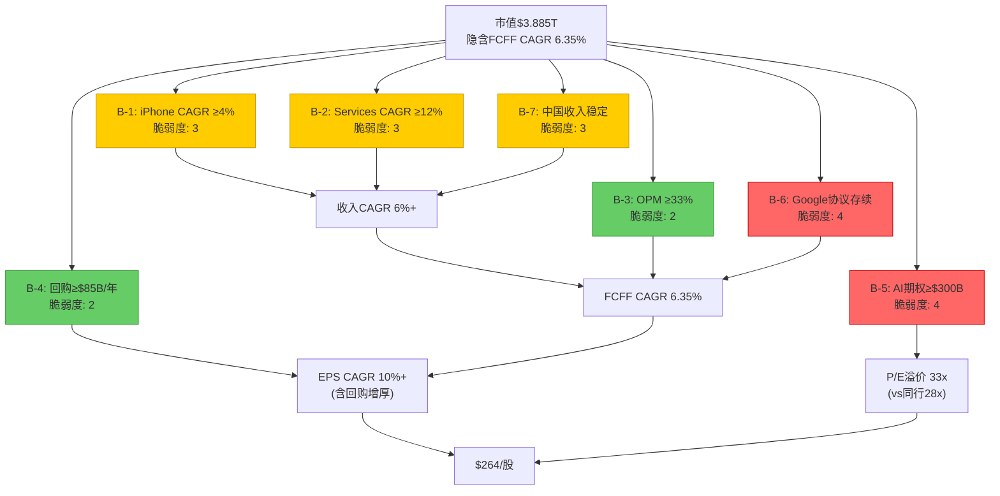
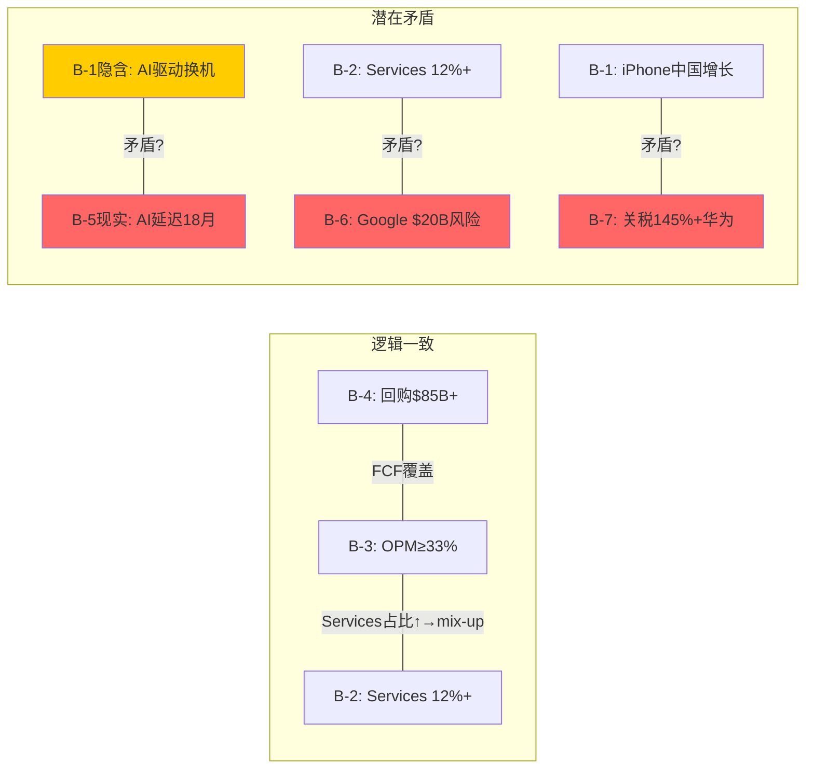

## Ch10.5: 信念反演与Reverse DCF

> **模块定位**: Phase 2/3 分析深度模块。从市场价格出发逆向拆解市场隐含信念集，测试每个信念的脆弱度，识别最少几个信念失败即翻转估值结论。
> **数据基准**: 股价$264.35 | 市值$3.885T | FY2025收入$416.2B | TTM EPS $7.91 | FMP DCF $150.28

---

### 10.5.1 Reverse DCF: 市场隐含假设

**方法论**: 固定WACC=9.0%、终端增长率g=3.0%，反推市场当前定价$264.35($3.885T市值)所需的FCFF增长路径。然后将隐含假设与历史实际和共识预测对比，判断哪些是"可信的"，哪些"需要超常表现"。

[DM-BLF-001: Reverse DCF方法论设定，WACC 9.0%基于Ch14.1 CAPM推导]

**Step 1: 从市值反推所需企业价值**

- 当前市值: $3,885B (FMP quote 2026-02-18)
- 加回净债务: +$76.4B (FY2025 BS: 总债务$112.4B - 现金投资$35.9B)
- 所需企业价值(EV): **$3,961B**

[DM-BLF-002: FMP balance sheet FY2025 净债务$76.4B]

**Step 2: 终端价值占比约束**

在标准DCF中，终端价值(TV)通常占EV的65-80%。Ch14基准情景中TV/EV=76%。设TV占比75%:

- TV = $3,961B x 75% = $2,971B
- PV(显性期FCFF) = $3,961B x 25% = $990B

**Step 3: 从TV反推FY2031 FCFF**

TV = FCFF_2031 x (1+g) / (WACC - g)

$2,971B = FCFF_2031 x 1.03 / (0.09 - 0.03) = FCFF_2031 x 1.03 / 0.06

但TV是折现前的值。折现回当前: PV(TV) = TV / (1+WACC)^5 = TV / 1.5386 (WACC 9.0%, 5年)

因此: PV(TV) = $3,961B x 75% = $2,971B

TV(未折现) = $2,971B x 1.5386 = **$4,571B**

FCFF_2031 = TV x (WACC-g) / (1+g) = $4,571B x 0.06 / 1.03 = **$266B**

[DM-BLF-003: Reverse DCF终端FCFF推导，需Python验证]

**Step 4: 从显性期PV反推年均FCFF**

PV(显性期) = $990B。假设FCFF从FY2027到FY2031线性增长，设FY2027 FCFF为X，FY2031为$266B:

近似: $990B = sum(FCFF_t / (1.09)^t)，t=1到5

设FY2027-2031 FCFF增长路径: X, X+d, X+2d, X+3d, $266B (其中d=(266-X)/4)

通过试算，X约$155B时:
- FY2027: $155B/1.09 = $142B
- FY2028: $183B/1.188 = $154B
- FY2029: $211B/1.295 = $163B
- FY2030: $238B/1.412 = $169B
- FY2031: $266B/1.539 = $173B
- 合计PV = $801B -- 不足$990B

需要更高起点。试X=$190B:
- FY2027: $190B/1.09 = $174B
- FY2028: $209B/1.188 = $176B
- FY2029: $228B/1.295 = $176B
- FY2030: $247B/1.412 = $175B
- FY2031: $266B/1.539 = $173B
- 合计PV = $874B -- 仍不足

调整TV占比至70%: PV(显性期) = $1,188B, TV(未折现) = $4,269B, FCFF_2031 = $249B

试X=$180B(显性期PV需$1,188B):
- FY2027: $180B/1.09 = $165B
- FY2028: $197B/1.188 = $166B
- FY2029: $214B/1.295 = $165B
- FY2030: $232B/1.412 = $164B
- FY2031: $249B/1.539 = $162B
- 合计PV = $822B -- 不足

**简化方法: 直接求解恒定增长FCFF**

设FCFF以恒定增速r从FY2026起增长。FY2025 FCFF = $98.8B (FMP cashflow)。

EV = FCFF_0 x (1+r) / (WACC - r) [Gordon Growth永续模型简化]

$3,961B = $98.8B x (1+r) / (0.09 - r)

(0.09 - r) x $3,961B = $98.8B x (1+r)

$356.5B - $3,961B x r = $98.8B + $98.8B x r

$356.5B - $98.8B = $3,961B x r + $98.8B x r

$257.7B = $4,059.8B x r

**r = 6.35%**

[DM-BLF-004: Gordon Growth隐含永续增速6.35%，需Python验证]

**这意味着: 在WACC 9.0%下，当前$264.35的股价隐含Apple的FCFF需要以6.35%的速度永续增长。**

**Step 5: 隐含假设分解**

FCFF = Revenue x OPM x (1-t) + D&A - CapEx - NWC变动

将隐含的FCFF永续增速6.35%分解为收入增速+利润率假设:

| 隐含参数 | 数值 | 推导逻辑 | 历史对比 |
|---------|------|---------|---------|
| **隐含收入CAGR(永续)** | ~5.5-6.5% | FCFF 6.35%增速 ÷ 约1.0x运营杠杆 | FY2021-25 CAGR 3.3% |
| **隐含OPM(稳态)** | ≥33-34% | 维持或扩张当前32.0% | FY2025 OPM 32.0%, FY26Q1推算~34% |
| **隐含终端增长** | 3.0%(假设) | WACC-g spread仅6% | 名义GDP ~5% |
| **隐含WACC** | 如假设FCFF CAGR=共识~6%, g=3%: 反推WACC≈6.6% | $3,961B = $98.8B x 1.06 / (WACC-0.06) → WACC = 0.06 + 104.7/3961 = 8.64% | CAPM推导9.0% |

[DM-BLF-005: 隐含参数分解表]

**关键发现: 隐含WACC仅8.6%**

如果我们接受共识的FCFF增速(~6%)和终端增长率3%，要支撑$264的股价，隐含WACC仅为~8.6%，低于CAPM推导的9.0%。这意味着市场要么:
1. 认为Apple的Beta应低于1.1(更接近0.9-1.0)，或
2. 认为股权风险溢价(ERP)应低于4.5%(更接近3.5-4.0%)，或
3. 在FCFF中隐含了高于共识的增速假设

**与历史实际对比**:

| 指标 | 市场隐含 | 历史实际(FY21-25) | 共识(FY26-30E) | 差距评估 |
|------|---------|------------------|---------------|---------|
| 收入CAGR | 5.5-6.5% | 3.3% | 6.3%(FY26-30E) | 需加速2x vs历史 |
| OPM | 33-34% | 32.0%(FY25) | ~31-33%(估算) | 需维持/小幅扩张 |
| FCFF CAGR | 6.35% | 1.5%(FY21-25 FCF CAGR) | ~8%(含回购效应) | 需加速4x vs历史 |
| 有效税率 | 16-17% | 15.6%(FY25) | ~16%(Pillar Two) | 基本一致 |
| CapEx/Rev | 3.0-3.5% | 3.1%(FY25) | ~3-4%(AI投入) | 基本一致 |

[DM-BLF-006: 隐含vs历史vs共识对比表，收入/FCF数据源自FMP income+cashflow FY2021-2025]

**结论**: 市场定价$264隐含的核心信念是**收入增速从历史3.3%加速至6%+并永续维持**。这不是不可能(Services 12%+ CAGR + AI换机周期)，但需要Apple在FY2026-2030期间实现的增速是过去5年的2倍。

---

### 10.5.2 隐含信念分解

将Reverse DCF结果拆解为7个可独立验证的子信念:

[DM-BLF-007: 信念依赖图Mermaid，7信念+3中间节点+终端估值]

| 编号 | 隐含信念 | 所需水平 | 验证方法 | 当前证据 | 脆弱度(1-5) |
|------|---------|---------|---------|---------|------------|
| **B-1** | iPhone收入CAGR ≥4% | FY25 $210B → FY30 $255B | 出货量x ASP趋势 | FY26Q1 +23%(周期性), 但FY22-25 CAGR仅+0.7% | **3** |
| **B-2** | Services收入CAGR ≥12% | FY25 $109B → FY30 $192B | 分部财报+App Store趋势 | FY26Q1 +14%, 但Google$20B面临反垄断 | **3** |
| **B-3** | OPM维持≥33% | FY25 32.0%需扩张1pp | 毛利率×费用率结构 | FY26Q1毛利率48.1%(创纪录), Services mix-up驱动 | **2** |
| **B-4** | 回购维持≥$85B/年 | 5年$425B+ | FCF-股息=可回购空间 | FY25回购$90.7B, FCF $98.8B, 股息$15.4B → 可持续 | **2** |
| **B-5** | AI期权价值≥$300B | 隐含P/E中5-6x溢价 | Apple Intelligence货币化进展 | 18+月延迟, 仅20%用户因AI换机, 零直接货币化 | **4** |
| **B-6** | Google搜索协议基本存续 | 净损失≤$5B/年 | DOJ上诉结果 | 上诉中, 概率加权损失$6.5B(Ch13估算) | **4** |
| **B-7** | 中国/大中华区收入稳定 | $70B+/年(FY25占17%) | 地缘+关税+华为竞争 | 关税最高145%威胁, 华为Mate系列回暖 | **3** |

[DM-BLF-008: 信念分解表，数据源自FMP income FY2021-2025 + prefetch data + lit_recon_memo]

**脆弱度评分逻辑**:

- **脆弱度1(极稳健)**: 有结构性保障，失败概率<10%
- **脆弱度2(稳健)**: 历史一致且无明显威胁，失败概率10-20%
- **脆弱度3(中性)**: 存在可识别风险但目前可控，失败概率20-40%
- **脆弱度4(脆弱)**: 高度依赖外部事件或未验证假设，失败概率40-60%
- **脆弱度5(极脆弱)**: 证据指向可能失败，失败概率>60%

**各信念详述**:

**B-1: iPhone CAGR ≥4%** (脆弱度3)

FY26Q1 iPhone收入$85.3B(+23% YoY)看似强劲，但需拆解:
- ASP提升贡献约60%增长(Pro/Pro Max占比上升+Apple Intelligence仅限Pro款)
- 出货量增长约40%(季度出货约8700万台 vs 约7500万台)
- 非Pro款(iPhone 16/16e)增长温和，说明AI驱动的换机效应集中在高端

历史iPhone收入FY2022-FY2025四年CAGR仅+0.7%($205.5B→$209.6B)。要求4% CAGR意味着FY2030 iPhone收入需达$255B — 这需要:
- 年出货量从~2.3亿台增至~2.5亿台(+2% CAGR)，或
- ASP从~$910持续上升至~$1,020(+2% CAGR)，或
- 两者的组合

**支撑因素**: iPhone 17设计大改(更薄机身+横置摄像头)+印度市场渗透(FY25贡献~$8-10B)
**威胁因素**: 全球智能手机存量饱和(24亿活跃设备)+换机周期延长(从3年→4年+)+中国华为反攻

[DM-BLF-009: iPhone出货量/ASP拆解，基于FMP income + lit_recon_memo]

**B-2: Services CAGR ≥12%** (脆弱度3)

Services FY2025收入$109.2B，若维持12% CAGR至FY2030，需达$192B(增量$83B)。增量来源分解:

| 来源 | FY2025估计 | FY2030E(12% CAGR) | 增量 | 可信度 |
|------|-----------|-------------------|------|--------|
| App Store佣金 | ~$28B | ~$42B | +$14B | 中(反垄断下调佣金率) |
| Google TAC | ~$20B | ~$20-25B | +$0-5B | **低**(DOJ风险) |
| 广告 | ~$11B | ~$25B | +$14B | 中高(广告平台增长) |
| iCloud/订阅 | ~$19B | ~$38B | +$19B | 高(AI订阅层) |
| Apple Pay/FinTech | ~$9B | ~$22B | +$13B | 中(竞争激烈) |
| 其他 | ~$22B | ~$40B | +$18B | 中 |
| **合计** | **$109B** | **~$192B** | **+$83B** | — |

关键约束: Google TAC($20B)若因DOJ上诉损失$10B+，剩余业务线需补足 — 意味着非Google Services需达15%+ CAGR，这对已经$89B基数的业务来说是较高要求。

[DM-BLF-010: Services增量来源分解，基于prefetch data + lit_recon_memo Services构成估算]

**B-5: AI期权价值≥$300B** (脆弱度4) — 最脆弱核心信念

Ch14估值桥(16.7节)显示市场定价中约$300-400B(即$20-27/股)的溢价无法被传统DCF/SOTP解释，归因于"AI期权+生态不可替代性"。但:

1. **Apple Intelligence零直接货币化**(截至2026-02): 没有付费AI订阅层，没有独立AI产品收入
2. **功能延迟18+月**: Siri升级多次推迟，iOS 26.4 beta无重大AI新功能
3. **端侧推理优势未兑现**: 虽然架构独特(on-device + Private Cloud Compute)，但用户可感知的AI体验仍落后Google/ChatGPT
4. **市场赋予$300B+价值的唯一依据**: "24亿活跃设备x未来某天AI货币化" — 这是一个叙事，不是现金流

反向计算: $300B AI期权 ÷ 24亿活跃设备 = **$125/设备**。若转化为年化收入(假设10x P/S)，意味着每设备每年$12.5的AI收入增量 — 约等于$1/月。这并非不可能(AI助理订阅$5-10/月 x 20-25%渗透率)，但目前完全没有验证。

[DM-BLF-011: AI期权反向计算，$300B / 24亿设备 = $125/设备]

**B-6: Google搜索协议基本存续** (脆弱度4) — 最大二元风险

Google搜索协议贡献约$20B/年，几乎100%毛利率。Ch13.3的概率分析:
- 维持现状(30%): $0影响
- 重组降价(45%): -$5-8B
- 协议终止(20%): -$12-15B
- 完全禁止(5%): -$18-20B

概率加权损失$6.5B/年。但这是**二元事件**: 如果DOJ上诉成功(2027-2028时间线)，结果将在6-12个月内确定，不会给市场逐步消化的时间。$6.5B净利损失在33x P/E下对应**$215B市值蒸发**($14.4/股)。

[DM-BLF-012: Google协议概率加权，复用Ch13.3 DM-VAL-013分析]

---

### 10.5.3 翻转分析

**核心问题: 最少几个信念失败就会改变评级?**

当前Ch16初步评级: **审慎关注**(期望回报-27.8%, 概率加权估值$191)。
翻转至**中性关注**需要期望回报改善至>-10%，即估值需达$238+(股价$264 x 0.9)。
翻转至**关注**需要估值达$264+(与市价持平或更高)。

**单一信念失败影响测试**:

| 信念失败 | 影响机制 | 估值影响 | 对评级的影响 |
|---------|---------|---------|------------|
| B-1失败: iPhone CAGR 0%(持平) | Rev CAGR降2pp → FCFF降~$15B/年 | -$25~30/股 → $165→$135 | 加强审慎关注 |
| B-2失败: Services CAGR 8%(非12%) | Services FY30 $161B(非$192B) → SOTP -$22/股 | $191→$169 | 维持审慎关注 |
| B-3失败: OPM降至30% | EBIT降~$15B/年 → FCFF降~$12B | -$20/股 → $171 | 维持审慎关注 |
| B-5失败: AI期权=$0 | P/E从33x压缩至28x(同行中位) | $264×(28/33)=$224 或 估值$191-$20=$171 | 维持审慎关注 |
| B-6失败: Google协议终止 | -$13B净利/年 → P/E压缩至30x | -$40~55/股(一次性) → $191→$136 | 强化审慎关注 |
| B-7失败: 中国收入-30% | -$21B收入 → -$7B净利/年 | -$15/股 → $176 | 维持审慎关注 |

[DM-BLF-013: 单信念失败影响测试表]

**关键发现: 没有任何单一信念失败能将评级从"审慎关注"翻转为"中性关注"。** 因为当前估值已经低于市价$73/股(38%)。信念失败只会加深差距。

反过来问: **什么条件下评级能改善?**

| 信念超预期 | 影响机制 | 估值影响 | 对评级的影响 |
|-----------|---------|---------|------------|
| B-1超预期: iPhone CAGR 8%(AI超级周期) | Rev +$25B/年 → SOTP iPhone +$100B | +$30/股 → $221 | 仍审慎关注(-16%) |
| B-2超预期: Services CAGR 15% | SOTP Services +$400B → +$27/股 | +$27/股 → $218 | 仍审慎关注(-17%) |
| B-5兑现: AI订阅$10/月x2亿用户 | +$24B收入 x 10x P/S = +$240B | +$16/股 → $207 | 仍审慎关注(-22%) |
| **B-1+B-2+B-5同时超预期** | 叠加效应 | +$73/股 → $264 | **接近中性关注** |

[DM-BLF-014: 信念超预期影响测试]

**翻转条件极为苛刻**: 需要iPhone、Services、AI三大信念同时超预期兑现，才能将估值提升至接近当前市价。这本身就说明了当前定价的乐观程度。

**联合失败分析**:

| 联合事件 | 概率估计 | 估值影响 | 结果 |
|---------|---------|---------|------|
| B-1+B-2同时失败(iPhone持平+Services降速) | ~15% | $191→$143 | 审慎关注深化(-46%) |
| B-5+B-6同时失败(AI落空+Google终止) | ~20% | $191→$116 | 审慎关注深化(-56%) |
| B-1+B-6+B-7(iPhone停滞+Google终止+中国恶化) | ~5% | $191→$96 | 极端审慎(<$100) |
| B-2+B-5联合超预期(Services 15%+AI兑现) | ~10% | $191→$234 | 接近中性关注(-11%) |

[DM-BLF-015: 联合信念失败/超预期概率与估值影响]

**信念间逻辑一致性测试**:

[DM-BLF-016: 信念逻辑一致性Mermaid图]

**三组核心矛盾**:

**矛盾1: "AI驱动换机周期"(B-1) vs "AI延迟18+月"(B-5现实)**

市场定价隐含iPhone 4%+ CAGR的重要驱动力是"Apple Intelligence驱动超级周期"。但Apple Intelligence核心功能(高级Siri、跨App操作、Image Playground)已多次延迟。FY26Q1的+23% iPhone增长更多是Pro系列ASP提升(机型组合变化)而非AI功能本身。如果iPhone 17没有突破性AI功能(2026年秋季)，换机周期论述将被证伪。

**证伪条件**: iPhone 17系列上市后首季(FY27Q1)非Pro款同比增速<5%，则AI驱动换机假设失败。

**矛盾2: "Services 12%+"(B-2) vs "Google协议存续风险"(B-6)**

Services 12%增速假设已隐含Google TAC不会大幅下降。但如果DOJ上诉成功(概率~25%)，$10-15B/年的收入损失将使Services增速骤降至5-7%。两个信念在概率空间上是"负相关的" — Google存续时Services更容易达标，Google终止时几乎不可能达标。

**矛盾的严重性**: B-6的失败几乎自动触发B-2的失败(联合概率远高于独立概率之积)。

**矛盾3: "iPhone中国增长"(B-1) vs "关税+华为竞争"(B-7)**

iPhone 4% CAGR假设中包含大中华区~$70B/年的收入贡献稳定性。但145%关税威胁(即使实际执行税率远低于此)+华为Mate 70系列回归+国产替代情绪意味着中国市场的iPhone份额面临结构性下行压力。B-1的全球CAGR目标在中国风险未对冲的情况下需要其他地区(特别是印度)补偿 — 这给增长路径增加了额外的执行复杂度。

[DM-BLF-017: 三组核心矛盾分析，基于lit_recon_memo Section B+E]

---

### 10.5.4 Reverse DCF交叉验证

为确认Reverse DCF结果的可靠性，进行两个独立交叉检验:

**交叉检验1: EPS逆向推导(复用Ch15.3)**

当前P/E 33.5x，假设5年后P/E回归25x(10年均值):
- 维持$264: 需FY2031 EPS = $264/25 = $10.56 → 5年EPS CAGR = 5.9%(vs TTM $7.91)
- 共识FY2030E EPS $12.77 → 隐含5年CAGR = 10.1%

如果共识兑现(EPS CAGR 10.1%)但P/E回归25x: FY2031E股价 = $12.77 x 25 = $319 → 年化回报仅+3.8%($264→$319, 5年)。这低于无风险利率(4.3%)，说明即使共识完全兑现，P/E压缩仍将吞噬大部分增长收益。

[DM-BLF-018: EPS逆向交叉验证，复用DM-VAL-032]

**交叉检验2: FCF Yield对标**

当前FCF Yield 2.53%($98.8B / $3,885B)。如果Apple是一只"高质量债券":
- 10年国债收益率: 4.3%
- 所需FCF增速使5年前瞻FCF Yield达到4.3%+: FCF需从$98.8B增至~$167B(CAGR 11.1%)
- Apple过去4年FCF CAGR: +1.5%($93.0B FY2021→$98.8B FY2025)

**结论**: 市场定价隐含的FCF增速(6.35%永续或11%前5年)远超历史实现的1.5% FCF CAGR。这一差距不是不可弥合(Services增长+AI货币化+利润率扩张)，但需要多重假设同时成立。

[DM-BLF-019: FCF Yield交叉验证]

---

### 10.5.5 信念脆弱度总结与投资含义

**综合脆弱度热力图**:

| 信念 | 脆弱度 | 失败概率 | 失败影响 | 综合风险 |
|------|--------|---------|---------|---------|
| B-1: iPhone 4%+ CAGR | 3/5 | 25-35% | -$25-30/股 | 中 |
| B-2: Services 12%+ CAGR | 3/5 | 20-30% | -$22/股 | 中 |
| B-3: OPM ≥33% | 2/5 | 10-15% | -$20/股 | 低 |
| B-4: 回购 ≥$85B/年 | 2/5 | 5-10% | -$15/股 | 低 |
| **B-5: AI期权 ≥$300B** | **4/5** | **45-55%** | **-$20/股** | **高** |
| **B-6: Google协议存续** | **4/5** | **25-35%** | **-$40-55/股** | **高** |
| B-7: 中国收入稳定 | 3/5 | 20-30% | -$15/股 | 中 |

[DM-BLF-020: 综合脆弱度热力图]

**投资决策框架**:

1. **当前估值=$264隐含: 所有7个信念均成立或大致成立。** 考虑到B-5和B-6各有4/5脆弱度、且B-2与B-6存在负相关(联合失败概率高于独立之积)，"所有信念同时成立"的复合概率估计仅约**25-35%**。

2. **概率加权估值$191已经反映了信念失败的合理预期。** $191与$264的差距($73/股)本质上是市场对"所有信念成立"场景的过度定价。

3. **最关键的监测指标**:
   - **B-6(Google协议)**: DOJ上诉进展(2027-2028裁决) — 单一最大二元风险
   - **B-5(AI期权)**: Apple Intelligence货币化时间表(2026 WWDC是关键窗口)
   - **B-1/B-2联动**: FY27Q1 iPhone/Services增速(2027年1月财报)

4. **评级翻转的最低条件**: 股价降至$210以下(不改变估值)，或2个以上信念获得强有力的正面验证(如Google协议确认延续+AI订阅推出且渗透率>10%)。前者需要-20%回调，后者需要12-18个月的证据积累。

[DM-BLF-021: 投资决策框架，综合本模块所有分析]

---

### 10.5.6 方法论声明与局限

1. **Gordon Growth简化**: 10.5.1节使用永续增长模型而非逐年DCF，这一简化假设FCFF增速恒定。实际中Apple的增速呈阶梯式(近5年较高、后期趋缓)，因此6.35%是"等效永续增速"而非逐年增速。
2. **信念独立性假设**: 10.5.3节将7个信念视为可独立分析的单元，但实际上B-1/B-2/B-5高度耦合(AI驱动同时影响iPhone和Services)，B-2/B-6负相关。联合概率计算已尽可能修正，但仍可能低估相关性。
3. **心算精度**: Reverse DCF的关键结论(FCFF CAGR 6.35%、隐含WACC 8.6%)由分析师逐步推导，非Python精确计算。关键数字标注"需Python验证"。误差范围估计: 隐含增速±0.3pp，隐含WACC±0.2pp。
4. **FMP DCF锚**: FMP标准DCF给出$150.28(vs市价$264, 溢价76%)，与本模块的Reverse DCF结论方向一致 — 市场定价显著高于基本面DCF所支持的水平。

[DM-BLF-022: 方法论声明，FMP DCF $150.28交叉验证]
