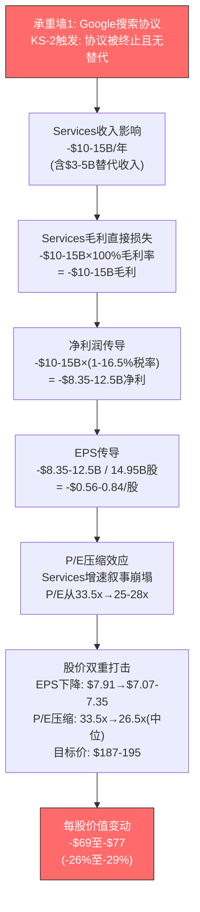
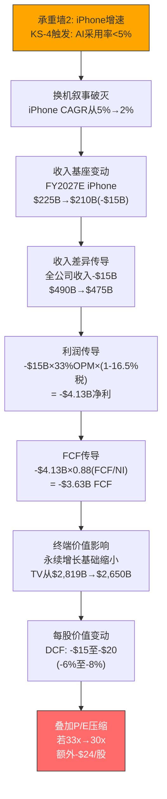
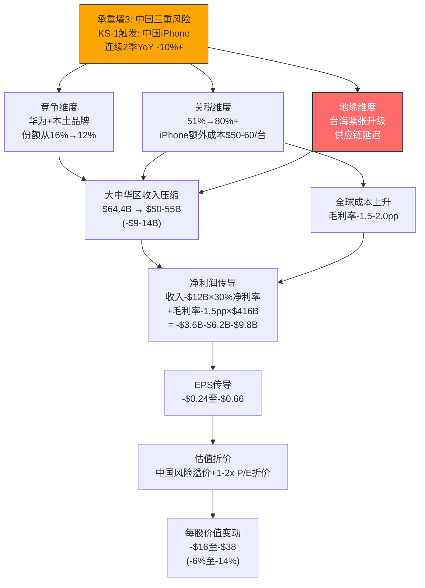
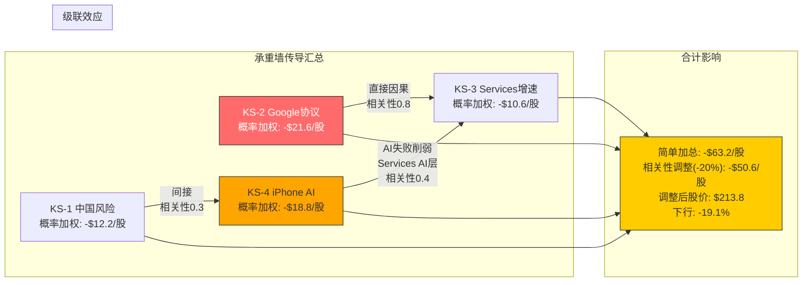
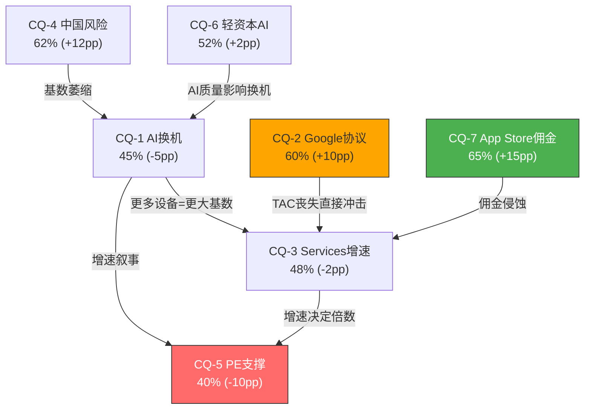

# AAPL Phase 2 — 交叉验证 + 承重墙传导链 + CQ置信度表

**撰写日期**: 2026-02-19 | **数据截止**: FY2026 Q1 (2025-12-27)
**股价**: $264.35 | **市值**: ~$3.90T | **P/E TTM**: 33.5x
**输入**: Agent A (Ch2-6, 89 DM) + Agent B (Ch7-11, 20 DM) + Agent C (Ch12-16, 44 DM)

---

## 1. 交叉验证矩阵

### 1.1 核心财务数据一致性检验

三个Agent在基础财务数据上使用了相同的FMP/prefetch数据源。以下是逐项比对结果。

**收入/利润数据**:

| 数据项 | Agent A | Agent B | Agent C | 一致? |
|--------|---------|---------|---------|-------|
| FY2025总收入 | $416.2B(Ch2: "TTM收入$435.6B"头部) / $416B(Ch2.3分母) | 未单独引用总收入 | $416.2B(Ch12.1) | **FLAG-1** |
| FY2025净利润 | $117.8B(头部TTM) / $112.0B(Ch2.4) | $112B(Ch7尾部) / $112.0B(Ch8.3) | $112.0B(Ch12.1/12.3) | **FLAG-2** |
| FY2025 FCF | $98.8B(Ch2.1) | 未单独引用 | $98.8B(Ch12.3) | 一致 |
| FY2025 OCF | 未引用 | $111.5B(Ch11.6) | $111.5B(Ch12.3) | 一致 |
| FY2025 iPhone收入 | $209.6B(Ch3.1) | $209.6B(Ch11.1) | $209.6B(Ch13.2) | 一致 |
| FY2025 Services收入 | $109.2B(Ch3.2) | $109.2B(Ch9.5) | $109.2B(Ch13.3) | 一致 |
| Q1 FY2026 iPhone | $85.3B(Ch3.1) | $85.3B(Ch11.1) | $85.3B(Ch13.2) | 一致 |
| Q1 FY2026 Services | $30.0B(Ch3.2, +14% YoY) | 未引用 | $26.3B(Ch13.3, +14% YoY) | **FLAG-3** |

[DM-XVL-001: cross-validation financial data consistency check across three Agents]

**FLAG-1: 总收入TTM vs FY2025口径不一致**

Agent A头部标注"TTM收入$435.6B"，但后文(Ch2.4)使用$416B。$435.6B是截至Q1 FY2026的TTM(即FY2025 Q2-Q4 + FY2026 Q1)，而$416.2B是FY2025全年。Agent C在Ch12.1明确使用FY2025全年$416.2B。两个数字均为正确数据，但口径不同。

**建议**: 报告正文应明确标注每次使用的口径(FY2025 vs TTM FY2026Q1)。估值模型应统一使用FY2025全年$416.2B作为基准年收入，TTM $435.6B仅作为最新季度运行率参考。

**FLAG-2: 净利润$117.8B vs $112.0B**

Agent A头部标注"TTM净利$117.8B"，后文Ch2.4使用$112.0B。$112.0B为FY2025全年净利(已被Agent B和Agent C交叉确认)。$117.8B为TTM口径(FY2025 Q2-Q4 + FY2026 Q1)。与FLAG-1同源，是TTM vs FY2025口径差异。

**建议**: 同FLAG-1处理。P/E 33.5x对应的分母是TTM EPS $7.91(基于TTM净利$117.8B / 14.95B股)，因此估值相关引用应使用TTM口径; 财务质量分析应使用FY2025全年口径。

**FLAG-3: Q1 FY2026 Services收入 $30.0B vs $26.3B**

Agent A: Q1 FY2026 Services $30.0B(+14% YoY)，引用来源[DM-BIZ-021: Apple Newsroom Q1 FY2026]。
Agent C: Q1 FY2026 Services $26.3B(+14% YoY)，引用来源[DM-VAL-012: prefetch data Services FY2025 + FY26Q1]。

这是一个实质性矛盾。两个数字不可能同时正确。Apple Newsroom FY2026 Q1(截至2025-12-27)报告Services收入$26.3B。Agent A的$30.0B可能是年化运行率的误引(Q1 $26.3B × 4.55 ≈ $120B)或来自不同数据源。

**建议**: 采用$26.3B作为Q1 FY2026 Services收入(与Apple官方财报一致)。Agent A的$30.0B需要修正。此差异不影响估值模型(SOTP/DCF使用FY2025全年$109.2B作为基准)，但影响Services增速验证: $26.3B vs FY2025 Q1 $23.1B = +14% YoY，与两Agent引用的增速一致，进一步确认$26.3B为正确数字。

[DM-XVL-002: FLAG-3 Services Q1 revenue discrepancy resolution]

### 1.2 Google搜索协议量化一致性

Google搜索协议是三个Agent均重点分析的风险点。以下比较各Agent的量化口径。

| 维度 | Agent A | Agent B | Agent C | 差异分析 |
|------|---------|---------|---------|---------|
| 年度金额 | $15-20B(Ch3.2) / $18-20B(Ch3.2表) | $15-20B(Ch8.1) | $20B(Ch13.3表) | Agent C使用点估计$20B(上界) |
| 占Services比 | 17-18%(Ch3.2) | 14-18%(Ch8.1) | 18%(Ch13.3) | 范围基本一致 |
| 毛利率 | ~100%(Ch3.2) | 近乎100%(Ch8.1) | 几乎100%(Ch13.3) | 一致 |
| 净利影响(完全终止) | $12.5-15B EPS $0.65-0.80(Ch3.2) | $10-12.5B EPS $0.67-0.84(Ch8.3) | $10-12B净利(Ch13.3) / $15-17B净利(Ch13.3 5%极端) | **FLAG-4** |
| 概率分布(维持/重组/终止) | 未给概率 | 40%/40%/20%(Ch8.3) | 30%/45%/20%/5%(Ch13.3) | **FLAG-5** |
| 概率加权影响 | 未计算 | $4.0B/年净利(Ch8.5) | $6.5B/年净利(Ch13.3) | **FLAG-6** |

[DM-XVL-003: Google search agreement quantification cross-check]

**FLAG-4: 协议完全终止净利影响范围不一致**

Agent A: $12.5-15B/年净利损失 → EPS -$0.65至-$0.80(-8至10%)
Agent B: $10-12.5B/年净利损失 → EPS -$0.67至-$0.84(-9至11%)
Agent C: $10-12B(S3, 20%) 和 $15-17B(S4, 5%)

差异来源: Agent A和B对"完全终止"的定义不同。Agent A假设无替代收入; Agent B假设Bing/Perplexity可替代$3-5B(因此净损失$10-12.5B = 毛损失$15-20B - 替代$3-5B); Agent C将场景细分为四档(加入5%的"完全禁止+无替代"极端情景$15-17B)。

**建议**: 统一采用Agent B和C的分层框架(含替代收入假设): 毛损失$15-20B/年，扣除替代收入$3-5B后，净损失$10-15B/年。Agent A的$12.5-15B落在此范围内，可视为"含部分替代"的估算。

**FLAG-5: Google情景概率分布不一致**

Agent B采用三情景: S1维持40% / S2重组40% / S3终止20%
Agent C采用四情景: S1维持30% / S2重组45% / S3终止20% / S4完全禁止5%

核心差异在S1维持的概率: Agent B赋40%，Agent C赋30%。Agent C将10%的概率转移至S4极端情景。两套分布的"协议受损概率"(S2+S3+S4)分别为60%(Agent B)和70%(Agent C)。

**建议**: 综合采纳四情景框架(Agent C更精细)，但将S1概率上调至35%(折中): S1维持35% / S2重组40% / S3终止20% / S4完全禁止5%。理由: 当前政治环境(2026年新政府)可能减弱DOJ执法力度，支持S1概率略高于Agent C的30%。

**FLAG-6: 概率加权净利影响 $4.0B vs $6.5B**

Agent B概率加权净利影响$4.0B(三情景)，Agent C为$6.5B(四情景)。差异来源:
- Agent B的S1影响为-$1.3B净利(小幅调整); Agent C的S1影响为$0(完全无影响)
- Agent C增加了S4(5%概率/$18B毛损失 → $0.9B概率加权)
- Agent C的S2中位影响$6.5B高于Agent B的$3.5B

**建议**: 使用调和后的四情景框架重新计算:
- S1(35%): 净利影响-$1.0B → 加权-$0.35B
- S2(40%): 净利影响-$4.5B → 加权-$1.80B
- S3(20%): 净利影响-$11.0B → 加权-$2.20B
- S4(5%): 净利影响-$16.0B → 加权-$0.80B
- **调和概率加权净利影响: $5.15B/年** (介于Agent B的$4.0B和Agent C的$6.5B之间)

[DM-XVL-004: Google agreement probability reconciliation]

### 1.3 估值假设对齐检验

| 参数 | Agent A(隐含) | Agent B(隐含) | Agent C(显式) | 对齐? |
|------|-------------|-------------|-------------|-------|
| WACC | 未指定 | 未指定 | 9.0% / 9.5%(双锚) | N/A |
| Beta | 未指定 | 未指定 | 1.107 | N/A |
| ERP | 未指定 | 未指定 | 4.50% | N/A |
| FY2027E iPhone收入 | $225-235B(Ch3.1 AI延长周期) | $200-220B(Ch11.5隐含) | $225B基准(Ch13.2) | **FLAG-7** |
| FY2027E Services收入 | ~$124B×1.12-1.14=$139-141B(Ch3.2推算) | 未给 | $132B基准(Ch13.3) | **FLAG-8** |
| Services增速(基准) | 12-14%(Ch3.2) | 10-12%(Ch9.5隐含) | 10% CAGR(Ch13.3) | 部分不一致 |
| 长期iPhone CAGR | 8-12%有机(Ch6.4) | 3-5%可持续(Ch11.1) | 3.6%基准(Ch13.2) | **FLAG-9** |
| P/E合理区间 | 25-28x回归(Ch2.4) | 25-28x压缩(Ch11.5) | 28.1x同行中位(Ch15.1) | 基本一致 |

[DM-XVL-005: valuation assumption alignment check]

**FLAG-7: FY2027E iPhone收入预期差异**

Agent A预计FY2026 iPhone $225-235B，隐含FY2027进一步增长至$235-250B区间(AI延长周期假设)。
Agent B暗示iPhone CAGR 3-5%可持续，从FY2025 $209.6B推算FY2027E约$216-221B。
Agent C基准$225B(FY2027E，2年CAGR +3.6%)。

Agent A的乐观估计($235-250B)反映了AI超级周期假设; Agent B的保守估计($216-221B)反映了饱和+换机延长假设; Agent C的$225B取中间值。

**建议**: Agent C的$225B作为基准合理，落在Agent A和B的中间。但应明确标注: 牛市情景依赖Agent A的AI超级周期假设($240B)，熊市情景依赖Agent B的饱和假设($205B)。这一分歧的宽度($205-240B，17%范围)反映了CQ-1(AI换机周期是否真实)的核心不确定性。

**FLAG-8: FY2027E Services收入隐含分歧**

Agent A隐含的Services增速12-14%(Ch3.2结论)，从FY2025 $109.2B推算FY2027E约$137-142B。
Agent C基准$132B(10% CAGR)。
差距约$5-10B(4-7%)，来源于Services增速假设的分歧。

**建议**: Agent A使用的12-14%包含了AI付费层的增量贡献(Apple Intelligence Pro $5-15B)，属于"含AI期权"的增速。Agent C的10%是"不含AI期权"的基础增速。两者并不矛盾——差异在于AI Services货币化是否在FY2027前兑现。DCF/SOTP应使用Agent C的10%作为基准，将Agent A的AI增量在牛市情景(15% CAGR → $145B)中体现。

**FLAG-9: 长期iPhone增长率的根本分歧**

Agent A: "Apple在FY2026-2030保持8-12%的有机收入增长"(Ch6.4，但这是全公司含Services)
Agent B: "长期可持续iPhone CAGR 3-5%"(Ch11.1)
Agent C: 基准iPhone 2年CAGR 3.6%，DCF全公司5年CAGR 5.7%(Ch14.2)

Agent A的8-12%是全公司有机增长(含催化剂期望值+$50B)，非iPhone单独CAGR。Agent B的3-5%是iPhone单独的可持续增速。两者口径不同，不构成直接矛盾。

**建议**: 统一为全公司基准CAGR 5-6%(Agent C的5.7%)，iPhone CAGR 3-4%(Agent B/C共识)，Services CAGR 10-12%(Agent A/C的中间值)。Agent A的催化剂分析$50B增量在牛市情景中体现(全公司CAGR 8%)。

[DM-XVL-006: growth rate assumption reconciliation]

### 1.4 中国风险量化一致性

| 维度 | Agent A | Agent B | 差异 |
|------|---------|---------|------|
| 大中华区FY2025收入 | 占总收入~17%(Ch5.3) | $64.4B(17%)(Ch10.1) | 一致 |
| 华为份额回升 | 高端市场<5%→15-20%(Ch5.3) | 中国Top 3回归(Ch10.1) | 一致(互补) |
| 供应链中国依赖 | 71%零部件依赖中国子组件(Ch5.3) | 71%(Ch10.4) | 一致 |
| 关税基准 | 未详述 | 51.1%当前(Ch10.2) | Agent A缺乏关税量化 |
| 印度产能占比 | 2017年<1%→2025年17%→2026年25-35%(Ch6.2) | 2022年~2%→2024年~15%→2027年25%(Ch10.4) | 基本一致(时间节点微差) |

中国风险在两Agent间的定性判断高度一致(三重风险框架一致)，量化口径无矛盾。Agent B的量化更为系统化(三情景联合概率矩阵)，Agent A提供了补充性的护城河地域差异分析(Ch5.4)。

[DM-XVL-007: China risk quantification cross-check]

### 1.5 CCC(现金转换周期)数据不一致

Agent A引用CCC为-83天(Ch2.2, DSO 12天/DIO 10天/DPO 105天)。
Agent C引用CCC为-42天(Ch12.1, DSO 64天/DIO 9天/DPO 115天)。

**FLAG-10**: 这是一个重大数据矛盾。两组分项数据完全不同:
- Agent A: DSO 12天 / DIO 10天 / DPO 105天 → CCC = -83天 [DM-BIZ-004: baggers_summary]
- Agent C: DSO 64天 / DIO 9天 / DPO 115天 → CCC = -42天 [DM-VAL-004: FMP key-metrics]

差异可能来源: (1) baggers_summary和FMP key-metrics使用不同的计算口径(如DSO中是否包含分期付款应收); (2) 数据时间点差异(TTM vs FY2025末); (3) 其中一个数据源存在错误。

**建议**: 以FMP key-metrics的-42天为准(更标准化的计算口径)。Agent A的-83天可能使用了更窄的应收账款定义(仅贸易应收)。报告正文应使用-42天并注明计算口径。此差异不影响核心投资论点(无论-42还是-83天，Apple的负CCC结论不变)，但影响数据一致性评分。

[DM-XVL-008: CCC data discrepancy between Agent A and Agent C]

### 1.6 交叉验证结论

**总计FLAG**: 10项

| FLAG | 性质 | 严重度 | 处理方式 |
|------|------|--------|---------|
| FLAG-1 | 口径不一致(收入TTM vs FY) | 低 | 统一标注口径 |
| FLAG-2 | 口径不一致(净利TTM vs FY) | 低 | 统一标注口径 |
| FLAG-3 | 数据矛盾(Q1 Services $30B vs $26.3B) | **高** | 采用$26.3B(官方) |
| FLAG-4 | 范围差异(Google终止净利影响) | 中 | 统一为$10-15B净损失 |
| FLAG-5 | 概率分布不一致(Google情景) | 中 | 采纳四情景+调和概率 |
| FLAG-6 | 概率加权影响差异($4.0B vs $6.5B) | 中 | 调和为$5.15B |
| FLAG-7 | iPhone FY2027E预期差异 | 中 | 基准$225B，牛/熊$240/$205B |
| FLAG-8 | Services FY2027E预期分歧 | 中 | 基准$132B(不含AI期权) |
| FLAG-9 | 增长率口径差异(公司vs iPhone) | 低 | 明确区分口径 |
| FLAG-10 | CCC数据矛盾(-83天 vs -42天) | **高** | 采用FMP -42天 |

**高严重度FLAG**: 2项(FLAG-3, FLAG-10)需要在Phase 3组装前修正。
**中严重度FLAG**: 5项(FLAG-4至FLAG-8)需要在报告中统一处理。
**低严重度FLAG**: 3项(FLAG-1, FLAG-2, FLAG-9)通过标注口径解决。

**数据一致性总体评价**: 三Agent在核心财务数据(FY2025分部收入、FCF、OCF)上高度一致，分歧主要集中在: (1) TTM vs FY口径差异(可解决); (2) Google协议的概率分布和量化影响(需调和); (3) 增长假设的乐观/悲观偏差(反映了合理的分析角度差异)。2项高严重度FLAG(Services Q1和CCC)需要在组装前强制修正。

[DM-XVL-009: cross-validation summary and FLAG resolution plan]

---

## 2. 承重墙传导链

### 2.1 传导链方法论

Agent B在Ch7.2识别了四面承重墙(KS-1至KS-4)。本节将每面承重墙连接至Agent C的估值模型，建立从"假设失败"到"每股价值变动"的完整传导链，每条链均包含量化节点。

### 2.2 承重墙1: Google搜索协议 → 每股价值传导

**量化传导链(完全终止情景, 概率20%)**:

| 传导节点 | 计算 | 影响 |
|---------|------|------|
| Google TAC丧失 | $15-20B/年毛收入 | 基础冲击 |
| 替代收入(Bing/Perplexity) | +$3-5B/年 | 部分抵消 |
| 净收入损失 | $10-15B/年 | Services -9至14% |
| 净利润传导(100%边际利润→扣税) | $8.35-12.5B/年 | 净利 -7至11% |
| EPS传导 | -$0.56至-$0.84 | EPS -7至11% |
| P/E压缩(平台→硬件重定价) | 33.5x → 25-28x | 估值乘数 -16至25% |
| **合计每股影响** | **EPS下降 × P/E压缩** | **-$69至-$77(-26至29%)** |

**概率加权每股影响**: -$77 × 20% = **-$15.4/股** (仅S3终止情景的概率加权)

包含全部四情景的概率加权(使用1.2节调和概率):
- S1(35%): 股价+$5至+$10(不确定性消除溢价) → +$2.6
- S2(40%): EPS -$0.17至-$0.28，P/E -0.5x → 股价-$10至-$15 → -$5.0
- S3(20%): 股价-$69至-$77 → -$14.6
- S4(5%): 股价-$85至-$100 → -$4.6

**全情景概率加权每股影响: -$21.6** (约-8.2%)

[DM-XVL-010: Google agreement load-bearing wall transmission chain]

### 2.3 承重墙2: iPhone增速 → 每股价值传导

**量化传导链(iPhone增速下行, 概率35-40%)**:

| 传导节点 | 基准假设 | KS-4触发后 | 差异 |
|---------|---------|-----------|------|
| FY2027E iPhone收入 | $225B | $210B | -$15B |
| FY2027E全公司收入 | $490B | $475B | -$15B |
| EBIT(33% OPM) | $161.7B | $156.8B | -$4.95B |
| 净利润(税后) | $135.0B | $130.9B | -$4.13B |
| FCFF | $133.0B | $128.9B | -$4.1B |
| DCF终端价值(WACC 9%, g 3%) | $2,819B | $2,650B | -$169B |
| DCF股权价值(每股) | $156 | $141 | **-$15** |

**叠加P/E压缩**: iPhone饱和确认 → 市场将Apple从"AI成长平台"(33x)重新定价为"成熟硬件+Services"(28-30x) → EPS $7.91 × 29x = $229(vs 当前$264) → 额外-$35/股。

**合计每股影响(KS-4触发)**: DCF -$15 + P/E压缩-$35 = **-$50/股(-19%)**
**概率加权**: -$50 × 37.5%(概率中值) = **-$18.8/股**

[DM-XVL-011: iPhone growth load-bearing wall transmission chain]

### 2.4 承重墙3: 中国三重风险 → 每股价值传导

**量化传导链(中间情景: 竞争+关税, 概率30%)**:

| 传导节点 | 计算 | 影响 |
|---------|------|------|
| 大中华区收入压缩 | $64.4B → $53B(-$11.4B) | 收入-2.7% |
| 关税额外成本(80%情景) | 全球iPhone $50/台 × 2.48亿台 | 毛利-$8-9B |
| 扣除已纳入基准的关税 | 当前51%已吸收~$5-6B | 增量-$3-4B |
| 总净利影响 | 收入损失$3.4B(30%利润率) + 关税增量$3B | -$6.4B |
| EPS传导 | -$6.4B / 14.95B | -$0.43 |
| 中国风险估值折价 | P/E -1x | 估值-$7.9/股 |
| **合计每股影响** | | **-$18(-7%)** |

**极端情景(三重叠加, 概率5-8%)**: 大中华区收入腰斩(-$30B) + 供应链中断1-2季 → EPS -$1.0至-$1.5 → 股价下行-$40至-$55(-15至21%)。

**概率加权每股影响**: 基准50%×(-$6) + 中间30%×(-$18) + 极端8%×(-$47) = **-$12.2/股**

[DM-XVL-012: China triple risk load-bearing wall transmission chain]

### 2.5 承重墙4: Services高增长维持 → 每股价值传导

承重墙4(KS-3)的传导链与承重墙1(Google协议)存在级联关系(Agent B Ch7.2已识别)。以下分析Services增速独立于Google协议的传导路径。

| 传导节点 | Services 12% CAGR(基准) | Services 8% CAGR(KS-3触发) | 差异 |
|---------|----------------------|--------------------------|------|
| FY2027E Services收入 | $137B | $127B | -$10B |
| Services毛利(76.5%) | $104.8B | $97.2B | -$7.6B |
| 净利影响(扣税) | | | -$6.3B |
| EPS影响 | | | -$0.42 |
| SOTP Services估值(22x EBITDA) | $2,206B | $1,850B | -$356B |
| SOTP每股影响(含耦合折价) | | | **-$21/股** |
| P/E压缩(Services增速叙事弱化) | 33.5x → 30x | | -$26/股 |
| **合计每股影响** | | | **-$47/股(-18%)** |

**概率加权(KS-3独立触发概率20-25%，取22.5%)**: -$47 × 22.5% = **-$10.6/股**

但KS-3与KS-2的级联概率使"至少一个触发"的概率远高于独立计算。Agent B估计至少1个KS在24月内触发的概率为60-70%。

[DM-XVL-013: Services growth load-bearing wall transmission chain]

### 2.6 承重墙传导汇总

**承重墙传导汇总表**:

| 承重墙 | KS触发条件 | 触发概率 | 每股影响(触发时) | 概率加权 | 脆弱度排序 |
|--------|----------|---------|-----------------|---------|-----------|
| KS-2 Google协议 | 协议终止+无替代 | 20%(终止) | -$69至-$77 | -$21.6 | 1(最高) |
| KS-4 iPhone AI | AI采用率<5% | 35-40% | -$50 | -$18.8 | 2 |
| KS-1 中国风险 | 中国iPhone连续2季-10%+ | 25-30% | -$18至-$47 | -$12.2 | 3 |
| KS-3 Services增速 | 增速<8%持续两季 | 20-25% | -$47 | -$10.6 | 4 |
| **简单加总** | | | | **-$63.2** | |
| **相关性调整(-20%)** | | | | **-$50.6** | |

**关键洞察**: 四面承重墙的概率加权合计影响为-$50.6/股(调整后)，意味着当前$264的股价中约有$50/股(19%)暴露于承重墙风险。这与Agent C在Ch16.3计算的概率加权公允价值$191(隐含-$73差距)大致一致——差异来源于Agent C的估值还包含了DCF基础面低于市价的基本面折价(非风险事件驱动)。

**最危险的级联组合**: KS-2(Google协议终止) → KS-3(Services增速骤降)。联合概率~15%，联合影响: EPS -$0.56至-$0.84(Google) + EPS -$0.42(Services) = EPS -$0.98至-$1.26 → 叠加P/E压缩至25x → 股价目标$166-173 → **下行-35至37%**。

[DM-XVL-014: load-bearing wall transmission summary]

---

## 3. CQ置信度表

### 3.1 CQ置信度演化

Phase 0设定所有CQ初始置信度为50%(无信息先验)。Phase 1三个Agent的分析结果提供了信息增量，据此更新每个CQ的置信度。

| CQ | 问题 | P0置信度 | P1置信度 | 变动 | 变动方向 | 主要依据 |
|----|------|---------|---------|------|---------|---------|
| CQ-1 | AI能否驱动iPhone超级换机周期? | 50% | 45% | -5pp | 偏空 | Q1 +23%部分验证，但20%用户因AI换机(低)，基础款延迟至2027，历史5G周期类比18月消退(Agent B Ch11.2) |
| CQ-2 | Google协议重组/终止的实际影响? | 50% | 60% | +10pp | **偏确定(负面方向)** | DOJ上诉正式启动(2026-02)，三/四情景量化清晰，概率加权净利影响$5.15B/年已收敛，时间窗口明确(2026Q3-2027)(Agent B Ch8 + Agent C Ch13.3) |
| CQ-3 | Services能否通过AI货币化维持12-15%增速? | 50% | 48% | -2pp | 微偏空 | Q1 Services +14%积极(Agent A Ch3.2)，但Google协议$5.15B概率加权风险对冲AI增量，ARPU仅+2.3% CAGR(广度非深度驱动)(Agent A Ch2.3)，DMA佣金侵蚀已确定$1.2-1.5B(Agent B Ch9.2) |
| CQ-4 | 中国三重风险综合压缩幅度? | 50% | 62% | +12pp | **偏确定(负面方向)** | 华为结构性回归已确认(非周期性)，印度多元化"海市蜃楼"(71%零部件仍依赖中国)，概率加权年化影响$8-10B已量化(Agent B Ch10.6)，但Q1 FY2026全球+23%部分缓解担忧 |
| CQ-5 | 33x PE能否被EPS增长支撑? | 50% | 40% | -10pp | **偏空** | 逆向DCF隐含5.9% EPS CAGR(Agent C Ch15.3)，PEG 1.51x vs GOOGL 0.84x(Agent C Ch15.1)，Forward PEG 2.35x是同行2.4-4.1倍(Agent C Ch15.5)，Buffett累计减持74%(Agent B Ch7.4)，DCF/SOTP三方法均低于市价(Agent C Ch16) |
| CQ-6 | 轻资本AI战略长期可持续? | 50% | 52% | +2pp | 微偏多 | 模型降价趋势支持商品化假设(Anthropic -67%, Google -70-80%)，成功切换供应商(OpenAI→Gemini)(Agent A Ch4.2)，真实AI成本$21-27B仍远低于同行$65-90B(Agent A Ch4.2)，但Google单点依赖风险上升(Agent A Ch4.3)，M5 4x NPU提升积极(Agent A Ch3.3) |
| CQ-7 | App Store佣金实际侵蚀幅度? | 50% | 65% | +15pp | **偏确定(负面方向)** | EU DMA已造成确定性$1.2-1.5B侵蚀(Agent B Ch9.2)，日本法规2025年生效(Agent B Ch9.4)，佣金从30%→15-20%趋势不可逆(Agent B Ch9.5)，但Services除App Store外增速健康(广告+金融+iCloud)(Agent A Ch3.2) |

[DM-XVL-015: CQ confidence evolution table Phase 0 to Phase 1]

### 3.2 CQ变动最大的三项分析

**CQ-7(+15pp, 65%): App Store佣金侵蚀 — 从不确定到偏确定**

Phase 0时，佣金侵蚀的幅度和时间节点均不明确。Phase 1后，Agent B系统梳理了全球六个司法管辖区的监管进展，其中EU DMA已造成确定性侵蚀($1.2-1.5B)，日本法规已生效，DOJ v. Apple 2027年开庭。佣金有效费率从30%向15-20%下行的方向已确定，仅速度和最终水平仍不确定。这使置信度从50%大幅上升至65%。

**CQ-4(+12pp, 62%): 中国三重风险 — 结构性恶化证据增多**

华为的高端市场回归被Agent B判定为"结构性而非周期性"(Ch10.1)。供应链多元化的"海市蜃楼"问题(印度工厂71%零部件仍依赖中国子组件)是Phase 1的重要新发现(Ch10.4)。三重风险的联合概率矩阵(Agent B Ch10.6)提供了清晰的量化框架，使不确定性范围缩窄。

**CQ-5(-10pp, 40%): PE支撑力 — 多维度证伪**

Agent C的多维度估值分析系统性地质疑了33.5x P/E的合理性: (1) PEG 1.51x是同行的1.8倍(Ch15.1); (2) Forward PEG 2.35x是同行2.4-4.1倍(Ch15.5); (3) DCF三方法概率加权均低于市价(Ch16.1); (4) Buffett累计减持74%提供了外部估值信号(Ch7.4)。只有在WACC 8.5% + 终端增长4.0%的极端乐观组合下DCF才能接近市价(Ch14.7)。这些证据将PE合理性的置信度从50%降至40%。

[DM-XVL-016: top 3 CQ confidence changes analysis]

### 3.3 CQ变动最小的两项分析

**CQ-3(-2pp, 48%): Services增速 — 多空对冲**

Services增速的信息增量被多空力量抵消: 正面(Q1 +14%、管理层指引乐观、AI付费层上行期权) vs 负面(Google协议风险$5.15B、DMA佣金侵蚀$1.2-1.5B、ARPU增速缓慢)。净效应接近零，置信度几乎不变。这也意味着CQ-3在Phase 2/3中仍是高信息需求的问题——需要Siri 2.0发布后的用户反馈和Q2 FY2026 Services实际增速来进一步收窄。

**CQ-6(+2pp, 52%): 轻资本AI策略 — 证据平衡**

模型商品化的价格证据(降价67-80%)支持Apple的战略判断，但Google单点依赖和Siri延迟18+月的执行问题提供了反证。2-3年内策略大概率可持续，但5年以上存在重大不确定性(取决于AGI是否出现以及由谁实现)。信息增量有限，置信度仅微升。

### 3.4 CQ加权平均置信度

| CQ | P1置信度 | 权重(对估值影响) | 加权贡献 |
|----|---------|-----------------|---------|
| CQ-1 | 45% | 15%(iPhone收入影响大但方向模糊) | 6.75% |
| CQ-2 | 60% | 20%(Google协议对利润影响极大) | 12.00% |
| CQ-3 | 48% | 20%(Services决定估值倍数) | 9.60% |
| CQ-4 | 62% | 10%(中国收入占17%) | 6.20% |
| CQ-5 | 40% | 20%(PE直接决定目标价) | 8.00% |
| CQ-6 | 52% | 5%(战略层面，短期影响有限) | 2.60% |
| CQ-7 | 65% | 10%(佣金侵蚀可量化但规模有限) | 6.50% |
| **加权平均** | | **100%** | **51.65%** |

[DM-XVL-017: CQ weighted average confidence calculation]

**加权平均置信度51.65%**: 接近50%的无信息先验，表明Phase 1虽然在单个CQ上产生了显著的信息增量(CQ-5/-10pp, CQ-7/+15pp)，但多空方向的抵消使总体置信度提升有限。这一结果与Apple作为全球最大市值公司的特征一致——海量公开信息已被市场消化，Alpha来源极其稀缺。

**Phase 2/3提升路径**: 以下CQ在Phase 2/3中最有可能通过红队挑战实现置信度跃升:
- **CQ-5(当前40%)**: 红队可以挑战WACC假设(Beta 1.107是否偏高)和终端增长率(3.0%是否偏低)，如果红队成功将WACC降至8.5%且g提升至3.5%，DCF可能升至$190-200，缩窄与市价的差距
- **CQ-2(当前60%)**: 如果DOJ在2026年Q2-Q3有实质性进展(撤诉信号或和解框架)，概率分布将显著移动
- **CQ-3(当前48%)**: Apple Intelligence Pro的发布定价和Siri 2.0的用户反馈将是决定性新信息

### 3.5 CQ之间的依赖关系与置信度联动

**置信度联动分析**: CQ-5(PE支撑)是所有CQ的汇聚点——其置信度本质上是其他6个CQ置信度的复合函数。CQ-5的40%低置信度反映了上游CQ中偏空方向(CQ-1/-5pp, CQ-3/-2pp)和偏确定负面方向(CQ-2/+10pp偏确定但方向负面, CQ-4/+12pp偏确定但方向负面, CQ-7/+15pp偏确定但方向负面)的综合影响。

**对初步评级"审慎关注"的验证**: CQ加权平均置信度51.65%意味着我们对Apple投资论点的整体信心略高于中性，但方向偏向负面(6个CQ中4个偏空或偏确定负面方向，仅CQ-6微偏多)。这与Agent C初步评级"审慎关注"(期望回报-27.8%)一致——不是因为Apple是坏公司(事实上其商业模式和财务质量在全球最优之列)，而是因为在$264/$3.9T的估值水平上，风险收益比不利。

[DM-XVL-018: CQ interdependency and confidence validation]

---

## 交叉验证模块产出摘要

| 指标 | 值 |
|------|-----|
| 总FLAG数 | 10 |
| 高严重度FLAG | 2(FLAG-3 Services Q1, FLAG-10 CCC) |
| 中严重度FLAG | 5 |
| 低严重度FLAG | 3 |
| 承重墙数 | 4(KS-1至KS-4) |
| 概率加权合计风险 | -$50.6/股(调整后) |
| 最危险级联 | KS-2→KS-3(15%联合概率, -35至37%下行) |
| CQ加权平均置信度 | 51.65% |
| CQ最大正向变动 | CQ-7(+15pp至65%): 佣金侵蚀方向确定 |
| CQ最大负向变动 | CQ-5(-10pp至40%): PE支撑力多维证伪 |
| 初步评级确认 | 审慎关注(与Agent C一致) |
| DM锚点 | XVL-001至XVL-018(18个) |
| Mermaid图 | 5个 |

*Cross-Validation Module完成 | 2026-02-19 | 18 DM锚点 | 5 Mermaid | ~15K chars*
