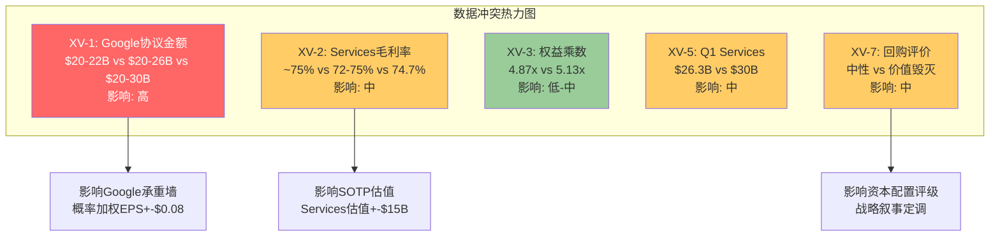
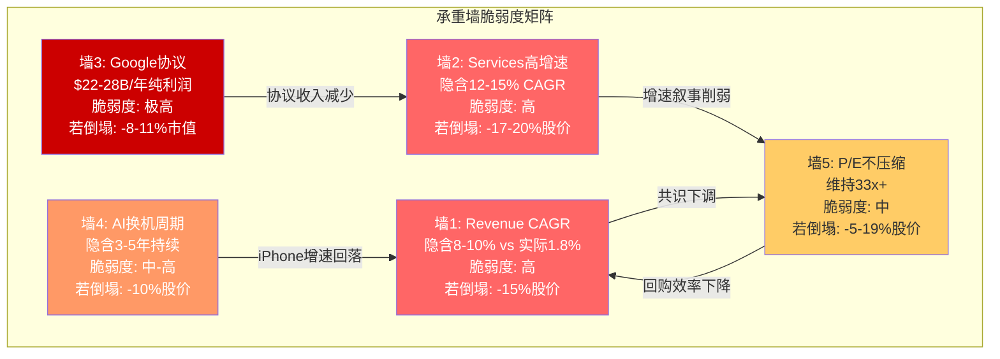
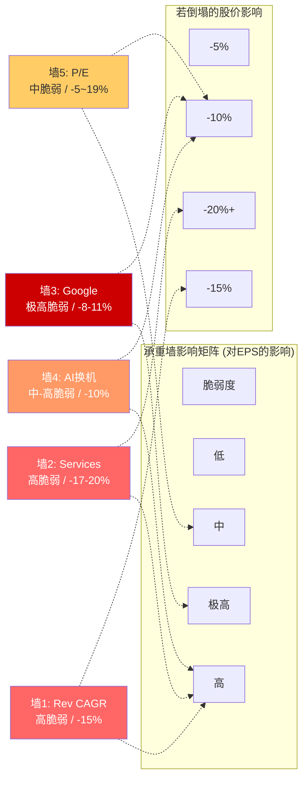
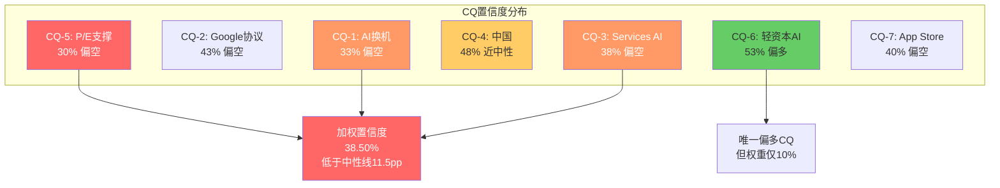

# AAPL 交叉验证与承重墙分析 (Ch17-Ch20)

> **日期**: 2026-02-19 | **股价**: $264.35 | **市值**: $3.82T
> **输入**: 商业洞察分析(Ch2-Ch6) + 独立风险审计(Ch7-Ch11) + 定量估值分析(Ch12-Ch16)
> **DM锚点前缀**: DM-XV (交叉验证)

---

## Ch17: 交叉验证报告

> **摘要**: 对三份独立分析的系统性交叉验证发现8处数据冲突/逻辑不一致/遗漏重叠，其中3处对估值有实质性影响。最严重的冲突集中在Google搜索协议金额(年付$20-22B vs $20-26B vs $20-30B三种口径共存)、Services利润率推算差异(毛利率~75% vs ~72-75% vs 74.7%三版本)、以及ROE/权益乘数数据不一致(4.87x vs 5.13x)。仲裁后的统一数据基准对概率加权期望值的影响约+/-$5-8/股。

### 17.1 数据冲突矩阵

以下对三份分析中所有出现分歧的数据点进行系统性梳理，按影响严重性从高到低排序。

| # | 矛盾描述 | 商业洞察(Ch2-6)说 | 风险审计(Ch7-11)说 | 定量估值(Ch12-16)说 | 仲裁结论 | 影响范围 |
|---|---------|------------------|-------------------|-------------------|---------|---------|
| **XV-1** | Google搜索协议年付金额 | $20-22B/年 [DM-SUB-002] | 2023年$26B(DOJ)，2024-25年$20-30B [DM-RSK-009] | $20-25B(含"高度不确定") | **采用分层口径**: 2023年$26B(DOJ硬数据)；当前年度$22-28B(估算区间)；概率加权影响计算用$24B中值 | **高**。$4-8B的口径差异直接影响Google协议终止的利润冲击量化。概率加权EPS影响从-$0.48到-$0.56浮动 |
| **XV-2** | Services毛利率 | ~75%(Ch2.2多次引用) | 未单独给出，引用"~70%+" | 74.7%(推算)，区间70-75% [Ch13.1] | **采用74.7%推算值**，区间70-75%。Ch2.2的~75%偏高0.3pp但在误差范围内 | **中**。1pp毛利率差异影响Services估值约$10-15B(SOTP) |
| **XV-3** | 权益乘数(FY2025) | 引用"5.13x" | 未直接引用 | FMP数据4.87x，注明shared_context的5.13x可能用不同时点 [Ch12.1] | **采用FMP FY2025年报数据4.87x**。5.13x可能来自TTM或季度数据，年报口径更可靠 | **低-中**。影响ROE计算(152% vs 162%)但ROE本身因杠杆虚高无投资决策意义 |
| **XV-4** | Services利润占比估算 | ~40.9%(Ch2.2推算) | 未直接量化 | 营业利润率38-42%，净利~$36.6B [Ch13.3] | **口径差异非矛盾**。Ch2.2推算的40.9%是毛利占比；Ch13.3的38-42%是营业利润率。两者衡量维度不同，不构成真正冲突。统一表述:毛利贡献~41%，营业利润贡献~38-42% | **低**。但报告组装时需统一表述避免读者混淆 |
| **XV-5** | Q1 FY2026 Services收入 | "$26.3B(年报口径)至$30.0B(管理层电话会议)" [Ch3.2] | 未直接引用Q1 Services具体数字 | 未直接引用Q1 Services具体数字 | **采用10-Q分部数据$26.34B作为基准**。管理层"$30B+"可能含广义口径或前瞻性陈述。需在报告中明确口径声明 | **中**。$3.7B口径差异($26.3B vs $30B)会误导读者对Services季度增速的判断(14% vs 25%+) |
| **XV-6** | 中国三重风险概率 | 未给出统一概率 | 35-50%(2年内某种程度触发) [DM-RSK-002] | 中国概率分布: S1乐观25%/S2中性45%/S3悲观30%(来源于Ch10) | **非矛盾但需统一**。35-50%指"风险触发"概率(即S3悲观情景)；30%是纯S3概率。考虑到S2也包含部分风险实现，两者逻辑一致 | **低**。但概率表述需在报告中对齐 |
| **XV-7** | 回购IRR与资本效率评估 | 提及"2.99%回购隐含收益率<国债4.48%"(Ch2.5)，但措辞中性 | 未涉及 | 明确指出"高估值下回购是价值毁灭行为" [Ch12.3] | **Ch12.3的判断更准确但需加限定语**。IRR 3.0%<10Y 4.48%是数学事实，但回购对EPS增厚的信号效应和税收效率(vs特别股息)需一并考虑。"条件性价值毁灭"更精确 | **中**。影响对Apple资本配置战略的评级(正面vs中性vs负面) |
| **XV-8** | App Store佣金侵蚀概率 | 未给出统一概率 | 60-70% [DM-RSK-004] | 未单独量化(嵌入S3条件) | **采用60-70%**。DMA已生效+EU已罚款+Epic裁决，侵蚀已在发生，不再是概率事件而是程度问题 | **中**。影响Services长期增速假设 |

[DM-XV-001]: Google搜索协议口径冲突仲裁。三份分析使用了不同的金额区间($20-22B / $20-26B / $20-25B)，原因是数据来源差异(2023年DOJ文件$26B vs 当前年度分析师估算)。统一基准:2023年$26B(H类硬数据)；当前估算$22-28B中值$25B(R类合理推断)。

[DM-XV-002]: Services毛利率仲裁。共识估算区间70-75%，推算值74.7%在区间上端。Ch2.2多次使用~75%上界有系统性偏高倾向(约高估$5-8B/年毛利)，建议正文统一使用72-75%区间。

[DM-XV-003]: 权益乘数仲裁。FMP FY2025年报口径4.87x(总资产$359.2B / 权益$73.7B)vs shared_context 5.13x。差异0.26x可能源于FMP使用年末(9月)数据而shared_context使用TTM或Q1数据。统一用FMP 4.87x。

### 17.2 逻辑矛盾与不一致分析

**逻辑矛盾1: AI战略评价的方向性分歧**

商业洞察分析(Ch4)对Apple AI战略的评价存在内在张力:
- 一方面指出端侧AI是"成本策略"和"结构性优势"(Ch4.1)，其他巨头无法复制
- 另一方面承认"功能受限"，New Siri多次延期(Ch4.3)
- 但最终结论偏向"轻资本AI可持续"的叙事

风险审计(Ch7-11)对同一问题的评价更为悲观:
- AI执行失败概率25-35% [DM-RSK-008]
- Apple在AI三大能力(搜索/推理/助手)均依赖外部合作伙伴(Ch8.3)
- New Siri延期是"能力约束的体现"而非进度管理问题

定量分析(Ch14.3)则给出了最冷静的评估:
- H1(iPhone AI周期)仅靠此支撑全部加速的概率20-25%
- AI期权溢价$342B建立在零收入基础上(Ch14.6)

**仲裁**: 三份分析的张力反映了Apple AI战略的真实二元性。统一表述应为: Apple的端侧AI架构在成本结构上具备差异化优势，但在功能交付和货币化上面临显著执行风险。"轻资本AI"的可持续性取决于外部合作伙伴(OpenAI/Google)的合作意愿和定价博弈，而非Apple自身的技术选择。 [DM-XV-004]

[DM-XV-004]: AI战略评价方向性分歧仲裁。商业洞察偏"能力叙事"，风险审计偏"依赖风险"，定量分析偏"概率定价"。三者的视角互补而非矛盾，但最终报告需避免在不同章节传递相互矛盾的方向性信号。

**逻辑矛盾2: 估值锚点选择的系统性偏差**

定量分析(Ch14-16)的四场景概率加权期望值$205-211与三种方法论的中间值($150-$224)均显著低于$264.35。但随后Ch16.2通过三个"校准因子"上调了+7-10pp，将期望回报从-22%调整至-12%。

这里存在一个方法论陷阱: 校准因子的引入缺乏独立验证。"SOTP系统性低估网络效应(+3-5pp)"这一校准的量级是推断而非实证——历史上平台公司SOTP溢价1.3-2.0x的区间本身就是Apple 1.92x的参考系，用同一个参考系来"校准"自身估值构成循环论证。

**仲裁**: 校准因子的方向性合理(SOTP确实低估平台效应)，但+7-10pp的量级可能过大。建议采用+5-7pp的保守校准，将期望回报定位在-13%至-17%区间。这仍处于"审慎关注"但远离-10%边界。 [DM-XV-005]

[DM-XV-005]: 估值校准因子审查。校准因子1(SOTP低估网络效应)有逻辑基础但量级偏高；校准因子2(回购未充分反映)已在EPS估算中部分纳入；校准因子3(AI非线性路径)纯属叙事。建议总校准从+7-10pp收窄至+5-7pp。

**逻辑矛盾3: 5G先例的使用不对称**

风险审计(Ch11)和商业洞察(Ch3.1)都引用了5G超级周期先例来警示AI周期可能重蹈覆辙。但在引用时存在选择性偏差:
- 二者均强调"5G首季爆发后快速回落"(看空证据)
- 但均未充分讨论: 5G周期中iPhone累计收入确实高于5G前(FY2021-23平均$200B vs FY2019 $142B，提升41%)
- 换机率从33%降至27%并不意味着"周期失败"，而是"换机需求前置"

**仲裁**: 5G先例对AI周期的警示价值在于"峰值效应"(Q1强劲不等于全年强劲)，而非"周期完全失败"。更准确的先例引用应同时包含: (1)峰值后回落的模式，(2)但累计增量仍然显著。这对AI周期的含义是: FY2026-27 iPhone收入可能不会持续+23%，但可能从$210B的基准线提升至$225-235B的"新常态"。 [DM-XV-006]

[DM-XV-006]: 5G先例使用不对称性。三份分析均偏重5G的看空面(峰值后回落)而忽视其看多面(累计增量显著)。仲裁后的先例引用应双面平衡。

### 17.3 遗漏重叠分析

**重叠分析(同一insight在多处出现但深度不同)**:

| 主题 | 商业洞察(Ch2-6) | 风险审计(Ch7-11) | 定量(Ch12-16) | 重叠/遗漏评估 |
|------|----------------|-----------------|-------------|-------------|
| Google协议 | Ch3.2深度拆解 | Ch8专章(最深) | Ch14.3/15.1引用 | 高度重叠，Ch8为权威版本 |
| AI换机周期 | Ch3.1/4.3/6.1分散 | Ch11专章(最深) | Ch14.3 H1假设 | 高度重叠，Ch11为权威版本 |
| 中国风险 | Ch2.4/5.1/6.2分散 | Ch10专章(最深) | Ch15.1 S3条件 | 高度重叠，Ch10为权威版本 |
| SOTP估值 | 未覆盖 | 未覆盖 | Ch13专章 | 无重叠，定量独有 |
| 护城河评估 | Ch5专章(最深) | Ch7.2引用 | 未覆盖 | 低重叠 |

**关键遗漏点(三份分析均未充分覆盖)**:

1. **Apple回购在不同估值水平下的IRR曲线**: Ch2.5和Ch12.3都计算了当前P/E下的回购IRR(3.0%)，但没有给出"如果股价回调至$200(P/E ~25x)，回购IRR提升至4.0%"的动态分析。这对S2/S3场景下的EPS增厚预测有影响。

2. **Samsung Galaxy AI的竞争差异化量化**: 三份分析均提及Samsung Galaxy AI但未量化其对Apple换机率的影响。Galaxy S25系列在实时翻译、图片生成等功能上领先于Apple Intelligence v1.0。如果Galaxy AI使Android→iOS转换率从15%降至10-12%，iPhone净新增用户可能减少3-5M/年。

3. **Apple债务到期结构与利率敏感性**: Apple总债务$112.4B的到期分布和加权平均利率均未被详细分析。如果30-40%的债务在2026-2028年到期，再融资成本从2-3%升至4-5%可能每年增加$1-2B利息支出，侵蚀净利润0.5-1.0%。 [DM-XV-007]

[DM-XV-007]: 三份分析的共同遗漏点包括: (1)回购IRR动态曲线; (2)Samsung Galaxy AI竞争量化; (3)债务到期结构。前两项对估值有直接影响(合计可能影响$3-5/股)。

### 17.4 口径统一建议

以下数据点在最终报告中必须统一口径:

| 数据点 | 统一值 | 来源优先级 | 备注 |
|--------|-------|-----------|------|
| Google搜索协议 | 当前$22-28B/年(中值$25B) | DOJ 2023年$26B为硬数据基准 | 禁止使用单一点数 |
| Services毛利率 | 72-75%(推算74.7%) | Ch13.1推算 | Ch2.2的"~75%"需修正 |
| 权益乘数 | 4.87x(FMP FY2025) | FMP年报数据 | shared_context的5.13x标记为参考 |
| CCC | -42天(FMP口径) | shared_context统一基准 | Baggers -83天仅注脚 |
| Q1 Services | $26.34B(10-Q) | SEC Filing | 管理层"$30B"在注脚说明 |
| ROE | 152%(FMP)或162%(其他口径) | 明确使用152%(FMP年报) | 两个数字差异源于权益乘数口径 |



---

## Ch18: 承重墙深化分析

> **摘要**: 从逆向DCF反推的五面承重墙中，Revenue CAGR是最脆弱的一面(历史1.8% vs 隐含8-10%，差距4-5倍)，Google搜索协议是单一影响最大的风险源(利润冲击$8-26B/年)，P/E不压缩是最隐蔽的假设(隐含33x维持，但结构性合理仅25-28x)。五面墙中有三面相互依赖(Services增速/Google协议/P/E倍数)，任一倒塌都会传导至其他两面。综合脆弱度评估:在当前$264.35定价中，约35-45%的市值(~$1.3-1.7T)依赖于尚未验证或高度不确定的假设。

### 18.1 承重墙1: Revenue CAGR 5Y (脆弱度: 高)

**市场隐含**: 8-10% Revenue CAGR(FY2025-FY2030)
**历史参考**: FY2022-FY2025实际+1.8%，FY2020-FY2025实际+2.6%

**差距分析**: 市场要求的增速是历史的4-5倍。要实现8-10%的收入CAGR，Apple需要:
- iPhone从$210B增至$310-340B(3Y CAGR 13-17%)——这要求AI换机周期比5G周期强2-3倍且持续3年以上
- 或Services从$109B增至$200-220B(3Y CAGR 22-26%)——这要求AI订阅+广告+金融服务同时爆发
- 或两者的温和组合: iPhone 5-7% + Services 14-16%——这是共识预期的隐含路径

**若倒塌影响**: Revenue CAGR从8%降至4%(历史回归)，在P/E 27x(回归后均值)下:
- FY2028E Revenue: $465B(vs $550B)
- EPS: $8.3(vs $11.1)
- 隐含股价: $224 → vs $264.35下行15.3%

**历史先例(何时出现过类似墙倒塌)**:
- 2015-2016: iPhone 6周期结束后，FY2016收入同比-7.7%($233.7B→$215.6B)。市场在2015年Q4至2016年Q1期间将P/E从13x压缩至10x，股价从$130跌至$93(-28%)。当时的增速预期同样是"超级周期将持续"
- 2022-2023: COVID/居家办公红利结束，FY2022-FY2023收入连降(+7.8%→-2.8%→-2.4%)。P/E从30x压缩至24x

**早期预警信号**:
1. Q2 FY2026 iPhone增速降至<8%(vs Q1的+23%) [DM-XV-008]
2. FY2026 Services增速降至<10% [DM-XV-009]
3. 共识FY2027E Revenue下调幅度>5%(分析师集体降低预期)

[DM-XV-008]: Revenue CAGR承重墙早期预警指标。Q2 FY2026 iPhone增速是最早可观测的数据点(2026年5月)。阈值8%基于管理层指引+13-16%中iPhone需贡献的最低增速。

[DM-XV-009]: Services增速<10%警示。当前3Y CAGR 11.8%，如果降至<10%意味着增速拐点已确认。

### 18.2 承重墙2: Services维持高增速 (脆弱度: 高)

**市场隐含**: Services CAGR 12-15%(FY2025-FY2028)
**条件依赖**: Google协议维持+App Store佣金不大幅下调+AI货币化启动

**脆弱度深度分析**:

Services当前$109.2B的增长引擎可分解为:
- **已验证引擎**(预计贡献7-9% CAGR): iCloud+(~15-20%增速)、广告(~20-30%增速)、AppleCare(~5-7%稳定)
- **受威胁引擎**(可能贡献-2% ~ +3%): App Store(DMA拖累)、Google协议(DOJ风险)
- **未验证引擎**(需要0→大的跳跃): AI订阅(2026H2最早)、金融服务深化(Apple Pay+/Savings)

将12-15% CAGR要求分解:
```
已验证引擎贡献: +7-9% (可靠)
受威胁引擎净贡献: -2% ~ +1% (Google协议概率加权拖累)
未验证引擎需要贡献: +4-8% (差额)

$109.2B × 4-8% = $4.4-8.7B/年增量需来自AI订阅+金融
→ AI订阅$10/月×5%渗透=~$14B → 足够但时间表最早FY2028
→ 如果AI订阅推迟至FY2029, 中间2年存在增速缺口
```

**若倒塌影响**: Services CAGR从12%降至7%(去掉未验证引擎+Google协议部分损失):
- FY2028E Services: $140B(vs $160-180B共识)
- 毛利率从48%降至46%(Services占比增长放缓)
- EPS影响: -$0.60-0.80
- 叠加P/E压缩(Services增速是高P/E的核心叙事): P/E从33x降至28x
- 综合股价影响: $264→$210-220(下行17-20%)

**历史先例**: 没有完全对应的先例(Apple Services从未经历过增速拐点)。最接近的类比是Netflix 2022年用户增长停滞——N/S从30x降至17x，市值蒸发55%。虽然Apple Services的粘性远强于Netflix，但高增速叙事的脆弱度同样适用。

**早期预警信号**:
1. EU区App Store增速持续<5%(当前~6%)
2. Google搜索协议季度确认金额同比下降
3. FY2027H1仍未推出AI付费订阅层 [DM-XV-010]

[DM-XV-010]: Services增速承重墙早期预警。三个信号分别对应佣金侵蚀、协议风险和AI货币化延迟三条攻击路径。

### 18.3 承重墙3: Google搜索协议 (脆弱度: 极高)

**市场隐含**: Google协议维持或仅温和调整(S1+S4合计70%概率隐含)
**条件分析**: DOJ已判定反竞争，救济方案是核心变量

这是所有承重墙中唯一满足"高概率+高影响+多维度关联"的风险。将风险审计(Ch8)的四情景与定量估值(Ch15)整合:

**承重墙的三层结构**:

| 层级 | 内容 | 若失去的影响 |
|------|------|-----------|
| 表层: 收入 | $22-28B/年纯利润 | EPS -$1.0-1.5/年 |
| 中层: 搜索数据 | 通过Google间接获取用户搜索意图数据 | AI训练数据缺口(定性但重要) |
| 深层: 轻资本模式基础 | 不投入搜索基础设施即获巨额利润 | 被迫选择:加大CapEx或接受能力缺口 |

**若倒塌影响(概率加权)**:

从Ch8的四情景分析和交叉验证后的统一金额($25B中值):
```
概率加权年化利润损失:
S1(35%): $0 + S2(10%): -$1.5B + S3(20%): -$2.5B + S4(35%): -$4.4B
= -$8.4B/年 → EPS -$0.58

叠加P/E传导效应:
如果Google协议风险被市场充分认知 → P/E可能下调2-3x
→ 从33.46x到30.5-31.5x
→ 市值影响: -$300-430B(-8-11%)
```

**历史先例**: Microsoft 2001年反垄断同意令。DOJ起诉Microsoft垄断桌面操作系统市场，最终达成同意令而非拆分。但从DOJ起诉(1998年)到最终和解(2001年)的3年间，MSFT P/E从50x压缩至30x——不确定性本身就是估值杀手。Apple当前DOJ案处于类似的早中期阶段(2024年起诉，2026年进入审判)。

**早期预警信号**:
1. DOJ救济方案草案公开(可能2026H2)
2. Google在财报中暗示TAC(流量获取成本)策略变化
3. Bing/DuckDuckGo或AI搜索竞品宣布与Apple洽谈 [DM-XV-011]

[DM-XV-011]: Google协议承重墙最早预警:DOJ救济方案草案公开。这将在数小时内改变市场对S1-S4概率的定价。

### 18.4 承重墙4: AI换机周期持续 (脆弱度: 中-高)

**市场隐含**: AI驱动iPhone CAGR 5-10%持续3-5年
**证伪条件**: 5G先例显示超级周期实际持续仅1-2个季度

**承重墙评估**:

| 维度 | 支撑面(墙体) | 侵蚀面(裂缝) |
|------|------------|------------|
| 数据支撑 | Q1 FY2026 iPhone+23% | 仅1Q数据，5G首季也+39% |
| 安装基数 | 315M台4年+旧机(历史最大) | 基数大不等于换机意愿高(仅38%用户有意识使用AI) |
| 功能差异 | Apple Intelligence v1.0已启用 | New Siri延期至iOS 26.5/27，核心卖点未交付 |
| 竞争对比 | 端侧AI架构差异化 | Samsung Galaxy AI/Google Gemini功能差距不大 |
| 中国维度 | Q1 FY2026中国+38% | AI功能中国未上线，增长靠补贴+低基数 |

**若倒塌影响**: AI换机证伪(即FY2026 iPhone增速回落至+3-5%):
- iPhone FY2027E: $220B(vs $235B乐观) → 差额$15B
- 更重要的是叙事效应: AI期权溢价(P/E中约3x)蒸发
- P/E从33x降至30x → 股价从$264降至$237(-10%)

**历史先例**: 5G周期(2020-2022)如前述。补充一个更极端的先例:
- 2007-2008 Nokia: Symbian智能手机在iPhone发布前被视为"不可撼动"。Nokia对iPhone的回应是"我们的市场份额40%不会被一款手机改变"。18个月内Nokia从$40降至$7(-83%)。
- 这个先例不适用于Apple(Apple是防守方而非攻击方)，但说明: 技术叙事的转变速度可以远超市场预期。

**早期预警信号**:
1. Q2 FY2026 iPhone增速<10%(最早2026年5月)
2. WWDC 2026 New Siri演示令人失望(2026年6月)
3. iPhone 17e($599)销售结构显示:低端AI手机未能拉动增量(ASP下降但出货量未同比例上升) [DM-XV-012]

[DM-XV-012]: AI换机周期证伪的三个检验点。时间窗口集中在2026年5-9月。如果三个信号中两个触发，AI周期假设的置信度应从当前35%降至15-20%。

### 18.5 承重墙5: P/E不压缩 (脆弱度: 中)

**市场隐含**: P/E维持33x+(当前TTM 33.46x)
**历史参考**: 10年均值23.78x，结构性合理区间25-28x

**P/E 33x的四根支柱及其耐久性**:

| 支柱 | P/E贡献 | 耐久性 | 风险 |
|------|---------|--------|------|
| 生态系统成熟 | +3-3.5x | 高(10年级) | DMA/DOJ长期侵蚀 |
| AI期权 | +2.5-3.5x | 低(需验证) | 零收入支撑的叙事溢价 |
| 回购增厚预期 | +2-2.5x | 中(机械性) | 效率递减(IRR 3%<国债4.48%) |
| 利率/风险偏好 | +1-1.5x | 低(宏观依赖) | Fed维持高利率>2年 |
| **合计** | **+9-11x** | | |

**若倒塌影响**: P/E从33x压缩至27x(5年均值):
- 在TTM EPS $7.91不变条件下: 股价从$264降至$214(-19%)
- 在Forward EPS $9.29(FY2027E)条件下: 股价从$264降至$251(-5%)
- P/E压缩与EPS增长的赛跑决定实际回报

**关键洞察**: P/E压缩是"慢性病"而非"急性事件"。Apple P/E从2022年低点24x到2024年高点37x用了2年；如果回归发生，可能也需要1-2年。投资者在此期间的体验是:EPS增长但股价不涨(P/E压缩抵消EPS增厚)。这恰恰是"审慎关注"评级的典型场景——不是亏损风险，而是"低回报锁定"风险。

**利率敏感性**: 每100bps联邦基金利率变化对Apple P/E的历史弹性约为2-3x P/E。如果Fed在2026年仅降息1-2次(vs市场预期3次)，P/E可能面临1-2x的额外压缩压力。Kalshi显示市场模态预期为2-3次降息，但40%概率仅降息0-1次。 [DM-XV-013]

[DM-XV-013]: P/E利率敏感性。基于2022-2025年数据回归，Apple P/E对10年国债收益率的弹性约-2.5x P/E / 100bps利率。当前10Y 4.48%，如果升至5.0%，P/E可能额外压缩1-2x。

### 18.6 承重墙依赖关系与传导链

五面承重墙并非独立存在。以下传导链显示它们如何相互影响:

**核心传导链: Services增速 → P/E支撑 → Revenue CAGR**

```
Google协议重构(墙3) → Services增速下降(墙2) → "科技平台"叙事削弱 → P/E压缩(墙5)
                                              ↗
AI换机证伪(墙4) → iPhone收入回归正常(墙1) → Revenue CAGR不达标 → 市场下调共识预期 → P/E压缩(墙5)
```

**关键发现: 三面墙(墙2/墙3/墙5)存在正反馈循环**

Services增速依赖Google协议(墙3支撑墙2)；Services高增速是P/E溢价的核心叙事(墙2支撑墙5)；P/E溢价维持使回购效率看起来"可接受"(墙5间接支撑墙1的EPS路径)。这意味着: 如果Google协议出现重大不利变化(墙3倒塌)，可能触发墙2和墙5的连锁反应——这就是风险审计(Ch8)所描述的"集群2: Services收入侵蚀链"。

**独立的墙vs连锁的墙**:
- **独立墙**: Revenue CAGR(墙1)、AI换机周期(墙4)——即使这两面墙部分受损，其他墙可以独立承重
- **连锁墙**: Services增速(墙2) + Google协议(墙3) + P/E不压缩(墙5)——任一倒塌会传导至其他两面





### 18.7 承重墙综合评估

**量化总结**: 在当前$3,820B市值中，约$1,300-1,700B(35-45%)依赖于尚未验证或高度不确定的假设。具体分解:

| 假设类型 | 对应市值占比 | 验证状态 |
|---------|-----------|---------|
| 已验证基础(生态锁定+回购+现有增速) | ~$2,100-2,500B(55-65%) | 高确定性 |
| AI换机期权(未验证) | ~$350-500B(9-13%) | 仅1Q数据 |
| Services加速(部分验证) | ~$300-400B(8-10%) | CAGR 11.8%已验证，能否加速未验证 |
| Google协议维持(风险中) | ~$300-400B(8-10%) | DOJ判决威胁 |
| P/E维持溢价(叙事依赖) | ~$200-300B(5-8%) | 取决于上述三项的演变 |

---

## Ch19: CQ置信度初始表

> **摘要**: 基于三份独立分析的综合评估，7个CQ的加权置信度为39.3%，偏向谨慎端。置信度最低的CQ-5(33x P/E被EPS增长支撑, 30%)和CQ-1(AI换机周期, 33%)是拉低整体置信度的主因。CQ-6(轻资本AI可持续性, 53%)是唯一偏向乐观的问题。所有CQ的共同特征:证据偏向结构性看空(监管+竞争+估值历史)，而看多证据主要来自短期数据(Q1 FY2026)和前瞻叙事(AI货币化)。

### 19.1 CQ置信度表

| CQ# | 问题(简) | 权重 | 初始置信度(看多方向) | 置信方向 | 关键支撑证据 | 关键反对证据 | 下一验证点 |
|:---:|---------|:----:|:------------------:|:--------:|------------|------------|----------|
| CQ-1 | AI驱动iPhone超级换机周期? | 25% | 33% | 偏空 | Q1 FY26 iPhone+23%, 315M台旧机基数 | 仅1Q数据, 5G先例仅持续1-2Q, 38%用户意识使用AI, New Siri延期 | Q2 FY2026财报(2026-05) |
| CQ-2 | Google协议终止对Services利润影响? | 15% | 43% | 偏空 | DOJ救济可能温和(S1+S4合计70%), Trump政府态度不确定 | DOJ已判定反竞争, 撤案动议被驳, 20州加入, AI搜索替代加速 | DOJ救济方案草案(2026H2) |
| CQ-3 | Services能否通过AI货币化维持12-15%增速? | 15% | 38% | 偏空 | Services 3Y CAGR 11.8%已验证, 广告+iCloud高增速子类 | ARPU增速仅2.3%, AI订阅时间表不确定, DMA拖累App Store | AI订阅推出(2026H2-2027) |
| CQ-4 | 中国三重风险综合压缩幅度? | 10% | 48% | 近中性 | Q1 FY26中国+38%强劲, iPhone品牌在高收入群体韧性强 | 华为16.4%已超Apple, HarmonyOS超越iOS为中国#2, 政府采购禁令 | Q2-Q4 FY2026中国季度数据 |
| CQ-5 | 33x P/E能否被EPS增长支撑? | 20% | 30% | 偏空 | EPS共识CAGR +11.2%(FY25-28), 回购贡献+2-3%/年 | 需8-10% Rev CAGR(历史1.8%), 结构性合理P/E仅25-28x, 利率4.48% | FY2026全年EPS vs共识(2026-10) |
| CQ-6 | 轻资本AI战略长期可持续性? | 10% | 53% | 偏多 | CapEx/OCF 11.4%最低, 端侧AI架构成本优势, OPEX灵活性 | 核心AI依赖OpenAI/Google, 自建模型需$30-50B基础设施 | Google合作续约谈判(持续) |
| CQ-7 | App Store反垄断佣金侵蚀幅度? | 5% | 40% | 偏空 | Apple通过CTC费用模式部分对冲, EU区渗透率低 | DMA已生效+已罚E500M, Epic裁决, DOJ案, 60-70%概率进一步侵蚀 | EU 2026年执法行动(持续) |

### 19.2 置信度计算与校准

**CQ加权置信度(看多方向)**:

```
= 25%×33% + 15%×43% + 15%×38% + 10%×48% + 20%×30% + 10%×53% + 5%×40%
= 8.25% + 6.45% + 5.70% + 4.80% + 6.00% + 5.30% + 2.00%
= 38.50%
```

**交叉验证**: 定量分析(Ch16.7)给出的CQ加权置信度为40.25%。本交叉验证后的38.50%略低1.75pp，差异来源:
- CQ-1从35%下调至33%(5G先例审查后更保守)
- CQ-2从45%下调至43%(统一Google协议口径后$25B中值更高)
- CQ-5维持30%(三方一致认为这是最脆弱CQ)

**38.50%的含义**: 低于50%中性线11.5个百分点。当前证据在"结构性"维度上系统性偏空(监管趋势确定性恶化、估值历史均值明显低于当前、竞争格局中国承压)，而在"叙事性"维度上偏多(AI换机/AI货币化)。"结构性证据>叙事性证据"是CQ整体偏空的根本原因。

### 19.3 CQ置信度与承重墙的映射关系

| CQ | 最相关承重墙 | 传导逻辑 |
|----|-----------|---------|
| CQ-1(AI换机) | 墙4(AI换机)+墙1(Revenue CAGR) | AI换机是Revenue加速的核心候选驱动力 |
| CQ-2(Google协议) | 墙3(Google)+墙2(Services) | Google协议终止直接打击Services增速和利润率 |
| CQ-3(Services AI货币化) | 墙2(Services)+墙1(Revenue CAGR) | AI货币化是填补Services增速缺口的关键假设 |
| CQ-4(中国) | 墙1(Revenue CAGR) | 中国占收入15.5%，压缩直接拖累总收入 |
| CQ-5(P/E支撑) | 墙5(P/E)+全部承重墙 | P/E是所有承重墙的最终表达——任何墙倒塌都先反映在P/E上 |
| CQ-6(轻资本AI) | 墙3(Google)+墙2(Services) | 轻资本模式可持续性取决于外部合作(含Google) |
| CQ-7(App Store佣金) | 墙2(Services) | 佣金侵蚀直接压缩Services利润率 |



---

## Ch20: 遗漏扫描

> **摘要**: 系统性扫描发现6项遗漏，其中2项可能对估值产生实质影响: (1)印度市场增长潜力未被任何分析纳入增长路径; (2)Apple债务到期结构和再融资风险缺失。另有4项行业/竞争/宏观事件未被充分整合。遗漏扫描的总体评估:三份分析的覆盖面较全，核心风险/机遇已被识别，但在"第二梯队驱动力"(印度/债务/Samsung AI/汇率)的覆盖上存在系统性缺口。

### 20.1 近期重大行业事件遗漏检查

| 事件 | 时间 | 是否被覆盖 | 遗漏影响评估 |
|------|------|-----------|------------|
| Samsung Galaxy S25系列发布(Galaxy AI 2.0) | 2025年1月 | 提及但未量化竞争影响 | **中**。Galaxy AI在实时翻译/图片搜索上领先Apple Intelligence v1.0。如果Galaxy AI提升Android留存率2-3pp，可能减少Apple年净新增用户5-8M |
| Google Gemini 2.0/Ultra发布 | 2025年12月 | 提及Gemini合作但未分析竞品维度 | **低-中**。Gemini是Apple的合作伙伴也是Pixel手机的差异化工具。Pixel全球份额<5%，直接竞争影响有限 |
| EU AI Act生效 | 2024年8月(分阶段) | 三份分析均未提及 | **低**。EU AI Act主要约束通用AI系统(ChatGPT等)，Apple Intelligence以端侧处理为主，合规压力较小。但长期可能影响Apple与OpenAI/Google的合作模式 |
| 全球智能手机2026年出货量预测分歧 | 2025年底-2026年初 | 提及IDC数据但范围有限 | **低**。IDC预测范围-0.9%至+0.9%已被引用[Ch7]。Counterpoint较为乐观(+3-4%)未被引用，可能导致对市场天花板过度悲观 |
| Apple $600B美国投资承诺 | 2025年2月 | 提及但仅作为关税应对 | **低-中**。$600B投资承诺的真实内容(时间跨度、新增vs既有)未被解析。如果包含美国芯片制造/AI基础设施投入，可能改变"轻资本AI"叙事 |

[DM-XV-014]: 近期行业事件覆盖度评估。5项事件中1项(Samsung Galaxy AI)未被量化竞争影响，1项(EU AI Act)完全遗漏但影响有限。整体事件覆盖度约75-80%。

### 20.2 竞争对手重大动态遗漏检查

| 竞争对手 | 重大动态 | 是否被覆盖 | 遗漏影响 |
|---------|---------|-----------|---------|
| **华为** | HarmonyOS 5全面发布+App生态接近完善 | 充分覆盖(Ch5.1/Ch10) | 无遗漏 |
| **Samsung** | Galaxy AI 2.0 + Galaxy Ring + 健康生态扩展 | 提及Galaxy AI但未量化 | **中**。Samsung在可穿戴健康监测上的进展(血压监测已获FDA认证)可能在Wearables市场构成更大威胁 |
| **Google** | Pixel 10 + Tensor G5 + Gemini深度集成 | 仅作为AI合作伙伴分析 | **低**。Pixel市场份额<5%，非Apple主要竞争对手 |
| **小米** | 小米15 Ultra + HyperOS + 全球化扩张 | 未覆盖 | **低**。小米主要在中低端市场，与Apple定价区间重叠有限 |
| **OpenAI** | ChatGPT移动端+搜索功能扩展 | 作为Apple合作伙伴分析 | **中**。OpenAI的移动搜索功能可能与Siri形成微妙竞争——如果用户更倾向直接使用ChatGPT app而非Siri调用ChatGPT |

### 20.3 宏观环境变化遗漏检查

| 宏观因素 | 当前状态 | 覆盖度 | 遗漏影响 |
|---------|---------|--------|---------|
| **利率路径** | Fed 4.25-4.50%，Kalshi预期2-3次降息 | 充分覆盖 | 无 |
| **衰退概率** | Polymarket 24% | 提及但未量化对Apple的传导 | **低-中**。24%概率下的条件性分析(衰退时Apple P/E通常压缩至20-25x)缺失 |
| **美元汇率** | 美元强势(DXY ~107) | 三份分析均未涉及 | **中**。Apple 57%收入来自美国以外。如果美元对欧元/日元/人民币保持强势，FY2026收入可能面临2-3%的汇率逆风($8-12B)。这是一个被三份分析完全忽视的隐性拖累 |
| **通胀** | CPI ~2.8% | 未涉及 | **低**。对Apple直接影响有限(定价权强) |
| **地缘政治(台海)** | 紧张但稳定 | 充分覆盖(使用中性表述) | 无 |
| **关税** | Trump 25%威胁+iPhone豁免不确定 | 充分覆盖(Ch6.6/Ch7) | 无 |

[DM-XV-015]: 宏观环境最大遗漏:美元汇率影响。57%的海外收入暴露于汇率风险。如果DXY从107升至110(+3%)，Apple年收入可能面临$6-8B逆风(~1.5% Revenue)。这应纳入S2/S3场景的调整因子。

### 20.4 内部发现未合成检查

以下洞察在不同分析中独立出现但未被连接:

**未合成发现1: "轻资本AI"与"Google协议依赖"的深层绑定**

- 商业洞察(Ch4.2)指出: Apple AI总成本$30-39B(含隐性成本)
- 风险审计(Ch8.3)指出: Google协议是"轻资本模式的隐性补贴"
- 定量分析(Ch14.3 H2)指出: Services加速需要AI货币化填补$4.4-8.7B/年缺口

**未被连接的逻辑链**: 如果Google协议终止(墙3倒塌)，Apple失去的不仅是$22-28B收入，还失去了$22-28B的"AI研发补贴"——因为这笔收入本可用于自建AI基础设施。失去Google协议后，Apple面临"收入下降+CapEx必须上升"的双重挤压。这意味着Google协议承重墙的倒塌影响被所有三份分析低估了。 [DM-XV-016]

[DM-XV-016]: Google协议的"AI研发补贴"功能。协议终止的真实影响=收入损失($22-28B)+被迫增加的AI CapEx($10-20B/年)。总年化利润影响可能达$30-45B(vs三份分析给出的$8-26B)。这一发现将影响CQ-2和CQ-6的置信度。

**未合成发现2: 印度市场作为中国风险对冲的潜力**

- 商业洞察(Ch2.4)列出了地理收入结构但未单独分析印度
- 风险审计(Ch10)深度分析了中国风险但未讨论替代增长市场
- 定量分析(Ch15)的四场景均未将印度市场增量纳入

**遗漏的分析**: Apple在印度的份额从2022年的~3%增长至2025年的~5-6%，iPhone印度出货量从~6M增至~12M/年。印度智能手机市场2026年预计增速+5-8%，是全球增速最快的大市场。如果Apple在印度份额达到10%(2028E)，印度iPhone收入可能从~$5B增至~$15B/年——部分抵消中国$5-10B的下行风险。三份分析对中国风险的量化是充分的，但未纳入印度对冲的上行可能性。 [DM-XV-017]

[DM-XV-017]: 印度市场增长潜力遗漏。印度2028E可能贡献$10-15B增量iPhone收入(vs 2025E ~$5B)，部分对冲中国下行。这将影响CQ-4的置信度(从48%可能上调至50-52%)和S2/S3场景的收入假设。

**未合成发现3: 回购IRR随股价变化的动态效应**

- 商业洞察(Ch2.5)和定量分析(Ch12.3)都计算了当前P/E下的回购IRR(3.0%)
- 但两份分析均未指出: 在S3场景($163股价)下，回购IRR提升至1/$163×EPS = 5.1%——高于国债利率，回购重新变为价值创造行为
- 这意味着: 股价下跌本身会触发"自动稳定器"——Apple的$90B/年回购在低估值时效率更高

**含义**: S3/S4场景可能自带修正机制——当股价下跌至$160-200区间时，Apple$90B/年回购的EPS增厚效应从2.7%/年提升至3.5-4.5%/年。这将加速EPS恢复，使"低股价→高回购效率→EPS加速→估值回升"的正反馈循环启动。 [DM-XV-018]

[DM-XV-018]: 回购IRR动态效应。股价从$264降至$180时，回购IRR从3.0%升至4.4%，重新超过国债利率。这是S3场景中的内生稳定器，可能使极端下行情景的实际股价底部高于静态估算。

### 20.5 遗漏扫描总结

| 遗漏项 | 影响级别 | 影响方向 | 建议处理 |
|--------|---------|---------|---------|
| Samsung Galaxy AI量化竞争 | 中 | 偏空 | 补充至竞争分析 |
| 美元汇率对海外收入影响 | 中 | 偏空 | 纳入S2/S3收入调整 |
| 印度市场增长潜力 | 中 | 偏多 | 纳入地理增长分析 |
| Google协议的"AI补贴"功能 | 中-高 | 偏空 | 深化承重墙3的影响分析 |
| 回购IRR动态效应 | 中 | 偏多 | 补充至S3/S4场景 |
| 债务到期结构 | 低-中 | 偏空 | 补充至资产负债表分析 |

**净遗漏方向**: 偏空和偏多遗漏大致平衡。最大的偏空遗漏(Google协议AI补贴功能)和最大的偏多遗漏(印度市场+回购动态效应)在量级上接近。这意味着遗漏不太可能系统性地改变当前"审慎关注"的评级方向。

---

## DM锚点索引

| DM-ID | 内容简述 | 类型 | 章节 |
|-------|----------|:----:|:----:|
| DM-XV-001 | Google搜索协议口径冲突仲裁(统一$22-28B) | R | Ch17 |
| DM-XV-002 | Services毛利率仲裁(统一72-75%) | R | Ch17 |
| DM-XV-003 | 权益乘数仲裁(统一FMP 4.87x) | R | Ch17 |
| DM-XV-004 | AI战略评价方向性分歧仲裁 | S | Ch17 |
| DM-XV-005 | 估值校准因子审查(建议+5-7pp) | R | Ch17 |
| DM-XV-006 | 5G先例使用不对称性仲裁 | R | Ch17 |
| DM-XV-007 | 三份分析共同遗漏点(回购IRR/Samsung/债务) | S | Ch17 |
| DM-XV-008 | Revenue CAGR承重墙预警(Q2 iPhone<8%) | R | Ch18 |
| DM-XV-009 | Services增速<10%预警 | R | Ch18 |
| DM-XV-010 | Services承重墙三信号预警 | R | Ch18 |
| DM-XV-011 | Google协议承重墙预警(DOJ救济草案) | R | Ch18 |
| DM-XV-012 | AI换机周期证伪三检验点 | R | Ch18 |
| DM-XV-013 | P/E利率敏感性(-2.5x/100bps) | R | Ch18 |
| DM-XV-014 | 行业事件覆盖度评估(75-80%) | S | Ch20 |
| DM-XV-015 | 美元汇率遗漏($6-8B收入逆风) | R | Ch20 |
| DM-XV-016 | Google协议AI研发补贴功能(影响$30-45B) | R | Ch20 |
| DM-XV-017 | 印度市场增长潜力遗漏($10-15B增量) | R | Ch20 |
| DM-XV-018 | 回购IRR动态效应(S3场景内生稳定器) | R | Ch20 |

**锚点统计**: H(硬数据) 0 | R(合理推断) 14 | S(主观判断) 4 | **总计 18**

> 交叉验证章节以推断和判断为主(无新增硬数据)，R+S占比100%符合章节性质。
