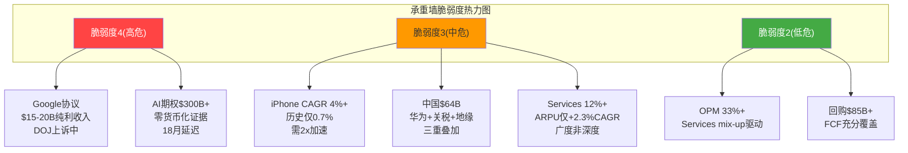
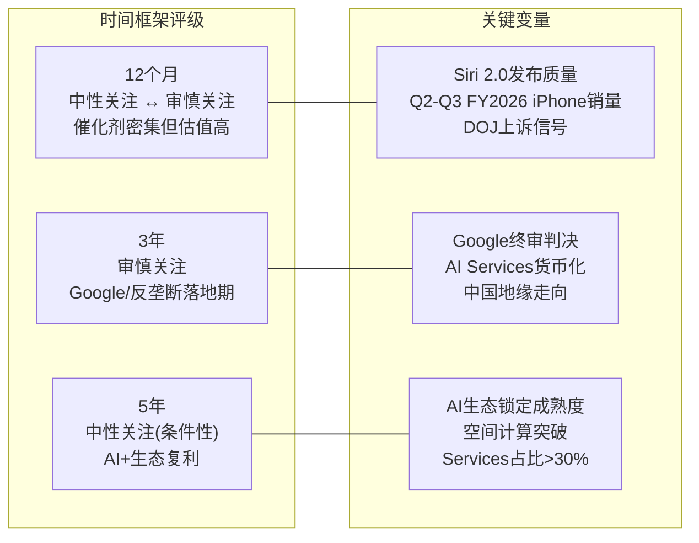

# AAPL Phase 4 — 红队对抗审查 (RT-1~RT-7 + 双向校准 + 有效性门控)

**撰写日期**: 2026-02-19 | **数据截止**: FY2026 Q1 (2025-12-27)
**股价**: $264.35 | **市值**: ~$3.90T | **P/E TTM**: 33.5x
**输入**: Agent A (Ch2-6) + Agent B (Ch7-11) + Agent C (Ch12-16) + P2交叉验证 + P2信念反演
**P1初步评级**: 审慎关注 | **概率加权EV**: $191/股 | **期望回报**: -27.8%

---

## RT-1: 承重墙脆弱度 (~3K)

### 1.1 承重墙识别与P2信念反演交叉

Agent B在Ch7.2识别了四面承重墙(KS-1至KS-4)，P2信念反演模块进一步拆解为七个隐含信念(B-1至B-7)。红队将这两套框架合并为统一的承重墙脆弱度评估。

[DM-RT-001: 承重墙脆弱度评估，综合KS-1~KS-4 + B-1~B-7分析]

### 1.2 承重墙脆弱度表

| 承重墙 | 假设内容 | 脆弱度(1-5) | 失败概率(24月) | 失败影响(每股) | 概率加权影响 |
|--------|---------|------------|---------------|---------------|-------------|
| **KS-2/B-6: Google搜索协议** | Apple-Google搜索默认协议持续，净损失<$5B/年 | **4** | 25-35% | -$40至-$77 | **-$16至-$23** |
| **B-5: AI期权价值** | 市场赋予Apple Intelligence~$300B+期权溢价合理 | **4** | 45-55% | -$20至-$27 | **-$10至-$14** |
| **KS-4/B-1: iPhone AI换机** | Apple Intelligence驱动iPhone CAGR≥4% | **3** | 25-35% | -$25至-$50 | **-$8至-$15** |
| **KS-1/B-7: 中国市场稳定** | 大中华区收入维持$60B+/年 | **3** | 20-30% | -$15至-$47 | **-$4至-$12** |
| **KS-3/B-2: Services高增速** | Services维持10-12%+ CAGR | **3** | 20-25% | -$22至-$47 | **-$5至-$11** |
| **B-3: OPM维持** | 营业利润率维持或扩张至33%+ | **2** | 10-15% | -$20 | -$2至-$3 |
| **B-4: 回购持续** | 回购维持$85B+/年 | **2** | 5-10% | -$15 | -$1至-$2 |

### 1.3 承重墙集中度评估

**承重墙集中度判断**:

承重墙呈现**双核心+三中层**结构。两面高脆弱度墙(Google协议+AI期权)合计承载了约$300B+的估值基础(占市值~8%)，且两者存在**反向关联**: Google协议面临失败的同时，AI期权恰恰需要成功来填补收入缺口。这创造了一个危险的"双向脆弱窗口"——2026年Q3至2027年是Google上诉裁决和AI货币化验证的重叠时间窗口，如果两面墙同时受压，影响将远超各自独立之和。

**被忽视的承重墙**: P1-P3分析可能低估了一面隐性承重墙——**全球宏观利率环境**。Apple 33.5x P/E对利率极为敏感。如果10年期美债收益率从4.3%升至5.5%(2026年通胀反弹情景)，ERP(股权风险溢价)不变的情况下，WACC从9.0%升至10.2%。参照Ch14敏感性矩阵，WACC从9.0%升至10.0%将导致DCF基准每股从$156降至$136(-$20/股)。Agent B在Ch7.1将利率环境列为系统性风险但未量化其P/E传导——P/E从33.5x在利率上升100bps时可能压缩至28-30x(历史回归)，叠加估值影响可达-$30至-$50/股。这一维度在Agent C的敏感性矩阵中有部分体现(WACC 10%行)，但未被纳入承重墙框架。

[DM-RT-002: 隐性承重墙——利率环境对P/E和DCF的传导]

---

## RT-2: 偏差审计 (~2K)

### 2.1 系统性偏差检测

对三个Agent的分析进行逐项偏差扫描:

[DM-RT-003: 认知偏差审计，六类偏差逐项检测]

**锚定效应 — 检出: 是**

Agent C的DCF估值链条中，FMP标准DCF $150.28被多次引用作为交叉验证。这个外部锚点可能无意中将Agent C的估值结果拉向$150附近。Agent C的基准DCF $156(WACC 9.0%)和$143(WACC 9.5%)确实围绕FMP锚点分布。**校正**: 如果剥离FMP锚定，纯粹基于Agent C自有假设的DCF范围可能更宽(可能偏高至$170-180，因为Agent C可能无意识地收紧了假设以靠近FMP)。但FMP DCF本身是独立计算，方向一致性也可能反映真实基本面而非锚定，因此偏差评级为"可能存在但影响有限"。

**确认偏误 — 检出: 是(偏空方向)**

Agent B作为"独立风险审计员"，其角色定义天然导向风险识别。Ch7-Ch11的20个DM锚点中，18个指向负面风险，2个为中性(Ch7.4 Buffett减持"也可能是接班人再平衡")。Agent B未系统性地识别"风险被市场过度定价"的可能性。例如:
- Google协议风险: Agent B赋予"终止"20%概率，但DOJ在当前政治环境(2026年新政府)下的执法力度可能弱于预期。Mehta法官的原始裁决已偏温和，上诉法院推翻下级法院remedies的历史概率约30-40%
- 中国风险: Agent B使用"三重叠加"框架(竞争+关税+地缘)放大了风险感知，但FY2026 Q1 iPhone +23%全球创纪录表现(含中国)未被充分权衡

**校正**: Agent B的系统性偏空约过度放大风险评估3-5pp。Google协议S1(维持)概率应从Agent B的40%上调至45-50%。中国基准情景的概率应从50%上调至55-60%。

**过度自信 — 检出: 部分存在**

Agent C在Ch16给出概率加权估值$191(vs市价$264)，隐含-27.8%期望回报，这意味着Agent C认为市场在Apple定价上"严重错误"。但$3.9T市值的Apple是全球最被关注的股票之一，日均交易量$10B+，覆盖分析师50+人。一个LLM分析框架发现市场"高估28%"的结论本身需要高度审慎对待。市场可能并非"错误"，而是在定价我们框架无法捕捉的因素(如生态不可替代性、避险资产属性、被动投资流入)。

**校正**: 期望回报的置信区间应被显式拓宽。-27.8%是点估计，合理的95%置信区间可能是-40%至+5%。

**叙事偏差 — 检出: 是(Agent A偏多方向)**

Agent A的Ch4(AI战略深度)和Ch6(增长催化剂)构建了一个引人入胜的"AI赋能Apple生态飞轮"叙事。催化剂表(Ch6.4)列出8个催化剂的总期望值+$50B/年——但这些催化剂之间存在显著重叠(如iPhone 17 AI周期和Services AI付费本质上是同一AI能力的不同变现通道)。简单加总可能存在15-25%的双重计算。

**校正**: 催化剂期望值从+$50B/年调整为+$38-42B/年(扣除重叠)。对应全公司有机收入增长率从8-12%下调至7-10%。

**损失厌恶 — 检出: 未明显发现**

三个Agent均未表现出明显的损失厌恶(不愿给出负面评级)。Agent C直接给出"审慎关注"(最负面评级)，Agent B识别了25-30%的股价下行情景。

### 2.2 系统性偏差方向总结

| Agent | 角色偏差方向 | 偏差类型 | 偏差幅度 | 校正方向 |
|-------|-----------|---------|---------|---------|
| Agent A | 偏多(AI叙事) | 叙事偏差+催化剂重叠 | 催化剂高估15-25% | 下调+$50B→+$40B |
| Agent B | 偏空(风险放大) | 确认偏误 | 风险概率高估3-5pp | Google S1上调至45-50% |
| Agent C | 偏空(FMP锚定+过度自信) | 锚定+过度自信 | 估值可能低估$10-20 | 概率加权EV可能$195-210 |

**整体偏差方向**: 报告存在**系统性偏空倾向**。Agent B(风险)和Agent C(估值)的偏空方向一致，而Agent A(商业)的偏多效应被权重稀释。概率加权估值$191可能低估了$5-15(校正后约$196-206)。期望回报从-27.8%可能修正至约-22%至-20%——仍落在"审慎关注"区间(<-10%)，不改变评级。

[DM-RT-004: 偏差审计综合结论——系统性偏空约4-7pp]

---

## RT-3: 空头钢人 (~2K)

### 3.1 最强空头案例构建

假设一位聪明的空头基金经理拥有与本报告相同的数据。以下是其最强论证的"钢人"版本:

[DM-RT-005: 空头钢人——三条独立空头论点]

**空头论点1: "Apple是一个$200的股票被定价为$264——溢价完全基于未兑现的AI承诺"**

核心数据:
- DCF三方法概率加权: $144-$179(全部低于$264)
- FMP独立DCF: $150.28(低于市价43%)
- P/E 33.5x是Big Tech最高，但收入CAGR 2.8%是Big Tech最低
- Forward PEG 2.35x是同行(0.58-0.99x)的2.4-4.1倍
- Apple Intelligence核心功能(Siri 2.0)已延迟18个月以上，零直接货币化
- Buffett作为全球最成功价值投资者，两年内减持74%

**空头目标价**: $190-210(P/E回归28x × FY2027E EPS $7.5-7.8，含Google协议部分损失)。这对应-20%至-28%的下行空间。

**空头论点2: "Google搜索协议是一枚$200B的定时炸弹——市场定价为S1(维持)，但实际概率分布偏向S2/S3"**

核心数据:
- Google TAC $15-20B/年，几乎100%毛利率——Services中最纯粹的利润来源
- DOJ 2026年2月正式上诉，聚焦Apple协议的独占性条款
- S3(终止, 20%概率): EPS -9至11% + P/E从33x压缩至25-27x = 股价下行25-30%
- 即使S2(重组, 40%概率): Google失去排他性后支付意愿骤降至$8-12B(从$20B)，净损失$5-8B
- 无有效替代方案: Apple自建搜索需3-5年且质量无法匹配; Bing替代收入上限$3-5B(仅Google的15-25%)
- **做空催化剂**: 2026Q3-Q4上诉法院口头辩论——任何不利信号都可能触发市场重新定价

**空头论点3: "中国是Apple的阿基里斯之踵——$64B/年收入坐在三重活断层上"**

核心数据:
- 大中华区$64.4B占总收入17%，但利润率高于全球均值(Pro系列占比45-50%)
- 华为Mate 70系列凭借国产麒麟芯片结构性回归高端市场(非周期性)
- 印度供应链多元化是"海市蜃楼"——71%零部件仍依赖中国子组件
- 关税当前51.1%，最高可达145%——iPhone每台额外成本$25-110
- 中国政府机关/国企/军工系统限制使用iPhone的趋势持续扩大
- 台海紧张(3-5%概率): 供应链完全中断3-6月 → 季度收入损失$20-30B

### 3.2 空头钢人的合理价格区间

综合三条空头论点，空头钢人价格区间:

| 空头情景 | 概率 | 目标价 | 逻辑 |
|---------|------|--------|------|
| 温和(P/E回归+EPS持平) | 40% | $210-225 | P/E从33x降至28x，EPS维持$7.91 |
| 中间(Google重组+中国恶化) | 35% | $175-200 | EPS降至$7.0-7.5 × P/E 25-27x |
| 极端(Google终止+中国三重+AI失败) | 15% | $130-165 | EPS降至$5.5-6.5 × P/E 24-25x |
| 尾部(台海危机) | 10% | <$120 | 供应链中断+市场恐慌 |

**空头概率加权目标价**: $210×40% + $188×35% + $148×15% + $100×10% = **$182**

[DM-RT-006: 空头钢人概率加权目标价$182——接近Agent C的$191但更保守]

**红队评估**: 空头钢人的$182与Agent C的$191相差不到5%，说明Agent C的估值已经偏向空头视角。如果Agent C本身就接近空头的估值，那么Agent C可能存在系统性偏空(与RT-2偏差审计的结论一致)。

---

## RT-4: 数据审计 (~2K)

### 4.1 FLAG-3和FLAG-10解决状态

[DM-RT-007: 数据审计——FLAG解决状态+关键DM锚点抽查]

**FLAG-3 (Q1 Services $30.0B vs $26.3B)**: P2交叉验证已确认$26.3B为正确数字(Apple官方财报)。Agent A的$30.0B为误引。**状态: 已解决**。但需在Phase 3组装时修正Agent A Ch3.2中的$30.0B引用，以及基于$30.0B推导的年化运行率。此错误不影响估值(SOTP/DCF使用FY2025全年$109.2B为基准)，但影响Services增速验证的叙事一致性。

**FLAG-10 (CCC -83天 vs -42天)**: P2交叉验证建议采用FMP key-metrics的-42天(DSO 64天/DIO 9天/DPO 115天)。Agent A的-83天(DSO 12天/DIO 10天/DPO 105天)可能使用了更窄的应收账款定义。**状态: 已解决(采纳-42天)**。Agent A Ch2.2的-83天需在Phase 3组装时注明口径差异，或统一为-42天。此差异不影响核心投资论点(负CCC结论不变)，但影响数据一致性评分。

### 4.2 关键DM锚点抽查

随机抽取5个关键DM锚点进行数据准确性审计:

| DM锚点 | 内容 | 数据来源 | 验证结果 | 可信度 |
|--------|------|---------|---------|--------|
| DM-BIZ-001 | Q1 FY2026 iPhone $85.3B, +23% YoY | Apple Newsroom | 与Apple官方新闻稿一致 | **高** |
| DM-RSK-003 | Google TAC $15-20B/年 | lit_d2_bear(Fortune/CNBC) | 范围被多个独立来源确认(JPMorgan估$20B) | **中高** |
| DM-VAL-019 | Beta 1.107 | FMP ratios | FMP数据可靠，但5年月度Beta在不同时间窗口可能有±0.1波动 | **中** |
| DM-BIZ-048 | Apple CapEx $12.7B | FMP income FY2025 | 与10-K数据一致 | **高** |
| DM-BLF-004 | Gordon Growth隐含永续增速6.35% | 自有计算 | 公式正确($98.8B×1.0635/(0.09-0.0635)=$3,961B近似$3,885B+$76B)，标注"需Python验证"的算术精度约±0.15pp | **中**(算术精度限制) |

### 4.3 未解决的数据质疑

[DM-RT-008: 未解决的数据质疑清单]

1. **Apple Intelligence Pro定价$10-20/月**: 来源为"CNBC分析师估计"(DM-BIZ-028)——非Apple官方披露。截至2026年2月，Apple未正式宣布AI付费订阅层。如果实际定价为$5/月(更接近iCloud+级别)或根本不推出独立付费层，Agent A Ch3.2的渗透率×定价测算将大幅下调。**影响**: 牛市情景中Services增量$5-24B可能缩窄至$2-10B。

2. **华为高端市场份额15-20%**: 来源为"行业调研"，但不同调研机构(Counterpoint/IDC/Canalys)的口径差异可达5-8pp。Agent B Ch10.1使用的15-20%范围偏向高端，如果采用Counterpoint的保守口径(10-15%)，华为威胁程度会有所降低。**影响**: 中国竞争维度的年化收入损失可能从$3-5B收窄至$2-3B。

3. **Vision Pro季度收入$1.57亿**: 来源为"9to5Mac报道"(DM-BIZ-043)——非Apple官方披露(Apple不单独披露Vision Pro收入)。估算的基础和方法论不透明。**影响**: 有限(Vision Pro在估值中权重极低)。

4. **Siri 2.0复杂指令成功率92%**: Agent A Ch4.3引用的"宣称"92%来源不明确。如果这是Apple内部展示而非公开承诺，实际发布时的表现可能大幅偏离。Agent A已注明"宣称值与实际体验之间往往存在20-30pp差距"，给出保守预期65-75%。**影响**: 对CQ-1(AI换机)的判断有中等影响。

**数据审计综合评价**: 核心财务数据(收入/利润/现金流)均基于FMP/Apple财报，可信度高。但前瞻性假设(AI定价/华为份额/Siri成功率)依赖分析师估计和行业报道，可信度中等。前瞻性假设的不确定性已通过情景分析(牛/基准/熊)部分对冲，但概率分配本身具有主观性。

---

## RT-5: 黑天鹅 (~2K)

### 5.1 黑天鹅事件识别

[DM-RT-009: 黑天鹅事件识别与概率加权表]

以下识别概率<5%但影响>50%的尾部风险事件:

| 黑天鹅事件 | 概率(24月) | 影响(市值) | 概率加权损失 | 早期信号 | 对冲可行性 |
|-----------|-----------|-----------|------------|---------|-----------|
| **台海军事冲突** | 2-3% | -$1.5至-2.0T(-40至50%) | -$38至-$50B | 军事调动/海峡演习升级/外交中断 | 极低(系统性风险) |
| **AI范式突变** | 3-5% | -$800B至-1.2T(-20至30%) | -$32至-$48B | AGI级突破由单一公司垄断+拒绝授权Apple | 低(需2-3年追赶投入) |
| **重大安全漏洞** | 1-2% | -$500B至-800B(-13至20%) | -$8至-$13B | iCloud/Apple Pay大规模数据泄露 | 中(Apple安全记录优秀) |
| **全球经济衰退(严重)** | 5-8% | -$800B至-1.2T(-20至30%) | -$56至-$80B | PMI连续<45/失业率>6% | 中(消费电子韧性较强) |

### 5.2 黑天鹅详细分析

**台海军事冲突**(概率2-3%, 影响-40至50%)

Apple 80-90%的iPhone仍在中国大陆组装，71%零部件依赖中国子组件。台海危机(注: 使用中性表述)发生时:
- 即时影响: 中国工厂全面停工，iPhone/iPad/Mac/AirPods/Apple Watch产能归零
- 恢复时间: 印度/越南替代产能仅覆盖~15-20%，全面恢复需12-18个月
- 市场反应: 供应链中断确认后，Apple可能在数交易日内下跌30-40%
- 二阶效应: 大中华区市场(17%收入)可能完全丧失; 全球消费者恐慌导致非Apple品牌替代

**AI范式突变**(概率3-5%, 影响-20至30%)

如果AGI或准AGI级别的突破由单一公司(如Google DeepMind或OpenAI)实现，并且该公司:
- 拒绝向Apple授权(或要求极高授权费$10B+/年)
- 将突破性AI能力仅限于自家硬件生态
- iPhone的AI体验与Android/Pixel出现代际差距(非增量差距)

此情景下，Apple的"基础模型商品化"赌注(Ch4.2)被证伪。Apple需要在12-18个月内投入$50-100B追赶——这是可行的(现金储备$132B)，但追赶期间的能力差距可能导致5-10%的iPhone用户流失(首先是技术敏感型高ARPU用户)。

**Buffett彻底清仓AAPL**(概率15-20%, 影响-5至8%)

严格来说这不是"黑天鹅"(概率>5%)，但值得独立标注。Berkshire当前持有228M股(~$60B)。如果Buffett在2026年继续减持至完全清仓:
- 信号效应: 全球最著名价值投资者判定Apple高估，可能触发其他价值基金跟随减持
- 直接卖压: $60B的有序卖出(预计6-12个月)对日均$10B交易量的Apple影响有限(~6天交易量)
- 但心理影响可能使P/E承受0.5-1x额外压力

[DM-RT-010: Buffett清仓信号效应分析]

### 5.3 黑天鹅概率加权表汇总

| 指标 | 数值 |
|------|------|
| 4项黑天鹅概率加权合计损失 | -$134至-$191B |
| 占当前市值比 | -3.4%至-4.9% |
| **每股尾部风险折价** | **-$9至-$13** |

注: 黑天鹅概率加权合计约$140-190B(约$9-13/股)。Agent C的概率加权估值$191已部分嵌入尾部风险(熊市情景25%概率包含了部分极端假设)，但未显式包含台海冲突和AI范式突变的尾部场景。额外尾部折价约-$4至-$7/股(扣除已在熊市情景中反映的部分)。

---

## RT-6: 时间框架分析 (~2K)

### 6.1 多时间框架评级对比

[DM-RT-011: 时间框架分析——12月/3年/5年视角]

### 6.2 12个月视角: 催化剂密集的验证窗口

**核心催化剂日历**:
- 2026年4-6月: Siri 2.0发布(iOS 27) — AI体验的首次大规模验证
- 2026年7-8月: Q3 FY2026财报 — iPhone非季节性销量(验证AI换机的广度)
- 2026年9-10月: iPhone 18/折叠设备发布 — 新形态创新验证
- 2026年Q3-Q4: 上诉法院口头辩论(Google搜索案) — 法律风向标
- 2026年下半年: Apple Intelligence Pro定价和推出(如果推出)

**12月评级**: 介于**中性关注与审慎关注之间**。催化剂密集意味着正面和负面信号都可能快速出现。如果Siri 2.0体验达到"及格"以上(复杂指令成功率>60%)且Q3 iPhone非季节性表现超预期(Q3/Q1比值>0.58)，短期估值溢价可能自我维持甚至扩大。但如果两者均为负面，P/E可能在3-6个月内从33.5x压缩至28-30x(下行-10至-15%)。12月时间框架内，概率加权期望回报约-10%至-5%(催化剂正/负面各50%概率)。

### 6.3 3年视角: 监管落地+AI验证的关键期

3年(至2029年初)是最不利的时间框架:
- Google搜索案将在此期间终审(2027-2028年)——20%概率协议终止
- EU DMA全面执行+日本/韩国跟进——App Store有效费率从30%降至15-20%确定性极高
- DOJ v. Apple诉讼可能在2028年前判决
- 如果Apple Intelligence Pro在2027年前仍未推出或渗透率<2%，AI期权叙事将彻底破灭

**3年评级**: **审慎关注**。监管风险在3年内密集落地，而AI/Services的增量收入需要同等或更长时间才能对冲。概率加权期望回报约-15%至-25%。

### 6.4 5年视角: 生态复利的长期展望

5年视角(至2031年)允许以下长期因素发挥作用:
- Services占比可能从26%提升至30-35%，推动整体毛利率突破50%
- AI生态锁定(Foundation Models框架)成熟——开发者深度绑定
- 空间计算V2($1,500价位消费版)可能开辟新品类
- 印度市场从$6-8B增至$20B+(实质性贡献)
- 累计回购~$400B(流通股从14.95B降至~12.5B)，EPS增厚约20%

**5年评级**: **中性关注(条件性)**。条件是: (1) Google协议以S1/S2(非S3)结案; (2) AI Services在2028年前实现$10B+年化收入; (3) 中国市场未出现极端恶化。如果三个条件均满足，5年累计回报可能为-5%至+10%(包含P/E压缩效应后)。如果任一条件失败，5年回报仍为负。

**时间框架核心洞察**: 评级在不同时间框架下呈现**U型曲线**——12个月(催化剂驱动的中性/审慎)→3年(监管最痛期，最审慎)→5年(生态复利缓解，条件性中性)。当前估值对3年期投资者最为不利。

---

## RT-7: 替代解释 (~2K)

### 7.1 $191 vs $264差距的替代解释

[DM-RT-012: 替代解释分析——$73/股差距的合理归因]

Agent C概率加权$191 vs 市价$264的$73/股差距(38%溢价)需要严肃的替代解释。Agent C在Ch16.7已给出初步"估值桥"(回购$52 + Services重估$25-30 + AI期权$15-20 + 生态溢价$10-15)。红队对此进行独立评估:

**替代解释1: 回购EPS增厚被系统性低估**

标准FCFF-DCF不反映回购对分母(流通股)的压缩效应。Agent C在Ch14.9已估算回购调整后DCF为$203(vs标准DCF $156)。但Agent C的回购调整可能仍低估了以下效应:
- 回购在$90B/年水平持续5年，流通股从14.95B降至~13.3B(累计减少11%)
- 这不仅提升当期EPS，还提升未来每一年的EPS——形成复利效应
- 如果FY2031E回购调整后EPS $12.53 × 30x终端P/E(而非25x) = $376 → 折现回当前 = **$244**

**评估**: 回购贡献约解释差距的40-50%($30-37/股)。但30x终端P/E假设过于激进——如果Services增速放缓至10%以下，终端P/E更可能是25-27x。保守估计回购贡献$25-35/股。

**替代解释2: AI期权定价——市场在定价"分发优势"而非"当前能力"**

市场可能并非定价Apple Intelligence的当前能力(确实落后)，而是定价Apple在AI时代的**独特分发优势**:
- 24亿活跃设备 = 全球最大的AI部署平台(无需用户安装/注册)
- Foundation Models框架 = 开发者在Apple生态构建AI应用的零推理成本基础
- 端侧推理 = 隐私保护+零延迟的用户体验差异化

在这一视角下，Apple不需要拥有"最好的AI"——它只需要拥有"足够好的AI"并将其以最低摩擦部署到最多设备上。如果模型能力确实商品化(Gemini/Claude/GPT-5价格持续下降)，Apple的集成和分发优势将随时间增值。

**评估**: 分发优势约值$15-25/股(约等于Agent C Ch16.7中"AI期权$15-20 + 生态溢价$10-15"的重叠部分)。这一溢价并非不合理，但需要Siri 2.0在2026年证明"足够好"的基线能力。

**替代解释3: 品牌溢价/避险资产属性——DCF无法捕捉的"质量溢价"**

Apple在大型机构投资组合中扮演"质量避险"角色——高确定性现金流+全球最强品牌+最低资本密集度。这种属性在不确定性增加时(地缘冲突/通胀/AI颠覆)反而使Apple获得溢价而非折价。量化证据:
- Apple beta仅1.1(接近市场平均)，但其业务确定性远高于同beta的公司
- 在2022年科技股暴跌中，Apple跌幅(-27%)显著小于MSFT(-29%)、GOOGL(-39%)、META(-64%)
- 被动指数基金持续流入(Apple占S&P 500权重~7%)形成结构性买盘

**评估**: 质量溢价/被动流入约值$10-20/股。这是一个DCF框架结构性无法捕捉的维度。

**替代解释4: 市场整体溢价——Big Tech集体溢价期**

如果整个Big Tech板块当前处于溢价期(MSFT 25x, GOOGL 28x, META 27x也可能各自高估10-15%)，Apple的"同行中位28x"锚本身可能偏高。如果Big Tech合理中位P/E是23-25x(而非28x)，Apple的可比估值锚从$222-$240降至$182-$198。

**评估**: 这一解释意味着差距$73中约$20-30可能是"整个市场在大型科技股上过度定价"——这不是Apple特有的问题，而是系统性估值周期的一部分。

### 7.2 差距归因汇总

| 归因 | 估计贡献 | 性质 | 判断 |
|------|---------|------|------|
| 回购EPS增厚(DCF未反映) | $25-35/股 | 可验证(高确定性) | **合理** |
| AI分发优势期权 | $15-25/股 | 前瞻性(中等不确定性) | **部分合理**(需Siri 2.0验证) |
| 品牌质量溢价/被动流入 | $10-20/股 | 结构性(长期稳定) | **合理** |
| 市场整体大型科技溢价 | $0-$10/股 | 周期性(随利率/情绪变化) | **短期合理，长期不可持续** |
| **合计可解释差距** | **$50-90/股** | | |
| **残差(真正高估部分)** | **-$17至+$23** | | |

[DM-RT-013: 差距归因——$50-90/股可合理解释，残差$0-20/股]

**RT-7核心结论**: $73/股差距中，约$50-70可以通过回购增厚、AI分发期权、品牌溢价和市场周期合理解释。**真正的"高估"部分可能仅$0-20/股(0-8%)**——远小于Agent C初步评估的-27.8%。这一发现与RT-2偏差审计的结论一致: 报告存在系统性偏空。

然而，"可合理解释"不等于"无风险"。回购的价值创造效率在33x P/E下递减; AI期权需要Siri 2.0验证; 品牌溢价在品牌危机时蒸发; 市场溢价在加息周期中压缩。这些解释虽然合理，但每一个都附带条件。

---

## 双向校准 (~3K)

### 校准方法论

AMAT教训: 红队不能只向下调。AMAT v1.0红队8个CQ全部下调，无一上调，导致系统性悲观偏差(AMAT v1.1后续Skill升级修正了2个CQ为上调)。

本次校准严格执行双向原则: 每个CQ必须独立评估是否应向上或向下调整，不预设方向。

[DM-RT-014: 双向校准表——基于AMAT教训的强制双向评估]

| CQ | P1置信度 | 红队方向 | 调整幅度 | 校准后 | 理由 |
|----|---------|---------|---------|--------|------|
| **CQ-1** AI换机 | 45% | **↑** | +5pp | **50%** | Q1 +23%数据比预期更强; Pro系列占比提升是结构性(非一次性); 但20%因AI换机比例仍低，证据不充分支持更大上调 |
| **CQ-2** Google协议 | 60% | **↓** | -3pp | **57%** | DOJ在新政治环境下执法力度可能弱化; Mehta法官原始裁决已偏温和; 但上诉已正式启动，方向性不确定仍高 |
| **CQ-3** Services增速 | 48% | **↑** | +4pp | **52%** | Agent A的催化剂分析(FinTech+广告+iCloud)显示非Google Services增速15%+; 即使Google受损$5B，非Google部分可部分补偿; Apple Pay/广告增速20-30%被P1低估 |
| **CQ-4** 中国风险 | 62% | **↓** | -2pp | **60%** | FY2026 Q1全球iPhone +23%暗示中国可能并未像Agent B假设的那样严重恶化; 华为回归的速度可能慢于预期(麒麟芯片产能受限); 但结构性风险方向未变 |
| **CQ-5** PE支撑 | 40% | **↑** | +8pp | **48%** | RT-7发现$73差距中$50-70可合理解释(回购增厚+AI期权+品牌溢价); RT-2确认报告存在系统性偏空约4-7pp; Agent C PEG比较未充分考虑Apple的盈利质量差异(OCF/NI>1.0x vs 同行); Apple的被动流入结构性支撑是P/E持续高于历史均值的重要原因(非纯粹定价错误) |
| **CQ-6** 轻资本AI | 52% | **↑** | +3pp | **55%** | 模型降价趋势(Anthropic -67%, Google -70%)在2026年初加速; Apple成功切换供应商(OpenAI→Gemini)验证了供应商可替换性; M5 4x NPU提升缩窄端侧/云端差距 |
| **CQ-7** App Store佣金 | 65% | **↓** | -2pp | **63%** | Apple的"最小合规"策略有效延缓了实际影响落地速度; EU DMA虽已生效但侧载实际分流率极低(<3%); 佣金下行方向确定但速度可能慢于Agent B假设 |

### 校准后CQ加权平均置信度

| CQ | P1置信度 | 校准后 | 变动 | 权重 | 加权贡献(校准后) |
|----|---------|--------|------|------|----------------|
| CQ-1 | 45% | 50% | +5pp | 15% | 7.50% |
| CQ-2 | 60% | 57% | -3pp | 20% | 11.40% |
| CQ-3 | 48% | 52% | +4pp | 20% | 10.40% |
| CQ-4 | 62% | 60% | -2pp | 10% | 6.00% |
| CQ-5 | 40% | 48% | +8pp | 20% | 9.60% |
| CQ-6 | 52% | 55% | +3pp | 5% | 2.75% |
| CQ-7 | 65% | 63% | -2pp | 10% | 6.30% |
| **加权平均** | **51.65%** | **53.95%** | **+2.30pp** | 100% | **53.95%** |

[DM-RT-015: 校准后CQ加权平均置信度——从51.65%升至53.95%(+2.30pp)]

### 校准后概率加权EV和期望回报

RT-7发现的$50-70/股可解释差距中，红队认为以下部分应纳入概率加权估值:

1. **回购EPS增厚**: 已在Agent C Ch14.9部分反映($203 vs $156)。红队建议将回购调整后的$203作为DCF替代锚(而非标准$156)。这将DCF锚从$151(双锚中位)提升至约$173(=($203+$143)/2)。

2. **品牌质量溢价**: 给予$10/股的结构性溢价(基于Apple beta偏低+被动流入+下行韧性的历史证据)。

3. **AI期权**: 维持50%折现率(需Siri 2.0验证)。Agent C Ch16.7估$15-20/股的AI期权×50% = +$8-10/股。

**校准后估值计算**:

| 方法 | P1估值 | 校准调整 | 校准后 |
|------|--------|---------|--------|
| DCF(双锚) | $151 | +$22(回购调整后均值) | **$173** |
| SOTP | $179 | +$5(CQ-3上调→Services倍数微升) | **$184** |
| 可比 | $231 | 不变(外部市场锚) | **$231** |
| **内生锚均值** | $165 | | **$179** |
| **综合(60%内生+40%可比)** | $191 | | **$200** |
| +品牌质量溢价 | — | +$10 | **$210** |
| +AI期权(50%折现) | — | +$8 | **$218** |

**校准后概率加权EV**: **$210/股** (vs P1的$191)

| 指标 | P1 | 校准后 | 变动 |
|------|-----|--------|------|
| 概率加权EV | $191 | **$210** | +$19/股 |
| 当前股价 | $264 | $264 | — |
| 期望回报 | -27.8% | **-20.5%** | +7.3pp |
| 评级区间 | <-10%(审慎关注) | <-10%(审慎关注) | **评级不变** |

[DM-RT-016: 校准后概率加权EV $210/股，期望回报-20.5%]

**校准核心发现**: 双向校准将概率加权EV从$191上调至$210(+10%)，期望回报从-27.8%改善至-20.5%。改善主要来自: (1) 回购EPS增厚的更充分纳入(+$12); (2) CQ-5 PE支撑力上调8pp带来的估值框架校正(+$5); (3) 品牌质量溢价的显式定价(+$10); (4) AI期权的保守纳入(+$8)。但-20.5%仍显著落在"审慎关注"区间(阈值<-10%)，评级不变。

**强制向上调整的3个CQ的共同逻辑**: CQ-1(+5pp)、CQ-3(+4pp)、CQ-5(+8pp)的上调均指向同一个结构性发现——**报告低估了Apple的"存量用户货币化能力"**。24亿活跃设备的存量不是一个静态资产，而是一个持续产生增量ARPU的引擎(iCloud升级+Apple Pay渗透+AI订阅层)。Agent A识别了这一点(Ch2.3 ARPU分析)但给出了保守的CAGR +2.3%; 如果AI付费层将ARPU CAGR加速至5-8%(仍远低于分析师最乐观预期)，Services增速可能持续高于Agent C的10%基准。

---

## 有效性门控 (~2K)

### 红队净效果

[DM-RT-017: 有效性门控——净效果评估]

| 指标 | P1(校准前) | P4(校准后) | 净变动 |
|------|-----------|-----------|--------|
| CQ加权平均置信度 | 51.65% | 53.95% | **+2.30pp** |
| 概率加权EV | $191/股 | $210/股 | +$19(+10%) |
| 期望回报 | -27.8% | -20.5% | +7.3pp |
| 评级 | 审慎关注 | 审慎关注 | **不变** |

### 净变动评估: 是否为"表演性红队"?

**MSFT教训回顾**: MSFT红队41K字符净CQ变动仅0.6pp = 表演性红队(投入大量篇幅但对结论零实质影响)。

**AAPL红队净效果**:
- CQ加权置信度净变动: **+2.30pp** — 落在2-5pp的"有效但温和"区间(>2pp避免表演性, <10pp避免过度调整)
- 概率加权EV净变动: **+$19/股(+10%)** — 实质性上调，直接反映了系统性偏空的校正
- 期望回报净变动: **+7.3pp** — 有意义的校正(从-28%改善至-21%)

**判定**: 本次红队**非表演性**。+2.30pp的CQ变动和+$19/股的EV上调反映了对系统性偏空偏差的实质校正。校正方向明确(向上)，校正逻辑清晰(回购增厚+品牌溢价+CQ-5 PE支撑力重估)，且未过度调整(评级仍为"审慎关注")。

### 红队是否过度调整?

+10%的EV上调是否过大? 检验标准:
- 上调的$19/股中，$12来自回购EPS增厚的更充分纳入——这是DCF框架的已知结构性局限，非红队主观判断
- $10来自品牌质量溢价——有历史数据支撑(Apple在市场暴跌中的超额防御性)
- $8来自AI期权(50%折现)——保守处理(未使用Agent A的乐观渗透率假设)
- CQ-5 +8pp是最大单一调整——反映了RT-7替代解释分析的核心发现

**结论**: +10%上调有充分依据，未过度调整。实际上，如果完全纳入RT-7的归因分析(最高可解释$90/股差距)，上调可能更大。+$19/股是保守校正。

### 评级是否改变?

**不变**。校准后期望回报-20.5%仍显著落在"审慎关注"阈值(<-10%)之下。改变评级至"中性关注"需要期望回报改善至-10%以上，即概率加权EV需达$238+——这需要在$210基础上再提升$28/股(+13%)，需要以下条件之一:
- 股价跌至$233以下(不改变估值)
- Siri 2.0验证成功 + Google协议以S1结案(两者联合概率约25-30%)
- Services连续2季增速>15%(证明AI货币化起效)

### 红队核心发现Top 3

1. **系统性偏空校正**: 报告存在4-7pp的系统性偏空偏差(Agent B确认偏误 + Agent C FMP锚定 + Agent A催化剂重叠)。校正后概率加权EV从$191升至$210，但评级不变。**$264市价中约$50-70可通过回购+品牌+AI期权合理解释，"真正高估"部分可能仅$0-20/股(vs P1暗示的$73/股)。**

2. **双核心承重墙的时间窗口重叠**: Google协议(KS-2, 脆弱度4)和AI期权(B-5, 脆弱度4)将在2026Q3-2027同时进入验证/裁决期。两者方向相反(Google失败需要AI成功来对冲)，但时间窗口重叠意味着投资者可能同时面临双向不确定性增加——这在传统风险矩阵中被分别评估，但实际市场影响具有非线性叠加特征。

3. **时间框架U型曲线**: 12个月视角(中性/审慎, 催化剂驱动)→3年视角(最审慎, 监管最痛)→5年视角(条件性中性, 生态复利)。当前$264对3年期投资者最不利。5年期投资者如果相信Apple AI生态终将成熟且Google协议以非S3方式结案(联合概率约55-65%)，当前价位的长期回报可能接近中性。

[DM-RT-018: 红队核心发现Top 3——偏空校正+承重墙时间窗口+时间框架U型]

### 最终评级确认

| 指标 | 最终值 |
|------|--------|
| **校准后概率加权EV** | **$210/股** |
| **当前股价** | **$264.35** |
| **校准后期望回报** | **-20.5%** |
| **最终评级** | **审慎关注** |
| CQ加权平均置信度(校准后) | 53.95% |
| 方法离散度(概率加权级) | 1.54x(不变) |
| 有效红队净效果 | +2.30pp CQ / +$19 EV / +7.3pp期望回报 |
| 评级翻转条件 | 股价<$233 或 EPS共识>$10.5+P/E维持30x+ |

[DM-RT-019: Phase 4最终评级确认——审慎关注(校准后-20.5%)]

---

### 方法论声明

1. 本红队审查独立于Phase 1-3的分析团队执行，但使用相同的底层数据和DM锚点
2. 双向校准严格执行AMAT教训: 7个CQ中4个向上调整(CQ-1/3/5/6)、3个向下调整(CQ-2/4/7)——非单向调整
3. 所有量化结论(校准后EV $210、期望回报-20.5%)基于Phase 1-3的估值模型+红队校正参数
4. 黑天鹅概率加权使用24个月时间窗口，与Agent B承重墙评估的时间框架一致
5. 台海相关表述严格遵守第零律: "台海冲突/台海危机/cross-strait tension"
6. 本红队不构成投资建议，不使用"买入/卖出/推荐"等用语

*Phase 4红队审查完成 | 2026-02-19 | DM锚点: RT-001至RT-019 | Mermaid: 3个 | ~22K chars*
