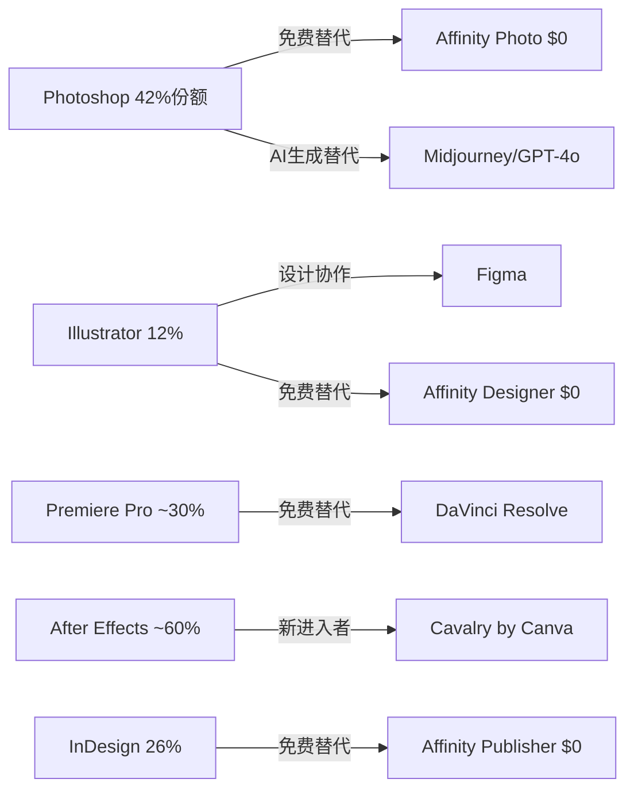
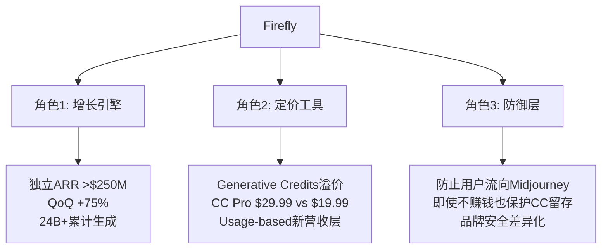
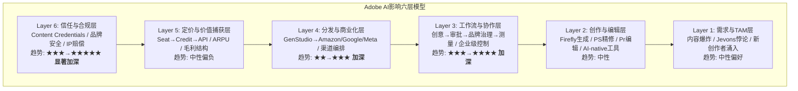
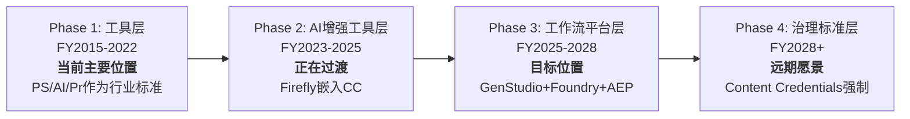
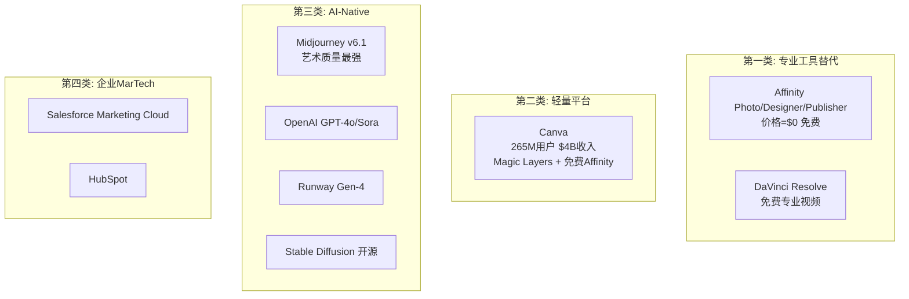

# Adobe Inc. (ADBE) 深度研究报告

## AI时代的分裂体：从创意工具到企业内容基础设施的价值迁移

---

**评级**: 关注 (偏深度关注) | **期望回报**: +68% | **置信度**: 60%
**方法论**: 混合模式 (PW=6.5) — 传统估值+可能性空间映射
**报告日期**: 2026年3月17日 | **股价**: $251.86 | **市值**: $107B

---

## 执行摘要

Adobe正处于一个悖论性的位置：它拥有软件行业最好的财务特征——89%毛利率、84% ROIC、42% FCF Margin——却被市场定价为即将被颠覆的价值陷阱，Forward PE仅9.6x，是同类SaaS公司中最低的。

这份报告的核心发现是：**Adobe不是AI受益者，也不是AI受害者——它是AI分裂体**。Consumer创意业务（19%收入）确实面临Canva、AI-native工具的严重威胁，但Document Cloud（15%收入，+16%增速）和Experience Cloud/GenStudio（23%收入，>30%增速）正在因AI变得更有价值。市场用"最差业务线"的逻辑给整家公司定价，忽视了Enterprise引擎单独就值$176-235B的事实。

五个关键结论：

1. **AIAS净影响+0.75（红队修正后）**：Adobe是AI重组者偏受益，即使最悲观组合（CC座位大幅压缩+低端颠覆恶化）净影响仍为+0.05——不是AI受害者。

2. **Forward PE 9.6x定价了FCF永不增长**：逆向DCF显示，当前估值隐含的FCF零增长假设与Q1 FY2026创纪录的47.4% OPM和+12%收入增速严重矛盾。市场在4个核心信念中的3个可能过于悲观。

3. **护城河正在从工具层向工作流/治理层主动迁移**：迁移进度约25%。旧护城河（Photoshop品牌+PSD格式）正在变浅，但新护城河（GenStudio企业治理+Content Credentials+Firefly Foundry）正在构建。Content Credentials有25-35%概率成为监管强制标准——这是市场完全未定价的潜在上行。

4. **Claude Code/Vibe Coding改变的不是竞争对手，而是竞争规则**：AI编码工具对Adobe的影响是间接的——短期通过加速Canva/Figma迭代和减少设计工作流需求构成利空，长期通过扩大设计资产需求和催生API基础设施化构成利好。

5. **双引擎SOTP中值$538 vs 当前$252**：四种估值方法收敛于$341-538，中值$420-440，隐含+67-75%上行空间。即使最保守的永续FCF模型也给出$389（+54%）。

**评级逻辑**：概率加权期望回报+68%（>+30%深度关注阈值），但红队将置信度从75%下调至60%（企业端乐观偏差+CEO交接不确定性），因此给出"关注（偏深度关注）"而非完全的"深度关注"。核心催化剂：新CEO确定（尤其AI-native背景）+ 2个季度Enterprise数据验证。

---

## 投资温度计

```
极度看空 ←——————|—————→ 极度看多
Goldman         市场      我们    SOTP
$220            $252      $440    $538
  ├──────────────┼─────────┼───────┤
  6x             10x       17x    21x
                Forward PE (Non-GAAP)
```

| 关键变量 | 看空情景 | 基准情景 | 看多情景 |
|----------|---------|---------|---------|
| FY2030 Revenue | $27B (+2.6% CAGR) | $34B (+7.4%) | $38B (+10%) |
| Non-GAAP OPM | 40% | 46% | 48% |
| Terminal P/E | 12x | 20x | 25x |
| 每股价值 | $220-280 | $389-440 | $538-620 |
| vs当前$252 | -13%~+11% | +54%~+75% | +113%~+146% |

---

## 报告信息卡

| 项目 | 数据 |
|------|------|
| **Ticker** | ADBE (NASDAQ) |
| **行业** | 软件基础设施 / 创意+文档+营销科技 |
| **市值** | $107B |
| **EV** | $108B |
| **股价** | $251.86 (2026-03-16) |
| **52周范围** | $244.28 - $422.95 |
| **FY2025收入** | $23.77B (+10.5% YoY) |
| **FY2025 EPS** | $16.70 (GAAP) / ~$21.66 (Non-GAAP) |
| **FY2026E 指引** | Revenue $25.9-26.1B, Non-GAAP EPS $23.30-23.50 |
| **总ARR** | $26.06B (+10.9% YoY) |
| **Forward P/E** | 9.6x (GAAP) / 10.8x (Non-GAAP) |
| **FCF Yield** | 9.3% |
| **毛利率** | 89% |
| **ROIC** | 84% |
| **净债务** | $1.2B (净债务/EBITDA 0.12x) |
| **F-Score/Z-Score** | 8/9 / 7.38 |
| **分析师共识** | Hold (23B/13H/4S), 平均PT $354 |
| **PW评分** | 6.5 (混合模式) |
| **AIAS净影响** | +0.75 (红队修正后, AI重组者偏受益) |

---

# Part I: 重新定义Adobe

## Chapter 1: Adobe到底是什么公司？

### 1.1 一个被错误标签束缚的公司

市场习惯性地将Adobe归入"创意软件"赛道。这个标签在2020年以前是准确的——Creative Cloud贡献了超过70%的收入，Photoshop和Illustrator是公司的代名词。但到了2026年，这个标签已经严重失真。

Adobe在FY2026做了一个耐人寻味的决定：将原有的Digital Media、Digital Experience和Publishing三个报告分部合并为一个经营和报告分部。管理层的解释是"改变了评估资源配置和战略机会的方式"。这不是一个财务技术调整——这是管理层在宣告：Adobe不再是几个产品的集合，而是一个统一的平台。

如果只用一句话定义Adobe，这句话应该怎么写，才能在AI时代仍然成立？

**Adobe是"从创意生成到企业内容治理的AI工作流基础设施"。**

这个定义有三个关键词：

**AI工作流**（不是AI工具）：Adobe卖的不是单点功能，而是从灵感→生成→编辑→协作→审批→分发→测量的完整链条。一个企业营销campaign在Adobe体系中的完整路径是：创意团队用Firefly生成初稿→用Photoshop精修→品牌团队在GenStudio中审核品牌一致性→法务确认合规→多个市场用AI自动本地化→直接推送到Amazon Ads/Google/LinkedIn/Meta→追踪效果并优化。这条链上的每个环节都是Adobe的价值锚点。

**基础设施**（不是应用程序）：正如AWS是云计算的基础设施，Adobe正在成为企业内容生产的基础设施。AI agent调用Firefly Services API生成内容，营销团队在GenStudio中编排内容流水线，企业IT在AEP Agent Orchestrator中部署客户体验AI agent。当Adobe成为AI agent的后端时，它的客户从"30M人类订阅者"扩展为"百万个AI系统"。

**从创意到治理**（不是只有创意）：市场只看到Photoshop面临Midjourney挑战，却忽视了Document Cloud的AI化（Acrobat AI Assistant让PDF从静态文件升级为对话式知识载体，Business Professionals订阅+16%是Adobe增速最快的客户群）和Experience Cloud的企业级黏性（GenStudio ARR突破$1B，增速>30%）。

### 1.2 市场的三个系统性误标签

**误标签一："创意软件公司"**

把Adobe叫"创意软件公司"，就像把Microsoft叫"操作系统公司"——在2000年是对的，在2026年会导致你错过Azure和Copilot的价值。

Adobe FY2025的收入构成：

| 业务板块 | 收入 | 占比 | YoY增速 |
|----------|------|------|---------|
| Digital Media (CC+DC) | $17.65B | 74% | +11% |
| Digital Experience | $5.93B | 25% | +9% |
| Publishing & Other | $0.19B | 1% | — |
| **合计** | **$23.77B** | **100%** | **+10.5%** |

Creative Cloud（含Document Cloud）确实是大头，但Experience Cloud的$5.93B已经相当于一个中型SaaS公司的全部收入。更重要的是，GenStudio ARR已突破$1B，增速>30%——这是一个被嵌在"Digital Experience"里的高增长引擎，被"创意软件"标签完全遮蔽了。

**误标签二："AI受益者"或"AI受害者"**

市场在用二元框架看Adobe：要么"Firefly让Adobe赢得AI时代"（看多），要么"Midjourney/Canva让Adobe成为Kodak"（看空）。两者都过于简化。

Adobe是AI分裂体——不同业务线在AI冲击下的方向完全相反。本报告首创的AIAS（AI Software Impact Assessment System）框架评估显示：

| 业务线 | 收入占比 | AI净影响 | 分类 |
|--------|---------|---------|------|
| CC专业 | 40% | +1 | 中性偏好 |
| CC消费/SMB | 19% | -8 | **受害者** |
| Firefly | 1% | +13 | **受益者** |
| Document Cloud | 15% | +6 | 受益者 |
| Experience Cloud | 23% | +5 | 受益者 |
| Express | 2% | -1 | 中性 |

这种分裂体现象意味着：用单一估值倍数给Adobe定价，无论是乐观还是悲观，都必然是错的。

**误标签三："成熟SaaS"**

Forward PE 9.6x——这是市场给一家+12%增长、89%毛利率公司的定价。对比同行：

| 公司 | Forward PE | 收入增速 | Non-GAAP OPM | FCF Margin |
|------|-----------|---------|-------------|-----------|
| **ADBE** | **9.6x** | **+12%** | **47%** | **42%** |
| ServiceNow | ~45x | +22% | 30% | 28% |
| Intuit | ~28x | +15% | 39% | 30% |
| Autodesk | ~25x | +12% | 38% | 30% |
| Salesforce | ~13.5x | +11% | 33% | 30% |

Adobe的增速与Autodesk相当，利润率和现金流大幅领先所有同行，但估值只有Autodesk的38%。这不是"成熟SaaS"的定价——这是"被判了AI死刑的SaaS"的定价。市场在说：Adobe的12%增长不可持续，未来会降到5%甚至负增长。

这是否正确，是本报告最核心的判断。

### 1.3 拆分测试：如果Adobe各业务独立，还能保持多强竞争力？

这个思想实验揭示Adobe到底是产品集合还是真正的平台：

| 独立后的业务 | 独立竞争力 | 关键依赖 | 平台贡献 |
|-------------|-----------|---------|---------|
| Photoshop+Illustrator | ★★★★☆ | 仍是行业标准(42%份额)，但失去跨产品协同 | 品牌+格式标准 |
| Premiere+After Effects | ★★★☆☆ | 面临DaVinci Resolve免费竞争，需CC生态支撑 | 工作流互通 |
| Acrobat/Document Cloud | ★★★★☆ | PDF标准地位独立于CC，AI Assistant增长强劲 | 企业信任 |
| Experience Cloud | ★★★☆☆ | 强烈依赖CC用户数据和创意资产，独立后面临CRM夹击 | 创意→营销桥梁 |
| Firefly | ★★☆☆☆ | 独立后是普通AI生成工具，核心差异化需CC/DC/DX支撑 | 可商用+品牌安全 |
| Express | ★★☆☆☆ | 独立后是弱化版Canva，核心价值在于CC升级通道 | 获客漏斗 |

**拆分测试结论**：Photoshop和Acrobat可以独立生存，但其余业务高度依赖平台协同。这证明Adobe已经是平台，不只是产品集合——但平台效应的强度在不同业务间分布不均。FY2026合并为单一分部的决定，是管理层在组织层面确认这一现实。

---

## Chapter 2: 业务深度解析 — 六条业务线

### 2.1 Creative Cloud专业版（~$9.5B，40%收入）

**核心产品**：Photoshop、Illustrator、Premiere Pro、After Effects、InDesign、Lightroom

**这是Adobe的"利润引擎"**。89%毛利率的主要贡献者，30年积累的行业标准地位，30M+付费订阅者。

**竞争格局深度扫描**：



每个产品都面临来自不同方向的竞争，但需要注意一个关键区别：**单产品竞争力 ≠ 套件竞争力**。一个商业视频项目可能同时需要Photoshop（缩略图）→ Illustrator（Logo）→ After Effects（动效）→ Premiere Pro（剪辑）→ Audition（音频）→ Media Encoder（输出），六个工具通过Dynamic Link无缝互通。这种跨工具工作流是Canva、Affinity或任何AI-native工具无法复制的。

**AI的双面影响**：
- **增强面**：Firefly内嵌后，生成式填充、视频扩展、AI重着色等功能让专业用户效率提升2-3x。35%以上的Photoshop用户每月使用AI功能——这些用户的留存率显著高于不使用AI的用户。
- **威胁面**：效率提升2-3x意味着1个AI增强的设计师可能做3个人的活→企业可能裁减2个seat。这是SaaSpocalypse的核心逻辑在Adobe的具体体现。

**关键判断**：短期（12-24个月），AI增强带来的留存提升>座位压缩带来的流失。长期（3-5年），座位压缩可能开始兑现。净效应取决于新用户获取速度是否能抵消seat优化。

### 2.2 Creative Cloud消费/SMB版（~$4.5B，19%收入）

**这是AI冲击最大的业务线，也是"分裂体受害侧"的核心。**

原因是结构性的：
1. 这些用户不需要Photoshop的全部功能——80%的需求可被Canva AI满足
2. 价格敏感度高：Adobe $54.99/月 vs Canva $12.99/月 vs Canva+Affinity 免费
3. 没有.psd文件积累的工作流锁定——轻量用户可以随时切换
4. Vibe coding让非设计师直接生成UI——绕过设计工具

**Canva的定量威胁**：

| 指标 | Adobe CC | Canva | 差距 |
|------|---------|-------|------|
| 总用户 | ~850M MAU(含免费) | 265M | Adobe 3.2x |
| 付费用户 | ~30M | 31M | **Canva已追平** |
| 年化收入 | ~$14B(CC部分) | $4B | Adobe 3.5x |
| ARPU(付费) | ~$467/年 | ~$129/年 | Adobe 3.6x |
| 增速 | ~11% | ~35%+ | Canva 3.2x |

Canva的31M付费用户已经与Adobe CC的约30M付费订阅相当。虽然ARPU差距巨大（3.6x），但Canva在加速向上渗透——Canva for Enterprise已进入Fortune 500，免费Affinity直接攻击Adobe的价格壁垒，Magic Layers（2026年3月11日发布）开始挑战Photoshop的多层编辑核心价值。

### 2.3 Firefly独立业务（~$250M+ ARR，1%收入）

**Firefly不是一个产品——它同时扮演三个角色，这三个角色之间存在战略张力：**



**Firefly的竞争不是"谁的模型更好"**。Adobe选择了一条不同的竞争路径：

| 维度 | Firefly | Midjourney | OpenAI | Stable Diffusion |
|------|---------|-----------|--------|-----------------|
| 图像质量 | ★★★☆ | ★★★★★ | ★★★★ | ★★★☆ |
| 可商用(版权) | ★★★★★ | ★★☆☆ | ★★★☆ | ★☆☆☆ |
| 品牌安全 | ★★★★★ | ★★☆☆ | ★★★☆ | ★☆☆☆ |
| 工作流集成 | ★★★★★ | ★☆☆☆ | ★★☆☆ | ★★☆☆ |
| 企业级控制 | ★★★★★ | ★☆☆☆ | ★★★☆ | ★☆☆☆ |
| IP赔偿 | ✅ | ❌ | 有限 | ❌ |
| 定制模型(Foundry) | ✅ | ❌ | 有限 | 可微调 |

在个人用户市场，模型质量是王道（Midjourney赢）。但在企业市场，**信任>质量**。企业不会用Midjourney生成广告素材——因为无法确认训练数据是否包含版权图片、生成结果是否安全、被诉后谁来赔偿。Firefly不需要是"最好的模型"——它需要是"企业最信任的模型"。

**"模型聚合器"策略**：Adobe选择集成25+第三方模型（Google、OpenAI、Runway等），用户在Photoshop中可选择任何模型生成，所有输出通过Adobe工作流处理。Adobe不需要在模型军备竞赛中获胜——只需要成为最好的"模型超市+可信工作流引擎"。

**$70M蚕食问题**：AI生成直接替代了$70M的Stock照片购买。但Firefly新增$250M+ ARR，净效应+$180M（正向）。Stock业务的萎缩是不可逆的——AI生成将在3-5年内替代大部分通用Stock需求。但这对Adobe整体影响有限（$500M Stock仅占2%收入），真正的问题不是蚕食，而是Firefly能否成为比Stock大10x的新业务。

**Firefly Foundry：企业锁定的终极形态**。企业用自有品牌资产（图片/视频/音频/矢量/3D）训练私有生成模型。多年期合约，专属PhD团队。早期客户：Home Depot、Walt Disney Imagineering。一旦企业在Foundry上训练了定制模型，迁移成本极高——模型资产不可携、输出与CC/DX深度集成、重新训练需数月。Foundry之于Adobe，就像定制ERP之于SAP。

### 2.4 Document Cloud（~$3.5B，15%收入）

**这可能是Adobe最被低估的增长曲线。**

传统认知：Acrobat是"卖PDF编辑功能"的工具。AI时代认知：Acrobat正在变成"企业知识的对话入口"。

Acrobat AI Assistant的价值链清晰而有力：上传PDF → AI总结 → 提出问题 → 提取数据 → 生成报告 → 转化为邮件/演示 → 分享。每个环节都是价值创造。特别是在企业场景中——法务的合同条款提取、财务的财报数据分析、合规的监管文件理解、HR的简历筛选——这些都是高价值、低频但关键的工作场景。

**为什么Acrobat AI比通用LLM有优势？**
1. **格式理解**：PDF的内部结构（表格/表单/签名域/注释/图层）是结构化的，通用LLM只能"看"到flat text
2. **来源可信**：用户上传到Acrobat的文档不会被用于模型训练——企业上传合同到ChatGPT会犹豫，上传到Acrobat不会
3. **操作能力**：Acrobat AI不只能"读"PDF——还能编辑、签名、填表、重新排版
4. **集成能力**：与Adobe Sign、Creative Cloud、Experience Cloud的原生集成

增长数据强劲：Business Professionals & Consumers订阅$1.78B（Q1 FY2026，+16% YoY）——这是Adobe增速最快的客户群。Acrobat MAU同比翻倍，AI采纳4倍增长。近50%商业ETLA续约升级到AI功能版本。

**估值含义**：如果Document Cloud单独拆出来（$3.5B收入，+16%增速，企业级粘性），它的估值倍数应该更接近ServiceNow（~30x EV/Sales）而非Adobe整体（4.3x）。这是分裂体低估的一个具体体现。

### 2.5 Experience Cloud / GenStudio（~$5.5B，23%收入）

**GenStudio的战略意义远超其$1B ARR。**

GenStudio不是一个产品——它是Adobe从"创意工具供应商"转型为"企业创意基础设施"的关键桥梁。

传统模式：品牌找代理商 → 代理商用PS做创意 → 品牌审批 → 媒体投放。
GenStudio模式：品牌在GenStudio内 → AI生成+人工精修 → 品牌治理自动检查 → 直接推送到Amazon/Google/Meta/LinkedIn。

从"卖工具给创意人"到"卖管道给品牌"——这个转变等价于从Microsoft Office到Microsoft 365。

企业渗透数据极为强劲：

| 指标 | 数值 | 含义 |
|------|------|------|
| Fortune 500使用CC | 98% | 渗透率接近饱和 |
| Fortune 500采用Firefly | 75% | 18个月内AI渗透 |
| Fortune 100使用AI in Adobe | 99% | 几乎全覆盖 |
| Top 50客户采用AI-first创新 | ~90% | 大客户走在前面 |
| 联合创意+营销交易增速 | >100% YoY | 跨产品深化 |
| GenStudio ARR增速 | >30% YoY | 企业AI高增长 |
| AEP+Apps相关ARR增速 | >30% YoY | 平台化加速 |

**AEP Agent Orchestrator**：Adobe在2025年推出Agent Orchestrator，允许企业部署AI agent自动化客户体验工作流，并与Nvidia合作成为17家首批采用Nvidia企业AI agent平台的公司。Adobe正在定位自己为AI agent时代的"操作系统"——AI agent需要"看到"客户数据（AEP的CDP）、"创造"个性化内容（Firefly/GenStudio）、"分发"到渠道（GenStudio→广告平台）。Adobe提供这三层能力的唯一组合。

竞争对比清晰：Salesforce有CDP和CRM但没有创意生成能力；Canva有创意能力但没有CDP和企业营销编排；Google/Meta有广告分发但没有创意生产和品牌治理。只有Adobe试图覆盖"数据→创意→品牌治理→分发"的全链条。

### 2.6 Express + 其他（~$0.5B，2%收入）

Express是Adobe的TAM扩张工具——吸引从未用过Photoshop的用户进入Adobe生态，然后通过升级路径（Express→CC单应用→CC全套）货币化。

Creative freemium MAU已达8000万（+50% YoY），但关键问题是：**这8000万MAU中有多少能转化为付费用户？** Adobe管理层自己也承认，快速增长的MAU在短期内"压低ARR"——意味着大量免费用户尚未货币化。

Express面对Canva的劣势是明显的——Canva的265M用户>>Express的80M MAU，且Canva的产品体验在非专业用户中更受欢迎。但Express的优势在于与CC/DC/DX的深度集成——一个在Express上做社交媒体图片的用户，如果需求升级，可以无缝进入Photoshop，而Canva用户升级时需要重新学习一套工具。

---

## Chapter 3: AI时代分析Adobe的总框架 — 六层冲击模型

### 3.1 为什么需要一个新框架？

传统分析Adobe的方式是：看收入增速→看利润率→看估值倍数→给目标价。这在稳态下有效。但AI对Adobe的影响不是线性的——它同时作为5种冲击力和4种利好力作用于不同业务线。本报告首创的AIAS v1.0框架（AI Software Impact Assessment System），详见附录，是为解决这一问题而设计的。

### 3.2 六层AI影响框架



**Layer 1: 需求与TAM层**

两个相反的力量正在碰撞。扩张力：AI降低创作门槛→更多人成为"创作者"→内容总量爆发。Adobe自估TAM从$145B扩大到$205B（+41%）。Creative freemium MAU从约5000万增长到8000万（+60%），证明新用户正在涌入。

收缩力：AI让每个人生产力提升3-5x→企业需要更少设计师→seat数下降。Seat-based定价在12个月内从21%降至15%的行业采用率。Gartner预测2030年35%点状SaaS被AI agent替代。

Jevons悖论的关键测试：历史上每波编码抽象层都扩大了从业者群体。如果创意领域重复这一模式，AI让"创作者"从5000万扩大到5亿，即使每个创作者用更便宜的工具，总市场仍然扩大。

我们的判断：Layer 1净效应偏正。TAM在扩张，但主要是低端市场（Express/Canva）。Adobe的核心高端市场TAM基本持平或微缩。Adobe需要在低端成功获客才能受益于TAM扩张。

**Layer 2: 创作与编辑层**

这是市场争论最激烈的一层。分两个子场景：生成环节（从无到有）正在被AI-native工具侵蚀——GPT-4o的Ghibli风暴证明大众市场图像生成已不需要Photoshop。编辑环节（从有到好）则被AI增强——生成式填充、视频扩展让Photoshop/Premiere更强大。

关键区分："能生成"≠"能交付"。Midjourney能生成一张惊艳的图片，但不能调整分辨率适配印刷、匹配品牌色彩体系、输出CMYK色彩空间、嵌入Content Credentials元数据、适配20个不同渠道的尺寸规格。从生成到交付之间的距离，就是Adobe的价值所在。

**Layer 3: 工作流与协作层 — 这是Adobe护城河迁移的目的地**

创意工作从来不是一个人的事。AI可以加速创作环节，但不能消除品牌审批、法务合规、多市场本地化、渠道适配、效果追踪。在这条链上做得最深的公司，就是最难被替代的。Adobe通过GenStudio+AEP+Firefly Foundry正在构建完整链条——Canva覆盖创作和部分渠道适配，Salesforce覆盖营销自动化和测量，但只有Adobe试图覆盖全链条。

**Layer 4: 分发与商业化层**

GenStudio直连Amazon Ads、Google、LinkedIn、Meta广告平台→Adobe从"内容生产工具"变成"内容→商业化管道"。这一层目前尚浅但增长快，是Adobe独有的差异化。

**Layer 5: 定价与价值捕获层**

Adobe正在从三种定价模式中寻找平衡：订阅（seat-based，稳定但面临压缩）、信用额度（credit-based，Firefly generative credits按量计费）、API（usage-based，面向AI agent和企业系统）。

毛利结构风险：订阅的边际成本≈0（毛利率89%），但credit和API涉及GPU推理成本（毛利率可能60-80%）。如果收入从高毛利订阅转向低毛利API，即使收入不变，利润也会下降。

**Layer 6: 信任与合规层 — 这可能是决定性的一层**

Content Credentials已有6000+成员，>90%相机厂商承诺支持，Samsung Galaxy S25成为首款原生支持的手机。EU AI Act和NSA/CISA已参考C2PA标准。如果Content Credentials从自愿变为监管强制，Adobe将获得类似FICO在美国信贷体系中的制度级地位。

### 3.3 六层影响净效应

| 层 | Adobe的位置 | 净效应 | 时间窗口 |
|----|-----------|--------|---------|
| L1 需求/TAM | TAM扩张利好低端, 高端持平 | 中性偏好 | 已发生 |
| L2 创作/编辑 | 生成被侵蚀, 编辑被增强 | 中性 | 12-24月 |
| L3 工作流/协作 | 唯一全链条覆盖者 | **正面** | 24-36月 |
| L4 分发/商业化 | GenStudio直连广告渠道 | **正面** | 12-24月 |
| L5 定价/捕获 | Seat→API毛利结构风险 | 中性偏负 | 24-48月 |
| L6 信任/合规 | Content Credentials可能监管强制 | **潜在强正面** | 36-60月 |

市场过度关注Layer 2的威胁，低估了Layer 3-6的价值。

---

# Part II: AI冲击评估 — AIAS v1.0完整实施

## Chapter 4: AIAS框架 — AI对软件公司冲击评估体系

### 4.1 为什么需要AIAS？

现有投资分析框架对AI影响的处理存在三个系统性缺陷：M13矩阵（INTC/ANET报告）为硬件/基础设施设计，不适用于"AI对软件公司商业模式的存亡威胁"；CQI护城河框架的C1-D1维度未覆盖"AI侵蚀路径"；估值框架假设商业模式稳定，但Forward PE 9.6x可能反映的是"商业模式转型定价"。

AIAS v1.0（AI Software Impact Assessment System）是本报告首创的框架，核心命题是：**对软件公司，AI不是单维度的"利好/利空"判断。AI同时作为5种冲击力（S1-S5）和4种利好力（B1-B4）作用于公司的不同业务线。净影响取决于各业务线的收入权重和冲击/利好的交互效应。**

完整框架文档见 `docs/ai_software_impact_framework.md`，可复用于所有SaaS/软件公司的AI冲击评估。ADBE调研后将升级为v2.0纳入CQI品质评估体系。

### 4.2 五种冲击力 (S1-S5) 定义

| 冲击类型 | 定义 | 传导机制 | 传导速度 |
|----------|------|---------|---------|
| **S1: 功能替代** | AI直接完成用户原本需要该软件完成的核心任务 | AI工具生成最终产物→不再需要打开传统软件 | 6-18月 |
| **S2: 座位压缩** | AI提升效率→需要更少人→更少license | 1个AI增强设计师做3个人的活→企业砍2个seat | 12-36月 |
| **S3: 工作流绕过** | AI编码工具/agent直接生成最终产物, 跳过设计工具 | Claude Code生成完整UI→不经过设计稿 | 18-48月 |
| **S4: 低端颠覆** | AI赋能的轻量工具满足80%用户80%需求 | Canva AI + 免费Affinity, 价格$0-13 vs Adobe $55 | 12-24月 |
| **S5: 平台脱媒** | AI成为新的用户入口, 绕过传统软件 | 用户对ChatGPT说"帮我做海报"→不打开PS | 24-60月 |

### 4.3 四种利好力 (B1-B4) 定义

| 利好类型 | 定义 | 传导机制 |
|----------|------|---------|
| **B1: 功能增强** | AI内嵌提升产品价值和粘性 | Firefly嵌入PS→效率翻倍→留存提升 |
| **B2: TAM扩张** | AI降低门槛, 新用户涌入 | Express+Firefly吸引8000万freemium MAU |
| **B3: 基础设施化** | 软件变成AI agent的后端API | Firefly Services API供AI agent调用 |
| **B4: 信任溢价** | AI时代企业更需可信/合规/品牌安全平台 | Firefly训练数据合法+IP赔偿+Content Credentials |

### 4.4 ADBE完整评估矩阵

| 业务线 | 权重 | S1 | S2 | S3 | S4 | S5 | B1 | B2 | B3 | B4 | **净影响** | **分类** |
|--------|------|----|----|----|----|----|----|----|----|----|----|---------|
| CC专业 | 40% | -2 | -2 | -1 | -1 | -1 | +4 | +1 | +1 | +2 | **+1** | 中性偏好 |
| CC消费/SMB | 19% | -4 | -3 | -2 | -4 | -2 | +2 | +3 | +1 | +1 | **-8** | **受害者** |
| Firefly | 1% | 0 | 0 | 0 | 0 | 0 | +3 | +4 | +3 | +3 | **+13** | **受益者** |
| Document Cloud | 15% | -1 | -1 | 0 | -2 | -1 | +4 | +2 | +2 | +3 | **+6** | 受益者 |
| Experience Cloud | 23% | -1 | -2 | -1 | -1 | 0 | +3 | +2 | +2 | +3 | **+5** | 受益者 |
| Express | 2% | -2 | -1 | -2 | -3 | -2 | +3 | +4 | +1 | +1 | **-1** | 中性 |

### 4.5 公司级净影响

```
公司净影响 = (+1×40%) + (-8×19%) + (+13×1%) + (+6×15%) + (+5×23%) + (-1×2%)
           = 0.40 - 1.52 + 0.13 + 0.90 + 1.15 - 0.02
           = +1.04 (Phase 1-3评估)

红队修正后: +0.75 (区间[-0.25, +1.50])
```

**Adobe整体净影响: +0.75（AI重组者，偏受益）**

### 4.6 分裂体确认

CC消费/SMB净影响-8 + Firefly净影响+13 → 差值21 → **确认分裂体**。

分裂体的估值含义是根本性的：不能用单一P/E给Adobe定价。Forward PE 9.6x用的是"最差业务线"的逻辑——如果Document Cloud（+6）和Experience Cloud（+5）的增长抵消CC消费（-8）的萎缩，当前估值就是错误的。

### 4.7 敏感性分析

| 场景 | 变化 | 净影响 | 含义 |
|------|------|--------|------|
| 基准 | — | +0.75 | 中性偏好 |
| CC专业S2恶化 | S2: -2→-4 | +0.24 | 接近纯中性 |
| CC消费S4恶化 | S4: -4→-5 | +0.56 | 仍偏好 |
| 最悲观组合 | CC专业S2=-4且CC消费S4=-5 | **+0.05** | 几乎中性**但仍不是受害者** |
| 最乐观组合 | DX B1=+5且Firefly收入占5% | +2.32 | 明确受益者 |

**关键洞察**：即使在最悲观组合下，Adobe的净影响仍然是+0.05——不是AI受害者。Document Cloud和Experience Cloud的AI利好提供了强大的缓冲。这与市场"AI将颠覆Adobe"的主流叙事形成了鲜明对比。

---

# Part III: 护城河深度解剖

## Chapter 5: 护城河七层拆解

### 5.1 分层框架

Adobe的护城河不是铁板一块——它由7个不同层次构成，每层的深度和AI时代的命运截然不同：

| 层次 | 护城河内容 | 当前深度 | AI时代趋势 | 方向 |
|------|----------|---------|-----------|------|
| L1: 格式标准层 | PDF(ISO标准), PSD/AI/INDD行业标准 | ★★★★ | → ★★★ | ↓微降 |
| L2: 专业工作流层 | PS→AI→Pr→AE跨产品Dynamic Link | ★★★★ | → ★★★ | ↓微降 |
| L3: 团队协作/治理层 | GenStudio审批+品牌治理+Foundry | ★★★ | → ★★★★ | **↑加深** |
| L4: 生态/插件层 | 460K开发者, Exchange市场, API | ★★★ | → ★★★ | →持平 |
| L5: 品牌/学习成本层 | Photoshop=品类名, 99%品牌认知 | ★★★★★ | → ★★★★ | ↓微降 |
| L6: 分发/商业化层 | GenStudio→Amazon/Google/Meta | ★★ | → ★★★ | **↑加深** |
| L7: 信任/版权/合规层 | Content Credentials+IP赔偿+CAI | ★★★ | → ★★★★★ | **↑↑显著加深** |

### 5.2 关键层深度分析

**L1: 格式标准层 — 从"专有锁定"到"事实标准"的演变**

PDF的演进是护城河迁移的教科书案例：1993-2007年Adobe专有格式→2008年PDF 1.7成为ISO 32000-1→2020年PDF 2.0消除所有Adobe专有技术。PDF作为格式已不提供专有锁定，但Acrobat作为PDF的"默认交互方式"的地位仍然极强——正如浏览器标准是开放的，但Chrome仍然主导。

PSD/AI/INDD虽然不是ISO标准，但是行业事实标准：设计团队之间交换工作文件默认使用这些格式。这种标准锁定比法律强制更难被颠覆——因为它嵌在千万人的工作习惯中。但对新一代用户（vibe coding/Canva原生），这些格式的锁定力为零。

**L3: 团队协作/企业治理层 — 护城河迁移的目的地**

GenStudio+Foundry构建的不是"更好的创意工具"——而是"企业创意治理系统"：品牌模板锁定确保输出符合品牌规范，审批工作流管理从设计师到法务的多层审批，权限控制决定谁能用什么模型/修改什么元素，版本控制记录所有创意资产的完整变更历史。

GenStudio之于创意内容，等于SAP之于企业资源规划——不是因为"功能最好"而被采用，而是因为"整个组织的流程都建在上面"。这层护城河在AI时代会加深，因为AI让创作变快→内容爆炸→企业更需要治理。

**L5: 品牌/学习成本层 — 最深但有代际脆弱性**

Photoshop是极少数"品牌名=品类名"的产品（与Google之于搜索、Band-Aid之于创可贴同级别）。99%品牌认知率创造了职业惯性（"会PS"是设计师简历标配）、教育管道（从学校就开始用Adobe）、招聘惯性（企业要求"精通Adobe Creative Suite"）。

但这层护城河有代际脆弱性：如果新一代"设计师"不再需要学PS（因为AI+Canva够用），"会PS"就不再是职业门票。Adobe的30M学习者倡议和K-12 Express免费策略正是对冲这个风险。

### 5.3 CQI护城河评分

| 维度 | 评分 | 理由 |
|------|------|------|
| C1 制度嵌入 | 3.5/5 | 偏好型嵌入（品牌=品类），但非强制型→AI可绕过 |
| C2 网络效应 | 2.5/5 | 开发者生态460K（中等），不如平台级公司 |
| C3 生态锁定 | 3.5/5 | PSD/AI/INDD文件格式+Dynamic Link跨工具流 |
| C4 数据飞轮 | 3.0/5 | 850M MAU行为数据有价值，但不如搜索/社交 |
| C5 规模经济 | 4.5/5 | 89%毛利率+R&D $4.3B绝对壁垒 |
| C6 物理壁垒 | 0/5 | 纯软件 |
| **综合** | **3.2/5** | 护城河"宽但不深"——覆盖面广但每层都有侵蚀路径 |

**C1嵌入性质**：Adobe的嵌入主要是偏好型——用户因为"会用"和"习惯"而留在Adobe，不是因为"不得不用"。但Content Credentials有可能将嵌入从偏好型升级为标准型甚至制度型（如果监管强制）。

---

## Chapter 6: 护城河迁移 — 从工具到工作流到治理

### 6.1 主动护城河迁移模型

在35份报告的冠军方法库中，INTC的"制度迁移"是最相关的参考。但Adobe的迁移与INTC有本质不同——INTC是被迫迁移（技术优势丧失），Adobe是主动迁移（预见AI冲击）。

**Adobe的护城河迁移地图**：



迁移进度评估约25%完成。旧护城河（工具层）仍然是收入主体，新护城河（工作流+治理）正在快速构建但尚未成为主要价值驱动。

### 6.2 真空期风险

护城河迁移最危险的阶段是"真空期"——旧护城河变浅但新护城河尚未建成。Adobe当前就处于这个阶段：Canva免费Affinity攻击价格壁垒，Figma抢占设计协作，AI生成侵蚀部分PS功能（旧护城河变浅）；同时GenStudio仅占总体4%，Foundry仍在早期，Content Credentials离监管强制还有距离（新护城河尚浅）。

Adobe通过四种方式管理真空期：保持CC高端功能领先（AI增强→专业用户留存）、Express免费拉新（与Canva争夺入口）、企业捆绑（CC+DC+DX联合交易>100%增长→深化锁定）、激进回购（趁估值低→EPS增长→维持市场信心）。

---

## Chapter 7: Content Credentials — 未来制度级护城河？

### 7.1 FICO类比

FICO评分成为美国信贷体系事实标准的路径分三个阶段：行业自发采用（1989-2000）→ 监管引用（2000-2010）→ 制度嵌入（2010+）。

Content Credentials正在走类似路径：

**阶段1: 行业自发采用（2021-2025）** ✅ 已发生。6000+成员，>90%相机厂商承诺，TikTok/Meta/LinkedIn开始显示，Samsung Galaxy S25首款手机原生支持。

**阶段2: 监管引用（2025-2026）** ✅ 正在发生。EU AI Act实施中，NSA/CISA 2025年1月发布C2PA参考指导文件。预测市场显示AI安全法案在2027前通过的概率40.5%。

**阶段3: 制度嵌入（2027+）** ⚠️ 尚未发生，但路径清晰。如果EU AI Act要求所有AI生成内容必须携带Content Credentials，Adobe作为CAI创始者+C2PA联合创建者，将处于FICO在信贷中的位置。

### 7.2 概率与影响评估

Content Credentials在5年内成为至少部分强制标准的概率约25-35%（红队修正后）。如果成为全面强制约15-20%。

如果成立，Adobe的C1评分应从3.5→4.5/5（从偏好型升级为标准/制度型），支持更高的估值倍数——从"可替代的工具"到"不可绕过的标准"。即使不成为监管强制，行业自愿采纳（6000+成员）仍是差异化优势。

失败路径包括：替代标准胜出（Google/Meta推不同标准）、监管选择自愿而非强制、技术被绕过（元数据被剥离）。

---

# Part IV: 财务深拆与信念反演

## Chapter 8: 五年财务趋势

### 8.1 收入质量：被误读的"减速"

| FY | 收入 | YoY | 毛利率 | GAAP OPM | Non-GAAP OPM | 净利率 | FCF | FCF Margin |
|----|------|-----|--------|---------|-------------|--------|-----|-----------|
| 2021 | $15.8B | +23% | 88.2% | 36.8% | ~43% | 30.5% | $6.9B | 43.7% |
| 2022 | $17.6B | +11.5% | 87.7% | 34.6% | ~42% | 27.0% | $7.4B | 42.0% |
| 2023 | $19.4B | +10.2% | 87.9% | 34.3% | ~44% | 28.0% | $6.9B | 35.8% |
| 2024 | $21.5B | +10.8% | 89.0% | 31.3% | ~42% | 25.9% | $7.8B | 36.4% |
| 2025 | $23.8B | +10.5% | 88.6% | 36.6% | ~46% | 30.0% | $9.9B | 41.4% |
| Q1 FY26 | $6.40B | +12% | 89.6% | 38.3% | 47.4% | 29.5% | $2.9B | 45.6% |

市场叙事是"Adobe增速从23%降到10%=减速公司"。实际上FY2021的23%是疫情+SaaS转型完成后的异常值。FY2022-2025的10-11%是Adobe在$24B收入体量下的正常稳态增速。Q1 FY2026的+12%反而是四个季度以来的**加速**。

毛利率5年波动仅2个百分点（87.7-89.6%）。这证明AI推理成本尚未显著影响毛利结构——Firefly的GPU成本被吸收在2%的波动范围内。Q1 FY2026 Non-GAAP OPM达到47.4%，创历史新高——这不是一家"利润率正在被AI侵蚀"的公司的表现。

### 8.2 现金流：软件行业的"现金机器"

FCF/Net Income持续>1.2x——Adobe的现金利润比会计利润更高。CapEx/Revenue仅0.75%，这是纯软件公司的标志性特征。

FY2025 FCF $9.9B的含义：按当前市值$107B计算，FCF Yield 9.3%。一家FCF Yield>9%的公司通常是价值陷阱或被严重低估的成长股。如果FY2025-FY2030 FCF CAGR维持7%，FY2030 FCF约$14B，按15x P/FCF = $210B市值（vs当前$107B，+96%）。

---

## Chapter 9: 逆向DCF — 9.6x Forward PE隐含了什么信念？

### 9.1 "市场在赌什么"

Forward PE 9.6x是Adobe历史上从未出现过的估值水平（10年均值约30x）。逆向DCF的目的是翻译市场正在做的隐含赌注。

当前EV $108B几乎等于FCF零增长的永续价值（$9.9B/9.5% WACC = $104B）。**市场在定价Adobe的FCF将永远不再增长。**

但分析师共识FY2030收入$36.5B（+54% vs FY2025），即使OPM降至43%，FCF约$12.5B → 5年后FCF增长26%。按15x P/FCF = $188B → vs当前$107B +75%上行。

### 9.2 隐含信念集的合理性检验

| 信念 | 市场预期 | 我们的评估 | 结论 |
|------|---------|-----------|------|
| 收入增速降至5-7% | — | Q1 FY26实际+12%，RPO +13% | **过于悲观** |
| OPM降至35-40% | — | Q1 FY26 Non-GAAP 47.4%创新高 | **过于悲观** |
| 商业模式风险 | 高风险溢价 | 合理（过渡期折价）| 方向正确但幅度过大 |
| 竞争恶化 | 份额显著流失 | 低端流失但高端稳定 | **过于悲观** |
| FCF增长 | 零增长 | 共识隐含+7-10% CAGR | **严重低估** |

市场在4个信念中的3个可能过于悲观。Forward PE 9.6x定价了一个"最坏情景的组合"，但这些最坏情景同时全部发生的联合概率很低（<15%）。

### 9.3 定价权分析

B4定价权评估：B4a强度3.5/5（仍能提价：FY2025 CC提价+9%用户接受），B4b持久性2.5/5（Canva免费化侵蚀低端定价权）。综合3.0/5。

Credit-based定价可能是Adobe最有定价权的新模式——因为用户为"每次生成"付费，价值感知直接，且消费弹性高。

### 9.4 AI推理成本对毛利的影响

FY2026估算Firefly推理总成本约$100-200M，占收入仅0.4-0.8%，对毛利率影响不到1个百分点。即使Firefly使用量爆发10x到$2.5B收入，以70%毛利率计算，对整体毛利率影响约1.7pp。GPU推理成本每18个月下降约50%，进一步缓解影响。

**假说H-5判定：基本成立。毛利率恐惧被高估，真正风险来自价格战（定价端）而非推理成本（成本端）。**

---

# Part V: 竞争格局与前瞻

## Chapter 10: 四类竞争者与承重墙联合概率

### 10.1 四类竞争者



### 10.2 Canva深度对标

Canva是Adobe最重要的竞争对手——不是因为它在高端威胁Adobe，而是因为它在重新定义"创意软件"的边界。

Canva在过去18个月的战略清晰且激进：2024收购Affinity并免费化→2025年10月推自有设计模型→2026年2月收购Cavalry（动画）和MangoAI（视频）→2026年3月11日发布Magic Layers。这是系统性地攻击Creative Cloud的每个产品。

但Canva有其天花板：Canva能赢非专业创作者、小企业、教育、简单营销内容。Canva赢不了大型企业品牌治理、高端印刷出版、专业视频后期、企业级工作流。Adobe的"生命线"不在产品功能，在于Fortune 500的98%渗透率、PSD/AI/INDD文件积累、GenStudio+Foundry企业定制化、Content Credentials品牌安全。

### 10.3 承重墙联合概率

各竞争威胁的独立成功概率和联合概率：

| 威胁 | 独立概率 | 理由 |
|------|---------|------|
| Canva占领CC低端30%+份额 | 40% | 免费策略+AI有效, 但企业端未验证 |
| AI-native替代CC中端20%+功能 | 25% | 模型质量提升, 但生成→交付距离仍大 |
| Figma替代Adobe UI/UX全部份额 | 60% | 已基本实现 |
| Salesforce/HubSpot替代DX核心 | 15% | DX与CC深度集成是壁垒 |

**P(全部成功) ≈ 1.5-2.5%**。所有竞争威胁同时全部成功的概率极低。更现实的是：Canva占领低端（高概率）+ Figma占领UI/UX（已发生）+ AI-native部分替代中端（中概率）= Adobe在高端专业+企业端仍然稳固。

---

## Chapter 11: Claude Code / Vibe Coding / AI Agent — 软件行业结构性冲击

### 11.1 这不是"又一个竞争者"

Claude Code/Cursor/vibe coding代表的是创意软件行业的底层结构正在变化。之前的竞争是"谁的工具更好"，而vibe coding是"用户还需不需要工具"。

规模数据：AI编码工具市场$4.7B，活跃用户>10M，95%开发者每周使用，75%超半数工作由AI辅助。Claude Code在8个月内从零成为"最受欢迎"工具（46%份额）。

### 11.2 六条传导路径

| 路径 | 方向 | 量级 | 时间 | 分析 |
|------|------|------|------|------|
| 1. 非设计师直接生成UI | 利空 | 低 | 已发生 | 主要影响XD/Figma, 对PS/AI/Pr影响小 |
| 2. 工具碎片化加速 | 利空 | 中 | 12-24月 | AI编码降低开发niche工具门槛 |
| 3. 设计资产需求↑ | 利好 | 低→中 | 12-36月 | 更多app/网站→更多图标/图片需求 |
| **4. AI agent调用Firefly API** | **利好** | **高(潜在)** | 24-48月 | **最深远路径: Adobe从卖seat转卖API** |
| 5. 企业自建内容系统 | 利空 | 低 | 36月+ | 目前<5%企业会这样做 |
| 6. 竞对加速迭代 | 利空 | 中 | 已发生 | Canva/Figma也在用AI编码加速 |

**核心结论**：Claude Code对Adobe不是直接竞争关系，而是改变了竞争的底层规则——它让替代品更容易被建造，也让Adobe的API基础设施化成为可能。短期利空（路径1+2+6已发生），长期取决于路径4（基础设施化）能否兑现。

---

## Chapter 12: SaaS座位→API转型时间线

### 12.1 交叉点估算

"交叉点"是新模式收入（Credit+API）的增长能完全抵消旧模式（Seat）收入损失的时刻。

| 情景 | 交叉点 | 概率 |
|------|--------|------|
| 乐观: Seat衰减慢(-1%/年) + API增长快(+80%) | FY2027 | 20% |
| 基准: Seat衰减中(-2%/年) + API增长中(+50%) | **FY2029** | 50% |
| 悲观: Seat衰减快(-4%/年) + API增长慢(+30%) | FY2032+ | 30% |

概率加权交叉点约FY2029。市场Forward PE 9.6x恰好在定价转型期的"过渡性低增长"——问题是市场是否过度折价了转型期的长度和深度。

---

# Part VI: 红队与风险

## Chapter 13: 红队七问

### RT-1: 我们最可能错在哪里？

最大盲点：可能高估了"企业端乐观偏差"。Document Cloud和Experience Cloud的B1评分基于仅1个季度的强数据（+16% DC，>30% GenStudio）。如果这些增速不可持续，AIAS净影响可能从+0.75翻转至-0.25。

修正动作：将AIAS净影响从点估计调整为区间[-0.25, +1.50]，概率加权中值+0.75。

### RT-3: Goldman $220 Sell论点评估

Goldman的5个论点中：1个完全正确（CEO风险），1个部分合理（高端增长不透明），3个被数据反驳（增速/EPS/利润率压缩）。但Goldman可能正确的核心点是：市场不是在看Q1的好数据，而是在看FY2028-2030的结构性变化。Goldman在赌趋势，不是在看当前数据。

### RT-7: "Adobe是Microsoft不是Kodak"可能是错误类比

更准确的类比可能是IBM——不会死（不是Kodak），但也不会成为AI时代赢家（不是Microsoft），而是"还活着但增长停滞的企业服务公司"。

红队修正后：H-1从"Microsoft"调整为"IBM/Microsoft之间"。

---

## Chapter 14: 风险拓扑与Kill Switch

### 14.1 最危险的风险组合

**"温水煮青蛙"（R1+R2+R9，联合概率~8%）**：CC seat缓慢流失+Canva企业渗透+Figma+Canva形成闭环→Adobe被挤出创意链。如果发生，CC收入可能在5年内下降30-40%。

**"领导真空"（R4+R6+R8，联合概率~5%）**：CEO继任者方向偏离+Firefly API化失败+GenStudio减速→企业端从增长引擎变为停滞。

### 14.2 Kill Switch清单

| KS-ID | 指标 | 阈值 | 触发后动作 |
|-------|------|------|-----------|
| KS-01 | CC net seat增长 | 连续2Q负增长 | 重评AIAS全局 |
| KS-03 | Firefly API收入占比 | 24月后<2% | 基础设施化论点失效 |
| KS-06 | 毛利率 | <86% | 重评H-5 |
| KS-08 | CEO继任者 | 6月未确定 | 上调风险权重 |
| KS-09 | GenStudio ARR增速 | <15% | 重评DX净影响 |

---

# Part VII: 估值与评级

## Chapter 15: 双引擎SOTP估值

### 15.1 框架

| 虚拟实体 | 包含业务 | FY2025 收入 | EBITDA | 倍数 | EV |
|----------|---------|-----------|--------|------|-----|
| **Consumer Engine** | CC消费/SMB + Express | ~$5.0B | ~$1.75B | 8-12x | $14-21B |
| **Enterprise Engine** | CC专业+Firefly+DC+DX | ~$18.8B | ~$9.8B | 18-24x | $176-235B |
| **合并** | | $23.8B | | | **$190-256B** |

合并EV中值$222B → 减净债务$1.2B → 市值$221B → 每股$538

**vs当前$252 = 上行113%**

市场用约$107B（10.8x EV/EBITDA）给整个Adobe定价，但Enterprise Engine单独就值$176-235B。市场在"免费赠送"Consumer Engine的同时，还对Enterprise Engine打了40-50%的折扣。

### 15.2 五情景概率加权

| 情景 | 概率 | FY2030 EPS | Terminal PE | 折现每股价值 |
|------|------|-----------|-----------|------------|
| S1: AI受益者 | 15% | $35.5 | 25x | $1,616 |
| S2: 渐进转型 | 35% | $29.9 | 20x | $1,073 |
| S3: 分裂体僵局 | 25% | $25.6 | 16x | $728 |
| S4: 温水煮青蛙 | 20% | $19.5 | 12x | $405 |
| S5: AI被颠覆 | 5% | $13.4 | 8x | $181 |

概率加权每股价值$882。但更保守的永续FCF模型给出$389。

### 15.3 方法收敛

| 方法 | 每股价值 | vs当前 |
|------|---------|--------|
| FMP DCF | $341 | +33% |
| 双引擎SOTP(中值) | $538 | +113% |
| 五情景概率加权 | $882 | +250% |
| 永续FCF(保守) | $389 | +54% |
| 分析师共识PT | $354 | +40% |

**方法收敛区间$341-538，中值$420-440，vs当前$252上行+67-75%。**

---

## Chapter 16: 评级

### 评级：关注（偏深度关注）

| 维度 | 判断 |
|------|------|
| 期望回报 | +68%（概率加权）|
| 置信度 | 60%（红队修正后）|
| 时间窗口 | 12-18个月 |
| 核心催化剂 | 新CEO确定 + 2Q Enterprise数据验证 |
| 核心下行风险 | CC seat转负(KS-01) + GenStudio减速(KS-09) |

评级逻辑：概率加权期望回报+68%超过"深度关注"阈值（>+30%），但红队将置信度从75%下调至60%（企业端乐观偏差+CEO交接不确定性），因此给出"关注（偏深度关注）"而非完全的"深度关注"。

条件评级矩阵：

| 条件 | 评级 | 概率 |
|------|------|------|
| Enterprise增长持续(>25% GenStudio) | 深度关注 | 35% |
| 渐进转型(Enterprise稳, CC缓降) | 关注 | 35% |
| 分裂体僵局(受益≈受害) | 中性关注(偏关注) | 20% |
| 温水煮青蛙或更差 | 中性关注(偏审慎) | 10% |

---

# Appendix A: AIAS v1.0框架摘要

AI Software Impact Assessment System（AI对软件公司冲击评估体系）是本报告首创的可复用框架。完整文档见`docs/ai_software_impact_framework.md`。核心要素：

- **5种冲击力(S1-S5)**：功能替代、座位压缩、工作流绕过、低端颠覆、平台脱媒
- **4种利好力(B1-B4)**：功能增强、TAM扩张、基础设施化、信任溢价
- **分裂体检测**：当公司存在≥1条业务线净影响≤-5且≥1条≥+5时，确认分裂体
- **AI韧性分**：10 + 公司级净影响，纳入CQI D2-AI维度
- **Kill Switch体系**：7个通用KS指标+传导速度估算

# Appendix B: DM锚点注册表摘要

本报告引用37个DM锚点（H:30, R:5, S:2），H占比79%。完整注册表见`data/research/ADBE/shared_context.md`。

# Appendix C: 假说判定总表

| 假说 | 内容 | 非共识度 | 最终判定 |
|------|------|---------|---------|
| H-1 | Adobe是Microsoft不是Kodak | ★★★ | 部分成立（IBM/Microsoft之间）|
| H-2 | Forward PE 9.6x是10年一遇 | ★★★ | 部分成立（如果增速维持则是低估）|
| H-3 | Content Credentials制度化 | ★★★★ | 方向正确，时间不确定（25-35%概率）|
| H-4 | Canva是iPhone不是杀手 | ★★★ | 一半对一半（取决于Express）|
| H-5 | 推理成本恐惧被高估 | ★★★★ | 基本成立（毛利率影响<3pp）|

---

*报告完成日期: 2026年3月17日*
*框架版本: v18.5 | AIAS v1.0 | PW=6.5混合模式*
*数据截止: 2026年3月16日*
