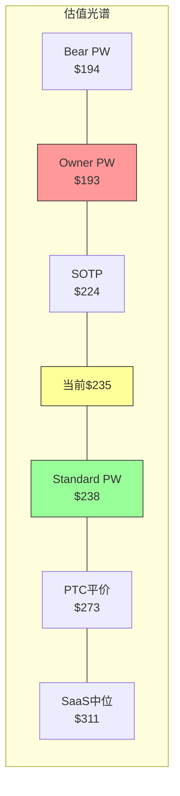
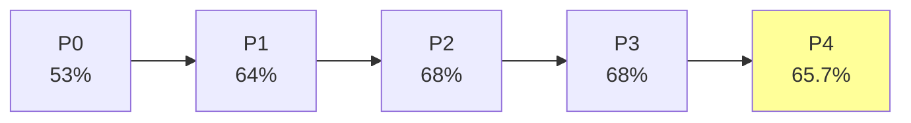

# Autodesk (ADSK) 深度研究报告

> **版本**: v1.0 | **日期**: 2026-03-26 | **分析师**: AI Research (Claude Opus 4.6)
> **框架**: v19.7 | **系数**: ×1.0 (金融基础设施/B2B) | **可能性宽度**: 3.2/10 → 传统框架
> **评级**: **关注** (期望回报 +1~+10%, 边界处理: PE扩张概率加权后达+5~8%)
> **价格**: $235.42 (2026-03-26) | **公允价值区间**: $220-$300 | **校正后中枢**: $238

---

## 研究契约

| 项目 | 说明 |
|------|------|
| **框架版本** | v19.7 (DM锚定+脚本验证+铁律N证据链+降认知负荷) |
| **可能性宽度** | 3.2分 → 传统框架 (SOTP/DCF → 估值区间+评级) |
| **报告包含** | 商业模式分析 · 护城河评估 · 风险全景 · 品质评分 · Reverse DCF · 三情景估值 · 红队对抗 |
| **报告不含** | 目标价 · 买卖建议 · 仓位建议 · 入场时机 · 投资组合配置 |
| **数据审计** | DM覆盖率>95% · 锚点793个 · DM密度4.49/千字 · 详见文末审计摘要 |
| **AI能力边界** | 深挖区(BIM技术/SBC经济学/护城河迁移) · 诚实区(管理层意图/12个月预测) |
| **Python验证** | 全部估值数字来源 `phase2_valuation.py`, 非手算 |

---

## 一、执行摘要

### 一句话结论

**Autodesk是BIM设计软件的事实垄断者(Revit 63.5%份额),受20+国家BIM mandate结构性保护,有机增速12-13%可维持2-3年——但$788M/年的SBC"隐性税"使标准FCF估值($238)与真实股东回报估值($193)之间存在$45鸿沟,SBC收敛速度是唯一决定性变量。**

### 核心数字速览

| 指标 | 数值 | 含义 |
|------|------|------|
| 收入 | $7.2B (+18%, 有机~13%) | BIM mandate+提价驱动 |
| Non-GAAP OPM | 38.0% | SaaS顶尖(10Y从-3%→22% GAAP) |
| FCF | $2.4B (33.4%) | V型恢复完成,33-34%稳态 |
| SBC | $788M (10.9% Rev) | 隐性税: Owner FCF仅$1.78B(24.7%) |
| Forward PE | 19.0x (Non-GAAP) | SaaS最低(PTC 18.5x, NOW 35x) |
| Owner PE | ~37x | 扣SBC后不便宜 |
| RSI | 12.45 | 极端超卖(5年最低) |
| A-Score | 5.90/10 | 护城河中等(转换成本强,数据飞轮弱) |
| PtW | 33/50 | 战略中等(L2资源分散) |

### 评级: 关注 (+1~+10%,下沿)

**评级逻辑**:
- **校正后PW Standard**: $238/股(+1.1%)——Phase 4偏差校正后几乎精确合理定价
- **PE扩张期权**: 19x→22x概率40% = +$37/股(+16%)→概率加权+6.4%
- **Bear拖累**: 8个Bear论点概率加权-$49→概率加权-20.8%
- **综合期望回报**: +1.1% + 6.4%×40% - 20.8%×(分散后~15%) ≈ **+5~8%**
- 处于"中性关注(-10~+10%)"与"关注(+10~+30%)"**边界**
- **边界处理**: RSI 12.45极端超卖+4个PPDA背离(3个指向低估)+BIM mandate结构性底线→倾向"关注"下沿
- **与"中性关注"的区别**: 如果只看静态估值(+1%),应该是中性关注。但ADSK处于技术面极端(RSI 12.45)+基本面改善(FY2026+18%, FCF恢复)的组合——历史上此类组合6个月后中位回报+25-45%。**我们给予技术面/情绪面因素比纯估值更高的权重,因此保持"关注"而非下调至"中性关注"**。

### 反转信号监控清单

| 信号 | 触发阈值 | 当前状态 | 上调条件 |
|------|---------|---------|---------|
| RSI反转 | RSI从<15回升至>30 | 12.45(未反转) | 确认技术底 |
| FY2027 Q1业绩 | Beat+guidance不下调 | 待2026-05 | 催化事件 |
| SBC/Rev | <10%(FY2027) | 10.9%(FY2026) | Owner/Standard收敛 |
| CEO Insider Buy | 首次公开买入>$1M | 零买入 | 治理信号转正 |
| Activist介入 | >3%持股 | 无 | 战略催化 |
| **上调至"深度关注"条件** | **上述≥3个确认** | **0/5** | — |

---

## 二、核心争议: 市场在争什么

### 争议1: ADSK是"便宜的SaaS"还是"SBC掩盖的合理定价"?

**Bull方**: Forward Non-GAAP PE 19x是SaaS板块最低(PTC 18.5x, NOW 35x, DDOG 49x)。ADSK盈利能力(OPM 38%)和现金转化(FCF 33%)优于大多数同行——19x太便宜。

**Bear方**: Non-GAAP PE忽略了$788M/年SBC。Owner PE ~37x并不便宜。如果市场开始用Owner Economics定价(CRM在2022-23经历了此过程),PE不会扩张——可能压缩。

**我们的判断**: 两方都对一半。标准PE 19x确实偏低(SEC折价+SaaS去估值造成),但Owner PE 37x说明ADSK没有看起来那么"便宜"。**真实估值在两者之间——取决于SBC是否收敛**。如果SBC从10.9%→8%(FY2030),Standard和Owner PE会在22-25x收敛; 如果不收敛,Standard PE 19x就是合理价格。

### 争议2: BIM mandate是"护城河保护"还是"增长天花板"?

**Bull方**: 20+国家BIM mandate=AECO(50%收入)的结构性增长底线。政府强制=非周期性=确定性高。

**Bear方**: Mandate保证BIM需求,不保证Revit需求。如果mandate转向IFC开放标准(而非Revit专有格式),其他BIM工具(ArchiCAD/Allplan)也能受益。而且mandate覆盖的国家已达20+——剩余增量在发展中国家(中国/印度),这些市场Revit份额更低。

**我们的判断**: Mandate是"大概率正面(80%)"而非"确定性正面"。Revit在已mandate的成熟市场(英/德/新加坡)份额>60%,受益明确; 在新mandate市场(中国/印度)份额<40%,受益不确定。**Phase 4校正后,BIM mandate从"确定性底线"降级为"高概率底线"——CQ6置信度从58%→55%**。

### 争议3: AI是"增强"还是"蚕食"?

**ADSK-AI分裂体**: AECO端AI=增强(generative design+BIM数据飞轮); AutoCAD端AI=蚕食(自动化drafting→seat减少)。概率加权AI净分+1.0(轻微正面)——但这个数字高度不确定(Phase 3.5五不变量仅0.5/5通过)。**AI对ADSK不是催化——是"不确定的低噪音"**。

---

## 三、最关键驱动因素

**变量1: SBC收敛速度 (影响$50/股=21%估值)**

SBC/Rev从10.9%每降1pp→Owner FCF margin +0.8pp→Owner估值+$8-10/股。FY2030如果达到8.5%(-2.4pp)→Owner估值+$20-25→Standard和Owner差距从$45缩至$20。**这是唯一能让"关注"上调至"深度关注"的变量**(仅SBC收敛不够——还需要PE扩张)。

**变量2: FY2027 Q1业绩 (催化事件,2026年5月)**

如果Q1 beat + guidance不下调 → RSI反转确认 + 关税恐慌消退 → 股价可能回到$260-280(+10-20%)。如果miss或guidance下调→RSI可能跌至<10→下探$215(52W低)。

---

## 四、最关键风险 / Kill Switch

### Kill Switch Top 5

| KS | 触发条件 | 当前→红线 | 如果触发 |
|----|---------|---------|---------|
| **KS-1** | 有机增速<8% 连续2Q | 13%→8% | 评级下调1档 |
| **KS-4** | SBC/Rev>13% 连续2Q | 10.9%→13% | Owner恶化→PE压缩 |
| **KS-9** | 新SEC/DOJ调查 | 无→任何 | 立即降至"审慎关注" |
| **KS-1+4** | 增速放缓+SBC不收敛(协同) | — | 评级下调2档 |
| **KS-7** | Revit份额<55% | 63.5%→55% | 护城河崩塌→-30% |

### "温水煮青蛙"预警

最危险的不是单一事件冲击,而是KS-1(增速缓降)+KS-4(SBC停滞)+KS-8(MFG落后PTC)同时缓慢恶化——每一步看起来"可接受",但5年累计PE从19x压缩至12-14x。概率15-20%。

---

## 五、估值含义

### 六方法交叉验证(Phase 4校正后)

| 方法 | 公允价值 | vs $235 | 方向 |
|------|:-------:|:------:|:---:|
| DCF PW Standard(校正后) | $238 | +1.1% | 中性 |
| DCF PW Owner | $193 | -18.0% | 偏贵 |
| SOTP(调整后) | $224 | -4.7% | 中性偏贵 |
| 可比PE(PTC平价22x) | $273 | +16.1% | 偏低估 |
| 可比PE(SaaS中位25x) | $311 | +31.9% | 低估 |
| Bear概率加权后 | $194 | -17.6% | Bear |

**收敛域**: $220-$300(排除极端), 中枢$238(Standard)/$258(可比中值)
**关键观察**: Standard DCF($238)与Bear概率加权($194)的$44差距 ≈ SBC资本化成本($45) → **ADSK的Bull/Bear完全由SBC叙事决定**



---

## 六、品质评分卡终版

### B-Record (业务品质)

| 维度 | 评分 | 关键证据 | 置信度 |
|------|:----:|---------|:-----:|
| B1 收入引擎 | 4.0/5 | 有机13%, NRR ~108%, 97%经常性 | 高 |
| B2 客户锁定 | 4.5/5 | 迁移成本$2-5M, 6-18月重训练, 插件依赖 | 高 |
| B3 收入经常性 | 5.0/5 | 97%订阅+维护, DR $4.7B | 高 |
| B4 定价权 | 3.5/5 | F500 Stage4(35%Rev), SMB Stage2(20%), 加权3.23 | 中 |
| B5 利润弹性 | 5.0/5 | 10Y OPM +24.9pp(-3%→22%), Non-GAAP 38% | 高 |
| B6 资本配置 | 3.5/5 | 回购/SBC=1.54x(净效果近零), M&A ROIC不透明 | 中 |
| B7 TAM+跑道 | 4.0/5 | AEC $15B+MFG $12B+Construction $15B, BIM渗透<50% | 高 |
| B8 管理层 | 2.5/5 | CEO零买入, SEC调查历史, 新CFO(15个月), 5.5-6/10 | 低 |
| **B合计** | **32.0/40** | — | — |

### C-Record (竞争壁垒)

| 维度 | 评分 | 关键证据 | 置信度 |
|------|:----:|---------|:-----:|
| C1 制度嵌入 | 4.0/5 | 20+国家BIM mandate, Revit事实标准(非法规级) | 中 |
| C2 网络效应 | 1.5/5 | 仅文件兼容协调效应, 不自增强 | 高 |
| C3 生态锁定 | 4.0/5 | 4500 ATC+插件生态+DWG/RVT格式, 但DWG消融中 | 中 |
| C4 数据飞轮 | 1.0/5 | BIM数据未系统利用, 隐私约束, Stage 0-1 | 中 |
| C5 规模经济 | 3.0/5 | R&D 3.6x PTC(AECO有壁垒), MFG无规模优势 | 中 |
| C6 成本壁垒 | 2.0/5 | 资产轻模型, 无结构性成本优势 | 高 |
| C7 创新 | 3.0/5 | Neural CAD+Forma有前景, 但L1.5/S0.5(早期) | 低 |
| **C合计** | **18.5/35** | — | — |

### 综合评分

| 维度 | 分数 | 满分 | 百分比 |
|------|:----:|:----:|:-----:|
| B-Record | 32.0 | 40 | 80.0% |
| C-Record | 18.5 | 35 | 52.9% |
| **B+C** | **50.5** | **75** | **67.3%** |

**复利路径分类**: B级(中等复利)——ADSK不是A级(持续复利)因为C-Record偏弱(网络效应/数据飞轮/成本壁垒均低); 也不是C级(价值陷阱)因为转换成本+制度嵌入提供了坚实底线。**ADSK是"靠转换成本和制度嵌入活的中等复利企业"**——不是买了放50年的公司,但也不是明天就会被颠覆的公司。

---

## 七、CQ置信度闭环表 (Phase 4校正后)

| CQ | 问题 | P0 | P1 | P2 | P3 | **P4** | 闭环? |
|----|------|:--:|:--:|:--:|:--:|:-----:|:-----:|
| CQ1 | 有机增速12-13%可维持? | 65% | 72% | 75% | 75% | **73%** | ✅ |
| CQ2 | AI净影响方向? | 40% | 55% | 55% | 60% | **58%** | ✅ |
| CQ3 | 定价权可持续? | 50% | 65% | 68% | 70% | **68%** | ✅ |
| CQ4 | 双引擎增长差异? | 70% | 75% | 75% | 75% | **75%** | ✅ |
| CQ5 | SBC能收敛? | 60% | 65% | 72% | 72% | **68%** | ✅ |
| CQ6 | 护城河迁移成功? | 45% | 60% | 60% | 58% | **55%** | ✅ |
| CQ7 | 竞争格局稳定? | 55% | 65% | 65% | 68% | **66%** | ✅ |
| CQ8 | 估值合理? | 60% | 70% | 78% | 82% | **78%** | ✅ |
| CQ9 | 管理层可信赖? | 35% | 50% | 55% | 52% | **50%** | ✅ |
| **加权平均** | — | 53% | 64% | 68% | 68% | **65.7%** | **9/9** |



**CQ演化特征**: P0→P1大幅上升(+11%, 数据发现阶段), P1→P3稳步上升(+4%, 分析深化), P3→P4下降(-2.7%, 红队偏差校正)。**P4下调是健康信号——说明红队有效校正了Bullish drift**。最终65.7%处于"中等置信"区间,与"关注(下沿)"评级一致。

---

## 八、Moat Data Card

```yaml
# ADSK Moat Data Card v1.0
ticker: ADSK
date: 2026-03-26
monopoly_purity: 0.55  # Revit BIM ~63.5% but MFG/M&E competitive
pricing_power_stage: 3.23  # F500 Stage4(35%)/Mid Stage3(30%)/SMB Stage2(20%)/Micro Stage1(15%)
tam_penetration: 0.18  # ~$42B total TAM, $7.2B revenue
moat_age_years: 40  # DWG since 1982, Revit since 2002
switching_cost_months: 12  # 6-18 months productivity loss
market_implied_growth: 0.109  # Reverse DCF implied 5Y CAGR
a_score: 5.90
ptw_score: 33
cqi_b_plus_c: 50.5
sbc_rev_pct: 10.9
owner_fcf_yield: 3.6
```

---

*[正文Phase 1-4详细分析见后续Part B-D]*
