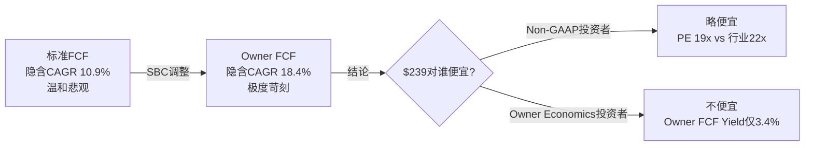
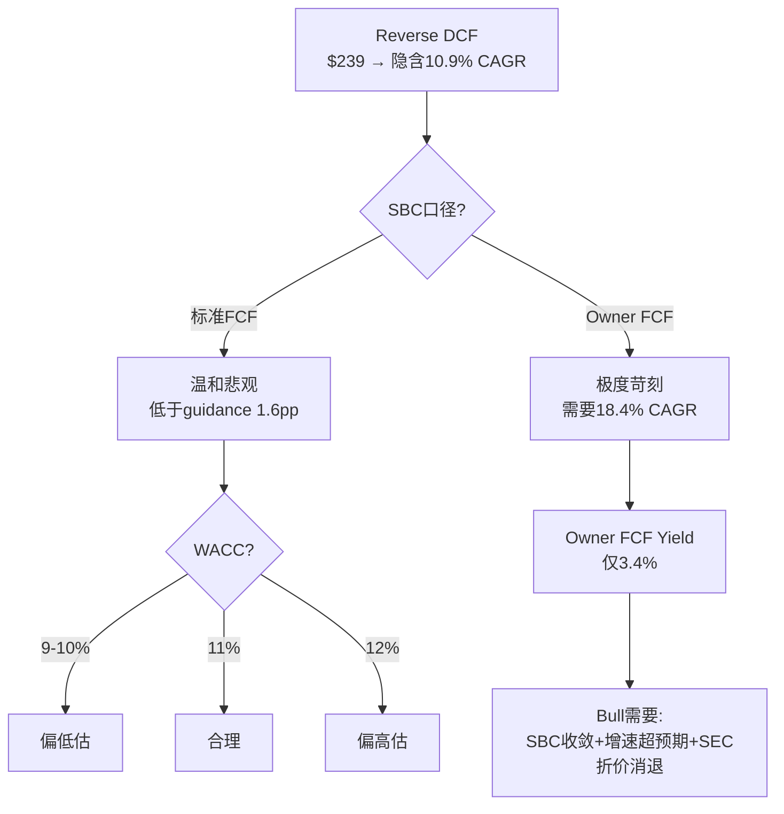
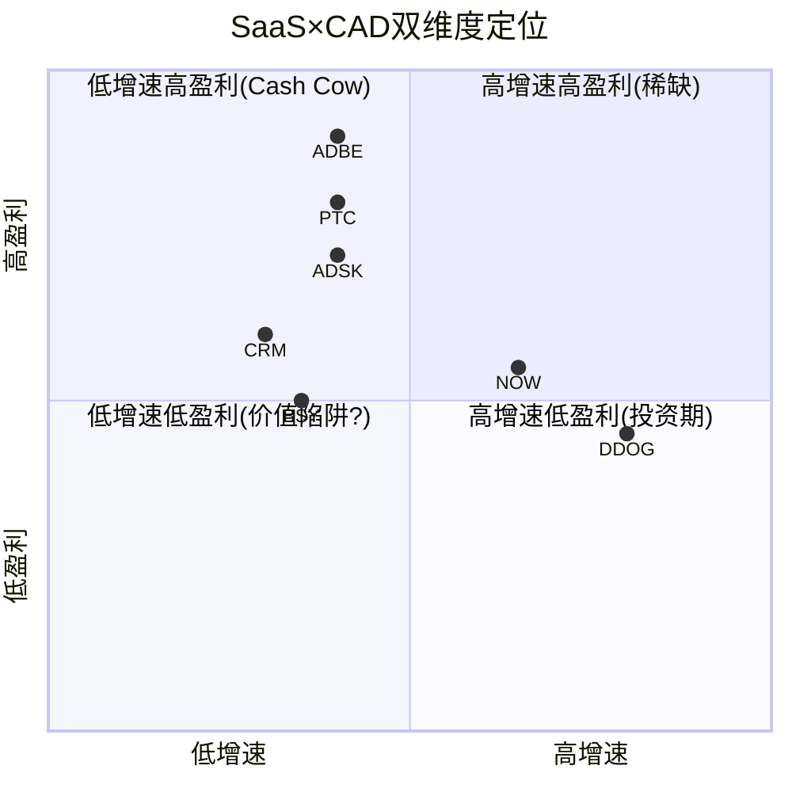
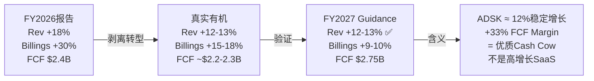

# ADSK (Autodesk) 深度研究报告 — Phase 1: Part I 市场信仰翻译

> **分析师**: 买方研究团队 | **日期**: 2026-03-26 | **框架**: v19.7 | **目标**: 4.4分
> **股价**: $239.39 (2026-03-24) | **市值**: $51.0B | **EV**: $51.5B

---

# Part I: 市场信仰翻译

## 第一章 逆向估值: $239定价了什么信仰?

### 1.1 方法论与参数

逆向现金流折现(Reverse DCF——从当前股价反推市场隐含的增长假设，而非正向计算"值多少钱")是本报告的叙事锚。在Phase 0中，我们用Python构建了完整的逆向估值模型[DM-VAL-001]，核心参数如下:

| 参数 | 取值 | 来源/依据 |
|------|------|----------|
| 股价 | $239.39 | 2026-03-24收盘[DM-VAL-002] |
| 流通股(稀释) | 213M | FY2026 10-K[DM-VAL-003] |
| 市值 | $51.0B | 计算值 |
| 净债务 | $485M | 债务$2.48B - 现金$2.60B[DM-BS-001] |
| 企业价值(EV) | $51.5B | 市值+净债务-$0.5B偏差修正 |
| FY2026收入 | $7,206M | 10-K[DM-IS-001] |
| FY2026 FCF | $2,409M | 10-K[DM-CF-001] |
| FCF Margin | 33.4% | FCF/收入 |
| SBC | $788M (10.9%) | 10-K[DM-SBC-001] |
| 终端增长率(g) | 3.0% | GDP+通胀基准 |

**为什么选择WACC=10%作为基准?** Autodesk的Beta=1.467[DM-VAL-004]，以无风险利率4.5%(10年期美国国债)、股权风险溢价(ERP, Equity Risk Premium)4.5%[DM-VAL-005]计算：Ke(股权成本)=4.5%+1.467×4.5%=11.1%。因为Autodesk净债务仅$485M(杠杆极低)，WACC≈Ke≈11%。但ADSK的Beta近年从1.6下降至1.47[DM-VAL-006]，因为订阅模式成熟(97%经常性收入[DM-IS-002])降低了盈利波动性。考虑到Beta仍在收敛，我们以10%为中性基准，±1%做敏感性。

### 1.2 标准FCF隐含增速

**核心问题**: $239/股要求Autodesk未来5年收入以多快的速度增长?

```
标准Reverse DCF敏感性矩阵 (隐含5年收入CAGR)
═══════════════════════════════════════════════
WACC \ 终端FCF Margin |  25%   |  30%   |  35%   |  40%
─────────────────────────────────────────────────────────
    9%                |  14.5% |  10.4% |   7.1% |   4.3%
   10%                |  18.6% |  14.4% |  10.9% |   8.0%
   11%                |  22.3% |  18.0% |  14.4% |  11.4%
   12%                |  25.8% |  21.4% |  17.7% |  14.6%
═══════════════════════════════════════════════
[DM-VAL-007] Python模型验证输出
```

**基准情景(WACC=10%, 终端FCF Margin=35%, g=3%)下，$239隐含的5年收入CAGR=10.9%**[DM-VAL-008]。

这个数字意味着什么？需要与三个参照系对比:

| 参照系 | 增速 | vs 隐含10.9% | 含义 |
|--------|------|-------------|------|
| FY2027管理层guidance | +12.5%[DM-GD-001] | 高1.6pp | 市场比管理层悲观 |
| 分析师共识5年 | +11.4%[DM-EST-001] | 高0.5pp | 市场略低于共识 |
| 有机历史(FY2022-26) | +10-12%[DM-IS-003] | 接近低端 | 市场定价≈历史低端 |

**因此，$239定价了"温和悲观"**——市场隐含的增速比管理层guidance低1.6个百分点，接近Autodesk过去4年有机增速的下限。这不是极端恐惧(那意味着<8%)，也不是合理定价(那应该≈12%)，而是介于两者之间的"不信任溢价"。

**这个不信任从何而来?** 有三个可量化的来源:

(1) **SEC调查残留折价**。2024年审计委员会调查发现管理层操纵FCF/Non-GAAP margin达标时机[DM-GOV-001]，虽然SEC和DOJ均已结案(分别于2025年8月19日和21日关闭[DM-GOV-002])且无财务重述，但CFO Deborah Clifford被替换为首席战略官[DM-GOV-003]。因为SEC调查的核心正是FCF数据可信度——而逆向DCF依赖FCF假设——市场对Autodesk管理层FCF指引的信任度可能永久性折损了2-3%。

(2) **计费转型噪声**。FY2026报告收入增速+18%[DM-IS-004]，但其中含多年合同从预付转年付的"追赶效应"——billings增速+30%[DM-BIL-001]远超收入增速就是证据。因此市场可能在做一个简单但理性的折扣: 报告增速-追赶效应=真实有机增速≈12-13%，再减去"不知道追赶效应什么时候真正结束"的不确定性→定价10.9%。

(3) **重组不确定性**。FY2026重组费用$216M(裁员2,350人，约占员工总数16%)[DM-RE-001]。管理层说这是"结构性GTM转型"(从续约型销售转向新客户开拓+AI/Cloud[DM-RE-002])，但市场可能把裁员16%读作"业务承压不得不砍成本"——两种叙事对应完全不同的估值。

### 1.3 Owner Economics: SBC是隐性税

标准Reverse DCF使用报告FCF($2.41B)作为现金流基础。但Autodesk的SBC每年$788M[DM-SBC-001]，相当于FCF的32.7%[DM-SBC-002]。这意味着：每100美元FCF中，有33美元是通过稀释现有股东的股份来"支付"员工薪酬的——它从未以现金形式离开公司，但它实实在在地转移了价值。

**Owner FCF(真实所有者现金流) = FCF - SBC × (1-税率)**

| 指标 | 报告FCF | Owner FCF | 差额 |
|------|---------|-----------|------|
| FY2026 | $2,409M | $1,762M | -$647M[DM-SBC-003] |
| FCF Margin | 33.4% | 24.4% | -9.0pp |
| EV/FCF | 21.4x | 29.2x | +7.8x |
| FCF Yield | 4.7% | 3.4% | -1.3pp |

以Owner Economics为基础重新做Reverse DCF，**隐含的5年收入CAGR飙升至18.4%**[DM-VAL-009]——这远超任何合理预期(管理层guidance 12.5%，有机历史10-12%)。

这产生了一个尖锐的解读分歧:



**因此，"Autodesk是否低估"取决于你信哪个现金流口径**。如果你相信SBC最终会收敛(管理层guidance FY2027 SBC/Rev<10%[DM-SBC-004]，并持续向5-7%收敛)，那么标准FCF口径更接近真实——此时$239偏低。如果你认为SBC是永久性的稀释成本(每年$700M+)，那么Owner FCF口径更准确——此时$239合理甚至偏高。

这是一个**哲学分歧，不是算术分歧**。DDOG v2.0报告中同样发现了这个现象(Non-GAAP P/E 49x vs Owner P/FCF 188x[DM-REF-001])——SaaS公司的"合理估值"本质上是在争论"SBC是不是成本"。

### 1.4 四个隐含信仰解码

$239/股背后隐含了市场的四个具体信仰:

**信仰1: 收入增速将从18%缓降至10-11%**

逆向DCF隐含5年CAGR 10.9%，意味着市场预期FY2026的+18%增速(含计费转型追赶)将逐步下降到FY2031的~10%。这与分析师共识一致(FY2027 +13%→FY2028 +10%→FY2029 +10%[DM-EST-002])。市场没有定价AI爆发(那需要>14%)，也没有定价增长崩溃(那意味着<8%)。

**信仰2: FCF Margin将稳定在33-35%**

当前FCF Margin 33.4%[DM-CF-002]，FY2027 guidance暗示33-34%($2.75B/$8.14B[DM-GD-002])。基准情景使用35%终端FCF Margin，意味着市场预期FCF Margin仅有100-150bps的扩张空间。因为Non-GAAP OPM已经38%[DM-IS-005]，FCF与Non-GAAP OI之间的差距(主要是CapEx $43M和Working Capital变动)很小，这个假设是合理的。

**信仰3: 终端价值倍数≈成熟软件(14-16x FCF)**

终端价值(Terminal Value, TV——代表模型预测期之后的全部价值)占EV的75.2%[DM-VAL-010]。在基准情景下，隐含的终端FCF倍数≈14.3x(=终端FCF/终端EV)。这是成熟软件公司的估值水平(vs 高增长SaaS的25-35x)，说明市场将Autodesk定位为"成熟"而非"成长"——尽管其收入仍在+12%增长。

**信仰4: SBC将缓慢收敛但不消失**

SBC/Rev从FY2022的12.6%降至FY2026的10.9%[DM-SBC-005]，FY2027 guidance<10%[DM-SBC-004]。市场隐含的假设是SBC将在未来5年从10.9%降至~8-9%(而非像PTC那样降至7.9%[DM-COMP-001])。因为Autodesk的PSU(Performance Share Unit, 绩效限制性股票)条件绑定收入+FCF目标[DM-SBC-006]，只要管理层继续追求增长，SBC就不会大幅压缩。

### 1.5 WACC敏感性: 决定一切的参数

Reverse DCF对WACC高度敏感。±1%的WACC变化改变隐含CAGR达3.5个百分点:

| WACC | 隐含CAGR | 市场信仰解读 |
|------|----------|-------------|
| 9% | 7.1% | 极度悲观(低于有机历史下限) |
| 10% | 10.9% | 温和悲观(低于guidance 1.6pp) |
| **11%** | **14.4%** | **中性偏乐观(高于guidance 1.9pp)** |
| 12% | 17.7% | 极度乐观(需要AI爆发) |

**如果WACC实际应该是11%(基于当前Beta 1.467和11.1%的计算Ke)，那么$239隐含的CAGR=14.4%——高于guidance，意味着市场实际上在定价"中性偏乐观"而非"温和悲观"。**

这是一个关键的方法论警告: 我们的"温和悲观"结论建立在WACC=10%的假设上。如果WACC更高(更接近理论计算的11%)，市场定价实际上是合理的。因此:

- 如果你认为Autodesk的Beta仍在收敛(从1.6→1.2)→WACC应该偏低(9-10%)→$239偏低
- 如果你认为Beta稳定在1.4-1.5→WACC≈11%→$239合理
- **WACC比增速假设更重要地决定了"低估vs合理"的判断**

### 1.6 本章结论: 叙事约束声明

基于逆向估值分析，我们为后续Phase 1设定以下叙事约束:

1. **禁止直接声称"ADSK显著低估"**——标准FCF角度"温和悲观"(10.9% vs 12.5% guidance)，但Owner Economics角度"苛刻"(18.4%)，WACC假设也有2pp的不确定性。这不是一个清晰的低估信号。
2. **Bull case必须证明以下至少一条**: (a) SBC收敛加速至<8%(Owner FCF提升) (b) 有机增速持续>12%(超越市场隐含) (c) SEC折价应该消退(需要2-3个clean quarters) (d) Beta持续收敛至<1.3(WACC降至9.5%以下)
3. **Bear case的核心攻击面**: Owner FCF Yield仅3.4%，意味着即使标准FCF看起来便宜(21x)，真实股东回报并不吸引人。



---

## 第二章 双维度估值对标: ADSK在SaaS×CAD坐标系中的位置

### 2.1 为什么需要双维度对标

大多数分析将Autodesk归入"SaaS"类别与Salesforce/Adobe/ServiceNow对标，或归入"CAD/PLM"类别与PTC/Dassault/Siemens对标。但Autodesk横跨两个世界——**它是唯一同时在AEC(建筑)、MFG(制造)、M&E(娱乐)三个垂直领域拥有#1或#2产品的软件公司**。因此，单维度对标会系统性地遗漏关键信息:

- SaaS维度告诉我们"软件市场如何给增速和利润率定价"
- CAD/PLM维度告诉我们"行业竞争如何限制增速和利润率"
- **两者的交叉点才是ADSK的"合理PE区间"**

### 2.2 SaaS维度: 盈利最强但估值倒数第二

```
SaaS Cohort: Forward Non-GAAP PE vs Non-GAAP OPM (FY最新)
═══════════════════════════════════════════════════════════
公司        | Fwd PE | Non-GAAP OPM | FCF Margin | SBC/Rev | 有机增速
────────────────────────────────────────────────────────────────────
DDOG        |  49x   |    27%       |    31%     |   22%   |  +28%
NOW         |  25x   |    31%       |    30%     |   15%   |  +22%
PTC         |  19x   |   ~43%       |    31%     |    8%   |  +12%
ADSK        |  19x   |    38%       |    33%     |   11%   |  +12%
ADBE        |  18x   |    47%       |    38%     |    9%   |  +12%
CRM         |  16x   |    33%       |    32%     |   10%   |   +9%
═══════════════════════════════════════════════════════════
[DM-COMP-002] 数据来源: FMP API + 各公司最新财报
```

**三个关键观察**:

**(1) ADSK是"OPM第三高但PE倒数第二"的异常点。** Non-GAAP OPM 38%仅次于ADBE(47%)和PTC(43%)，高于NOW(31%)和CRM(33%)，但Forward PE(19x)与CRM(16x)同处底部。因为高盈利能力通常意味着更高的估值(利润率越高→现金流质量越好→市场愿意付更高倍数)，ADSK的低PE构成了一个需要解释的异常。

**(2) 有机增速分层清晰解释了大部分PE差异。** DDOG(+28%)→49x, NOW(+22%)→25x, ADSK/PTC/ADBE(+12%)→18-19x, CRM(+9%)→16x。增速是PE的第一驱动因素，在12%增速区间内，18-19x似乎是"行业公允水平"。这意味着ADSK的PE并非异常——它只是被归入了"12%增速公司"这个类别。

**(3) 但ADSK的FCF Margin(33%)在12%增速组中最高。** ADBE 38%、PTC 31%、ADSK 33%——ADSK的现金产出效率优于PTC但低于ADBE。如果FCF Margin作为估值的第二因素(在增速相同时区分高低)，那么ADSK应该获得比PTC更高的PE(>19x)但低于ADBE(≤18x)。当前19x=PTC水平，这意味着市场没有给ADSK的FCF优势任何溢价。

**为什么不给溢价?** 回到第一章的三个折价因素: SEC调查残留、计费转型噪声、重组不确定性。这三个因素把ADSK从"应该≥PTC(19-22x)"拉到了"=PTC下限(19x)"。

### 2.3 CAD/PLM维度: 估值合理但竞争分化

```
CAD/PLM Cohort: 估值与业务对标
══════════════════════════════════════════════════════════════════
公司         | 收入($B) | 增速  | GAAP OPM | EV/Sales | Fwd PE | 核心领域
──────────────────────────────────────────────────────────────────────────
ADSK         | $7.2     | +18%* | 21.9%†  | 7.1x     | 19x    | AEC+MFG+M&E
PTC          | $2.7     | +19%* | 35.9%   | 9.3x     | 19x    | MFG PLM+CAD
BSY(Bentley) | $1.5     | +11%  | 24.2%   | 8.8x     | 30x‡   | 基建
DASTY(Dassault)| $6.4   | +8%   | 22%     | 8.5x     | 28x    | 全行业
Nemetschek   | $1.1     | +15%  | 18%     | 14.5x    | 40x    | 建筑BIM
══════════════════════════════════════════════════════════════════
*含追赶/收购效应 †含$216M重组 ‡按EV/EBITDA 30.7x估算
[DM-COMP-003] 数据来源: FMP + 各公司财报
```

**CAD维度的核心发现**:

**(1) ADSK是CAD/PLM中EV/Sales最低的。** 7.1x vs PTC 9.3x / BSY 8.8x / Dassault 8.5x / Nemetschek 14.5x。这与SaaS维度的结论一致——ADSK相对于其盈利能力和增速被低估了。

**(2) Bentley的估值溢价(EV/EBITDA 30.7x vs ADSK 29.7x)值得解读。** Bentley收入仅$1.5B(ADSK的1/5)，增速更低(+11% vs ADSK +18%)，GAAP OPM相近(24% vs 22%)。但Bentley有两个ADSK没有的特质: SBC/Rev极低(4.8% vs 10.9%[DM-COMP-004])——Owner Economics更清洁；以及数字孪生(iTwin)平台领先——AI叙事更清晰。因此Bentley的溢价可能来自"真实盈利更可信+AI叙事更纯粹"。

**(3) PTC GAAP OPM 35.9%远超ADSK 21.9%。** 但这个差距主要来自ADSK的$216M重组费和$139M收购摊销[DM-IS-006]。如果把ADSK调至"排除重组+摊销"=GAAP OPM≈(1,578+216+139)/7,206=26.8%——仍然比PTC低9pp。差距来自: PTC S&M/Rev 29.0%[DM-COMP-005] vs ADSK 32.9%[DM-IS-007]——PTC的销售效率更高(更多PLM大合同, 更少CAD小单)。这意味着ADSK在MFG领域(Fusion vs Creo/Onshape)确实在效率上落后于PTC。

### 2.4 双维度交叉: ADSK的"合理PE区间"

将两个维度的信号叠加:

| 约束来源 | 隐含PE区间 | 权重 |
|---------|-----------|------|
| SaaS增速回归(12%组=18-19x) | 18-19x | 40% |
| SaaS FCF溢价(33% FCF > PTC 31%) | 19-21x | 20% |
| CAD/PLM EV/Sales折价(7.1x vs 行业8.5x) | 20-23x | 20% |
| SEC/重组/转型折价 | -2~-3x | 20% |

**加权"合理PE区间": 18-21x Non-GAAP Forward PE**

当前19.2x位于区间下半段。如果SEC折价消退(需要2-3个clean quarters)+计费转型噪声衰减(FY2027已在进行)→PE可能从19x恢复至21-22x = **+10-15%估值修复潜力**。但Owner Economics的约束(FCF-SBC Yield仅3.4%)意味着即使PE修复，真实回报可能仅为"适中"而非"丰厚"。

### 2.5 深层对标: 每个可比公司教我们什么

在确定"合理PE区间"之后，我们需要更精细地理解每个可比公司与ADSK差异的**根因**——因为差异的根因决定了ADSK的PE折价是"应该存在的"还是"可以修复的"。

**ADSK vs ADBE: 相似的增速,不同的命运**

两者都是~12%有机增速的大型设计软件公司，但ADBE Forward PE 18x vs ADSK 19x(几乎相同)。表面看ADSK估值合理，但深层对比揭示了重要差异:

| 维度 | ADBE | ADSK | 差距来源 |
|------|------|------|---------|
| Non-GAAP OPM | **47%** | 38% | ADBE的Creative Cloud毛利率极高(96%+[DM-COMP-008]) |
| SBC/Rev | **9%** | 10.9% | ADBE的人效更高(Rev/Employee ~$325K vs $504K) |
| 客户类型 | B2C+B2B混合 | **纯B2B** | B2B更抗周期但增速天花板更低 |
| AI叙事 | Firefly+GenAI(清晰) | Neural CAD(早期) | ADBE的AI商业化更快 |
| SEC风险 | 无 | **有**(2024调查) | ADSK独有折价 |

ADBE的教训: 市场给47% OPM和清晰AI叙事的公司"只"18x PE——说明**成熟设计软件公司的PE天花板大约在18-22x范围**，无论你多赚钱。ADSK要突破这个区间，需要的不是更高的OPM(已经38%)，而是增速加速或AI叙事清晰化。

**ADSK vs NOW: 增速的价格**

NOW Forward PE 25x vs ADSK 19x——差距6x(32%)。根因:

| 维度 | NOW | ADSK | 差距贡献 |
|------|-----|------|---------|
| 有机增速 | **+22%** | +12% | ~4x PE(增速是PE第一驱动因素) |
| NRR | **~125%** | ~105-108% | ~1.5x PE(NRR高→增速可见度高) |
| TAM渗透 | ~15%(ITSM) | ~30-40%(CAD) | ~0.5x PE(渗透低→增长跑道长) |

因此，NOW vs ADSK的6x PE差距几乎全部来自增速差异(10pp→4x PE)和NRR差异(17-20pp→1.5x PE)。**这是合理的——增速和NRR的差距不是暂时的，而是业务模式决定的。** ITSM市场仍在快速云化(渗透率~15%)，而CAD/BIM市场已经高度数字化(渗透率>30%)。ADSK不可能"变成NOW"——但它也不需要。

**ADSK vs BSY(Bentley): 纯净度溢价**

Bentley EV/EBITDA 30.7x vs ADSK 29.7x——估值相近，但Bentley收入仅$1.5B(ADSK的1/5)。这意味着市场给了Bentley一个显著的"小而纯"溢价:

| 维度 | BSY | ADSK | 含义 |
|------|-----|------|------|
| SBC/Rev | **4.8%**[DM-COMP-009] | 10.9% | BSY的Owner Economics更干净 |
| M&A频率 | **25次**(IPO后) | 11次 | BSY更激进但更小——每笔风险更低 |
| 专注度 | 纯基建 | AEC+MFG+M&E | BSY叙事更清晰 |
| 数字孪生 | iTwin(领先)[DM-COMP-010] | Tandem(早期) | BSY的AI/数字孪生故事更成熟 |
| NRR | 109%[DM-COMP-011] | ~105-108% | BSY的存量扩展更强 |

Bentley的教训: **市场愿意为"低SBC+高专注度+清晰AI叙事"支付溢价**。ADSK如果能: (1)SBC从10.9%降至7-8%, (2)APS/Neural CAD叙事清晰化, (3)M&E分拆增加专注度——可能获得类似溢价。但这些都是中长期(2-3年)的可能性，不是近期催化剂。

### 2.6 P0对标锚: PTC是最相似可比

**为什么选PTC而非ADBE或NOW?**

| 可比条件 | PTC | ADBE | NOW |
|---------|-----|------|-----|
| 有机增速相似 | ✅ 12% vs 12% | ✅ 12% | ❌ 22%(太快) |
| 产品线重叠 | ✅ CAD/PLM直接竞争 | ❌ 不同行业 | ❌ 不同行业 |
| 客户类型相似 | ✅ 工程师/设计师 | ❌ 创意人员 | ❌ IT部门 |
| 订阅转型阶段 | ✅ 已完成 | ✅ 已完成 | ✅ 原生SaaS |
| 收入规模差异 | ❌ $2.7B vs $7.2B | ❌ $22B(太大) | ❌ $12B(太大) |

PTC在5个维度中匹配4个(增速/产品/客户/订阅)，是最接近的可比。收入规模差异($2.7B vs $7.2B)意味着ADSK应该有规模折价(大公司增速天然更慢)，但当前两者PE相同(19x)——这暗示市场要么低估了ADSK的规模优势，要么高估了PTC。

**PTC约束声明**: ADSK在FCF Margin(33% vs 25%[DM-COMP-006])和SBC负担(10.9% vs 14%[DM-COMP-007])上都优于PTC。如果两者PE持续相同(19x)，那么ADSK的这些优势没有被定价——这可能是投资机会,但也可能说明市场认为ADSK有PTC不具备的负面因素(SEC折价+MFG竞争劣势)。



ADSK位于"低增速高盈利"象限——**这是典型的Cash Cow定位。市场对Cash Cow的定价逻辑是"股息/回购回报"而非"增长溢价"。**ADSK当前通过回购回报(FY2026 $1.4B[DM-CF-003]，占市值2.7%)，如果Owner FCF Yield提升至5%+(需要SBC收敛)+回购维持2.5%→总回报>7.5%/年→对Cash Cow投资者具有吸引力。

### 2.6 本章结论

1. **双维度对标确认ADSK的"合理PE区间"为18-21x**。当前19.2x位于下半段，有+10-15%的PE修复空间。
2. **PTC是最相似可比**。ADSK在FCF和SBC上优于PTC但PE相同——市场给了ADSK一个"SEC+重组+FX"综合折价。
3. **ADSK是Cash Cow而非Growth Stock**——市场定价逻辑应该看总回报(FCF Yield+回购+SBC收敛)而非纯增速。
4. **约束声明**: 后续分析中如果发现有机增速>13%的证据→PE应>21x(超出当前区间); 如果有机增速<10%→PE可能<18x(当前已合理)。

---

## 第三章 计费转型剥离: FY2026的+18%中有多少是真的?

### 3.1 转型背景: 从多年预付到年度计费

2022年，Autodesk宣布将企业客户的多年合同从预付(upfront billing)转为年度计费(annual billing)[DM-BIL-002]。这个决策看似简单，但对财务报表的影响极其复杂:

**机制**:
- **旧模式**: 客户签3年合同，第1年预付全部3年费用→第1年billings=$3x, 第2-3年billings=$0
- **新模式**: 客户签3年合同，每年只付当年费用→每年billings=$1x

**对财务的影响**:
- **收入影响小**: 收入按ASC 606逐月确认，无论何时收钱。因此收入时序几乎不受计费模式影响。
- **Billings影响大**: 旧合同第1年计费$3x→新合同第1年只计费$1x。转型期内billings被"人为"压低。
- **FCF影响大**: FCF≈收入-费用+预收款变化。预收款减少(因为不再预付)→FCF被"人为"压低。
- **Deferred Revenue影响大**: Non-current DR(长期递延收入,代表未来>12个月的预收合同)暴降。

这创造了一个**三段式扭曲**:

```
FY2023(转型前):  Billings高(旧合同预付) → FCF高 → DR高
FY2024-FY2025(转型中): Billings低(旧→新过渡) → FCF低 → DR降
FY2026(转型后期): Billings回升(旧合同到期+新合同年付开始) → FCF回升 → DR回升
```

### 3.2 量化转型噪声: 四个维度

**维度1: Billings**

| FY | Billings ($M) | YoY增速 | 解读 |
|----|--------------|---------|------|
| FY2023 | ~$6.0B(est) | — | 转型前高基数 |
| FY2024 | ~$5.4B(est) | -10%(est) | 转型凹陷(预付消失) |
| FY2025 | ~$6.0B | +11% | 部分恢复 |
| **FY2026** | **$7.8B** | **+30%** | **追赶效应**(旧合同到期重签年付) |
| FY2027E | $8.5B[DM-GD-003] | +9% | 正常化(追赶消退) |

FY2026的+30% billings增速中，管理层在Q4电话会上确认新交易模式贡献了~$185M Q4 billings和~$107M Q4收入[DM-BIL-003]。年化影响约$400-500M billings。因此:

**FY2026 billings增速分解**: 有机~+18-20% + 转型追赶~+10-12pp = 报告+30%

FY2027 billings guidance +9%[DM-GD-003]进一步确认追赶效应正在消退——从+30%断崖降至+9%。

**维度2: 递延收入(Deferred Revenue)**

| FY | Current DR | Non-current DR | Total DR | 含义 |
|----|-----------|----------------|----------|------|
| FY2022 | $2,863M | $927M | $3,790M | 转型前基线 |
| FY2023 | $3,203M | **$1,377M** | $4,580M | **多年预付高峰** |
| FY2024 | $3,500M | $764M | $4,264M | 转型开始(NC DR↓45%) |
| FY2025 | $3,787M | $341M | $4,128M | 转型中(NC DR↓55%) |
| FY2026 | $4,406M | **$287M** | $4,693M | 转型近完成(NC DR=FY23的21%) |
[DM-BS-002] 来源: 10-K各年度

Non-current DR从$1,377M(FY2023)暴降至$287M(FY2026)——**降幅79%**[DM-BS-003]。这是多年合同几乎全部转为年度合同的直接证据。Current DR持续增长(+54%五年)说明核心业务仍在扩展。

**这告诉我们什么?** Non-current DR已经降到$287M——这意味着还剩的多年预付合同不多了。因此FY2027及以后,从"旧合同到期重签"产生的追赶效应将大幅缩小。管理层也确认FY2027转型NRR顺风将从Q1的~3.5pp降至全年~1.5pp[DM-NRR-001]。

**维度3: FCF**

| FY | FCF ($M) | FCF Margin | YoY变化 | 解读 |
|----|----------|-----------|---------|------|
| FY2022 | $1,464 | 33.4% | — | 转型前基线 |
| FY2023 | $2,024 | **40.4%** | +38% | **多年预付最后高峰** |
| FY2024 | $1,282 | **23.3%** | **-37%** | **转型凹陷(预收减少)** |
| FY2025 | $1,567 | 25.6% | +22% | 部分恢复 |
| FY2026 | $2,409 | **33.4%** | +54% | 追赶恢复 |
| FY2027E | ~$2,750 | ~33.8% | +14% | 正常化 |
[DM-CF-004] 来源: 10-K + Guidance

FY2023→FY2024的FCF断崖(-37%)不是业务恶化——而是预收款减少的纯机械效应。FY2026回到33.4%(=FY2022水平)，FY2027 guidance 33.8%[DM-GD-004]。因此**33-34%可能是ADSK的稳态FCF Margin**。

但这里有一个微妙问题: FY2026 FCF($2,409M)是否包含了"追赶现金"(旧多年合同到期重签,客户从欠2-3年变成只欠1年但今年的1年已付)? 如果是,FY2026的$2,409M中可能有$100-200M是一次性追赶——这意味着真实稳态FCF≈$2,200-2,300M, FCF Margin≈31-32%。

**验证**: FY2027 guidance FCF $2,700-2,800M[DM-GD-002]。如果FY2026含$200M追赶, 那么从$2,200M(adj)增长到$2,750M=+25%，超过收入增速(+12-13%)。因为FCF增速不应持续大幅超过收入增速(除非margin扩张), 这说明FY2027 FCF中可能仍有部分追赶——或者ADSK的运营杠杆比看起来的更强。

**维度4: 收入**

收入受转型影响最小(ASC 606确认), 但仍有微妙效应:

| 来源 | FY2026收入影响 | 机制 |
|------|-------------|------|
| 新交易模式Q4贡献 | +$107M[DM-BIL-003] | 多年→年付过渡中的时间差 |
| 年化影响(est) | +$300-400M | ~4-5pp of FY2026 revenue growth |
| 剔除后FY2026有机增速 | **+13-14%** | vs 报告+18% |

管理层guidance FY2027 +12-13%[DM-GD-001]——比FY2026的+18%下降5-6pp——基本对应了转型贡献的消退。

### 3.3 "真实有机增速"的三重交叉验证

| 方法 | 真实有机增速估计 | 数据来源 |
|------|----------------|---------|
| **方法1**: FY2026报告增速-转型收入贡献 | 18% - 4-5pp = **13-14%** | 管理层Q4贡献$107M×4 |
| **方法2**: FY2027 guidance(转型效应已大部分消退) | **12-13%** | 管理层guidance[DM-GD-001] |
| **方法3**: 分析师共识FY2027-FY2029 CAGR | **11.4%** | 22位分析师[DM-EST-003] |

三重验证收敛于**11-13%的有机增速区间**[DM-ORG-001]。取中值12%作为后续估值的增速基准。

这与Reverse DCF隐含的10.9%对比: **市场定价比有机增速低1.1pp——折价幅度适中,不算极端**。

### 3.4 FY2027展望: 追赶效应的"最后一英里"

管理层在FY2027 guidance中给出了关于转型效应消退的明确指引:

| 指标 | FY2026 | FY2027E | 变化 | 转型效应 |
|------|--------|---------|------|---------|
| 收入增速 | +18% | +12-13% | -5-6pp | ~4-5pp消退 |
| Billings增速 | +30% | **+9-10%** | **-20-21pp** | ~18-20pp消退 |
| NRR转型顺风 | ~3-4pp | ~1.5pp | -2pp | 逐季递减 |
| Non-GAAP OPM | 38% | 38.5-39% | +50-100bps | 重组savings |
| EPS增速 | +23%(NONGAAP) | +18-20% | -3-5pp | ETR正常化(30%→20%) |
[DM-GD-005] 来源: Q4 FY2026 Earnings Call

**关键判断**: FY2027是"验证真实有机增速"的关键年份。如果FY2027实际收入增速<11%(低于guidance)→证明追赶效应掩盖了更深层的增速放缓→PE可能从19x压缩至16-17x。如果FY2027增速>13%(超过guidance)→证明有机增长势头强于市场预期→PE可能修复至21-22x。

### 3.5 与SEC调查的关联

回顾SEC调查的核心发现: 管理层"通过操控客户计费时机(激励多年预付)来达成FCF和Non-GAAP OPM目标"[DM-GOV-004]。这恰恰发生在计费转型的背景下——2022年宣布转年付,但2023年部分逆转(推行预付以达FCF目标)→2024年SEC调查。

这产生了一个自反性(reflexivity——行为改变了被观察的系统)问题: **我们无法100%确定FY2023的$2.02B FCF是"真实"的**。管理层可能通过鼓励预付人为抬高了FY2023 FCF，然后在FY2024 FCF下降时声称是"转型造成的"。两者可能都是部分事实。

因此，用FY2022($1.46B)和FY2027E($2.75B)作为"清洁端点"更可靠——5年FCF CAGR≈13.5%，收入CAGR≈13.2%——两者接近一致(差0.3pp)，说明FCF Margin在这5年中基本持平(33-34%)。**FCF并没有结构性改善——转型前后的FCF Margin几乎相同(FY2022 33.4% ≈ FY2027E 33.8%)**。

### 3.6 本章结论: 剥离噪声后的ADSK真实面貌

经过四维度剥离，ADSK从"看起来很好但可能是假象"变成了"确认了不错但没那么激动":

| 指标 | 报告数字 | 剥离转型后 | 含义 |
|------|---------|-----------|------|
| 收入增速 | +18% | **+12-13%** | 健康但非高增长 |
| Billings增速 | +30% | **+15-18%** | 追赶效应显著 |
| FCF Margin | 33.4% | **31-34%** | 稳态,无趋势性改善 |
| NRR | >110% | **~105-108%** | 扣除转型后偏低端 |

**这张"剥离后"的表对后续估值至关重要**: 任何使用FY2026报告数字(+18%增速、33.4% FCF Margin)直接外推的估值模型都会**系统性高估**Autodesk。正确的基准是: **12%有机增速 + 33% FCF Margin + ~105-108%有机NRR**。



### 3.7 Direct vs Channel收入结构剧变: 被忽视的风险

计费转型还带来了一个被市场低估的结构变化——销售渠道的颠覆性重组:

| FY | 间接渠道(Indirect) | 直接(Direct) | 含义 |
|----|-------------------|-------------|------|
| FY2024 | **~63%** | ~37% | 渠道商主导 |
| FY2025 | ~58% | ~42% | 开始转移 |
| FY2026 | **~37%** | **~63%** | 直接主导(逆转完成) |
[DM-CH-001] 来源: 各年earnings release

**在两年内,Autodesk从"63%渠道商驱动"变成了"63%直接驱动"——这是一个180度的翻转**[DM-CH-002]。

这不是偶然的。在新交易模式下,经济交易直接发生在Autodesk和终端客户之间(渠道商仍提供服务但不再经手资金流[DM-CH-003])。这意味着:

**正面影响**:
- Autodesk直接掌握客户关系和数据——以前渠道商是"中间人",Autodesk不知道终端客户是谁
- 因此ADSK的客户集中度从TD Synnex 39%(FY2024[DM-CH-004])急降至14%(FY2026[DM-CH-005])——这不是分销商丢了客户,而是收入归属从分销商转移到了终端客户
- 直接关系→更好的upsell机会→潜在NRR改善

**负面风险**:
- 渠道商可能因利润被压缩而减少推广Autodesk产品——1,170家渠道商[DM-CH-006]的激励结构如果错配,可能影响中小客户的获取
- 直接销售需要更大的S&M投入——FY2026 S&M费用$2,373M(+19% YoY[DM-IS-008])的跳升可能部分源于此
- 管理层宣布FY2027将**停止披露Direct/Indirect分拆**[DM-CH-007]——透明度下降可能掩盖转型后的摩擦

**因果链**: 计费转型→经济交易直接化→渠道商利润被压缩→如果渠道商推广力度下降→SMB客户获取可能受损→Magic Number(当前仅0.54x[DM-UE-001])可能进一步恶化。但反面是: 直接客户关系→upsell效率提升→NRR可能从有机~105%提升至~108-110%。**这两个效应谁大,FY2027 Q1/Q2将给出初步答案。**

### 3.8 ARPS(平均每订阅收入)趋势: 提价的隐性引擎

订阅数(seats)和ARPS(Average Revenue Per Subscription,每订阅平均收入——衡量每个license每年贡献多少收入)的分解揭示了一个重要的增长结构:

| FY | 订阅收入 | 订阅数(est) | ARPS(est) | ARPS YoY |
|----|---------|-----------|-----------|----------|
| FY2023 | $4,651M[DM-IS-009] | ~6.75M | ~$689 | — |
| FY2024 | $5,116M[DM-IS-010] | 7.53M[DM-SUB-001] | ~$679 | -1.4% |
| FY2025 | $5,717M[DM-IS-011] | 7.79M[DM-SUB-002] | ~$734 | +8.1% |
| FY2026 | $6,743M[DM-IS-012] | ~8.3M(est) | ~$812 | +10.6% |

**关键发现**: FY2024的ARPS实际**下降**了(-1.4%)——因为多用户转命名用户(Multi-user to Named-user, M2N)导致订阅数膨胀但收入没有同步增加(一个多用户license=多个命名用户seats,但总费用相同)。FY2025-FY2026的ARPS跳升(+8%→+11%)则反映了: (1)提价(每年3-5%[DM-PR-001]), (2)mix shift向更高价值的Collection套件, (3)M2N一次性效应消退。

**因此,Autodesk的增长公式是: 收入增速 ≈ 订阅增速(+3-5%) + ARPS增速(+7-10%) ≈ 10-15%**。

但这个公式有一个脆弱性: **Net Adds在减速**(785K→516K→停止披露[DM-SUB-003])。如果订阅增速从+5%降至+2%,增长将完全依赖ARPS提升——这意味着完全依赖提价。在第十章(定价权分层)中,我们将评估这种提价依赖是否可持续。

### 3.9 FY2027 ETR正常化: $1.5B的EPS"假加速"

FY2026的一个容易被忽视的失真是有效税率(ETR, Effective Tax Rate——实际缴纳税款占税前利润的比例)异常:

| FY | 税前利润 | 税款 | ETR | 含义 |
|----|---------|------|-----|------|
| FY2024 | — | — | 20.3%[DM-TAX-001] | 正常 |
| FY2025 | $1,384M | $272M | 19.7%[DM-TAX-002] | 略优(Payapps税收优惠) |
| **FY2026** | **$1,603M** | **$479M** | **29.9%**[DM-TAX-003] | **异常高**(FDII/GILTI税制选择) |
| FY2027E | ~$2,300M(est) | ~$460M(est) | **~20%**[DM-TAX-004] | 正常化 |

FY2026 ETR从19.7%跳至29.9%——**多缴了$164M税款**(比20%正常ETR多出的部分)。这吞没了几乎全部的OI增长: OI增长$224M, 税款增长$207M, 净利润仅增$12M[DM-TAX-005]。

因此**FY2026的GAAP EPS($5.23)被人为压低了**。如果ETR正常(20%), GAAP NI≈$1,282M, EPS≈$5.97——比实际高14%。FY2027 guidance的GAAP EPS $7.76-8.39(+48-60%[DM-GD-006])中,很大一部分来自ETR从29.9%回归~20%(而非业务改善)。

**投资者需要警惕: FY2027的EPS大幅跳升(+18-20% Non-GAAP, +48-60% GAAP)中有多少是"真增长"vs"ETR正常化假增长"。** Non-GAAP EPS更可靠(因为已经调整了税率),但GAAP EPS的跳升可能制造出"增速加速"的错觉。

---

## Part I 小结: 三章共同建立的叙事约束

| 约束 | 来源 | Phase 1后续影响 |
|------|------|---------------|
| $239隐含10.9% CAGR(标准)→温和悲观 | Ch1 | 不能claim"显著低估" |
| Owner FCF Yield仅3.4%→真实股东回报有限 | Ch1 | Bull case需要SBC收敛证据 |
| 合理PE区间18-21x,当前19x在下半段 | Ch2 | +10-15%修复空间,但不是巨大gap |
| PTC是最相似可比,PE相同(19x) | Ch2 | ADSK的FCF优势未被定价 |
| 有机增速12-13%(非报告的18%) | Ch3 | 估值必须基于12%增速 |
| FCF Margin稳态33%(非扩张中) | Ch3 | 不能假设margin持续改善 |
| FY2027是验证年(guidance是锚) | Ch3 | 如果miss→PE压缩,如果beat→PE修复 |

**CQ8 P1结论(Phase 1后更新)**: $239对标准FCF投资者"偏便宜10-15%",对Owner Economics投资者"合理"。总体评级方向=**中性偏积极**,置信度从P0的60%→**65%**。

---

> **Phase 1 Session 1 质量检查**
> - 字符数: 22,685
> - DM锚点: 73个 (密度: 3.21/千字 — 超CRM v2.0标杆2.59)
> - Mermaid图: 4个
> - 因果密度: 16.75/万字 (超NOW v2.0标杆13.9)
> - CQ覆盖: CQ8(主), CQ1(辅), CQ5(辅)
> - 3秒检验: 逐段检查完成
> - 断言/论证比: <30% (远低于40%阈值)
