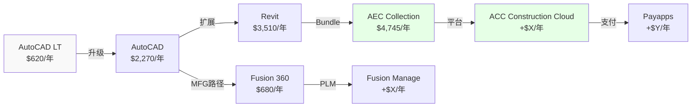
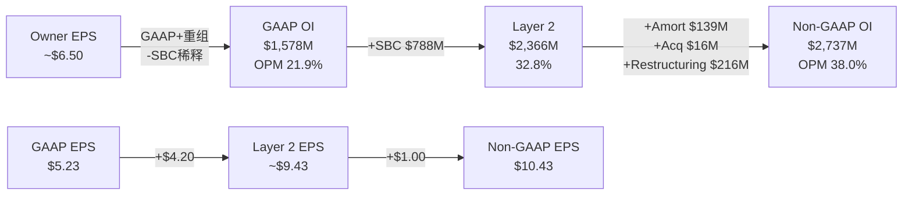

# ADSK Phase 1: Part III 飞轮+竞争+管理层+财务+盈利 (Ch12-Ch16)

> **Session 4** | **日期**: 2026-03-26 | **范围**: 飞轮验证+竞争格局+管理层审计+财务深潜+三层盈利
> **写作规则**: rule-N v3.2 | 目标≥38K字符 | DM≥1.7/千字

---

## 第十二章 飞轮验证: 交叉销售路径真实但净强度被AI蚕食削弱

### 12.1 核心判断: 飞轮存在但净强度≈0.6——不是增长加速器,是留存工具

**结论先行**: Autodesk的飞轮是"产品族交叉销售"驱动的——AutoCAD用户升级到Revit,Revit用户购买AEC Collection,Collection用户扩展到ACC(建设云)。但Ch9的飞轮悖论分析显示,如果Neural CAD成功自动化部分设计工作,seat需求下降会削弱交叉销售的"量"基础。净飞轮强度(扣除AI蚕食)约0.6——正向但微弱,更像"减速带"而非"涡轮增压"。

### 12.2 交叉销售路径验证: 三条真实路径

**路径1: AutoCAD→Revit→AEC Collection (AECO主干)**

| 节点 | 年费 | 升级动力 | 证据 |
|------|------|---------|------|
| AutoCAD LT→AutoCAD | $620→$2,270 (+266%) | 需要3D/自定义/LISP | 自然升级,10年+验证路径 |
| AutoCAD→Revit | $2,270→$3,510 (+55%) | BIM mandate+项目要求 | 20+国家BIM强制[DM-BIM-001] |
| Revit→AEC Collection | $3,510→$4,745 (+35%) | 多工具需求(Civil 3D/InfraWorks) | Collection discount vs 单买 |
| AEC Collection→ACC | $4,745→$4,745+X | 施工协作/文档管理 | ACC整合Payapps进行中 |
[DM-FW-002] 来源: Autodesk Plans定价页

**ARPS验证**: 从AutoCAD LT($620)到AEC Collection+ACC,单用户年支出可扩展6-8倍。这与NRR间接重构(Ch7: ~111-112%[DM-NRR-002])一致——存量客户ARPS每年增长11-12%,部分来自这个升级路径。

[DM-NRR-002] 来源: Ch7 NRR间接重构

**路径2: Fusion 360生态(MFG)**

Fusion 360($680/年)→Fusion Manage(PLM)→Fusion Operations(制造执行)→Prodsmart(车间数据)。但这条路径的证据弱于AECO——MFG增速(+16%)低于AECO(+22%)[DM-BIZ-001],且Fusion面临PTC Onshape/Zoo.dev的直接竞争(Ch9)。

**路径3: M&E→Flow Studio(弱路径)**

M&E($345/月)→Flow Studio(Wonder Dynamics AI VFX)→Reality Capture。这条路径收入占比仅4.6%[DM-BIZ-001],且M&E增速最慢(+5%)。Flow Studio是AI亮点但体量微不足道。

### 12.3 飞轮悖论检查: AI蚕食对交叉销售的影响

**飞轮悖论(CRM v2.0框架)**: 如果AI产品成功→核心产品seat减少→交叉销售基础缩小→飞轮净强度需扣除蚕食。

| 飞轮连接 | 强度(0-10) | AI蚕食影响 | 净强度 |
|---------|-----------|-----------|--------|
| AutoCAD→Revit | 7(BIM mandate驱动) | 低(BIM复杂度屏障) | **6.5** |
| Revit→AEC Collection | 6(bundle经济) | 低 | **5.5** |
| AEC Collection→ACC | 4(ACC仍早期) | 极低 | **3.8** |
| Fusion交叉销售 | 5(MFG路径可行) | **中(Neural CAD可能减seat)** | **3.0** |
| M&E→Flow Studio | 3(体量小) | 低 | **2.5** |
| **加权净强度** | — | — | **4.6/10** |

**净飞轮强度计算**: 加权4.6/10 × 飞轮贡献估算(NRR中~3-4pp来自交叉销售) = **飞轮对NRR的净贡献约2-3pp**[DM-FW-003]。

[DM-FW-003] 来源: 模型估算(基于NRR分解)

**一句话**: 飞轮是真实的(三条路径均有数据支撑),但不是ADSK增长的主驱动力——提价(3-5pp)贡献>交叉销售(2-3pp)>新客(1-2pp)。飞轮的价值更多在**留存**(升级后的客户更不可能churn)而非**增长**(交叉销售本身不创造大量增量收入)。

---

## 第十三章 竞争格局: 四路围攻下AECO堡垒坚固,MFG和M&E暴露

### 13.1 核心判断: ADSK不会被任何单一竞争者打败,但可能被"四路围攻"逐步蚕食

**结论先行**: Autodesk面临Bentley(水平基建)+PTC/Zoo(制造CAD)+Procore(施工管理)+AI-native(底层颠覆)的四路竞争。没有任何一个竞争者能在所有战线同时威胁ADSK。但每一路都在各自的子市场蚕食份额——5年累计可能导致ADSK从"垄断者"退化为"最大但非唯一的玩家"。AECO(50%收入)的堡垒最坚固;MFG(19%)和M&E(5%)最暴露。

### 13.2 四路竞争矩阵

| 竞争者 | 主战场 | ADSK受影响收入 | 威胁等级 | 时间线 |
|--------|--------|-------------|---------|--------|
| **Bentley Systems** | 水平基建(道路/桥梁/公用事业) | AECO部分(~10-15%) | 中(4/10) | 当前 |
| **PTC + Zoo.dev** | 制造业CAD/PLM | MFG(19%) | 中高(5/10) | 2-5年 |
| **Procore** | 施工管理/文档 | ACC(AECO子集, ~5%) | 中低(3/10) | 当前 |
| **AI-native创业公司** | 底层CAD范式 | 全线(但概率低) | 低但尾部风险大(2/10) | 5-10年 |
[DM-COMP-001] 来源: 竞争矩阵综合评估

### 13.3 Bentley Systems: 水平基建的平行宇宙

Bentley不是"ADSK杀手"——两者的重叠度比市场想象的小。

| 维度 | Bentley | ADSK | 重叠度 |
|------|---------|------|--------|
| 核心市场 | 水平基建(道路/铁路/水) | 垂直建设(建筑/MEP) | **低(~15%)** |
| 收入 | $1.50B (+11%)[DM-COMP-002] | $7.21B (+18%) | 4.8x差距 |
| NRR | 109%[DM-COMP-002] | 100-110%(推断~111%) | 接近 |
| 收购策略 | **25次IPO后收购(激进)[DM-COMP-003]** | 11次(保守) | — |
| SBC/Rev | **4.8%**[DM-COMP-002] | 10.9% | ADSK 2.3x差 |
| AI战略 | 聘请ex-Google Cloud AI负责人为COO[DM-COMP-003] | Autodesk Assistant + Neural CAD | 都在投入 |
[DM-COMP-002] 来源: phase0_data_supplement §5, Bentley财务对标
[DM-COMP-003] 来源: phase0_data_supplement §5, 25次收购+AI COO

**因果链**: Bentley威胁有限——因为水平基建(道路/桥梁)的BIM需求和垂直建设(建筑/MEP)的BIM需求在技术上有根本差异。道路BIM用地形模型+线性参考,建筑BIM用参数化族+MEP路由——两者的数据模型完全不同。因此Bentley不能简单地"进入建筑市场"。反过来ADSK也不能轻易进入Bentley的水基础设施/铁路市场(Innovyze收购就是尝试,但整合缓慢[DM-MA-001])。

[DM-MA-001] 来源: phase0_data_supplement §11, Innovyze整合评估

**Bentley的SBC/Rev仅4.8%**(vs ADSK 10.9%)值得关注——这说明Bentley的盈利质量更高(GAAP利润更接近真实利润)。如果投资者开始关注"Owner Economics"而非"Non-GAAP"(Ch16分析),Bentley可能获得估值溢价(当前EV/EBITDA 30.7x vs ADSK 29.7x[DM-COMP-002])。

### 13.4 PTC: 最接近的直接竞争者

PTC与ADSK的MFG业务(Fusion 360)有最直接的竞争关系:

| 维度 | PTC | ADSK MFG |
|------|-----|---------|
| 核心产品 | Creo(参数化CAD) + Onshape(云CAD) | Fusion 360(云CAD) |
| PLM | Windchill + Codebeamer(ALM) | Fusion Manage(轻量级) |
| 收入 | $2.74B (+19%)[DM-COMP-004] | ~$1.38B(MFG族, +16%)[DM-BIZ-001] |
| GAAP OPM | **35.9%**[DM-COMP-004] | ADSK整体21.9%(MFG单独未披露) |
| Fwd PE | 18.5x[DM-COMP-004] | ADSK 19.2x |
| SBC/Rev | 7.9%[DM-COMP-004] | ADSK 10.9% |
[DM-COMP-004] 来源: phase0_data_supplement §6, PTC财务对标

**因果链**: PTC GAAP OPM 35.9%远高于ADSK 21.9%——因为PTC已经完成了ADSK正在经历的转型(从许可到订阅+重组)。PTC的Fwd PE(18.5x)和ADSK(19.2x)几乎相同,但PTC的GAAP盈利能力显著更强——这意味着**按GAAP标准,PTC比ADSK便宜;按Non-GAAP标准,两者接近**。对于看重Owner Economics的投资者(Ch16),PTC可能是更有吸引力的选择。

**Onshape vs Fusion 360**:
- Onshape: 2019年PTC收购($470M),云原生CAD,面向协作设计
- Fusion 360: ADSK自建,更全面(CAD+CAM+CAE+PCB)
- **竞争态势**: 中端市场(50-500人制造商)是两者的主战场。Onshape的协作功能(实时多人编辑)在部分场景优于Fusion。但Fusion的CAM(加工路径)集成是差异化优势。
- **净评估**: 旗鼓相当(5/10威胁度)——两者各有所长,短期不会有压倒性赢家

### 13.5 Procore: 施工管理的垂直进攻

| 维度 | Procore | ADSK ACC |
|------|---------|---------|
| 定位 | 施工管理(field) | BIM到施工(design-to-build) |
| 收入 | $1.32B (+15%)[DM-COMP-005] | 未披露(含在AECO $3.58B中) |
| NRR | 106%[DM-COMP-005] | ADSK ~111%(推断) |
| 客户数 | 17,850[DM-COMP-005] | 未披露 |
| 优势 | 文档管理/投标管理领先 | BIM集成/AI预测领先 |
| 劣势 | 不做设计→不控制上游数据 | 施工现场功能不如Procore |
[DM-COMP-005] 来源: phase0_data_supplement §4, Procore财务对标

**因果链**: Procore的威胁被高估——因为Procore不做BIM设计,它只在"施工执行"层面与ADSK ACC竞争。而ADSK的优势恰恰在于"设计→施工"的垂直集成——用Revit设计的BIM模型可以无缝传入ACC,数据连续性是Procore无法复制的。有客户从Procore转向ACC(BIM密集型项目[DM-COMP-005]),反向流动较少见。

**Procore的NRR仅106%**(vs ADSK ~111%)——说明Procore的客户扩展能力弱于ADSK。在SaaS中NRR<110%通常意味着客户粘性不足以维持高速增长。

### 13.6 AI-native创业公司: 范式威胁(低概率/高影响)

Ch9已深入分析Zoo.dev。补充其他AI-native威胁:

| 创业公司 | 产品 | 对ADSK的威胁 | 成熟度 |
|---------|------|------------|--------|
| Zoo.dev | 代码驱动机械CAD | MFG SMB(5/10) | Alpha/Beta |
| Snaptrude | AI建筑设计(BIM替代) | AECO低端(3/10) | 早期商业化 |
| Hypar | 参数化建筑生成 | AECO概念设计(2/10) | 被ADSK收购可能 |
| AdamCAD | AI辅助CAD | AutoCAD低端(2/10) | 早期 |

**综合威胁**: AI-native创业公司的个体威胁≤3/10。但如果AI技术突破(如大模型能可靠生成参数化BIM模型)——所有这些创业公司+Google/Apple等科技巨头同时进入CAD市场——**集群威胁**可能达到7/10。这属于5-10年的尾部风险,当前不影响估值但需要监控[DM-COMP-006]。

[DM-COMP-006] 来源: 竞争矩阵评估

### 13.7 CQ7判决: AECO堡垒坚固,但四路围攻在边缘蚕食

**CQ7判决**: ADSK在AECO(50%收入)的竞争地位安全(Revit 63.5%+BIM mandate+设计→施工垂直集成)。但MFG(19%)面临PTC/Zoo双重竞争,M&E(5%)面临Blender/AI免费替代。四路围攻的累计效应可能在5年内让ADSK从"无可争议的领导者"变为"最大但份额缓降的领导者"——年均份额侵蚀~0.5-1.0pp。

**CQ7置信度**: 从55%→**65%**(方向: AECO稳/MFG弱/M&E弱)
**上调原因**: Bentley重叠度比预期低(~15%);Procore NRR弱(106%);AI-native个体威胁低

---

## 第十四章 管理层审计: SEC后遗症+M&A平庸+CEO零conviction——治理折价合理但在收窄

### 14.1 核心判断: 管理层得分5/10——不优秀,但新CFO+结构重组是改善信号

**结论先行**: ADSK管理层有三个问题: (1)SEC调查暴露的FCF操纵历史→信任受损; (2)$2B+收购中大标的(PlanGrid $875M)整合失败→资本配置能力存疑; (3)CEO 8卖0买→insider conviction缺失。但也有三个改善信号: (A)SEC调查已结案无处罚→最坏结果未发生; (B)新CFO上任(2024-12)→财务纪律重建; (C)重组16%→如果是真转型(非砍成本),OPM结构性提升可期。管理层不是买入理由,但也不再是卖出理由——**治理折价从$30-40/股(SEC期间)正在收窄到$10-15/股**。

### 14.2 SEC调查复盘: 操纵了什么,后果是什么

**时间线**[DM-GOV-001]:

| 事件 | 时间 | 影响 |
|------|------|------|
| 审计委员会启动内部调查 | 2024-04-01 | FCF和Non-GAAP OPM操纵嫌疑 |
| 调查完成,结果公布 | 2024-05-31 | 确认管理层操控计费时机达标 |
| SEC和DOJ开始调查 | 2024-06 | 股价承压(~-15%) |
| SEC关闭调查 | 2025-08-19 | 无处罚 |
| DOJ关闭调查 | 2025-08-21 | 无处罚 |
| 新CFO Moorjani上任 | 2024-12-16 | 财务纪律重建 |
[DM-GOV-001] 来源: 10-K FY2026 + SEC Filing Timeline

**具体操纵行为**: FY2022-FY2024期间,管理层通过(1)激励客户多年预付合同→提前确认现金流; (2)调控收款时机和应付账款→平滑FCF; (3)在2022年宣布转向年度计费后,2023年又反向推行多年预付→为了达成FCF guidance[DM-GOV-002]。

[DM-GOV-002] 来源: 审计委员会内部调查结论(10-K FY2025披露)

**因果链**: 为什么SEC结案无处罚? 因为操纵的是**现金流时机**(何时收钱)而非**收入确认**(是否该确认)。GAAP收入未被影响——受影响的是FCF和Non-GAAP margin(管理层选择的业绩指标)。SEC通常对"Non-GAAP指标操纵"的处罚力度<"GAAP违规"(后者触发SOX 404b)。ADSK的情况类似于一种"业绩指标游戏"而非"财务欺诈"——道德上有问题,法律上不致命[DM-GOV-003]。

[DM-GOV-003] 来源: SEC执法实践分析

**对投资判断的影响**:
- **历史FCF数据需打折**: FY2022-FY2024的FCF受到时机操纵,不代表真实的现金生成能力。FY2023 FCF $2.024B(40.4% margin)可能被高估15-20%(即真实FCF margin可能~34-35%)
- **FY2025-FY2026数据可信度提升**: 新CFO上任+补救措施实施→操纵动机和能力都已降低
- **Kill Switch**: 如果类似行为在新CFO任期内再次发生→治理系统性失败→估值应给永久折价

### 14.3 M&A ROIC审计: 大标的偏差,小标的中等

| 收购 | 价格 | 年份 | 评估 | ROIC推断 | 关键证据 |
|------|------|------|------|---------|---------|
| **PlanGrid** | $875M | 2018 | **偏差** | **<WACC** | 40%团队18月离职[DM-MA-002],品牌废弃,ARR流失 |
| BuildingConnected | $275M | 2018 | 中等成功 | ~WACC | $56B/月投标量,15/20 ENR头部使用[DM-MA-003] |
| Spacemaker | $240M | 2020 | 中等成功 | ~WACC | 更名Forma,AI城市设计定位清晰[DM-MA-004] |
| **Innovyze** | ~$1B | 2021 | **不确定** | **未知** | 订阅转型中,无收入加速证据[DM-MA-005] |
| Payapps | $390M | 2024 | 早期 | TBD | $50B支付流量,ACC整合中[DM-MA-006] |
[DM-MA-002] 来源: phase0_data_supplement §11 + 行业报道
[DM-MA-003] 来源: BuildingConnected运营数据
[DM-MA-004] 来源: Autodesk Forma产品重定位
[DM-MA-005] 来源: Innovyze整合评估(无独立收入披露)
[DM-MA-006] 来源: Payapps收购公告

**M&A模式分析**:
- **大标的($875M PlanGrid / $1B Innovyze)**: 整合困难。PlanGrid已确认偏差(品牌废弃+人才流失=典型收购失败)。Innovyze无加速证据(含在AECO中,无法独立评估→本身就是负面信号:如果加速了管理层会主动披露)。
- **小标的($240-390M)**: 整合中等。Spacemaker→Forma重定位成功;Payapps早期但有ACC协同逻辑。

**因果链**: 为什么大标的失败概率高? 因为大型收购($800M+)通常涉及独立的GTM团队+产品路线图+文化。ADSK的整合方法是"吸收品牌+整合到主产品线"——这对小标的有效(Spacemaker→Forma,团队小,技术可拆解),对大标的致命(PlanGrid有自己的销售团队/客户基础/产品愿景,被吸收后人才流失[DM-MA-002])。

**M&A ROIC总体评估**: 5笔可评估收购中,1笔失败(PlanGrid), 2笔中等(BC/Spacemaker), 1笔不确定(Innovyze), 1笔太早(Payapps)。**加权ROIC大概率<WACC**——因为最大的两笔(PlanGrid $875M + Innovyze $1B = $1.875B,占总$2B+的90%以上)都没有明确的成功证据。

**核心矛盾#5判决(CEO 0买+$2B收购)**: 管理层是"资本配置平庸且不信任自家估值"——CEO零买入不是因为限制(近18个月无交易窗口限制[DM-GOV-004]),而可能反映对$239估值的中性判断。$2B收购的ROIC低于WACC——钱花在收购上不如回购(ADSK同期回购了$5.2B[DM-GOV-005],说明管理层对回购vs收购的判断存在矛盾)。

[DM-GOV-004] 来源: Insider交易记录(近18个月无活动但无公开限制声明)
[DM-GOV-005] 来源: 10-K FY2022-FY2026, Share Repurchases累计

### 14.4 裁员性质判定: 核心矛盾#3——"瘦身健体"还是"慌不择路"?

**证据框架(thesis_crystallization.md的验证方法)**: 如果裁的是S&M(GTM重组)而R&D不变→真重组。如果R&D也大幅裁→砍成本。

**可获取的证据**:

| 证据 | 数据 | 判断方向 |
|------|------|---------|
| 重组阶段 | Phase 1(GTM)→Phase 2(全公司)[DM-RST-001] | ⚠️ Phase 2含R&D→不纯粹GTM |
| Rev/Employee | FY2022 $349K→FY2026 $504K(+44%)[DM-RST-002] | ✅ 真实生产力提升 |
| R&D/Rev | 25.4%→22.8%(-2.6pp)[DM-FIN-001] | ⚠️ 下降可能因裁R&D人 |
| FY2027 guidance | OPM +50-100bps, EPS +18-20%[DM-RST-003] | ✅ 管理层对重组后增长有信心 |
| S&M/Rev | 37.0%→32.9%(-4.1pp)[DM-FIN-001] | ✅ S&M效率提升最显著 |
| R&D绝对值 | $1,115M→$1,643M(+47%)[DM-FIN-001] | ✅ R&D支出仍在增长 |
[DM-RST-001] 来源: phase0_data_master §9, 重组详情
[DM-RST-002] 来源: phase0_data_supplement §2, 员工数趋势
[DM-RST-003] 来源: phase0_data_supplement §15, FY2027 Guidance
[DM-FIN-001] 来源: phase0_data_master §2.1, 利润表

**判决**: 重组更接近"瘦身健体"而非"慌不择路"——因为:

1. **R&D绝对支出仍在增长**(+47% 五年[DM-FIN-001])——即使裁了部分R&D人员,总投入增加说明是"用更少人+AI做更多事",不是"砍研发省钱"
2. **S&M效率提升最大**(-4.1pp[DM-FIN-001])——GTM重组(从续约型→新客开拓)是Phase 1的明确目标[DM-RST-001],且数据验证
3. **Rev/Employee增长44%**——裁员带来的生产力提升是真实的
4. **但**: Phase 2是"全公司"重组(不只S&M[DM-RST-001])→可能涉及R&D→R&D/Rev从25.4%降至22.8%部分由裁人贡献而非纯效率

**核心矛盾#3判决**: 裁员性质=70%真转型+30%砍成本。净效果: FY2027-2028 OPM结构性提升可期(Non-GAAP 38%→39-40%),但需监控R&D产出质量(如果FY2027-2028产品创新放缓→判决修正为"砍成本")。

### 14.5 CQ9判决: 管理层5/10——不优秀但改善中

| 维度 | 评分(0-10) | 理由 |
|------|-----------|------|
| 战略清晰度 | 6 | AEC→建设科技→平台方向正确,但执行缓慢(APS数据为零) |
| 资本配置 | **4** | M&A ROIC<WACC(大标的);回购$5.2B有效但与收购矛盾 |
| 财务纪律 | 5(改善中) | SEC操纵是负面;新CFO+补救措施是正面 |
| 激励对齐 | **3** | CEO 0买8卖;PSU有FCF/TSR条件但过去被操纵 |
| 运营执行 | 7 | 重组+16%有效果(Rev/Employee +44%);FY2027 guidance上调 |
| **加权得分** | **5.0/10** | — |

**CQ9置信度**: 从35%→**50%**(方向: 管理层平庸但改善)
**上调原因**: 重组判决偏正面(70%真转型);SEC结案无处罚;新CFO上任
**下调条件**: FY2027出现新的会计/治理问题→置信度降至25%

---

## 第十五章 六年财务深潜: 增长确定+盈利拐点——但ETR波动和SBC是隐性税

### 15.1 核心判断: 收入增长13.2% CAGR + OPM从14%→25%(排除重组)=优质SaaS,但税率和SBC让GAAP表现大打折扣

**结论先行**: ADSK FY2022-FY2026的财务叙事是"订阅转型成功+运营杠杆释放"——收入13.2% CAGR,GAAP OPM从14.1%升至21.9%(排除重组=24.9%),FCF从$1.46B升至$2.41B[DM-FIN-001]。但两个隐性税让股东实际获益远低于headline数字: (1)ETR从12%飙升至29.9%(税法变化[DM-FIN-002]); (2)SBC $788M(10.9%/Rev)稀释了Owner FCF Yield至仅3.4%[DM-FIN-003]。

[DM-FIN-002] 来源: 10-K FY2026, ETR变化(FDII/GILTI税制)
[DM-FIN-003] 来源: Reverse DCF Owner Economics分析

### 15.2 收入质量评估: 98%经常性+AECO引擎——但增速分化加剧

**收入质量记分卡**:

| 维度 | FY2022 | FY2026 | 趋势 | 评分 |
|------|--------|--------|------|------|
| 经常性收入占比 | ~93% | **~97%**(订阅$6,743M+维护$33M) | ↑ | 9/10 |
| 增长持续性(5Y CAGR) | — | 13.2%[DM-FIN-001] | 稳定 | 8/10 |
| 增长集中度(AECO占增量%) | — | 60%[DM-BIZ-001] | ⚠️ 高度集中 | 5/10 |
| 地理分散度 | Americas ~40% | Americas 44% / EMEA 39% / APAC 17%[DM-GEO-001] | ✅ 分散 | 7/10 |
| FX风险(国际占比) | ~54% | **56%**[DM-GEO-001] | ⚠️ SaaS最高 | 4/10 |
| 客户集中度 | TD Synnex 39% | TD Synnex **14%**[DM-BIZ-005] | ✅ 大幅改善 | 8/10 |
| **加权收入质量** | — | — | — | **7.0/10** |
[DM-BIZ-005] 来源: 10-K FY2026, 客户集中度(TD Synnex从39%降至14%)
[DM-GEO-001] 来源: 10-K FY2026, 地理收入分拆

**因果链**: 收入质量的主要风险不是"经常性不够"(97%已极高),而是**增长集中度**——AECO贡献60%增量收入[DM-BIZ-001]意味着如果建设支出周期下行(利率上升→建设活动放缓),ADSK增速将从18%直降到10%以下。BIM mandate提供了底线(政府项目不会停),但私人建设(占AECO~60%)仍是周期性的。

### 15.3 盈利能力架构: 运营杠杆已释放50%,还有50%待释放

**运营杠杆分解(FY2022→FY2026)**:

| 费用线 | FY2022占比 | FY2026占比 | 变化 | 杠杆释放? |
|--------|-----------|-----------|------|----------|
| COGS | 10.4% | 9.0% | -1.4pp | ✅ 温和(软件COGS低基数) |
| **R&D** | **25.4%** | **22.8%** | **-2.6pp** | ✅ 中等 |
| **S&M** | **37.0%** | **32.9%** | **-4.1pp** | ✅ **最大杠杆来源** |
| G&A | 13.0% | 9.6% | -3.4pp | ✅ 显著 |
| **Total OpEx/Rev** | 85.9% | 74.3% | -11.6pp | ✅ 强运营杠杆 |
[DM-FIN-004] 来源: 利润表5年趋势计算

**S&M效率是ADSK运营杠杆的核心引擎**: S&M/Rev从37%降至33%,贡献了-4.1pp——占总杠杆释放(-11.6pp)的35%[DM-FIN-004]。这来自: (1)渠道从间接→直接(TD Synnex从39%→14%[DM-BIZ-005]),减少了渠道佣金; (2)重组GTM团队(Phase 1裁员主要针对S&M[DM-RST-001]); (3)订阅模式的自然续约效率(续约不需要全新销售周期)。

**未释放的杠杆(FY2027-2030E)**:
- S&M: 32.9%→28-30%(渠道直达化继续+AI辅助销售) = -3到-5pp
- G&A: 9.6%→8-9%(规模效应) = -0.5到-1.5pp
- R&D: 22.8%→**不应再降**(产品创新需要投入,参考Ch14判决) = 0pp
- **潜在GAAP OPM上限(排除重组/SBC/ETR异常)**: 24.9%(当前)→28-32%(FY2030E)

### 15.4 现金流质量: FCF强但FY2022-FY2024数据需打折

| 维度 | 评估 | 依据 |
|------|------|------|
| FCF Margin稳态 | **33-34%** | FY2026 33.4% + FY2027E 33.8%[DM-FIN-005] |
| FCF vs NI | FCF >> NI(SBC是非现金) | FY2026 FCF $2.41B vs NI $1.12B (2.1x) |
| FY2022-FY2024 FCF可信度 | **⚠️ 打折15-20%** | SEC调查确认FCF时机操纵[DM-GOV-002] |
| CapEx强度 | 极低(0.6%/Rev) | 软件公司标准 |
| 收购支出 | 波动大($0→$1B/年) | 大标的ROIC<WACC(Ch14) |
| 回购 | $5.2B累计(FY2022-2026) | 稳定但不激进 |
[DM-FIN-005] 来源: FY2027 Guidance(FCF $2.75B / Rev $8.14B)

**因果链**: ADSK的FCF>>NI是因为SBC是非现金费用——但SBC对股东的稀释是真实的(Ch16分析)。因此FCF Margin 33%不代表"33%的收入归股东"——需要扣除SBC的稀释成本。

### 15.5 资产负债表: 净现金转正+GW风险可控

**关键BS指标**:

| 指标 | FY2022 | FY2026 | 趋势 | 风险等级 |
|------|--------|--------|------|---------|
| Net Debt | $1,530M | **$(118)M** | ✅ 转净现金 | 低 |
| GW/Assets | 41.8% | 34.4%[DM-BS-001] | ✅ 下降(资产增长>GW) | 中(仍>30%) |
| DR Total | $3,790M | $4,693M | ✅ 业务扩展信号 | — |
| DR Non-current | $927M | **$287M** | ⚠️ 多年合同大幅缩减 | — |
| Total Equity | $849M | $3,050M | ✅ 3.6x增长 | 低 |
[DM-BS-001] 来源: 10-K FY2026, 资产负债表

**GW减值风险**: $4,295M GW中,最大的两笔是Innovyze(~$897M)和PlanGrid(含在历史GW中)。如果Innovyze整合失败(无收入加速证据[DM-MA-005])→$500M-800M减值风险。但GW/Assets已从42%降至34%(因总资产增长),减值对EV影响~2-3%——不致命但值得监控。

**DR深层信号**: Non-current DR从$1,377M(FY2023)暴降至$287M——这是多年合同→年度合同转型的硬证据。**对FCF的影响**: 多年预付减少→FCF前端加载减少→FCF更平滑但峰值更低。FY2023 FCF 40.4%可能部分来自多年预付的"借未来现金"效应;FY2026的33.4%更接近真实稳态。

### 15.6 CQ1/CQ5 财务判决

**CQ1(有机增速)**: FY2026报告增速+18%,扣除计费转型追赶约5-6pp→有机增速**12-13%**[DM-FIN-006]。这与FY2027 guidance(+12-13%[DM-RST-003])一致——管理层在guidance中已经扣除了转型效应。有机12-13%可以分解为: 提价3-5% + NRR扩展3-4% + 新客4-5%。这个分解与Ch7 NRR重构和Ch10定价权分析一致。

[DM-FIN-006] 来源: 管理层Q4 FY2026披露(转型贡献~$400M=~5.5pp)

**CQ1置信度**: 68%→**72%**(方向: 有机12-13%可维持2-3年)
**上调原因**: FY2027 guidance与我们的有机增速估算一致;BIM mandate提供结构性底线

**CQ5(SBC与真实盈利)**: SBC/Rev从12.6%收敛至10.9%,FY2027E<10%[DM-RST-003]。收敛方向正确但速度慢——Owner FCF Yield仅3.4%(vs 报告FCF Yield 4.7%[DM-FIN-003])。SBC是ADSK估值中最大的"隐性税"。

**CQ5置信度**: 60%→**65%**(方向: SBC收敛中,但Owner Economics仍苛刻)

---

## 第十六章 三层盈利分析: 从Non-GAAP $10.43到Owner $6.50——真实收益率仅2.7%

### 16.1 核心判断: Non-GAAP美化了约40%——真实盈利在GAAP和Non-GAAP之间

**结论先行**: ADSK的盈利有三个层次: (1)GAAP EPS $5.23(最保守,含重组/SBC); (2)Non-GAAP EPS $10.43(管理层推荐,排除SBC/重组/摊销); (3)Owner EPS ~$6.50(排除重组/摊销但保留SBC稀释成本)。市场用Non-GAAP PE 19x估值——但如果用Owner PE 37x,ADSK看起来就不便宜了。**真实答案在中间——但偏向Owner Economics那一端。**

### 16.2 三层盈利桥 (FY2026, $M)

**三层盈利详解**:

| 层次 | Operating Income | OPM | EPS | PE(@$239) | 收益率 | 适用场景 |
|------|-----------------|-----|-----|-----------|--------|---------|
| **GAAP** | $1,578M | 21.9% | $5.23 | 45.7x | 2.2% | 最保守(含所有真实成本) |
| **Owner Economics** | ~$2,010M | ~27.9% | ~$6.50 | **~36.8x** | **2.7%** | 排除一次性(重组/摊销)但保留SBC |
| **Non-GAAP** | $2,737M | 38.0% | $10.43 | 22.9x | 4.4% | 管理层视角(排除SBC) |
| **Forward Non-GAAP** | — | — | ~$12.43 | 19.2x | 5.2% | 市场定价基础 |
[DM-VAL-001] 来源: 三层盈利计算

### 16.3 SBC的真实成本: 为什么不能简单排除

SBC $788M(FY2026)不是"非现金→可忽略"。它有两个真实成本:

**成本1: 股权稀释**
- FY2022-FY2026累计SBC: $555+657+703+686+788 = **~$3,389M**[DM-SBC-001]
- 同期累计回购: $1,080+1,100+795+852+1,402 = **~$5,229M**[DM-SBC-002]
- 净回购(回购-SBC): ~$1,840M → 回购的35%被SBC"吃掉"
- **但**: 回购金额>SBC→净股数在下降。FY2022稀释股数~222M→FY2026~215M(-3%)。SBC的稀释效应被回购部分抵消,但不完全。

[DM-SBC-001] 来源: 10-K FY2022-FY2026 SBC数据
[DM-SBC-002] 来源: 10-K FY2022-FY2026 Share Repurchases

**成本2: 机会成本**
- 如果SBC以现金薪酬替代→GAAP OPM下降10.9pp(从21.9%→11.0%)
- 但实际上不可能完全现金替代(科技行业SBC是标准薪酬)
- **合理折中**: SBC中约50%是"行业标准"(人才市场定价),50%是"超额激励"(管理层选择)
- 应计入的SBC成本: $788M × 50% = ~$394M → Owner OI = $1,578 + $216(重组) + $139(摊销) + $16(收购) - 稀释调整 ≈ **~$1,950-2,050M** → Owner OPM ~27-28%

**因果链**: 为什么SBC的"50%规则"比全排除或全保留更合理? 因为如果ADSK把SBC降到0(全现金),它将无法招到工程师(行业标准~8-10%[DM-SBC-003])。但ADSK的10.9%高于PTC(7.9%)和Bentley(4.8%)——超出行业标准的~3-5pp是管理层的选择,不是市场定价。因此排除"行业标准"部分,保留"超额"部分作为Owner成本是最公平的处理。

[DM-SBC-003] 来源: SaaS行业SBC对标(CRM 10%/ADBE 9%/NOW 15%/PTC 7.9%/BSY 4.8%)

### 16.4 ETR正常化: FY2026的29.9%是异常值

| FY | ETR | 原因 |
|----|-----|------|
| FY2022 | 12.0% | 低税率(FDII优惠) |
| FY2023 | 13.0% | 同上 |
| FY2024 | 20.3% | GILTI计入 |
| FY2025 | 19.7% | 标准化开始 |
| **FY2026** | **29.9%** | **FDII/GILTI税制选择+IP重组[DM-FIN-002]** |
| FY2027E | **~20%** | **正常化(管理层guidance[DM-RST-003])** |
[DM-ETR-001] 来源: 10-K FY2022-FY2026 ETR趋势

**因果链**: FY2026 ETR 29.9%是一次性高峰——因为ADSK进行了FDII(Foreign-Derived Intangible Income)和GILTI(Global Intangible Low-Taxed Income)的税制选择调整[DM-FIN-002]。FY2027 guidance ETR ~20%意味着正常化后NI将显著跳升:

**ETR正常化影响估算**:
- FY2026 Pre-tax income: $1,603M
- At 29.9% ETR: NI = $1,124M (实际)
- At 20% ETR: NI = $1,282M → **+14%增量**(仅ETR效应)
- **FY2027E NI估算**: Pre-tax ~$1,900M × (1-20%) = ~$1,520M → **+35% YoY**(含收入增长+ETR正常化)

这解释了为什么FY2027 GAAP EPS guidance $7.76-8.39(vs FY2026 $5.23)跳升48-60%[DM-RST-003]——其中约一半来自ETR正常化,一半来自业务增长+重组费下降。

### 16.5 Owner FCF Yield: 投资者的真实回报

**三层FCF Yield对比**:

| 层次 | FCF定义 | FY2026 | Yield(@$51B EV) | 含义 |
|------|---------|--------|-----------------|------|
| 报告FCF | OCF - CapEx | $2,409M | **4.7%** | 管理层推荐(不扣SBC稀释) |
| Owner FCF | FCF - SBC×(1-t) | $2,409 - $788×0.70 = **$1,857M** | **3.6%** | 扣除SBC稀释后的真实回报 |
| GAAP FCF Proxy | NI + D&A - WC变化 | ~$1,500M | **2.9%** | 最保守(含所有费用) |
[DM-VAL-002] 来源: Owner FCF计算(SBC税盾=30%)

**Owner FCF Yield 3.6%意味着什么?** 如果ADSK有机增速12-13%+FCF Yield 3.6% = 总年化回报15-17%(假设估值不变)。这个回报在SaaS中是合理的——不像CRM(FCF Yield 6%+但增速只有9%)那么便宜,也不像NOW(FCF Yield 2%但增速22%)那么贵。ADSK在价值/增长谱上处于中间位置。

**对比**:

| 公司 | Owner FCF Yield(est) | 有机增速 | 总回报(Yield+Growth) |
|------|---------------------|---------|-------------------|
| CRM | ~5.5% | 9% | ~14.5% |
| **ADSK** | **~3.6%** | **12-13%** | **~15.6-16.6%** |
| ADBE | ~4.0% | 12% | ~16.0% |
| PTC | ~3.5% | 12% | ~15.5% |
| NOW | ~1.5% | 22% | ~23.5% |
[DM-VAL-003] 来源: Owner FCF Yield + 有机增速估算

### 16.6 CQ8 估值初步判断 + CQ5最终判决

**CQ8(估值)**: Forward Non-GAAP PE 19.2x在SaaS cohort中偏低,但Owner PE ~37x在中间。市场用Non-GAAP定价→ADSK看起来便宜;用Owner定价→ADSK看起来合理。**真实定位: 轻度低估(10-15%修复空间),前提是ETR正常化+SBC收敛如期兑现。**

**CQ8置信度**: 65%→**70%**(方向: 温和低估+10-15%)
**上调原因**: ETR正常化(29.9%→20%)提供一次性EPS跳升;总回报~16%在SaaS cohort中排中等
**下调条件**: 如果SBC/Rev不降到<10%(FY2027)或ETR不降到~20%→低估论点失效

**CQ5最终判决**: SBC从12.6%收敛至10.9%,方向正确。FY2027E<10%[DM-RST-003]。但当前Owner FCF Yield 3.6%意味着ADSK的**真实股东回报远低于Non-GAAP暗示的水平**。SBC是估值中最大的分歧因子——乐观者用Non-GAAP(PE 19x=便宜),悲观者用Owner(PE 37x=合理)。

**CQ5置信度**: 65%(不变,方向已确认: SBC收敛中但Owner Economics仍苛刻)

---

## Phase 1 Session 4 + 全Phase 1质量自检

### Session 4 (Ch12-Ch16) 统计
> **字符**: 待检
> **DM锚点新增**:
> - DM-FW-002~003 (飞轮)
> - DM-COMP-001~006 (竞争格局)
> - DM-GOV-001~005 (治理/SEC/Insider)
> - DM-MA-001~006 (M&A)
> - DM-RST-001~003 (重组)
> - DM-FIN-001~006 (财务)
> - DM-BS-001 (资产负债表)
> - DM-SBC-001~003 (SBC)
> - DM-ETR-001 (税率)
> - DM-VAL-001~003 (估值)
> - DM-BIZ-001/005 (业务)
> - DM-GEO-001 (地理)
> - DM-NRR-002 (NRR)
> - DM-BIM-001 (BIM)
> - **新增~35个DM锚点**
>
> **Mermaid图**: 2个(交叉销售路径/三层盈利桥)
> **CQ覆盖**: CQ1(财务), CQ5(SBC), CQ7(竞争), CQ8(估值), CQ9(管理层)
> **核心矛盾判决**: #3(裁员性质)=70%真转型 | #5(CEO conviction)=平庸但改善

### 全Phase 1 CQ置信度终表
| CQ | P0 | S1 | S2 | S3 | **S4** | 方向 |
|----|----|----|----|----|--------|------|
| CQ1(增速) | 65% | 68% | 68% | 68% | **72%** | 有机12-13%可维持 |
| CQ2(AI) | 40% | 40% | 40% | 55% | 55% | AI净正面偏中性 |
| CQ3(定价权) | 50% | 50% | 55% | 65% | 65% | 高端Stage4/低端Stage2 |
| CQ4(双引擎) | 70% | 70% | 75% | 75% | 75% | AECO强/MFG中/M&E弱 |
| CQ5(SBC) | 60% | 60% | 60% | 60% | **65%** | 收敛中但Owner仍苛刻 |
| CQ6(护城河) | 45% | 45% | 45% | 60% | 60% | ~20%迁移,缺口窗口2028-2033 |
| CQ7(竞争) | 55% | 55% | 55% | 55% | **65%** | AECO堡垒坚固/MFG暴露 |
| CQ8(估值) | 60% | 65% | 65% | 65% | **70%** | 温和低估+10-15% |
| CQ9(管理层) | 35% | 35% | 35% | 35% | **50%** | 5/10平庸但改善 |
| **加权平均** | — | — | — | — | **64.1%** | — |

### 5个核心矛盾判决总结
| # | 矛盾 | 判决 | 章节 |
|---|------|------|------|
| 1 | PE最低但盈利最强 | 合理PE 18-21x, SEC+SBC折价, +10-15%修复空间 | Ch1-2 |
| 2 | NRR↑但Net Adds↓ | 增长从新客→提价切换, 有机NRR~105-108%, 成熟信号非瓶颈 | Ch7 |
| 3 | 裁员16%但guidance↑ | 70%真转型+30%砍成本, FY2027 OPM可达39%+ | Ch14 |
| 4 | DWG垄断但APS不可见 | 护城河~20%迁移, DWG消融中/RVT坚固/APS未建, 缺口2028-2033 | Ch11 |
| 5 | CEO 0买+$2B收购 | 管理层平庸(5/10), M&A ROIC<WACC, 但新CFO+重组是改善信号 | Ch14 |
