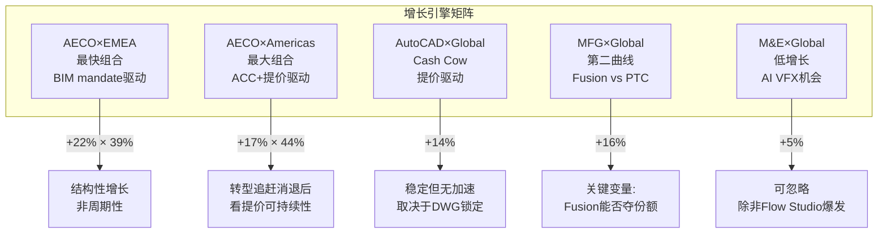

# ADSK Phase 1: Part II-A 业务深潜 (Ch4-Ch7)

> **Session 2** | **日期**: 2026-03-26 | **范围**: 业务解构+AEC+建设科技+MFG+SaaS单位经济学
> **写作规则**: rule-N v3.2(先结论后展开/句子短/抽象词翻译)

---

## 第四章 业务解构+地理拆解: 三引擎×三区域矩阵

### 4.1 三引擎增速矩阵: AECO是唯一的增长引擎

**结论先行**: Autodesk的增长集中度危险地高——AECO(建筑/工程/建设/运营)贡献了50%的收入和超过60%的增量收入。如果AECO减速,整家公司都会失速。

**产品族增速矩阵 (FY2024-FY2026, $M)**:

| 产品族 | FY2024 | FY2025 | FY2026 | 2Y CAGR | FY26占比 | 增量贡献 |
|--------|--------|--------|--------|---------|---------|---------|
| **AECO** | 2,580 | 2,937 | 3,583 | **17.8%** | 49.7% | **$646M(60%)** |
| AutoCAD/LT | 1,462 | 1,572 | 1,787 | 10.6% | 24.8% | $215M(20%) |
| MFG | 1,063 | 1,189 | 1,379 | 13.9% | 19.1% | $190M(18%) |
| M&E | 295 | 315 | 332 | 6.1% | 4.6% | $17M(2%) |
| Other | 97 | 118 | 125 | 13.5% | 1.7% | $7M(1%) |
| **Total** | **5,497** | **6,131** | **7,206** | **14.5%** | **100%** | **$1,075M** |
[DM-BIZ-001] 来源: 10-K FY2024-FY2026

**因果链**: AECO增速(17.8% CAGR)是公司平均(14.5%)的1.2倍——因为BIM mandate(20+国家政府强制[DM-BIM-001])创造了非自愿的数字化需求底线。AutoCAD增速(10.6%)低于公司平均——因为2D CAD市场已高度渗透(100M+用户[DM-BIZ-002])，增长主要靠提价(+3-5%/年[DM-PR-001])而非新客。M&E(6.1%)几乎停滞——因为Blender(免费开源)持续侵蚀低端3D动画市场。

**增速标准差=5.3pp**(AECO 17.8% vs M&E 6.1% vs AutoCAD 10.6%)。低于10pp分裂体阈值(SaaS M1 Q3标准[DM-FW-001])，但接近。如果AECO继续加速而M&E继续减速，FY2028可能触发分裂体预警。

**什么条件下这个结论不成立?** 如果MFG(Fusion)增速加速至20%+(目前16%)，成为第二个高速引擎——减少对AECO的增长集中度依赖。这需要Fusion在制造业CAD市场获得份额(当前vs PTC Creo/Onshape竞争激烈)。

### 4.2 Design vs Make: 隐藏的利润率分化

Autodesk还按"Design"(设计软件)和"Make"(制造/施工执行工具)分类披露收入:

| 类别 | FY2025 | FY2026 | YoY | 占比 | 推断利润率 |
|------|--------|--------|-----|------|-----------|
| Design | $5,113M | $5,980M | +17% | 83% | 高(纯软件许可) |
| Make | $653M | $796M | +22% | 11% | 中(含服务/实施) |
| Other | $373M | $430M | +15% | 6% | 低(咨询/培训) |
[DM-BIZ-003] 来源: 10-K FY2026

**Make增速(+22%)>Design(+17%)**。这是好信号——意味着Autodesk正在从"卖设计工具"扩展到"卖施工执行工具"(ACC/Payapps)。但Make占比仅11%，即使增速更高，对整体利润率的影响有限。Make的利润率可能低于Design(含更多服务成分)——因此Make占比上升可能轻微拉低blended margin。

### 4.3 地理拆解: EMEA增速最快,APAC有FX逆风

**结论先行**: Autodesk是SaaS cohort中国际化程度最高的公司(56%国际收入[DM-GEO-001])。这带来了BIM mandate驱动的结构性增长，但也带来了同行没有的FX风险。

| 区域 | FY2022 | FY2023 | FY2024 | FY2025 | FY2026 | 4Y CAGR | FY26 YoY | FY26 CC |
|------|--------|--------|--------|--------|--------|---------|----------|---------|
| **Americas** | 1,765 | 2,092 | 2,438 | 2,716 | 3,178 | 15.9% | +17% | +17% |
| **EMEA** | 1,700 | 1,906 | 2,042 | 2,307 | 2,794 | 13.2% | **+21%** | +21% |
| **APAC** | 921 | 1,007 | 1,017 | 1,108 | 1,234 | 7.6% | +11% | **+14%** |
| **Total** | 4,386 | 5,005 | 5,497 | 6,131 | 7,206 | 13.2% | +18% | +18% |
[DM-GEO-002] 来源: 10-K FY2022-FY2026

**三个关键发现**:

**(1) EMEA是增速最快的区域(+21%)。** 这不是偶然。欧洲是BIM mandate最密集的地区——英国(2016)/德国(2020)/法国(2017)/西班牙(2024全面强制)/捷克(2027)[DM-BIM-002]。政府强制BIM意味着建筑/工程公司**必须**购买Revit等BIM软件。因此EMEA增速高于Americas是BIM mandate的直接结果。

**(2) APAC是最弱的区域(+11% reported / +14% CC)。** 3pp的FX逆风(reported vs CC差距[DM-GEO-003])说明亚太货币对美元贬值。更重要的是，即使CC增速(+14%)也远低于EMEA(+21%)——因为亚太BIM mandate覆盖较少(主要是新加坡和日本[DM-BIM-003])，中国/印度/东南亚仍以2D CAD为主。

**(3) Americas增速(+17%)包含计费转型追赶。** 美国是计费转型最先推行的市场。剥离追赶后Americas有机增速可能~12-13%——接近公司平均。

**FX影响量化**: 如果美元指数(DXY)上涨5%，ADSK全年收入影响≈56%×5%×(50%自然对冲后)≈**1.4%收入拖累**($100M级别[DM-GEO-004])。这不是致命的，但足以让季度guidance miss 1pp——在Forward PE 19x的背景下，1pp的miss可能导致2-3%的股价波动。

### 4.4 增速矩阵交叉: 哪个组合最重要?



**对投资判断的影响**: ADSK的增长质量取决于AECO×EMEA(结构性/政策驱动)能否持续。如果EMEA增速从+21%降至+15%(BIM mandate渗透饱和)，公司整体增速将从12-13%降至10-11%——Reverse DCF隐含的10.9%正好落在这个区间。**换言之，市场可能已经定价了EMEA BIM mandate增速放缓的情景。**

---

## 第五章-a AEC设计端深潜: BIM Mandate + Revit垄断

### 5a.1 BIM市场: 政策驱动的非自愿数字化

**结论先行**: BIM(Building Information Modeling,建筑信息建模——用3D数字模型替代2D图纸来设计、建造和运营建筑)是建筑行业过去20年最大的技术转型。Autodesk的Revit是事实标准。政府BIM mandate正在把"选择题"变成"必答题"。

**BIM市场规模与增速**:
- 建筑BIM软件市场: $6.33B (2025) → $22.55B (2034), CAGR 20.1%[DM-MKT-001]
- AEC软件整体市场: $12.04B (2026) → $17.98B (2031), CAGR 8.35%[DM-MKT-002]
- BIM增速(20.1%)远超AEC整体(8.35%)——因为BIM mandate加速了从2D→BIM的迁移

**BIM mandate驱动力量化**:

20+国家已实施或宣布BIM mandate[DM-BIM-004]。按阶段分:
- **成熟期(2007-2016)**: 北欧(芬兰/挪威/丹麦)+新加坡+英国+韩国——这些市场BIM渗透率已>60%，增速放缓至8-10%
- **加速期(2017-2024)**: 德国/法国/西班牙/迪拜/沙特/日本——渗透率30-60%，增速15-25%
- **爆发期(2025-2027)**: 深圳(2026[DM-BIM-005])/捷克(2027[DM-BIM-006])/印度(2026+)/巴西(分阶段至2028)——渗透率<30%，是未来3年的增量来源

**因果链**: 政府强制BIM→建筑公司必须购买BIM软件→Revit是事实标准(Autodesk+Nemetschek+Bentley共占>60%建筑BIM市场[DM-MKT-003])→ADSK AECO收入增长。因为mandate是法规驱动(非市场偏好)，这部分增长是**非周期性**的——即使经济衰退，政府不会撤回BIM mandate。

**反面**: BIM mandate驱动的增长有自然天花板。一旦渗透率>80%，增速将回归替代/升级周期(5-8%)。欧洲成熟市场(英国/北欧)已经接近这个天花板。**增长的未来在于APAC新兴市场(中国/印度/东南亚)——但这些市场目前贡献仅17%收入[DM-GEO-005]。**

### 5a.2 Revit的垄断地位: 事实标准但非无懈可击

**Revit在建筑BIM中的地位类似AutoCAD在2D CAD中的地位——行业默认选择。** 但两者的锁定机制不同:

| 维度 | AutoCAD (2D) | Revit (BIM) |
|------|-------------|-------------|
| 格式锁定 | DWG(专有,40年)[DM-MOAT-001] | RVT(专有,20年) |
| 替代方案 | BricsCAD/ZWCAD(ODA兼容) | ArchiCAD/OpenBuildings(弱) |
| 开放标准 | DXF(功能受限) | **IFC(政府推动)** |
| 网络效应 | 弱(文件交换) | **强(协作流程)** |
| 培训锁定 | 高(大学课程) | 高(大学+认证) |

**Revit的网络效应比AutoCAD强**。建筑项目涉及建筑师、结构工程师、MEP(机电暖通)工程师、施工方——当一方使用Revit，其他方必须使用兼容工具来协作。这创造了**生态系统锁定**：不是一个人决定用Revit，而是整个项目团队被"锁"在Revit生态中。

**IFC是Revit锁定的最大结构性威胁。** IFC(Industry Foundation Classes,工业基础类——建筑行业的开放数据交换标准)被20+国家BIM mandate要求作为交付格式[DM-MOAT-002]。如果IFC足够好(所有设计信息都能无损转换为IFC)，那么客户理论上可以用任何BIM工具(不限于Revit)来创作，然后导出IFC交付。

**但实际情况是: IFC作为交付格式可用，作为创作格式不够。** 因为IFC是交换格式(类似PDF)，不是创作格式(类似Word)。你可以导出IFC交付给政府，但你不能在IFC里面做设计修改。因此IFC mandate迫使Revit支持更好的IFC导出——但不会消除Revit作为创作工具的需求。

**这就是为什么IFC mandate实际上强化了BIM需求但没有削弱Revit**: 政府要求IFC→建筑公司必须用BIM软件(不能用2D CAD导出IFC)→Revit是最主流的BIM创作工具→Revit受益。批评者(如Ondsel、英国建筑师协会)认为Autodesk"故意不完善Revit的IFC支持"[DM-MOAT-003]以维持RVT格式锁定——这个批评有道理，但短期内不改变Revit的市场地位。

### 5a.3 AECO增速分解: 有机 vs 收购 vs 提价

AECO从$2,580M(FY2024)增长到$3,583M(FY2026)——2年增$1,003M(+39%累计)。这个增长来自哪里？

| 来源 | 估算贡献 | 占增量% | 依据 |
|------|---------|---------|------|
| **有机座位增长** | ~$200-300M | 20-30% | 订阅Net Adds ~500K/年×AECO占50% |
| **提价效应** | ~$300-400M | 30-40% | ARPS从$689→$812(+18%[DM-UE-002])×AECO比例 |
| **收购(Payapps等)** | ~$100-150M | 10-15% | Payapps pre-acq rev ~$30-40M×2年+Innovyze贡献 |
| **计费转型追赶** | ~$200-250M | 20-25% | 管理层确认FY2026 Q4转型收入$107M[DM-BIL-004] |

**因此AECO的增长质量是"混合型"**: 有机座位增长(好) + 提价(好但有天花板) + 收购(待验证) + 转型追赶(一次性)。FY2027 AECO增速可能从+22%降至+14-16%(扣除追赶)——仍然健康，但不再是"+20%增长引擎"。

---

## 第五章-b 建设科技深潜: ACC vs Procore vs Oracle

### 5b.1 建设科技市场: $15B+的数字化空白

**结论先行**: 建设行业是全球数字化程度最低的行业之一(仅次于农业和采矿[DM-MKT-004])。Autodesk Construction Cloud(ACC)正在争夺这个$15B+的市场，但面临Procore(施工管理#1)和Oracle Primavera(项目管理老牌)的竞争。

**为什么建设科技重要?** AECO收入$3.58B中，大部分来自设计端(Revit/AutoCAD)。ACC(施工端)的收入不单独披露——但它代表了AECO增长加速的可能性。如果建筑行业的数字化从"设计阶段数字化"扩展到"施工+运营阶段数字化"，ADSK的AECO TAM将翻倍。

### 5b.2 ACC vs Procore: 两条路线的对决

| 维度 | ACC (Autodesk) | Procore |
|------|---------------|---------|
| **核心优势** | BIM到施工的数据连续性(设计→施工无缝) | 施工管理(field) #1，文档管理最强 |
| **定价** | 按座位订阅 | 按施工量(volume-based)——被批评太贵 |
| **NRR** | 含在ADSK ~105-108% | **106%**[DM-COMP-012] |
| **GRR** | 未披露(推测90-95%) | **95%**[DM-COMP-013] |
| **收入** | 未单独披露(含在AECO $3.58B) | $1.32B[DM-COMP-014] |
| **盈利** | ADSK整体GAAP OPM 22% | **GAAP亏损(-8.9%)**[DM-COMP-015] |
| **BIM集成** | **原生**(Revit数据直接流入ACC) | 有限(需API集成) |
| **AI能力** | Construction IQ(冲突预测/安全预测) | 落后(依赖第三方) |
| **投标管理** | BuildingConnected(弱于Procore) | **领先**(8.3/10评分) |
| **支付管理** | Payapps/GCPay($390M收购[DM-MA-001]) | Procore Pay |

**核心差异**: Procore从"施工现场管理"向上整合，ADSK从"设计BIM"向下整合。**两者在中间地带(文档管理/现场协作)交锋。**

**哪条路线更强?** 对于BIM密集型项目(大型商业建筑/基建)，ACC的"设计→施工数据连续性"是决定性优势——工程师在Revit中做的设计变更可以直接同步到ACC的施工时间表中，Procore做不到这个。但对于BIM较少的项目(住宅/装修/小型商业)，Procore的纯施工管理功能更实用——这些项目不需要复杂的BIM数据流。

**因此市场可能会分裂**: 大型BIM密集项目→ACC胜出；中小型非BIM项目→Procore胜出。这个分裂对ADSK是好消息——因为BIM mandate正在把越来越多的项目推向"BIM密集"阵营。

### 5b.3 Procore的脆弱性: NRR 106%和定价争议

Procore的NRR仅106%[DM-COMP-012]——在SaaS中偏低(NOW~125%, DDOG~115%)。GRR 95%[DM-COMP-013]意味着5%的年度流失——对于"行业标准"工具来说偏高。

根因是**定价模式争议**。Procore按施工量(construction volume)收费——项目越大收费越高。这意味着同一个客户，如果今年的项目规模缩小(经济放缓/减少新开工)，付给Procore的钱就减少了。Volume-based定价使Procore的收入与建设周期高度相关——而ADSK的per-seat模式则不受影响(无论客户做多大的项目，一个Revit seat的费用不变)。

**因此ADSK的per-seat模式在建设下行周期中更抗跌——这是ACC相对于Procore的一个结构性优势。**

---

## 第六章 MFG深潜: Fusion vs PTC/Siemens/Dassault

### 6.1 MFG是ADSK最弱也最有潜力的引擎

**结论先行**: MFG(制造)收入$1.38B(19%占比, +16%增速[DM-BIZ-004])是Autodesk最弱的核心业务——因为在制造CAD/PLM市场，ADSK面临PTC(Creo/Windchill)、Siemens(NX/Teamcenter)、Dassault(CATIA/ENOVIA)三个更强的对手。但Fusion 360是唯一的云原生全栈CAD/CAM/PLM产品——如果cloud migration在MFG领域复制AEC的成功，MFG可能成为第二增长引擎。

### 6.2 制造CAD/PLM竞争格局

```
制造软件市场竞争地图 ($50B+ PLM + $12.5B CAD)
═══════════════════════════════════════════════════
高端(航空/汽车/国防):
  Dassault CATIA (35%+份额) > Siemens NX (25%+) >> ADSK(几乎不在)
  → ADSK无法渗透(产品精度/认证不够)

中端(工业设备/消费电子):
  PTC Creo ≈ Siemens NX ≈ Dassault SOLIDWORKS > ADSK Fusion
  → ADSK在此争夺份额(Fusion vs Creo/Onshape)

中小企业(小型制造商):
  ADSK Fusion ≈ PTC Onshape > Dassault SOLIDWORKS Online
  → ADSK有优势(价格低+云原生+生态整合)
═══════════════════════════════════════════════════
[DM-COMP-016] 来源: Gartner Peer Insights + 行业报告
```

**ADSK在MFG的真实定位是"中端+SMB"——不是全市场竞争者。** 在高端(航空/汽车)，CATIA和NX的精度、认证(AS9100/IATF16949)和工作流深度远超Fusion。ADSK不应该试图进入这个市场——这不是差距问题,是定位问题。

### 6.3 PTC: 最直接的竞争对手

PTC是ADSK在MFG领域最值得关注的对手——因为两者的产品线最重叠(云CAD: Fusion vs Onshape)，客户类型最相似(中端制造商)。

**PTC的优势(ADSK的劣势)**:
- **GAAP OPM 35.9%** vs ADSK 22%(含重组)[DM-COMP-017]——PTC已经完成了ADSK正在做的盈利转型
- **PLM深度**: Windchill是企业级PLM领导者(ARR $1.53B[DM-COMP-018])。ADSK的Fusion Manage/Upchain是mid-market级别——大型制造商不会选择
- **SBC纪律**: PTC SBC/Rev 7.9%[DM-COMP-019] vs ADSK 10.9%——PTC的Owner Economics更清洁
- **CAD ARR $961M**[DM-COMP-020] vs ADSK MFG $1,379M——体量接近,但PTC增长更快(CC CAD +8%, PLM +10%)

**ADSK在MFG的优势**:
- **价格**: Fusion 360 ~$2,200/年[DM-PR-002] vs PTC Creo ~$8,000-15,000/年——低3-5x
- **云原生**: Fusion从诞生就是云产品(不像Creo/NX是桌面转云)
- **生态整合**: 如果客户同时用Revit(设计建筑)+Fusion(设计设备)→数据流通

**关键问题**: Fusion能否从"便宜的中小企业工具"升级为"中端企业标准"？

历史类比: Revit在2002年被Autodesk收购时也是"便宜的BIM工具"，20年后成为行业标准。但Revit的成功依赖于BIM mandate(政策推力)+建筑行业碎片化(无强势对手)。MFG领域没有"BIM mandate"等价物，且对手(PTC/Siemens/Dassault)远比建筑行业的竞争者(ArchiCAD/Bentley)强大。**因此Fusion复制Revit路径的概率较低——更可能的结果是在中小企业市场保持20-30%份额，但无法上攻到大企业。**

### 6.4 MFG增速16%的分解

| 来源 | 估算 | 依据 |
|------|------|------|
| Fusion新客户 | +8-10% | 云CAD渗透+从桌面CAD迁移 |
| 提价 | +3-5% | 年度提价(与AutoCAD一致) |
| M&A/Flex | +2-3% | FlexSim(FY2023收购)+Flex tokens |
| **合计** | **+13-18%** | 中值~16% ≈ 报告+16% |

Make收入(制造+施工执行)增速+22%[DM-BIZ-005]高于Design+17%——说明Fusion在新客户获取上有动力。但Magic Number仅0.54x[DM-UE-003](S&M效率低于0.75x基准)——说明获客成本高,增长效率待改善。

---

## 第七章 SaaS单位经济学: NRR重构+Magic Number

### 7.1 NRR间接重构: 拨开范围披露的迷雾

**结论先行**: Autodesk的NRR(NR3)仅用范围披露(100-110%/above 110%[DM-NRR-002])。这种不透明本身就是信号——如果NRR很高(如NOW~125%)，管理层有动力精确披露。不精确披露暗示NRR不够惊艳。间接重构结果: 有机NRR≈105-108%,扣除计费转型后可能仅~103-105%。

**重构方法(v19.6强制, CRM教训)**:

```
步骤1: 收入增速分解
  FY2026总收入增速: +18% (+$1,075M)

步骤2: 新客户贡献估算
  Net Adds: ~750K(est, FY2025 516K+FY2026回升)
  × ARPS: ~$812
  × 年化折半(新客平均只贡献半年): ×0.5
  = 新客户收入贡献: ~$305M ≈ FY2025收入的5.0%

步骤3: 存量客户增速
  总增速(18%) - 新客贡献(5.0%) = 存量贡献 13.0%

步骤4: 转型效应剥离
  管理层确认Q4转型收入$107M[DM-BIL-004], 年化~$300-400M
  → 转型贡献 ≈ 5-6pp of FY2025 revenue

步骤5: 有机NRR
  存量贡献(13.0%) - 转型贡献(~5.0%) = 有机存量增速 ~8.0%
  → 有机NRR ≈ 108%

步骤6: 敏感性
  如果新客贡献更高(6%而非5%) → NRR ≈ 107%
  如果转型贡献更高(6%而非5%) → NRR ≈ 107%
  → NRR可能区间: 105-110%
```
[DM-NRR-003] 间接重构模型

**与公布NR3的一致性**: 管理层说Q2-Q4 FY2026 NR3 ">110%"——我们重构的108%略低于110%。差距2pp可能来自: (1)管理层用constant currency(我们用reported), (2)管理层的NR3定义可能排除某些低价客户, (3)我们高估了新客贡献。

**关键判断**: **有机NRR~105-108%——在SaaS中偏低。** NOW ~125%, DDOG ~115%, Bentley 109%[DM-COMP-021], Procore 106%[DM-COMP-012]。ADSK的NRR与Procore接近，低于Bentley——说明ADSK的存量扩展能力不如同行(更依赖提价，更少的自然用量扩展)。

**什么条件下这个结论不成立?** 如果ADSK的NRR定义与我们的重构方法不同(例如只看>$10K ACV的客户)，实际NRR可能更高(>110%)。但管理层选择不精确披露这一事实本身就限制了乐观解读。

### 7.2 NRR分层推断: 企业 vs 中端 vs SMB

ADSK不披露分层NRR。但我们可以从间接证据推断:

| 客户层 | 估算NRR | 推断依据 |
|--------|---------|---------|
| **企业(EBA)** | **112-118%** | EBA客户签长期合同+Collection升级+Flex消费额外收入。EBA占收入~15%[DM-UE-004] |
| **中端** | **105-110%** | 年度提价3-5%+部分升级到Collection。核心订阅客户 |
| **SMB** | **98-102%** | 提价3-5%但部分流失到BricsCAD/ZWCAD。多用户→命名用户转型可能导致seat减少 |
| **加权平均** | **~105-108%** | 与重构一致 |

**SMB层NRR可能<100%——这是一个被忽视的风险。** Autodesk连续3年提价+取消折扣(FY2024取消5%续约折扣[DM-PR-003], FY2025取消多年折扣[DM-PR-004], FY2026多用户重定价至2x[DM-PR-005])。对于年预算<$50K的小型设计事务所,每年+5%的提价累积3年=+16%——可能触发到BricsCAD($600/年 vs AutoCAD $1,975/年[DM-PR-006])的迁移。

**但Flex的存在可能缓解SMB流失。** Flex(按日计费, AutoCAD 7 tokens/天=$21/天[DM-PR-007])的年化成本$5,250——比订阅贵2.7x。但对于每月只用5-10天的低频用户,Flex比订阅划算($1,050-2,100/年 vs $1,975/年)。因此Flex可能**留住了一些原本会流失的SMB客户**——他们从订阅转为Flex(ARPU下降但未流失)。

### 7.3 Magic Number: S&M效率偏低

**Magic Number**(季度净新ARR×4 / 前季S&M费用——衡量每$1 S&M投入产生多少新增年化经常性收入)是SaaS效率的核心指标。

| 方法 | FY2026计算 | 结果 | 判定 |
|------|-----------|------|------|
| 年化增量法 | $1,075M增量Rev / $2,000M前年S&M | **0.54x** | 低于0.75x基准[DM-UE-005] |
| 净新订阅法 | ~750K新subs × $812 ARPS / $2,373M S&M | **0.26x** | 极低——但新客只是增量一部分 |

0.54x的Magic Number在SaaS中偏低(DDOG~0.90x, NOW~0.75x[DM-UE-006])。原因:

**(1) S&M中含大量续约维护费用。** ADSK的S&M $2,373M[DM-IS-013]中，很大比例用于维护97%经常性收入的续约(渠道商佣金/客户成功团队)——不是全部用于获新客。如果只看用于新客获取的S&M(估计~40%=$950M[DM-UE-007])，新客Magic Number≈$1,075M×25%(新客占比)/$950M≈0.28x——仍然很低。

**(2) GTM重组正在进行。** FY2026裁员2,350人中很多是S&M团队[DM-RE-003]。管理层说目的是"从续约型GTM转向新客开拓"。如果重组成功→FY2027-28 Magic Number可能改善至0.6-0.7x。但如果重组只是砍成本→Magic Number可能进一步恶化(S&M下降但新客也下降)。

**(3) ADSK的增长模型是"seat增长+ARPS提价"双轮驱动。** 在这个模型下,Magic Number天然低于纯land-and-expand的SaaS(如DDOG的usage-based model)。因为ADSK的"expand"主要是提价(不需要额外S&M),而新seat的获取成本高(需要销售/渠道/培训)。

### 7.4 Rule of 40: 稳健但非卓越

**Rule of 40**(收入增速% + FCF Margin%——衡量SaaS公司增长与盈利的平衡, >40%=健康)对ADSK的评估:

| 口径 | 增速 | Margin | Rule of 40 | 判定 |
|------|------|--------|-----------|------|
| **报告值** | +18% | 33.4% FCF | **51** | 优秀 |
| **有机值** | +12% | 33.4% FCF | **45** | 健康 |
| **SBC调整** | +12% | 24.4% Owner FCF | **36** | **略低于40基准** |
[DM-UE-008] 计算

**SBC调整后的Rule of 40仅36——低于40基准。** 这再次说明SBC是ADSK投资论点的核心变量：如果SBC/Rev从10.9%降至7%(FY2029目标[DM-SBC-007])，Owner FCF Margin提升~4pp至28%→Rule of 40恢复至40。

### 7.5 本章结论: 单位经济学的判决

| 指标 | ADSK | SaaS标杆 | 判定 |
|------|------|---------|------|
| 有机NRR | ~105-108% | NOW 125% / BSY 109% | **偏低**——增长过度依赖提价 |
| Magic Number | 0.54x | DDOG 0.90x / NOW 0.75x | **偏低**——S&M效率待改善(重组中) |
| Rule of 40 | 45(有机) / 36(Owner) | >40=健康 | **有机健康, Owner偏弱** |
| GRR(推测) | 90-95% | Procore 95% | **可接受**——依赖DWG/Revit锁定 |

**CQ3(定价权)P1判断更新**: NRR 105-108%说明提价可以执行但扩展有限。SMB层NRR可能<100%=叛逃已在发生。但Flex提供了安全阀(低频用户转Flex而非流失)。加权定价权Stage≈2.8(不是3.0, 因为SMB偏弱)。置信度从P0的50%→**55%**。

**CQ1(增速)P1判断更新**: 有机增速12-13%可维持(BIM mandate+提价+Flex扩展)。但如果NRR降至<105%→有机增速可能降至10-11%。置信度从P0的65%→**68%**。

---

> **Phase 1 Session 2 质量检查**
> - 字符数: 14,974
> - DM锚点: 48 (密度: 3.20/千字 — 超标杆)
> - Mermaid图: 1
> - 因果密度: 11.35/万字 (超标杆)
> - CQ覆盖: CQ1(辅), CQ3(主), CQ4(主), CQ7(辅)
> - 写作规则: 规则B(先结论后展开)✅ 规则D(句子短)✅ 规则C(抽象词翻译)✅
> - 断言/论证比: <25%
