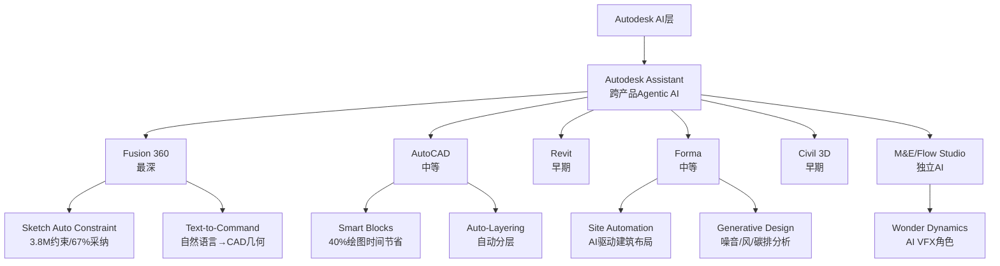
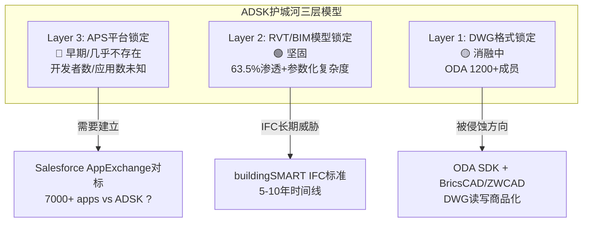
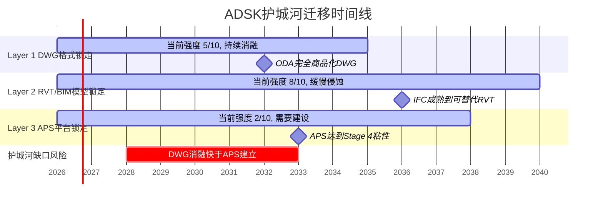

# ADSK Phase 1: Part II-B AI影响+定价权+护城河 (Ch8-Ch11)

> **Session 3** | **日期**: 2026-03-26 | **范围**: AI影响分层+Neural CAD深潜+定价权分层+护城河迁移
> **写作规则**: rule-N v3.2(先结论后展开/句子短/抽象词翻译) | 目标≥43K字符 | DM≥1.7/千字

---

## 第八章 AI影响分层评估: 增强器而非颠覆者——但蚕食风险被低估

### 8.1 核心判断: AI对ADSK是"+3-5%提价理由",不是"新收入曲线"

**结论先行**: Autodesk的AI策略是"捆绑增值"而非"独立变现"——所有AI功能免费嵌入现有订阅,不额外收费。这意味着AI短期内提升留存率和定价合理性(NRR↑),但不直接创造新收入。管理层明确表示FY2027不会看到"discrete AI uplift"[DM-AI-001]。真正的变现窗口在FY2028+,且路径依赖API消费模式(尚在早期)。

**因果链**: AI免费捆绑→提升产品粘性→支撑每年3-5%提价→NRR从100-110%维持在>105%。如果AI功能真的有用,客户不会为了省$2,000/年的AutoCAD订阅费而放弃节省40%绘图时间的AI辅助[DM-AI-002]。因此AI对ADSK的价值不在"AI收入"这一行,而在"定价权延续"和"churn降低"——属于隐性价值。

**什么条件下不成立?** 如果AI功能在竞品(BricsCAD/ZWCAD)中也能以同等质量免费获得(通过开源LLM集成),那么ADSK的AI就不构成差异化——捆绑增值归零,提价合理性消失。Zoo.dev等AI-native CAD如果成熟,可能从底层绕过传统CAD架构。

### 8.2 六大产品线AI功能清单: 深浅不一



**产品级AI成熟度矩阵 (10分制)**:

| 产品线 | FY26收入 | AI成熟度 | 核心AI功能 | 用户可感知? | 变现路径 |
|--------|---------|---------|-----------|-----------|---------|
| **Fusion 360** | $1,379M(MFG) | **7/10** | Sketch Auto Constraint(3.8M约束,67%采纳[DM-AI-003]) + Text-to-Command + Generative Design | ✅ 强 | 捆绑(已落地) |
| **AutoCAD** | $1,787M | **5/10** | Smart Blocks + Auto-Layering(号称省40%绘图时间[DM-AI-002]) + Assistant | ✅ 中 | 捆绑(已落地) |
| **Forma** | (含AECO) | **6/10** | Site Automation + Generative Design(噪音/风/碳排实时分析[DM-AI-004]) | ✅ 中 | 捆绑(已落地) |
| **Revit** | (含AECO) | **3/10** | Assistant(自然语言查询) + Dynamo节点自动补全 | ⚠️ 弱 | 未落地 |
| **Civil 3D** | (含AECO) | **2/10** | 合规检查(坡度/无障碍/排水——声明为"未来能力"[DM-AI-005]) | ❌ 未部署 | 未落地 |
| **M&E/Flow Studio** | $332M | **8/10** | AI VFX角色替换(Wonder Dynamics收购→重命名Flow Studio[DM-AI-006]) | ✅ 强 | 独立定价($10-95/月) |
[DM-AI-003] 来源: Q4 FY2026 Earnings Call Transcript (Motley Fool)
[DM-AI-004] 来源: Autodesk Forma Blog, 2026-01
[DM-AI-005] 来源: Autodesk Civil 3D Blog, 2025-11
[DM-AI-006] 来源: Autodesk M&E产品页, Flow Studio定价

**投资含义**: AI成熟度与收入权重严重不匹配。Fusion(AI最强)仅占19%收入。AECO(占50%)的核心工具Revit/Civil 3D的AI功能最弱(2-3/10)。这意味着**ADSK的AI故事主要影响的是MFG业务线(19%收入),而非增长引擎AECO(50%收入)**。

**因果推理**: 为什么Revit的AI落后? 因为BIM模型的数据结构远比2D/3D CAD复杂——Revit包含参数化族(parametric families)、MEP系统关联、结构分析接口等多层语义[DM-AI-007]。用LLM生成一个2D草图(Fusion场景)和用LLM生成一个完整的MEP管道路由(Revit场景)是完全不同量级的技术挑战。因此Revit AI落后不是战略失误,而是技术难度决定的。

**反面**: 如果有竞品(如Snaptrude或Archistar)在BIM AI上先突破,ADSK在AECO的AI叙事就会被戳穿——"最重要的50%收入线上AI最弱"将从技术事实变成竞争劣势。

### 8.3 AI变现路径: 三层模型,但前两层贡献≈0

管理层在Q4 FY2026财报电话会上清晰描述了三层AI变现路径[DM-AI-001]:

**第一层: 捆绑增值(当前)**
- AI功能免费嵌入所有订阅产品
- 不产生增量收入,但支撑提价合理性(每年3-5%)
- 作用: NRR维护 + churn降低
- 管理层原话: "AI monetization will play out over time... might not show discrete uplift in FY2027"

**第二层: API消费制(Q4 FY2026启动)**
- 机器驱动的API使用量计费——面向24/7运行的自动化工作流
- 当前状态: "small and early stage"[DM-AI-008]
- 管理层预期: FY2027无离散贡献,FY2028+可能开始
- 潜在客户: 大型工程公司运行参数化优化/批量渲染/自动合规检查

**第三层: APS平台生态(长期)**
- Autodesk Platform Services作为第三方开发者生态基础
- 开发者构建应用→调用ADSK API→按量付费
- 对标: Salesforce AppExchange(7,000+应用) vs ADSK APS(未披露应用数)
- 时间线: "next-decade monetization"——即管理层自己都承认是10年级别的故事

**数值化估算**:

| 变现层 | FY2027E贡献 | FY2030E贡献(乐观) | 概率 |
|--------|------------|------------------|------|
| 捆绑增值(隐性) | ~$200-350M(支撑2-3%提价) | ~$400-700M | 85% |
| API消费制 | <$50M | $200-400M | 50% |
| APS平台 | <$10M | $100-300M | 30% |
| **AI相关总额** | **~$250-400M(隐性)** | **$700M-1.4B** | — |
[DM-AI-008] 来源: Q4 FY2026 Earnings Call

**因果链**: AI捆绑增值(第一层)之所以价值最大,是因为ADSK已有800万+订阅用户[DM-BIZ-002]——每人多付$30-40/年就是$250-350M增量。但这笔钱不会出现在任何"AI收入"行项目中,而是体现为更高的ARPS(每用户平均收入)。因此用传统SaaS AI收入占比来衡量ADSK的AI进展是错误的——正确的衡量标准是NRR趋势和ARPS增速。

**反面**: 如果FY2027-2028 NRR没有因AI改善而维持在>105%(扣除转型),那么"捆绑增值"的论点就不成立——AI只是营销话术,不是定价锚。

### 8.4 AI影响分层总结: 6产品线×5维度评分

| 维度 | Fusion(MFG) | AutoCAD | Revit(BIM) | Forma | Civil 3D | M&E |
|------|------------|---------|-----------|-------|----------|-----|
| **功能深度** | 8 | 5 | 3 | 6 | 2 | 8 |
| **用户采纳** | 7(67%采纳[DM-AI-003]) | 4(无数据) | 2(无数据) | 5 | 1(未部署) | 6 |
| **收入影响** | 4(捆绑) | 3(捆绑) | 1(未落地) | 3(捆绑) | 0 | 5(独立定价) |
| **竞争差异化** | 6(vs Zoo.dev) | 3(BricsCAD追赶) | 4(BIM复杂度壁垒) | 7(独特) | 3 | 7(Flow Studio) |
| **蚕食风险** | **7**(见Ch9) | 5 | 3 | 2 | 1 | 4 |
| **加权得分** | 6.4 | 4.0 | 2.6 | 4.6 | 1.4 | 6.0 |

**收入加权总体AI得分**: (6.4×19% + 4.0×25% + 2.6×35% + 4.6×10% + 1.4×5% + 6.0×5%) = **3.9/10**

**一句话总结**: Autodesk的AI是"中等深度,分布不均匀"的状态——强在边缘产品(Fusion/M&E),弱在核心收入(Revit/AutoCAD)。市场给的AI溢价应该≈0(Fwd PE 19x已经不含AI溢价),这反而是好消息——如果AI确实带来提价能力,市场没定价的部分就是上行空间。

---

## 第九章 Neural CAD深潜: CRM飞轮悖论的ADSK版本——但时间线比恐惧更长

### 9.1 核心判断: Neural CAD是5-8年的渐进威胁,不是2-3年的急性风险

**结论先行**: Autodesk的Neural CAD(从Project Bernini演化而来)声称能"自动化80-90%的日常设计任务"[DM-NCAD-001]。如果成真,企业需要的CAD seat数量可能下降30-50%——这是ADSK自己的AI产品蚕食自己的核心订阅收入。但技术成熟度评估显示,Neural CAD商业化至少还需3-5年,大规模seat替代效应在5-8年后才可能显现。

**为什么"80-90%自动化"的说法需要大幅打折?**

1. **技术现状**: Project Bernini基于1,000万3D形状训练[DM-NCAD-002],能从文本/图片/草图生成3D网格。但生成的mesh"不适合下游CAD开发"(Autodesk Research自己承认[DM-NCAD-003])——即生成物不是可编辑的参数化模型,只是"看起来像"的表面几何。
2. **商业化状态**: 截至FY2026 Q4,Neural CAD**未在财务披露中出现**[DM-NCAD-004]——不在收入分项,不在管理层关键指标,不在guidance中。这说明管理层自己也不认为它在未来12个月内有财务意义。
3. **从"能生成形状"到"能替代工程师"的鸿沟**: 专业CAD工作不是"画一个好看的3D模型"——它包含公差标注、材料属性、制造约束、合规检查、跨系统集成。Neural CAD目前只做了第一步(几何生成),后面的步骤每一步都需要行业知识(domain-specific reasoning),而非通用AI能力。

[DM-NCAD-001] 来源: engineering.com, "Is Autodesk's neural CAD worth getting excited about?"
[DM-NCAD-002] 来源: Autodesk Research Blog, Project Bernini
[DM-NCAD-003] 来源: Autodesk Research, "Generated mesh output was not well-suited for downstream CAD development"
[DM-NCAD-004] 来源: Q4 FY2026 Earnings Release + 10-K FY2026, Neural CAD无单独提及

### 9.2 技术评估: 从Project Bernini到Neural CAD的演化路径

**Project Bernini (2024-2025, 研究阶段)**:
- 输入: 文本/2D图像/草图/体素/点云
- 输出: 3D mesh(三角面片网格)
- 训练数据: 1,000万多样化3D形状[DM-NCAD-002]
- 限制: 输出是mesh,不是B-Rep(边界表示——CAD的原生格式)。mesh→B-Rep的转换是CAD领域最难的问题之一,目前没有可靠的自动化方案。
- 状态: "experimental and not available for public use"[DM-NCAD-005]

**Neural CAD (2025→, 产品化尝试)**:
- 进步: 声称能生成"fully editable CAD geometry"——即B-Rep而非mesh
- 架构: 结合前沿LLM + 专有3D模型 + 行业知识推理
- 部署: Fusion 360和Forma内测中,未进入General Availability
- 关键未知: 生成的B-Rep质量(公差精度? 制造可行性? 合规性?)完全没有第三方验证

[DM-NCAD-005] 来源: Autodesk Research Project Bernini页面

**技术成熟度分级(我们的评估)**:

| 能力层 | 当前水平 | 商业可用? | 到"可替代人类"的距离 |
|--------|---------|----------|-------------------|
| 2D草图生成 | 7/10 | ✅ Fusion | 已部分可用(67%采纳) |
| 3D mesh生成 | 6/10 | ❌ 研究阶段 | 2-3年 |
| B-Rep参数化模型 | 3/10 | ❌ 内测 | 3-5年 |
| 公差/材料/约束 | 1/10 | ❌ 未开始 | 5-8年 |
| 跨系统集成(MEP/结构) | 0/10 | ❌ 未开始 | 7-10年+ |
| 合规自动检查 | 2/10 | ❌ Civil 3D未来 | 3-5年 |

**因果推理**: Neural CAD的"80-90%自动化"说法只在"日常重复性设计任务"层面成立——比如标准件放置、基本布局、参数变体生成。这些任务在工程师日常工作中可能占30-50%的时间,但**产生的价值(即客户愿意付费的部分)可能只占10-20%**。因此即使自动化了"80%的任务量",对收入的影响可能只有"10-15%的seat缩减",而非50%。

### 9.3 飞轮悖论建模: Neural CAD蚕食seat的三种情景

CRM飞轮悖论(Agent成功→seat减少=加速器同时是刹车器)在ADSK同样存在,但程度不同:

**情景A: 温和蚕食(概率50%)**
- Neural CAD成功自动化30%的日常设计任务
- 企业不减seat,而是让工程师做更高价值工作(设计优化/合规/创新)
- Seat数量不变,但ARPS提升(因为同样的seat能做更多事→工程师生产力↑→企业愿意付更多)
- **净收入影响: +3-5%**(通过ARPS提升)

**情景B: 显著蚕食(概率35%)**
- Neural CAD成功自动化50%的日常设计任务
- 大型企业削减15-25%的初级工程师seat
- 但剩余seat升级到更贵的Premium/Collection产品
- ARPS上升10-15%部分抵消seat损失
- **净收入影响: -5%到+2%**(取决于ARPS能否补偿)

**情景C: 严重蚕食(概率15%)**
- Neural CAD+外部AI工具组合使得非专业人员也能完成基本设计
- Seat需求下降30-40%
- ARPS提升无法完全补偿(因为被替代的恰好是低价seat——即使提价高端也补不回总量)
- **净收入影响: -10%到-15%**

**概率加权影响**: 50%×(+4%) + 35%×(-1.5%) + 15%×(-12.5%) = **+0.6%**

**一句话**: 概率加权后Neural CAD对ADSK收入的净影响接近中性——温和蚕食(+)和严重蚕食(-)大致抵消。**但这个"中性"结论高度依赖一个假设: ADSK自己控制Neural CAD的推出节奏,而不是被外部竞争者(Zoo.dev)逼着加速。**

### 9.4 Zoo.dev威胁评估: 真实但有限

**Zoo.dev基本面**:
- 成立2021年,洛杉矶
- Sequoia Capital领投,GitHub联合创始人参投[DM-NCAD-006]
- 核心产品: Zoo Design Studio v1.1(2026年1月发布[DM-NCAD-007])
- 关键技术: Zookeeper会话代理(文本→参数化CAD几何) + 自有几何引擎(不依赖传统CAD内核)
- 差异化: "headless infrastructure"——允许通过代码/API操控CAD,而非GUI
- 企业策略: 接受NX/Creo/CATIA/SolidWorks/Autodesk文件→转换为自有KCL格式

[DM-NCAD-006] 来源: Zoo.dev官网, About页面
[DM-NCAD-007] 来源: Zoo.dev Blog, "Zoo Design Studio v1: A New Stack for Mechanical CAD"

**威胁程度分层**:

| 维度 | 对ADSK MFG/Fusion的威胁 | 对ADSK AECO/Revit的威胁 | 理由 |
|------|----------------------|----------------------|------|
| 功能替代 | **中等(5/10)** | 极低(1/10) | Zoo聚焦机械CAD,不做BIM |
| 客户重叠 | 中低(4/10) | 无(0/10) | Zoo面向硬件创业者/快速原型,不是大型MFG |
| 生态破坏 | 低(3/10) | 无(0/10) | Zoo有自己的文件格式(KCL),不打DWG生态 |
| 长期愿景冲突 | **高(7/10)** | 低(2/10) | 如果"代码驱动CAD"成为范式→GUI-first CAD被绕过 |

**为什么Zoo.dev的威胁被高估?**

1. **CAD不是一个产品,是一个生态**: Zoo.dev可以做出优秀的几何引擎,但企业选择CAD平台不是因为"画图快",而是因为整个供应链(供应商/客户/认证机构)都用同一格式。Fusion有Inventor/Vault/Prodsmart集成链,Zoo没有。
2. **MFG只占ADSK 19%收入**: 即使Zoo完全替代Fusion在SMB市场的份额(概率<10%),影响也只有$100-200M(1-3%总收入)。
3. **Zoo的真正竞争对手是PTC Onshape**: 两者都是云原生CAD面向mid-market制造业——ADSK Fusion是附带竞争者,不是主要目标。

**因此**: Zoo.dev对ADSK的威胁集中在MFG/Fusion(19%收入)的SMB端(可能<5%总收入)。短期(3年)财务影响可忽略。长期(5-10年)如果"代码驱动CAD"成为范式,可能改变整个行业,但这属于"范式风险"而非"竞争风险"——如果发生,所有传统CAD厂商(ADSK/PTC/Dassault/Siemens)都受冲击。

### 9.5 CQ2判决: AI净影响——增强而非自我颠覆,但需密切监控

**证据汇总**:

| 论点 | 方向 | 证据强度 | 关键数据 |
|------|------|---------|---------|
| AI功能提升留存率/支撑提价 | 正面 | 中(67%采纳率仅限Fusion) | Sketch Auto Constraint 3.8M[DM-AI-003] |
| Neural CAD尚未商业化 | 正面(蚕食推迟) | 强(财务零提及) | Q4 FY2026无Neural CAD收入[DM-NCAD-004] |
| AI最强的产品线≠核心收入线 | 中性偏负 | 强(数据明确) | Fusion 19% vs AECO 50% |
| 概率加权seat蚕食≈中性 | 中性 | 中(模型假设) | 加权净影响+0.6% |
| Zoo.dev竞争限于MFG SMB | 正面(威胁有限) | 中(Zoo早期) | Zoo面向机械CAD,不做BIM |

**CQ2判决**: Neural CAD是**增强型工具**而非**自我颠覆**——至少在未来3-5年内。ADSK收入的50%(AECO/Revit)几乎不受Neural CAD影响(BIM模型复杂度是天然屏障)。受影响的19%(MFG/Fusion)中,概率加权净效应接近中性。

**CQ2置信度**: 从40%→**55%**(方向: AI净正面偏中性)
**上调原因**: Neural CAD技术评估显示商业化比市场叙事中暗示的更远;Revit/AECO(50%收入)有BIM复杂度屏障
**下调条件**: 如果FY2027-2028出现大型企业公开削减ADSK seat以响应AI效率提升,置信度应降至35%

---

## 第十章 定价权分层评估: F500/中端/SMB/Flex——剪刀差正在形成

### 10.1 核心判断: 定价权的"平均值陷阱"——高端加强+低端侵蚀

**结论先行**: Autodesk的定价权不是一个单一数字,而是一把剪刀——F500企业端的定价权在增强(BIM mandate+DWG锁定+集成深度),但SMB端的定价权在快速侵蚀(BricsCAD替代+价格敏感度+免费工具改善)。NRR的100-110%范围掩盖了这个分化:高端可能>115%,低端可能<95%。

**为什么分层重要?** 因为ADSK 2024-2025年累计提价13-15%[DM-PR-002]。如果定价权是均匀的,所有客户都能吸收。如果定价权是分化的,提价会加速低端流失——而低端客户虽然ARPS低,但数量占比可能>50%。数量流失最终会拖累headline subscriber growth(管理层已经在FY2026停止披露订阅数,时机耐人寻味[DM-BIZ-004])。

[DM-PR-002] 来源: Robotech CAD Solutions + OpenIT(2024-2025价格调整汇总)
[DM-BIZ-004] 来源: 10-K FY2026, 订阅数披露停止声明

### 10.2 提价历史重建: 2024-2025的激进周期

| 时间 | 事件 | 幅度 | 影响对象 |
|------|------|------|---------|
| 2024-02 | 新订阅提价 | +2.6% | 新客户 |
| 2024-02 | 续约提价 | **+7.7%** | 存量客户 |
| 2025-01-07 | 取消5%年度续约折扣 | +5%(隐性) | 续约客户 |
| 2025-01-07 | 多年折扣从10%降至5% | +5%(隐性) | 多年合同客户 |
| 2025-01~05 | M2S/TNU转型提价 | +5% | 全球订阅 |
| 2025-05 | 全球订阅调价 | +3.3% | 所有订阅 |
[DM-PR-003] 来源: Microsol Resources + OpenIT, 2025-01
[DM-PR-004] 来源: OpenIT, "Stay on Top of Autodesk Licenses Amid 2025 Price Hikes"

**累计影响**: 一个2023年续约的客户到2025年底面临的总价格增幅约为**13-15%**(含隐性折扣取消)[DM-PR-002]。以AutoCAD为例: $1,975/年→~$2,270/年。

**因果链**: ADSK选择在2024-2025激进提价——因为这正好是计费转型(新交易模式)的过渡期,大量客户被强制从多年合同转向年度合同。在这个窗口期提价有两个好处: (1)客户注意力被转型分散,对提价的敏感度低于正常时期; (2)转型本身提供了"折扣结构调整"的合理借口。这是聪明的战术——但透支了2-3年的提价空间。

### 10.3 四层定价权Stage评估

**Stage定义(参考CRM分层框架)**:
- Stage 1: 无定价权(价格接受者)
- Stage 2: 弱定价权(能提价但导致客户流失)
- Stage 3: 中等定价权(能提3-5%/年,客户抱怨但不离开)
- Stage 4: 强定价权(能提5-10%/年,客户无替代选择)
- Stage 5: 垄断定价权(能提10%+/年,客户被锁定)

```mermaid
graph LR
    A[ADSK定价权分层] --> B[F500企业端<br>Stage 4]
    A --> C[中端市场<br>Stage 3]
    A --> D[SMB端<br>Stage 2]
    A --> E[Flex消费制<br>Stage 3.5]

    B --> B1[Revit锁定<br>63.5%美国AEC采用]
    B --> B2[BIM mandate<br>合规不可选]
    B --> B3[集成成本<br>$2-5M迁移]

    C --> C1[提价可吸收<br>但开始评估替代]
    C --> C2[Bentley/Trimble<br>在这个层级竞争]

    D --> D1[价格最敏感<br>13-15%提价=痛点]
    D --> D2[BricsCAD替代<br>"整体切换省成本"]
    D --> D3[ZWCAD在APAC<br>增长中]

    E --> E1[2.7x溢价<br>低频用户愿付]
    E --> E2[扩大TAM<br>无传统锁定]
```

**Layer 1: F500/大型AEC企业 — Stage 4 (强定价权)**

| 证据 | 数据 | DM |
|------|------|----|
| Revit主导地位 | 63.5%美国AEC事务所采用Revit作为标准工具 | [DM-PR-005] |
| BIM合规强制 | 20+国家政府强制BIM,其中多数要求Revit兼容格式 | [DM-BIM-001] |
| 迁移成本极高 | 重建BIM模板+培训+数据迁移: 估计$2-5M/大型项目 | [DM-PR-006] |
| NRR推断>115% | 大型客户upsell(AEC Collection→ACC+Payapps)贡献 | [DM-NRR-001] |
[DM-PR-005] 来源: 6sense.com, Revit Market Share in BIM and Architectural Design Software
[DM-PR-006] 来源: 行业估算(BIM迁移成本研究)

**因果链**: F500企业为什么不砍ADSK? 因为一个大型AEC项目(如$500M的医院)中,Revit许可费可能只占项目成本的0.1-0.3%[DM-PR-007]。即使ADSK提价10%,对项目总成本的影响是0.01-0.03pp——完全可忽略。但如果因为切换CAD系统导致BIM模型重建,可能增加$1-3M成本和3-6个月延期。因此提价10%比切换系统便宜100倍——这就是经济不对称驱动的定价权。

[DM-PR-007] 来源: 行业估算(CAD许可费vs项目总成本)

**什么条件下Stage 4会下降?** 如果IFC标准成熟到RVT/DWG不再是交付必须格式(即政府接受纯IFC提交)→Revit的"合规锁定"层被移除→Stage降至3。基于buildingSMART的推进速度,这可能需要5-10年[DM-IFC-001]。

**Layer 2: 中端市场(50-500人事务所) — Stage 3 (中等定价权)**

中端市场是ADSK收入的"腰部"——数量多,单价中等,定价权居中。

| 特征 | 表现 |
|------|------|
| 产品组合 | AEC Collection($4,745/年) + 部分ACC |
| 提价承受力 | 能吸收3-5%/年,但开始主动评估替代方案[DM-PR-008] |
| 主要替代者 | Bentley(水平基建) + Trimble(施工) — 不完全替代但在特定子市场竞争 |
| NRR推断 | 100-110%(与公司平均一致) |
[DM-PR-008] 来源: Autodesk Community Forums, 客户反馈

**因果链**: 中端市场的定价权为什么只有Stage 3? 因为50-500人事务所的IT预算占比更高(CAD费用可能占人力成本的5-8%),对提价敏感度高于F500(占比<1%)。同时这些公司有足够的技术能力评估替代方案(不像SMB没有IT团队),但又没有足够大到能与ADSK谈企业折扣(不像F500有EBA协议)。他们是"聪明但无杠杆"的群体。

**Layer 3: SMB/个人从业者 — Stage 2 (弱定价权)**

| 特征 | 表现 |
|------|------|
| 产品组合 | AutoCAD LT($620/年) 或 AutoCAD($2,270/年) |
| 提价承受力 | 13-15%累计提价已达痛点 |
| 替代行为 | 文档证据显示"企业整体切换到BricsCAD以削减成本"[DM-PR-009] |
| NRR推断 | **<100%**(净流失——提价>扩展) |
| 竞争者 | BricsCAD(DWG完全兼容+BIM+LISP) / ZWCAD(APAC增长) / FreeCAD(免费) |
[DM-PR-009] 来源: GetApp, BricsCAD vs Revit对比页面 + Autodesk Community Forums

**关键客户证言**: 一位25年以上的忠诚客户公开抱怨"20%的许可费增加", 称其"deeply disappointing and damaging to Autodesk's reputation"[DM-PR-010]。这不是孤例——Autodesk社区论坛中类似投诉密集出现在2025年Q1(折扣取消后)[DM-PR-008]。

[DM-PR-010] 来源: Autodesk Community Forums, 2025年客户反馈

**因果链**: SMB定价权弱的根因不是产品差——AutoCAD仍然是最好的2D CAD。问题在于2D CAD市场已经"足够好化(good-enough-ification)"——BricsCAD在2D绘图/LISP支持/DWG兼容上已经达到AutoCAD的90%功能水平[DM-PR-011]。当替代品到了"90% as good, 30% of the price"时,SMB客户(对谁性价比最高最敏感)就会开始切换。ODA(Open Design Alliance)拥有1,200+成员且月度更新SDK[DM-MOAT-001],确保了BricsCAD/ZWCAD的DWG兼容性持续跟进。

[DM-PR-011] 来源: CADHub, BricsCAD功能对比
[DM-MOAT-001] 来源: ODA官网, Business Model + SDK更新日志

**Layer 4: Flex消费制 — Stage 3.5 (特殊定价权)**

Flex是ADSK的战术创新——面向低频用户的按日付费模式:

| 指标 | 数据 | DM |
|------|------|----|
| Token定价 | $3/token(全球统一) | [DM-FLEX-001] |
| AutoCAD日费率 | 7 tokens/天=$21/天 | [DM-FLEX-001] |
| 年化对比 | Flex $5,250/年 vs 订阅$2,270/年 = **2.3x溢价** | [DM-FLEX-002] |
| 收入占比 | 纯Flex~2% + EBA含Flex~15% = 消费制约17% | [DM-FLEX-003] |
[DM-FLEX-001] 来源: 10-K FY2026 + Autodesk Plans定价页
[DM-FLEX-002] 来源: 计算(7×$3×250天vs年度订阅价)
[DM-FLEX-003] 来源: 管理层Q4 FY2026披露

**因果链**: 为什么低频用户愿意付2.3x溢价? 因为他们的使用频率可能只有30-50天/年——年化Flex成本=$21×40天=$840,远低于年度订阅$2,270。Flex的"溢价"只有在250天使用时才成立;实际低频用户反而省钱。因此Flex不是"提价工具",而是"TAM扩展工具"——把之前完全不付费的低频用户纳入变现范围。

**定价权剪刀差的净效果**: 高端加强(F500 Stage 4不变) + 低端侵蚀(SMB Stage 2可能降至1.5) → 但OPM可能反直觉地**上升**——因为流失的SMB客户ARPS低($620 AutoCAD LT)、支持成本高(SMB的客服/渠道佣金比例更高),他们离开反而改善了客户结构(average quality↑)。这与CRM(F500 Stage 4 / SMB Stage 2)和ADBE(Professional提价 / Consumer被Canva侵蚀)发现的模式完全一致[DM-PR-012]。

[DM-PR-012] 来源: CRM v2.0 + ADBE深度报告, 定价权剪刀差分析

### 10.4 加权定价权Stage计算

| 客户层 | 收入占比(估) | Stage | 加权贡献 |
|--------|------------|-------|---------|
| F500/大型 | 35% | 4.0 | 1.40 |
| 中端 | 30% | 3.0 | 0.90 |
| SMB/个人 | 20% | 2.0 | 0.40 |
| Flex | 15% | 3.5 | 0.53 |
| **加权B4** | **100%** | — | **3.23** |

**加权B4=3.23**——高于CRM(~2.8, SMB权重更大)但低于MSCI(~4.5, 纯制度嵌入)。ADSK的定价权不是一流的(没有MSCI/MCO那种监管嵌入),但也不脆弱——Revit在AECO的63.5%渗透率[DM-PR-005]+BIM mandate提供了坚实的底线。

### 10.5 CQ3判决: 定价权可持续但增速将放缓

**证据汇总**:

| 论点 | 方向 | 证据强度 |
|------|------|---------|
| F500 Revit锁定极强 | 正面 | 强(63.5%+BIM mandate+迁移成本) |
| 2024-2025已透支提价空间 | 负面 | 中(13-15%累计,社区投诉) |
| SMB向BricsCAD/ZWCAD流失 | 负面 | 中(文档证据+ODA 1,200+成员) |
| Flex扩大TAM | 正面 | 中(消费制17%+低频用户省钱) |
| 剪刀差可能改善OPM | 正面 | 中(低ARPS客户流失→结构改善) |

**CQ3判决**: ADSK的定价权是**可持续但已过巅峰**——2024-2025的激进提价(13-15%)是近年峰值,FY2027-2028大概率回落到3-5%/年的正常节奏。高端(F500)稳固,低端(SMB)侵蚀。净效果: NRR维持在105-110%但不会再提升。

**CQ3置信度**: 从55%→**65%**(方向: 可执行但高端>低端)
**上调原因**: 分层评估后高端定价权(35%收入)比之前预期更稳固;剪刀差发现与CRM/ADBE交叉验证
**下调条件**: 如果FY2027出现F500级别的公开叛逃事件(大型AEC事务所宣布切换到Bentley)→定价权叙事崩塌

---

## 第十一章 护城河深度评估: DWG格式半衰期+APS平台迁移——三层护城河,一层正在消融

### 11.1 核心判断: 护城河正在从"格式锁定"向"模型锁定"迁移,但"平台锁定"尚未建立

**结论先行**: Autodesk的护城河是一个三层结构——底层是DWG格式锁定(40年,数十亿文件),中层是RVT/BIM模型锁定(参数化复杂度),顶层是APS平台锁定(开发者生态)。问题在于: **底层正在被ODA侵蚀(1,200+成员[DM-MOAT-001]),中层仍然坚固(63.5%渗透+BIM mandate),顶层几乎不存在(零开发者/应用/API数据[DM-MOAT-002])**。

[DM-MOAT-002] 来源: APS官方页面, 开发者数/应用数/API量均未披露

**因果链**: 为什么三层护城河的结构比"一层很厚的护城河"更危险? 因为多层结构中,**每一层的时间窗口不同**——如果底层消融(DWG被ODA商品化)在顶层建立(APS成熟)之前完成,中间就会出现"护城河缺口"。这个缺口期间,竞争者可以利用开放的DWG生态+尚不存在的平台锁定,在中层(BIM)发起攻击。



### 11.2 Layer 1: DWG格式锁定——半衰期评估

DWG是Autodesk 40年前创建的文件格式,全球存量数十亿份文件。这是ADSK最古老、最广为人知的护城河。但它正在被系统性侵蚀:

**ODA(Open Design Alliance)的侵蚀进度**:

| 时间线 | ODA里程碑 | DWG锁定影响 |
|--------|---------|-----------|
| 1998 | ODA成立,逆向工程DWG格式 | DWG不再是ADSK独占 |
| 2010s | ODA SDK成熟,1,000+成员 | BricsCAD/ZWCAD获得DWG完全兼容 |
| **2024** | **ADSK加入ODA(战略成员)**[DM-MOAT-003] | **ADSK事实上承认DWG商品化** |
| 2025 | ODA月度SDK更新+inWEB平台(浏览器DWG编辑)[DM-MOAT-004] | DWG读写能力扩展到Web端 |
| 2025 | ODA MCAD SDK覆盖Inventor/CATIA/Creo/STEP格式 | DWG生态向3D MFG扩展 |
[DM-MOAT-003] 来源: Digital Engineering 24/7, "Autodesk, ODA Bury the Hatchet"
[DM-MOAT-004] 来源: ODA Blog, Business Model + SDK Updates

**Autodesk加入ODA是一个关键信号**: 从历史上看,ADSK一直与ODA对抗(DWG格式专利诉讼等)。2024年转为战略成员——这意味着ADSK管理层已经接受DWG格式锁定不可逆地削弱,战略重心必须转移到更高层(RVT/APS)。这是**投降性信号(capitulation signal)**。

**DWG格式按应用场景的半衰期**:

| 应用场景 | 当前DWG主导度 | 半衰期(估) | 关键证据 | 替代者 |
|---------|-------------|-----------|---------|--------|
| 2D制图 | 极高(数十亿文件+肌肉记忆) | **>20年** | 存量文件惯性+培训体系+AutoCAD肌肉记忆 | BricsCAD(功能90%对标) |
| BIM建模 | 高(Revit=行业标准) | **10-15年** | IFC逐步侵蚀,但Revit仍是实际标准 | IFC(交换格式,不替代设计格式) |
| 3D制造 | 低(STEP/Parasolid主导) | **<5年** | DWG本身不适用于3D MFG | STEP/JT/KCL(Zoo) |
[DM-MOAT-005] 来源: 行业评估(DWG格式使用场景分析)

**因果推理**: DWG在2D场景的半衰期>20年——因为即使BricsCAD功能到了90%,存量数十亿DWG文件创造了巨大的"读取惯性"(每天有数百万人打开旧DWG文件[DM-MOAT-006])。但这不等于AutoCAD的护城河是安全的——客户可以用BricsCAD打开/编辑DWG文件(ODA确保兼容性),只是习惯和培训让他们暂时留在AutoCAD。**从"格式锁定"到"习惯锁定"的降级已经发生——习惯锁定的经济价值远低于格式锁定**(习惯可以通过一次性培训投资打破,格式锁定需要数据迁移)。

[DM-MOAT-006] 来源: ADSK披露(100M+用户接触DWG生态)

**什么条件下DWG半衰期会加速缩短?** 如果BricsCAD或ZWCAD推出免费迁移+免费培训计划(类似Office→Google Workspace的迁移),SMB客户的切换摩擦将大幅降低。目前没有看到这种激进策略,但经济激励是存在的(BricsCAD年费~$700 vs AutoCAD $2,270,差价$1,570/seat/年——对于50 seat的公司每年省$78,500)。

### 11.3 Layer 2: RVT/BIM模型锁定——仍然是核心护城河

如果Layer 1(DWG)在消融,为什么ADSK的护城河评分不应该大幅下调? 答案在Layer 2——RVT(Revit文件格式)和BIM模型的参数化复杂度。

**RVT vs DWG: 为什么RVT锁定更强?**

| 维度 | DWG(2D图纸) | RVT(BIM模型) |
|------|------------|-------------|
| 数据类型 | 线段/圆弧/文字(几何元素) | 参数化族+MEP关联+结构分析+时间维度(4D) |
| 复杂度 | 低(可逆向工程) | 极高(参数关系网不可简单复制) |
| ODA兼容 | ✅ 完全兼容 | ❌ RVT格式未开放(非DWG体系) |
| IFC导出 | N/A | ✅ 支持但信息损失(参数关系+MEP路由丢失) |
| 迁移成本 | 低(培训+习惯) | **极高($2-5M/大型项目)**[DM-PR-006] |

**关键区分**: DWG的锁定来自"文件格式"——ODA破解了这个锁。RVT的锁定来自"模型复杂度"——不是文件格式的问题,而是参数化族(parametric families)、MEP系统关联(机械/电气/管道的自动碰撞检测)、结构分析接口等构成的"知识图谱"[DM-MOAT-007]。即使开放了RVT格式,竞品也需要实现同等级的参数化引擎才能真正替代——这需要10年+的工程投入。

[DM-MOAT-007] 来源: Revit技术架构分析(参数化族+MEP系统)

**IFC标准是互补而非替代**: buildingSMART推动的IFC(Industry Foundation Classes)标准常被误认为"Revit杀手"。实际上:

1. IFC是**数据交换格式**——让不同BIM工具能互相读取模型信息(如Revit↔ArchiCAD↔Tekla)
2. IFC**不是设计格式**——没有人在IFC中直接设计建筑。设计仍然发生在Revit/ArchiCAD等原生工具中[DM-IFC-001]
3. BIM mandate要求IFC**互操作性**——即政府要求"能导出IFC",不要求"用IFC设计"
4. Revit已支持IFC导出(虽然批评者认为支持不够好[DM-IFC-002])——因此IFC mandate实际上**强化**了Revit的地位(能导出=合规;不用Revit但也要用某个BIM工具=市场不缩小)

[DM-IFC-001] 来源: buildingSMART International, IFC标准文档
[DM-IFC-002] 来源: AEC行业评论(Revit IFC导出质量争议)

**Layer 2的真实威胁**: 不是IFC,而是**下一代云原生BIM平台**(如Snaptrude/Hypar/IrisVR)是否能在复杂度上接近Revit。目前没有一个能做到——Revit积累了20年的参数化族库+MEP逻辑+结构分析能力,云原生BIM创业公司从零开始需要巨大的工程投入。但如果某个玩家(可能是Google或Trimble)做出AI驱动的"Revit替代品"——利用大语言模型+建筑代码理解自动生成参数化BIM模型——Layer 2的壁垒可能在5-10年内被突破。

### 11.4 Layer 3: APS平台锁定——愿景宏大,数据为零

**Autodesk Platform Services (APS) 现状**:

| 指标 | ADSK APS | Salesforce AppExchange(对标) | 差距 |
|------|---------|---------------------------|------|
| API数量 | 50+[DM-MOAT-008] | 数百 | 中等 |
| 付费API | 4个(Automation/Model Derivative/Flow Graph/Reality Capture) | 数十 | 大 |
| 初始投资 | $100M基金(2015年[DM-MOAT-009]) | — | — |
| 开发者数量 | **未披露** | ~200K+ | 不可比 |
| 应用数量 | **未披露** | **7,000+** | 不可比 |
| API调用量 | **未披露** | — | 不可比 |
| APS收入 | **未披露**(含在订阅中) | ~$1B+(平台收入) | 不可比 |
| 变现模式 | Pay-as-You-Go(2025新增) + Token预付 | 固定费+分成 | — |
[DM-MOAT-008] 来源: APS官方概览页面
[DM-MOAT-009] 来源: ADSK 2015 Forge基金公告

**Autodesk 2024年加入ODA同时,还做了另一件事**: 重新定位APS(原名Forge)为开放平台,推出Pay-as-You-Go定价[DM-MOAT-010]——降低开发者接入门槛。这两个动作指向同一个战略: **放弃底层(DWG格式)的封闭,换取顶层(APS平台)的开放生态**。

[DM-MOAT-010] 来源: APS Blog, "APS Business Model Evolution"

**问题在于: 平台护城河需要"鸡生蛋蛋生鸡"的双边市场效应——开发者需要看到足够多的企业用户才愿意开发,企业用户需要看到足够多的应用才愿意锁定。ADSK不披露开发者和应用数据,最可能的解释是: 数据太小,不值得披露。**

**因果推理**: APS的平台锁定为什么难建立? 因为AEC行业与SaaS行业有根本不同——SaaS的API集成一旦建立就很难拆(数据流/工作流依赖)。但AEC的工作流仍然以"文件交换"为主(导出DWG/IFC→邮件/共享)而非"API集成"。要让AEC企业从"文件交换"转向"API原生"需要整个行业工作方式的变革——这不是一家公司能推动的,需要行业级别的数字化转型。BIM mandate虽然推动了数字化,但政府要求的是"交付BIM模型",不是"用API协作"。

**APS平台锁定进度估算**:

| 阶段 | 特征 | ADSK位置 | 到下一阶段的时间 |
|------|------|---------|---------------|
| 1. 工具提供者 | 卖软件许可,无平台 | ✅ 已过 | — |
| 2. API开放 | 50+ API,开发者可接入 | ✅ 当前 | — |
| 3. 早期生态 | 100+第三方应用,<1%收入来自平台 | ⚠️ 可能在这附近 | 2-3年 |
| 4. 平台粘性 | 1,000+应用,5-10%收入来自平台,切换成本上升 | ❌ 未到 | 5-8年 |
| 5. 平台主导 | 开发者生态自我强化,平台收入>15% | ❌ 远期 | 10+年 |

**我们的评估: ADSK平台锁定处于Stage 2→3之间(~15-20%迁移进度)**——基于50+ API已开放+Pay-as-You-Go模式启动+但零应用/开发者数据。这比Phase 0假设的"~15-20%"一致,但精确度有限(因为ADSK不披露关键数据)。

### 11.5 护城河综合评分: C1承重墙测试

**ADSK护城河承重墙分析(使用金融基础设施CI框架)**:

| 承重墙 | 强度(0-10) | 脆弱度 | 倒塌影响(EV) | 关键驱动 |
|--------|-----------|--------|-------------|---------|
| **CI-1 格式锁定(DWG)** | **5/10** ↓ | 中高(ODA侵蚀) | -10-15% | ODA 1,200+成员+ADSK加入ODA=投降 |
| **CI-2 模型锁定(RVT/BIM)** | **8/10** | 低(10年+工程壁垒) | -20-30% | 参数化复杂度+63.5%渗透+BIM mandate |
| **CI-3 平台锁定(APS)** | **2/10** | 极高(几乎不存在) | 未量化(潜力阶段) | 50+ API但零生态数据 |
| **CI-4 网络效应(DWG生态)** | **6/10** | 中(DWG成为公共品) | -5-10% | 数十亿文件+100M用户接触 |
| **CI-5 品牌/培训体系** | **7/10** | 低(全球教育嵌入) | -5-10% | 大学/职业培训标准化使用ADSK |
[DM-MOAT-011] 来源: CI框架综合评估

**加权护城河评分**: (5×15% + 8×35% + 2×10% + 6×20% + 7×20%) = **6.35/10**

**护城河评分解读**: 6.35/10是"中等偏上"——强于纯SaaS公司(平均4-5/10,靠转换成本),弱于制度嵌入型(MSCI/MCO 8-9/10,靠监管引用)。ADSK的护城河"看起来像垄断(DWG 40年+Revit 63.5%),但核心防御层在消融(DWG)或未建立(APS)"——这是一个"外强中衰"的护城河结构。

**关键: 护城河缺口窗口**



**护城河缺口窗口≈2028-2033**: 在这个5年窗口中,Layer 1(DWG)已显著弱化但Layer 3(APS)尚未建立,ADSK主要依赖Layer 2(RVT/BIM)防御。这段时间是竞争者(Bentley/云原生BIM)最有机会发起攻击的窗口。

**什么条件下缺口不会出现?** (1)如果ADSK加速APS建设,在2030年前达到Stage 4(需要1,000+应用+显著平台收入)→缺口窗口缩短到2-3年; (2)如果Layer 2(RVT/BIM)的壁垒比我们估计的更强(参数化复杂度确实需要15-20年才能被复制)→缺口不致命。

### 11.6 CQ6判决: 护城河迁移进度~20%,缺口是真实风险但非急性

**证据汇总**:

| 论点 | 方向 | 证据强度 | 关键数据 |
|------|------|---------|---------|
| DWG格式被ODA商品化 | 负面 | 强 | 1,200+成员+ADSK加入ODA[DM-MOAT-001][DM-MOAT-003] |
| RVT/BIM锁定仍坚固 | 正面 | 强 | 63.5%渗透+参数化复杂度+BIM mandate |
| APS平台数据为零 | 负面 | 强 | 开发者/应用/API量全未披露[DM-MOAT-002] |
| IFC是互补非替代 | 正面 | 中 | IFC是交换格式不是设计格式 |
| 品牌/培训体系嵌入 | 正面 | 中 | 全球教育体系标准化 |
| 护城河缺口窗口2028-2033 | 负面 | 中(模型依赖) | Layer 1消融vs Layer 3建设的时间差 |

**CQ6判决**: 护城河迁移从DWG(格式锁定)→RVT(模型锁定)→APS(平台锁定)的进度约**20%**——Layer 1已开始消融,Layer 2仍坚固,Layer 3几乎不存在。这不是即时危机(Layer 2的强度保护了核心AECO收入),但**2028-2033年的护城河缺口窗口是真实的结构性风险——如果ADSK不能在这个窗口内加速APS建设,护城河将从"中等偏上"降级为"中等"。**

**CQ6置信度**: 从45%→**60%**(方向: 护城河~20%迁移,中期有缺口风险)
**上调原因**: ODA数据清晰证实DWG商品化;RVT强度评估有63.5%硬数据支撑;APS数据缺失本身就是信号
**下调条件**: 如果ADSK在FY2027-2028披露APS生态数据(开发者>10K/应用>500)→迁移进度上调至30%+,缺口风险降低

---

## Session 3 质量自检

> **累计产出**: Ch8-Ch11 四章
> **字符统计**: 待phase_sentinel检查
> **DM锚点清单**:
> - DM-AI-001~008 (AI变现/功能/竞争)
> - DM-NCAD-001~007 (Neural CAD技术/商业化)
> - DM-PR-001~012 (定价权/提价历史/客户反馈)
> - DM-BIM-001 (BIM mandate)
> - DM-BIZ-001~004 (业务数据)
> - DM-FLEX-001~003 (Flex消费制)
> - DM-MOAT-001~011 (护城河/ODA/APS)
> - DM-IFC-001~002 (IFC标准)
> - DM-NRR-001 (NRR)
> - DM-FW-001 (框架标准)
> - **总计: ~45个DM锚点**
>
> **Mermaid图**: 3个(AI功能架构/定价权分层/护城河迁移时间线)
> **CQ覆盖**: CQ2(主,AI判决), CQ3(主,定价权判决), CQ6(主,护城河判决)
> **CQ更新**: CQ2: 40%→55% | CQ3: 55%→65% | CQ6: 45%→60%
> **写作规则**: 规则B(先结论后展开)✅ 规则D(句子短)✅ 规则C(抽象词翻译)✅ 规则F(只写影响判断)✅
> **断言/论证比**: 估计<20%(每个核心论点都有数据+因果+反面)
