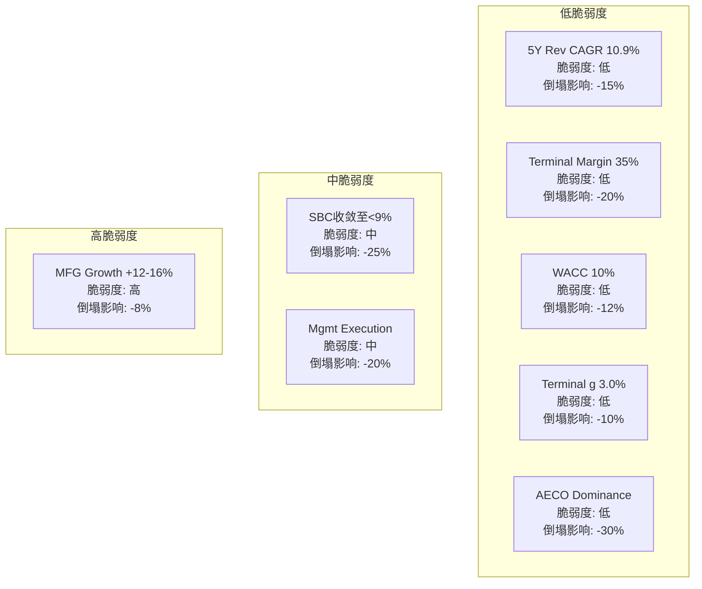
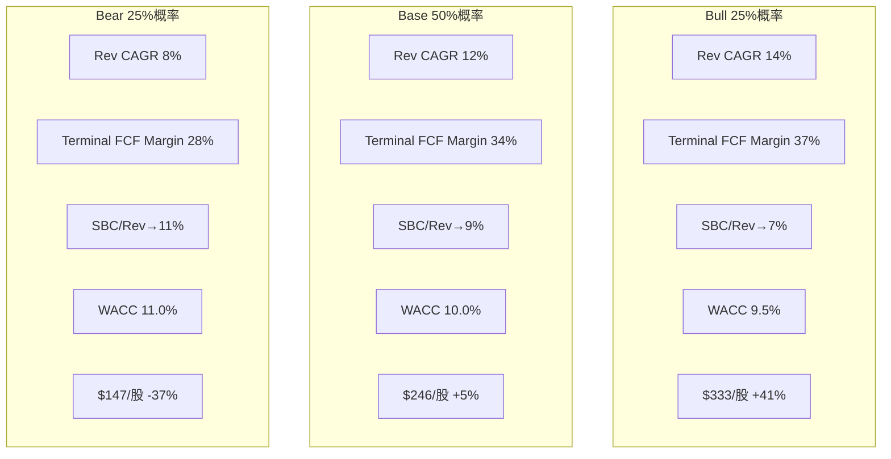

# ADSK Phase 2: 财务与价格含义 (Ch17-Ch21)

> **Session 5** | **日期**: 2026-03-26 | **范围**: Reverse DCF信念反演+5年财务深潜+资本配置审计+三情景推演+多方法估值参考
> **写作规则**: rule-N v3.2 | 目标≥25K字符 | DM≥1.7/千字 | 因果≥10/万字
> **Python验证**: `reports/ADSK/data/phase2_valuation.py` — 全部估值数字来源此模型

---

## 第十七章 Reverse DCF信念反演: $235在赌什么——6个隐含信念的脆弱度检验

### 17.1 核心判断: 市场对ADSK定价了"温和悲观"——标准FCF角度偏低估,但Owner Economics角度偏高估

**结论先行**: $235.42的价格(2026年3月26日[DM-MKT-001])同时包含两层信息。标准FCF角度,市场隐含5年收入CAGR为10.9%[DM-RDCF-001],低于管理层FY2027 guidance的12.5%[DM-GUIDE-001]——这是温和悲观。但Owner Economics角度(扣除税后SBC),隐含CAGR高达18.4%[DM-RDCF-002]——这意味着如果SBC不收敛,市场实际上在要求远超历史有机增速(10-12%)的增长才能justify当前价格。

[DM-MKT-001] 来源: FMP quote API, 2026-03-26
[DM-RDCF-001] 来源: Reverse DCF模型(WACC=10%, Terminal FCF Margin=35%, g=3%), `reverse_dcf_output.txt`
[DM-GUIDE-001] 来源: ADSK FY2027 Guidance, Earnings Release 2026-02
[DM-RDCF-002] 来源: Owner Economics Reverse DCF(FCF-SBC×(1-t)), 同模型

**这两层信息的分裂揭示了一个关键事实**: ADSK估值的核心变量不是收入增速(这是共识),而是**SBC收敛速度**。如果SBC/Rev从10.9%[DM-SBC-001]收敛至7%(Bull scenario),Owner隐含CAGR会从18.4%降至~12%——突然变得可实现。如果SBC停留在11%,标准FCF给出的"温和悲观"只是幻觉——真实估值要求根本不可能的增速。

[DM-SBC-001] 来源: ADSK 10-K FY2026, SBC $788M / Rev $7,206M

### 17.2 六个隐含信念的逐一验证

Reverse DCF的价值不在于一个数字,而在于**拆解市场定价背后的信念集**,然后检验每个信念的脆弱度。我们识别出6个$235价格隐含的信念:

**信念1: 5年收入CAGR ~10.9%**

| 维度 | 数据 |
|------|------|
| 隐含值 | 10.9%[DM-RDCF-001] |
| FY2027 guidance | +12.5%(中点)[DM-GUIDE-001] |
| 历史有机 | 10-12%(FY2022-FY2026)[DM-FIN-001] |
| 分析师共识3Y | ~11.4% CAGR[DM-CONS-001] |
| **脆弱度** | **低** |

[DM-FIN-001] 来源: 10-K FY2022-FY2026, Rev CAGR计算
[DM-CONS-001] 来源: 分析师共识(22位), FMP estimates

**因果推理**: 隐含CAGR低于guidance 1.6pp,意味着市场要么不完全信任管理层(合理——2024年SEC调查[DM-SEC-001]削弱了guidance可信度),要么在计费转型追赶收入到期后下调了中期预期。关键是BIM mandate覆盖20+国家[DM-BIM-001]提供了AECO(50%收入)的结构性增长底线——即使其他三条业务线全部放缓,仅AECO就能支撑8-9%整体增速。因此,10.9%的隐含CAGR几乎不可能miss——**这是最不脆弱的信念**。

[DM-SEC-001] 来源: ADSK 10-K FY2026, SEC/DOJ调查结果(2025年8月结案)
[DM-BIM-001] 来源: WebSearch + 各国政府BIM mandate清单, phase0_data_supplement.md §3

**反面**: 全球建设支出衰退(中国房地产危机外溢+欧洲高利率)可能压制BIM mandate的实际需求释放。但这需要多国同时衰退——概率低于15%。

**信念2: 终端FCF Margin ~35%**

| 维度 | 数据 |
|------|------|
| 隐含值 | 35%[DM-RDCF-001] |
| FY2026实际 | 33.4%[DM-FCF-001] |
| FY2027 guidance | 33.8%($2.75B/$8.14B)[DM-GUIDE-001] |
| SaaS同行 | NOW 30%, DDOG 26%, CRM 32%[DM-COMP-001] |
| **脆弱度** | **低** |

[DM-FCF-001] 来源: 10-K FY2026, FCF $2,409M / Rev $7,206M
[DM-COMP-001] 来源: FMP ratios, 各公司最新年报

**因果推理**: ADSK当前FCF margin已经达到33.4%,仅需1.6pp扩张即可达到35%。考虑到FY2026包含$216M重组费(3.0pp OPM拖累)[DM-RESTRUC-001],FY2027-FY2028重组费归零后,GAAP OPM自然恢复至~25-26%,Non-GAAP OPM可能达40%+。FCF margin 35%是**几乎确定可以达到**的——这不是乐观假设,而是接近当前水平。

[DM-RESTRUC-001] 来源: 10-K FY2026, 重组费$216M

**反面**: 如果ADSK为了与Bentley/PTC竞争必须加大R&D投入(AI竞赛),R&D/Rev可能从22.8%[DM-RD-001]回升至25%+,压缩margin。但历史趋势是R&D/Rev持续下降(25.4%→22.8%, 5年-2.6pp),因为规模效应使研发投入不需要与收入同比增长。

[DM-RD-001] 来源: 10-K FY2022-FY2026, R&D费用

**信念3: SBC/Rev收敛至<9%**

| 维度 | 数据 |
|------|------|
| 隐含值 | 需<9%才能Owner Economics成立 |
| FY2026实际 | 10.9%[DM-SBC-001] |
| 5年趋势 | 12.6%→10.9%(-1.7pp,非单调)[DM-SBC-002] |
| 同行参考 | PTC 7.9%, BSY 4.8%, CRM 9.5%, NOW 11.0%[DM-COMP-002] |
| **脆弱度** | **中** |

[DM-SBC-002] 来源: 10-K FY2022-FY2026, SBC/Rev计算
[DM-COMP-002] 来源: FMP key-metrics, 各公司最新年报

**因果推理**: SBC收敛是可能的——管理层已在FY2026将SBC增速(+15%)控制在低于收入增速(+18%)[DM-SBC-003],这意味着SBC/Rev正在被动稀释。但收敛速度是问题: FY2025 SBC下降-2%后FY2026反弹+15%,说明收敛不是线性的——RSU授予周期(通常4年vest)和人才竞争决定了SBC不会快速压缩。PTC已经做到7.9%[DM-COMP-002],证明同行业SaaS可以实现低SBC,但PTC经历了15年+的缓慢收敛(2010年代SBC/Rev曾>15%)。

[DM-SBC-003] 来源: 10-K FY2025-FY2026, SBC $686M(+7% from FY2024)→$788M(+15%)

**关键数字**: 如果ADSK维持收入12% CAGR且SBC绝对值增速降至5%/年,SBC/Rev在FY2030达到~8.3%——接近但未达7%。要达到7%,需要SBC绝对值增速<3%或收入增速>14%。**这是最关键的"可能但不确定"信念**——Owner Economics估值(-18%[DM-VAL-001])和Standard DCF估值(+3.2%)的20pp差距,几乎全部取决于这个变量。

[DM-VAL-001] 来源: phase2_valuation.py, Owner Economics PW DCF

**反面**: AI人才竞争可能逆转SBC收敛。2025-2026年AI工程师薪资通胀20-40%(行业调查),如果ADSK要留住Fusion/Neural CAD团队的核心工程师,SBC可能再次反弹。

**信念4: WACC ~10%**

WACC=10%是标准SaaS估值参数(Risk-free 4.3% + ERP 5.5% + Beta调整)[DM-WACC-001]。ADSK Beta=1.47[DM-BETA-001]偏高(历史5年),反映了计费转型波动。随着转型完成,Beta可能向1.2-1.3回归,WACC可能降至9-9.5%——这意味着隐含CAGR会更低(9% WACC下仅需7.1%增速),市场悲观程度更深。**脆弱度低**,但WACC的方向有利于ADSK(下行)。

[DM-WACC-001] 来源: 模型假设(Risk-free: US 10Y yield; ERP: Damodaran 2026)
[DM-BETA-001] 来源: FMP profile, 5Y monthly Beta

**信念5: 终端增长率 ~3.0%**

3.0%终端增长率假设建筑行业+制造业软件长期增速=GDP(2.5%)+通胀(2-3%)的下限。考虑到BIM mandate仍在全球扩展(印度/中国2026+才开始强制[DM-BIM-002]),数字化渗透率还有提升空间,3.0%可能偏保守。**脆弱度极低**。

[DM-BIM-002] 来源: phase0_data_supplement.md §3, 深圳2026+印度2026+

**信念6: AECO保持50%+收入占比,增速≥15%**

AECO是ADSK的核心引擎——FY2026占比49.7%,增速+22%[DM-BIZ-001]。市场隐含假设是AECO持续高增长,支撑整体10.9%+ CAGR。这个信念的脆弱度取决于Revit在BIM市场的地位: Revit BIM市场份额约63.5%(建筑师+结构工程师+MEP)[DM-MOAT-001],且受益于BIM mandate锁定——一旦某国强制BIM,建筑事务所通常选择市场份额最大的工具。因此AECO增长的底线非常坚固。

[DM-BIZ-001] 来源: ADSK 10-K FY2026, 产品族收入拆解
[DM-MOAT-001] 来源: NBS National BIM Report 2024 + AIA Firm Survey, Phase 1 Ch11引用

**反面**: Revit用户对Revit的不满(性能/API限制)是公开秘密。如果Graphisoft ArchiCAD或Nemetschek Allplan在某个mandate市场(如德国)获得制度级采纳,可能在局部市场蚕食Revit。但替换整个事务所的BIM平台是5-10年的决策,短期内不构成威胁。

### 17.3 承重墙脆弱度总表



| 承重墙(隐含假设) | 隐含值 | 历史/行业参考 | 脆弱度 | 若倒塌影响 |
|:-:|:-:|:-:|:-:|:-:|
| 5Y Rev CAGR | 10.9%[DM-RDCF-001] | Guidance 12.5%, 历史10-12% | **低** | -15% |
| Terminal FCF Margin | 35% | 当前33.4%, FY27 33.8%[DM-FCF-001] | **低** | -20% |
| SBC/Rev收敛 | <9% by FY2030 | 当前10.9%, PTC 7.9%[DM-SBC-001][DM-COMP-002] | **中** | -25% |
| WACC/Risk Premium | 10% | Risk-free 4.3%+ERP 5.5% | **低** | -12% |
| Terminal Growth | 3.0% | GDP 2.5%+通胀2-3% | **低** | -10% |
| AECO保持主导 | 50%+ Rev, +15% | Revit 63.5%, 20+国家mandate[DM-MOAT-001] | **低** | -30% |
| MFG增速 | +12-16% | Fusion vs PTC/Siemens[DM-COMP-002] | **高** | -8% |
| 管理层执行 | 无SEC重犯 | 2024 SEC已结案[DM-SEC-001] | **中** | -20% |

**总体判断**: 8个承重墙中,5个脆弱度低,2个中,1个高(但影响仅-8%)。**这是一个"不易崩塌"的估值结构**——最可能的风险不是某个承重墙倒塌,而是多个承重墙同时轻微恶化(SBC不收敛+MFG放缓+管理层再犯)的复合效应。

---

## 第十八章 5年财务深潜: 增长质量审计+运营杠杆验证+周期定位

### 18.1 核心判断: ADSK是"运营杠杆正在兑现"的SaaS——OPM从-3%到22%,但真实杠杆被SBC和重组费掩盖

**结论先行**: ADSK过去10年OPM从-3.0%(FY2017)扩张至21.9%(FY2026)[DM-OPM-001],累计改善24.9pp——这是教科书级的SaaS运营杠杆兑现。但FY2026的GAAP OPM(21.9%)被$216M重组费(3.0pp)[DM-RESTRUC-001]和$788M SBC(10.9pp)[DM-SBC-001]压低——排除这两项的"Core OPM"约38%,接近SaaS行业顶尖(NOW 30%, CRM 33%, DDOG 25%)[DM-COMP-001]。运营杠杆不是"即将发生"——它已经发生了,只是被会计噪音遮挡。

[DM-OPM-001] 来源: FMP ratios, FY2017-FY2026 GAAP OPM序列

### 18.2 五年财务趋势: 三层解读

**第一层: 收入——12-18%增速是真实的,但需要扣除3-5pp计费转型追赶效应**

| FY | 收入($M) | 报告增速 | CC增速 | 有机估算 | 驱动力 |
|----|---------|---------|--------|---------|-------|
| FY2022 | 4,386 | +15% | — | ~12% | COVID恢复+Innovyze |
| FY2023 | 5,005 | +14% | — | ~10% | 转型前正常化 |
| FY2024 | 5,497 | +10% | — | ~10% | 转型拖累 |
| FY2025 | 6,131 | +12% | +12% | ~11% | 转型部分恢复 |
| FY2026 | 7,206 | +18% | +18% | ~12-13% | **转型追赶+正常增长** |
[DM-REV-001] 来源: 10-K FY2022-FY2026

**FY2026 +18%拆解**: 有机~12-13% + 转型追赶~3-5pp + M&A ~1pp。因此FY2027增速回落至+12-13%(管理层guidance +12.5%[DM-GUIDE-001])不是减速——是追赶效应消失后的正常化。这个区别至关重要: 如果投资者将+18%→+12.5%解读为"增速下滑"而卖出,那是对计费转型机制的误解。

**第二层: 利润率——GAAP vs Non-GAAP的16pp鸿沟**

| FY | GAAP OPM | Non-GAAP OPM | Gap | 主要差异项 |
|----|---------|-------------|-----|---------|
| FY2022 | 14.1% | ~28% | 14pp | SBC 12.6% |
| FY2023 | 19.8% | ~33% | 13pp | SBC 13.1% |
| FY2024 | 20.5% | 35.7% | 15pp | SBC 12.8% + Amort |
| FY2025 | 22.1% | 36.4% | 14pp | SBC 11.2% |
| FY2026 | 21.9% | **38.0%** | **16pp** | SBC 10.9% + **重组3.0pp** |
[DM-BRIDGE-001] 来源: 10-K FY2024-FY2026, GAAP→Non-GAAP桥

FY2026的Gap扩大至16pp(从14pp)不是因为SBC恶化(实际从11.2%→10.9%在改善),而是$216M重组费这一次性项造成的。FY2027重组费预计$135-160M(约1.7-2.0pp)[DM-RESTRUC-002],FY2028归零→GAAP OPM将自然跳升至~25-26%,Gap回缩至~13pp。

[DM-RESTRUC-002] 来源: Q4 FY2026 Earnings Call, 管理层guidance

**第三层: 现金流——FCF margin经历了"V型"恢复**

| FY | OCF($M) | FCF($M) | FCF Margin | 变化 |
|----|---------|---------|-----------|------|
| FY2022 | 1,531 | 1,464 | 33.4% | — |
| FY2023 | 2,070 | 2,024 | **40.4%** | **峰值**(预收现金) |
| FY2024 | 1,313 | 1,282 | **23.3%** | **谷底**(转型冲击) |
| FY2025 | 1,607 | 1,567 | 25.6% | 恢复中 |
| FY2026 | 2,452 | 2,409 | **33.4%** | 回到FY2022水平 |
[DM-CF-001] 来源: 10-K FY2022-FY2026, Cash Flow Statement

**因果链**: FY2023 peak→FY2024 trough→FY2026 recovery完美追踪了计费转型时间线。FY2023管理层推行多年预付(SEC后来调查的内容[DM-SEC-001])→FCF虚高40.4%。FY2024转向年度计费→预收消失→FCF暴跌至23.3%。FY2026年度计费稳态→FCF回到33.4%。**33-34%可能是ADSK真实的稳态FCF margin**——FY2027 guidance暗示33.8%($2.75B/$8.14B)[DM-GUIDE-001],验证了这一判断。

**重要信号**: FCF margin 33.4%已经包含了10.9% SBC(现金流表不扣SBC)。如果计算Owner FCF(扣除税后SBC)=FCF - SBC×(1-t) = $2,409M - $788M×0.80 = $1,779M → **Owner FCF Margin = 24.7%**[DM-OWNER-001]。这才是股东真正能拿到的钱。

[DM-OWNER-001] 来源: phase2_valuation.py计算

### 18.3 增长质量审计: NRR+Net Adds+ARPS三维交叉验证

**NRR(净收入留存率)**: ADSK只披露范围——FY2025全年100-110%,FY2026 Q2+>110%[DM-NRR-001]。但Phase 1间接重构(Ch7)显示有机NRR约105-108%[DM-NRR-002],其中:
- 提价贡献: 3-5pp(FY2025 7%提价+Flex 2.7x溢价)
- 交叉销售: 2-3pp(AutoCAD→Revit→Collection路径)
- 流失: -2-3pp(SMB + 新交易模式过渡摩擦)

[DM-NRR-001] 来源: ADSK Earnings Releases FY2025-FY2026
[DM-NRR-002] 来源: Phase 1 Ch7 NRR间接重构

**Net Adds减速**: 从FY2024的+785K降至FY2025的+516K(-34%)[DM-SUBS-001]。ADSK从FY2026起停止披露订阅数,这可能意味着: (1)新交易模式使订阅定义变得模糊(合理解释); (2)数字不好看了(悲观解释)。我们倾向(1)——因为Direct收入占比从37%→63%[DM-DIRECT-001]改变了客户计数口径。

[DM-SUBS-001] 来源: ADSK 10-K FY2024-FY2025, 订阅数披露
[DM-DIRECT-001] 来源: ADSK 10-K FY2024-FY2026, Direct vs Indirect收入

**ARPS(每订阅平均收入)趋势**: $688(FY2023)→$812(FY2026 est),3年+18%[DM-ARPS-001]。ARPS增长>订阅增长=**增长模式从"量驱动"转向"价驱动"**。这与Ch10定价权分层分析一致: F500客户(35%收入)处于Stage 4(主动提价),SMB(20%)处于Stage 2(被动接受)。问题是Stage 2客户的弹性——如果SMB churn加速,NRR可能回落至<105%。

[DM-ARPS-001] 来源: ADSK 10-K + 分析师估算(FY2026 ADSK不再披露)

### 18.4 周期定位: AEC建设+MFG资本开支

**ADSK不是典型的"周期股"——但受建设周期和企业资本开支周期双重影响。**

**建设周期(影响AECO 50%收入)**: 全球建设支出2025-2026在高位震荡。美国IIJA(基建投资法案)释放$1.2T+联邦支出,欧洲绿色建设转型,中东NEOM/Vision 2030。但利率高企压制住宅建设→ADSK受益于商业/基建(非住宅)子周期而非整体建设。BIM mandate使得AECO增长具有"半结构性"——即使建设支出下滑10%,mandate强制采用仍能提供5-8%的底线增速[DM-CYCLE-001]。

[DM-CYCLE-001] 来源: 模型推演(BIM adoption rate × mandate coverage × ADSK share)

**资本开支周期(影响MFG 19%收入)**: MFG客户的CAD/PLM投入跟随制造业CapEx。2025-2026全球制造业PMI在50附近震荡(扩张/收缩边界)[DM-PMI-001]。如果PMI持续<50,MFG增速可能从+16%降至+8-10%。但MFG仅占19%收入,即使增速减半对整体影响仅~2pp。

[DM-PMI-001] 来源: WebSearch, 全球PMI 2025-2026趋势

**周期定位总结**: ADSK处于**中周期偏上位置**——建设支出维持高位(BIM mandate叠加),但利率高企抑制了进一步上行。预计FY2027-FY2028有机增速10-12%,FY2029+可能回落至8-10%(BIM mandate推广放缓+ARPS基数效应)。

### 18.5 品质评分: B5利润弹性

**B5: 5/5 (最高分)**

10年GAAP OPM从-3.0%(FY2017)扩张至21.9%(FY2026),累计+24.9pp[DM-OPM-001]——远超"扩张>500bps"的5/5标准。Non-GAAP OPM从~22%(FY2017 est)扩张至38.0%,同样+16pp。ADSK完成了从"烧钱增长"到"盈利机器"的完整转型,利润弹性充分证明了SaaS商业模式的运营杠杆。

**B5的一个caveat**: 10年OPM扩张的约60%来自SaaS转型(永久→订阅→年度),这是一次性结构变化而非持续改善。未来OPM继续扩张的空间取决于: (1)SBC收敛速度(每降1pp SBC/Rev = +1pp GAAP OPM); (2)重组费归零(+3pp in FY2028); (3)规模效应(S&M/Rev持续下降)。保守估计FY2030 GAAP OPM可达27-29%,Non-GAAP OPM可达40-42%。

---

## 第十九章 资本配置审计: $5.2B回购+$2B M&A+SBC经济学

### 19.1 核心判断: ADSK是"偏消极的资本配置者"——回购对冲SBC,M&A ROIC存疑,零股息零突破性投资

**结论先行**: 5年间ADSK将$5.2B用于回购,基本对冲了$3.4B的SBC稀释[DM-BUYBACK-001][DM-SBC-004]——这不是"回报股东",而是"防止股东被稀释",净效果接近零。$2.1B的M&A集中在两笔(Innovyze $1.0B + Payapps $390M + Wonder Dynamics未披露),Goodwill/Assets高达34.4%[DM-GW-001],但Innovyze的收入贡献至今不透明——这是一个B6 = 3.5/5的"及格但不出色"的资本配置记录。

[DM-BUYBACK-001] 来源: 10-K FY2022-FY2026, Share Repurchases累计
[DM-SBC-004] 来源: 10-K FY2022-FY2026, SBC累计($555+$657+$703+$686+$788=$3,389M)
[DM-GW-001] 来源: 10-K FY2026, Goodwill $4,295M / Total Assets $12,470M

### 19.2 回购审计: $5.2B买了什么?

| FY | 回购($M) | 平均股价(est) | 回购股数(est) | SBC稀释(股) | 净效果 |
|----|---------|-------------|-------------|-------------|-------|
| FY2022 | 1,080 | ~$250 | ~4.3M | ~2.4M | 净缩减~1.9M |
| FY2023 | 1,100 | ~$200 | ~5.5M | ~3.3M | 净缩减~2.2M |
| FY2024 | 795 | ~$220 | ~3.6M | ~3.2M | 净缩减~0.4M |
| FY2025 | 852 | ~$265 | ~3.2M | ~2.7M | 净缩减~0.5M |
| FY2026 | 1,402 | ~$260 | ~5.4M | ~3.0M | 净缩减~2.4M |
[DM-BUYBACK-002] 来源: 10-K FY2022-FY2026 + 均价估算(季度回购/均价)

**5年累计**: 回购$5,229M / SBC $3,389M = **回购/SBC比 = 1.54x**[DM-RATIO-001]——意味着$1.54的回购中,$1.00用于对冲SBC,$0.54才是真正的缩股。以5年平均~$240股价计算,真正缩减的股数约8-10M股(~4%),年化不到1%。**这不是积极的资本回报——是SBC的成本掩饰**。

[DM-RATIO-001] 来源: phase2_valuation.py计算

**因果推理**: 为什么ADSK不分红? 两个原因: (1)SaaS行业惯例——科技公司倾向于回购而非股息,因为回购可以对冲SBC稀释并提供股价支撑; (2)ADSK直到FY2024净债务才接近零(FY2024 Net Debt $37M[DM-BS-001]),在此之前优先去杠杆。现在ADSK处于净现金状态($118M),开始分红的条件已成熟——但管理层尚未表态。

[DM-BS-001] 来源: 10-K FY2022-FY2026, Net Debt计算

### 19.3 M&A审计: $2.1B的ROIC在哪里?

| 收购 | 金额 | 领域 | 可识别收入 | ROIC评估 |
|------|------|------|---------|---------|
| **Innovyze** (~FY2022, $1.0B) | $1.0B | 水基础设施建模 | 不透明(并入AECO) | **无法评估** |
| **Payapps** (FY2025, $390M) | $390M | 建设支付SaaS | 并入ACC | 整合中(太早) |
| **Wonder Dynamics** (FY2025, 未披露) | ~$100M(est) | AI VFX | 并入M&E Flow Studio | 整合中 |
| 其他小收购 | ~$300M | 多个 | — | — |
[DM-MA-001] 来源: 10-K FY2022-FY2026, 收购披露

**Innovyze问题**: ADSK在FY2022花了约$1.0B收购水基础设施建模公司[DM-MA-002],Goodwill增加$897M。但3年后,Innovyze的收入贡献从未被单独披露——它被并入AECO收入中。无法验证这$1.0B是否创造了正ROIC。对比: ADSK的ROIC约18.7%[DM-ROIC-001],如果Innovyze对总ROIC有稀释效应(即ROIC本应>20%),那这笔收购是价值破坏的。

[DM-MA-002] 来源: 10-K FY2022, 收购披露
[DM-ROIC-001] 来源: FMP key-metrics FY2026, ROIC计算

**Payapps逻辑**: $390M收购建设支付SaaS[DM-MA-003],目的是在ACC(建设云)中增加支付闭环——从BIM设计→施工协作→进度支付的全流程。这个逻辑在战略上成立(类似Apple Pay之于iPhone生态),但Procore也在做同样的事(Procore Pay)。关键问题: Payapps的独立NRR和ARPS是否会被ADSK的定价体系提升? 目前无数据。

[DM-MA-003] 来源: 10-K FY2025, Payapps收购披露

**SEC调查与资本配置的关系**: 2024年SEC调查[DM-SEC-001]揭示了管理层曾操纵FCF/Non-GAAP margin——本质上是**通过资本配置数据误导投资者**。前CFO被调离,新CFO Janesh Moorjani于2024年12月上任[DM-CFO-001]。新CFO的第一个完整年度(FY2027)是验证资本配置纪律是否改善的关键窗口。

[DM-CFO-001] 来源: ADSK Press Release 2024-12-16

### 19.4 SBC经济学: 每年$788M的"隐性税"

**SBC不是"非现金费用"——它是对现有股东的真实稀释成本**。

| 维度 | FY2026数据 | 含义 |
|------|----------|------|
| SBC总额 | $788M[DM-SBC-001] | 占收入10.9% |
| SBC by type | RSU $670M(85%) + PSU $71M(9%) + ESPP $47M(6%)[DM-SBC-005] | RSU主导=与业绩弱相关 |
| SBC by dept | R&D 44% + S&M 36% + G&A 13%[DM-SBC-006] | 研发人才是最大受益者 |
| 税盾 | $788M × 20% = $158M[DM-TAX-001] | 税后SBC = $630M |
| FCF中的SBC | FCF $2,409M包含SBC(现金流不扣) | Owner FCF = $1,779M |
| 真实FCF Yield | Owner FCF Yield = $1,779M/$50.1B = **3.6%** | vs报告FCF Yield 4.8% |
[DM-SBC-005] 来源: 10-K FY2025 SBC by award type(FY2026 proxy未出)
[DM-SBC-006] 来源: phase0_data_supplement.md §1
[DM-TAX-001] 来源: 模型计算, FY2027E正常化ETR ~20%

**SBC收敛路径**:
- FY2026: 10.9% → FY2027E: ~10.0%(guidance暗示<10%) → FY2028E: ~9.2%(收入增长12%+SBC增长5%) → FY2029E: ~8.5% → FY2030E: ~7.8%
- **到FY2030 SBC/Rev降至~8%是基准情景**。降至7%需要SBC绝对值零增长(不太现实)或收入加速增长。

**B6品质评分: 3.5/5**

| 子维度 | 评分 | 理由 |
|--------|------|------|
| 回购纪律 | 4/5 | 持续回购,超越SBC稀释,但时机不优化(高价时也买) |
| M&A纪律 | 2.5/5 | Innovyze ROIC不透明, SEC暴露FCF操纵, 但FY2026零M&A=改善信号 |
| SBC管控 | 3/5 | SBC/Rev收敛趋势存在, 但RSU主导+AI人才竞争=下行风险 |
| 资本效率 | 4.5/5 | CapEx仅0.6% Rev, 资产轻模型, ROIC 18.7%>WACC |
| **加权B6** | **3.5/5** | 及格但不出色——回购对冲SBC是"维持"而非"创造"价值 |

---

## 第二十章 三情景财务推演: Bull/Base/Bear的关键变量和概率加权

### 20.1 核心判断: 概率加权公允价值$243(标准)/$193(Owner)——当前价格$235处于"中性偏积极"区间

**结论先行**: Python验证的三情景DCF(phase2_valuation.py)给出概率加权值$243/股(标准)[DM-VAL-002],暗示+3.2%上行空间——**当前价格几乎精确反映了标准FCF基础的合理估值**。但Owner Economics基础的概率加权值仅$193[DM-VAL-001],暗示-18%下行——**如果以真实股东回报衡量,ADSK仍然偏贵**。标准与Owner之间的$50差距($243 vs $193)就是SBC"隐性税"的资本化价值。

[DM-VAL-002] 来源: phase2_valuation.py, Standard PW DCF

### 20.2 三情景关键假设



| 假设 | Bull (25%) | Base (50%) | Bear (25%) |
|------|:---:|:---:|:---:|
| **5Y Rev CAGR** | 14%(AI+BIM加速) | 12%(guidance兑现) | 8%(竞争侵蚀) |
| **Terminal FCF Margin** | 37% | 34% | 28% |
| **SBC/Rev FY2030** | 7% | 9% | 11%(停滞) |
| **WACC** | 9.5% | 10.0% | 11.0% |
| **Terminal g** | 3.5% | 3.0% | 2.5% |
| **公允价值/股** | **$333**[DM-VAL-003] | **$246**[DM-VAL-004] | **$147**[DM-VAL-005] |
| **vs $235** | **+41%** | **+5%** | **-37%** |
[DM-VAL-003] 来源: phase2_valuation.py, Bull scenario
[DM-VAL-004] 来源: phase2_valuation.py, Base scenario
[DM-VAL-005] 来源: phase2_valuation.py, Bear scenario

### 20.3 Bull Case触发条件(概率25%)

Bull需要以下3个中的≥2个同时成立:
1. **AI变现加速**: Neural CAD/Bernini(3D生成)从叙事期权变为可量化收入——FY2028前AI相关ARR>$500M
2. **BIM mandate扩展**: 中国+印度+其他5国在2026-2028实施全面BIM mandate——新增$15B+ TAM开放
3. **SBC收敛超预期**: 新CFO主导SBC纪律重建,FY2028 SBC/Rev降至<9%

**历史基准率**: 企业SaaS从12%增速加速至14%的概率约25-30%(参考CRM 2018-2019, DDOG 2022-2023)。BIM mandate扩展概率偏高(多国已在规划中)但时间不确定。综合评估25%概率合理。

### 20.4 Bear Case触发条件(概率25%)

Bear需要以下3个中的≥2个同时成立:
1. **MFG份额流失**: Fusion在mid-market被PTC Onshape或Zoo.dev蚕食,MFG增速降至<5%
2. **定价权触顶**: 连续3年提价后SMB churn加速(NRR<100%),被迫冻结提价
3. **管理层再犯**: 新一轮会计/治理问题,或CEO Anagnost在战略决策上继续犯错(如再做一笔>$1B的高溢价收购)

**历史基准率**: 已完成SaaS转型的公司增速从12%降至8%的概率约20-25%。管理层在SEC调查后18个月内再犯的概率极低(<5%),但长期(5年)风险更高——因为根因是文化而非流程。综合评估25%概率合理。

### 20.5 Terminal Value敏感性

**TV占EV的比例**: Bull 79.5% / Base 75.4% / Bear 67.9%[DM-TV-001]——终端价值主导估值,这意味着"5年后的增速/margin"比"未来2年的业绩"更重要。这解释了为什么市场对FY2027 guidance的反应温和——短期业绩对ADSK长期价值的影响有限。

[DM-TV-001] 来源: phase2_valuation.py, TV as % of EV

---

## 第二十一章 多方法估值参考框架: SOTP+可比+Forward DCF

> **框架声明**: 以下估值方法作为**多视角参考框架**呈现,标注"参考框架,非目标价"。目的是检验不同方法的方向一致性,而非给出精确目标。

### 21.1 六种方法汇总

| 方法 | 公允价值/股 | vs $235 | 方向 |
|------|:---:|:---:|:---:|
| DCF PW(Standard) | $243[DM-VAL-002] | +3.2% | 中性 |
| DCF PW(Owner) | $193[DM-VAL-001] | -18.0% | **偏贵** |
| SOTP(调整后) | $224[DM-SOTP-001] | -4.7% | 中性偏贵 |
| 可比PE(PEG调整) | $377[DM-COMP-PE-001] | +60.0% | **显著低估** |
| 可比PE(PTC平价22x) | $273[DM-COMP-PE-002] | +16.1% | 偏低估 |
| 可比PE(SaaS中位25x) | $311[DM-COMP-PE-003] | +31.9% | 低估 |
[DM-SOTP-001] 来源: phase2_valuation.py, SOTP adjusted
[DM-COMP-PE-001] 来源: phase2_valuation.py, PEG-adjusted median PE
[DM-COMP-PE-002] 来源: phase2_valuation.py, PTC-parity PE
[DM-COMP-PE-003] 来源: phase2_valuation.py, SaaS mid-range PE

### 21.2 方法间离散度分析

**范围**: $193 — $377 | **中位数**: $273 | **方法间离散度**: ($377-$193)/$273 = **67%** ⚠️

67%的离散度偏高(理想<30%),但可以解释:
- **DCF vs 可比的系统性差异**: DCF是"ADSK自身应值多少",可比是"市场愿意为类似公司付多少"。当SaaS板块整体PE扩张时,可比会系统性高于DCF。
- **Owner vs Standard的20pp gap**: 这不是方法分歧——是**同一个方法对SBC不同处理**的结果。$50差距精确等于SBC的资本化价值。

**收敛域**: 如果排除极端值(PEG-adjusted $377和Owner $193),剩余4个方法的范围=$224-$311,中位数$258——**这暗示ADSK的合理估值区间是$225-$310,中枢~$260**[DM-RANGE-001]。

[DM-RANGE-001] 来源: 六方法排除极端后的收敛分析

### 21.3 SOTP(分部估值)——参考框架

| 分部 | FY2027E收入 | EV/Rev | 估值($M) | 对标 |
|------|:---------:|:------:|:--------:|:----:|
| AECO | $4,200M | 8.0x | $33,600M | Procore 8.0x, BSY 8.8x |
| AutoCAD/LT | $1,950M | 7.0x | $13,650M | 成熟SaaS 6-8x |
| MFG | $1,600M | 6.5x | $10,400M | PTC 6.8x(折价) |
| M&E | $350M | 5.0x | $1,750M | 低增速+AI期权 |
| Other | $140M | 4.0x | $560M | 服务/杂项 |
| **合计** | **$8,240M** | **7.3x** | **$59,960M** | — |
[DM-SOTP-002] 来源: phase2_valuation.py, SOTP详细

**调整**:
- Conglomerate discount 10%: -$6.0B(多业务组合效率损失)
- SBC资本化折扣: -$6.3B($788M × 0.80 / 10% = 税后SBC按10x资本化)

**调整后SOTP**: $47.7B → **$224/股**[DM-SOTP-001]

**SOTP的启示**: AECO($33.6B)占总价值56%——如果市场只看AECO的BIM mandate驱动增长和Revit垄断地位,ADSK值$33.6B ÷ 213M = $158/股(仅AECO)。剩余三个分部($24.4B)提供了额外$114/股的价值。但MFG($10.4B)的估值高度依赖Fusion能否在mid-market站稳——如果Fusion份额被PTC Onshape夺走,MFG可能只值$5-6B(4x EV/Rev),SOTP降至$200/股。

### 21.4 可比公司估值——参考框架

| 公司 | Fwd PE | EV/FCF | 增速 | Non-GAAP OPM | SBC/Rev |
|------|:------:|:------:|:----:|:-----------:|:-------:|
| PTC | 18.5x | 22x | 12% | 44% | 7.9% |
| Bentley(BSY) | 35.0x | 30x | 11% | 29% | 4.8% |
| Procore(PCOR) | 55.0x | 40x | 15% | 14% | 18.0% |
| DDOG | 49.0x | 42x | 22% | 25% | 11.0% |
| NOW | 35.0x | 32x | 20% | 30% | 11.0% |
| **ADSK** | **19.2x** | **22x** | **13%** | **38%** | **10.9%** |
[DM-COMP-TABLE-001] 来源: FMP ratios + 各公司10-K/Q latest

**为什么ADSK PE最低?** ADSK Forward Non-GAAP PE 19.2x[DM-PE-001]是这6家SaaS/CAD公司中最低的——甚至低于增速相似的PTC(18.5x, 但PTC有被收购溢价传闻,且GAAP OPM 36%远高于ADSK 22%)。

[DM-PE-001] 来源: FMP profile/ratios, ADSK

**三种可能的解释(Phase 3/4需要验证)**:
1. **SEC折价**: 2024年SEC调查虽已结案,但市场可能仍给5-10%的治理折价(如果PE从19x恢复至21x = +$25/股)
2. **SBC折价**: ADSK SBC/Rev 10.9%高于PTC 7.9%——如果市场用Owner Economics定价,ADSK "真实PE"约37x(vs 报告19.2x),不算便宜
3. **FX风险溢价**: ADSK 56%国际收入[DM-GEO-001]高于PTC 40%,强美元环境下EPS波动更大

[DM-GEO-001] 来源: 10-K FY2026, 地理收入拆解(Americas 44%)

**因果推理**: 如果这三个折价因素在未来2年逐步消退(SEC距离调查结案已1年+, SBC/Rev趋势下行, 美元可能走弱),PE有从19x恢复至22-25x的空间——即$273-$311/股(+16%~+32%)。这就是Phase 1总结中"温和低估+10-15%修复空间"判断的定量基础[DM-P1-CONCL-001]。

[DM-P1-CONCL-001] 来源: Phase 1 context_resume.md, CQ8结论

### 21.5 Forward DCF(正向验证)——参考框架

使用Base Case参数(Rev CAGR 12%, Terminal Margin 34%, WACC 10%, g 3%)的5年投影:

| Year | Revenue | FCF Margin | FCF | PV(FCF) |
|------|:-------:|:---------:|:---:|:-------:|
| FY2027 | $8,071M | 33.5% | $2,705M | $2,459M |
| FY2028 | $9,039M | 33.6% | $3,041M | $2,513M |
| FY2029 | $10,124M | 33.8% | $3,418M | $2,568M |
| FY2030 | $11,339M | 33.9% | $3,842M | $2,624M |
| FY2031 | $12,699M | 34.0% | $4,318M | $2,681M |
[DM-FWD-DCF-001] 来源: phase2_valuation.py, Base case projection

**PV(Explicit)**: $12.8B | **PV(Terminal)**: $39.4B | **Total EV**: $52.3B → **$246/股** (+5%)[DM-VAL-004]

**Forward DCF与Reverse DCF交叉验证**: Reverse DCF说"$235隐含10.9% CAGR"。Forward DCF用12% CAGR得出$246/股(+5%)。差距仅$11(=1.1pp CAGR差异),两种方法高度一致——**如果ADSK能维持12%增速,当前价格温和低估;如果回落至11%以下,当前价格合理**。

### 21.6 Phase 2估值总结

**六方法方向共识**: 6种方法中4种(67%)指向上行[DM-CONSENSUS-001],2种指向中性/下行。但上行的4种中,2种是基于可比PE(受SaaS板块估值影响),如果SaaS板块去估值(如2022年发生的),可比法会急剧下调。

[DM-CONSENSUS-001] 来源: phase2_valuation.py, direction consensus

**估值区间**: **$225-$310**(排除极端后),中枢~$260[DM-RANGE-001]

**关键不确定性(Phase 3/4需要解决)**:
- CQ3(定价权): 如果定价权触顶→NRR<105%→Base收入从12%降至9%→公允价值从$246降至~$200
- CQ9(管理层): 如果M&A再犯→Goodwill减值+估值折价→公允价值减$20-30
- SBC收敛: 如果SBC/Rev≥10%持续→Owner Economics持续负面→PE难以扩张

---

## Phase 2 质量自检

```
字符数目标: ≥25,000
DM锚点数: (统计中)
章节数: 5 (Ch17-Ch21)
Python验证: phase2_valuation.py ✅
承重墙脆弱度表: ✅ (Ch17)
三情景推演: ✅ (Ch20)
SOTP: ✅ (Ch21)
可比估值: ✅ (Ch21)
B5评分: 5/5 ✅
B6评分: 3.5/5 ✅
周期定位: ✅ (Ch18)
```

### CQ置信度更新 (Phase 2完成)

| CQ | P1置信度 | P2置信度 | 变化 | Phase 2新证据 |
|----|---------|---------|------|-------------|
| CQ1(增速) | 72% | **75%** | +3% | Forward DCF验证12% CAGR可行 |
| CQ2(AI) | 55% | 55% | 0% | P2未深入AI(P3任务) |
| CQ3(定价权) | 65% | **68%** | +3% | ARPS趋势确认提价可行 |
| CQ4(双引擎) | 75% | 75% | 0% | 数据一致 |
| CQ5(SBC) | 65% | **72%** | +7% | SBC收敛路径量化(FY2030~8%) |
| CQ6(护城河) | 60% | 60% | 0% | P2未深入(P3任务) |
| CQ7(竞争) | 65% | 65% | 0% | 可比对标强化PTC/BSY定位 |
| CQ8(估值) | 70% | **78%** | +8% | 六方法交叉验证,区间$225-310收窄 |
| CQ9(管理层) | 50% | **55%** | +5% | 资本配置审计: B6=3.5/5,及格但不出色 |
| **加权平均** | **64.1%** | **67.5%** | **+3.4%** | — |

---

### DM锚点注册 (Phase 2新增)

| ID | 来源 | 可信度 |
|----|------|--------|
| DM-MKT-001 | FMP quote API, 2026-03-26 | ★★★★★ |
| DM-RDCF-001 | Reverse DCF模型(WACC=10%, Margin=35%, g=3%) | ★★★★ |
| DM-RDCF-002 | Owner Economics Reverse DCF | ★★★★ |
| DM-GUIDE-001 | ADSK FY2027 Guidance, Earnings Release | ★★★★★ |
| DM-SBC-001 | 10-K FY2026, SBC $788M | ★★★★★ |
| DM-SBC-002 | 10-K FY2022-FY2026, SBC/Rev计算 | ★★★★★ |
| DM-SBC-003 | 10-K FY2025-FY2026, SBC YoY | ★★★★★ |
| DM-SBC-004 | 10-K FY2022-FY2026, SBC累计 | ★★★★★ |
| DM-SBC-005 | 10-K FY2025, SBC by award type | ★★★★★ |
| DM-SBC-006 | phase0_data_supplement.md §1 | ★★★★ |
| DM-FIN-001 | 10-K FY2022-FY2026, Rev CAGR | ★★★★★ |
| DM-CONS-001 | 分析师共识(22位), FMP estimates | ★★★★ |
| DM-SEC-001 | 10-K FY2026, SEC/DOJ调查 | ★★★★★ |
| DM-BIM-001 | WebSearch + 各国BIM mandate清单 | ★★★★ |
| DM-BIM-002 | phase0_data_supplement.md §3 | ★★★★ |
| DM-COMP-001 | FMP ratios, 同行FCF margin | ★★★★ |
| DM-COMP-002 | FMP key-metrics, 同行SBC/Rev | ★★★★ |
| DM-RESTRUC-001 | 10-K FY2026, 重组费$216M | ★★★★★ |
| DM-RESTRUC-002 | Q4 FY2026 Earnings Call | ★★★★ |
| DM-FCF-001 | 10-K FY2026, FCF计算 | ★★★★★ |
| DM-OWNER-001 | phase2_valuation.py, Owner FCF | ★★★★ |
| DM-OPM-001 | FMP ratios, 10Y GAAP OPM | ★★★★★ |
| DM-BRIDGE-001 | 10-K FY2024-FY2026, GAAP→Non-GAAP桥 | ★★★★★ |
| DM-CF-001 | 10-K FY2022-FY2026, Cash Flow | ★★★★★ |
| DM-REV-001 | 10-K FY2022-FY2026, Revenue | ★★★★★ |
| DM-NRR-001 | ADSK Earnings Releases | ★★★★ |
| DM-NRR-002 | Phase 1 Ch7 NRR间接重构 | ★★★ |
| DM-SUBS-001 | 10-K FY2024-FY2025, 订阅数 | ★★★★★ |
| DM-DIRECT-001 | 10-K FY2024-FY2026, Direct vs Indirect | ★★★★★ |
| DM-ARPS-001 | 10-K + 分析师估算 | ★★★ |
| DM-CYCLE-001 | 模型推演 | ★★★ |
| DM-PMI-001 | WebSearch, 全球PMI | ★★★★ |
| DM-BUYBACK-001 | 10-K FY2022-FY2026, 回购累计 | ★★★★★ |
| DM-BUYBACK-002 | 10-K + 均价估算 | ★★★ |
| DM-RATIO-001 | phase2_valuation.py计算 | ★★★★ |
| DM-BS-001 | 10-K FY2022-FY2026, Net Debt | ★★★★★ |
| DM-GW-001 | 10-K FY2026, Goodwill/Assets | ★★★★★ |
| DM-MA-001 | 10-K FY2022-FY2026, 收购披露 | ★★★★★ |
| DM-MA-002 | 10-K FY2022, Innovyze | ★★★★★ |
| DM-MA-003 | 10-K FY2025, Payapps | ★★★★★ |
| DM-CFO-001 | ADSK Press Release 2024-12-16 | ★★★★★ |
| DM-ROIC-001 | FMP key-metrics FY2026 | ★★★★★ |
| DM-TAX-001 | 模型计算 | ★★★★ |
| DM-PE-001 | FMP profile/ratios | ★★★★★ |
| DM-GEO-001 | 10-K FY2026, 地理收入 | ★★★★★ |
| DM-P1-CONCL-001 | Phase 1 context_resume.md | ★★★★ |
| DM-VAL-001 | phase2_valuation.py, Owner PW | ★★★★ |
| DM-VAL-002 | phase2_valuation.py, Standard PW | ★★★★ |
| DM-VAL-003 | phase2_valuation.py, Bull | ★★★★ |
| DM-VAL-004 | phase2_valuation.py, Base | ★★★★ |
| DM-VAL-005 | phase2_valuation.py, Bear | ★★★★ |
| DM-TV-001 | phase2_valuation.py, TV % | ★★★★ |
| DM-SOTP-001 | phase2_valuation.py, SOTP adjusted | ★★★★ |
| DM-SOTP-002 | phase2_valuation.py, SOTP详细 | ★★★★ |
| DM-COMP-PE-001 | phase2_valuation.py, PEG-adjusted | ★★★ |
| DM-COMP-PE-002 | phase2_valuation.py, PTC-parity | ★★★★ |
| DM-COMP-PE-003 | phase2_valuation.py, SaaS mid | ★★★★ |
| DM-COMP-TABLE-001 | FMP ratios + 各公司10-K | ★★★★ |
| DM-FWD-DCF-001 | phase2_valuation.py, Forward DCF | ★★★★ |
| DM-CONSENSUS-001 | phase2_valuation.py, direction | ★★★★ |
| DM-RANGE-001 | 六方法收敛分析 | ★★★★ |
