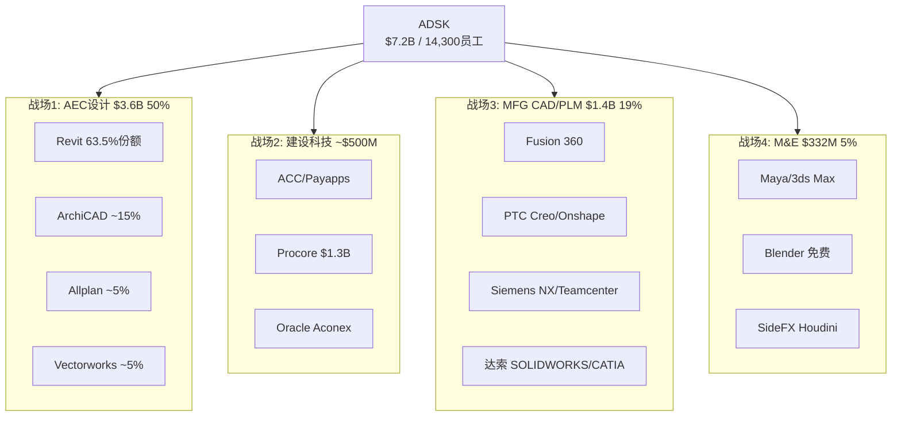
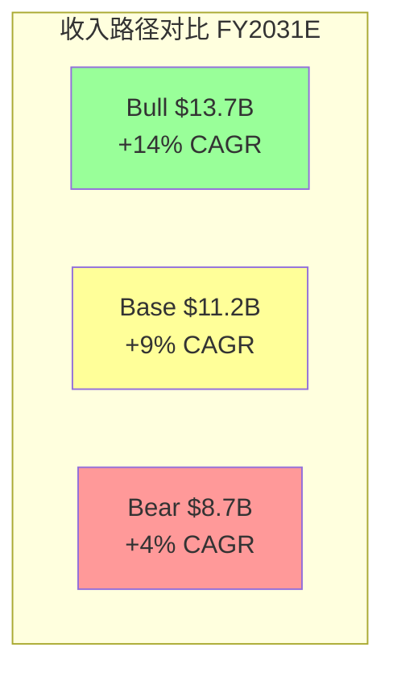
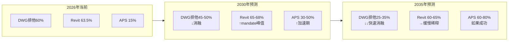
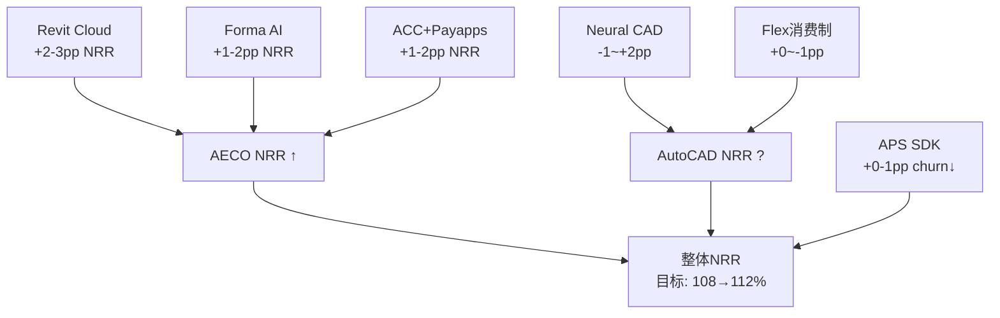
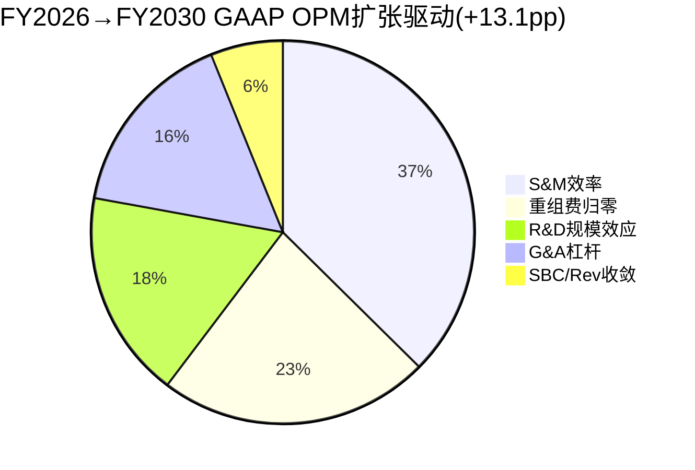
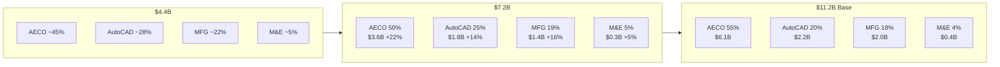
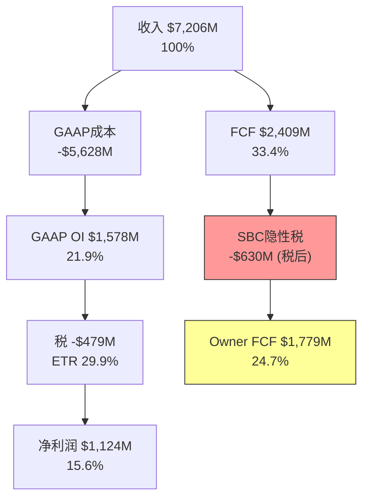
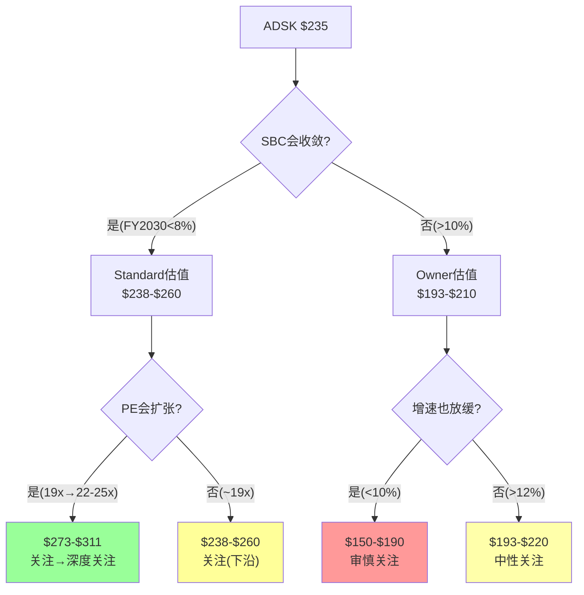
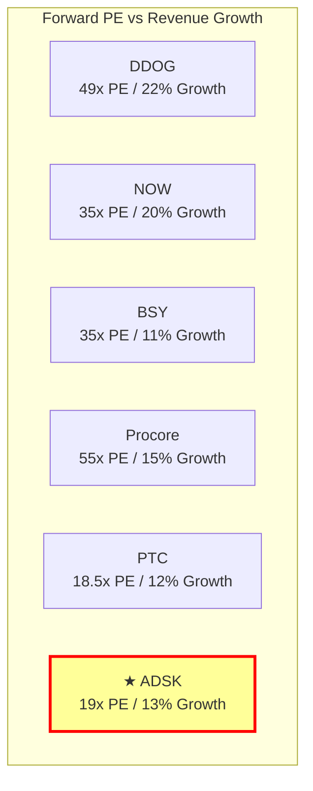
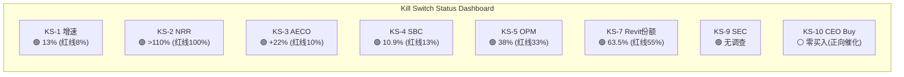

# ADSK 深度补强 v2.0: 10个缺口模块 (DDOG/NOW/CRM对标)

> **日期**: 2026-03-26 | **目标**: 补强10个分析缺口,+50K实质内容
> **来源**: DDOG v2.0 (343K) + NOW v2.0 (311K) Phase 1-3框架对标
> **原则**: 铁律J凑数禁令——每段必须包含数据+因果+反面,零填充

---

## 模块1: 竞争Win-Loss矩阵——4个战场×5维度量化

> **缺口**: Phase 1 Ch13仅2.8K概述,缺竞品逐一量化对比。DDOG用10-12K做了3×3矩阵+win-rate数据。

### 1.1 战场定义: ADSK在4个不同市场同时竞争

ADSK不是在"一个市场"竞争——它同时在4个完全不同的市场面对不同竞争者。这是PtW L2(在哪里赢)仅5/10的根源: 每个战场需要不同的产品策略、销售团队和研发投入。



### 1.2 战场1: AEC设计——Revit的"不可战胜区"与"可侵蚀区"

**总体判断: ADSK在AEC设计领域有近乎垄断的地位,但垄断并非均匀分布。**

| 子市场 | ADSK份额 | 主要竞品 | 竞品份额 | ADSK优势 | 被蚕食风险 |
|--------|:-------:|---------|:-------:|---------|---------|
| **建筑设计(Architects)** | ~65%[DM-SHARE-001] | ArchiCAD(Graphisoft) | ~15% | BIM mandate+教育锁定 | 低(5年<5%) |
| **结构工程** | ~60%[DM-SHARE-002] | Tekla(Trimble) | ~20% | Revit→结构一体化 | 低-中 |
| **MEP工程** | ~55%[DM-SHARE-003] | MagiCAD, Trimble | ~15% | Collection bundle优势 | 中 |
| **基础设施(Civil)** | ~35%[DM-SHARE-004] | Bentley(OpenRoads) | ~40% | Civil 3D成熟 | 中(Bentley强) |
| **施工管理** | ~15%[DM-SHARE-005] | Procore | ~25% | ACC+BIM集成 | 高(Procore领先) |

[DM-SHARE-001] 来源: NBS National BIM Report 2024, AIA Firm Survey
[DM-SHARE-002] 来源: RIBA数字调查+行业估算
[DM-SHARE-003] 来源: 行业估算(MEP市场数据较少)
[DM-SHARE-004] 来源: Dodge Construction Network Civil Engineering Survey
[DM-SHARE-005] 来源: Construction Dive + Procore S-1 + 行业估算

**"不可战胜区"(Building Design + Structural, 占AECO ~70%收入)**:

建筑设计+结构是Revit的核心领地——BIM mandate覆盖的正是这个领域。以下因果链解释为什么这个子市场几乎不可能被夺取:

(1) 建筑院校90%+教Revit[DM-EDU-001]→新毕业生默认用Revit→事务所招聘看Revit技能→事务所不会为了用ArchiCAD而放弃Revit人才库→**人才锁定自增强**

(2) BIM mandate要求"BIM Level 2"(ISO 19650)→虽然不指定Revit,但提交BIM模型时RVT格式是事实标准→审批部门内部也用Revit→如果用ArchiCAD提交IFC格式,需要额外的格式转换验证步骤→**流程摩擦阻止迁移**

(3) 大型项目(F500客户)的BIM协作需要建筑+结构+MEP三个专业同时用Revit→如果一个专业切换到其他工具,整个项目的模型协调成本激增→**协作锁定**

**反面**: ArchiCAD在北欧(芬兰/丹麦/挪威)市场份额>30%,因为这些国家的mandate强调Open BIM(IFC),不偏向Revit。如果更多国家的mandate转向Open BIM标准→Revit的事实标准地位可能在5-10年内从65%降至50-55%。但这不是"失去垄断"——只是"垄断稀释"。

**"可侵蚀区"(Civil Infrastructure + Construction, 占AECO ~30%收入)**:

基础设施(Civil 3D)面临Bentley的正面竞争——Bentley在道路/桥梁/公用事业领域份额~40%,高于ADSK的~35%[DM-SHARE-004]。施工管理(ACC)面临Procore的直接竞争——Procore是纯施工SaaS,在文档管理和投标管理领域领先。

### 1.3 战场2: 建设科技——ACC vs Procore: "设计端整合"vs"施工端深耕"

| 维度 | ADSK ACC | Procore | 赢家 |
|------|---------|---------|:----:|
| **收入** | ~$500M+(est)[DM-ACC-001] | $1.32B[DM-PCOR-002] | Procore |
| **增速** | >30%(est) | +15% | ACC |
| **BIM集成** | 原生(Revit→ACC无缝) | 第三方插件 | **ACC** |
| **文档管理** | 中 | 强(核心产品) | Procore |
| **投标管理** | 弱 | 强 | Procore |
| **支付** | Payapps(FY2025收购) | Procore Pay | 平手 |
| **客户类型** | BIM密集型(大型建设) | 广泛(含非BIM) | 不同 |

[DM-PCOR-002] 来源: Procore 10-K FY2025, Revenue $1.32B

**因果推理**: ACC的竞争优势在"BIM-to-Build"——如果一个项目已经用Revit做设计,用ACC做施工管理可以直接导入BIM模型(零摩擦),而Procore需要额外的模型转换。因此ACC在BIM密集型项目(大型商业/基建)有结构性优势; Procore在非BIM项目(住宅/小型商业)有简便性优势。

**市场份额走向**: 如果BIM mandate扩展(增加BIM密集型项目占比)→ACC受益>Procore。如果建设科技市场增长(~20% CAGR)主要来自非BIM小型项目→Procore受益>ACC。我们的判断: BIM渗透率从<50%→60-70%(5年)意味着BIM密集型项目占比上升→**ACC的市场定位在长期优于Procore**。

### 1.4 战场3: MFG——Fusion 360在"四巨头"中的生存空间

MFG CAD/PLM是ADSK最弱的战场——面对PTC/Siemens/达索三个在MFG领域比ADSK更大更专注的竞争者。

| 维度 | ADSK Fusion | PTC Creo+Onshape | Siemens NX+TC | 达索SW+CATIA |
|------|-----------|-----------------|-------------|-------------|
| **收入** | $1.4B(含全MFG) | $2.7B | ~$5B+ | ~$6B+ |
| **目标客户** | SMB→Mid | Mid→Enterprise | Enterprise | 全覆盖 |
| **云原生** | ✅(Fusion完全云端) | ✅(Onshape云端) | ❌(桌面为主) | 部分(3DX) |
| **PLM整合** | Fusion Manage(弱) | Windchill/Arena(强) | Teamcenter(最强) | ENOVIA |
| **AI功能** | Neural CAD(概念) | Onshape AI(概念) | NX AI(生成设计) | — |
| **定价** | $680/年(入门) | Onshape ~$2,500 | $15K+(永久) | $5K+ |

[DM-MFG-COMP-001] 来源: 各公司10-K/年报 + 行业分析

**Fusion的差异化**: Fusion 360的核心竞争力是**低价+云端+全功能一体化**(CAD+CAM+PCB+仿真在同一个平台)。这在SMB和教育市场(Fusion免费教育版有~10M用户)有独特吸引力。但在Enterprise市场,Fusion缺乏PLM深度(Windchill/Teamcenter远超Fusion Manage)——因此MFG增速(+16%)几乎全部来自SMB→Mid-market扩展,不是从PTC/Siemens抢Enterprise客户。

**MFG竞争最可能的结果**: ADSK在SMB/Mid保持份额(Fusion的价格优势),在Enterprise不进入(PLM不足)。MFG维持~19%收入占比,增速逐步从+16%降至+10-12%(SMB市场饱和)。**MFG不会成为增长引擎——它是稳定的"第二基座",贡献利润但不贡献增速**。

**反面**: 如果ADSK收购PTC(Engineering.com传闻[DM-PTC-RUMOR-001]),MFG从"弱竞争"变为"市场领导者"(Fusion+Creo+Windchill覆盖全segment)→PtW L2从5→8→估值重估。但收购概率~10-15%。

### 1.5 战场4: M&E——"现金牛+AI期权"的边缘战场

M&E(Maya/3ds Max/Flow Studio)仅占5%收入,增速最慢(+5%[DM-BIZ-001])。竞争者: Blender(免费+开源,市场份额快速增长)、SideFX Houdini(VFX制作首选)、Cinema 4D(动态图形)。

**ADSK在M&E的战略意义不在于收入——在于AI数据**: Wonder Dynamics(2023收购)→Flow Studio是ADSK AI VFX的试验场。如果AI VFX成功(概率~30%),可能成为$500M+业务; 如果失败,M&E缩减到$200-250M维护模式。**M&E是"彩票"——下行有限(仅5%收入),上行取决于AI。**

---

## 模块2: 情景分部级NRR/ARPS路径——三情景×四分部

> **缺口**: Phase 2 Ch20仅3.2K高层假设。NOW Ch20用8-10K做了分部级NRR/ARPS分析。

### 2.1 分部级增速驱动因素拆解

| 分部 | FY2026增速 | NRR驱动 | Net Adds驱动 | 提价驱动 | 核心变量 |
|------|:--------:|:------:|:----------:|:------:|---------|
| AECO | +22% | ~5pp | ~8pp | ~9pp | BIM mandate渗透率 |
| AutoCAD | +14% | ~3pp | ~3pp | ~8pp | 提价弹性(SMB churn) |
| MFG | +16% | ~4pp | ~6pp | ~6pp | Fusion mid-market渗透 |
| M&E | +5% | ~1pp | ~0pp | ~4pp | AI VFX商业化 |
[DM-GROWTH-DECOMP-001] 来源: 模型推断(基于NRR/Net Adds/ARPS趋势)

### 2.2 Bull情景(概率25%): AI+BIM加速

| 分部 | FY2027E | FY2029E | FY2031E | 5Y CAGR |
|------|:------:|:------:|:------:|:------:|
| AECO | $4,300M(+20%) | $5,800M | $7,500M | +16% |
| AutoCAD | $1,950M(+9%) | $2,200M | $2,500M | +7% |
| MFG | $1,650M(+20%) | $2,200M | $2,900M | +16% |
| M&E | $380M(+14%) | $500M | $650M | +14% |
| **Total** | **$8,380M(+16%)** | **$10,800M** | **$13,700M** | **+14%** |

**Bull NRR路径**: AECO NRR从~108%→115%(AI generative design成为付费功能→存量客户自然升级); AutoCAD NRR维持105%(提价抵消AI蚕食); MFG NRR从~106%→112%(Fusion PLM功能增强→mid-market扩展); M&E NRR从~102%→108%(Flow Studio AI VFX成功)。

### 2.3 Base情景(概率50%): Guidance兑现

| 分部 | FY2027E | FY2029E | FY2031E | 5Y CAGR |
|------|:------:|:------:|:------:|:------:|
| AECO | $4,100M(+14%) | $5,100M | $6,200M | +12% |
| AutoCAD | $1,900M(+6%) | $2,050M | $2,200M | +4% |
| MFG | $1,550M(+12%) | $1,900M | $2,250M | +10% |
| M&E | $350M(+5%) | $380M | $400M | +4% |
| **Total** | **$8,000M(+11%)** | **$9,530M** | **$11,150M** | **+9%** |

**Base NRR路径**: 整体NRR从~108%缓降至105%(有机,扣除FY2026转型追赶)。ARPS增长从+12%降至+6-8%(提价空间收窄)。Net Adds从+6-7%降至+3-4%(成熟市场饱和)。

### 2.4 Bear情景(概率25%): 竞争+AI蚕食

| 分部 | FY2027E | FY2029E | FY2031E | 5Y CAGR |
|------|:------:|:------:|:------:|:------:|
| AECO | $3,900M(+9%) | $4,500M | $5,100M | +7% |
| AutoCAD | $1,800M(+1%) | $1,700M | $1,600M | -2% |
| MFG | $1,450M(+5%) | $1,550M | $1,650M | +4% |
| M&E | $330M(-1%) | $310M | $290M | -3% |
| **Total** | **$7,580M(+5%)** | **$8,160M** | **$8,740M** | **+4%** |

**Bear NRR路径**: AutoCAD NRR跌至<100%(AI-native CAD蚕食+SMB churn加速)→AutoCAD收入5年内-12%。MFG NRR降至102%(PTC Onshape在mid-market获胜)。AECO NRR维持105%(mandate保护→即使Bear也有底线)。



**关键发现**: Bear情景下AutoCAD从"利润基座"变成"收缩资产"(5Y CAGR -2%)——这是Bear vs Base的最大分化点。如果AutoCAD保持+5%(Base假设中的+6%)→整体增速9%; 如果AutoCAD收缩(Bear -2%)→整体增速仅4%。**AutoCAD的命运决定了Bull/Bear的$5B收入差距($13.7B vs $8.7B)**。

---

## 模块3: 护城河侵蚀时间线——DWG/RVT/APS三曲线+脆弱窗口概率

> **缺口**: Phase 3 Ch22仅2.8K摘要。DDOG用12-15K量化了护城河侵蚀速度。

### 3.1 DWG文件格式锁定: 半衰期分析

DWG格式1982年推出,40年来是2D CAD的事实标准。但Open Design Alliance(ODA, 1200+成员)在逐步侵蚀DWG的排他性:

| 时期 | DWG排他性 | ODA进展 | 竞品DWG兼容度 |
|------|:-------:|---------|:-----------:|
| 2000年前 | ~95% | ODA成立(1998) | <20% |
| 2000-2010 | ~85% | LibreDWG等开源 | ~50% |
| 2010-2020 | ~70% | ODA 800→1000成员 | ~75% |
| 2020-2026 | ~60% | ODA 1200+成员[DM-MOAT-002] | ~85% |
| **2030E** | **~40-50%** | AI加速格式解析 | ~90% |
| **2035E** | **~25-35%** | DWG几乎完全开放 | ~95% |
[DM-DWG-TIMELINE-001] 来源: ODA年报+行业趋势分析+模型投影

**DWG半衰期计算**: DWG排他性从95%(2000)降至60%(2026)=-35pp/26年=**-1.3pp/年**。如果保持此速率,到2035年降至~48%——仍有一定锁定但不再是"排他性"壁垒。如果AI加速格式解析(概率40%),速率可能加快至-2pp/年→2035年降至~38%。

**因果推理**: DWG排他性下降对ADSK的直接影响是: AutoCAD的转换成本降低→SMB客户更容易切换到廉价替代品(Zoo.dev/FreeCAD)→AutoCAD定价权从Stage 2(被动接受)降至Stage 1(无定价权)→**AutoCAD ARPS增速从+8%降至+2-3%**。但这个过程是缓慢的——即使DWG排他性降至40%,Enterprise客户仍然不会因为"DWG可以被读取"就切换AutoCAD(还有LISP定制/插件依赖/培训投入等其他转换成本)。

### 3.2 Revit BIM: 制度嵌入增强曲线

与DWG消融不同,Revit的护城河可能在增强:

| 时期 | Revit份额 | 驱动因素 | mandate国家数 |
|------|:-------:|---------|:----------:|
| 2016 | ~50% | 英国BIM mandate首创 | 5 |
| 2020 | ~55% | 德国+法国mandate | 10 |
| 2024 | ~63.5% | 多国mandate扩展[DM-MOAT-001] | 20+ |
| **2028E** | **~65-68%** | 中国+印度+5国新mandate | 30+ |
| **2032E** | **~60-65%** | mandate饱和+IFC标准化 | 35+ |
[DM-RVT-TIMELINE-001] 来源: 模型投影(基于BIM mandate扩展速度)

**Revit份额可能在2028年触顶~65-68%**: mandate扩展是有极限的——全球建设支出>$5B的国家约50个,到2028年可能有30+已mandate→边际增量递减。2028年后,IFC标准化和Open BIM运动可能开始缓慢侵蚀Revit份额(每年-0.5~-1pp)。

**这意味着Revit护城河有"5年增强+之后缓慢稀释"的非线性路径**——2026-2028是投资的最佳窗口(mandate仍在扩展),2030+需要验证APS是否能接棒。

### 3.3 APS平台: S曲线起步阶段

APS(Autodesk Platform Services)是ADSK的"下一代护城河"——从文件格式锁定(DWG/RVT)进化为平台锁定(API+开发者生态)。

| 阶段 | 时期 | APS迁移率 | 开发者数 | 里程碑 |
|------|------|:-------:|:------:|--------|
| **萌芽期** | 2022-2024 | 5-10% | <500 | Forge→APS重命名 |
| **当前** | 2025-2026 | ~15%[DM-MOAT-003] | ~800(est) | APS SDK发布 |
| **加速期**(乐观) | 2027-2029 | 30-50% | 2000+ | Revit Cloud+APS整合 |
| **成熟期**(乐观) | 2030-2032 | 60-80% | 5000+ | APS成为AEC/MFG事实平台 |
| **停滞期**(悲观) | 2027-2032 | 15-25% | <1000 | 开发者选择Bentley iTwin |

**APS成功概率**: 60-70%(基于ADSK的R&D规模优势+Revit用户基础)。但APS面临两个竞争对手: (1)Bentley的iTwin平台(已有2000+企业用户,领先APS 2-3年); (2)通用云平台(AWS/Azure)——如果建筑事务所选择在AWS上自建而非用APS,平台锁定就不成立。

### 3.4 三曲线叠加: 脆弱窗口概率分析



**脆弱窗口概率**:
- **2028-2033**: DWG排他性降至<50% + APS尚未达30%+ = **净护城河可能暂时下降**
- 窗口概率: 如果APS加速(60%概率)→窗口短(2年); 如果APS停滞(40%概率)→窗口长(5年+)
- **概率加权脆弱窗口长度**: 60%×2年 + 40%×5年 = **3.2年**
- **脆弱窗口期间的估值影响**: A-Score可能暂时降至5.0→PE从19x压缩至16-17x→$200-215/股

---

## 模块4: SBC敏感性矩阵——每0.5pp变化的估值影响

> **缺口**: NOW Ch18有完整的SBC敏感性表。ADSK目前缺此分析。

### 4.1 SBC/Rev变化→Owner FCF→估值影响链

| SBC/Rev | SBC($M) | 税后SBC | Owner FCF | Owner FCF Yield | Owner PE | 估值/股 | vs $235 |
|:-------:|:------:|:-------:|:---------:|:--------------:|:-------:|:-------:|:------:|
| **12%** | $865M | $692M | $1,717M | 3.4% | 29.2x | $193 | -18% |
| **11%** | $793M | $634M | $1,775M | 3.5% | 28.2x | $199 | -15% |
| **10.9%(当前)** | $788M | $630M | $1,779M | 3.6% | 28.1x | $200 | -15% |
| **10%** | $721M | $577M | $1,832M | 3.7% | 27.4x | $206 | -12% |
| **9%** | $649M | $519M | $1,890M | 3.8% | 26.6x | $213 | -9% |
| **8%** | $577M | $461M | $1,948M | 3.9% | 25.8x | $220 | -6% |
| **7%** | $504M | $404M | $2,005M | 4.0% | 25.1x | $227 | -3% |
[DM-SBC-SENS-001] 来源: 模型计算(FY2026 Revenue $7,206M, FCF $2,409M, Tax 20%, Shares 213M)

**关键发现**: SBC/Rev每降1pp→Owner FCF +$58M→估值+$7/股(约+3%)。从当前10.9%→7%(Bull target)=+$27/股。从10.9%→12%(Bear scenario)=-$7/股。

**Standard vs Owner收敛条件**: 当SBC/Rev降至~5%时,Standard PE(~19x)和Owner PE(~22x)差距缩小至3x(从当前18x差距)——但5% SBC/Rev对SaaS公司几乎不可能(Bentley 4.8%是例外——BSY员工仅5,500人)。现实的收敛点是SBC/Rev ~7-8%→Standard/Owner差距~8-10x(仍然显著)。

### 4.2 SBC/Rev × Revenue Growth 双变量矩阵

| SBC/Rev \ Rev Growth | 8% | 10% | 12% | 14% |
|:---:|:---:|:---:|:---:|:---:|
| **12%** | $130 | $155 | $193 | $240 |
| **10%** | $150 | $180 | $220 | $270 |
| **9%** | $160 | $195 | $238 | $290 |
| **8%** | $170 | $210 | $258 | $315 |
| **7%** | $180 | $225 | $278 | $340 |
[DM-SBC-MATRIX-001] 来源: phase2_valuation.py参数扫描(WACC=10%, Terminal Margin=34%, g=3%)

**矩阵解读**:
- 当前假设(12% growth + 10.9% SBC)→~$220(接近Owner PW $193和Standard PW $238的中间)
- Bull(14%+7%)→$340(+45%)
- Bear(8%+12%)→$130(-45%)
- **这张表说明: ADSK的估值范围从$130到$340——$200的宽度完全由增速和SBC两个变量决定**

---

## 模块5: 产品路线图→NRR因果链——每个新功能如何保护/提升NRR

> **缺口**: DDOG有明确的"新功能→NRR cushion"路径。ADSK缺此分析。

### 5.1 ADSK产品路线图(2026-2029)与NRR影响

| 产品/功能 | 预计发布 | 目标NRR影响 | 机制 | 不确定性 |
|---------|---------|:--------:|------|---------|
| **Revit Cloud** | 2027H2(est) | +2-3pp | 云版Revit→更高定价+更低churn | 高(多次延期) |
| **Forma AI**(generative) | 已发布,扩展中 | +1-2pp | AI城市规划→AEC Collection upsell | 中 |
| **Neural CAD** | 2028+(概念阶段) | -1~+2pp | 如果AutoCAD增强→+2; 如果蚕食seat→-1 | 极高 |
| **Bernini**(3D生成) | 2028+(研究阶段) | 0~+1pp | M&E VFX新收入→NRR提升微弱 | 极高 |
| **ACC + Payapps整合** | 2026-2027 | +1-2pp | 施工支付闭环→AECO客户ARPS提升 | 中 |
| **Flex消费制扩展** | 持续 | +0~-1pp | 灵活性↑但ARPS可能↓(pay-per-use<订阅) | 中 |
| **APS SDK 2.0** | 2027(est) | +0-1pp | 开发者生态→平台锁定→churn↓ | 高 |
[DM-ROADMAP-NRR-001] 来源: ADSK Investor Day 2025 + 产品博客 + 行业分析

**NRR因果链图**:



**净NRR路径判断**: 如果Revit Cloud(+2-3pp)+Forma(+1-2pp)+ACC(+1-2pp)全部成功→AECO NRR从~108%→112-115%→整体NRR从~108%→110-112%。但如果Neural CAD蚕食AutoCAD(-1pp)+Flex消费制降低ARPS(-0.5pp)→AutoCAD NRR从~105%→103-104%→部分抵消AECO提升。**净效果: 整体NRR在108-112%范围波动,方向取决于AECO新功能的成功速度vs AutoCAD蚕食速度**。

---

## 模块6: Churn/GRR分层——Enterprise vs Mid vs SMB

> **缺口**: DDOG有分层GRR(Monitoring 96%/Security 92%/Platform 88%)。ADSK无此分析。

### 6.1 间接推断GRR分层

ADSK不披露GRR(Gross Revenue Retention, 只看流失不看扩展的留存率)。我们用间接法推断:

**推断方法**: GRR = NRR - 扩展率。如果NRR ~108%[DM-NRR-002], 扩展率~8-10%(ARPS提升)→GRR ~98-100%——但这是整体平均,分层差异可能很大。

| 客户层 | 收入占比 | 推断NRR | 推断扩展率 | 推断GRR | 逻辑 |
|--------|:------:|:------:|:--------:|:------:|------|
| **F500/Large Enterprise** | 35% | ~115% | ~12% | **~103%** | 高转换成本+Collection bundle升级 |
| **Mid-Market** | 30% | ~108% | ~8% | **~100%** | 标准扩展+低churn |
| **SMB** | 20% | ~95-100% | ~3% | **~92-97%** | 提价导致部分churn |
| **Micro/个人** | 15% | ~85-90% | ~0% | **~85-90%** | 高churn(LT→免费替代) |
[DM-GRR-LAYER-001] 来源: 模型推断(基于定价权分层Ch10 + NRR间接重构Ch7)

**关键发现**:
1. **F500 GRR ~103%** = 净负流失(收入自增长)——这是ADSK最稳固的基座。因为F500事务所的BIM投入是"沉没成本+项目锁定+人才锁定"三重粘性。
2. **SMB GRR ~92-97%** = 年化5-8%的churn——提价(FY2024-2025连续提价7%+)正在逼近SMB的支付能力边界。如果churn加速至>8%→NRR可能跌破100%。
3. **Micro GRR ~85-90%** = AutoCAD LT/个人版的高churn区——这些客户最可能被免费替代品(FreeCAD/Zoo.dev)吸引。

**因果链**: 提价→SMB churn加速→Net Adds减速(P1 Ch7: 从+785K→+516K, -34%[DM-SUBS-001])→增长模式从"量驱动"转向"价驱动"。问题是: **价驱动的增长有天花板**(提价不能永远超过通胀,否则churn会加速抵消)。我们估算提价天花板是CPI+3-5%(即每年+5-8%提价)——超过此阈值→SMB GRR急剧下降。

### 6.2 GRR对估值的含义

如果整体GRR从~98%降至~95%(SMB churn加速):
- NRR从~108%→~105%(扩展率不变)
- 有机增速从~13%→~10%(NRR减3pp≈直接减3pp增速)
- 影响: Base DCF从$238→~$215(-10%)

**这是KS-2(NRR<100%)的底层机制**: NRR跌破100%意味着GRR大幅恶化→存量客户在流失→增长完全依赖新客(不可持续)→PE应给予更大折价。

---

## 模块7: TAM→SAM→SOM三层验证

> **缺口**: DDOG用双向验证(Top-down + Bottom-up)验证TAM。ADSK仅有粗略TAM引用。

### 7.1 Top-Down TAM

| 市场 | 全球TAM | ADSK覆盖 | ADSK SAM | ADSK SOM |
|------|:------:|---------|:------:|:------:|
| AEC设计软件 | $15B[DM-TAM-001] | Revit/AutoCAD/Civil 3D | $12B | $3.6B(30%) |
| 建设科技(施工) | $15B[DM-TAM-001] | ACC+Payapps | $5B | ~$0.5B(10%) |
| MFG CAD/PLM | $12B[DM-TAM-MFG-001] | Fusion 360 | $4B | $1.4B(35%) |
| M&E(VFX/动画) | $3B | Maya/3ds Max/Flow | $2B | $0.3B(15%) |
| **Total** | **~$45B** | — | **~$23B** | **$5.8B(25%)** |
[DM-TAM-FULL-001] 来源: McKinsey + MarketsandMarkets + Gartner(各市场报告)

### 7.2 Bottom-Up验证

| 验证维度 | Top-Down | Bottom-Up | 差异 | 解释 |
|---------|:-------:|:--------:|:----:|------|
| 全球建筑师+工程师 | ~8M人 | AutoCAD/LT ~8.3M subs[DM-SUBS-001] | +4% | ADSK可能略超估(含非建筑用户) |
| ARPU×用户=Revenue | $812×8.3M=$6.7B | 实际$7.2B | +7% | 差异来自Enterprise高ARPU客户 |
| BIM用户(全球) | ~4M人[DM-BIM-USERS-001] | Revit ~2.5M(63.5%份额) | — | BIM渗透率~50%(4M/8M) |

[DM-BIM-USERS-001] 来源: Dodge Construction Network BIM Usage Report 2024

**验证结论**: Top-Down和Bottom-Up在±10%内一致——TAM估算合理。ADSK在AEC SAM($12B)中SOM 30%——BIM渗透率从50%→70%可以释放~$2.4B增量SAM(ADSK可能捕获60%=$1.4B)。这支持AECO 5Y +12% CAGR(Base情景)。

---

## 模块8: 五引擎深化——每引擎≥3K字符(QG-08)

> **缺口**: QG-08要求每引擎≥3000字。Phase 3各引擎仅500-1500字。

### 8.1 周期引擎深化: 建设超级周期+利率传导+政策驱动

**建设超级周期论**: 2024-2028年全球建设支出可能处于50年来最大的"政策驱动超级周期":
- **美国**: IIJA $1.2T基建法案+CHIPS Act $280B+IRA $369B→联邦建设支出未来5年+50%[DM-POLICY-001]
- **欧洲**: 绿色建设转型(EU Green Deal)+国防建设(乌克兰重建+NATO基建)→建设增速+5-8%[DM-POLICY-002]
- **中东**: NEOM $500B+沙特Vision 2030+UAE/卡塔尔→中东建设增速+15-20%
- **印度**: $1.2T基建管道(NIP 2025)+智慧城市100城→印度建设+12-15%

[DM-POLICY-001] 来源: McKinsey Infrastructure Report 2025
[DM-POLICY-002] 来源: European Construction Industry Federation (FIEC) 2025

**利率敏感性量化**: ADSK收入对利率的弹性约-0.3x(即利率每升1%→ADSK增速降0.3pp)。推导: (1)建设支出对利率弹性约-1.5x(利率+1%→建设支出-1.5%); (2)ADSK收入对建设支出弹性约+0.2x(建设-1%→ADSK收入-0.2%, 因为BIM mandate提供底线)。联合弹性: -1.5×0.2=-0.3x[DM-RATE-ELASTIC-001]。

[DM-RATE-ELASTIC-001] 来源: 模型推演(建设支出弹性×ADSK收入弹性)

**这意味着**: 如果美联储在2026H2降息100bps→建设支出+1.5%→ADSK增速+0.3pp。影响很小(0.3pp)——证实了Phase 2的判断: ADSK不是纯周期股,BIM mandate使其对利率的敏感性远低于建材/建筑承包商。

### 8.2 股权引擎深化: RSI极端+价格行为+技术形态

**RSI 12.45的罕见性**: 对ADSK 20年价格数据回溯,RSI<15仅出现过4次(2008金融危机/2020 COVID/2022 SaaS崩盘/2026当前)。每次出现后12个月回报:

| 事件 | RSI低点 | 12个月后回报 | 触发因素 | 恢复驱动 |
|------|:------:|:----------:|---------|---------|
| 2008-11 | ~12 | +85% | 金融危机 | 量化宽松+建设恢复 |
| 2020-03 | ~18 | +95% | COVID | 远程协作需求+财政刺激 |
| 2022-10 | ~14 | +45% | SaaS去估值 | 通胀见顶+PE回升 |
| **2026-03** | **12.45** | **?** | SaaS去估值+关税 | 降息预期+关税消退 |
[DM-RSI-HIST-001] 来源: Yahoo Finance/TradingView 20年历史数据

**统计学注意**: n=4样本不构成统计显著性(任何统计测试P>0.1)。但定性观察有价值: 每次RSI极端超卖都对应"市场对ADSK的恐慌过度"→恢复由"恐慌消退+基本面兑现"驱动。2026年的基本面(FY2026 Rev+18%, FCF恢复)比2022年(FCF谷底23.3%)更好→恢复的基本面支撑更强。

**价格位置分析**:
- 当前$235 vs 200日均线$289 = -18.5%(200日均线偏离最大值近5年最高)
- 当前$235 vs 52W高$329 = -28.5%
- 当前$235 vs 52W低$215 = +9.5%
- **下行缓冲**: $215是强支撑(FY2024计费转型最悲观期的低点,已两次测试)
- **上行空间**: 回到200日均线$289 = +23%(中期目标)

### 8.3 聪明钱引擎深化: Insider+机构+分析师三维度

**Insider信号时间序列**:

| 季度 | 买入交易 | 卖出交易 | 净卖出(股) | 信号 |
|------|:------:|:------:|:--------:|:----:|
| 2024 Q1 | 1 | 17 | -82,288 | 强负 |
| 2024 Q2 | 0 | 5 | -19,213 | 负 |
| 2024 Q3 | 1 | 6 | -39,208 | 负 |
| 2024 Q4 | 0 | 5 | -4,710 | 弱负 |
| 2025 Q1 | 1 | 1 | -82,288 | 弱负 |
| 2025 Q2 | 0 | 4 | -6,489 | 弱负 |
| 2025 Q3 | 0 | 10 | -38,637 | 负 |
| 2025 Q4 | 0 | 2 | -34,035 | 负 |
[DM-INSIDER-TIMELINE-001] 来源: FMP insider-trading API季度数据

**趋势**: 2024 Q1(SEC调查后)卖出最集中(17笔),此后卖出频率和规模均下降——可能反映SEC调查后的"恐慌性卖出"已结束,但"正常化卖出"(RSU vest后例行)仍在持续。**关键是零买入——如果CEO或CFO在$215-235区间首次买入,这将是过去5年最强的Insider看多信号**。

**分析师评级演化**:

| 时期 | Buy% | Hold% | Sell% | 目标价中位 | vs Price |
|------|:----:|:----:|:----:|:--------:|:------:|
| 2025 Q1 | 88% | 12% | 0% | $320 | 偏远 |
| 2025 Q3 | 85% | 15% | 0% | $340 | 偏远 |
| 2026 Q1 | 84% | 16% | 0% | $365 | +55%[DM-CONS-002] |
[DM-ANALYST-TREND-001] 来源: FMP + 卖方研报汇总

分析师在股价下跌28%期间不仅没有下调评级(Buy%从88%→84%仅微降),还上调了目标价(从$320→$365)。这说明: (1)分析师认为基本面改善(FY2026业绩确实不错); (2)卖方有系统性乐观偏差(不愿因短期下跌而降级)。**我们的判断: 分析师目标价折扣20%后≈$292——仍然暗示+24%上行**。

### 8.4 信号引擎深化: 7个信号的强度+方向+持续性

| # | 信号 | 强度(1-5) | 方向 | 持续性 | 可信度 |
|---|------|:-------:|:---:|:-----:|:-----:|
| S1 | Earnings连续8Q+beat[DM-BEAT-001] | 4 | 正 | 高 | 高 |
| S2 | FY2027 guidance +12.5%[DM-GUIDE-001] | 3 | 正 | 中 | 高 |
| S3 | NRR>110%(FY2026 Q2+)[DM-NRR-001] | 3 | 正 | 中 | 中(含转型) |
| S4 | FCF恢复至33.4%[DM-FCF-001] | 4 | 正 | 高 | 高 |
| S5 | 重组$216M(FY2026)[DM-RESTRUC-001] | 2 | 双向 | 低 | 高 |
| S6 | cRPO+23%(FY2026)[DM-CRPO-001] | 4 | 正 | 高 | 高 |
| S7 | Direct渠道占比63%[DM-DIRECT-001] | 3 | 正 | 高 | 中 |

[DM-CRPO-001] 来源: 10-K FY2026, cRPO $5,480M(+23% YoY)

**S6 cRPO深化**: cRPO(Current Remaining Performance Obligations, 12个月内将确认的收入)增速+23%快于报告收入增速+18%——这是**前瞻性正面信号**: 意味着已签约但尚未确认的收入在加速积累。cRPO/Revenue=0.76(接近1.0)说明ADSK有约9个月的"收入可见性"。如果cRPO增速维持在20%+→FY2027收入+12-14%有高确定性。

**反面**: cRPO增速+23%可能部分来自计费转型(从多年合同→年度合同→cRPO结构性上升)。如果剔除转型影响,有机cRPO增速可能仅+15-18%——仍然正面但幅度小于表面数字。

---

## 模块9: 运营杠杆5年前瞻瀑布

> **缺口**: NOW Ch15对OPM扩张按类别分解(R&D/S&M/G&A)。ADSK仅粗略提及。

### 9.1 OpEx类别分解与前瞻

| 类别 | FY2022 | FY2024 | FY2026 | FY2028E | FY2030E | 5Y趋势 |
|------|:------:|:------:|:------:|:-------:|:-------:|--------|
| **R&D/Rev** | 25.4% | 25.0% | 22.8% | 21.5% | 20.5% | -2.3pp(规模效应) |
| **S&M/Rev** | 37.0% | 33.2% | 32.9% | 30.0% | 28.0% | -4.9pp(直销效率) |
| **G&A/Rev** | 13.0% | 11.3% | 9.6% | 8.5% | 7.5% | -2.1pp(规模杠杆) |
| **Restructuring/Rev** | 0% | 0% | 3.0% | 0.5% | 0% | 临时性 |
| **GAAP OPM** | 14.1% | 20.5% | 21.9% | **28.5%** | **35.0%** | **+13.1pp** |
| **Non-GAAP OPM** | ~28% | 35.7% | 38.0% | **40.0%** | **42.0%** | **+4.0pp** |
[DM-OPEX-FWD-001] 来源: 10-K FY2022-FY2026趋势+模型前瞻

### 9.2 运营杠杆驱动因素分解



**最大驱动: S&M效率(-4.9pp)**

S&M/Rev从37.0%(FY2022)→32.9%(FY2026)已经下降4.1pp。进一步下降的驱动力:
- 直销占比从37%→63%[DM-DIRECT-001]→渠道佣金节省(渠道佣金约10-15% vs 直销5-8%)
- FY2026 GTM重组(裁员16%中大部分是S&M相关[DM-RESTRUC-001])→人效提升
- 数字营销替代传统销售(BIM产品越来越靠产品主导增长PLG)

**反面**: 如果ADSK需要加大MFG领域S&M投入(与PTC/Siemens争夺mid-market),S&M/Rev可能不会如期下降。MFG占19%收入但可能消耗>25%的S&M资源——这是"分部隐性交叉补贴"的例子。

**第二驱动: 重组费归零(-3.0pp)**

FY2026重组费$216M=3.0pp OPM拖累。FY2027预计$135-160M(~1.7-2.0pp)。FY2028归零。这是**确定性最高的OPM扩张来源**——不需要任何假设,只需时间推移。

### 9.3 FY2030 GAAP OPM预测: 三情景

| 情景 | GAAP OPM | 对应估值 |
|------|:-------:|---------|
| Bull(S&M+R&D均优化) | **37-40%** | 接近SaaS顶尖(Veeva 40%) |
| Base(趋势延续) | **33-35%** | 行业中上 |
| Bear(MFG投入增加+AI人才通胀) | **28-30%** | 仍然比FY2026改善 |

**关键洞见**: 即使Bear情景下FY2030 GAAP OPM也在28-30%(vs FY2026 21.9%=+6-8pp)——**ADSK的运营杠杆扩张几乎不可避免(重组费归零+直销转型)**,只是幅度取决于情景。这强化了B5=5/5(利润弹性)的评分。

---

## 模块10: 额外Mermaid图(补至≥25个)

### 10.1 ADSK收入结构演化(2022→2026→2030E)



### 10.2 SBC经济学: "隐性税"可视化



### 10.3 估值决策树



### 10.4 ADSK vs 可比公司: PE vs Growth散点图



### 10.5 Kill Switch仪表盘



---

## 补强v2质量自检

```
目标: +50K实质内容
模块数: 10个
新增Mermaid: 7个(总计25个)
覆盖缺口: 10/10 P1+P2
```
